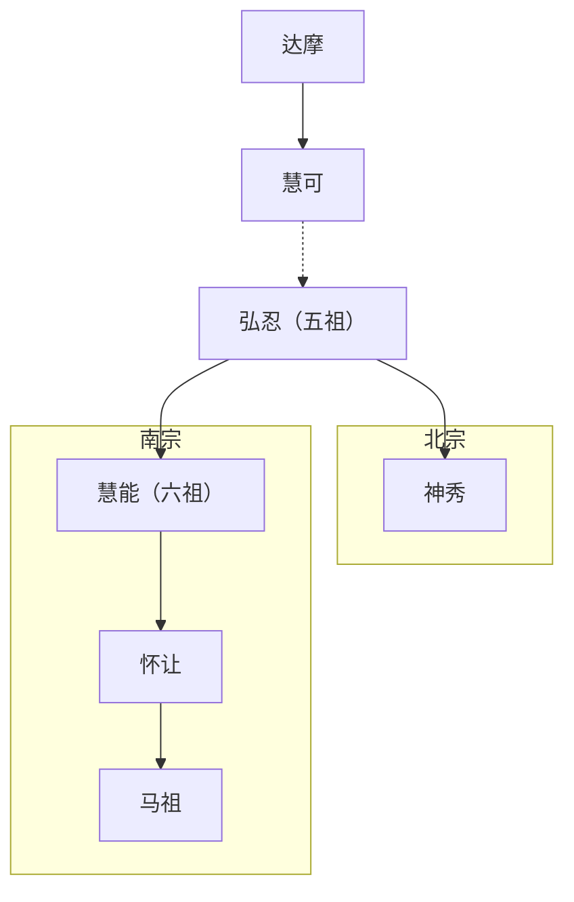

# 中国哲学简史
ISBN 978-7-301-21569-2 CIP 2012270133
本部编码 2026-7-B
___
## 目录
[第一章：中国哲学的精神](#第一章) 
[第二章：中国哲学的背景](#第二章) 
[第三章：各家的起源](#第三章) 
[第四章：孔子：第一位教师](#第四章) 
[第五章：墨子：孔子的第一个反对者](#第五章) 
[第六章：道家第一阶段：杨朱](#第六章) 
[第七章：儒家的理想主义派：孟子](#第七章) 
[第八章：名家](#第八章) 
[第九章：道家第二阶段：老子](#第九章) 
[第十章：道家第三阶段：庄子](#第十章) 
[第十一章：后期墨家](#第十一章) 
[第十二章：阴阳家和先秦的宇宙发生论](#第十二章) 
[第十三章：儒家的现实主义派：荀子](#第十三章) 
[第十四章：韩非和法家](#第十四章) 
[第十五章：儒家的形上学](#第十五章) 
[第十六章：世界政治和世界哲学](#第十六章) 
[第十七章：将汉帝国理论化的哲学家：董仲舒](#第十七章) 
[第十八章：儒家的独尊和道家的复兴](#第十八章) 
[第十九章：新道家：主理派](#第十九章) 
[第二十章：新道家：主情派](#第二十章) 
[第二十一章：中国佛学的建立](#第二十一章) 
[第二十二章：禅宗：静默的哲学](#第二十二章) 
[第二十三章：新儒家：宇宙发生论者](#第二十三章) 
[第二十四章：新儒家：两个学派的开端](#第二十四章) 
[第二十五章：新儒家：理学](#第二十五章) 
[第二十六章：新儒家：心学](#第二十六章) 
[第二十七章：西方哲学的传入](#第二十七章) 
[第二十八章：中国哲学在现代世界](#第二十八章)
___
## 第一章：中国哲学的精神
### 1. 哲学在中国文化中的地位
哲学：对于人生有系统的反思的思想
- 反思：以人生为对象（人生论、宇宙论、知识论）
- 反思的思想：凡种种“论”都是反思的思想的产物
- 当我们思知识或谈知识时，这个“思”“谈”本身就是知识

宗教：宗教=哲学+一定的上层建筑
- 每种大宗教的核心都有一种哲学
- 上层建筑：迷信、教条、仪式
  
“超道德的”价值：高于道德价值的价值，对于超乎现世的追求是人类先天的欲望之一
哲学满足了中国人对超乎现世的追求，他们在哲学里表达了，欣赏了超道德价值
中国哲学的功用，不在于增加积极的知识，而在于提高精神的境界
- 积极的知识：关于实际的信息
- 精神的境界：达到超乎现世的境界，获得高于道德价值的价值
### 2. 中国哲学的问题和精神
有各种的人，每种人都有那一种人所可能有的最高成就
人作为一个整体，就一个人是人来说所能达到的最高成就：成为圣人，达到个人与宇宙的同一
人欲达到这个同一，是不是必须离开社会，甚至必须否定“生”
- 出世：必须，必须脱离尘世罗网，必须脱离社会
- 入世：不必须，注重社会中的人伦世务，只讲道德价值，不会或不愿讲超道德价值

中国的哲学：既出世又入世
中国哲学的任务：将入世与出世这些互相对立的反命题统一成一个合命题
中国哲学的精神：求解决如何统一起来这个问题
一个人在理论上和行动上完成这个统一，就是圣人
圣人的人格：内圣外王
- 内圣：修养的成就，即最高的精神成就
- 外王：社会的功用，即实际政治的领袖

有最高精神成就的人按道理可以为王，而且最适宜为王
但对此又有两种观点
- 出世：违反他的意志，是被迫为此做出的重大牺牲
- 入世：处理日常人伦政务不是其分外之事

内圣外王说明哲学必定与政治思想不能分开
### 3. 中国哲学家表达自己的方式
惯用名言隽语，用比喻论证的形式表达自己的思想
因此明晰不足而暗示有余，这是一切中国艺术的理想
中国艺术的理想也有其哲学背景
### 4. 语言障碍
富于暗示，因此难以翻译
___
[返回目录](#目录)
___
## 第二章：中国哲学的背景
### 1. 中华民族的地理背景
中国是大陆国家，古代中国人以为，他们的国土就是世界
### 2. 中华民族的经济背景
中国是大陆国家，中华民族以农业为生
在农业国，土地是财富的根本基础，所以贯穿在中国历史中，社会、经济的思想和政策的中心总是围绕着土地的利用和分配
“本”“末”之别：
- 本：农业，农业关系到生产
- 末：商业，商业只关系到交换

在能有交换之前，必须先有生产，农业是生产的主要形式，所以在中国历史中，社会、经济的政策、理论都是企图“重本轻末”
“士”：虽然本身并不实际耕种土地，可是由于他们通常是地主，他们的命运也系于农业
- 他们对宇宙的反应，对生活的看法，本质上就是“农”的反应和看法
- 他们所受的教育，他们就有表达能力，把实际耕种的“农”所感受而自己不会表达的东西表达出来，这种表达采取了中国的哲学、文学、艺术的形式
### 3. “上农”
- 农：朴实，财产难以搬动，国家有难不离不弃
- 商：诡计多、自私，财产简单易转运，国家有难逃往国外

不论是经济上还是生活方式上，“农”比“商”高尚
人们的生活方式受其经济背景的限制，他对农业评价的价值又表明他本人受到他自己时代经济背景的限制
### 4. “反者道之动”
在自然界和人类社会的任何事物，发展到了一个极端，就会反向另一个极端
为中庸之道提供了主要论据
### 5. 自然的理想化
道家的人把原始社会的简朴加以理想化，而谴责文化，把儿童的天真加以理想化，而谴责知识
赞美自然，热爱自然：圣人的最高修养、最高成就在于将他自己和整个自然即宇宙同一起来
### 6. 家族制度
- “士”“农”只有依靠土地而生，而土地是不可移动的
- 他只有生活在祖祖辈辈生活的地方，也是他的子子孙孙继续生活的地方，即由于经济的原因，一家几代人都要生活在一起
- 这样就发展起来了中国的家族制度，它无疑是世界上最复杂、组织的很好的制度之一

传统的五种社会关系：
- 家族关系：父子，兄弟，夫妇
- 非家族关系：君臣，朋友

祖先崇拜：居住在某个地方的家族，所崇拜的祖先是这个家族中第一个将全家定居在此地的人，这样它的成为了这个家族团结的象征，这样的象征是一个又大又复杂的组织必不可少的
儒家学说大部分是论证这种社会制度的合理，或者这种制度的理论说明
### 7. 入世和出世
- 儒家：强调人的责任，“游方之内”，更入世
- 道家：强调人内部自然而发的东西，“游方之外”，更出世一些
- 新儒家：儒家的人使儒家更靠近道家
- 新道家：道家的人使道家更靠近儒家
### 8. 中国的艺术和诗歌
- 儒家：以艺术为道德教育的工具
- 道家：对于精神自由运动的赞美，对于自然的理想化
### 9. 中国哲学的方法论
概念：
- 用直觉得到的概念：表示某种直接领悟的东西，它的全部意义是某种直接领悟的东西给予的
   - 已区分的审美连续体的概念
   - 不定的或未区分的审美连续体的概念
- 用假设得到的概念：出现在某个演绎理论中，它的全部意义是由这个演绎理论的各个假设所指定的

审美连续体：认识者和被认识者所形成的一个整体
中国哲学中，已区分的审美连续体的概念和未区分的审美连续体的概念，基本上是“农”的概念，以对于事物的直接领悟作为他们哲学的出发点
### 10. 海洋国家和大陆国家
- 海洋国家：
   - 以城市共同利益为基础，围绕城邦组织其社会
   - 社会组织不是独裁的，因为市民在同一个阶级之内，没有任何道德上的理由认为某个人应当比别人重要，或高于别人
   - 惯于变化，不怕新奇，鼓励制造货物的工艺创新
- 中国：
   - “家邦”
   - 社会组织是独裁的、分等级的，一家之内父的权威天然的高于子的权威
   - 农的生活方式：顺乎自然，赞美自然，谴责人为，不想变化，也无从想象变化

“知者乐水，仁者乐山；知者动，仁者静；知者乐，仁者寿”
### 11. 中国哲学中可变和不可变的成分
任何民族或任何时代的哲学，总是有一部分只相对于那个民族或那个时代的经济条件具有价值，但是总有另一部分比这种价值更大一些，不相对的那一部分具有长远的价值
___
[返回目录](#目录)
___
## 第三章：各家的起源
### 1. 司马谈与“六家”
- 阴阳家：宇宙生成论，阴阳的结合以及相互作用产生一切宇宙
- 儒家：传授古代典籍的教师，古代文化遗产的保存者
- 墨家：在墨子的领导下，有严密的组织，严格的纪律
- 名家：名实之辩
- 法家：政治家们主张的政府必须建立在成文的法典的基础上，而不是儒者强调的道德惯例上
- 道德家：把形上学和社会哲学围绕着一个概念集中起来，即“无”、“道”，“道”集中于自然个体之中，作为人的自然德行，即“德”
### 2. 刘歆及其关于各家起源的理论
十家：阴阳家、儒家、墨家、名家、法家、道德家、纵横家、杂家、农家、小说家
在周朝前期的社会制度解体之前，官与师不分，某个政府部门的官吏也同时就是与这个部门有关的一门学术的传授者
周朝后期的几百年，王室丧失了权力，政府的官吏也迅速丧失职位，流落各地，转而以私人身份教授他们专门的知识
各个学派正是由这种官师分离中产生出来的
### 3. 对刘歆理论的修正
- 君子：土地的所有者，既是领地的政治、经济的主人，也是居民的政治、经济的主人，封建主阶级的“共名”
- 小人：“庶民”，普通人民群众，这些人是封建主的农奴，平时为君子种地，战时为君子打仗

有机会受教育的少数人，也都是贵族的成员
封建主的“家”不仅是政治、经济权力的中心，也是文化的中心
随着整个制度的解体，各门学术原来的官方代表人物流落在普通庶人之中，以私人身份靠他们专门的才能或技艺为生，变成职业教师，出现师与官的分离
“六家”的思想就是从这六种人之中产生的
___
[返回目录](#目录)
___
## 第四章：孔子：第一位教师
### 1. 孔子和《六经》
孔子是第一个以私人身份教授了大量学生的人，他的思想完整的保留在《论语》中，是儒家创建人
对于《六经》，孔子既不是著者，也不是编者
《六经》是过去的文化遗产，是周代封建制前期数百年贵族教育的基础
### 2. 孔子作为教育家
孔子期望他的弟子能成为对国家，对社会有用的“成人”，所以教给他们以经典为基础的各种知识，他的基本任务是向弟子们解释古代文化遗产，即“述而不作”
### 3. 正名
一个秩序良好的社会最重要的事情就是正名，即名实相等
每个名都有一定的含义，这种含义就是此名所指的一类事物的含义
每个名都有一定的责任和义务，负有这些名的人必须负有相应的责任或义务
### 4. 仁、义
- 义：事之宜，应该、绝对的命令
   - 社会中的每个人都有一定的应该做的事，必须为做而做的事，因为做这些事在道德上是对的
   - 义与利是直接对立的
- 仁：爱人，义务的本质
   - 真正爱人的人是能够履行社会义务的人
   - 有时候仁不光指某一种特殊德性，而是指一切德性的总和，此时“仁人”与“全德之人”同义
### 5. 忠、恕
如何实行“仁”：
- 忠：推己及人，尽己为人
- 恕：己所不欲，勿施于人

絜矩之道（忠恕之道）：以本人自身为尺度，来调节本人的行为
忠恕之道就是仁道，所以行忠恕就是行仁，行仁就必然履行在社会中的道德和义务，这就包括了义的性质
因而忠恕之道就是人道德生活的开端和终结
### 6. 知命
“无所为而为”：一个人做他应该做的事，纯粹是由于这样做在道德上是对的，而不是出于在这种道德强制之外的任何考虑
天命：天的命令或天意
要取得外在的成功，总是需要这些条件的配合，但是这种配合，整个的看来却在我们能控制的范围之外，所以我们能做的莫过于一心一意的尽全力去做我们知道是我们应该做的事，而不计较成败
知命：承认世界本来存在的必然性，这样，对于外在的成败也就无所萦怀，如果我们做到这一点，在某种意义上，我们也就永不失败
### 7. 孔子的精神修养发展过程
- 十有五而志于学：即志于道，道即提高精神世界的真理
- 三十而立：“立于礼”，懂得了礼，言行都很得当
- 四十而不惑：“知者不惑”，他这是已经成为了知者
- 五十而知天命，六十而耳顺：认识到天命并且能够顺乎天命
- 七十而从心所欲：所作的一切都自然的正确，用不着有意的指导，代表着圣人发展的最高阶段
### 8. 孔子在中国历史上的地位
- 生前：普通教师
- 死后：逐渐被认为是“至圣先师”
- 公元前2世纪：接受天命，继周而王
- 公元前1世纪：人群中活着的神
- 公元1世纪初：“至圣先师”
- 民国之后：一位伟大的教师
___
[返回目录](#目录)
___
## 第五章：墨子：孔子的第一个反对者
### 1. 墨家的社会背景
- 儒家：上层或中上层，重礼乐
- 墨家：下层阶级，礼乐奢侈，无实用

墨家哲学核心：
- 批判传统制度及其辩护者孔子和儒家
- 对游侠阶级的职业道德的发挥和辩护

墨者：一个能够进行军事行动的团体，纪律及其严格，首领称为“巨子”，对于所有成员有决定生死的权威
墨子及其门徒与普通游侠的区别：
1. - 普通游侠：只要得到酬谢或者受到封建主的恩惠，那就不论什么仗都打
   - 墨家：强烈反对侵略战争，只愿意参加严格限于自卫的战争
2. - 普通游侠：只限恪守职业道德的条规，无所发挥
   - 墨家：详细阐明了这种职业道德，论证他是合理的，正当的
### 2. 墨家对儒家的批评
1. 儒者不相信天鬼存在，“天鬼不悦”
2. 儒者坚持厚葬，父母死后实行三年之丧，因此浪费人民的财富和精力
3. 儒者强调音乐，造成同样的后果
4. 儒者相信前定的命运，造成人民懒惰，把自己委之命运
### 3. 兼爱
“有福同享，有难同当”，天下的每一个人都应当同等的，无差别的爱别的一切人
### 4. 天志和明鬼
爱别人是一种个人保险或投资，可绝大多数人看不到这种长期投资的价值
为劝导人们实行兼爱，墨子进行了许多宗教的、政治的制裁：
- 存在天帝，天帝爱人，天帝的意志是一切人要彼此相爱
- 天帝经常监察人的行动，特别是统治者的行动
- 他以祸惩罚那些违反天意的人，以福奖赏那些顺从天意的人
- 除了天帝，还有许多小一些的鬼神和天帝一样
### 5. 一种似是而非的矛盾
- 儒家：强调丧礼的祭祀，但不相信鬼神的存在
- 墨家：相信鬼神的存在，可是同时反对丧葬和祭祀的缛礼

强调的内容与反对的原因无直接联系，故不矛盾
### 6. 国家的起源
国君的权威有两个来源：人民的意志和天帝的意志
- 天帝的意志：国君的主要任务是监察人民的行动，奖赏那些实行兼爱的人，惩罚那些不实行兼爱的人
   - 为了做到这一点，他的权威必须是绝对的
   - 国家的职能是一同国之义，一国之内只能有一义存在，这一义必须是国家自身确定的一义
   - 如果存在别的义，就会返回到“自然状态”，除了天下大乱，一无所有
- 人民的意志：国君最初是由人民意志设立的，是为了把他们从无政府的状态中拯救出来
   - 人民接受这样的权威，并不是选中了它，而是由于他们无可选择
___
[返回目录](#目录)
___
## 第六章：道家第一阶段：杨朱
### 1. 早期的道家和隐者
- 隐者：“欲洁其身”的个人主义者，败北主义者，认为这个世界太坏，无可救药
- 道家：退隐了并提出一个思想体系，赋予自己的行为以意义

杨朱思想的真相已无记载，只能从别人的著作中䌷绎出来
### 2. 杨朱的基本观念
- “为我”：“拔一毛而利天下，不为也”
- “轻物重生”：“不以天下大利易其胫一毛”
### 3. 杨朱基本观念的例证
- 轻物重生：《庄子·逍遥游》“尧让天下于许由······予无所用天下为”
- 为我：“禽子问杨朱曰······奈何轻之乎”
### 4. 《老子》、《庄子》中的杨朱思想
轻物重生的原因：即使失了天下，也许有朝一日能够再得，但是一旦死了，就永远不能再活
全生的方法：一定不能多为恶，但是也一定不能多为善，他一定要力求无用，但是到头来无用对于他有大用
### 5. 道家的发展
出发点：全生避害
三个阶段：
1. 杨朱的观念：“避”，但总有些恶无法避开
2. 《老子》的大部分思想：揭示宇宙变化的规律，，遵循规律调整自身的行动，使事物转向对他有利，但事物的变化中总有些没有预料到的因素
3. 《庄子》的大部分思想：“齐生死”、“一物我”，从更高的观点看事物，就能够超越现实的世界，但从更高的观点看事物也意味着取消自我

先秦道家都是为我的，只是后来的发展，使这种为我走向了反面，取消了它自身
___
[返回目录](#目录)
___
## 第七章：儒家的理想主义派：孟子
### 1. 人性善
孟子回答的问题：为什么每个人都应该“推己及人”
人性的成分：
- 种种善的成分
- 其他成分：本身无所谓善恶，若是不加以控制，就会走向恶，这是人与其他动物共有的成分，代表人生命中的动物方面

四端：恻隐之心、羞恶之心、辞让之心、是非之心
四种常德：仁、义、礼、智
一切人的本性中都有此“四端”，若充分扩充，就变成四种“常德”
这些“德”，若不受外部阻碍，就会从内部自然发展，即“扩充”
人之所以异于禽兽，就在于有此“四端”，只有通过发展“四端”，才能真正才成为“人”
### 2. 儒墨的根本分歧
- 墨家：爱无差等，兼爱从外部人为的附加于人
- 儒家：爱有差等，仁是从人性内部自然的发展出来的
### 3. 政治哲学
人之所以异于禽兽，在于有人伦即建立在人伦上的道德原则，国家和社会起源于人伦
人只有在人伦中，才能得到充分的实现或发展
国家是一个道德的组织，国家的元首必须是道德的领袖，君如果没有圣君必备的道德条件，人民在道德上就有革命的权利
如果圣人为王，他所行的治道就叫做王道
- 王道：通过道德的指示教育，作用在“德”
   - 经济基础在于平均分配土地——井田制
   - 使人人受到一定的教育，懂得人伦的道理
- 霸道：暴力的胁迫，作用在“力”

王道使圣人恻隐之心的结果
### 4. 神秘主义
宇宙的实质是道德的宇宙，人的道德原则也就是形上学的原则
天民：一个人如果能知天，他就不仅是社会的公民，而且是宇宙的公民，即“天民”
- 天爵：在价值世界里才能够达到的境地
- 人爵：人类世界里纯世俗的概念

一个人充分发展他的性，就不仅知天，而且同天
“浩然之气”：关系到人和宇宙的东西，是一种超道德价值，与宇宙同一的人的气
养浩然之气的方法：
- 知道：知道提高精神境界的道
- 集义：经常做一个“天民”在宇宙中应该做的事

一个人如果“知道”并且长期“集义”，浩然之气就会自然而然的产生，丝毫的勉强也会坏事
浩然之气就是充分发展人性，而每个人的人性都是相同的
___
[返回目录](#目录)
___
## 第八章：名家
### 1. 名家和辩者
名家的人在古代以“辩者”闻名：
- 邓析：对于法律条文咬文嚼字，在不同的案件中做出随意不同的解释，开始对于名进行分析
- 惠施：“无厚”学说，强调实的相对性
- 公孙龙：“坚白”学说，强调名的绝对性

名家的精神：只注重“名”，不注重实
### 2. 惠施的相对论
惠施“十事”：
1. 至大无外，谓之大一，至小无内，谓之小一：
   - 在经验中，大东西、小东西都是相对的大、相对的小，我们不可能通过实际经验来决定什么是最大的，什么是最小的
   - 但是我们能够独立于经验，即离开经验下定义，就都是绝对的、不变的概念
   - 由此看出，实际的具体事物的性质、差别都是可变的、相对的
2. 无厚不可积也，其大千里：没有厚度的东西，也可以很长很宽
3. 天与地卑，山与泽平：高低为之高低，只是相对的
4. 日方中方睨，物方生方死：实际事物的一切都是可变的，都是在变的
5. 大同而与小同异，此之为小同异。万物毕同毕易，此之为大同异
   - 人都是人，所以所有人都相同，人都是动物，所以所有人都相同
   - 但他们作为人的相同大于作为动物的相同，即“小同异”
   - “万有”为一个普遍的类，就由此认识到万物都相同，但是我们若把每一个物当作一个个体，又由此认识到每个个体都有自己的个性，因而与他物相异，即“大同异”
   - 由于我们既可以说万物彼此相同，又可以说万物彼此相异，因为他们的同和异都是相对的，即“合同异之辩”
6. 南方无穷而又穷：无穷与有穷也是相对的
7. 今日话越而昔来：今昔的相对性
8. 连环可解也：毁坏与建设是相对的
9. 我知天下之中央，燕之北，越之南是也：天下无方，故所在为中；循环无端，故所在为始也
10. 氾爱万物，天地一体也：万物是相对的，都是不断变化的，没有绝对的不同，万物一体，因而应当泛爱万物，不加区别
### 3. 公孙龙的共相论
- 《白马论》：白马非马
   1. “马”“白”“白马”三者内涵不同，分别为一种动物，一种颜色，一种颜色＋一种动物
   2. “马”“白马”外延不同，“马”的外延包括一切马，不管其颜色的区别，“白马”的外延只包括白马，有相应的颜色区别
   3. “马”的共相和“白马”的共相不同，即马作为马与白马作为白马不同
- 《坚白论》：离坚白
   1. 坚而白的石，只有“坚石”或“白石”，没有“坚白石”，因为感觉白时不能感觉坚，感觉坚时不能感觉白
   2. 坚白作为独立的共相，完全独立于坚白石以及一切坚白物的存在
- 《指物论》：
   - “物”表示具体的个别的物，“指”表示抽象的共相
   - 一个普通名词，以某类具体事物为外延 ，以此类事物的共有属性为内涵，但一个抽象名词只表示属性或共相
### 4. 惠施学说、公孙龙学说的意义
发现超乎形象外的世界
- 形象之内的世界：存在于实际世界之内的某种经验的对象
- 形象之外的世界：不是经验的对象

道家是名家的反对者，又是名家真正的继承者
___
[返回目录](#目录)
___
## 第九章：道家第二阶段：老子
### 1. 老子其人和《老子》其书
传统说法并没有说老子写过《老子》
### 2. 道、无名
“超乎形象”的一切事物，可能“有名”，但无名一定超乎形象
“道”即“无名”，一切有名都是无名而来
有了天地万物，就有天地万物之名
道无名，所以不可言说，但我们还是希望对于道有所言说，只好勉强给它某种代号，即“道”，其实“道”根本不是“名”
永远不去的名是常名，这样的名其实根本不是名
“道”是万物所从生者，它必然不是万物中一物，故无名，朴
### 3. 自然的不变规律
虽然万物都永远可变，在变，可是万物变化所遵循的规律本身不变
其中最根本的是“物极必反”，超过极限，就会走向反面
一个人前进的极限是相对于他的主观感觉和客观环境而存在的，一定的活动也相对于客观环境而有其极限
### 4. 处世的方法
“袭明”：我们应该知道自然规律，根据他们来指导个人的行动
人“袭明”的通则是：想要得到些东西，就要从其反面开始；想要保持什么东西，就要在其中容纳些与其相反的东西
用这样的方法，一个谨慎的人就能够在世上安居，并能够达到他的目的
“德”：老子认为，道生万物，在这个过程中，每个个别的事物都能够从普遍的道中获得一些东西，即“德”
   - 德可以是道德的，也可以是非道德的
   - 道是万物之所从生者，德是万物之所以为万物者

“无为”：一个人把他的作为严格限制在必要的，自然的范围之内
- 必要的：指对于达到一定目的是必要的，决不可以过度
- 自然的：指顺乎个人的德而行，不做人为的努力，以“朴”为生活的指导原则

顺德而行的生活已经超越了善恶的区别
人们丧失了原有的“德”，正是因为他们欲求太多、知识太多
### 5. 政治学说
只有圣人能够治国，而且应当治国
圣王的职责是不做事，应当完全无为
圣王的第一个行动是废除一切，消除乱天下的一切根源，然后无为而治
“无为而无不为”：
- 无为：国君应当无为，让人民做他们能做的事
- 无不为：由无为最终产生的后果

孩子只有有限的知识和欲望，他们距离原有的德不远，他们的淳朴和天真，是每个人应当保持的特性，即“愚”
圣人的愚是大智，是精神的创造
___
[返回目录](#目录)
___
## 第十章：道家第三阶段：庄子
### 1. 庄子其人与《庄子》其书
《庄子》不全是庄子写的
### 2. 获得相对幸福
获得幸福有不同的层级：
- 相对幸福：自由发展我们的自然本性，充分发挥我们自然的能力“德”
- 绝对幸福：通过对事物的自然本性有更高一层的理解得到
- 顺乎天（自然）：一切幸福和善的根源
- 顺乎人（人为）：一切痛苦和恶的根源

万物的自然本性不同，其自然能力也各不相同，但当他们充分而自由地发挥其自然能力的时候，它们都是同等的幸福
### 3. 政治、社会哲学
一切法律、道德制度、政府的目的都是立同禁异，把自然自发的东西变成人为的
反对通过正规的政府机器治天下，主张不治是最好的治
老子和庄子对不治的原因的观点的区别：
- 老子：反者道之动
- 庄子：越是统治，越是得不到想要的结果
### 4. 情和理
畏惧死亡、忧惧死亡的到来都是人类不幸的主要来源
不过这种忧虑和畏惧可以由于对事物本性有真正理解而减少
别人感到哀伤的范围就是他们受苦的范围，感情造成精神痛苦，但是人利用理解的作用可以削弱感情
圣人对万物的本性有完全的理解，所以无情，不为情扰乱
用这种方法，他就不依赖外界事物，因而他的幸福也不受外物的限制，即绝对幸福
### 5. 获得绝对幸福的方法
强调万物自然本性的相对性，以及与宇宙的同一，要达到这种同一，需要更高层次的理解
圣人绝对幸福，因为他超越了事物的普通区别，也超越了自己与世界的区别
### 6. 有限的观点
- 地籁：风吹起来有种种不同的声音
- 人籁：人类社会所说的“言”
- 天籁：地籁和人籁的合称

每个人都从他特殊的有限的观点所形成的意见，必然是片面的
但大多数人不知道他们自己的意见是根据有限的观点，总是以自己为是，以他人为非
是非的概念都是每个人各自建立在自己有限的观点之上，所以这些观点都是相对的
对于同一个事物有多个观点，因此我们需要假定一个更高的观点，如果我们接受了这个更高的观点，就没有必要自己来决定孰是孰非
### 7. 更高的观点
“照之以天”：以道的观点看待事物
- 每物就刚好是每物那个样子
- 万物虽不相同，但都成一个整体
- 区别都是相对的
### 8. 更高层次的知识
不知之知：有些事物是不可思议，不可言说的
“一”是不可言说，不可思议的，否则便不是“一”
“无意”是得道之人所住之境，这样的人不仅有“一”，而且已经体验到“一”，有绝对的幸福
这是用取消问题的方法来解决先秦道家固有的问题
圣人与宇宙同一，宇宙永远存在，故圣人也永远存在
### 9. 神秘主义的方法论
与“大一”合一，圣人必须超越并且忘记事物的区别，做到这一点的方法是“弃知”
- 无知：原始的无知状态
- 不知：先经过有知的阶段之后才达到的，是精神的创造，即“忘”
___
[返回目录](#目录)
___
## 第十一章：后期墨家
### 1. 关于知识和名的讨论
人都有所以知的能力，但是仅有这种能力，还未必就有知识，因为要有知识，认知能力必须与认知对象接触
认知能力接触了认知对象，能够得到他的形象，才成为知识
通过感官传入外界事物印象，还需要心加以解释
- 知识分类
   - 按来源：
      - 来自认知者亲身经验
      - 来自权威的传授（得自传闻或文献）
      - 来自推论的知识
   - 按认识的各种对象：
      - 名的知识
      - 实的知识
      - 相合的知识：哪个名与哪个实结合
      - 行为的知识：如何做一件具体的事的知识

名的三类：
- 达名：一切“实”所用
- 类名：一类“实”所用
- 私名：此“实”所用
### 2. 关于“辩”的讨论
辩的目的和功用：明是非之分，审治乱之纪，明同异之处，察名实之理，处利害，决嫌疑焉，摹略万物之然，论求群言之比
辩的方法：以名举实，以辞抒意，以说出故，以类取，以类予
辩的七种方法：
1. 或：特称命题
2. 尽：全称命题
3. 假：假言命题，假设一种现在还没有发生的情况
4. 效：取法，所效的就是取以为法的（演绎推理）
   - 若原因与效相合，就是真的原因
   - 若原因与效不合，就不是真的原因
5. 辟：用一事物解释另一事物
6. 侔：系统而详尽的对比两个系列的问题
7. 援：“你可以这样，为什么我独独不可以这样”
8. 推：将相同的东西，像归于已知者一样，归于未知者（归纳推理）

- “小故”：必要原因
- “大故”：必要而充足原因
### 3. 澄清兼爱说
后期墨家遵循墨子功利主义哲学的传统，主张人类一切行为的目的在于趋利避害，人类一切行为的规则是“利之中取大，害之中取小”，利是义的本质
后期墨家对利和害的定义
- 利：所得而喜也
- 害：所得而恶也

以利的定义为基础，后期墨家对各种道德的定义：
- 忠：以为利而强君也
- 孝：利亲也
- 功：利民也（最大多数的最大幸福）

人总会爱一些人，不能说明他爱一切人，但在否定方面，他若害了某些人，哪怕是他自己的孩子，凭这一点就可以说他不爱人
### 4. 辩护兼爱说
两个反对的意见：
1. 无穷害兼：世界上人的数目无穷，一个人不可能爱所有人
后期墨家的解释：
   - 人若没有充满无穷的地区，说明人数有穷
   - 人若充满无穷的地区，无穷的地区应该是有穷的，则历尽所有地区即可
2. 杀盗，杀人也：爱所有人，故不应该有杀盗的刑罚
后期墨家的解释：
   - 《小取》中：“白马，马也······杀盗，非杀人也，无难矣”
### 5. 对其他各家的批评
- 对惠施：
   - 万物毕同：类同
   - 天地一体：体同
   - 类同和体同不是一个同，故不正确
- 对公孙龙：坚白不相互排斥，而是相互渗透
- 对老子：学教相关
   - 以“学无益”为教，说明教有益，进而说明学有益，出现矛盾
- 对庄子：
   - 说话的时候，人们所说的不是相同就是相异，有相异，就有“辩”，没有人获胜，就无辩（辩就是其中有人说是如此，另有人说不是如此，谁说的对就谁获胜）
   - 其言成立，至少证明他说的是正确的，否则其言不成立
   - 只要有知识，就有关于知识的讨论
   - 谴责批评就是谴责自己的谴责
___
[返回目录](#目录)
___
## 第十二章：阴阳家和先秦的宇宙发生论
### 1. 六种术数
术数：以迷信为基础，但企图以积极的态度解释自然，通过征服自然使之为人类服务
1. 天文 
2. 历谱
3. 五行 
4. 蓍龟
5. 杂占
6. 形法

方士：这六种术数的专家
宇宙结构和起源的两种思想路线：
- 阴阳家：五行
- 儒家的《易经》：阴阳
### 2. 《洪范》所讲的五行
五行：五种动态的相互作用的力
庶征：
- 各种象征：雨、阳光、热、寒、风
- 它们如果按正常秩序来的就很充足，各种植物就会长的很茂盛而丰饶，其中任何一种如果极多或极少，就会造成灾害

天人感应论：人类世界和自然世界是相互关联的
- 目的论：异常的自然现象，代表着“天”给君主的警告
- 机械论：全宇宙是一个机械结构，一部分出问题必然影响另一部分
### 3. 《月令》
宇宙的结构是时空的
|空间|时间|五行|
| :---: | :---: | :---: |
|南方|夏季|火德盛|
|北方|冬季|水德盛|
|东方|春季|木德盛|
|西方|秋季|金德盛|
|中央|夏秋之交|土德盛|

人们应当按月做事，与自然力保协调
### 4. 邹衍
公元前3世纪阴阳家的代表人物
### 5. 一套历史哲学
四季顺序：木、火、土、金、水、木···相生
朝代顺序：土、水、火、金、木、土···相克
### 6. 《易传》中的阴阳学说
阴阳二道相互作用，产生一切宇宙现象
八卦：
- 连线：阳爻
- 断线：阴爻
- 每卦由三根连线或断线组成
- 任取两卦结合起来，得六十四卦

阳数奇，阴数偶，乾为纯阳，坤为纯阴，阴阳交合生其余六卦
___
[返回目录](#目录)
___
## 第十三章：儒家的现实主义派：荀子
### 1. 人的地位
凡是善的，有价值的东西都是人努力的产物
宇宙的三种势力：“天”“地”“人”，都有各自特殊的职责
人的职责是利用天地提供的东西，以创造自己的文化
### 2. 人性的学说
人性必须加以教养，凡是没有经过教养的东西是不会是善的
人不仅生来毫无善端，相反的倒是具有实际的恶端，即求恶求利的欲望
除了恶端，人同时还有智能，可以使人向善
### 3. 道德的起源
1. 人们不可能没有某种社会组织而生活
   1. 因为人们要生活好些，有必要合作互助
   2. 因为人们需要联合起来，才能制服其他动物
      - 由于这两点原因，人们要用一定的社会组织，为了有社会组织，人们需要行为的规则，即“礼”
   3. 人类的根本烦恼：所欲与所恶为同一物
      - 为了人们在一起生活而无争，各人在满足自己欲望方面必须接受一定的限制，即“礼”
      - 遵礼而行，即道德
2. 自然和人为的区别
   - 人应当由社会关系和礼
   - 人要有道德不是因为人无法避开它，而是因为人应该具备它

礼的三种意义：
1. 礼节、礼仪：使人文雅，使人感情净化雅化
2. 社会行为准则
3. 调节功能：调节人的欲望
### 4. 礼、乐的学说
人心的两方面：情感的、理智的
人不能光靠知识生活，还需要情感的满足
- 在决定对待死者的态度：丧祭之礼，采取介于“希望”和“知道”中间的方式
- 迷信和神话等宗教成分：转化为诗，自觉的自欺

为求雨而祭祷，为做出重大事情而占卜，都不过是表示我们的忧虑，如此而已
而音乐是教育的工具
### 5. 逻辑理论
知：人所有的认知能力
智：认识能力与外物相结合，即知识
认知能力的两个部分：
- 天官：耳目等，接受印象
- 心：解释印象并与之意义

名的起源：伦理的、逻辑的
名的逻辑功用：给予事物的同异
名的分类：
- 共名：推理的综合过程的产物
- 别名：分析过程的产物

一切名都是人造的，名若还是在创立过程中，为什么这个实非要用这个名而不用别的名，这并无道理可讲
但是一定的名一旦经过约定应用于一定的实，那就只能附属于这些实
创立新名，制定意义，是君主及其政府的职能
### 6. 论其他几家的谬误
1. 惑于用名以乱名：墨辩“杀盗非杀人也”
2. 惑于用实以乱名：个别例外否认一切规律，如惠施“山渊平”
3. 惑于用名以乱实：名不相等，但实相等

出现这些谬误的原因：今圣王没，圣王会引领人们走向正道，故无争辩
这体现出动乱的时代精神：渴望政治统一，结束动乱的时代
___
[返回目录](#目录)
___
## 第十四章：韩非和法家
### 1. 法家的社会背景
西周封建社会的两条原则：礼、刑
中国封建社会的结构比较简单，一切都是靠个人影响和个人接触维持的
封建制度逐渐解体，原有的固定性被打破，国家需要强有力的政府
法家所讲：组织领导的理论和方法，走极权主义路线
### 2. 韩非：法家的集大成者
三种思想路线：
1. 慎到：重“势”，权力，权威
2. 申不害：重“术”，办事，用人的方法和艺术（政治手腕）
3. 商鞅：重“法”，法律，法制

韩非：三者缺一不可
### 3. 法家的历史哲学
- 历史退化论：中国人尊重过去的经验，来自于农业人口的思想方式
- 把历史看作变化的过程：古人有德是条件使然，而不是任何天生的高尚道德，全新的情况出现全新的问题，只有用全新的方案才能解决
### 4. 治国之道
- 立法：用法用势治民
   - 立法的才能和知识
   - 督察百姓的行为
   - 以上两者合起来即为“术”
- 有术：用人之术，得到适当的人替他做事，即循名责实
   - 实：担任政府职务的人
   - 名：这些人的头衔
   - 君主的责任：把某个特殊的名加在某个特殊的人
   - 君主二柄：赏罚，来源于人性的趋利避害

性恶：人性是人性的原样，法家的治道才有效
### 5. 法家和道家
- 同：无为而无不为，君主应当无为，让别人替他无不为
- 异：
   - 道家：人本来是完全天真的，主张绝对的个人自由
   - 法家：人本来是完全邪恶的，主张绝对的社会控制

道家对法家的批评：法家的治道需要君主公正无私，只有圣人能实现这个要求
### 6. 法家和儒家
- 同：无阶级的区别
- 异：
   - 儒家：以礼以德，把平民的行为标准提高到用礼的水平，理想主义
   - 法家：以法以刑，把贵族的行为标准降低到用刑的水平，现实主义
___
[返回目录](#目录)
___
## 第十五章：儒家的形上学
### 1. 事物的原理
- 道家的“道”：统一的“一”，由此产生万物的生成和变化
- 《易传》的道：共相，每一类道都以一个名来表示，每个人都应该合乎理想地依照这些不同的名来行动

卦、爻：共相的道的图像，代表了宇宙中的所有道
变项的作用：代替一类事物或若干类事物
一个事物，按某种条件归入某类，就可以代入含有某变项的公式，即卦辞
### 2. 万物生成的“道”
一阴一阳谓之道，生成万物
每个事物在一个意义上是阳，在另一个意义上为阴，这要根据它与其他事物的关系而定
生万物的形上学的阳只能是阳，生出万物的形上学的阴只能是阴
### 3. 万物变化的“道”
宇宙永远在变化过程中
事物要臻于完善，若要保持完美状态，它的运行就必须在恰当的地位，恰当的限度，恰当的时间，即“正”、“中”
人的自然倾向是太过
六十四卦顺序安排的含义：
1. 宇宙中的一切，包括自然界，人类社会形成一个自然序列的连续链条
2. 在演变过程中，每个事物都包含自己的否定
3. 在演化过程中，“物不可穷也”

要取得胜利，注意不要过分的胜利
要避免丧失某物，在此物中补充一些与它相反的东西
而谦卑为美德
### 4. 中和
中：恰到好处
时间在恰到好处中是重要因素
和：调和不同以达到和谐的统一
和是中的结果，中是用来调和那些搞不好就会不和的东西的，中的作用是达到和
这种和若不只是包括全人类，而且弥漫全宇宙，就叫做“太和”
### 5. 庸常
庸：普通而平常
普通而平常的东西，正是因为他们重要，所以没有人能够没有它，如人伦和道德
教的作用：使人把事实上已经不同程度在做的事情做完全，即明而诚
### 6. 明诚
一个人若是明白了日常生活中普通而平常的活动的一切意义，他就已经是圣人，因为完全明白等价于做到
- 成己：尽其性，即尽其受之于天者
- 助人：赞天地之化育

完全明白了这些意义，就可以与天地参
- 明：完全明白这些意义
- 诚：如此与天地参

只需要做平常的事，做的恰到好处，而且明白其全部的意义，这样做就可以达到合内外，这不仅事人与天地参，而且是人与天地合一
通过推广仁爱，将人的精神提高到超脱寻常的人我和物我分别
___
[返回目录](#目录)
___
## 第十六章：世界政治与世界哲学
### 1. 秦统一前的政治状况
国家在对外关系中遵循平时和战时的礼
国家之间形成联盟：合纵连横
### 2. 中国的统一
统一的愿望早就存在
中国人一直在一个天下，一个政府下生活，只有若干短暂的时期是例外
### 3. 《大学》
三纲领：
1. 明明德
2. 亲民：明明德的方法
3. 止于至善：明明德的最后完成

八条目：
- 修身
- 格物、致知、诚意、正心：修身的道路和手段
- 齐家、治国、平天下：修身达到最后完成的道路和手段

明明德是修身的内容，是儒家学说的中心
一个人仅仅需要作为国家的一分子，如此诚实的尽力而为
### 4. 《荀子》的折中趋势
哲学家的“见”和“弊”是联在一起的，他的哲学的优点同时是它的缺点
### 5. 《庄子》的折中趋势
全部真理：内圣外王之道，对它的研究成为方术
儒家知“道”之末，而不知其本，道家知道之本而不知其末
两家结合才是全部真理
### 6. 司马谈、刘歆的折中主义
司马谈：道家兼采各家一切精华，居于各家之上
刘歆：舍短取长，通万方之略
哲学家试图实现思想统一，折中主义只是初步尝试，但这只是许多成分不同的“大杂烩”
___
[返回目录](#目录)
___
## 第十七章：将汉帝国理论化的哲学家：董仲舒
### 1. 阴阳家和儒家的混合
- 阴阳家：天人之间存在密切联系，形上学依据
- 儒家：政治、社会哲学
### 2. 宇宙发生论的学说
十种成分：天地阴阳金木水火土人
五行顺序：木火土金水，比相生，间相胜
四方四季：木火金水
阴阳的盛衰遵循固定的轨道，轨道是经过四方的圆圈
- 阳初盛，扶东方木，为春
- 阳极盛，扶南方火，为夏，阳胜极衰，阴开始盛
- 阴初盛，扶东方金，为秋
- 阴极盛，扶北方水，为冬，阴盛极衰，阳开始盛

四季变化即阴阳盛衰，四季循环即阴阳循环
无论是在精神或肉体方面，人都是天的副本，因此人高于宇宙中其他一切的物
人通过文明和文化而成，天地人三者合以成体，不可一无
### 3. 人性学说
人心：
- 性：仁，阳，未善
- 情：贪，阴

只有教化才使人与天地同等，但善是性的继续，不是性的逆转
### 4. 社会伦理学说
三纲：君为臣纲，夫为妻纲，父为子纲——社会的伦理
五常：仁义礼智信——分别与木金火水土相合——个人的德性
### 5. 政治哲学
政府的职能：帮助发展人性
四政：庆、赏、罚、刑，对应四季
政府官员，有四级，每级有三个副手，对应四季，每季三月
政府应按官员德才的自然等级而加以运用
社会上的过失必然表现为自然界的异常现象
- 目的论：天怒的表现
- 机械论：自然规律的结果
### 6. 历史哲学
三统顺序：黑统，白统，赤统
每统各有其统治系统，每个朝代各正一统，三统并无根本不同
新王建立新朝代是由于他受命于天，必须做出某些外表上的改变，以显示他接受了新命
改制并没有改变“道”这一基本原则
王者受命于天，既为行使皇权提供依据，又对行使皇权有所限制
每个朝代的统治有所限制，一旦时间一到，就得让位新朝
### 7. 对《春秋》的解释
孔子直接继承周朝，不是实际的王，却是合法的王
孔子在《春秋》中行使新王的权力，改制
春秋时代三世：孔子所见世，所闻世，所传闻世
孔子用不同的词语来记载这三世发生的事件，通过不同的“书法”发现《春秋》的“微言大义”
### 8. 社会进化的三个阶段
据乱世——升平世——太平世
乱世——小康——大同
___
[返回目录](#目录)
___
## 第十八章：儒家的独尊和道家的复兴
### 1. 统一思想
要维持政治上的统一，一定要统一帝国内的思想
汉武帝宣布儒学为国家官方学说，《六经》在其中占统治地位
儒家想要巩固这个新获得的地位，需要从相当长的时间内从其他对立各家中汲取许多思想
以儒学为国家教育的基础，打下了中国著名的考试制度的基础
### 2. 孔子在汉代思想中的地位
《六纬》：与孔子的《六经》相补充，构成孔子的全部教义，实际上全部是汉人伪造的
孔子在《六纬》中的地位达到了空前绝后的高度
### 3. 古文学派和今文学派之争
- 古文学派：焚书之前秘藏的经书，古体文字书写，可能延续自先秦儒家现实主义派
- 今文学派：所用经书是汉朝通用字体书写，可能是延续自先秦儒家理想主义派
### 4. 扬雄和王充
扬雄，古文学派成员持有自然主义宇宙观，充满了“反者道之动”的思想，攻击阴阳家
王充，古文学派最大的思想家，具有科学的怀疑精神，反对偶像崇拜，攻击阴阳家，特别是天人感应论
### 5. 道家与佛学
古文学派清除了儒家中的阴阳家成分，这些成分后来与道家混合，形成一种新型的杂家，即道教
在这个过程中，孔子的地位由神的地位还原为师的地位，老子则变为教主，这种宗教模仿佛教，有了庙宇、神职人员、宗教仪式，变成一种有组织的宗教，几乎完全看不到先秦道家哲学
佛教在组织制度方面极大的启发了道教，在宗教信仰方面，道教的发展则是受到民族情绪的极大刺激
道教一贯反对佛教，但道家却以佛学为盟友
禅宗：佛教的一支，真正是佛学于道家最精妙之处的结合
### 6. 政治社会背景
- 秦：靠法家哲学为基础的残酷无情的精神
- 秦亡：人们谴责法家的苛刻，而儒家和道家离法家最远
- 汉初：除秦苛法，与民休息，即道家
- 汉：进一步建设的纲领，即儒家

废除封建制度使政治权利和经济权力分开
新的贵族（官僚地主）需要有关繁文缛节的知识维持社会差别，即儒家
___
[返回目录](#目录)
___
## 第十九章：新道家：主理派
### 1. 名家兴趣的复兴
辩名析理：新道家研究了惠施、公孙龙，将他们的玄学与他们所谓的名理结合起来
### 2. 重新解释孔子
至少有一大部分新道家仍然认为孔子是最大的圣人
原因：
- 孔子在中国的先师地位已经巩固
- 有些重要的儒家经典新道家已经接受了，只是在接受过程中按照老子、庄子的精神对它们重新做了解释

孔子没有说忘，因为他已经忘了忘，孔子没有说无欲，因为他已经无欲于无欲
孔子甚至比老子、庄子更伟大
### 3. 向秀与郭象
两人都写了《庄子注》，思想大都相同，过了一段时间，这两部“注”合成了一本书
### 4. “道”是“无”
道是真正的无
先秦所说的道生万物，不过是说万物自生，先秦道家所说的万物生于有，有生于无，也不过是说有生于自己
### 5. 万物的“独化”
万物不是任何造物主所造的，但物与物之间存在关系
每一物需要其他的每一物，但是每一物的存在都是为它自己，而不是为其他的任何一物
存在于宇宙中的每一事物需要整个宇宙为其存在的必要条件，可是它的存在并不是直接由任何另外的某物造成的，只要一定的环境或条件出现了，一定的物就必然产生，所以物不能不是它已经是的样子
社会现象也是如此
### 6. 制度和道德
社会是处于不断的变化之中的，人类的需要都是经常变化的
在某一个时代好的制度和道德，在另一时代可能不好
社会随形势而变化，形势变了，制度和道德应当随之而变
新的制度和道德应当是自生的，这才自然
新与旧的不同是它们彼此时代的不同，它们各自适合各自时代的需要，所以彼此无优劣可言
### 7. “有为”和“无为”
- 无为：顺着天和自然，任新生的新的制度和道德自己发展，让他的自然才能充分而自由的发挥
- 有为：固执过时的旧制度和旧道德
### 8. 知识和模仿
圣人的两个意义：
1. 完全的人
2. 有一切种类知识的人

向郭反对那些企图模仿圣人的人，模仿的人才有知识，而模仿是错误的
- 模仿是无用的
- 模仿是没有结果的
- 模仿是有害的

唯一合理的生活方式即“任我”即“无为”
### 9. “齐物”
万物同等，没有差别
### 10. 绝对的自由和绝对的幸福
一个人若能超越事物的差别，他就能享受绝对的自由和绝对的幸福
如果某物只在其有限的范围内自得其乐，则其乐也一定是有限的
真正独立的人超越有限，与无限合一，享受无限而绝对的幸福
“天”是最重要的概念，是一切存在的全体，从天的观点看万物，使天与自己同一，也就是超越万物及其差别
___
[返回目录](#目录)
___
## 第二十章：新道家：主情派
### 1. “风流”和浪漫精神
清谈：将最精粹的思想（通常就是道家思想），用最精粹的语言，最简洁的语句表达出来
清谈智能在智力相当高的朋友之间进行，被认为是一种最精妙的智力活动
风流：
- 自由自在
- 浪漫主义
- 文雅
### 2. 《列子》的《杨朱》
1. 区分“外”“内”：人应当任我，不应当从人
   1. 治内：任从他自己的理性或冲动（向郭所说的任我）
   2. 治外：遵从当时的风俗和道德（向郭所说的从人）
2. 任从冲动而生
### 3. 任从冲动而生活
追求肉体的快乐，也并不是必然要遭到鄙视，但如果以此为唯一目的，毫不理解“超乎形象”的东西，就不够“风流”
超越感：对超乎形象的东西有所感觉，是风流品格的本质的东西
1. 任从冲动而行，丝毫没有想到肉体的快乐
2. 盛赞大名士的体质美和精神美，欣赏的只是纯粹的美
3. 物我无别，物我同等的感觉
### 4. 情的因素
庄子：圣人无情，圣人高度理解万物之性，所以他的心不受万物变化的影响，“以理化情”
王弼：圣人有情而无累
新道家强调妙赏能力，这种能力加上自我表现的理论，道家的许多人随地派遣了他们的情感，又随时产生了这些情感
新道家的动情，倒不在于某种个人的得失，而在于宇宙人生的某些普遍的方面
### 5. 性的因素
新道家人对于性的态度：纯粹是审美的，不是肉感的
“风流”来自于“自然”，“自然”反对“名教”，“名教”则是儒家的古典传统
___
[返回目录](#目录)
___
## 第二十一章：中国佛学的建立
### 1. 佛教的传入及其在中国的发展
佛教传入的年代：大概是公元1世纪上半叶
- 传统的说法是东汉明帝时
- 有证据说明明帝之前中国已经听说有佛教了

佛教的传播：
- 公元一二世纪：佛教被人认为是有神秘法术的宗教
- 公元2世纪：佛不过是老子弟子而已
- 公元三四世纪：比较有形上学意义的《佛经》翻译的更多了，佛学著作往往被人用道家哲学的观念进行解释，叫做“格义”，即使用类比来解释
- 5世纪：翻译的《佛经》迅速大量的增加，不再使用类比解释，但继续使用道家术语

中国的佛学和在中国的佛学：
- 在中国的佛学：佛教中有些宗派，规定自己只遵守印度的宗教和哲学传统，而与中国的不发生接触，它们的影响只限于少数人和短暂的时期，没有进入广大知识界的思想中，在中国精神的发展中简直没有起作用
- 中国的佛学：已经与中国的思想相结合，是联系着中国的哲学传统发展起来的
### 2. 佛学的一般概念
业：行为、动作，不仅限于外部的行动，而且包括一个有情物说的和想的
宇宙的一切现象，或者说一个有情物的宇宙的一切现象，都是他心的表现，都是他的心做了点什么
业的报应：心做的这点什么一定会产生它的结果，无论在多么遥远的将来
业是因，报是果，一个人的存在就是一连串的因果造成的
一个有情物的今生仅只是这个全过程的一个方面，死不是它存在的终结而是这个过程的另一个方面
生死轮回：今生是什么来自前生的业，今生的业决定来生是什么，这一连串的因果报应即“生死轮回”，是一切有情物痛苦的主要来源
无明：一切痛苦都起源于个人对事物本性的根本无知，这种根本无知就是“无明”
无明生贪嗔痴恋，由于对生的贪恋，个人就陷入永恒的生死轮回，万劫不复
菩提：逃脱生死轮回的唯一希望在于将“无明”换成觉悟，即“菩提”
佛教不同的一切宗派的教义和修行，都是试图对菩提有所贡献，从这些对菩提的贡献中，个人可以在多次再生的过程中积累不再贪恋什么而能避开贪恋的业
涅槃：个人有了这样能避开贪恋的业，结果就是能从生死轮回中解脱出来，这种解脱即“涅槃”
涅槃状态的确切意义：个人与宇宙的心的同一（与所谓佛性的同一、了解了或自觉到个人与宇宙的心的固有的同一）——性宗
### 3. 二谛义
中道宗提出，即二重道理的学说
- 俗谛：有普通意义的道理
- 真谛：有高级意义的道理

不仅有这两种道理，而且都存在于不同的层次上，在低一层次是真谛的道理在高一层次就只是俗谛
三个层次的二谛
1. 第一层次：普通人以万物为实“有”，而不知“无”
   - 俗谛：说万物为“有”
   - 真谛：说万物为“无”
2. 第二层次：说万物为“有”“无”都是片面的，“有”同时就是“无”
   - 俗谛：说万物为“有”或说万物为“无”
   - 真谛：不片面的中道，在于理解万物非“有”非“无”
3. 第三层次：说“中道”不片面，意味着进行区别，而一切区别的本身就是片面的
   - 俗谛：说万物非有非无
   - 真谛：万物非有非无，而又非非有非非无，中道不片面，而又非不片面
### 4. 僧肇的哲学
僧肇的理论具体化了第二层次的二谛：万物每刻都在变化，在任何时刻特定存在的任何事物，实际上是这个时刻的新事物，与过去存在的事物不是同一个事物
僧肇提出论证，具体化了第三层次的二谛：
- “般若”：圣智，圣智实际上是无知
   - 要知一事物，就要选出这一事物的某一性质，以此性质作为知的对象
   - 圣智要知“无”，它超乎形象，没有性质，不能成为无的对象
   - 要知“无”，只有与“无”同一，即涅槃
- 涅槃和般若是一件事情的两个方面，涅槃不是可知之物，般若是不知之知
- 所以在第三层次上什么也不能说，只有保持静默
### 5. 道生的哲学
1. “善不受报”：
   - 无为的意思不是真正的无所作为，而是无心而为
   - 只要遵循无为、无心的原则，对于物也就无所贪恋所迷执，进而“业”不受报
2. “顿悟成佛”：
   - 与渐修成佛的理论相对立，渐修成佛理论认为，只有通过逐步积累学习和修行，即通过积学，才能成佛
   - 不否认积学的重要性，但认为积学的功夫不论多么大，都只是一种准备功夫，本身不足以使人成佛
   - 成佛是一瞬间的活动，要么一跃成功，刹那间完全成佛，要么一跃而失败，仍是原来的凡夫俗子，其间没有中间的步骤
   - 理论依据：成佛就是与“无”的同一，由于“无”超乎形象，自身不是一物，不可能分成若干部分
3. “一切众生，莫不是佛，亦皆涅槃”：
   - 众生都有佛性（宇宙的心），只是不认识自己有佛性，即“无明”
   - 因此他必须认识到自己有佛性，然后通过学习和修行，自己见自己的佛性，这个“见”即是“顿悟”
   - “返迷归极，归极得本”：“见”意味着与佛性同一，因为佛性不是可以从外面看见的东西，得本的状态就是涅槃的状态
   - 佛无“净土”论：涅槃不是外在于、迥异于生死轮回，佛性也不是外在于、迥异于现象世界，一旦顿悟，后者立即就是前者，佛的世界就在眼前这个世界中
___
[返回目录](#目录)
___
## 第二十二章：禅宗：静默的哲学
### 1. 禅宗所传的宗系

南宗不久之后超越了北宗
北宗与南宗的创始人不同代表性宗与空宗的不同
### 2. 第一义不可说
第一义：空宗所谓的第三层真谛、
禅宗教弟子的原则：个人接触
语录：有些人没有个人接触的机会，为他们着想，就把禅师的话记录下来
许多问题是不可回答的
有一些禅师用静默表示无，即第一义
### 3. 修行的方法
第一义的知识是不知之知，所以修行的方法也是不修之修
有修之修是有心的作为，就是有为，当然能产生某种良好效果，但是不能长久
不造新业：做事以无心，即最好的修行方法就是以无心做事
这种修行方法的目的不在于做事以求好的结果，不管这些结果本省可能有多么好，它的目的在于做事而不引起任何结果
一个人不引起任何结果，那么在他之前积累的业消除净尽之后，他就能超脱生死轮回，达到涅槃
以无心做事，就是自然地做事，自然的生活
修行的道路就是要充分相信自己，其他一切放下，不比于日用平常行事外，别有用功，别有修行
原来的无明和自然，都是自然的产物，而不知之知，不修之修，都是精神的创造
### 4. 顿悟
见道：即顿悟，成佛的一个飞跃
达道：与道同一，是一种消除了一切差别的状态
“智与理明，境与神会，如人饮水，冷暖自知”：只有经验到经验者与被经验者冥合不分的人，才真正知道它是什么
在达道的这种状态中，经验者已经抛弃了普通意义上的知识（因为这种知识假定有知者和被知者的区别），达到“不知之知”
一个人若到了顿悟的边缘，这就是禅师最能帮助他的时刻，这时候无论多么小的帮助，也是重大的帮助
禅师们惯于使用“棒喝”的方法帮助弟子顿悟，如果棒喝的时机恰好，弟子就能够发生顿悟
“不疑之道”：悟后所得之道，顿悟的人会觉得以前所有的各种问题都已经解决，在悟中了解此等问题本来都不是问题
### 5. 无得之得
顿悟之所得并不是得到什么东西
“骑驴觅驴”：于现象之外觅真实，于生死轮回之外觅涅槃
“百尺竿头，更进一步”：圣人的生活无异于平常人的生活，圣人做的事也就是平常人做的事，他自迷而悟，从凡入圣，入圣之后又必须再入凡
   - 百尺竿头：象征着悟的成就的顶点
   - 更进一步：意味着既悟之后，圣人还有别的事要做，可是他要做的仍然不过是平常的事

虽然圣人继续生活在这里，然而他对那边的了解也不是白费，虽然他所做的事只是平常人做的事，可是对于他却有不同的意义，但是他对任何事皆无滞着
___
[返回目录](#目录)
___
## 第二十三章：新儒家：宇宙发生论者
### 1. 韩愈和李翱
为了回答当代的问题重新解释《大学》《中庸》
道统说：受到禅宗给传述的宗系的重新启发，人们普遍的相信，道统传到孟子就失传了
在李翱以后的一切新儒家的抱负：对道统有颇有了解，通过传授成为孟子的继承者
他们都接受了韩愈的道统说，坚持说他们自己是上承道统
他们的哲学被成为道学
新儒家来源的三条思想路线：
1. 儒家本身
2. 佛家，包括以禅宗为中介的道家
3. 道教，道教有一个重要成分是阴阳家的宇宙发生论
### 2. 周敦颐的宇宙发生论
研究和发挥了《易传》中的概念，再用道教的图表示出来，为“太极图”
### 3. 精神修养的方法
新儒家的主要问题之一：怎样成为圣人
周敦颐《通书》的回答：“主静”，即“无欲”的状态，于道家和禅宗的“无为”“无心”是基本一样的，自然而生，自然而行
新儒家的“欲”常指私欲，或径指自私
“静虚”状态：人在本性上根本是善的，因此他固有的状态是心中没有私欲的状态，即“静虚”
动直：直觉的行动
受“第二私念”所趋势，因而丧失了固有的静虚状态以及随之而有的动直状态
心无欲（“明”），则如明镜，总是能立即客观的反映眼前的任何对象（“通”），落实在行动上都是“直”的，由于“直”，所以“公”，由于“公”，所以一视同仁“溥”
### 4. 邵雍的宇宙发生论
《易纬》“卦气”说：
- 六十四卦的每一卦都有一段时间“用事”，十二月每一月各在几个卦的管辖下
- 其中有一卦是“主卦”，又名“天子卦”，他们的图像表示出了阴阳消长之道
- 十二卦连在一起形成一个循环，是不可避免的自然进程

邵雍关于宇宙的理论进一步阐明了关于十二主卦的理论：
- 两仪：静动
- 四象：柔刚阴阳
- 八卦各代表一定的原则或势力，这些原则实体化为天地及宇宙万物
### 5. 事物的演化规律
阴可以解释为只是阳的否定
宇宙万物都经过成和毁的阶段
宇宙规律是凡物都包含自己的否定
新事物只是重复旧事物
### 6. 张载的宇宙发生论
气：
- 抽象时：接近“质料的概念”，指原始的混沌的质料，一切个体事物都由它形成
- 具体时：指物理的性质，一切纯在于个体的物，都是用它造成的

张载认为，太极就是“气”
太和是“气”的全体之名，又被形容为“游气”
- 阳性：浮、升、动
- 阴性：沉、降、静
- 气聚：形成具体的万物
- 气散：造成万物的消亡

太虚：气处于散的状态
宇宙万物都是一气，所以人与其他动物都是同一个伟大身躯的一部分
我们应当事乾为父，事坤为母，把一切人当作自己的兄弟，顺从和侍奉宇宙的父母
___
[返回目录](#目录)
___
## 第二十四章：新儒家：两个学派的开端
### 1. 程颢的“仁”的观念
程颢哲学的主要观念：万物一体
仁的主要特征：与万物合一
万物都有对“生命”的倾向，这种倾向构成了天地的“仁”
万物之间有一种内在的联系，孟子所说的“恻隐之心”、“不忍人之心”都不过是我们与他物之间这种联系的表现
我们被“私欲”蒙蔽，丧失了本来的合一，这时候必须做的也只是记起自己与万物本来是合一的，并“以诚敬存之”而行动
### 2. 程朱的“理”的观念的起源
程朱认为，我们所见的宇宙，不只是气的产物，也是理的产物，事物有不同的类，是因为气聚时遵循不同的理
### 3. 程颐的“理”的观念
程朱以为，世界上的万物，如果要存在，就一定要在某种材料中体现某种原理，但是有某理，也可以没有相应的物
- 理：原理，“形而上”的“道”，抽象的
- 气：材料
- 器：指某个事物，是“形而下”的，具体的

理是永恒的，不可能加减
“形而上”的世界：“冲漠无朕，万象森然”
- 冲漠无朕：因为其中没有具体事物
- 万象森然：因为其中充满全部的理

涵养需用敬：修养的过程需要努力，即使最终目的是无需努力
### 4. 处理情感的方法
不要将情感与自我联系起来
- 圣人也有喜有怒，而且这是很自然的
- 但是因为它“廓然大公”，所以一旦这些情感发生了，它们也不过是宇宙内的客观现象，与他的自我并无特别的联系
- 只要对象消逝了，它所引起的情感也随之消逝了
- 因此圣人有情无累
### 5. 寻求快乐
寻求快乐是新儒家声称的目标之一
圣人之乐是他心境的自然流露，可以用“静虚动直”、“廓然而大公，物来而顺应”来形容，他不是乐道，而是自乐
风流的基本品质是有个超越万物区别的心，在生活中只最从这个心，不遵从别的
新儒家致力于从名教中寻找乐地，但认为“名教”是“自然”的发展
中国的浪漫主义（风流）与中国的古典主义（名教）在这里形成最好的结合
___
[返回目录](#目录)
___
## 第二十五章：新儒家：理学
### 1. 朱熹在中国历史上的地位
程朱学派是最有影响力的独一的哲学系统，直到近几十年西方哲学的传入之前
朱熹为《四书》作注，成为官方解释
朱熹成功地将精深的思想与渊博的学识结合起来，尔后数百年在中国思想界占统治地位
### 2. 理
各类事物各有其自己的理，只要是有此类事物的成员，此类之理便在此类成员之中，便是此类成员之性，正是此理，使此类事物成为此类事物
- 情：不是一切事物都有心，即“情”
- 理：一切事物都有其特殊的性，即“理”

在形成物质的宇宙前，一切理都存在着，理总是都在那里，都是永恒的
### 3. 太极
理是物终极的标准
太极：对于宇宙的全体的一个终极的标准，包括万物之理的总和，又是万物之理的最高概括
太极同时存在于万物的每个种类的每个个体之中
万物各有一太极，“月印万川”
### 4. 气
任何个体事物都是气之凝聚
但是它不仅是一个个个体事物，它同时还是某类事物的一个个体事物，既然如此，它就不只是气之凝聚，而且是按照整个此类事物之理进行的凝聚
气与理不分先后
### 5. 心、性
一个人为了获得具体的存在必须体现“气”
- 理：对于一切人都一样
- 气：使人各不相同

任何人，除了禀受于理者，还有禀受于气者，即“气禀”
气质之性：个人在气禀中发现的实际禀受之性
心和其他个体事物一样，都是理与气合的体现
心与性的区别：
- 心：是具体的，能有活动，有感觉
- 性：是抽象的，不能有活动和感觉

但是只要我们心中发生这样的活动，我们就可以推知在我们的性中有相应的理
- 仁义礼智，都是理，属于性
- 四端，心的活动
### 6. 政治哲学
国家之理：先王所行的治道
凡是在政治上有所作为的人，都在一定程度上依照此道而行，不过有时不自觉、不完全罢了
朱熹和其他新儒家都认为，汉唐以来的治道都是霸道，因为它们的统治者都是为他们自己的利益，而不是以人民的利益进行统治的
### 7. 精神修养的方法
“格物”的目的：“致”我们对于永恒的理的“知”
要知道具体的理，必先通过具体的物
“用敬”：若不用敬，格物很可能不过是一种智能练习，而不能达到预期的顿悟的目的
___
[返回目录](#目录)
___
## 第二十六章：新儒家：心学
### 1. 陆九渊的“心”的概念
心即理
在心、性之间做出区别，纯粹是文字上的区别
在陆九渊看来，实在只有一个世界，它就是心（个人的心）或“心”（宇宙的心）
### 2. 王守仁的“宇宙”的概念
宇宙是一个精神的整体，其中只有一个世界，就是我们自己经验到的这个具体的实际世界
主张心即理
心是宇宙的立法者，也是一切理的立法者
### 3. “明德”
大学：大人之学
三纲领归结为一纲领：“明明德”
### 4. 良知
- 明德，不过吾心之本性
- 一切人，无论善恶，在根本上都有此心，此心相同
- 私德并不能完全蒙蔽此心，在我们对事物做出直接的本能的反应时，此心就总是自己把自己显示出来
- 这种“知”，是我们本性的表现，即“良知”

我们所要做的一切不过是遵从这种知的指示，毫不犹豫的前进
因为如果我们要是寻找借口，不去立即遵行这些指示，那就是对于这些良知有所增损，因而也就丧失至善了
这种寻找借口而生的行为，就是私意而生的小智
王学的中心观念：致良知
### 5. “正事”（格物）
“致知”：致良知
“格物”：正事
- 致良知不能用佛家沉思默虑的方法，必须通过处理普通事务的日常经验
- 物有是有非，是非一经确定，良知便直接知之
- 我们的良知知某物为是，我们就必须真诚的去做它，良知知某物为非，我们就必须真诚的不做它

“诚意”、“正心”：正事、致良知，皆以至诚行之
“修身”：致良知
“齐家”、“治国”、“平天下”：致良知就必须亲民
良知是我们心的内在光明，宇宙本有的统一，也就是《大学》所说的“明德”，所以致良知也是明明德
### 6. 用敬
敬：“先立乎其大者”，然后以敬存之
“学者须先识仁”，仁与万物同体，识得此理，然后以诚敬存之，用不着另做别的事，只需要信得过自己，一往直前
### 7. 对佛家的批评
- 在朱熹看来
   - 佛家说具体世界是空的，并不是没有根据的，因为具体世界的事物的确是变化的、暂时的
   - 但是还有理，理是永恒的，不变的
- 在王守仁看来：
   - 新儒家比道家、佛家更加一贯的坚持道家、佛家的基本观念
___
[返回目录](#目录)
___
## 第二十七章：西方哲学的传入
### 1. 对于新儒家的反动
在新儒家的反对者看来，新儒家表面上符合原来的儒家，更容易骗人，将人引上邪路
清代的学者们发动了“回到汉代”的运动
- “汉学”：浩繁的汉儒注释
- “宋学”：新儒家

汉学与儒学之争，是中国思想史最大的论争之一，它实际上是对古代文献进行哲学解释与进行文字解释的论争
- 文字解释：着重在它相信的文献原有的意思
- 哲学解释：着重在它相信的文献应有的意思
### 2. 孔教运动
中国人作为古老文明的继承者，在地理上与其他任何同等的文明古国相距遥远，他们很难理解与自己生活方式不同的人怎么会是有文化的人
因此不论什么时候，他们一接触到不同的文化，总是倾向于蔑视它、拒绝它
康有为：
- 清代汉学今文学派的领袖，在今文学派中找到了充分的材料，足以把儒家建成符合宗教本义的有组织的宗教
- 创作《大同书》，描绘了一个具体的乌托邦，将在人类进步的第三阶段实现
- 断言他到底纲领不在人类文明的最高和最后阶段，决不可以付诸实施，至于当前的政治纲领，只能是君主立宪

基督教本身的影响在中国受到了限制，而孔教运动也就夭折
当时的人简直不知道西方的哲学
### 3. 西方思想的传入
严复译的书风行全国的原因
1. 中国接连遭到侵略，丧权辱国，震破了中国人相信自己的古老文明的优越感，使之产生了解西方思想的愿望
2. 严复在其译文中写了许多按语，将原文的一些概念与中国哲学的概念做比较，以便读者更好地了解
3. 在严复的译文中，现代英文变成了最典雅的古文，中国人有个传统是敬重好文章，认为任何思想只要能用古文表达出来，这个事实本身就像中国经典的本身一样的有价值

但严复介绍的西方的哲学很少，而王国维在哲学方面理解比较透彻，见解比较深刻
### 4. 西方哲学的传入
西方哲学对中国哲学的永久性贡献：逻辑分析方法
- 负的方法：试图消除区别，告诉我们它的对象不是什么
- 正的方法：试图做出区别，告诉我们它的对象是什么

正的方法的传入给予中国人一个新的思想方法
逻辑是西方哲学中引起中国人注意的第一个方面，由于名家与逻辑的相似性，名家也是近些年来第一个得到详细研究的一家
用逻辑分析方法解释和分析古代的观念，形成了时代精神的特征
___
[返回目录](#目录)
___
## 第二十八章：中国哲学在现代世界
### 1. 哲学和哲学史家
哲学史的作用：告诉我们，哲学家字句，这些人自己在过去实际上是意指什么，而不是我们现在认为应当意指什么
这是一个从旧到新的发展过程，是上述时代精神的另一个发展阶段
这是一个哲学家的创造性工作，而不是一个历史学家的陈述性工作
### 2. 战时的哲学著作
- 北京大学哲学系：传统和重点是历史研究，其哲学倾向是概念论，对应陆王
- 清华大学哲学系：传统和重点是用逻辑分析方法研究哲学问题，其哲学倾向是实在论，对应程朱

《新理学》：“某种事物存在”演绎出该书的全部观念或概念，按照这种路线进行推论，能够演绎出全部的中国哲学的形上学观念
- 形上学只能知道有“理”，而不知道每个“理”的内容，发现每个“理”的内容，那是科学的事，科学要用科学的实验的方法
- “理”自身是绝对的、永恒的，但我们所知道的“理”，作为科学的定律和理论，则是相对的、可变的
- “理”的实现要有物质基础，就是一定类型的社会的经济基础

“某事物存在”是对实际的一个肯定，也是形上学需要做的唯一的肯定
### 3. 哲学的性质
哲学，特别是形上学，它的用处不是增加实际的知识，而是提高精神的境界
哲学必须以经验为出发点，但哲学的发展使它最终达到超越经验的“某物”，在这个“某物”中，存在着从逻辑上说不可感只可思的东西
从逻辑上说不可感者，超越经验；既不可感又不可思者，超越理智；关于超越经验和理智者，人不可能说的很多
### 4. 人生的境界
人与动物的不同，在于人做某事时，它了解正在他在做什么，并且自觉他在做
他做各种事，有各种意义，各种意义合成一个整体，就构成他的人生境界
不同的人可能做相同的事，但是个人觉解程度不同，所做的事对于他们也就各有不同的意义
每个人各有自己的人生境界，与其他任何个人都不完全相同
人生境界的四个等级
1. 自然境界：
   - 一个人做事，可能只是顺着他的本能或其社会的风俗习惯
   - 他对他所做的事，并无觉解，或不甚觉解
   - 他所作的事，对于他就没有意义，或很少意义
2. 功利境界：
   - 一个人可能意识到他自己，为自己做各种事
   - 他所做的各种事，对于他有功利的意义
3. 道德境界：
   - 一个人可能了解到社会的存在，他是社会的一员，这个社会是一个整体，他是这个整体的一部分
   - 他所做的事都有道德的意义
4. 天地境界：
   - 一个人可能了解到超乎社会整体之上，还有一个更大的整体，即宇宙，他不仅是社会的一员，还是宇宙的一员
   - 他了解他所做的事的意义，自觉他正在做他所做的事

自然境界、功利境界的人，是人现在就是的人，道德境界、天地境界的人，是人应该成为的人
前两者是自然的产物，后两者是精神的创造
道德境界有道德价值，天地境界有超道德价值
哲学的任务是帮人达到道德境界和超道德境界
生活于道德境界的人是贤人，生活与天地境界的人是圣人
人对于超越人世的渴望，必将由未来的哲学来满足，未来的哲学很有可能是既出世又入世的
### 5. 形上学的方法论
- 正的方法：实质是说形上学的对象是什么
- 负的方法：启示了它的性质的某些方面

形上学的任务不在于对于不可知者说些什么，而仅仅在于，对于不可知是不可知这个事实说些什么
正的方法和负的方法是相辅相成的，一个完整的形上学系统，应当始于正的方法，终于负的方法
- 如果它不终于负的方法，就不能达到哲学的最后顶点
- 如果它不始于正的方法，它就缺少作为哲学的实质的清晰思想

在中国哲学史中，正的方法从未得到充分的发展
由于缺乏清晰的思想，其单纯性也就是非常素朴的，单纯性本身是值得发扬的，但是它的素朴性必须通过清晰的思想加以克服
清晰的思想不是哲学的目的，但是它是每个哲学家需要的不可缺少的训练
在达到哲学的单纯性之前，他必须通过哲学的复杂性

**人必须先说很多话，然后保持沉默**
___
[返回目录](#目录)

___
