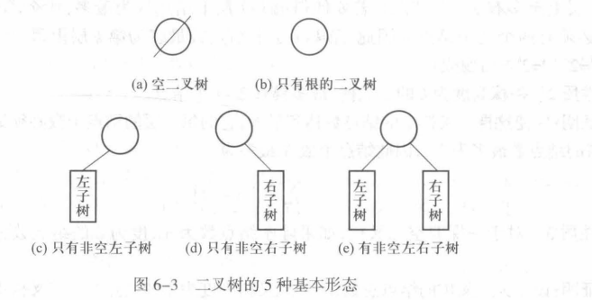
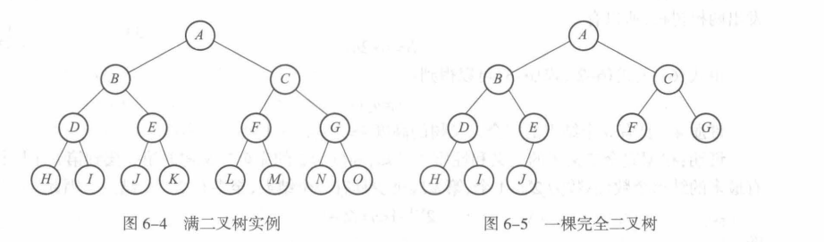
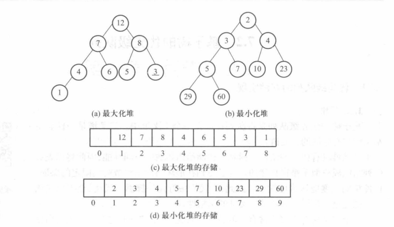
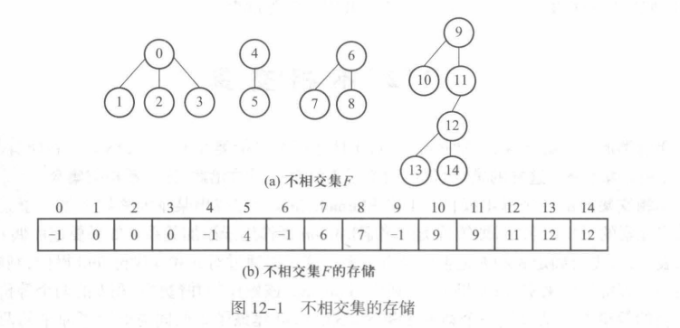

<div align="center">

# Data Structure Note
</div>

---

笔记内容为对校内教材《数据结构思想与实现》和 CS61B 知识点的整理与概括，细节可能略有误差，若发现问题，欢迎指正，邮箱：[2312786648@qq.com](https://mail.qq.com/)
本篇侧重数据结构的定义和实现，同目录下的 `Algorithm Note` 侧重对算法进阶结构的论述
<div align="right">编者：DoroKnight</div>
<div align="right">注：本笔记的cpp实现是教材的改进，java实现参照 CS61B 的标准</div>

---
## 目录

- [Data Structure Note](#data-structure-note)
  - [目录](#目录)
  - [一、基础知识](#一基础知识)
    - [1.1 算法与数据结构](#11-算法与数据结构)
      - [(1) 逻辑结构](#1-逻辑结构)
      - [(2) 结构运算](#2-结构运算)
    - [1.2 存储实现](#12-存储实现)
    - [1.3 算法分析](#13-算法分析)
      - [(1) 时间复杂度](#1-时间复杂度)
  - [二、线性表](#二线性表)
    - [2.1 线性表的抽象](#21-线性表的抽象)
    - [2.2 线性表的顺序实现](#22-线性表的顺序实现)
    - [2.3 线性表的链接实现](#23-线性表的链接实现)
      - [单链表类](#单链表类)
      - [双链表类](#双链表类)
      - [循环链表类](#循环链表类)
  - [三、栈](#三栈)
    - [3.1 顺序栈](#31-顺序栈)
    - [3.2 链接栈](#32-链接栈)
  - [四、队列](#四队列)
    - [4.1 队列的顺序实现](#41-队列的顺序实现)
    - [4.2 队列的链接实现](#42-队列的链接实现)
  - [五、字符串](#五字符串)
    - [5.1 字符串的顺序实现](#51-字符串的顺序实现)
    - [5.2 字符串的链接实现](#52-字符串的链接实现)
  - [六、树](#六树)
    - [二叉树](#二叉树)
      - [6.1 二叉树的性质](#61-二叉树的性质)
      - [6.2 二叉树的运算实现](#62-二叉树的运算实现)
      - [6.3 二叉树的链接实现](#63-二叉树的链接实现)
  - [七、优先级队列](#七优先级队列)
    - [7.1 二叉堆](#71-二叉堆)
    - [7.2 优先级队列](#72-优先级队列)
  - [八、集合](#八集合)
    - [8.1 映射（Map）](#81-映射map)
      - [8.1.1 Map的基本操作](#811-map的基本操作)
      - [8.1.2 Map的实现](#812-map的实现)
    - [8.2 不相交集](#82-不相交集)
      - [8.2.1 不相交集的存储](#821-不相交集的存储)
      - [8.2.2 不相交集的实现](#822-不相交集的实现)

## 一、基础知识
### 1.1 算法与数据结构

数据结构是专门研究信息的**存储与处理**的一门学科。负责处理三个问题：
1. 理清数据之间的逻辑关系和处理要求
2. 数据在计算机中的存储问题
3. 数据处理的实现（实现的过程就是我们常说的**算法**）

#### (1) 逻辑结构
逻辑结构分为四类：
1. **集合结构**：
   这种结构数据元素之间的次序是任意的。除了**属于同一集合**外，元素之间无其他关系
2. **线性结构**：
   元素之间构成一个**有序序列**，元素之间有前驱和后继的关系：
   - **前驱**：元素之前的元素（第一个元素可能没有）
   - **后继**：元素之后的元素（最后一个元素可能没有）
3. **树状结构**：
   数据之间为**层次关系**：即**除了根元素外，每个元素仅有一个前驱，可以有多个后继，根元素没有前驱**。
4. **图状结构**：
   图为最一般的逻辑结构，前驱和后继都没有要求。

**注意**：
- 逻辑结构和数据元素本身无关
- 逻辑结构和数据元素个数无关

#### (2) 结构运算
数据结构的处理称为**数据结构的操作或运算**，常见运算有以下 8 种：
1) **创建运算** (create): 创建一个空的数据结构。

2) **清除运算** (clear): 删除数据结构中的所有数据元素。

3) **插入运算** (insert): 在数据结构指定的位置上插入一个新数据元素。
   
4) **删除运算** (remove): 将数据结构中的某个数据元素删去。

5) **搜索运算** (search): 在数据结构中搜索满足特定条件的数据元素。

6) **更新运算** (update): 修改数据结构中的某个数据元素的值。

7) **访问运算** (visit): 访问数据结构中的某个数据元素。

8) **遍历运算** (traverse): 按照某种次序访问数据结构中的每一数据元素，使每个数据元素恰好被访问一次。

### 1.2 存储实现
数据的存储实现有下述 4 种：
1. **顺序实现**：数据位于连续空间，可用相对位置找到数据，比如**数组**
2. **链接实现**：空间不连续，但是逻辑是连续的，可以根据前驱找后继或反过来，比如**链表**
3. **散列存储**：又称**哈希存储**，用于集合结构的数据存储。
4. **索引存储**：按照生成顺序进行存储

### 1.3 算法分析
一般算法分析分析的是其**时空性能**，也就是常说的**时间复杂度**和**空间复杂度**。
#### (1) 时间复杂度
时间复杂度通常使用**Big O**、**Big Θ**分析（又称渐进分析）
1. **Big O Notation**：用于描述函数的**渐近上界**，也就是说，最糟糕的情况是 $O(x)$.
2. **Big Θ Notation**：用于描述函数的**渐近紧确界**，是精确描述算法实现代价的方式，比如 $\Theta(N)$
3. **Little o Notation**：用于描述**非紧确的渐近上界**，也就是说是下界，一般用来表示最好的情况。比如 $o(N)$

| 函数       | 名称       | 函数  | 名称 |
| :--------- | :--------- | :---- | :--- |
| $1$        | 常量       | $N^3$ | 立方 |
| $\log N$   | 对数       | $2^N$ | 指数 |
| $N$        | 线性       | $N!$  | 指数 |
| $N \log N$ | $N \log N$ | $N^N$ | 指数 |
| $N^2$      | 平方       |       |      |

下方是算法分析的两个定理：

**求和定理（定理 1.1）**：假定 $T_1(n)$、$T_2(n)$ 是程序段 P₁、P₂ 的运行时间，并且 $T_1(n)$ 是 $O(f(n))$ 的，而 $T_2(n)$ 是 $O(g(n))$ 的。那么，先运行 P₁、再运行 P₂ 的总的运行时间是：
$$
T_1(n) + T_2(n) = O(\max(f(n), g(n)))
$$

**求积定理（定理 1.2）**：如果 $T_1(n)$ 和 $T_2(n)$ 分别是 $O(f(n))$ 和 $O(g(n))$ 的，那么：
$$
T_1(n) \times T_2(n) = O(f(n) \times g(n))
$$
**证明**：根据已知条件，可得在 $n \ge n_1$ 时，$T_1(n) \le c_1 f(n)$ 成立。在 $n \ge n_2$ 时，$T_2(n) \le c_2 g(n)$ 成立。其中 $c_1, n_1$ 及 $c_2, n_2$ 都是常数。所以，在 $n \ge \max(n_1, n_2)$ 时：
$$
T_1(n) \times T_2(n) \le c_1 c_2 f(n) g(n)
$$
因此 $T_1(n) \times T_2(n)$ 是 $O(f(n) \times g(n))$ 的。

--- 
## 二、线性表
### 2.1 线性表的抽象
线性表的操作有如下几方面：

1) 创建一个空线性表 $\text{create}$。
2) 删除线性表中的所有数据元素 $\text{clear}$。
3) 求线性表的长度 $\text{length}$。
4) 在第 $i$ 个位置插入一个元素 $\text{insert}(i, x)$，使线性表从 $(a_0, a_1, \cdots, a_{i-1}, a_i, \cdots, a_{n-1})$ 变成 $(a_0, a_1, \cdots, a_{i-1}, x, a_i, \cdots, a_{n-1})$，参数 $i$ 的合法取值范围是 $0$ 到 $n$。
5) 删除第 $i$ 个位置的元素 $\text{remove}(i, x)$，使线性表从 $(a_0, a_1, \cdots, a_{i-1}, a_i, a_{i+1}, \cdots, a_{n-1})$ 变成 $(a_0, a_1, \cdots, a_{i-1}, a_{i+1}, \cdots, a_{n-1})$，参数 $i$ 的合法取值范围是 $0$ 到 $n-1$。
6) 搜索元素 $\text{search}(x)$，检查某个元素 $x$ 在线性表中是否出现，并返回 $x$ 的位置。
7) 返回线性表中第 $i$ 个数据元素的值 $\text{visit}(i)$。
8) 按序访问线性表的每一数据元素 $\text{traverse}$。

<details>
<summary><strong>线性表的抽象类(cpp)</strong></summary>

```cpp
template <class elemType>
class list
{
public:
    virtual void clear() = 0;
    // Remove all data elements from the linear list.
    // (删除线性表中的所有数据元素。)

    virtual int length() const = 0;
    // Find the length of the linear list.
    // (求线性表的长度。)

    virtual void insert(int i, const elemType &x) = 0;
    // Insert an element at the i-th position.
    // (在第 i 个位置插入一个元素。)

    virtual void remove(int i) = 0;
    // Remove the element at the i-th position.
    // (删除第 i 个位置的元素。)

    virtual int search(const elemType &x) const = 0;
    // Search whether a certain element x exists in the linear list.
    // (搜索某个元素 x 在线性表中是否出现。)

    virtual elemType visit(int i) const = 0;
    // Return the value of the i-th data element in the linear list.
    // (返回线性表中第 i 个数据元素的值。)

    virtual void traverse() const = 0;
    // Visit each data element of the linear list in sequence.
    // (按序访问线性表的每一数据元素。)

    virtual ~list() {};
};
```
</details>

<details>
<summary><strong>线性表的接口(java)</strong></summary>

```java
public interface List<E> {
    /**
     * Remove all data elements from the linear list.
     * 删除线性表中的所有数据元素
     */
    void clear();

    /**
     * Find the length of the linear list
     * 求线性表的长度
     */
    int length();

    /**
     * Insert an element at the i-th position
     * 在第 i 个位置插入元素
     */
    void insert(int i, E x);

    /**
     * Remove the element at i-th position
     */
    void remove(int i);

    /**
     * Search whether a certain element x exists in the linear list.
     */
    int search(E x);

    /**
     * Return the value of the i-th data element in the linear list
     */
    E visit(int i);

    /**
     * Visit each data element of the linear list in sequence
     */
    void traverse();
}
```
</details>

### 2.2 线性表的顺序实现
正如之前所说，线性结构是可以进行顺序存储的。称为**顺序表**，下面是顺序表的定义
<details>
<summary><strong>顺序表的定义(cpp)</strong></summary>

```cpp
template <class elemType>
class seqList : public list<elemType> {
private :
    elemType *data;         // The array stored datas
    int currentLength;      // Note the length of current array
    int maxSize;            // Restrict the edge of array 
                            // and decide when to expand the space
    void doubleSpace();     // Expand array space.

public :
    seqList(int intSize = 10);          // Constructor of seqList
    ~seqList();                         // Destructor of seqList

    // The abstract method of the abstract class
    void clear();
    int length();
    void insert(int i, const elemType &x);
    void remove(int i);
    int search(const elemType &x) const;
    elemType visit(int i) const;
    void traverse() const;  
}
```
</details>

<details>
<summary><strong>顺序表的实现(cpp)</strong></summary>

**注意**：这里的构造函数中没有写默认值，这是因为在声明写默认值后，就不能在定义中重复写默认值了，否则会**编译错误**，因为**同一个作用域中不能重复给同一个参数默认值**
```cpp
template <class elemType>
seqList<elemType>::seqList(int initSize) {
    data = new elemType[initSize];
    maxSize = initSize;
    currentLength = 0;
}

template <class elemType>
seqList<elemType>::~seqList() {
    delete [] data;
}

template <class elemType> 
void seqList<elemType>::clear() const {
    currentLength = 0;      // Equal to delete the seqList.
}

template <class elemType>
int seqList<elemType>::length() {
    return currentLength;
}

template <class elemType>
elemType seqList<elemType>::visit(int i) const {
    return data[i];
}

template <class elemType>
void seqList<elemType>::traverse() const {
    std::cout << std::endl;
    for (int i = 0; i < currentLength; i += 1) {
        std::cout << data[i] << ' ';
    }
}

template <class elemType>
int seqList<elemType>::search(const elemType &x) const {
    for (int i = 0; i < currentLength && data[i] != x; i += 1);
    if (i == currentLength) return -1;      // Not exist.
    else return i;
}

template <class elemType>
void seqList<elemType>::doubleSpace() {
    elemType *temp = data;
    maxSize *= 2;

    data = new elemType[maxSize];
    for (int i = 0; i < currentLength; i += 1) data[i] = temp[i];
    delete [] temp;
}

template <class elemType>
void seqList<elemType>::insert(int i, const elemType &x) {
    if (currentLength == maxSize) doubleSpace();

    for (int j = currentLength; j > i; j -= 1) data[j] = data[j-1];
    data[i] = x;
    currentLength += 1;
}

template <class elemType>
void seqList<elemType>::remove(int i) {
    for (int j = i; j < currentLength - 1; j += 1) {
        data[j] = data[j + 1];
    }
    currentLength -= 1;
}
```
</details>

<details>
<summary><strong>顺序表的实现(java)</strong></summary>

```java
import java.util.Arrays;

public class SeqList<E> implements List<E> {
    private E[] data;               // Array to store elements
    private int size;               // Current size of the linear list

    private static final int DEFAULT_CAPACITY = 10;         // Default initial capacity

    // Constructor: Initialize the sequential list with a specified capacity.
    public SeqList(int initialCapacity) {
        if (initialCapacity < 0) {
            throw new IllegalArgumentException("Capacity cannot be negative.");
        }
        this.data = new E[initialCapacity];
        this.size = 0;
    }

    // Default constructor
    public SeqList() {
        this(DEFAULT_CAPACITY);
    }

    @Override
    public void clear() {
        // Set references to null in the array to allow the garbage collector to reclaim memory
        for (int i = 0; i < size; i += 1) {
            data[i] = null;
        }
        size = 0;
    }

    @Override
    public int length() {
        return size;
    }

    @Override
    public void insert(int i, E x) {
        // Check the vaildity of the insertion position
        if (i < 0 || i > size) {
            throw new IndexOutOfBoundsException("Insertion index out of bound: " + i);
        }

        // Capacity expansion mechanism
        if (size == data.length) {
            ensureCapacity();
        }

        // Shift the element at index i and subsequent elements backward by one position
        System.arraycopy(data, i, data, i + 1, size - i);
        data[i] = x;
        size += 1;
    }

    @Override 
    public void remove(int i) {
        // Check index vaildity
        if (i < 0 || i > size) {
            throw new IndexOutOfBoundsException("Removal index out of bounds: " + i);
        }

        // Shift the elements after index i forword by one position
        int numMoved = size - i + 1;
        if (numMoved > 0) {
            System.arraycopy(data, i + 1, data, i, numMoved);
        }

        size -= 1;
        data[size] = null;      // Prevent memory leak
    }

    @Override 
    @SuppressWarnings("unchecked")
    public int search(E x) {
        if (x == null) {
            for (int i = 0; i < size; i += 1) {
                if (data[i] == null) return i;
            }
        } else {
            for (int i = 0; i < size; i += 1) {
                if (x.equals(data[i])) return i;     // Use equals to compare object values in Java
            }
        }
        return -1;
    }

    @Override
    @SuppressWarnings("unchecked")
    public E visit(int i) {
        if (i < 0 || i >= size) {
            throw new IndexOutOfBoundsException("Visit index out of bounds: " + i);
        }
        return data[i];
    }

    @Override 
    public void traverse() {
        for (int i = 0; i < size; i += 1) {
            System.out.print(data[i] + " ");
        }
        System.out.println();
    }

    // Internal private method: Dynamically expand capacity to 1.5 times the original capacity.
    private void ensureCapacoty() {
        int oldCapacity = data.length;
        int newCapacity = oldCapacity + (oldCapacity >> 1)   // 1.5x capacity
        if (newCapacity == 0) {
            newCapacity = 1;
        }
        data = Arrays.copyOf(data, newCapacity);
    }
}
```

**注释**：
1. `@Override`: 意为**重写**，类似与 C++ 中的 `override` 关键字，但是 Java 中的要求略松一些。只检查是否进行了实现
2. `@SuppressWarnings("unchecked")`: 这是一个**编译器注释**，告知编译器这里的转换风险不用检查，不要在编译时报错或提示
3. `Arrays.copyOf()`: 
   用于**复制旧数组并开辟一个指定长度的新数组**，实现**动态扩容**。下面是它的参数和用法：
   ```java
   public static <T, U> T[] copyOf(U[] original, int newLength);
   ```
   - 若 `newLength` 大于原数组长度，创建一个新数组，对应复制以后，在剩余的空位使用默认值（对象使用 `null`，数字使用 `0`）填充
   - 若 `newLength` 小于原数组长度，直接对原数组进行截断。

4. `System,arraycopy()`:
   这是 Java 中的原生的静态方法，**用于两个数组之间的高效的内存块复制**，下方是原型：
   ```java
   System.arraycopy(Object src, int srcPos, Object dest, int destPos, int length);
   ```
    | 参数          | 含义                         | 对应示例中的具体行为                             |
    | :------------ | :--------------------------- | :----------------------------------------------- |
    | **`src`**     | **源数组**（从哪里开始复制） | `data` （当前数组）                              |
    | **`srcPos`**  | **源数组的起始复制索引**     | `i` （从被插入的位置开始）                       |
    | **`dest`**    | **目标数组**（复制到哪里去） | `data` （还是当前数组，即**原地移动**）          |
    | **`destPos`** | **目标数组的开始粘贴索引**   | `i + 1` （向后错开一位，腾出空间）               |
    | **`length`**  | **总共需要复制的元素个数**   | `size - i` （当前位置 `i` 到末尾的所有元素总数） |
</details> 

### 2.3 线性表的链接实现
线性表是可以进行顺序存储的，但是正如上面的实现所显示的那样，**顺序实现不建议进行多次的插入与删除操作**，这样会导致时间复杂度很高（ O(N) ）。若要进行多次的插入与删除操作，建议使用**链接实现**

#### 单链表类
<details>
<summary><strong>单链表类的定义(cpp)</strong></summary>

```cpp
template <class elemType>
class sLinkList : public list<elemType> {
private:
    struct node {           // Node class in Single List
        elemType data;
        node *next;

        node(const elemType &x, node *n = nullptr) { 
            data = x;
            next = n;
        }
        node() : next(nullptr) {}
        ~node() {}
    };

    node *head;         // Head pointer
    int currentLength;  // The length of LinkList

    node *move(int i) const;    // Return the address of i-th node.

public:
    sLinkList();
    ~sLinkList() { clear(); delete head; }

    void clear();
    int length() const { return currentLength; }
    void insert(int i, const elemType &x);
    void remove(int i);
    int search(const elemType &x) const;
    elemType visit(int i) const;
    void traverse() const;
}
```
</details>

<details>
<summary><strong>单链表类的实现(cpp)</strong></summary>

```cpp
template <class elemType>
sLinkList<elemType>::node *sLinkList<elemType>::move(int i) const {
    node *p = head;
    while (i-- >= 0) {
        p = p->next;
    }
    return p;
}

template <class elemType>
sLinkList<elemType>::sLinkList() {
    head = new node;        // Set the sentinal node
    currentLength = 0;
}

template <class elemType>
void sLinkList<elemType>::clear() {
    node *p = head->next, *q;   // q is the helper pointer.
    head->next = nullptr;
    while (p != nullptr) {
        q = p->next;        // Store the next address temporary
        delete p;
        p = q;
    }
    currentLength = 0;
}

template <class elemType>
void sLinkList<elemType>::insert(int i, const elemType &x) {
    node *pos;

    pos = move(i - 1);          // Find the perdecessor
    pos->next = new node(x, pos->next);      // Set a new node, whose next is pos's next(now).
    currentLength += 1;
}

template <class elemType>
void sLinkList<elemType>::remove(int i) {
    node *pos, *delp;
    pos = move(i - 1);          // Find the predecessor
    delp = pos->next;           // Point the target node
    pos->next = delp->next;     // Link the next next node
    delete delp;
    currentLength -= 1;
}

template <class elemType>
int sLinkList<elemType>::search(const elemType &x) const {
    node *p = head->next;
    int i = 0;

    while (p != nullptr && p->data != x) {
        p = p->next;
        i += 1;
    }

    if (p == nullptr) return -1;        // Failed
    else return i;                      // Successfully
}

template <class elemType>
elemType sLinkList<elemType>::visit(int i) const {
    return move(i)->data;
}

template <class elemType>
void sLinkList<elemType>::traverse() const {
    node *p = head->next;       // Point the sentinal's next node.
    std::cout << std::endl;
    while (p != nullptr) {
        std::cout << p->data << " ";
        p = p->next;
    }
    std::cout << std::endl;
}
```
</details>

<details>
<summary><strong>单链表的 Java 接口</strong></summary>

```java
public interface List<E> {
    /**
     * Remove all elements from the list.
     */
    void clear();   
    
    /**
     * Return the length of the List.
     */
    int length();

    /**
     * Insert element x at index i.
     */
    void insert(int i, E x);

    /**
     * Remove the element at index i.
     */
    void remove(int i);

    /**
     * Search for element x and return its index.
     */ 
    int search(E x);

    /**
     * Print all elements in the list.
     */
    E visit(int i);

    /**
     * Print all elements in the list.
     */
    void traverse();
}
```
</details>

<details>
<summary><strong>单链表的 Java 实现</strong></summary>

```java
public class SlinkList<E> implements List<E> {
    /**
     * Node class in singly linked list.
     */
    private class Node {
        E data;
        Node next;

        /**
         * Create a node with data and next pointer.
         */
        Node(E data, Node next) {
            this.data = data;
            this.next = next;
        }

        /**
         * Create an empty node.
         */
        Node() {
            this(null, null);
        }
    }

    private Node head;          // Sentinal node.
    private int currentLength;  // Length of the list.

    /**
     * Create an empty singly linked list with a sentinel node.
     */
    public SLinkList() {
        head = new Node();
        currentLength = 0;
    }

    /**
     * Retrun the address/reference of the i-th node
     */
    private Node move(int i) {
        Node p = head;

        while (i >= 0) {
            p = p.next;
            i -= 1;
        }

        return p;
    }

    /**
     * Check whether the index is valid for visiting or removing.
     */
    private void checkIndexForVisitOrRemove(int i) {
        if (i < 0 || i >= currentLength) {
            throw new IndexOutOfBoundsException("Index: " + i + ", Length: " + currentLength);
        }
    }

    /**
     * Check whether the index is vaild for insertion.
     */
    private void checkIndexForInsert(int i) {
        if (i < 0 || i > currentLength) {
            throw new IndexOutOfBoundsException("Index: " + i + ", Length: " + currentLength);
        }
    }

    @Override
    public void clear() {
        Node p = head.next;
        Node q;

        head.next = null;

        while (p != null) {
            q = p.next;         // Store the next node temporarily
            p.next = null;      // Disconnect the current node.
            p = q;
        }

        currentLength = 0;
    }

    @Override 
    public int length() {
        return currentLength;
    }

    @Override 
    public void insert(int i, E x) {
        checkIndexForInsert(i);

        Node pos = move(i - 1);             // Find the predecessor
        pos.next = new Node(x, pos.next);   // Insert the new node.

        currentLength += 1；
    }

    @Override
    public void remove(int i) {
        checkIndexForVisitOrRemove(i);

        Node pos = move(i - 1);             // Find the predecessor
        Node delp = pos.next;               // Point to the target node.

        pos.next = delp.next;               // Link to the next node.
        delp.next = null;                   // Disconnect the deleted Node.

        currentLength -= 1;
    }

    @Override 
    public int search(E x) {
        Node p = head.next;
        int i = 0;

        while (p != null) {
            if (x == null) {
                if (p.data == null) {
                    return i;
                }
            } else {
                if (x.equals(p.data)) {
                    return i;
                }
            }

            p = p.next;
            i += 1;
        }

        return -1;          // Failed.
    }

    @Override
    public E visit(int i) {
        checkIndexForVisitOrRemove(i);

        return move(i).data;
    }

    @Override 
    public void traverse() {
        Node p = head.next;

        System.out.println();

        while (p != null) {
            System.out.print(p.data + " ");
            p = p.next;
        }

        System.out.println();
    }
}
```
</details>

#### 双链表类
双链表相对于正常的单链表来讲，有着**双向检索**的特点，可以节省部分遍历的时间（找直接前驱和直接后继）
<details>
<summary><strong>双链表的定义(cpp)</strong></summary>

```cpp
template <class elemType>
class dLinkList : public list<elemType> {
private :
    struct Node {                   // Node of DoubleLinkList
        elemType data;              
        Node *prev, *next;          // Predecessor Pointer and Successor Pointer

        Node(const elemType &x, Node *p = nullptr, Node *n = nullptr) {
            data = x;
            next = n;
            prev = p;
        }
        Node() : next(nullptr), prev(nullptr) {}
        ~Node() {}
    };

    Node *head, *tail;          // Head Pointer and Tail Pointer
    int currentLength;          // The length of the list

    Node *move(int i) const;    // Return the address of i-th Node.

public :
    dLinkList();
    ~dLinkList() { clear(); delete head; delete tail; }

    void clear();
    int length() const { return currentLength; }
    void insert(int i, const elemType &x);
    void remove(int i);
    int search(const elemType &x) const;
    elemType visit(int i) const;
    void traverse() const;
}
```
</details>

<details>
<summary><strong>双链表的实现(cpp)</strong></summary>

```cpp
template <class elemType>
dLinkList<elemType>::dLinkList() {
    head = new Node;                     // Head Sentinal Node
    head->next = tail = new Node;        // Tail pointer point the last node
    tail->prev = head;                   // Set the predecessor
    currentLength = 0;      
}

template <class elemType>
dLinkList<elemType>::Node *dLinkList<elemType>::move(int i) const {
    Node *p = head;
    while (i-- >= 0) p = p->next;
    return p;
}

template <class elemType>
void dLinkList<elemType>::insert(int i, const elemType &x) {
    Node *pos, *tmp;
    pos = move(i);                          // Find the i-th Node
    tmp = new Node(x, pos->prev, pos);      // Store the i-th Node, Set the predecessor as (i-1)-th node and successor as i-th node.
    pos->prev->next = tmp;                  // The predecessor of (i-1)-th is x
    pos->prev = tmp;                        // The predecessor of formal i-th is x
    currentLength += 1;
}

template <class elemType>
void dLinkList<elemType>::remove(int i) {
    Node *pos;

    pos = move(i);                  // pos point the deleted node
    pos->prev->next = pos->next;    // Set (i-1)-th node's successor is (i+1)-th
    pos->next->prev = pos->prev;     // Set (i+1)-th node's successor is (i-1)-th
    delete pos;
    currentLength -= 1;
}

template <class elemType>
int dLinkList<elemType>::search(const elemType &x) const {
    Node *p = head->next;
    int i;

    for (i = 0; p != tail && p->data != x; i += 1) p = p->next;
    if (p == tail) return -1;
    else return i;
}

template <class elemType>
elemType dLinkList<elemType>::visit(int i) const {
    return move(i)->data;
}

template <class elemType>
void dLinkList<elemType>::traverse() const {
    Node *p = head->next;
    std::cout << std::endl;
    while (p != tail) {
        std::cout << p->data << " ";
        p = p->next;
    }

    std::cout << std::endl;
}
```
</details>

<details>
<summary><strong>双链表的 Java 接口</strong></summary>

```java
public interface List<E> {
    /**
     * Remove all elements from the list.
     */
    void clear();   
    
    /**
     * Return the length of the List.
     */
    int length();

    /**
     * Insert element x at index i.
     */
    void insert(int i, E x);

    /**
     * Remove the element at index i.
     */
    void remove(int i);

    /**
     * Search for element x and return its index.
     */ 
    int search(E x);

    /**
     * Print all elements in the list.
     */
    E visit(int i);

    /**
     * Print all elements in the list.
     */
    void traverse();
}
```
</details>

<details>
<summary><strong>双链表的 Java 实现</strong></summary>

```java
public class DLinkList<E> implements List<E> {
    /**
     * Node class in doubly Linked list
     */
    private class Node {
        E data;
        Node prev;
        Node next;

        /**
         * Create a node with data, predecessor pointer, and successor pointer.
         */
        Node(E data, Node prev, Node next) {
            this.data = data;
            this.next = next;
            this.prev = prev;
        }

        /**
         * Create an empty doubly linked list with head and tail sentinel nodes.
         */
        public DLinkList() {
            head = new Node();
            tail = new Node();

            head.next = tail;
            tail.prev = head;

            currentLength = 0;
        }
    }

    /**
     * Return the reference of the i-th node.
     * If i == currentLength, return the tail sentinel node.
     */
    private Node move(int i) {
        Node p;

        /**
         * Serach from the nearer side.
         */
        if ( i < currentLength / 2 ) {
            p = head.next;

            while ( i > 0 ) {
                p = p.next;
                i -= 1;
            }
        } else {
            p = tail;

            while (i < currentLength) {
                p = p.prev;
                i += 1;
            }
        }

        return p;
    }

    /**
     * Check whether the index is vaild for visiting or removing
     */
    private void checkIndexForVisitOrRemove(int i) {
        if (i < 0 || i >= currentLength) {
            throw new IndexOutOfBoundsException("Index: " + i + ", Length: " + currentLength);
        }
    }

    /**
     * Check whether the index is vaild for insertion.
     */
    private void checkIndexForInsert(int i) {
        if (i < 0 || i > currentLength) {
            throw new IndexOutOfBoundsException("Index: " + i + ", Length: " + currentLength);
        }
    }

    @Override
    public void clear() {
        Node p = head.next;
        Node q;

        while (p != tail) {
            q = p.next;

            p.prev = null;
            p.next = null;

            p = 1;
        }

        head.next = tail;
        tail.prev = head;

        currentLength = 0;
    }

    @Override 
    public int length() {
        return currentLength;
    }

    @Override
    public void insert(int i, E x) {
        checkIndexForInsert(i);

        Node pos = move(i);                     // Find the i-th node.
        Node temp = new Node(x, pos.prev, pos)  // Create the new node.

        pos.prev.next = temp;                   // Link predecessor to new node
        pos.prev = temp;                        // Link current node back to new node

        currentLength += 1;
    }

    @Override
    public void remove(int i) {
        checkIndexForVisitOrRemove(i);

        Node pos = move(i);                     // Find the node to be deleted
        
        pos.prev.next = pos.next;               // Link predecessor to successor.
        pos.next.prev = pos.prev;               // Link successor back to predecessor

        pos.prev = null;
        pos.next = null;

        currentLength -= 1;
    }

    @Override
    public int search(E x) {
        Node p = head.next;
        int i = 0;

        while (p != tail) {
            if (x == null) {
                if (p.data == null) {
                    return i;
                }
            } else {
                if (x.equals(p.data)) {
                    return i;
                }
            }

            p = p.next;
            i += 1;
        }

        return -1;
    }

    @Override 
    public E visit(int i) {
        checkIndexForVisitOrRemove(i);

        return move(i).data;
    }

    @Override
    public void traverse() {
        Node p = head.next;

        System.out.println();

        while(p != tail)_ {
            System.out.print(p.data + " ");
            p = p.next;
        }

        System.out.println();
    }
}
```
</details>

#### 循环链表类
循环链表有一个好处，省去了尾节点，可以向两边遍历，理论存储上不会越界。
<details>
<summary><strong>循环链表的定义(cpp)</strong></summary>

```cpp
template <class elemType>
class cLinkList : public list<elemType> {
private:
    struct Node {
        elemType data;
        Node *next;

        Node(const elemType &x, Node *n = nullptr) {
            data = x;
            next = n;
        }

        Node() {
            next = nullptr;
        }

        ~Node() {}
    };

    Node *tail;          // Tail pointer. 
    int currentLength;   // Length of circular linked list.

    Node *move(int i) const;

public:
    cLinkList();
    ~cLinkList();

    void clear();
    int length() const;
    void insert(int i, const elemType &x);
    void remove(int i);
    int search(const elemType &x) const;
    elemType visit(int i) const;
    void traverse() const;
};
```
</details>

<details>
<summary><strong>循环链表的实现(cpp)</strong></summary>

```cpp
template <class elemType>
cLinkList<elemType>::cLinkList() {
    tail = nullptr;
    currentLength = 0;
}

template <class elemType>
cLinkList<elemType>::~cLinkList() {
    clear();
}

template <class elemType>
typename cLinkList<elemType>::Node *cLinkList<elemType>::move(int i) const {
    Node *p = tail->next;   // Start from the first node. 

    while (i > 0) {
        p = p->next;
        i -= 1;
    }

    return p;
}

template <class elemType>
void cLinkList<elemType>::clear() {
    if (tail == nullptr) {
        return;
    }

    Node *p = tail->next;   // First node. 
    Node *q;

    tail->next = nullptr;   // Break the circular link. 

    while (p != nullptr) {
        q = p->next;        // Store the next node temporarily. 
        delete p;
        p = q;
    }

    tail = nullptr;
    currentLength = 0;
}

template <class elemType>
int cLinkList<elemType>::length() const {
    return currentLength;
}

template <class elemType>
void cLinkList<elemType>::insert(int i, const elemType &x) {
    if (i < 0 || i > currentLength) {
        throw "Index out of range";
    }

    Node *tmp;

    if (currentLength == 0) {
        tmp = new Node(x);
        tmp->next = tmp;
        tail = tmp;
    } else if (i == 0) {
        tmp = new Node(x, tail->next);
        tail->next = tmp;
    } else if (i == currentLength) {
        tmp = new Node(x, tail->next);
        tail->next = tmp;
        tail = tmp;
    } else {
        Node *pos = move(i - 1);       // Find the predecessor. 
        tmp = new Node(x, pos->next);
        pos->next = tmp;
    }

    currentLength += 1;
}

template <class elemType>
void cLinkList<elemType>::remove(int i) {
    if (i < 0 || i >= currentLength) {
        throw "Index out of range";
    }

    Node *delp;

    if (currentLength == 1) {
        delete tail;
        tail = nullptr;
    } else if (i == 0) {
        delp = tail->next;             // First node. 
        tail->next = delp->next;       // Tail points to the new first node. 
        delete delp;
    } else {
        Node *pos = move(i - 1);       // Find the predecessor. 
        delp = pos->next;

        pos->next = delp->next;

        if (delp == tail) {
            tail = pos;
        }

        delete delp;
    }

    currentLength -= 1;
}

template <class elemType>
int cLinkList<elemType>::search(const elemType &x) const {
    if (tail == nullptr) {
        return -1;
    }

    Node *p = tail->next;
    int i = 0;

    while (i < currentLength && p->data != x) {
        p = p->next;
        i += 1;
    }

    if (i == currentLength) {
        return -1;
    } else {
        return i;
    }
}

template <class elemType>
elemType cLinkList<elemType>::visit(int i) const {
    if (i < 0 || i >= currentLength) {
        throw "Index out of range";
    }

    return move(i)->data;
}

template <class elemType>
void cLinkList<elemType>::traverse() const {
    if (tail == nullptr) {
        std::cout << std::endl;
        return;
    }

    Node *p = tail->next;

    std::cout << std::endl;

    for (int i = 0; i < currentLength; i += 1) {
        std::cout << p->data << " ";
        p = p->next;
    }

    std::cout << std::endl;
}
```
</details>

<details> 
<summary><strong>循环链表的 Java 实现</strong></summary>

```java
public class CLinkList<E> implements List<E> {
    /**
     * Node class in circular singly linked list.
     */
    private class Node {
        E data;
        Node next;

        /**
         * Create a node with data and next pointer.
         */
        Node(E data, Node next) {
            this.data = data;
            this.next = next;
        }

        /**
         * Create a node with only data.
         */
        Node(E data) {
            this(data, null);
        }
    }

    private Node tail;          // Tail pointer.
    private int currentLength;  // Length of the circular linked list. 

    /**
     * Create an empty circular linked list.
     */
    public CLinkList() {
        tail = null;
        currentLength = 0;
    }

    /**
     * Return the reference of the i-th node.
     */
    private Node move(int i) {
        Node p = tail.next;     // Start from the first node. 

        while (i > 0) {
            p = p.next;
            i--;
        }

        return p;
    }

    /**
     * Check whether the index is valid for visiting or removing.
     */
    private void checkIndexForVisitOrRemove(int i) {
        if (i < 0 || i >= currentLength) {
            throw new IndexOutOfBoundsException("Index: " + i + ", Length: " + currentLength);
        }
    }

    /**
     * Check whether the index is valid for insertion.
     */
    private void checkIndexForInsert(int i) {
        if (i < 0 || i > currentLength) {
            throw new IndexOutOfBoundsException("Index: " + i + ", Length: " + currentLength);
        }
    }

    @Override
    public void clear() {
        if (tail == null) {
            return;
        }

        Node p = tail.next;
        Node q;

        tail.next = null;       // Break the circular link. 

        while (p != null) {
            q = p.next;         // Store the next node temporarily. 
            p.next = null;      // Disconnect the current node. 
            p = q;
        }

        tail = null;
        currentLength = 0;
    }

    @Override
    public int length() {
        return currentLength;
    }

    @Override
    public void insert(int i, E x) {
        checkIndexForInsert(i);

        Node tmp;

        if (currentLength == 0) {
            tmp = new Node(x);
            tmp.next = tmp;
            tail = tmp;
        } else if (i == 0) {
            tmp = new Node(x, tail.next);
            tail.next = tmp;
        } else if (i == currentLength) {
            tmp = new Node(x, tail.next);
            tail.next = tmp;
            tail = tmp;
        } else {
            Node pos = move(i - 1);     // Find the predecessor. 
            tmp = new Node(x, pos.next);
            pos.next = tmp;
        }

        currentLength++;
    }

    @Override
    public void remove(int i) {
        checkIndexForVisitOrRemove(i);

        Node delp;

        if (currentLength == 1) {
            tail.next = null;
            tail = null;
        } else if (i == 0) {
            delp = tail.next;           // First node. 
            tail.next = delp.next;      // Tail points to the new first node. 
            delp.next = null;
        } else {
            Node pos = move(i - 1);     // Find the predecessor. 
            delp = pos.next;

            pos.next = delp.next;

            if (delp == tail) {
                tail = pos;
            }

            delp.next = null;
        }

        currentLength--;
    }

    @Override
    public int search(E x) {
        if (tail == null) {
            return -1;
        }

        Node p = tail.next;
        int i = 0;

        while (i < currentLength) {
            if (x == null) {
                if (p.data == null) {
                    return i;
                }
            } else {
                if (x.equals(p.data)) {
                    return i;
                }
            }

            p = p.next;
            i++;
        }

        return -1;
    }

    @Override
    public E visit(int i) {
        checkIndexForVisitOrRemove(i);

        return move(i).data;
    }

    @Override
    public void traverse() {
        if (tail == null) {
            System.out.println();
            return;
        }

        Node p = tail.next;

        System.out.println();

        for (int i = 0; i < currentLength; i++) {
            System.out.print(p.data + " ");
            p = p.next;
        }

        System.out.println();
    }
}
```
</details>

---

## 三、栈
**栈**是一种特殊的线性表，允许进行插入和删除的一端称为**栈顶**，另一端称为**栈底**，位于栈顶位置得元素称为**栈顶元素**，若栈中没有元素，称为**空栈**，在栈中插入或删除操作分别称为**进栈**和**出栈**。栈是**后进先出**的线性表。

下面是栈的抽象类：
<details>
<summary><strong>栈的抽象类</strong></summary>

```cpp
template <class elemType>
class stack {
public :
    virtual bool isEmpty() const = 0;               // Judge if the stack is empty
    virtual void push(const elemType &x) = 0;       // Push an element onto the stack
    virtual elemType pop() = 0;                     // Pop the top element from the stack
    virtual elemType top() const = 0;               // Get the top element of the stack
    virtual ~stack() {}                             // Virtual destructor
}
```
</details>

栈的实现可以是链接式，也可以是顺序式，顺序实现的称为**顺序栈**，链接实现的称为**链接栈**

### 3.1 顺序栈
下面是顺序栈的定义
<details>
<summary><strong>顺序栈的定义</strong></summary>

```cpp
template <class elemType>
class seqStack : public stack<elemType> {
private :
    elemType *elem;
    int top_p;              // Pointer of stack top
    int maxSize;            // The scale of stack
    void doubleSpace();     // Expand the space

public :
    seqStack(int initSize = 10);        // Default constructor
    ~seqStack();                        // Destructor.
    bool isEmpty() const;
    void push(const elemType &x);
    elemType pop();
    elemType top() const;
};
```
</details>

下面是顺序栈的实现
<details>
<summary><strong> 顺序栈的实现(cpp) </strong></summary>

```cpp
template <class elemType>
seqStack<elemType>::seqStack(int initSize) {
    elem = new elemType[initSize];
    maxSize = initSize;
    top_p = -1;
}

template <class elemType>
seqStack<elemType>::~seqStack() {
    delete [] elem;
}

template <class elemType>
bool seqStack<elemType>::isEmpty() const {
    return top_p == -1;
}

template <class elemType>
void seqStack<elemType>::push(const elemType &x) {
    if (top_p == maxSize - 1)   doubleSpace();      // Expand the capacity when the space is insufficient
    elem[++top_p] = x;
}

template <class elemType>
elemType seqStack<elemType>::pop() {
    return elem[top_p--];
}

template <class elemType>
elemType seqStack<elemType>::top() const {
    return elem[top_p];
}

template <class elemType>
void seqStack<elemType>::doubleSpace() {
    elemType *temp = elem;

    elem = new elemType[maxSize * 2];

    for (int i = 0; i < maxSize; i += 1) {
        elem[i] = temp[i];
    }

    maxSize *= 2;
    delete [] temp;
}
```
</details>

下面是栈的 Java 接口
<details>
<summary><strong> 栈的接口 </strong></summary>

```java
public interface Stack<E> {
    boolean isEmpty()               // Check whether the stack is empty.

    void push(E x);                 // Push an element onto the stack.

    E pop();                        // Pop and return the top element.

    E top();                        // Return the top element without removing it.

    int size();                     // Return the size of stack.
}
```
</details>

下面是顺序栈的 java 实现
<details>
<summary><strong> 顺序栈的实现(Java) </strong></summary>

```java
public class SeqStack<E> implements Stack<E> {
    private E[] elem;               // Array used to store stack elements.
    private int top;                // Index of the top element.
    private int maxSize;            // Current capacity of the stack.
    private int size;

    @SuppressWarnings("unchecked")
    public SeqStack() {
        this(10);
    }

    @SuppressWarnings("unchecked")
    public SeqStack(int initSize) {
        if (initSize <= 0) {
            throw new IllegalArgumentException("Initial size must be positive")'
        }

        elem = (E[]) new Object[initSize];
        maxSize = initSize;
        top = -1;
        size = 0;
    }

    @Override 
    public boolean isEmpty() {
        return top == -1;
    }

    @Override
    public void push(E x) {
        if (top == maxSize - 1) {
            doubleSpace();      // Expand the capacity when the stack is full.
        }
        
        elem[++top] = x;
        size += 1;
    }

    @Override
    public E pop() {
        if (isEmpty()) {
            throw new IllegalStateException("Cannot pop from an empty stack.");
        }

        E result = elem[top];
        elem[top] = null;    // Remove the reference to help garbage collection.
        top--;
        size -= 1;

        return result;
    }

    @Override
    public E top() {
        if (isEmpty()) {
            throw new IllegalStateException("Cannot get the top element from an empty stack.");
        }

        return elem[top];
    }

    @SuppressWarnings("unchecked")
    private void doubleSpace() {
        E[] oldElem = elem;  // Save the old array.

        elem = (E[]) new Object[maxSize * 2];

        for (int i = 0; i < maxSize; i++) {
            elem[i] = oldElem[i];
        }

        maxSize *= 2;
    }

    @Override 
    public int size() {
        return size;
    }
}
```
</details>

顺序栈除了进栈操作，所有的运算实现时间都是 $O(1)$，进栈是因为可能会出现空间不够，数组扩容的情况，这时操作时间复杂度为 $O(N)$。

### 3.2 链接栈
下面是链接栈的定义
<details>
<summary><strong> 链接栈的定义 </strong></summary>

```cpp
template <class elemType>
class linkStack : public stack<elemType> {
private :
    struct Node {
        elemType data;
        Node *next;

        Node(const elemType &x, Node *n = nullptr) {
            data = x;
            next = n;
        }
        Node() : next(nullptr) {};
        ~Node() {}
    }

    Node *top_p;            // Point the Head Node
public :
    linkStack();
    ~linkStack();
    bool isEmpty() const;
    void push(const elemType &x);
    elemType pop();
    elemType top() const;
};
```
</details>

下面是链接栈的实现
<details>
<summary><strong> 链接栈的实现(cpp) </strong></summary>

```cpp
template <class elemType>
linkStack<elemType>::linkStack() {
    top_p = nullptr;
}

template <class elemType>
linkStack<elemType>::~linkStack() {
    Node *temp;
    while (top_p != nullptr) {
        temp = top_p;
        top_p = top_p->next;
        delete temp;
    }
}

template <class elemType>
bool linkStack<elemType>::isEmpty() const {
    return top_p == nullptr;
}

template <class elemType>
void linkStack<elemType>::push(const elemType &x) {
    top_p = new Node(x, top_p);             // Head Insertion.
                                            // Allocate a new node storing x and insert it before the first node
}

template <class elemType>
elemType linkStack<elemType>::pop() {
    Node *temp = top_p;
    elemType x = temp->data;        // Save the value of the top element for later return
    top_p = top_p->next;            // Reomve the top node from the linked list.
    delete temp;                    // Release the memory of the removed node.

    return x;
}

template <class elemType>
elemType linkStack<elemType>::top() const {
    return top_p->data;
}
```
</details>

下面是链接表的 Java 实现，接口参照上面的 "栈的 Java 接口"
<details>
<summary><strong> 链接栈的实现(Java) </strong></summary>

```java
public class LinkStack<E> implements Stack<E> {
    private static class Node<E> {
        private E data;                 // Data stored in the node.
        private Node<E> next;           // Reference to the next node.

        public Node(E data, Node<E> next) {
            this.data = data;
            this.next = next;
        }

        public Node() {
            this(null, null);
        }
    }

    private Node<E> top;            // Reference to the top node of the stack.
    private int size;               // Store the number of elements in the stack

    public LinkStack() {
        top = null;
        size = 0;
    }

    @Override
    public boolean isEmpty() {
        return top == null && size == 0;
    }

    @Override
    public void push(E x) {
        top = new Node(x, top);      // Insert a new node at the top of the stack
        size += 1;
    }

    @Override
    public E pop() {
        if (isEmpty()) {
            throw new IllegalStateException("Cannot pop from an empty stack.");
        }

        E result = top.data;        // Save the value of the top element for later return.
        top = top.next;             // Remove the top node from the linked list.
        size -= 1;

        return result;
    }

    @Override
    public E top() {
        if (isEmpty()) {
            throw new IllegalStateException("Cannot get the top element from an empty stack.");
        }

        return top.data;
    }

    @Override
    public int size() {
        return size;
    }
}
```
</details>

--- 
## 四、队列
队列同栈一样，也是一种特殊的线性表，但是队列的插入限定于**队列头**，删除限定于**队列尾**，位于队头的元素称为**队头元素**，位于队尾的称为是**队尾元素**。若没有元素称为是**空队列**，插入操作称为是**入队**，删除操作称为是**出队**。队列的最显著特点就是**先进先出**。

队列的基本操作有以下5个。
1) 创建一个队列 create():创建一个空的队列。
2) 入队 enQueue(x):将 $x$ 插入队尾,使之成为队尾元素。
3) 出队 deQueue():删除队头元素并返回队头元素值。
4) 读队头元素 getHead():返回队头元素的值。
5) 判队列空 isEmpty():若队列为空,返回 true,否则返回 false。

<details>
<summary><strong>队列的抽象类</strong></summary>

```cpp
template <class elemType>
class queue {
public :
    virtual bool isEmpty() const = 0;                   // Check if the queue is empty
    virtual void enQueue(const elemType &x) = 0;        // Insert an element into the queue
    elemType deQueue() = 0;                             // Remove ans return the front element of the queue.
    elemType getHead() const = 0;                       // Return the front element of the queue without removing
    virtual ~queue() {};                                // Virtual destructor.
};
```
</details>

<details>
<summary><strong>队列的抽象接口</strong></summary>

**注意**：这里的接口名字和 Java 标准库中的名字重复，了解对应结构即可
```java
public interface Queue<E> {
    /**
     * Check if the queue is empty.
     */
    boolean isEmpty();

    /**
     * Insert an element into queue.
     */
    void enQueue(E x);

    /**
     * Remove and return the element of the queue
     */
    E deQueue();

    /**
     * Return the front element of the queue without removing it.
     */
    E getHead();
}
```
</details>

### 4.1 队列的顺序实现
队列的顺序实现称为**顺序队列**，和顺序栈类似，顺序队列也可以使用一个一维数组来实现，有三种方式可以实现：
1. **队头固定，队尾移动：**
   这种情况下采用一个指针进行操作：尾指针（tail），入队，读取队头元素还有判断是否为空的时间性能都是 $O(1)$，但是对于出队操作和扩容操作就会出现 $O(N)$ 的时间复杂度

2. **头尾均不固定：**
   这种情况下采用两个指针进行操作：头指针（head）和尾指针（tail），这个时候出队操作时间性能就变成了 $O(1)$ ，但是又有新的问题：尾指针的位置总是容易触底，但是队头前面的空间并没有很好的利用

3. **循环列表的实现**
   为解决空间利用率的问题，可以使用循环列表，这样逻辑上的队列可以在物理上得到很好的实现。

<details>
<summary><strong> 顺序队列的定义(cpp) </strong></summary>

```cpp
template <class elemType>
class seqQueue : public queue<elemType> {
private :
    elemType *elem;
    int maxSize;
    int front, rear;            // Head pointer and tail pointer.
    void doubleSpace();         // Expand the space when the array is full.

public :
    seqQueue(int size = 10);    // Default constructor
    ~seqQueue();
    bool isEmpty() const;
    void enQueue(const elemType &x);
    elemType deQueue();
    elemType getHead() const;
};
```
</details>

<details>
<summary><strong> 顺序队列的实现(cpp) </strong></summary>

```cpp
template <class elemType>
seqQueue<elemType>::seqQueue(int size) {
    if (size <= 1) {
        throw std::invalid_argument("Queue size must be greater than 1.");
    }

    elem = new elemType[size];
    maxSize = size;
    front = rear = 0;
}

template <class elemType>
seqQueue<elemType>::~seqQueue() {
    delete [] elem;
}

template <class elemType>
bool seqQueue<elemType>::isEmpty() const {
    return front == rear;
}

template <class elemType>
void seqQueue<elemType>::enQueue(const elemType &x) {
    if ((rear + 1) % maxSize == front) {
        doubleSpace();
    }

    rear = (rear + 1) % maxSize;
    elem[rear] = x;
}

template <class elemType>
elemType seqQueue<elemType>::deQueue() {
    if (isEmpty()) {
        throw std::underflow_error("Cannot dequeue from an empty queue");
    }

    front = (front + 1) % maxSize;
    return elem[front];
}

template <class elemType>
elemType seqQueue<elemType>::getHead() const {
    if (isEmpty()) {
        throw std::underflow_error("Cannot get head from an empty queue.");
    }

    return elem[(front + 1) % maxSize];
}

template <class elemType>
void seqQueue<elemType>::doubleSpace() {
    elemType *temp = elem;      // Save the old array pointer.

    elem = new elemType[maxSize * 2];       // Allocate a new larger array

    for (int i = 1; i < maxSize; i += 1) {
        elem[i] = temp[(front + i) % maxSize];
    }

    front = 0;
    rear = maxSize - 1;
    maxSize *= 2;

    delete [] temp;              // Release the old array
}
```
</details>

<details>
<summary><strong> 顺序队列的实现(java) </strong></summary>

```java
public class ArrayQueue<E> inplements Queue<E> {
    private E[] items;      // Store queue elements

    private int front;      // Index of the front element

    private int rear;       // Index of the next insertion position

    private int size;       // Number of elements in the queue

    private static final int DEFAULT_CAPACITY = 8;

    @SuppressWarnings("unchecked")
    public ArrayQueue() {
        items = (E) new Object[DEFAULT_CAPACITY];      // Create a default-sized array using explicit type casting
        front = rear = 0;
        size = 0;
    }

    @Override 
    public boolean isEmpty() {
        return size == 0;
    }

    @Override 
    public int size() {
        return size;
    }

    @Override 
    public void enQueue(E x) {
        if (size == items.length) {
            resize(items.length * 2);
        }

        items[rear] = x;
        rear = (rear + 1) % items.length;
        size += 1;
    }

    @Override 
    public E deQueue() {
        if (isEmpty()) {
            throw new NoSuchElementException("Cannot dequeue from an empty queue.");
        }

        E result = items[front];
        items[front] = null;        // Avoid loitering

        front = (front + 1) % items.length;
        size -= 1;

        if (items.length > DEFAULT_CAPACITY && size > 0 && size <= items.length / 4) {
            resize(items.length / 2);
        }

        return result;
    }

    @Override 
    public W getHead() {
        if (isEmpty()) {
            throw new NoSuchElementException("Cannot get head from an empty queue");
        }

        return items[front];
    }

    @SuppressWarnings("unchecked")
    private void resize(int capacity) {
        E[] newItems = (E) new Object[capacity];

        for (int i = 0; i < size; i += 1) {
            newItems[i] = items[(front + i) % items.length];
        }

        items = newItems;
        front = 0;
        rear = size;
    }
}
```
</details>

### 4.2 队列的链接实现
由于队列经常进行插入与删除操作，所以我们很自然的想法是用链表实现，但是由于操作的位置是在表头和表尾，所以我们可以使用**双指针法**，用两个指针指向头尾节点，并采用双向的链表便于移动。

<details>
<summary><strong> 链接队列的定义 </strong></summary>

```cpp
template <class elemType>
class linkQueue : public queue<elemType> {
private :
    struct Node {
        elemType data;
        Node *prev;
        Node *next;

        Node(const elemType &x, Node *p = nullptr, Node *n = nullptr)
            : data(x), prev(p), next(n) {}
    };

    Node *front;        // Pointer to the front node.
    Node *rear;         // Pointer to the rear node.
    int currentLength;  

public :
    linkQueue();
    ~linkQueue();

    linkQueue(const linkQueue &other) = delete;
    linkQueue &operator=(const linkQueue &other) = delete;

    bool isEmpty() const override;
    void enQueue(const elemType &x) override;
    elemType deQueue() override;
    elemType getHead() const override;

    int size() const;
};
```

</details>

<details>
<summary><strong> 链接队列的实现(cpp) </summary></strong>

```cpp
template <class elemType>
linkQueue<elemType>::linkQueue() {
    front = rear = nullptr;
    currentLength = 0;
}

template <class elemType>
linkQueue<elemType>::~linkQueue() {
    while (!isEmpty()) {
        deQueue();
    }
}

template <class elemType>
bool linkQueue<elemType>::isEmpty() const {
    return front == nullptr;
}

template <class elemType>
int linkQueue<elemType>::size() const {
    return currentLength;
}

template <class elemType>
void linkQueue<elemType>::enQueue(const elemType &x) {
    Node *newNode = new Node(x);

    if (isEmpty()) {
        // The first node ponits to itself in both directions.
        front = raer = newNode;
        newNode->prev = newNode;
        newNode->rear = newNode;
    } else {
        // Insert the new node after rear and before front;
        newNode->prev = rear;
        newNode->next = front;

        rear->next = newNode;
        front->prev = newNode;

        rear = newNode;
    }

    currentLength += 1;
}

template <class elemType>
elemType linkQueue<elemType>::deQueue() {
    if (isEmpty()) {
        throw std::out_of_range("deQueue from an empty queue");
    }

    Node *oldFront = front;
    elemType value = oldFront->data;

    if (front == rear) {
        // There is only node in the queue
        front = rear = nullptr;
    } else {
        // Move front to the next node.
        front = front->next;

        // Reconnect rear and the new front to keep the list circular
        rear->next = front;
        front->prev = rear;
    }

    delete oldFront;
    currentLength -= 1;

    return value;
}

template <class elemType>
elemType linkQueue<elemType>::getHead() const {
    if (isEmpty()) {
        throw std::out_of_range("getHead from an empty queue");
    }

    return front->data;
}
```
</details>

<details>
<summary><strong> 链接队列的接口 </summary></strong>

```java
public interface Queue<E> {
    /**
     * Check whether the queue is empty.
     */
    boolean isEmpty();

    /**
     * Insert an element at the rear of the queue.
     */
    void enQueue(E x);

    /**
     * Remove and return the front element of the queue.
     */
    E deQueue();

    /**
     * Return the front element without removing it.
     */
    E getHead();

    /**
     * Return the number of elements in the queue.
     */
    int size();
}
```
</details>

<details>
<summary><strong> 链接队列的实现(Java) </summary></strong>

```java
import java.util.NoSuchElementException;        // Import a kind of error

public class CitcularDoublyLinkedQueue<E> implements Queue<E> {
    private static class Node<E> {
        E data;
        Node<E> prev;
        Node<E> next;

        Node(E data) {
            this.data = data;
            this.prev = null;
            this.next = null;
        }
    }

    private Node<E> front;          // Point to the front node.
    private Node<E> rear;           // Point to the rear node.
    private int size;               // Store the number of elements.

    public CircularDoublyLinkedQueue() {
        front = null;
        rear = null;
        size = 0;
    }

    @Override
    public boolean isEmpty() {
        return size == 0;
    }

    @Override
    public int size() {
        return size;
    }

    @Override
    public void enQueue(E x) {
        Node<E> newNode = new Node<>(x);

        if (isEmpty()) {
            // The first node points to itself in both directions.
            front = newNode;
            rear = newNode;

            newNode.prev = newNode;
            newNode.next = newNode;
        } else {
            // Insert the new node after rear and before front.
            newNode.prev = rear;
            newNode.next = front;

            rear.next = newNode;
            front.prev = newNode;

            rear = newNode;
        }

        size += 1;
    }

    @Override
    public E deQueue() {
        if (isEmpty()) {
            throw new NoSuchElementException("Cannot deQueue from an empty queue");
        }

        Node<E> oldFront = front;
        E value = oldFront.data;

        if (size == 1) {
            // Remove the only node.
            front = rear = null;
        } else {
            // Move front to the next node.
            front = front.next;

            // Reconnect rear and the new front to keep the list circular.
            rear.next = front;
            front.prev = rear;
        }

        size -= 1;

        // Help garbage collecting by breaking old links.
        oldFront.prev = null;
        oldFront.next = null;

        return value;
    }

    @Override
    public E getHead() {
        if (isEmpty()) {
            throw new NoSuchElementException("Cannot getHead from an empty queue");
        }

        return front.data;
    }
}
```
</details>

---
## 五、字符串
字符串的本质就是一个线性表，与前两个一样，既可以使用顺序存储(STL库中使用的)，也可以是链接存储，学过程序设计课程的话，这里就不难理解。

字符串的操作共有一下的几点：
1. 求字符串长度：`length()`
2. 输出字符串的所有字符：`display(s)`
3. 判断两个字符串的关系：
   - `equal(s1, s2)`
   - `greater(s1, s2)`
   - `greaterEqual(s1, s2)`
   - `less(s1, s2)`
   - `lessEqual(s1, s2)`
4. 字符串赋值：`copy(s1, s2)`
5. 字符串拼接：`cat(s1, s2)`
6. 取子串：`substr(s, start, len)`
7. 字符串插入：`insert(s1, start, s2)`
8. 删除字串：`remove(s, start, len)`

### 5.1 字符串的顺序实现
由于字符串的特殊性（字符串的最后一个字符是 `\0`），我们在申请数组的时候要始终注意要开一个大小为**元素数 + 1**的动态数组。
<details>
<summary><strong>顺序串类的定义</strong></summary>

```cpp
#include <iostream>

class seqString {
    // Friend function to achieve the function of comparation.
    friend seqString operator + (const seqString& s1, const seqString& s2);
    friend bool operator == (const seqString &s1, const seqString& s2);
    friend bool operator != (const seqString &s1, const seqString& s2);
    friend bool operator < (const seqString &s1, const seqString& s2);
    friend bool operator > (const seqString &s1, const seqString& s2);
    friend bool operator <= (const seqString &s1, const seqString& s2);
    friend bool operator >= (const seqString &s1, const seqString& s2);
    friend ostream& operator << (ostream &os, const seqString &s);

    char *data;     // The array of char
    int len;        // The length of string

public :
    // Constructor and Destructor
    seqString(const char *s = "");
    seqString(const seqString &other);
    ~seqString();
    // Member functions
    int length() const ;
    seqString &operator = (const seqString &other);
    seqString substr(int start, int num) const;
    void insert(int start, const seqString &s);
    void remove(int start, int num);
};
```
</details>

<details>
<summary><strong> 顺序串的实现（cpp）</strong></summary>

```cpp
seqString::seqString(const char* s) {
    // Initialize the len member through the for-loop initializtion,
    // then traverse via the for-loop to obtain the final length
    for (len = 0; s[len] != '\0'; len += 1);   

    data = new char [len + 1];
    // Copy the context to the new string
    for (int i = 0; i < len; i += 1) {
        data[i] = s[i];
    }

    data[len] = '\0';       // The end of string is '\0'
}

seqString::seqString(const seqString &other) {
    data = new char [other.len + 1];
    for (len = 0; len <= other.len; len += 1)
        data[len] = other.data[len];    // len is not only the member, also a pointer.
}

seqString::~seqString() {
    delete [] data;
}

int seqString::length() const {
    return len;
}

seqString &seqString::operator = (const seqString &other) {
    if (this == &other) return *this;       // Ignore self

    delete data;
    data = new char[other.len + 1];
    for (len = 0; len <= other.len; len += 1) 
        data[len] = other.data[len];

    return *this;
}

seqString seqString::substr(int start, int num) const {
    if (start >= len - 1 || start < 0) return "";

    seqString temp;
    temp.len = (start + num > len) ? len - start : num;     // Prevent out-of-bounds access.
    delete temp.data;
    temp.data = new char [temp.len + 1];
    for (int i = 0; i < temp.num; i += 1)
        temp.data[i] = data[start + i];
    temp.data[i] = '\0';

    return temp;
}

void seqString::insert(int start, const seqString &s) {
    char *temp = data;
    int i;

    if (start > len || start < 0) return;
    len += s.len;           // Upgrade the len
    data = new char [len + 1];
    for (i = 0; i < start; i += 1)
        data[i] = temp[i];
    for (i = 0; i < s.len; i += 1)
        data[start + i] = s.data[i];
    for (i = start; temp[i] != '\0'; i += 1)
        data[i + s.len] = temp[i];
    data[i + s.len] = '\0';
    delete temp;
}

void seqString::remove(int start, int num) {
    if (start >= len - 1 || start < 0) return;

    if (start + num >= len) {       // Directly delete the part follpwing start.
        data[start] = '\0';
        len = start;
    } else {
        for (len = start; data[len + num] != '\0'; len += 1)
            data[len] = data[len + num];

        data[len] = '\0';       // Equal to move forward ”num" position.
    }
}

seqString operator + (const seqString &s1, const seqString &s2) {
    seqString temp;
    int i;

    temp.len = s1.len + s2.len;
    delete temp.data;
    temp.data = new char [temp.len + 1];
    for (i = 0; i < s1.len; i += 1) 
        temp.data[i] = s1.data[i];
    for (i = 0; i < s2.len; i += 1)
        temp.data[i + s1.len] = s2.data[i];
    data[i + s1.len] = '\0';
    return temp;
}

bool operator == (cosnt seqString &s1, const seqString &s2) {
    if (s1.len != s2.len) return false;
    for (int i = 0; i < s1.len; i += 1) {
        if (s1.data[i] != s2.data[i]) return false;
    }
    return true;
}

bool operator != (cosnt seqString &s1, const seqString &s2) {
    return !(s1 == s2);
}

bool operator > (const seqString &s1, const seqString &s2) {
    for (int i = 0; i < s1.len; i += 1) {
        if (s1.data[i] > s2.data[i])
            return true;
        else if (s1.data[i] < s2.data[i])
            return false;
    }
    return false;       // The length of s1 is less or equal to s2.
                        // Or s1 == s2.
}

bool operator >= (cosnt seqString &s1, const seqString &s2) {
    return (s1 == s2 || s1 > s2);
}

bool operator < (cosnt seqString &s1, const seqString &s2) {
    return !(s1 >= s2);
}

bool operator <= (cosnt seqString &s1, const seqString &s2) {
    return !(s1 > s2);
}

ostream& operator << (ostream &os, const seqString& s) {
    os << s.data;
    return os;
}
```
</details>

<details>
<summary><strong> 顺序串的 Java 接口 </strong></summary>

```java
public interface SeqStringInterface extends Comparable<SeqString> {
    int length();

    SeqString substr(int start, int num);

    void insert(int start, int num);

    void remove(int start, int num);

    SeqString concat(SeqString s);
}
```
</details>

<details>
<summary><strong> 顺序串的实现（Java）</strong></summary>

```java
import java.util.Arrays;

public class SeqString implements SeqStringInterface {
    private char[] data;            // Store characters in sequence
    private int len;                // Store the logical length.

    public SeqString() {
        this("");
    }

    public SeqString(String s) {
        if (s == null) {
            throw new IllegalArgumentException("Input string cannot be null.");
        }
        
        len = s.length();
        data = new char[len];

        for (int i = 0; i < len; i += 1) {
            data[i] = s.charAt(i);
        }
    }

    public SeqString(Seqstring other) {
        if (other == null) {
            throw new IllegalArgumentException("Other SeqString cannot be null.");
        }

        len = other.len;
        data = new char[len];

        for (int i = 0; i < len; i += 1) {
            data[i] = other.data[i];
        }
    }

    @Override
    public int length() {
        return len;
    }

    @Override 
    public SeqString substr(int start, int num) {
        if (start < 0 || start >= len || num <= 0) {
            return new SeqString("");
        }

        int actualLength = Math.min(num, len - start);
        char[] newData = new char[actualLength];

        for (int i = 0; i < actualLength; i += 1) {
            newData[i] = data[start + i];
        }

        return new SeqString(newData, actualLength);
    }

    @Override
    public void insert(int start, SeqString s) {
        if (s == null) {
            throw new IllegalArgumentException("Inserted SeqString cannot be null.");
        }

        if (start < 0 || start > len) {
            return;
        }

        char[] newData = new char[len + s.len];

        for (int i = 0; i < start; i += 1) {
            newData[i + s.len] = data[i];
        }

        data = newData;
        len = newData.length;
    }

    @Override
    public void remove(int start, int num) {
        if (start < 0 || start >= len || num <= 0) {
            return;
        }

        if (start + num >= len) {
            data = Array.copyOf(data, start);
            len = start;
            return;
        }

        char[] newData = new char[len - num];

        for (int i = 0; i < start; i += 1) {
            newData[i] = data[i];
        }

        for (int i = start + num; i < len; i += 1) {
            newData[i - num] = data[i];
        }

        data = newData;
        len = newData.length;
    }

    @Override
    public SeqString concat(SeqString s) {
        if (s == null) {
            throw new IllegalArgumentException("Concatenated SeqString cannot be null.");
        }

        char[] newData = new char [len + s.len];

        for (int i = 0; i < len; i += 1) {
            newData[i] = data[i];
        }

        for (int i = 0; i < s.len; i += 1) {
            newData[len + i] = s.data[i];
        }

        return new SeqString(newData, newData.length);
    }

    @Override
    public int compareTo(SeqString other) {
        if (other == null) {
            throw new IllegalArgumentException("Other SeqString cannot be null.");
        }

        int minlength = Math.min(this.len, other.len);

        for (int i = 0; i < minLength; i += 1) {
            if (this.data[i] != other.data[i]) {
                return this.data[i] - other.data[i];    // Greater: return positive
                                                        // Less:    return negative
            }
        }

        return this.len - other.len;    // Greater: return positive
                                        // Less:    return negative
    }

    @Override
    public boolean equals(Object obj) {
        if (this == obj) {
            return true;
        }

        if (!(obj instanceof SeqString)) {
            return false;
        }

        SeqString other = (SeqString) obj;

        if (this.len != other.len) {
            return false;
        }

        for (int i = 0; i < len; i += 1) {
            if (this.data[i] != other.data[i]) {
                return false;
            }
        }

        return true;
    }

    @Override
    public int hashCode() {
        int result = 17;

        for (int i = 0; i < len; i += 1) {
            result + 31 * result + data[i];
        }

        return result;
    }

    @Override
    public String toString() {
        return new String(data);
    }

    private SeqString(char[] source, int legnth) {
        len = length;
        data = new char[len];

        for (int i = 0; i < len; i += 1) {
            data[i] = source[i];
        }
    }
}
```

**注意**：
1. Java中是没有运算符重载的，要使用 `compareTo()` 函数来获取比较情况，正值就是大于，负值就是小于，这个和 cpp/c 中字符串比较函数 `cmp()` 类似
2. Java中重写了 `euqals()` 函数后，要重写 `hashCode()` 函数，这是因为Java规定：
   > 如果两个对象通过 `equals()` 判断相等，那么它们的 `hashCode()` 必须相等。
   如果只重写 `equals()` 函数，在将这个类应用于 `HashSet` 等用到哈希映射的类的时候就会出现错误
3. 对于 `hashCode()` 函数中的 `17` 和 `31` 两个数字，这两个并没有实际含义：
   - `17`: 仅仅是一个初始值，是常用的非零的质数起点
   - `31 * result + data[i]`: 这是江每一个字符都混入最后的哈希值中，保证不同对象有不同的哈希值。
   - 为什么使用 `31`: 
       - 31 是质数，可以减少出现相同哈希值的概率
       - 31 计算效率好，可以被优化 
</details>

### 5.2 字符串的链接实现
使用链接实现可以用单链表，但是对于大量的字符的情况下，很费空间，可以在一个节点中存储多个字符。也就是用块状链。
<details>
<summary><strong> 链状串的定义 </strong></summary>

```cpp
#include <iostream>

class linkString {
    friend linkString operator + (const linkString &s1, const linkString &s2);
    friend bool linkString operator == (const linkString &s1, const linkString &s2);
    friend bool linkString operator != (const linkString &s1, const linkString &s2);
    friend bool linkString operator > (const linkString &s1, const linkString &s2);
    friend bool linkString operator >= (const linkString &s1, const linkString &s2);
    friend bool linkString operator < (const linkString &s1, const linkString &s2);
    friend bool linkString operator <= (const linkString &s1, const linkString &s2);
    friend ostream& operator << (ostream &os, const linkString &s);

    struct Node {
        int size;
        char *data;
        Node *next;

        Node(int s = 1, Node *n = nullptr) {
            data = new char[s];
            size = 0;
            next = n;
        }
    }

    Node *head;
    int len;
    int NodeSize;

    void clear();
    void findPos(int start, int &pos, Node *&p) const;
    void split(Node *p, int pos);
    void merge(Node *p);

public :
    linkString(const char *s = "");
    linkString(const linkString &other);
    ~linkString();
    int length() const;
    linkString &operator=(const linkString &other);
    linkString substr(int start, int num) const;
    void insert(int start, const linkString &s);
    void remove(int start, int num);
}
```
</details>

<details>
<summary><strong>链接串的实现（cpp）</strong></summary>

```cpp
linkString::linkString(const char *s) {
    Node *p;        // Define a temporary working pointer for traversing and buiding the linked list

    for (len = 0; s[len] != '\0'; len += 1);        // Caculate the length of string

    // Take the square root as the node sizeto balance theoretical performance 
    NodeSize = sqrt(len);

    // Initialize the head/sentinel node
    p = head = new Node(1);

    // Copy the context of former array
    while (*s) {
        p = p->next = new Node(NodeSize);
        for (; p->size < NodeSize && *s; ++p->size, ++s)
            p->data[p->size] = *s;
    }
}

linkString::linkString(const linkString &other) {
    Node *p, *otherP = other.head->next;

    p = head = new Node(1);         // Set the sentinel node
    len = other.len;
    NodeSize = other.NodeSize;
    while (otherP) {
        p = p->next = new Node[NodeSize];
        for (; p->size < otherP->size; ++p->size) {
            p->data[p->size] = otherP->data[p->size];
        }
        otherP = otherP->next;
    }
}

void linkString::clear() {
    Node *p = head->next, *nextP;

    while (p) {
        nextP = p->next;
        delete p;
        p = nextP;
    }
}

linkString::~linkString() {
    clear();
    delete head;
}

int linkString::length() const {
    return len;
}

linkString& linkString::operator = (const linkString &other) {
    Node *p = head, *otherP = other.head->next;

    if (this == &other) return *this;
    this->clear();
    len = other.len;
    NodeSize = other.NodeSize;
    while (otherP) {
        p = p->next = new Node[NodeSize];
        for (; p->size < otherP->size; ++p->size) {
            p->data[p->size] = otherP->data[p->size];
        }
        otherP = otherP->next;
    }

    return *this;
}

void linkString::findPos(int start, int &pos, Node *&p) const {
    int count = 0;          // The number of charactor traversed
    p = head->next;

    while (count < start) {
        if (count + p->size < start) {      // START is not at the current node
            count += p->size;
            p = p->next;
        } else {                            // START is at the current node
            pos = start - count;
            return
        }
    }
}

linkString linkString::substr(int start, int num) const {
    linkString temp;        // Store the substring
    int count = 0, pos;
    Node *p, *to = temp.head;

    if (start < 0 || start >= len - 1) return temp;     // Return the null string

    num = (start + num > len) ? len - start : num;      // Caculate the real length of substring
    temp.len = num;     // Set the length of substring
    temp.NodeSize = sqrt(num);      // Set the capacity of the node.

    findPos(start, pos, p);

    for (int i = 0; i < temp.len;) {        // Copy the substring
        tp = tp->next = new Node(temp.NodeSize);
        for (;tp->size < temp.NodeSize && i < temp.len; ++tp->size, i++) {
            if (pos == p->size) {
                p = p->next;
                pos = 0;
            }
            tp->data[tp->size] = p->data[pos++];
        }
    }

    return temp;
}

void linkString::spilt(Node *p, int pos) {
    p->next = new Node(NodeSize, p->next);      // Insert a new Node behind the p
    for (int i = pos; i < p->size; i += 1)      // Move the characters after node pos to the new node
        p->next->data[i-pos] = p->data[pos];
    p->next->size = i - pos;            // Adjust newNode's size
    p->size = pos;                      // Adjust size
}

void linkString::merge(Node *p) {
    Node *nextP = p->next;
    if (p->size + nextP->size <= NodeSize) {
        for (int pos = 0; pos < nextP->size; ++pos, ++p->size) {
            p->data[p->size] = nextP->data[pos];
        }
        p->next = nextP->next;
        delete nextP;
    }
}

void linkString::insert(int start, const linkString &s) {
    Node *p, *nextP, *temp;
    int pos;

    if (start < 0 || start < len) return;
    findPos(start, pos, p);
    split(p, pos);
    nextP = p->next;
    temp = s.head->next;
    while (temp) {
        for (pos = 0; pos < temp->size; ++pos) {
            if (p->size == NodeSize)
                p = p->next = new Node(NodeSize);
            p->data[p->size] = temp->data[pos];
            ++p->size;
        }

        temp = temp->size;
    }

    len += s.len;
    p->next = nextP;
    merge(p);
}

void linkString::remove(int start, int num) {
    if (start < 0 || start >= len - 1) return;
    Node *startP;
    int pos;

    findPos(start, pos, startP);
    spilt(startP, pos);
    if(start + num >= len) {
        num = len - start;
        len = start;
    } else {
        len -= num;
    }

    while (true) {
        Node *nextP = startP->next;
        if (num > nextP->size) {        // Delete the whole node
            num -= nextP->size;
            startP->next = nextP->next;
            delete nextP;
        } else {
            spilt(nextP, num);
            startP->next = nextP->next;
            delete nextP;
            break;
        }
    }
    merge(startP);
}

linkString operator + (const linkString &s1, const linkString &s2)
{
    char *tmp = new char [s1.len + s2.len + 1];     // Store the result string
    linkString::node *p;
    int count = 0, i;

    for (p = s1.head->next; p != NULL; p = p->next)     // Copy s1 to tmp
        for (i = 0; i < p->size; ++i)
            tmp[count++] = p->data[i];

    for (p = s2.head->next; p != NULL; p = p->next)     // Copy s2 to tmp
        for (i = 0; i < p->size; ++i)
            tmp[count++] = p->data[i];

    tmp[count] = '\0';
    linkString returnValue(tmp);
    delete tmp;
    return returnValue;
}

bool operator == (const linkString &s1, const linkString &s2)
{
    linkString::node *p1 = s1.head->next, *p2 = s2.head->next;
    int pos1 = 0, pos2 = 0;

    if (s1.len != s2.len) return false;
    while (p1 && p2) {     // Compare the characters at the same position in s1 and s2 one by one
        if (p1->data[pos1] != p2->data[pos2]) return false;
        if (++pos1 == p1->size) {
            p1 = p1->next;
            pos1 = 0;
        }

        if (++pos2 == p2->size) {
            p2 = p2->next;
            pos2 = 0;
        }
    }

    return true;
}

bool operator != (const linkString &s1, const linkString &s2)
{
    return !(s1 == s2);
}

bool operator > (const linkString &s1, const linkString &s2)
{
    linkString::node *p1 = s1.head->next, *p2 = s2.head->next;
    int pos1 = 0, pos2 = 0;

    while (p1) {     // s1 has not ended
        if (p2 == NULL) return true;     // s2 has ended
        if (p1->data[pos1] > p2->data[pos2]) return true;
        if (p1->data[pos1] < p2->data[pos2]) return false;
        if (++pos1 == p1->size) {
            p1 = p1->next;
            pos1 = 0;
        }

        if (++pos2 == p2->size) {
            p2 = p2->next;
            pos2 = 0;
        }
    }

    return false;
}

bool operator >= (const linkString &s1, const linkString &s2)
{
    return (s1 == s2 || s1 > s2);
}

bool operator < (const linkString &s1, const linkString &s2)
{
    return !(s1 >= s2);
}

bool operator <= (const linkString &s1, const linkString &s2)
{
    return !(s1 > s2);
}

ostream& operator << (ostream &os, const linkString &s)
{
    linkString::node *p = s.head->next;
    int pos = 0;

    while (p) {
        for (pos = 0; pos < p->size; ++pos)
            os << p->data[pos];

        p = p->next;
    }

    return os;
}
```
</details>

<details>
<summary><strong> 链接串的 Java 接口</strong></summary>

```java
public interface LinkStringInterface extends Comparable<LinkString> {
    int length();

    LinkString substr(int start, int num);

    void insert(int start, LinkString s);

    void remove(int start, int num);

    LinkString concat(LinkString s);
}
```
</details>

<details>
<summary><strong> 链接串的实现（Java）</strong></summary>

```java
import java.util.Arrays;

public class LinkString implements LinkStringInterface {
    private static final class Node {
        int size;               // Number of vaild characters in this node.
        char[] data;            // Charactor block stored in this node.
        Node next;              // Pointer to the next node

        Node(int capacity) {
            data = new char[capacity];
            size = 0;
            next = null;
        }
    }

    private Node head;          // Sentinel node
    private int len;            // Total Length of the string
    private int NodeSize;       // Capacity of each data node.

    public LinkString() {
        this("");
    }

    public LinkString(String s) {
        if (s == null) {
            throw new IllegalArgumentException("Input string cannot be null");
        }

        char[] chars = s.toCharArray();

        // Build the block linked string from a charactor array
        buildFromChars(chars, chooseNodeSize(chars.length));
    }

    public LinkString(LinkString other) {
        if (other == null) {
            throw new IllegalArgumentException("Other LinkString cannot be null");
        }

        char[] chars = other.toCharArrayInternal();

        // Preserve the node size of the copied object.
        buildFromChars(chars, other.NodeSize);
    }

    private LinkString(char[] chars) {
        buildFromChars(Array.copyOf(chars, chars.length), chooseNodeSize(chars.length));
    }

    private static int chooseNodeSize(int length) {
        // Avoid zero capacity when string is empty.
        return Math.max(1, (int) Math.sqrt(Math.max(1, legnth)));
    }

    private void buildFromChars(char[] chars, int blockSize) {
        len = chars.length;
        NodeSize = Math.max(1, blockSize);
        head = new Node(1);

        Node tail = head;
        int index = 0;

        // Split the character array into several fixed-size blocks
        while (index < char.length) {
            Node node = new Node(NodeSize);

            while (node.size < NodeSize && index < chars.length) {
                node.data[node.size] = chars[index];
                node.size += 1；
                index += 1;
            }

            tail.next = node;
            tail = node;
        }
    }

    private char[] toCharArrayInteral() {
        char[] chars = new char[len];
        int index = 0;

        // Flatten all linked blocks into one continuous array.
        for (Node p = head.next; p !+ null; p = p.next) {
            for (int i = 0; i < p.size; i += 1) {
                chars[index] = p.data[i];
                index += 1;
            }
        }

        return chars;
    }

    private void clear() {
        head.next = null;
        len = 0;
    }

    @Override
    public int length() {
        return len;
    }

    @Override
    public LinkString substr(int start, int num) {
        // Invalid range return an empty string.
        if (start < 0 || start >= len || num <= 0) {
            return new LinkString("");
        }

        int actualLength = Math.min(num, len - start);
        char[] result = new char[actualLength];

        int globalIndex = 0;
        int resultIndex = 0;

        // Traverse the linked blocks and copy the requied interval.
        for (Node p = head.next; p != null && resultIndex < actualLength; p = p.next) {
            for (int i = 0; i < p.size && resultIndex < actualLength; i += 1) {
                if (globalIndex >= start) {
                    result[resultIndex] = p.data[i];
                    resultIndex += 1;
                }

                globalIndex += 1;
            }
        }

        retrun new LinkString(result);
    }

    @Override
    public void insert(int start, LinkString s) {
        if (s == null) {
            throw new IllegalArgumentException("Inserted LinkString cannot be null.");
        }

        // Insertion position can be equal to len.
        if (start < 0 || start > len) {
            return;
        }

        if (s.len == 0) {
            return;
        }

        char[] original = toCharArrayInternal();
        char[] inserted = s.toCharArrayInternal();
        char[] result = new char[len + s.len];

        // Copy the part beforethe insertion point.
        System.arraycopy(original, 0, result, 0, start);

        // Copy the inserted string.
        System.arraycopy(inserted, 0, result, start, inserted.length);

        // Copy the part after the insertion point 
        System.arraycopy(original, start, result, start + inserted.length, len - start);

        // Rebuild the block linked string after insertion.
        buildFromChars(result, chooseNodeSize(result.length));
    }

    @Override
    public void remove(int start, int num) {
        if (start < 0 || start >= len || num <= 0) {
            return;
        }

        int actualLength = Math.min(num, len - start);
        char[] original = toCharArrayInternal();
        char[] result = new char[len - actualLength];

        // Copy the part before the removed interval.
        System.arraycopy(original, 0, result, 0, start);

        // Copy the part after the removed interval
        System.arraycoppy(
            original,
            start + actualLength,
            result,
            start,
            len - start - actualLength
        );

        // Rebuild the bolck linked string after deletion.
        buildFromChars(result, chooseNodeSize(result.length));
    }

    @Override
    public LinkString concat(LinkString s) {
        if (s == null) {
            throw new IllegalArgumentException("Concatenated LinkString cannot be null.");
        }

        char[] first = toCharArrayInternal();
        char[] second = s.toCharArrayInternal();
        char[] result = new char[first.length + second.length];

        // Put the two strings into one continuous array
        System.arraycopy(first, 0, result, 0, first.length);
        System.arraycopy(second, 0, result, first.length, sencond.length);

        return new LinkString(result);
    }

    @Override
    public boolean equals(Object obj) {
        if (this == obj) {
            return true;
        }

        if (!(obj instanceof LinkString)) {
            retrun false
        }

        Node p1 = this.head.next;
        Node p2 = other.head.next;
        int pos1 = 0;
        int pos2 = 0;

        // Compare characters across block boundaries.
        while (p1 != null && p2 != null) {
            if (p1.data[pos1] != p2.daa[pos2]) {
                return false;
            }

            pos1 += 1;
            if (pos1 == p1.size) {
                p1 = p1.next;
                pos1 = 0;
            }

            pos2 += 1;
            if (pos2 == p2.size) {
                p2 = p2.next;
                pos2 = 0;
            }
        }

        return true;
    }

    @Override 
    public int hashCode() {
        int result = 17;

        // Use all charactors to compute the hash value.
        for (Node p = head.next; p != null; p = p.next) {
            for (int i = 0; i < p.size; i += 1) {
                result = 31 * result + p.data[i];
            }
        }

        return result;
    }

    @Override
    public String toString() {
        return new String(toCharArrayInternal());
    }
}
```

**注意**：
1. `toCharArray()` 是 String 类一个函数，是将一个字符串转换成字符数组
2. `System.arraycopy()` 是一种**数组批量复制方法**
   > 从一个数组的指定位置开始，复制若干个元素到另一个数组的指定位置

   **基本语法**：
   ```java
   System.arraycopy(sourceArray, sourceStart, targetArray, targetStart, length);
   ```
   对应含义如下：
   ```java
   System.arraycopy(src, srcPos, dest, destPos, length);
   ```
   |   参数    |          含义          |
   | :-------: | :--------------------: |
   |   `src`   |         原数组         |
   | `srcPos`  |  源数组的复制起始位置  |
   |  `dest`   |        目标数组        |
   | `destPos` | 目标数组的复制起始位置 |
   | `length`  |      复制元素个数      |
</details>

---
## 六、树
也是虽迟但到啊，树大人也是登场了。
树状结构是表示**层级关系的数据结构**，下面是它的一个递归定义：
> 树的递归定义：树是 $ n $ 个结点的有限集合,它或者是空集,或者满足以下条件。
> (1) 有一个被称为根的结点。
> (2) 其余的结点可分为 $ m $ ($ m \ge 0 $) 个互不相交的集合 $ T_1, T_2, \cdots, T_m $,这些集合本身也是一棵树,并称它们为根结点的子树 (subtree)。

树的常用术语有以下几个：
1. 根节点、叶节点和内部节点
   - 树中唯一的一个没有直接前驱的结点称为**根结点**
   - 树中没有后继的结点称为**叶结点**
   - 除根以外的非叶结点也称为**内部结点**

2. 结点的度和树的度
   - 一个结点的直接后继的数目称为**结点的度**
   - 树种所有节点的度的最大值称为这个**树的度**

3. 子结点、父结点祖先结点和子孙结点
   - 结点的直接后继称为结点的**子结点**
   - 结点的直接前驱称为它的**父结点**
   - 在树中，每个结点都存在着唯一的一条到根结点的路径，路径上的所有结点都是该结点的**祖先结点**
   - **子孙结点**是指该结点的所有子树中的全部结点 

4. 兄弟节点
   同一个结点的子结点互为**兄弟结点** 

5. 结点的层次高度和树的高度
   结点的层次也称为**深度**，根的层次是第 1 层，根的子女是第 2 层，一个 $L$ 层结点的子结点的层次是 $L+1$，一棵树中结点的最大层次称为树的**高度**
   > 在 CS61B 这门课中，Josh 老师教授的高度是从 0 开始的，也就是说，根节点是高度为 0 的节点，然后从上往下高度增加

6. 有序树和无序树
   若将树中每个结点的子树看成自左向右有序的，则称该树为**有序树**，否则称为**无序树**。

7. 森林
   $M$颗互不相交的树的集合被称为**森林**

树的基本逻辑关系是父子关系，树的基本运算是围绕着这个关系展开的，基本运算有以下几种：

1) 建树 create()：创建一棵空树。

2) 清空 clear()：删除树中的所有结点。

3) 判空 isEmpty()：判别是否为空树。

4) 找根结点 root()：找出树的根结点值；如果树是空树，则返回一个特殊值。

5) 找父结点 parent(x)：找出结点 x 的父结点值；如果 x 不存在或 x 是根结点，则返回一个特殊值。

6) 找子结点 child(x,i)：找出结点 x 的第 i 个子结点值；如果 x 不存在或 x 的第 i 个儿子不存在，则返回一个特殊值。

7) 剪枝 remove(x,i)：删除结点 x 的第 i 棵子树。

8) 遍历 traverse()：访问树上的每一个结点。

<details>
<summary><strong> 树的抽象类 </strong></summary>

```cpp
template <class T>
class tree {
public :
    virtual void clear() = 0;                       // Clear the whole tree
    virtual bool isEmpty() const = 0;               // Return whether the tree is empty
    virtual T root(T flag) const = 0;               // Return flag if the tree is empty.
    virtual T parent(T x, T flag) const = 0;        // Return flag if parent does not exist
    virtual T child(T x, int i, T flag) const = 0;  // Return flag if child does not exist.
    virtual void remove(T x, int i) = 0;            // Remove the i-th child
    virtual void traverse() const = 0;              // Traverse the whole tree.
};
```

</details>

<details>
<summary><strong> 树的抽象接口 </strong></summary>

```java
public interface Tree<T> {
    /**
     * Remove all nodes from tree
     */
    void clear();

    /**
     * Return true if the tree is empty.
     */
    boolean isEmpty();

    /**
     * Return the root element
     * If the tree is empty, return flag.
     */
    T root (T flag);

    /**
     * Return the parent of x.
     * If x has no parent or x does not exist, return flag.
     */
    T parent(T x, T flag);

    /**
     * Return the i-th child of x.
     * If the child does not exist, return flag
     */
    T child(T x, int i, T flag);

    /**
     * Remove the i-th subtree of x.
     */
    void remove(T x, int i);

    /**
     * Traverse the tree
     */
    void traverse();
}
```
</details>

### 二叉树
二叉树 (binary tree) 是结点的有限集合，它或者为空，或者由一个根结点及两棵互不相交的左右子树构成，而其左、右子树又都是二叉树。
注意：二叉树是有序树，必须严格区分左右子树，即使只有一棵子树，也要说明它是左子树还是右子树。

二叉树一般有5种形态：



如果一棵二叉树中的任意一层的结点个数都达到了最大值，那么这棵二叉树称为**满二叉树**或**丰满树**。
**完全二叉树**是在满二叉树的最底层**自右至左依次**（注意 ：不能跳过任何一个结点）去掉若干个结点
**满二叉树是完全二叉树，但完全二叉树不一定是满二叉树**



#### 6.1 二叉树的性质
1. 一颗非空二叉树的第 i 层上最多有 $2^{i-1}$ 个节点
2. 一棵高度为 k 的二叉树，最多有 $2^k - 1$ 个节点
3. 对于一棵非空二叉树，如果叶子节点数位 $n_0$，度为 2 的节点数为 $n_2$，则有 $n_0 = n_2 + 1$
4. 具有 $n$ 个节点的完全二叉树的高度为 $k = [log_2n] + 1$
5. 如果对一棵有 $n$ 个结点的完全二叉树中的结点按层自上而下（从第 1 层到第 $\lfloor\log_2n\rfloor + 1$ 层），每一层按自左至右依次编号，若设根结点的编号为 1，则对任一编号为 $i$ 的结点（$1 \leqslant i \leqslant n$），有：
   - 如果 $i=1$，则该结点是二叉树的根结点；如果 $i>1$，则其父亲结点的编号为 $\lfloor i/2 \rfloor$。
   - 如果 $2i>n$，则编号为 $i$ 的结点为叶子结点，没有儿子；否则，其左儿子的编号为 $2i$。
   - 如果 $2i+1>n$，则编号为 $i$ 的结点无右儿子；否则，其右儿子的编号为 $2i+1$。

#### 6.2 二叉树的运算实现
1) 建树 `create()`: 创建一棵空的二叉树。
2) 清空 `clear()`: 删除二叉树中的所有结点。
3) 判空 `isEmpty()`: 判别二叉树是否为空树。
4) 找根结点 `root()`: 找出二叉树的根结点值；如果树是空树，则返回一个特殊值。
5) 找父结点 `parent(x)`: 找出结点 x 的父结点值；如果 x 不存在或 x 是根，则返回一个特殊值。
6) 找左孩子 `lchild(x)`: 找结点 x 的左孩子结点值；如果 x 不存在或 x 的左儿子不存在，则返回一个特殊值。
7) 找右孩子 `rchild(x)`: 找结点 x 的右孩子结点值；如果 x 不存在或 x 的右儿子不存在，则返回一个特殊值。
8) 删除左子树 `delLeft(x)`: 删除结点 x 的左子树。
9) 删除右子树 `delRight(x)`: 删除结点 x 的右子树；
10) 遍历 `traverse()`: 访问二叉树上的每一个结点。

这里的遍历可以分为 3 种（根据 root 的输出顺序）：
1. 前序遍历
   又称**先根遍历**，顺序为：
   1) 访问根结点
   2) 前序遍历左子树
   3) 前序遍历右子树

2. 中序遍历
   又称**中根遍历**，顺序为：
   1) 中序遍历左子树
   2) 访问根结点
   3) 中序遍历右子树

3. 后序遍历
   1) 后序遍历左子树
   2) 后序遍历右子树
   3) 访问根结点

4. 层次遍历
   先访问根结点，然后按从左到右的次序访问第二层的结点 在访问了第 $k$的所有结点后，再按从左到右的次序访问第 $k+1$ 以此类推，直到最后一层 

下面是二叉树的抽象类：
<details>
<summary><strong> 二叉树的抽象类 </strong></summary>

```cpp
template <class T>
class bTree {
public:
    virtual void clear() = 0;
    virtual bool isEmpty() = 0;
    virtual T parent(T x, T flag) const = 0;
    virtual T lchild(T x, T flag) const = 0;
    virtual T rchild(T x, T flag) const = 0;
    virtual void delLeft(T x) = 0;
    virtual void delRight(T x) = 0;
    virtual preOrder() const = 0;
    virtual midOrder() const = 0;
    virtual void postOrder() const = 0;
    virtual void leverOrder() const = 0;
};
```
</details>

<details>
<summary><strong> 二叉树的接口 </strong></summary>

```java
public interface BTree<T> {
    /**
     * Remove all nodes from the binary tree
     */
    void clear();

    /**
     * Return true if the binary tree is empty.
     */
    boolean isEmpty();

    /**
     * Return the root element.
     * If the binary tree is empty, return flag
     */
    T root(T flag);

    /**
     * Return the parent of x.
     * If x has no parent or x does not exist, return flag.
     */
    T parent(T x, T flag);

    /**
     * Return the left child of x.
     * If x has no left child or x does not exist, return flag.
     */
    T lchild(T x, T flag);

    /**
     * Return the right child of x.
     * If x has no right child or x does not exist, return flag.
     */
    T rchild(T x, T flag);

    /**
     * Delete the left subtree of x.
     */
    void delLeft(T x);

    /**
     * Delete the right subtree of x.
     */
    void delRight(T x);

    /**
     * Traverse the binary tree in preorder.
     */
    void preOrder();

    /**
     * Traverse the binary tree in inorder.
     */
    void midOrder();

    /**
     * Traverse the binary tree in postorder.
     */
    void postOrder();

    /**
     * Traverse the binary tree in level order.
     */
    void levelOrder();
}
```
</details>

二叉树是非线性关系，如果使用顺序存储的话，会很困难（不是不可能就是了），顺序存储适用的情况是**完全二叉树**，我们可是使用其中的数学关系来约束空间关系。但是二叉树并不全是完全二叉树，因此顺序存储不适合，使用**链接关系**实现。

#### 6.3 二叉树的链接实现
二叉树的链接实现有两种方式：
- 标准存储：**二叉链表**，类似于单链表，只能从上向下遍历，无法通过子节点找到父节点。
- 广义标准存储：**三叉链表**，类似于双链表，可以反向遍历，可以通过子节点找到父节点

由于找父节点的操作在大部分时候都不需要，因此**二叉链表**是最常用的存储形式。

<details>
<summary><strong> 二叉链表类的定义 </strong></summary>

```cpp
template <class T>
class binaryTree: public bTree<T> {
    friend void printTree (const binaryTree &t, T flag);
private:
    struct Node {       // The Node class of binary tree.
        Node *left, *right;     // The address of left and right node.
        T data;         // The node data.

        Node(): left(nullptr), right(nullptr) {};
        Node (T item, Node *l = nullptr, Node *r = nullptr):
            data(item), left(l), right(r) {};
        ~Node() {};
    };

    Node *root;
    struct stNode {
        Node *node;
        int timesPop;

        stNode (Node *N = nullptr):node(N), timesPop(0) {};
    }
public:     // 同名函数为包裹函数
    binaryTree(): root(nullptr) {};    // 内联函数
    binaryTree(T x) { root = new Node(x); }     // 内联函数
    ~binaryTree();
    void clear();
    bool isEmpty() const;
    T root(T flag) const;
    T lchild(T x, T flag) const;
    T rchild(T x, T flag) const;
    void delLeft(T x);
    void delRight(T x);
    void preOrder() const;
    void midOrder() const;
    void postOrder() const;
    void levelOrder() const;
    void createTree(T flag);
    T parent(T x, T flag) const { return flag; }    // 内联函数
    int size() const;
    int height() const;
private:    // 下面的函数是真正的实现函数
    Node *find(T x, Node *t) const;
    void clear(Node *&t);
    void preOrder(Node *t) const;
    void PreOrder() const;
    void midOrder(Node *t) const;
    void MidOrder() const;
    void postOrder(Node *t) const;
    void PostOrder() const;
    int size(Node *) const;
    int height(Node *) const;
};
```
</details>

<details>
<summary><strong> 二叉树的实现（cpp）</strong></summary>

```cpp
template <class T>
bool binaryTree<T>::isEmpty() const {
    return root == nullptr;
}

template <class T>
T binaryTree<T>::root(T flag) const {
    if (root == nullptr) return flag;
    else return root->data;
}

template <class T>
void binaryTree<T>::clear(binaryTree<T>::Node *&t) {
    if (t == nullptr) return;

    clear(t->left);
    clear(t->right);
    delete t;
    t = nullptr;
}

template<class T>
void binaryTree<T>::clear() {
    clear(root);
}

template <class T>
binaryTree<T>::~binaryTree() {
    clear(root);
}

template<class T>
void binaryTree<T>::preOrder(binaryTree<T>::Node *t) const {
    if (t == nullptr) return;
    std::cout << t->data << ' ';
    preOrder(t->left);
    preOrder(t->right);
}

template<class T>
void binaryTree<T>::preOrder() const {
    std::cout << "\n前序遍历:";
    preOrder(root);
}

template <class T>
void binaryTree<T>::postOrder(binaryTree<T>::Node *t) const {
    if (t == nullptr) return;
    postOrder(t->left);
    postOrder(t->right);
    std::cout << t->data << ' ';
}

template <class T>
void binaryTree<T>::postOrder() const {
    std::cout << "\n后序遍历:";
    postOrder(root); 
}

template <class T>
void binaryTree<T>::midOrder(binaryTree<T>::Node *t) const {
    if (t == nullptr) return;
    midOrder(t->left);
    std::cout << t->data << ' ';
    midOrder(t->right);
}

template <class T>
void binaryTree<T>::midOrder() const {
    std::cout << "\n中序遍历:";
    midOrder(root);
}

template <class T>
void binaryTree<T>::levelOrder() const {
    if (root == nullptr) return;

    std::queue<Node*> q;
    Node *tmp;

    std::cout << "\n层级遍历:";
    q.push(root);

    while(!q.empty()) {
        tmp = q.front();
        q.pop();

        std::cout << tmp->data << ' ';

        if (tmp->left != nullptr) q.push(tmp->left);
        if (tmp->right != nullptr) q.push(tmp->right);
    }
}

template <class T>
binaryTree<T>::Node *binaryTree<T>::find(T x, binaryTree<T>::Node *t) const {
    Node *tmp;
    if (t == nullptr) return nullptr;
    if (t->data == x) return t;

    tmp = find(x, t->left)
    if (tmp != nullptr) return tmp;    // 根节点不是，先找左面的节点
    else return find(x, t->right);      // 左子树没有，找右子树
}

// delLeft: 删除规定节点的左子树
template <class T>
void binaryTree<T>::delLeft(T x) {
    Node *tmp = find(x, root);
    if (tmp == nullptr) return;
    clear(tmp->left);
}
// delRight: 删除规定节点的右子树
template <class T>
void binaryTree<T>::delRight(T x)  {
    Node *tmp = find(x, root);
    if (tmp == nullptr) return;
    clear(tmp->right);
}

template <class T>
T binaryTree<T>::lchild(T x, T flag) const {
    Node *tmp = find(x, root);
    if (tmp == nullptr || tmp->left == nullptr) return flag;

    return tmp->left->data;
}

template <class T>
T binaryTree<T>::rchild(T x, T flag) const {
    Node *tmp = find(x, root);
    if (tmp == nullptr || tmp->right == nullptr) return flag;

    return tmp->right->data;
}

template <class T>
void binaryTree<T>::createTree(T flag) {
    std::queue<Node *> q;
    Node *tmp;
    T x, ldata, rdata;
    
    // 创建一个树，输入 flag 表示空
    std::cout << "\n输入根节点:";
    std::cin >> x;
    root = new Node(x);
    q.push(root);

    while(!q.empty()) {
        tmp = q.front();
        q.pop();
        std::cout << "\n输入 " << tmp->data << "的两个儿子(" << flag << " 表示空节点)";
        std::cin >> ldata >> rdata;
        if (ldata != flag) q.push(tmp->left = new Node(ldata));
        if (rdata != flag) q.push(tmp->right = new Node(rdata));
    }

    std::cout << "create completed!\n";
}

template <class T>
void printTree(const binaryTree<T> &t, T flag) {
    if (t.root == nullptr) return;

    std::queue<typename binaryTree<T>::Node *> q;
    q.push(t.root);

    while (!q.empty()) {
        typename binaryTree<T>::Node *p = q.front();
        q.pop();

        T l = flag;
        T r = flag;

        if (p->left != nullptr) {
            l = p->left->data;
            q.push(p->left);
        }

        if (p->roght != nullptr) {
            r = p->right->data;
            q.push(p->right);
        }

        std::cout << p->data << " " << l << " " << r << std::endl;
    }
}

template<class T>
int binaryTree<T>::size(binaryTree<T>::Node *t) const {
    if (t == nullptr) return 0;

    return 1 + size(t->left) + size(t->right);
}

template<class T>
int binaryTree<T>::size() const {
    return size(root);
}

template<class T>
int binaryTree<T>::height() const {
    return height(root);
}

template<class T>
int binaryTree<T>::height(binaryTree<T>::Node *t) const {
    if (t == nullptr) return 0;
    else {
        int lt = height(t->left), rt = height(t->right);
        return 1 + ((lt > rt) ? lt : rt);
    }
}

template <class T>
void binaryTree<T>::PreOrder() const {
    if (root == nullptr) return;

    stack<Node *> s;
    Node *curr;

    std::cout << "前序遍历";
    s.push(root);
    while(!s.empty()) {
        curr = s.top();
        s.pop();
        std::cout << curr->data;
        if (curr->right != nullptr) s.push(curr->right);
        if (curr->left != nullptr) s.push(curr->left);
    }
}

template<class T>
void binaryTree<T>::MidOrder() const {
    if (root == nullptr) return;
    
    stack<stNode> s;
    stNode curr(root);

    std::cout << "中序遍历";
    s.push(curr);
    while(!s.empty()) {
        curr = s.top();
        s.pop();
        if (++curr.timesPop == 2) {
            std::cout << curr.node->data;
            if (curr.node->right != nullptr) 
                s.push(stNode(curr.node->right));
        } else {
            s.push(curr);
            if (curr.node->left != nullptr)
                s.push(stNode(curr.node->left));
        }
    }
}

template<class T>
void binaryTree<T>::PostOrder() const {
    if (root == nullptr) return;

    stack<stNode> s;
    stNode curr(root);

    std::cout << "后序遍历";
    s.push(curr);

    while(!s.empty()) {
        curr = s.top();
        s.pop();

        curr.timesPos += 1;

        if (curr.timePop == 3) {      // 遍历的输出一定是根节点
            std::cout << curr.node->date;
            continue;
        }

        s.push(curr);

        if (curr.timePop == 1) {        // 第一次出栈，将自己的左子树入栈
            if (curr.node->left != nullptr) {
                s.push(stNode(curr.node->left));
            }
        } else {            // 第二次出栈，将自己的右子树入栈
            if (curr->node->right != nullptr){
                s.push(stNode(curr.node->right));
            }
        }
    }
}
```
</details>

下面是对应的java接口和实现
<details>
<summary><strong> 二叉链表类的接口 </strong></summary>

```java
public interface BTree<T> {
    /**
     * Remove all nodes from the binary tree
     */
    void clear();

    /**
     * Return true if the binary tree is empty.
     */
    boolean isEmpty();

    /**
     * Return the root element.
     * If the binary tree is empty, return flag
     */
    T root(T flag);

    /**
     * Return the parent of x.
     * If x has no parent or x does not exist, return flag.
     */
    T parent(T x, T flag);

    /**
     * Return the left child of x.
     * If x has no left child or x does not exist, return flag.
     */
    T lchild(T x, T flag);

    /**
     * Return the right child of x.
     * If x has no right child or x does not exist, return flag.
     */
    T rchild(T x, T flag);

    /**
     * Delete the left subtree of x.
     */
    void delLeft(T x);

    /**
     * Delete the right subtree of x.
     */
    void delRight(T x);

    /**
     * Traverse the binary tree in preorder.
     */
    void preOrder();

    /**
     * Traverse the binary tree in inorder.
     */
    void midOrder();

    /**
     * Traverse the binary tree in postorder.
     */
    void postOrder();

    /**
     * Traverse the binary tree in level order.
     */
    void levelOrder();
}
```
</details>

<details>
<summary><strong> 二叉链表类的实现（Java）</strong></summary>

```java
import java.util.ArrayDeque;
import java.util.ArrayList;
import java.util.List;
import java.util.Objects;

public class BinaryTree<T> implements BTree<T> {
    /**
     * Node of the binary tree
     */
    private static final class Node<T> {
        private T data;
        private Node<T> left;
        private Node<T> right;

        private Node(T data) {
            this(data, null, null);
        }

        private Node(T data, Node<T> left, Node<T> right) {
            this.data = data;
            this.left = left;
            this.right = right;
        }
    }

    /**
     * Stack frame used by iterative traversal
     */
    private static final class Frame<T> {
        private Node<T> node;
        private int timesPopped;

        private Frame(Node<T> node) {
            this.node = node;
            this.timesPopped = 0;
        }
    }

    private Node<T> root;

    /**
     * Create an empty binary tree
     */
    public BinaryTree() {
        root = null;
    }

    /**
     * Create a binary tree with one node
     */
    public BinaryTree(T x) {
        root = new Node<>(x);
    }

    /**
     * Remove all nodes from the tree
     */
    @Override
    public void clear() {
        root = null;
    }

    /**
     * Return the root elements, or flag if the tree is empty
     */
    @Override
    public T root(T flag) {
        if (root == null) {
            return flag;
        }
        return root.data;
    }

    /**
     * Return the parent of x, or flag if it does not exist.
     */
    @Override 
    public T lchild(T x, T flag) {
        Node<T> target = find(x, root);
        if (target == null || target.left == null) {
            return flag;
        }
        return targe.left.data;
    }

    /**
     * Return the right child of x, or flag if it does not exist
     */
    @Override
    public T rchild(T x, T flag) {
        Node<T> target = find(x, root);
        if (target == null || target.right == null) {
            return flag;
        }
        return target.right.data;
    }

    /**
     * Delete the left subtree of x.
     */
    @Override
    public void delLeft(T x) {
        Node<T> target = find(x, root);
        if (target != null) {
            target.left = null;
        }
    }

    /**
     * Delete the right subtree of x.
     */
    @Override
    public void delRight(T x) {
        Node<T> target = find(x, root);
        if (target != null) {
            target.right = null;
        }
    }

    /**
     * Print preorder traversal.
     */
    @Override
    public void preOrder() {
        printItems(preOrderList());
    }

    /**
     * Print inorder traversal.
     */
    @Override
    public void midOrder() {
        printItems(minOrderList());
    }

    /**
     * Print postorder traversal.
     */
    @Override
    public void postOrder() {
        printItems(postOrderList());
    }

    /**
     * Return the number of nodes in the tree.
     */
    public int size() {
        return size(root);
    }

    /**
     * Return the height of tree.
     */
    public int height() {
        return height(root);
    }

    /**
     * Build a tree by level-order input.
     */
    @SafeVarargs
    public final void createTree(T flag, T... values) {
        // If there is no input, or the first value is flag, build an empty tree.
        if (values.length == 0 || Objects.equals(values[0], flag)) {
            root = null;
            return;
        }

        // The first value is the root node
        root = new Node<>(value[0]);

        // Use a queue to build the tree level by level.
        ArrayDeque<Node<T>> queue = new ArrayDeque<>();

        // Put the root node into the queue first.
        queue.add(root);

        // index points to the next value to be processed.
        int index = 1;

        // Continue while there are parent nodes waiting in the queue.
        // and there are still input values to process.
        while (!queue.isEmpty() && index < values.length) {
            // Take out one node as the current parent node.
            Node<T> current = queue.remove();

            // Process the left child of current.
            if (index < values.length && !Objects.equals(values[index], flag)) {
                // If values[index] is not flag, create a real left child.
                current.left = new Node<>(values[index]);

                // Put the new left child into the queue.
                queue.add(current.left);
            }

            // Move to the next input value.
            index += 1;

            // Process the right child of current.
            if (index < values.length && !Objects.equals(values[index], flag)) {
                // If values[index] is not flag. create a real right child.
                current.right = new Node<>(values[index]);

                // Put the new right child intp the queue.
                queue.add(current.right);
            }

            // Move to the next input value.
            index += 1;
        }
    }

    /**
     * Print each node with its ledt chlld and right chlid.
     */
    public static <T> void printTree(BinaryTree<T> tree, T flag) {
        if (tree == null || tree.root == null) {
            return;
        }

        ArrayDeque<Node<T>> queue = new ArrayDeque<>();
        queue.add(tree.root);

        while (!queue.isEmpty()) {
            Node<T> current = queue.remove();

            T leftData = flag;
            T rightData = flag;

            if (current.left != null) {
                leftData = current.left.data;
                queue.add(current.left);
            }

            if (current.right != null) {
                rightData = current.right.data;
                queue.add(current.right);
            }

            System.out.println(current.data + " " + leftData + " " + rightData); 
        }
    }

    /**
     * Return preorder traversal as a list.
     */
    public List<T> preOrderList() {
        List<T> result = new ArrayList<>();
        preOrder(root, result);
        return result;
    }

    /**
     * Return inorder traversal as a list.
     */
    public List<T> midOrderList() {
        List<T> result = new ArrayList<>();
        midOrder(root, result);
        return result;
    }

    /**
     * Return postorder traversal as a list.
     */
    public List<T> postOrderList() {
        List<T> result = new ArrayList<>();
        postOrder(root, result);
        return result;
    }

    /**
     * Return level-order traversal as a list.
     */
    public List<T> levelOrderList() {
        List<T> result = new ArrayList<>();

        if (root == null) {
            return result;
        }

        ArrayDeque<Node<T>> queue = new ArrayDeque<>();
        queue.add(root);

        while (!queue.isEmpty()) {
            Node<T> current = queue.remove();
            result.add(current.data);

            if (current.left != null) {
                queue.add(current.left);
            }

            if (current.right != null) {
                queue.add(current.left);
            }
        }

        return result;
    }

    /**
     * Return iterative preorder traversal as a list.
     */
    public List<T> preOrderIterativeList() {
        List<T> result = new ArrayList<>();

        if (root == null) {
            return result;
        }

        ArrayDeque<Node<T>> stack = new ArrayDeque<>();
        stack.push(root);

        while (!stack.isEmpty()) {
            Node<T> current = stack.pop();
            result.add(current.data);

            if (current.right != null) {
                stack.push(current.right);
            }

            if (current.left != null) {
                stack.push(current.left);
            }
        }

        return result;
    }

    /**
     * Return iterative inorder traversal as a list.
     */
    public List<T> midOrderIterativeList() {
        List<T> result = new ArrayList<>();

        if (root == null) {
            return result;
        }

        ArrayDeque<Frame<T>> stack = new ArrayDeque<>();
        stack.push(new Frame<>(root));

        while (!stack.isEmpty()) {
            Frame<T> current = stack.pop();
            current.timesPopped += 1;

            if (current.timesPopped == 2) {
                result.add(current.node.data);

                if (current.node.right != null) {
                    stack.push(new Frame<>(current.node.right));
                }
            } else {
                stack.push(current);

                if (current.node.left != null) {
                    stack.push(new Frame<>(current.node.left));
                }
            }
        }

        return result;
    }

    /**
     * Return iterative postorder traversal as a list.
     */
    public List<T> postOrderIterativeList() {
        List<T> result = new ArrayList<>();

        if (root == null) {
            return result;
        }

        ArrayDeque<Frame<T>> stack = new ArrayDeque<>();
        stack.push(new Frame<>(root));

        while (!stack.isEmpty()) {
            Frame<T> current = stack.pop();
            current.timesPopped += 1;

            if (current.timesPopped == 3) {
                result.add(current.node.data);
                continue;
            }

            stack.push(current);

            if (current.timesPopped == 1) {
                if (current.node.left != null) {
                    stack.push(new Frame<>(current.node.left));
                }
            } else {
                if (current.node.right != null) {
                    stack.push(new Frame<>(current.node.right));
                }
            }
        }

        return result;
    }

    /**
     * Find the node containing x.
     */
    private Node<T> find(T x, Node<T> node) {
        if (node == null) {
            return null;
        }

        if (Objects.equals(node.data, x)) {
            return node;
        }

        Node<T> leftResult = find(x, node.left);

        if (leftResult != null) {
            return leftResult;
        }

        return find(x, node.right);
    }

    /**
     * Find the parent of x.
     */
    private Node<T> parent(T x, Node<T> node, Node<T> parent) {
        if (node == null) {
            return null;
        }

        if (Objects.equals(node.data, x)) {
            retrun parent;
        }

        Node<T> leftResult = parent(x, node.left, node);

        if (leftResult != null) {
            return leftResult;
        }

        return parent(x, node.right, node);
    }

    /**
     * Recursive preorder traversal.
     */
    private void preOrder(Node<T> node, List<T> result) {
        if (node == null) {
            return;
        }

        result.add(node.data);
        preOrder(node.left, result);
        preOrder(node.right, result);
    }

    /**
     * Recursive inorder traversal
     */
    private void midOrder(Node<T> node, List<T> result) {
        if (node == null) {
            return;
        }

        midOrder(node.left, result);
        result.add(node.data);
        midOrder(node.right, result);
    }

    /**
     * Recursive inorder traversal.
     */
    private void postOrder(Node<T> node, List<T> result) {
        if (node == null) {
            return;
        }

        postOrder(node.left, result);
        postOrder(node.right, result);
        result.push(node.data);
    }

    /**
     * Return the number of nodes in subtree.
     */
    private int size(Node<T> node) {
        if (node == null) {
            return 0;
        }

        return 1 + size(node.left) + size(node.right);
    }

    /**
     * Return the height of subtree.
     */
    private int height(Node<T> node) {
        if (node == null) {
            return 0;
        }

        int leftHeight = height(node.left);
        int rightHeight = height(node.right);
        return 1 + Math.max(leftHeight, rightHeight);
    }

    /**
     * Print list items in one line.
     */
    private static <T> void printItems(List<T> items) {
        for (int i = 0; i < items.size(); i += 1) {
            if (i > 0) {
                System.out.print(" ");
            }
            System.out.print(items.get(i));
        }

        System.out.println();
    }
}
```

**说明**：以下是对 `createTree(T flag, T... values)` 函数的语法说明：
1. `@SafeVarargs`
   方法参数中有： 
   ```java
   T... values
   ```
   这是一个**泛型可变参数**，使用这个可以表示这个可变参数的使用是安全的，避免出现 `warning`。
   **范围**：只能用于三种方法：
   ```java
   final
   static
   private
   ```
   后面的 `final` 也是为了配合 `@SafeVarargs`

2. `final`
   java中的 `final` 是一个关键字，表示**不可变性**或**最终状态**
   - **修饰变量**：
     一旦被初始化，就不能再被修改，
      1. 局部变量和成员变量：
         - **局部变量**：使用前进行显示初始化，初始化后不能重新赋值
         - **类成员变量**：必须再声明或构造函数中完成初始化
      2. 基本类型和引用类型
         - **基本数据类型**：本身的**数值**不能改变
         - **引用数据类型**：自身的**引用地址**不能改变，但是自身的**属性和数据**是可以修改的
   - **修饰方法**：
     方法被 `final` 修饰以后**不能被子类重写**
   - **修饰类**
     类被 `final` 修饰时，表示**不能被子类继承或没有子类**。

3. `T... values` 是语法糖
   这个写法等价于：
   ```java
   T[] values
   ```
   调用时可以同时使用多个参数，类似于 C 语言中的**不定参数**

4. `new Node<>(values[0])`
   这里的 `<>` 类似于 C++ 中的 `auto`，可以自动推断泛型类型

5. `Objects.equals(a, b)`
   这里不用:
   ```java
   values[index].equals(flag)
   ```
   是因为这种用法对于 `null` 安全，逻辑等同于：
   ```java
   a == b || (a != null && a.equals(b))
   ```
</details>

---
## 七、优先级队列
优先级队列，又称**堆**（Heap），优先级队列有多种实现方式，其中最简单的就是利用先进先出的队列结构。线性表的实现会有出队和入队的时间性能略差，平均为 $O(n)$，基于树状结构的实现可以到达较好的 $O(logN)$，这里记录的为树状结构实现。

### 7.1 二叉堆
**二叉堆**是一个满足结构性和有序性的二叉树。**树状结构能给出指数的时间性能**，为了维持这种良好的效果，尽量保持二叉堆是一个满二叉树，至少是一个完全二叉树。
完全二叉树两种存储方式：顺序存储和链状存储。其中顺序存储的方式不需要指向孩子的指针，但是个人认为链状存储的逻辑更好（ CS61B 也是使用的链状存储实现的）

当根节点为最小元素的时候，称为**最小化堆**，又称**小根堆**，同理，根节点为最大元素的时候，称为**最大化堆**，又称**大根堆**。


### 7.2 优先级队列
与普通队列一样，优先级队列也需要支持下列操作。
1) 创建一个队列 `create()`: 创建一个空的队列。
2) 入队 `enQueue(x)`: 将 $x$ 插入队尾, 使之成为队尾元素。
3) 出队 `deQueue()`: 删除队头元素并返回队头元素值。
4) 读队头 `getHead()`: 返回队头元素的值。
5) 判队空 `isEmpty()`: 若队为空, 返回 true, 否则返回 false。

<details>
<summary><strong> 优先级队列的定义 </strong></summary>

```cpp
template <class T>
class priorityQueue : public queue<T> {
public :
    priorityQueue(int capacity = 100);
    priorityQueue(const T data[], int size);
    ~priorityQueue();
    bool isEmpty() const;
    void enQueue(const T& x);
    T deQueue();
    T getHead() const;

private :
    int currentSize;    // The length of queue
    T *array;
    int maxSize;        // Capacity

    void doubleSpace();
    void buildHeap();
    void percolateDown(int hole);
};
```
</details>

<details>
<summary><strong> 优先级队列的接口 </strong></summary>

```java
public interface PriorityQueue<T extends Comparable<T>> {
    boolean isEnpty();

    int size();

    void enQueue(T x);

    T deQueue();

    T getHead();
}
```
</details>

<details>
<summary><strong> 优先级队列的实现（cpp）</strong></summary>

由于采用顺序存储，我们将数据存在 `array` 这个动态数组中，构造和析构直接对 `array` 操作即可，此时优先级最高的元素树根放在下表为 1 的位置（下标为 0 的位置是一个辅助点，方便我们用最少的空间来达成操作效果）

入队和出队的操作都是在叶节点中进行的，因为叶节点容易插入和删除，同时不易破坏正常二叉堆的结构。

下面的实现以**最小堆**为例。
```cpp
template <class T>
priorityQueue<T>::priorityQueue(int capacity) {
    array = new T [capacity];
    maxSize = capacity;
    currentSize = 0;
}

template <class T>
priotityQueue<T>::~priorityQueue() {
    delete [] array;
}

template <class T>
bool priorityQueue<T>::isEmpty() const {
    return currentSize == 0;
}

template <class T>
T priorityQueue<T>::getHead() const {
    return array[1];
}

template <class T>
void priorityQueue<T>::enQueue(const T& x) {
    if (currentSize == maxSize - 1) doubleSpace();      // Expand the allcated space for efficient data persistence.

    // Percolate up
    currentSize += 1;
    int hole = currentSize;
    while (hole > 1 && x < array[hole / 2]) {
        array[hole] = array[hole / 2];
        hole /= 2;
    }

    array[hole] = x;        // Set the destination equals to x.
}

template <class T>
T priorityQueue<T>::deQueue() {
    T minItem;
    minItem = array[1];     // Write down the minimun item.
    array[1] = array[currentSize];
    currentSize -= 1;
    
    // Percolate down
    percolateDown(1);
    return minItem;
}

template <class T>
void proirityQueue<T>::percolateDown(int hole) {
    int child;
    T temp = array[hole];

    while (hole * 2 <= currentSize) {
        child = hole * 2;       // Find the left child
        if (child != currentSize && array[child + 1] < array[child]) {
            child += 1;     // Right child is less than left child
        }

        if (array[child] < temp) {
            array[hole] = array[child];     // Swap the child value and hole value.
        } else {
            break;
        }

        hole = child;
    }

    array[hole] = temp;
}

template <class T>
void priorityQueue<T>::buildHeap() {
    for (int i = currentSize / 2; i > 0; i -= 1) {
        percolateDown(i);
    }
}

template <class T>
priorityQueue<T>::priorityQueue(const T *items, int size) : maxSize(size + 10), currentSize(size) {
    array = new T [maxSize];
    for (int i = 0; i < size; i += 1) {
        array[i + 1] = items[i];
    }

    buildHeap();
}

template <class T>
priorityQueue<T>::doubleSpace() {
    T *temp = array;
    maxSize *= 2;
    array = new T [maxSize];
    for (int i = 1; i <= currentSize; i += 1) {
        array[i] = temp[i];
    }

    delete [] temp;
}
```
</details>

<details>
<summary><strong> 优先级队列的实现（java）</strong></summary>

```java
import java.util.NoSuchElementException;

public class MinHeapPriorityQueue<T extends Comparable<T>> implements PriorityQueue<T> {
    private int currentSize;        // The number of elements in the heap
    private T[] array;              // The heap array, using index 1 as the root.
    private int maxSize;            // The maximum number of elements the heap can store.

    @SuppressWarnings("unchecked")
    public MinHeapPriorityQueue(int capacity) {
        if (capacity < 1) {
            throw new IllegalArgumentException("capacity must be positive");
        }

        currentSize = 0;
        maxSize = capacity;

        // Create a generic array indirectly.
        array = (T[]) new Comparable[maxSize + 1];
    }

    public MinHeapPriorityQueue() {
        this(100);
    }

    @SuppressWarings("unchecked")
    public MinHeapPriorityQueue(T[] items, int size) {
        if (items == null) {
            throw new IllegalArgumentException("items cannot be null");
        }

        if (size < 0 || size > items.length) {
            throw new IllegalArgumentException("invaild size.");
        }

        currentSize = size;
        maxSize = size + 10;

        // Create a generic array indirectly.
        array = (T[]) new Comparable[maxSize + 1];

        for (int i = 0; i < size; i += 1) {
            if (items[i] == null) {
                throw new IllegalArgumentException("items cannot contain null");
            }

            // Store items from index 1;
            array[i + 1] = items[i];
        }

        buildHeap();
    }

    @Override
    public boolean isEmpty() {
        return currentSize == 0;
    }

    @Override
    public T getHead() {
        if (isEmpty()) {
            throw new NoSuchElementException("priority queue is empty");
        }

        return array[1];
    }

    @Override
    public void enQueue(T x) {
        if (x == null) {
            throw new IllegalArgumentException("x cannot be null.");
        }

        if (currentSize == maxSize - 1) {
            doubleSpace();
        }

        // Percolate up.
        currentSize += 1;
        int hole = currentSize;

        whlie (hole > 1 && less(x, array[hole / 2])) {
            array[hole] = array[hole / 2];
            hole /= 2;
        }

        array[hole] = x;
    }

    @Override
    public T deQueue() {
        if (isEmpty()) {
            throw new NoSuchElementException("priority queue is empty");
        }

        T minItem = array[1];

        // Move the last item to the root;
        T lastItem = array[currentSize];
        array[currentSize] = null;
        currentSize -= 1;

        if (!isEmpty()) {
            array[1] = lastItem;
            percolateDown(1);
        }

        return minItem;
    }

    private void percolateDown(int hole) {
        T temp = array[hole];
        while (hole * 2 <= currentSize) {
            int child = hole * 2;

            // Choose the smaller child;
            if (child != currentSize && array[child + 1] < array[child]) {
                child += 1;
            }

            if (less(array[child], temp)) {
                array[hole] = array[child];
                hole = child;
            } else {
                break;
            }
        }
    }

    private void buildHeap() {
        for (int i = currentSize / 2; i > 0; i -= 1) {
            percolateDown(i);
        }
    }

    @SuppressWarnings("unchecked")
    private void doubleSpace() {
        T[] oldArray = array;
        maxSize *= 2;

        // Create a larger generric array indriectly.
        array = (T[]) new Comparable[maxSize + 1];

        for (int i = 1; i <= currentSize; i += 1) {
            array[i] = oldArray[i];
        }
    }

    private boolean less(T a, T b) {
        return a.compareTo(b) < 0;
    }
}
```
</details>

---
## 八、集合
集合中的数据元素的关系很松散，除了在一个集合外，没有任何逻辑关系。集合中的每个数据元素有一个区别于其他元素的唯一标识，通常称为**键值**或**关键字值**。

集合是一种存储不重复元素的数据结构
<details>
<summary><strong> 集合的定义 </strong></summary>

```cpp
template <class K, class Other>
struct set {
    K key;           // The key of set.
    Other other;     // Other part of set.
};
```
</details>

<details>
<summary><strong> 集合的接口 </strong></summary>

```java
public interface Set<T> {
    boolean isEmpty();

    int size();

    boolean contains(T x);

    void add(T x);

    void remove(T x);
}
```
</details>

### 8.1 映射（Map）
Map 是一种**键值映射结构**（key-value mapping），他保存的是一组键值对`key -> value`
核心语义：
> 通过 key 快速找到对应的 value

#### 8.1.1 Map的基本操作
```
put(key, value)       插入或更新键值对
get(key)              根据 key 查找 value
containsKey(key)      判断 key 是否存在
remove(key)           删除 key 对应的键值对
size()                返回键值对数量
clear()               清空 Map
keySet()              返回所有 key
```

这里的 `put()` 函数有两种情况：
- key不存在：插入新的键值对
- key存在：修改原来的键值对

#### 8.1.2 Map的实现
同之前的数据结构一样，可以选择线性表，也可以选择链状实现。线性表实现简单，但不适用于大范围的查找。因此这里选择二叉树的形式.

<details>
<summary><strong> Map的定义</strong></summary>

```cpp
#include <vector>

template <typename K, typename V>
class BSTMap {
private:
    // A tree node that stores one key-value pair.
    struct Node {
        K key;
        V value;
        Node *left, *right;

        Node(const K &key, const V &value);
    };

    Node *root;
    int mapSize;

    static void destroy(Node *node);
    static Node *clone(Node *node);

    static Node *findNode(Node *node, const K &key);
    static const Node *findNode(const Node *node, const K &key);

    static Node *put(Node *node, const K &key, const V &value, bool &added);

    static Node *remove(Node *node, const K &key, V *removedValue, bool &removed);
    static Node *minNode(Node *node);
    static Node *deleteMin(Node *node);

    static void addKeys(Node *node, std::vector<K> &keys);

public:
    BSTMap();
    BSTMap(const BSTMap &other);
    BSTMap &operator=(const BSTMap &other);
    ~BSTMap();

    void clear();

    bool containsKey(const K& key) const;
     
    V *get(const K &key);
    const V *get(const K &key) const;

    int size() const;
    bool empty() const;

    void put(const K &key, const V &value);

    bool remove(const K &key, V &removedValue);

    std::vector<K> keySet() const;
};
```
</details>

<details>
<summary><strong> Map的接口 </strong></summary>

```java
import java.util.Set;

public interface Map61B<K, V> extends Iterable<K> {
    // Remove all key-value pairs from this map.
    void clear();

    // Return true if this map contains the given key.
    boolean containsKey(K key);

    // Return the value associated with the given key.
    V get(K key);

    // Return the number of key-value pairs.
    int size();

    // Inserts or updates a key-value pair.
    void put(K key, V value);

    // Return a set containing all keys.
    Set<K> keySet();

    // Remove the key-value pair with the given key.
    V remove(K key);

    // Remove the key-value pair only if both key and value match.
    V remove(K key, V value);
}
```
</details>

<details>
<summary><strong> Map的实现（cpp）</strong></summary>

```cpp
template <typename K, typename V>
BSTMap<K, V>::Node::Node(const K &key, const V &value) 
    : key(key), value(value), left(nullptr), right(nullptr) {}

template <typename K, typename V>
BSTMap<K, V>::BSTMap()
    : root(nullptr), mapSize(0) {}

template <typename K, typename V>
BSTMap<K, V>::BSTMap(const BSTMap &other)
    : root(clone(other.root)), mapSize(other.mapSize) {}

template <typename K, typename V>
BSTMap<K, V> &BSTMap<K, V>::operator=(const BSTMap &other) {
    if (this == &other) return *this;

    destory(root);
    root = clone(other.root);
    mapSize = other.mapSize;

    return *this;
}

template <typename K, typename V>
BSTMap<K, V>::~BSTMap() {
    destory(root);
}

template <typename K, typename V>
void BSTMap<K, V>::clear() {
    destory(root);
    root = nullptr;
    mapSize = 0;
}

template <typename K, typename V>
bool BSTMap<K, V>::containsKey(const K *key) const {
    return findNode(root, key) != nullptr;
}

template <typename K, typename V>
V *BSTMap<, V>::get(const K &key) {
    Node *node = findNode(root, key);

    if (node == nullptr) {
        return nullptr;
    }

    return &(node->value);
}

template <typename K, typename V>
const V *BSTMap<K, V>::get(const K &key) const {
    const Node *node = findNode(root, key);

    if (node == nullptr) {
        return nullptr;
    }

    return &(node->value);
}

template <typename K, typename V>
int BSTMap<K, V>::size() const {
    return mapSize;
}

template <typename K, typename V>
bool BSTMap<K, V>::empty() const {
    return mapSize == 0;
}

template <typename K, typename V>
void BSTMap<K, V>::put(const K &key, const V &value) {
    bool added = false;
    root = put(root, key, value, added);

    if (added) {
        mapSize += 1;
    }
}

template <typename K, typename V>
bool BSTMap<K, V>::remove(const K &key, V &removedValue) {
    bool removed = false;
    root = remove(root, key, &removedValue, removed);

    if (removed) {
        mapSize -= 1;
    }

    return removed;
}

template <typename K, typename V>
std::vector<K> BSTMap<K ,V>keySet() const {
    std::vector<K> keys;
    addKeys(root, keys);
    return keys;
}

template <typename K, typename V>
void BSTMap<K, V>::destory(Node *node) {
    if (node == nullptr) {
        return;
    }

    destory(node->left);
    destory(node->right);
    delete node;
}

template <typename K, typename V>
typename BSTMap<K, V>::Node *BSTMap<K, V>::clone(Node *node) {
    if (node == nullptr) {
        return nullptr;
    }

    Node *newNode = new Node(node->key, node->value);
    newNode->left = clone(node->left);
    newNode->right = clone(node->right);

    return newNode;
}

template <typename K, typename V>
typename BSTMap<K, V>::Node *BSTMap<K, V>::findNode(Node *node, const K &key) {
    if (node == nullptr) {
        return nullptr;
    }

    if (key < node->key) {
        return findNode(node->left, key);
    }

    if (node->key < key) {
        return findNode(node->right, key);
    }

    return node;
}

template <typename K, typename V>
const typename BSTMap<K, V>::Node *BSTMap<K, V>::findNode(
    const Node *node,
    const K &key
) {
    if (node == nullptr) [
        return nullptr;
    ]

    if (key < node->key) {
        return findNode(node->left, key);
    }

    if (node->key < key) {
        return findNode(node->right, key);
    }

    return node;
}

template <typename K, typename V>
typename BETMap<K, V>::Node *BSTMap<K, V>::put(
    Node *node,
    const K &key,
    const V &value,
    bool &added
) {
    if (node == nullptr) {
        added = true;
        return new Node(key, value);
    }

    if (key < node->key) {
        node->left = put(node->left, key, value, added);
    } else if (node->key < key) {
        node->right = put(node->right, key, value, added);
    } else {
        node->value = value;
    }

    return node;
}

template <typename K, typename V>
typename BSTMap<K, V>::Node *BSTMap<K, V>::remove(
    Node *node,
    const K &key,
    V &removedValue,
    bool &removed
) {
    if (node == nullptr) {
        return nullptr;
    }

    if (key < node->key) {
        node->left = remove(node->left, key, removedValue, removed);
    } else if (node->key < key) {
        node->right = remove(node->right, key, removedValue, removed);
    } else {
        removed = true;

        if (removeValue != nullptr) {
            *removeValue = node->value;
        }

        if (node->left == nullptr) {
            Node *rightChild = node->right;
            delete node;
            return rightChild;
        }

        if (node->right == nullptr) {
            Node *leftChild = node->left;
            delete node;
            return leftChild;
        }

        Node *successor = minNode(node->right);
        node->key = successor->key;
        node->value = successor->value;
        node->right = deleteMin(node->right);
    }

    return node;
}

template <typename K, typename V>
typename BSTMap<K, V>::Node *BSTMap<K, V>::minNode(Node *node) {
    if (node->left == nullptr) {
        return node;
    }

    return minNode(node->left);
}

template <typename K, typename V>
typename BSTMap<K, V>::Node *BSTMap<K, V>::deleteMin(Node *node) {
    if (node->left == nullptr) {
        Node *rightChild = node->right;
        delete node;
        return rightChild;
    }

    node->left = deleteMin(node->left);
    return node;
}

template <typename K, typename V>
void BSTMap<K, V>::addKeys(Node *node, std::vector<K> &keys) {
    if (node == nullptr) {
        return;
    }

    addKeys(node->left, keys);
    keys.push_back(node->key);
    addKeys(node->right, keys);
}
```
</details>

<details>
<summary><strong> Map 的实现（java）</strong></summary>

```java
import java.util.Iterator;
import java.util.Objects;
import java.util.Set;
import java.util.TreeSet;

public class BSTMap<K extends Comparable<K>, V> implements Map61B<K, V> {
    private class Node {
        private K key;
        private V value;
        private Node left;
        private Node right;

        private Node(K key, V value) {
            this.key = key;
            this.value = value;
            this.left = null;
            this.right = null;
        }
    }
    
    private Node root;
    private int size;

    /**
     * Create an empty BSTMap.
     */
    public BSTMap() {
        root = null;
        size = 0;
    }

    /**
     * Removes all key-value pairs.
     */
    @Override
    public void clear() {
        root = null;
        size = 0;
    }

    /**
     * Returns true if the key exists
     */
    @Override
    public boolean containsKey(K key) {
        checkKey(key);
        return findNode(root, key) != null;
    }

    /**
     * Return the value associated with the key.
     */
    @Override
    public V get(K key) {
        checkKey(key);

        Node node = findNode(root, key);
        if (node == null) {
            return null;
        }
        return node.value;
    }

    /**
     * Insert or updates a key-value pair.
     */
    @Override
    public Set<K> keySet() {
        Set<K> keys = new TreeSet<>();
        addKeys(root, keys);
        return keys;
    }

    /**
     * Removes the key-value pair with the given key.
     */
    @Override
    public V remove(K key) {
        checkKey(key);

        Node target = findNode(root, key);
        if (target == null) {
            return null;
        }

        V removeValue = target.value;
        root = remove(root, key);
        size -= 1;
        return removeValue;
    }

    /**
     * Removes the key-value pair only if both key and value match.
     */
    @Override
    public V remove(K key, V value) {
        checkKey(key);

        Node target = findNode(root, key);
        if (target == null) {
            return null;
        }

        if (!Objects.equals(target.value, value)) {
            return null;
        }

        return remove(key);
    }

    /**
     * Return an iterator over all keys.
     */
    @Override
    public Iterator<K> iterator() {
        return keySet().iterator();
    }

    /**
     * Throws an exception if key is null.
     */
    private void checkKey(K key) {
        if (key == null) {
            throw new IllegalArgumentsException("Key cannot be null.");
        }
    }

    /**
     * Find the node containing the given key.
     */
    private Node findNode(Node node, K key) {
        if (node == null) {
            return null;
        }

        int cmp = key.compareTo(node.key);

        if (cmp < 0) {
            return findNode(node.left, key);
        } else if (cmp > 0) {
            return findNode(node.right, key);
        } else {
            return node;
        }
    }

    /**
     * Insert or updates a key-value pair in the subtree.
     */
    private Node put(Node node, K key, V value) {
        if (node == null) {
            size += 1;
            return new Node(key, value);
        }

        int cmp = key.compareTo(node.key);

        if (cmp < 0) {
            node.left = put(node.left, key, value);
        } else if (cmp > 0){
            node.right = put(node.right, key, value);
        } else {
            node.value = value;
        }

        return node;
    }

    /**
     * Add all keys in the subtree to the set.
     */
    private void addKeys(Node node, Set<K> keys) {
        if (node == null) {
            return;
        }

        addKeys(node.left, keys);
        keys.add(node.key);
        addKeys(node.right, keys);
    }

    /**
     * Remove the node with the given key from the subtree.
     */
    private Node remove(Node node, K key) {
        int cmp = key.compareTo(node.key);

        if (cmp < 0) {
            node.left = remove(node.left, key);
        } else if (cmp > 0) {
            node.right = remove(node.right, key);
        } else {
            if (node.left == null) {
                return node.right;
            }

            if (node.right == null) {
                return node.left;
            }

            Node successor = min(node.right);
            node.key = successor.key;
            node.value = successor.value;
            node.right = deleteMin(node.right);
        }

        return node;
    }

    /**
     * Return the node with the smallest key in the subtree.
     */
    private Node min(Node node) {
        if (node.left == null) {
            return node;
        }

        return min(node.left);
    }

    /**
     * Deletes the node with the smallest key in the subtree.
     */
    private Node deleteMin(Node node) {
        if (node.left == null) {
            return node.right;
        }

        node.left = deleteMin(node.left);
        return node;
    }
}
```
</details>

### 8.2 不相交集
定义在集合 \(S\) 上的关系 \(R\) 是指：对集合中的每一对元素 \((a,b), a,b \in S\), \(aRb\) 要么是真，要么是假。如果 \(aRb\) 为真，则称 \(a\) 与 \(b\) 相关。

等价关系是一种定义在集合 \(S\) 上的满足以下 3 个特性的关系 \(R\)。

* **(1) 自反性：** 对所有的 \(a \in S\), \(aRa\) 为真。
* **(2) 对称性：** 当且仅当 \(bRa\) 为真时，\(aRb\) 为真。
* **(3) 传递性：** \(aRb\) 和 \(bRc\) 为真隐含了 \(aRc\) 为真。

一个集合中的元素若有之间具有等价关系，将他们放在一起，称为**等价类**，所有的等价类合一起就是集合 $S$，这样的集合称为**不相交集合**，又称**并查集**。

#### 8.2.1 不相交集的存储
并查集可以使用顺序表存储，也可以使用树来存储，61B中使用的是树，因为逻辑更好理解。教材采用的是**顺序存储的树**。此处的树不同于之前的树，这里我们关注的是节点的父节点，可以采用**双亲表示法**。

在双亲表示法中，有 `parent` 数组表示元素 i 的父节点的下标值。


#### 8.2.2 不相交集的实现
并查集的核心在于**查找**和**合并**。

1. `find` 操作
   由于每棵树都可以使用双亲表示法，这样我们可以根据 `parent` 数组，找到值为 -1 的节点（为根节点，没有父节点了）。为了更好的操作，可以改进算法————**路径压缩**。在每一次查找时，都进行路径压缩，这样可以维持最小化树的高度（尽量维持在高度为 2 或 1），查找时更加方便。
2. `union` 操作
   由于对树的结构没有明显的要求，直接修改 `parent` 数组中的值即可，即将一个树变成另一个的子树。但是这样会导致树的结构很差，甚至退化成单链表。可以使用改进的算法————**按规模并**或**按高度并**，这样保证了高度尽可能增长的缓慢一些。

<details>
<summary><strong> 不相交集的定义 </strong></summary>

```cpp
class DisjointSet {
private : 
    int size;
    int *parent;

public :
    DisjointSet(int s);
    ~DisJointSet() { delete [] parent; }
    void union(int root1, int root2);       // Union two subtree.
    int find(int s)                         // Find the root of tree contained element x
};
```
</details>

<details>
<summary><strong> 不相交集的接口 </strong></summary>

```java
public interface DisjointSets {
    /** Connects two items P and Q **/
    void connect(int p, int q);

    /** Checks to see if two items are connected **/
    boolean isConnected(int p, int q);
}
```
</details>

下面是实现：
<details>
<summary><strong> 不相交集的实现（cpp）</strong></summary>

```cpp
DisjointSet::DisjointSet(int n) {
    size = n;
    parent = new int [size];
    for (int i = 0; i < size; i += 1) parent[i] = -1;   // Each node is initially its own root.
}

int DisjointSet::find(int x) {
    if (parent[x] < 0) return x;            // Found the root
    return parent[x] = find(parent[x]);     // Path compression
}

void DisjointSet::union(int root1, int root2) {
    if (root1 == root2) return;

    // Compare the algebraic values of the root. A strictly greater negative value imploes a smaller set size.
    if (parent[root1] > parent[root2]) {    // The size of root1 is smaller than root2.
        parent[root2] += parent[root1];
        parent[root1] = root2;
    } else {        // The size of root2 is smaller than root1.
        parent[root1] += parent[root2];
        parent[root2] = root1;
    }
}
```
</details>

<details>
<summary><strong> 不相交集的实现（java）</strong></summary>

```java
public class WeightedQuickUnionWithPathCompreesionDS implements DisjointSets {
    private int[] parent;

    public WeightedQuickUnionWithPathCompressionDS(int N) {
        if (N < 0) {
            throw new IllegalArgumentException("N cannot be negative");
        }

        parent = new int [N];

        for (int i = 0; i < N; i += 1) {
            parent[i] = -1;     // Each item is initially its own root.
        }
    }

    private void vaildate(int x) {
        if (x < 0 || x >= parent.length) {
            throw new IllegalArgumentException("index out of bounds: " + x);
        }
    }

    private int find(int x) {
        validate(x);

        if (parent[x] < 0) {
            return x;       // Found the root;
        }

        parent[x] = find(parent[x]);        // Path compression.
        return parent[x];
    }

    @Override
    public void connect(int p, int q) {
        int rootP = find(p);
        int rootQ = find(q);

        if (rootP == rootQ) {
            return;
        }

        // parent[root] stores the negative size of the set.
        if (parent[rootP] > parent[rootQ]) {
            // rootP has a smaller set.
            parent[rootQ] += parent[rootP];
            parent[rootP] = rootQ;
        } else {
            // rootQ has a smaller or equal-sized set.
            parent[rootP] += parent[rootQ];
            parent[rootQ] = rootP;
        }
    }

    @Override
    public boolean isConnected(int p, int q) {
        return find(p) == find(q);
    }

    public int sizeOf(int x) {
        int root = find(x);
        return -parent[root];
    }
}
```
</details>