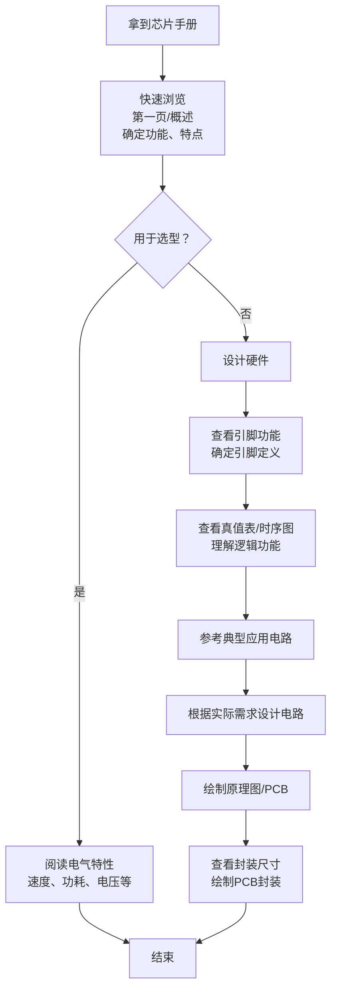

# 数字逻辑电路（下）
___
## 目录<a id = "目录"></a>
- [半导体存储器](#第五章)
    - [只读存储器（ROM）](#5.1)
    - [随机存取存储器（RAM）](#5.2)
    - [存储器扩展](#5.3)
    - [存储器的时序与参数](#5.4)
- [可编程逻辑器件](#第六章)
    - [简单PLD](#6.1)
    - [复杂PLD](#6.2)
    - [现场可编程门阵列](#6.3)
    - [硬件描述语言（HDL）基础](#6.4)
- [脉冲波形的产生与整形](#第七章)
    - [多谐振荡器](#7.1)
    - [施密特触发器](#7.2)
    - [定时器（555定时器）](#7.3)
- [数模与模数转换](#第八章)
    - [数模转换器](#8.1)
    - [模数转换器](#8.2)
    - [模拟开关与多路复用](#8.3)
- [数字系统设计基础](#第九章)
    - [有限状态机](#9.1)
    - [数据通路与控制器的设计](#9.2)
    - [时序约束与同步设计](#9.3)
    - [设计验证与测试](#9.4)
- [实验与EDA工具基础](#第十章)
    - [逻辑门电路参数](#10.1)
    - [集成电路芯片手册阅读](#10.2)
    - [常见数字IC系列](#10.3)
    - [EDA 工具使用](#10.4)
___
## 第五章：半导体存储器<a id = "第五章"></a>
### 5.1 只读存储器（ROM）<a id = "5.1"></a>

只读存储器（Read-Only Memory, ROM）是一种非易失性存储器，即断电后数据不会丢失。ROM中的数据通常预先写入，在正常工作时只能读取，不能随意修改。随着技术的发展，出现了可编程、可擦除的ROM类型。本节介绍各类ROM的原理、特点及典型应用。

#### 一、ROM的基本概念与结构

##### 1.1 基本结构
ROM的核心是一个存储单元阵列，每个存储单元存放1位二进制数据（0或1）。从逻辑上看，ROM由**地址译码器**和**存储矩阵**组成：
- **地址译码器**：将输入的地址信号译码，选中存储矩阵中的某一行（字线）。
- **存储矩阵**：由存储单元排列成二维阵列，每个存储单元位于字线和位线的交叉点。当字线被选中时，对应存储单元的数据输出到位线上。

##### 1.2 工作原理
以二极管或MOS晶体管构成存储单元。例如，在掩膜ROM中，通过是否连接晶体管来存储1或0。读取时，给定地址，译码器选中一条字线，该行上所有存储单元导通（或关断），位线上的电平经读出放大器后输出数据。

##### 1.3 分类
根据数据写入方式的不同，ROM分为：
- 掩膜ROM（Mask ROM）
- 可编程ROM（PROM）
- 可擦除可编程ROM（EPROM）
- 电可擦除可编程ROM（EEPROM）
- 闪存（Flash Memory）

#### 二、掩膜ROM（Mask ROM）

##### 2.1 制造过程
掩膜ROM在芯片制造过程中，由生产厂家根据用户提供的代码，通过最后一次光刻掩膜（铝线或有源区）决定存储单元的连接与否，从而固化数据。用户无法修改。

##### 2.2 特点
- **优点**：成本低（大批量生产）、可靠性高、读取速度快。
- **缺点**：编程灵活性差，一次成型后不可更改；生产周期长（需制版）；不适合小批量或开发阶段。
- **应用**：大批量生产的电子产品，如游戏卡带、打印机字库、微控制器中的固件（早期）。

#### 三、可编程ROM（PROM，Programmable ROM）

##### 3.1 结构
PROM在出厂时所有存储单元均为1（或0），每个存储单元串接一个**熔丝**（通常是多晶硅或镍铬材料）。用户通过**编程器**向特定地址施加高压大电流，将对应的熔丝熔断，从而将1改为0（或反之）。

##### 3.2 特点
- **一次性编程**（OTP，One-Time Programmable）：一旦熔断，无法恢复。
- **优点**：用户可自行编程，适合小批量生产或原型验证。
- **缺点**：只能写一次，不能擦除；编程需要专用设备。
- **应用**：早期用于存储微程序控制器中的微代码、存储查表数据等。

#### 四、可擦除可编程ROM（EPROM，Erasable Programmable ROM）

##### 4.1 结构
EPROM采用**浮动栅MOS管**（Floating Gate MOS）作为存储单元。浮动栅被二氧化硅绝缘层包围，正常情况下电荷可以长时间保持。写入时，通过**雪崩注入**（高电压）将电荷注入浮动栅，改变阈值电压，从而控制MOS管的导通与否（对应0/1）。

##### 4.2 擦除方式
EPROM芯片的封装上有一个透明的**石英窗口**。用紫外线（UV）照射窗口，可使浮动栅上的电荷泄漏，从而擦除整个芯片的数据（全变为1）。擦除时间通常需要10~30分钟。

##### 4.3 特点
- **优点**：可反复编程（擦除后重写），适合开发调试。
- **缺点**：擦除需紫外线，操作不便；窗口需遮挡以防意外擦除；擦除时间长；只能整片擦除，不能按字节擦除。
- **应用**：早期的BIOS芯片、开发板上的固件存储。

#### 五、电可擦除可编程ROM（EEPROM，Electrically Erasable PROM）

##### 5.1 结构
EEPROM也使用浮动栅技术，但隧道氧化层更薄，允许通过电信号（隧道效应）将电荷注入或拉出浮动栅，从而实现**字节级电擦除和写入**。写入和擦除电压通常为+5V或+12V（现代器件内部集成电荷泵，可单电源供电）。

##### 5.2 特点
- **优点**：可在电路中在线擦写（不取下芯片），支持按字节擦除和重写；擦写次数高（典型10万次以上）；数据保持时间长（10年以上）。
- **缺点**：写入速度慢（毫秒级），比RAM慢得多；成本较高；存储密度相对较低。
- **应用**：存储少量需要经常修改的配置参数，如主板BIOS（早期）、数字电位器、MCU中的用户数据存储。

#### 六、闪存（Flash Memory）

闪存是EEPROM的变种，它进一步提高了集成度和存储密度，成为现代非易失性存储器的主流。

##### 6.1 结构与分类
- **NOR Flash**：每个存储单元独立连接位线和字线，类似EPROM结构。可随机读取，支持字节级访问，但擦除必须以块为单位（块大小512B~128KB）。写入速度慢，擦除时间长。常用于存储代码（因为可随机执行，XIP）。
- **NAND Flash**：存储单元串联成串（类似与非门结构），提高密度。读取和写入以页为单位（页大小2KB~16KB），擦除以块为单位。不适合随机访问，但顺序读写速度快，密度高，成本低。主要用于大容量数据存储，如U盘、SSD、SD卡。

##### 6.2 特点
- **优点**：高密度、低成本、非易失性、电可擦写。
- **缺点**：擦写次数有限（NOR约10万次，NAND约1万~10万次）；存在坏块管理问题；写入前需擦除（不能覆盖写）。
- **应用**：NOR Flash用于嵌入式系统固件、BIOS；NAND Flash用于固态硬盘、U盘、手机存储。

##### 6.3 与EEPROM的区别
- EEPROM支持字节擦除，而闪存只能以块/页为单位擦除。
- 闪存的存储密度更高，成本更低，适合大容量。
- 闪存的擦写次数通常低于EEPROM。

#### 七、ROM的扩展方法

当需要更大容量的ROM时，可将多片ROM芯片进行**字扩展**（地址范围扩展）和**位扩展**（数据位宽扩展）。

- **位扩展**：将多片相同地址容量的ROM的数据输出线并成更宽的位宽，地址线并联，片选同时有效。例如，两片4位×4K的ROM可组成8位×4K的ROM。
- **字扩展**：增加地址线的最高位，通过译码器产生片选信号，分别选通不同的芯片。例如，两片8位×4K的ROM可组成8位×8K的ROM（地址线增加1位，片选由高位地址译码产生）。

#### 八、ROM的应用

- **固件存储**：BIOS、UEFI、路由器固件、嵌入式系统的启动程序。
- **查表（Look-up Table）**：实现任意逻辑函数（用ROM存储真值表）、三角函数表、译码器。
- **微程序控制器**：微指令存储。
- **字符发生器**：显示系统中的字模库。
- **数据备份**：存储校准参数、序列号等。

#### 九、典型例题

##### 例1：ROM容量计算
一片ROM的地址线为16根，数据线为8根，其容量是多少？
解：地址线16根，可寻址 $2^{16}=65536$ 个单元，每个单元8位，故容量为 $65536 \times 8$ 位 = 64K字节（512Kb）。

##### 例2：比较PROM和EPROM
PROM一次编程，不能擦除，适合已定型的小批量生产；EPROM可紫外线擦除，适合开发阶段，但擦除不便。现代设计中，EEPROM和Flash已取代大部分场合。

##### 例3：设计一个32K×8位的ROM系统，使用8K×8位的ROM芯片。
解：需要 $32K/8K=4$ 片。地址线共15根（$2^{15}=32K$）。高2位地址通过2-4译码器产生片选信号，分别选通4片ROM；低13位地址并联到各芯片的地址输入端；各芯片的数据输出直接并联（位宽相同）。

#### 十、小结

只读存储器（ROM）家族包括掩膜ROM、PROM、EPROM、EEPROM和闪存。你需要掌握：
1. 各类ROM的写入/擦除原理及特点（掩膜ROM不可改写；PROM一次编程；EPROM紫外线擦除；EEPROM电擦除字节级；Flash块擦除）。
2. 浮动栅MOS管的基本工作原理（电荷存储改变阈值电压）。
3. NOR Flash与NAND Flash的区别及应用场景。
4. ROM的容量计算和扩展方法（字扩展、位扩展）。
5. ROM在数字系统中的典型应用（固件、查表、微程序等）。
___
- [返回目录](#目录)
___
### 5.2 随机存取存储器（RAM）<a id = "5.2"></a>

随机存取存储器（Random Access Memory, RAM）是一种易失性存储器，即断电后数据丢失。RAM允许在任意地址以相同速度读写数据，是计算机系统中的主要工作存储器。本节介绍静态RAM（SRAM）、动态RAM（DRAM），以及同步DRAM（SDRAM）、DDR SDRAM等现代存储技术。

#### 一、RAM的基本概念与分类

##### 1.1 特点
- **随机存取**：访问任何存储单元所需时间相同，与位置无关。
- **易失性**：断电后数据消失。
- **读写操作**：支持高速读写（相对于ROM）。

##### 1.2 分类
- **静态RAM（SRAM）**：使用锁存器（双稳态电路）存储数据，无需刷新，速度快，但集成度低，功耗较高。
- **动态RAM（DRAM）**：使用电容存储电荷，集成度高，功耗低，但需定期刷新，速度较慢。

#### 二、静态RAM（SRAM）

##### 2.1 存储单元结构
典型的SRAM单元由6个MOS管组成（6T SRAM）：两个交叉耦合的反相器构成锁存器，两个访问管（传输门）由字线控制，连接到位线和反位线（差分信号）。写入时，字线高电平，通过位线强行置入数据；读取时，字线高电平，差分放大器检测位线电压差。

##### 2.2 工作原理
- **保持**：字线低电平，访问管截止，锁存器通过正反馈保持原状态。
- **读操作**：字线高电平，位线预充电至高电平，存储单元将内部数据反映到位线（0或1），由灵敏放大器放大输出。
- **写操作**：字线高电平，位线强制置为所需电平，驱动锁存器翻转。

##### 2.3 特点
- **优点**：速度快（纳秒级），无需刷新，时序简单。
- **缺点**：单元面积大（6个晶体管），集成度低，功耗较高（静态功耗小但动态功耗与频率相关）。
- **应用**：CPU缓存（L1、L2、L3）、寄存器文件、嵌入式系统中的小容量高速存储器。

#### 三、动态RAM（DRAM）

##### 3.1 存储单元结构
DRAM单元由1个MOS管和1个电容组成（1T1C）。电容存储电荷（有电荷为1，无电荷为0），MOS管作为开关由字线控制，连接到位线。由于电容漏电，需周期性刷新。

##### 3.2 工作原理
- **读操作**：字线高电平，MOS管导通，电容与位线（预充到Vref/2）共享电荷，引起位线微小电压变化，由灵敏放大器检测放大，输出数据。读取后电容电荷被破坏（读出破坏性），需立即写回（自动刷新）。
- **写操作**：字线高电平，位线驱动为所需电平（高或低），直接对电容充电或放电。

##### 3.3 刷新（Refresh）
- 由于电容漏电，数据只能保持几毫秒（典型64ms）。需要定期对每行（字线）进行刷新：执行一次读操作（或伪读），使灵敏放大器将数据恢复后写回。
- **刷新方式**：
  - **集中刷新**：在每64ms中，顺序对所有行刷新一次。期间无法正常读写（死区）。
  - **分散刷新**：将刷新操作分散到每个存取周期之后，但会降低性能。
  - **异步刷新**：利用刷新控制器周期性地发出刷新命令，与正常读写交错。

##### 3.4 特点
- **优点**：单元面积小（仅1个晶体管+1个电容），集成度高，成本低，功耗低（电容漏电小，动态功耗与频率成正比）。
- **缺点**：速度较慢（几十纳秒至百纳秒），需要刷新电路，时序复杂。
- **应用**：计算机主存、显卡显存。

#### 四、DRAM的衍生产品

##### 4.1 同步DRAM（SDRAM）
传统DRAM是异步的，即控制信号与时钟无关。SDRAM使用时钟信号同步所有操作（地址、数据、控制），从而支持流水线操作，提高数据传输率。SDRAM内部有多个存储体（Bank），支持交叉存取。

##### 4.2 DDR SDRAM（Double Data Rate SDRAM）
DDR在时钟的上升沿和下降沿各传输一次数据，使数据带宽加倍。后续发展：
- **DDR2**：采用4位预取，更高速；降低电压。
- **DDR3**：8位预取，更高频率，更低电压。
- **DDR4**：16位预取，数据速率达3.2Gbps以上，降低功耗。
- **DDR5**：进一步增加预取位（32位），支持独立子通道，提高效率。
- **LPDDR（低功耗DDR）**：用于移动设备，功耗更低。

##### 4.3 其他DRAM技术
- **GDDR（Graphics DDR）**：用于显卡，高带宽，高延迟容忍。
- **HBM（High Bandwidth Memory）**：3D堆叠，通过硅通孔连接，极高带宽。

#### 五、存储器扩展

##### 5.1 位扩展（数据位宽扩展）
当需要更宽的数据总线时，将多片相同地址容量的RAM的数据线并接（例如，两片4位×4K RAM组成8位×4K）。地址线、读写控制、片选并联，数据输出分别连接高位和低位。

##### 5.2 字扩展（地址空间扩展）
使用译码器将高位地址转换为片选信号，分别选通多片RAM，扩展地址范围。例如，两片8位×4K RAM组成8位×8K：增加1根高位地址，通过反相器产生两个片选信号，低13位地址并联。

##### 5.3 同时进行位扩展和字扩展
例如，用16片 256×4 位的RAM组成 1K×8 位。先位扩展：两片并成 256×8（2片），再字扩展：4组（共8片？需计算：1K=1024，256为一块，共需4块，每块需要2片（位扩展），共8片）。地址线10根（1K），高2位用于字扩展（选4组），低8位用于片内地址。每组的片选由2-4译码器产生。

#### 六、存储器时序与参数

- **访问时间（$t_{acc}$）**：从地址有效到数据稳定的时间。
- **读周期时间（$t_{RC}$）**：两次连续读操作的最小间隔。
- **写周期时间（$t_{WC}$）**：类似。
- **DRAM刷新间隔**：典型64ms。
- **DRAM行/列地址选通**：RAS（Row Address Strobe）和CAS（Column Address Strobe）控制地址复用（先送行地址，再送列地址）。

#### 七、典型例题

##### 例1：计算所需DRAM芯片数量
某计算机主存容量为 4MB，使用 256K×1 位的DRAM芯片，需要多少片？
解：4MB = $4 \times 1024 \times 1024 \times 8$ 位 = $32 \times 1024 \times 1024$ 位 = $32$ M位。每片256K位 = $256 \times 1024$ 位 = 262144位。所以片数 = $32\text{M} / 256\text{K} = 128$ 片。

##### 例2：SRAM与DRAM比较
SRAM速度快，无需刷新，但面积大，适合高速缓存；DRAM集成度高，成本低，但需刷新，适合主存。

##### 例3：DDR SDRAM带宽计算
DDR3-1600（数据传输率1600 MT/s），64位（8字节）总线，理论峰值带宽 = $1600 \times 8 = 12.8$ GB/s。

#### 八、小结

随机存取存储器是现代计算机系统的核心部件。你需要掌握：
1. SRAM与DRAM的存储单元结构、工作原理及优缺点。
2. DRAM的刷新机制（为什么需要刷新、如何刷新）。
3. SDRAM和DDR系列的特点（同步、双倍速率、预取）。
4. 存储器扩展方法（位扩展、字扩展）。
5. 常见存储器时序参数。
___
- [返回目录](#目录)
___
### 5.3 存储器扩展<a id = "5.3"></a>

在实际数字系统中，单块存储芯片的容量或数据位宽往往不能满足需求。存储器扩展就是通过将多片存储芯片（ROM、RAM）组合起来，构成容量更大、数据位宽更宽的存储系统。扩展方式主要有位扩展、字扩展以及二者的组合。

#### 一、位扩展（数据位宽扩展）

##### 1.1 适用场景
当需要增加存储器的字长（数据位宽），而地址空间（字数）不变时，采用位扩展。例如，用4片 4位×4K 的RAM组成 16位×4K 的RAM。

##### 1.2 连接方法
- 将各芯片的地址线、读写控制线（如 WE、OE）、片选线（CS）全部并联。
- 各芯片的数据输入/输出线分别连接到数据总线的不同位段（例如，第一片连接 D0-D3，第二片 D4-D7，……）。
- 读写操作时，同一地址同时访问所有芯片，各芯片输出自己的数据位，组合成完整数据字。

##### 1.3 示例
用两片 2K×4 位的 RAM 组成 2K×8 位的存储器。
- 每片地址线 11 根（2K=2^11），两片地址线直接并联。
- 读写控制（WE、OE）并联。
- 片选（CS）并联（因为是同时选通）。
- 第一片的数据线接 D0~D3，第二片接 D4~D7。

#### 二、字扩展（地址空间扩展）

##### 2.1 适用场景
当需要增加存储器的地址空间（字数），而数据位宽不变时，采用字扩展。例如，用 2片 8位×4K 的RAM组成 8位×8K 的RAM。

##### 2.2 连接方法
- 所有芯片的数据线、读写控制线并联。
- 地址线分为两部分：
  - **低位地址线**（片内地址）并联到所有芯片，用于寻址每片内部的存储单元。
  - **高位地址线**（片选地址）通过译码电路产生各芯片的片选信号（CS），每个芯片在不同的地址范围内被选中。
- 一次只选中一片芯片，数据总线由该芯片驱动。

##### 2.3 译码方式
- **线选法**：直接用高位地址线作为片选（例如，用A15选通第一片，A14选通第二片），简单但地址空间不连续、利用率低。
- **全译码**：使用译码器（如3-8译码器）将高位地址组合产生片选信号，地址空间连续且无重叠。
- **部分译码**：只使用部分高位地址译码，剩余高位地址忽略，会导致地址重叠（多个地址映射到同一物理单元），但可简化电路。

##### 2.4 示例
用两片 8位×4K 的RAM组成 8位×8K 的存储器。
- 芯片容量4K，需要12根地址线（2^12=4096）。
- 总容量8K，需要13根地址线（A0~A12）。
- 将 A0~A11 作为片内地址并联到两片芯片。
- 用 A12 作为片选：A12=0 时选中第一片，A12=1 时选中第二片（可通过反相器实现）。地址范围：第一片 0x0000~0x0FFF，第二片 0x1000~0x1FFF。

#### 三、位扩展与字扩展的组合

##### 3.1 适用场景
当需要同时增加字长和地址空间时，先进行位扩展构成所需位宽的芯片组，再进行字扩展扩大容量。

##### 3.2 示例
用 256×4 位的RAM芯片构成 1K×8 位的存储器。
- 首先，位扩展：每两片 256×4 位组成 256×8 位（数据位宽8位）。共需要 2 片组成一个“组”。
- 总容量 1K=1024 字，256 字/组，需要 1024/256=4 组。
- 所以总共需要 4×2=8 片芯片。
- 地址线：1K 需要 10 根地址线（A0~A9）。低 8 位（A0~A7）作为片内地址（256=2^8），高 2 位（A8,A9）通过 2-4 译码器产生 4 个片选信号，分别选通 4 个组。每个组的片选信号同时选通该组内的两片芯片（位扩展部分）。

#### 四、片选信号的产生

##### 4.1 常用译码器
- 2-4 译码器（如74LS139）：输入2位，输出4个低有效（或高有效）片选。
- 3-8 译码器（如74LS138）：输入3位，输出8个片选。
- 也可用门电路（与门、或门）实现简单译码。

##### 4.2 注意片选的有效电平
存储芯片的片选（CS或CE）可能是高电平有效或低电平有效，译码器输出应与之匹配。例如，使用低有效输出译码器（如74LS138）时，可直接连接低有效片选端。

#### 五、存储器扩展中的时序考虑

- **访问时间**：多片并联时，片选译码电路会引入额外延迟，可能降低系统速度。应选用高速译码器或减少译码级数。
- **负载效应**：数据总线并联的芯片数量增加，总线电容增大，可能影响信号完整性。在高速系统中需加缓冲器。
- **功耗**：字扩展中，同一时间只有一片芯片被选中，但其他芯片也会有静态功耗（尤其对于RAM，即使未选中也存在漏电）。采用低功耗芯片或电源管理可缓解。

#### 六、典型例题

##### 例1：位扩展
使用 8K×1 位的DRAM芯片设计一个 8K×8 位的存储器，需要多少片？画出连接图。
解：需要 8 片。地址线共用（13根），数据线每片接一位。WE、OE、CS并联。

##### 例2：字扩展
现有 16K×8 位的SRAM芯片，欲组成 64K×8 位的存储器，需几片？如何连接？
解：需要 4 片（64/16=4）。低位地址（14根）并联，高位地址（2根）经2-4译码器产生4个片选信号。

##### 例3：组合扩展
用 2K×4 位ROM芯片，设计 8K×8 位ROM，画出地址分配和译码电路。
解：位扩展：两片组成 2K×8 位（1组）。字扩展：需要4组（8K/2K=4）。总地址线13根（8K=2^13）。低11根（A0~A10）作为片内地址（2K=2^11）。高2根（A11,A12）经2-4译码器产生4个片选，分别选通4个组。每组内两片ROM的数据线分别接高4位和低4位。

#### 七、小结

存储器扩展是构建大容量存储系统的基本技术。你需要掌握：
1. 位扩展：增加数据位宽，芯片并联所有控制线和地址线，数据线分别连接不同位段。
2. 字扩展：增加地址空间，使用高位地址译码产生片选信号，芯片数据线并联。
3. 组合扩展：先位扩展构成所需位宽的组，再字扩展增加容量。
4. 片选译码方法（线选、全译码、部分译码）。
5. 时序和负载考虑。
___
- [返回目录](#目录)
___
### 5.4 存储器的时序与参数<a id = "5.4"></a>

存储器作为数字系统的核心部件，其性能不仅取决于容量和位宽，还受到时序参数的限制。这些参数决定了存储器的访问速度、读写周期、功耗等。正确理解这些参数对于设计高效、可靠的存储系统至关重要。本节主要介绍常用的存储器时序参数及其含义。

#### 一、基本时序参数

##### 1.1 访问时间（Access Time, $t_{acc}$）

- **定义**：从地址信号有效稳定开始，到读出数据出现在数据总线上的时间。对于ROM或RAM，通常指读取操作时，地址变化到输出数据有效的时间间隔。
- **单位**：纳秒（ns）或皮秒（ps）。
- **影响因素**：存储单元阵列的译码延迟、读出放大器延迟、输出缓冲延迟。
- **意义**：访问时间越小，存储器速度越快。例如，SRAM的访问时间可达几纳秒，而DRAM通常在几十纳秒。

##### 1.2 读周期时间（Read Cycle Time, $t_{RC}$）

- **定义**：两次连续读操作之间的最小时间间隔，即从一次读操作开始到下一次读操作开始的最小允许时间。
- **关系**：通常 $t_{RC} \ge t_{acc}$，因为读操作完成后还需要地址、控制信号的恢复时间。对于异步存储器，$t_{RC}$ 可能大于 $t_{acc}$；对于同步存储器，$t_{RC}$ 等于时钟周期。

##### 1.3 写周期时间（Write Cycle Time, $t_{WC}$）

- **定义**：两次连续写操作之间的最小时间间隔。
- **组成**：包括地址建立时间、数据建立时间、写入脉冲宽度、数据保持时间等。

##### 1.4 地址建立时间（$t_{AS}$）与地址保持时间（$t_{AH}$）

- **$t_{AS}$（Address Setup Time）**：在读写控制信号（如片选、写使能）有效之前，地址信号必须稳定的最小提前时间。
- **$t_{AH}$（Address Hold Time）**：在控制信号无效之后，地址信号必须保持的最小时间。

##### 1.5 数据建立时间（$t_{DS}$）与数据保持时间（$t_{DH}$）

- **$t_{DS}$（Data Setup Time）**：在写操作时，数据必须在写使能（或写脉冲）结束前稳定的最小提前时间。
- **$t_{DH}$（Data Hold Time）**：在写使能结束后，数据必须保持稳定的最小时间。

##### 1.6 写脉冲宽度（$t_{WP}$）

- **定义**：写使能信号（或写时钟）有效的最小持续时间。如果写脉冲太窄，存储单元可能无法正确写入。

#### 二、异步存储器时序（以SRAM为例）

异步SRAM的控制信号包括片选（CS）、输出使能（OE）、写使能（WE）。典型读操作时序：
1. 地址变化，经过 $t_{AA}$（地址访问时间）后数据有效。但为了可靠，通常先使CS和OE有效。
2. CS和OE有效后，经过 $t_{ACE}$（片选访问时间）或 $t_{OE}$（输出使能访问时间）数据出现。
3. 读取完成后，CS或OE无效，数据总线进入高阻态。

典型写操作时序：
1. 地址稳定后，需满足 $t_{AS}$（地址建立时间）。
2. WE有效（低电平）的持续时间必须 $\ge t_{WP}$。
3. 数据必须在写脉冲结束前 $t_{DS}$ 建立，并在写脉冲结束后保持 $t_{DH}$。
4. 写完成后，地址需保持 $t_{AH}$。

#### 三、同步存储器时序（以SDRAM为例）

同步DRAM（SDRAM）所有操作与时钟上升沿同步。关键参数包括：
- **时钟频率**：如133MHz、200MHz等。
- **CAS延迟（CL，CAS Latency）**：从读命令发出到第一个数据出现在数据总线上的时钟周期数。例如，CL=3表示需要3个时钟周期。
- **列地址选通脉冲宽度**：与突发传输相关。
- **刷新间隔**：DRAM必须周期性刷新，典型为64ms。

#### 四、DRAM特有参数

##### 4.1 行地址选通到列地址选通延迟（$t_{RCD}$）
- 从施加行地址（RAS有效）到可施加列地址（CAS有效）的最小间隔。

##### 4.2 行预充电时间（$t_{RP}$）
- 当前行关闭到下一次打开新行所需的最小时间，用于预充电（将位线恢复）。

##### 4.3 行周期时间（$t_{RC}$）
- 从打开一行到下一次打开同一行（或不同行）的最小时间，通常 $t_{RC} = t_{RAS} + t_{RP}$。

##### 4.4 行有效时间（$t_{RAS}$）
- 行地址有效的最小持续时间。

##### 4.5 刷新周期（$t_{REF}$）
- DRAM必须刷新所有存储体的最大时间间隔，一般为64ms。在刷新期间，不能正常读写（需使用刷新周期）。

#### 五、参数对系统性能的影响

- **访问时间**：决定存储器的读取延迟，影响CPU等待周期。
- **周期时间**：决定存储器的最大带宽。例如，若 $t_{RC}=10ns$，则最大读频率100MHz，但若 $t_{acc}=5ns$，仍受限于周期时间。
- **建立/保持时间**：若不符合，会导致数据错误，甚至损坏存储器。
- **CAS延迟**：在SDRAM中，CL值越大，读取延迟越大，但时钟频率可提高。

#### 六、典型时序图示例（文字描述）

##### 6.1 异步SRAM读时序
```
地址 ----<稳定>----------------------------
CS ----<>----------------------------
OE -------<>-------------------------
数据 ----------<有效数据>--------------------
```
- $t_{AA}$：地址到数据有效。
- $t_{ACE}$：CS到数据有效。
- $t_{OE}$：OE到数据有效。

##### 6.2 异步SRAM写时序
```
地址 ----<稳定>----------------------------
CS ----<____>----------------------------
WE ----------<_____>---------------------
数据 ---------------<稳定>-------------------
```
- $t_{AS}$：地址提前于WE有效。
- $t_{WP}$：WE低电平宽度。
- $t_{DS}$：数据提前于WE结束时间。
- $t_{DH}$：数据保持时间。
- $t_{AH}$：地址保持时间。

#### 七、典型例题

##### 例1：计算访问时间匹配
CPU访问存储器时，要求存储器的 $t_{acc}$ 小于CPU的时钟周期减接口逻辑延迟。某CPU时钟周期10ns，地址输出到数据输入有2ns延迟，存储器的 $t_{acc}$ 应小于多少？答：10 - 2 = 8ns。

##### 例2：DRAM刷新频率计算
一个DRAM有1024行，刷新周期64ms。若采用集中刷新，则每64ms内需连续刷新1024次，每次刷新时间100ns，计算刷新占用的时间比例。解：总刷新时间 = 1024 × 100ns = 102.4μs，占用比例 = 102.4μs / 64ms ≈ 0.16%，影响很小。

##### 例3：读周期时间与带宽
某SDRAM的读周期时间（$t_{RC}$）= 20ns，数据总线64位，求理论最大读带宽。解：每秒可读 $1/20ns = 50 \times 10^6$ 次，每次8字节，带宽 = 400 MB/s。

#### 八、小结

存储器的时序参数决定了其接口速度和系统集成方式。你需要掌握：
1. 基本时序参数：访问时间、读/写周期时间、建立/保持时间、写脉冲宽度。
2. 异步SRAM的读/写时序要求。
3. 同步存储器（SDRAM）的CAS延迟、$t_{RCD}$、$t_{RP}$、$t_{RC}$等。
4. DRAM的刷新机制及相关时间参数。
5. 能够根据数据手册计算存储器的访问时间、带宽，并判断是否满足系统时序。
___
- [返回目录](#目录)
___
## 第六章：可编程逻辑器件<a id = "第六章"></a>
### 6.1 简单PLD（可编程逻辑器件）<a id = "6.1"></a>

可编程逻辑器件（PLD）允许用户通过编程实现自定义逻辑功能。简单PLD主要包括可编程逻辑阵列（PLA）、可编程阵列逻辑（PAL）和通用阵列逻辑（GAL）。它们是早期小规模可编程逻辑器件，常用于代替组合逻辑和简单时序逻辑。

#### 一、可编程逻辑阵列（PLA）

##### 1.1 结构
PLA由**可编程的与阵列**和**可编程的或阵列**组成，如图（概念图）：
- 输入信号经缓冲器产生原变量和反变量。
- 与阵列：多个乘积项（与项），每个与项可连接任意输入变量（原或反）。
- 或阵列：将某些乘积项相或，形成输出函数。
- 输出可包含寄存器（时序PLA）或直接输出（组合PLA）。

##### 1.2 特点
- **双可编程**：与阵列和或阵列均可由用户编程。
- **灵活性高**：可实现任意积之和（SOP）形式，且乘积项可共享。
- **资源利用率高**：与项可被多个输出复用。
- **缺点**：编程复杂，速度较慢（两级延迟），且早期PLA采用熔丝工艺，一次性编程。

##### 1.3 编程原理
用熔丝（或反熔丝）连接交叉点。编程时，通过电流熔断不需要的连接，保留需要的连接。现代PLA可能采用EPROM或EEPROM技术。

#### 二、可编程阵列逻辑（PAL）

##### 2.1 结构
PAL的**与阵列可编程**，**或阵列固定**。因此每个输出对应的乘积项数量是固定的（例如每个输出最多8个乘积项）。这种结构简化了编程，提高了速度。

##### 2.2 特点
- **只编程与阵列**：编程较简单。
- **固定或阵列**：输出乘积项数目固定，可能导致资源浪费（某些输出用不了那么多乘积项，而某些可能不够）。
- **速度更快**：因为或阵列固定，路径延迟可预测。
- **典型芯片**：PAL16L8（组合输出）、PAL16R8（寄存器输出）。

##### 2.3 编程技术
早期PAL采用熔丝技术，一次性编程（OTP）。也有电可擦除版本（如PALCE）。

##### 2.4 局限性
- 逻辑资源固定，不够灵活。
- 不能重复编程（熔丝型）。
- 集成度低（通常几百门）。

#### 三、通用阵列逻辑（GAL）

##### 3.1 结构
GAL在PAL基础上增加了**输出逻辑宏单元（OLMC，Output Logic Macrocell）**，使得每个输出可配置为组合输出、寄存器输出、输入、双向等模式。且采用**电可擦除CMOS（E²CMOS）**技术，可重复编程。

##### 3.2 OLMC功能
OLMC通常包括：
- 一个异或门（控制输出极性）。
- 一个D触发器（用于时序电路）。
- 多路选择器（配置输出类型：组合/寄存、高/低有效、三态等）。
- 反馈路径：可将输出或寄存后的信号反馈回与阵列。

##### 3.3 特点
- **可重复编程**：电擦除，易于开发调试。
- **可配置性强**：同一芯片可设计多种电路。
- **高速度**：与PAL相当。
- **典型芯片**：GAL16V8、GAL22V10。

##### 3.4 编程方式
使用编程器（如TL866）或通过JTAG（部分型号）。支持ISP（在系统编程）的GAL较少。

#### 四、PLA、PAL、GAL对比

| 特性 | PLA | PAL | GAL |
|------|-----|-----|-----|
| 与阵列 | 可编程 | 可编程 | 可编程 |
| 或阵列 | 可编程 | 固定 | 固定，但通过OLMC可配置 |
| 输出结构 | 固定（可选寄存器） | 固定（部分型号带寄存器） | 可配置（OLMC） |
| 可重复编程 | 少数（EPROM） | 多为OTP | 电可擦除，可重复 |
| 灵活性 | 高 | 中 | 高 |
| 速度 | 较慢 | 快 | 快 |
| 典型应用 | 复杂组合逻辑 | 中等密度逻辑 | 通用逻辑设计、原型开发 |

#### 五、简单PLD的设计流程

1. **设计输入**：用逻辑表达式、真值表或原理图描述电路。
2. **编译**：将设计转换为熔丝图或JEDEC文件（标准下载格式）。
3. **仿真**：验证逻辑功能。
4. **编程**：使用编程器将JEDEC文件写入芯片。
5. **测试**：在目标系统中验证。

#### 六、典型应用

- **地址译码器**：在微机系统中产生片选信号。
- **状态机**：用GAL实现简单状态机（需要寄存器）。
- **接口逻辑**：如总线缓冲、中断控制。
- **随机逻辑替换**：替代多个74系列小规模芯片，减少PCB面积。

#### 七、例题

##### 例1：设计一个3-8译码器，使用GAL16V8实现
解：GAL16V8有8个输出，每个输出对应一个最小项。编程时，将输入A2,A1,A0接芯片输入引脚，输出Y0~Y7配置为组合输出低有效。每个输出表达式为 $Y_i = \overline{m_i}$，可直接在PAL式方程中描述：`/Y0 = /A2 & /A1 & /A0` 等。

##### 例2：比较PAL和GAL的灵活性
PAL一旦选定型号，输出结构固定（如组合或寄存器）。GAL可通过OLMC配置每个输出为组合或寄存，且可重复编程，灵活性远高于PAL。

#### 八、小结

简单PLD是数字逻辑设计从离散门电路走向可编程逻辑的过渡。你需要掌握：
1. PLA、PAL、GAL的内部结构（与/或阵列、OLMC）。
2. 各类器件的优缺点和适用场景。
3. 编程技术（熔丝、EEPROM、E²CMOS）。
4. GAL的配置能力（OLMC）。
___
- [返回目录](#目录)
___
### 6.2 复杂PLD（CPLD）<a id = "6.2"></a>

复杂可编程逻辑器件（Complex Programmable Logic Device, CPLD）是在简单PLD（PAL/GAL）基础上发展起来的大规模可编程逻辑器件。它由多个“逻辑块”通过可编程互连矩阵连接而成，可容纳数千至数万门电路，适用于中等规模数字系统设计。

#### 一、CPLD的基本结构

CPLD通常由以下几个部分组成：

##### 1.1 逻辑阵列块（Logic Array Block, LAB）
- 每个LAB相当于一个**增强型PAL/GAL**，内部包含多个**宏单元**（Macrocell）。常见结构：每个LAB含4~16个宏单元。
- LAB内部的与阵列可编程，或阵列固定（或部分可配置），实现乘积项共享。

##### 1.2 宏单元（Macrocell）
宏单元是CPLD中的基本逻辑单元，其结构与GAL的OLMC类似，通常包括：
- 乘积项分配器（将多个乘积项组合为“与-或”逻辑）。
- 可编程触发器（D/T/JK，可配置为组合输出或寄存输出）。
- 多路选择器（配置输出极性、三态、反馈路径等）。
- 快速进位链（用于算术运算）。

##### 1.3 可编程互连矩阵（Programmable Interconnect）
- 连接各个LAB、输入输出引脚（I/O）和全局信号（时钟、复位）。
- 互连矩阵具有**高可预测延迟**：任意两点之间的延迟基本固定，与布线路径无关（这与FPGA不同）。
- 采用**多路选择器**或**交叉开关**结构实现。

##### 1.4 输入/输出块（I/O Block）
- 每个I/O引脚配有可编程的**输入/输出缓冲器**，可配置为输入、输出、双向或三态。
- 支持不同的电平标准（如TTL、LVTTL、CMOS）。
- 可编程压摆率、上拉/下拉电阻等。

#### 二、CPLD的互连方式

与FPGA的查找表（LUT）和局部互连不同，CPLD采用**集中式互连**：

- 所有LAB通过**全局总线**连接，任意LAB的输出可以经过互连矩阵送到任一其他LAB的输入或I/O引脚。
- 互连矩阵是**全交叉**或近似全交叉的，因此布线延迟**可预测且一致**，适合时序要求严格的设计。
- 互连资源丰富，通常不存在布线拥塞问题。

#### 三、CPLD与FPGA的区别

| 特性 | CPLD | FPGA |
|------|------|------|
| 逻辑单元 | 宏单元（基于乘积项） | 查找表（LUT）和触发器 |
| 互连结构 | 集中式全局互连（叉开关） | 分布式局部互连（分段） |
| 延迟特性 | 固定延迟，可预测 | 与布线路径有关，可变 |
| 容量 | 小到中等（几十到几千宏单元） | 大到极大（数万至数百万LUT） |
| 功耗 | 静态功耗较大（但动态较小） | 动态功耗较高 |
| 非易失性 | 多数采用Flash或EEPROM，上电即配置 | 多为SRAM型，需外挂配置芯片 |
| 适用设计 | 逻辑密集型（译码、状态机） | 数据密集型（算法、信号处理） |

#### 四、典型CPLD芯片系列

- **Xilinx XC9500系列**：早期CPLD，5V供电，采用Flash工艺。
- **Altera（现Intel）MAX 3000/5000/7000系列**：经典CPLD，MAX 7000采用EEPROM。
- **Lattice ispMACH 4000系列**：低功耗、高性能，支持3.3V/2.5V/1.8V。
- **Altera MAX II/MAX V系列**：基于FPGA架构的“CPLD”，实为低成本低密度FPGA，但兼容CPLD引脚和时序。

#### 五、开发流程

CPLD的开发与简单PLD类似，但支持更复杂的硬件描述语言（HDL）输入。

1. **设计输入**：使用Verilog/VHDL或原理图描述逻辑。
2. **综合**：将HDL代码映射到宏单元和乘积项。
3. **适配（布线）**：将逻辑分配到具体器件并完成互连。
4. **时序分析**：检查时序约束是否满足。
5. **编程**：生成JEDEC或SVF文件，通过编程器（如USB Blaster）写入CPLD。
6. **板上调试**：利用JTAG接口进行在系统编程和验证。

#### 六、CPLD的应用

- **胶合逻辑（Glue Logic）**：连接不同芯片，如地址译码、总线桥接。
- **状态机控制**：如工业控制、通信协议解析。
- **小规模嵌入式系统**：与CPU配合，实现外设片选、中断控制。
- **上电配置**：用于配置FPGA或其它电路。
- **快速原型**：替代多个74系列芯片，减少PCB面积。

#### 七、典型例题

##### 例1：CPLD宏单元实现边沿检测
设计一个上升沿检测电路：输入时钟clk、信号din，输出单周期高电平的pulse。使用CPLD宏单元中的触发器实现。描述如下：
```verilog
always @(posedge clk) begin
    dly <= din;
    pulse <= din & ~dly;
end
```
CPLD宏单元中的触发器可容纳寄存器和组合逻辑。

##### 例2：比较PAL/GAL与CPLD
PAL/GAL只有几十个宏单元，固定阵列结构；CPLD内部有多个LAB和可编程互连，规模更大，逻辑更灵活，且多为电可擦除可重复编程。

##### 例3：使用CPLD实现地址译码器
访问地址范围 0x8000~0x8FFF 时产生片选信号 CS。CPLD可编程乘积项直接实现：
```
/CS = A15 & /A14 & /A13 & ... // 具体取决于地址
```
#### 八、小结
CPLD是介于简单PLD和FPGA之间的可编程逻辑器件，具有非易失性、固定延迟、中等规模等特点。你需要掌握：
1. CPLD的基本结构：LAB、宏单元、互连矩阵、I/O块。
2. 宏单元内部组成（乘积项、触发器、配置MUX）。
3. CPLD与FPGA的主要区别（互连、延迟、容量、工艺）。
4. CPLD的典型应用场景（胶合逻辑、状态机、译码）。
5. 了解常见CPLD系列及其特点。
___
- [返回目录](#目录)
___
### 6.3 现场可编程门阵列（FPGA）<a id = "6.3"></a>

现场可编程门阵列（Field Programmable Gate Array, FPGA）是一种高密度可编程逻辑器件，其逻辑单元基于查找表（LUT）和触发器，并通过丰富的可编程互连资源实现任意数字电路。与CPLD相比，FPGA规模更大、逻辑更灵活，适用于复杂数字系统设计，如通信、图像处理、人工智能加速等。

#### 一、FPGA的基本结构

FPGA内部主要由以下模块构成：

##### 1.1 可配置逻辑块（CLB, Configurable Logic Block）
CLB是FPGA中的基本逻辑单元，每个CLB包含多个**逻辑片（Slice）**，每个逻辑片包含：
- **查找表（LUT, Look-Up Table）**：通常为4~6输入，可实现任意组合逻辑函数（相当于小型ROM）。
- **触发器（Flip-Flop）**：用于寄存输出或实现时序电路。
- **多路选择器（MUX）**：用于配置LUT输出是否寄存、是否反转等。
- **进位链（Carry Chain）**：用于快速实现加法器、计数器等算术逻辑。

典型CLB可配置为LUT、分布式RAM或移位寄存器。

##### 1.2 输入输出块（IOB, Input/Output Block）
IOB是FPGA与外部引脚连接的接口电路，提供：
- 可编程的输入/输出方向（输入、输出、双向、三态）。
- 多种电平标准（如LVTTL、LVCMOS、SSTL、HSTL等）。
- 可编程驱动能力、压摆率、上拉/下拉电阻。
- 输入延迟、输出延迟、串并转换等（部分器件）。

##### 1.3 可编程互连资源（PI, Programmable Interconnect）
互连资源包括：
- **全局布线**：长线、中线、短线，用于连接不同区域的逻辑块。
- **局部布线**：在CLB内部或相邻CLB之间的快速连接。
- **开关矩阵（Switch Matrix）**：位于行列交叉点，通过编程控制多路选择器实现信号路由。

##### 1.4 块RAM（BRAM, Block RAM）
- 内嵌的专用存储单元，容量从几Kb到几十Mb不等。
- 可配置为单端口、双端口、简单双端口或真双端口RAM，也可配置为ROM、FIFO。
- 支持独立读写时钟、字节写使能、初始值加载等。

##### 1.5 DSP切片（DSP Slice）
- 专门用于高速算术运算的硬件单元，通常包含乘法器（$18\times18$、$25\times18$等）、加法器、累加器、流水线寄存器。
- 可配置为乘法、乘加、乘减、累加、模式检测等，实现数字信号处理（FIR、FFT）和神经网络加速。

##### 1.6 时钟管理单元（CMT, Clock Management Tile）
- **锁相环（PLL, Phase-Locked Loop）**：倍频、分频、移相、占空比调整、消除时钟偏斜。
- **数字延迟锁相环（DLL, Delay-Locked Loop）**：类似PLL，但使用延迟线，常用于DDR存储器接口。
- 输出多个时钟相位，频率可编程。

##### 1.7 其他资源
- **全局时钟网络**：低偏斜、高扇出的时钟分配网络。
- **配置逻辑**：加载比特流、控制配置过程。
- **硬核（Hard IP）**：如PCIe、以太网MAC、DDR控制器、ADC等（部分高端器件）。

#### 二、FPGA的配置方式

FPGA的配置（或称编程）是指将设计实现的比特流加载到器件中，使其实现预定义功能。根据工艺不同，配置方式有三类：

##### 2.1 SRAM型FPGA
- **存储单元**：使用SRAM存放配置数据（LUT内容、互连开关状态）。断电后数据丢失，每次上电需重新配置。
- **配置方式**：通过外部存储器（如串行EEPROM、Flash）或主处理器主动配置（如JTAG、SPI、BPI）。
- **优点**：可重复编程，速度快，工艺先进（高密度、低功耗）。
- **缺点**：需要外接配置芯片，易受单粒子翻转影响（需软错纠正）。
- **主流厂商**：Xilinx（现在AMD）的Spartan、Artix、Kintex、Virtex系列；Intel（原Altera）的Cyclone、Arria、Stratix系列；Lattice的ECP系列。

##### 2.2 反熔丝型FPGA（Antifuse）
- **存储单元**：通过击穿反熔丝（一种双向二极管）实现永久连接。一次性编程，不可擦除。
- **优点**：非易失性，上电即用；抗辐射能力强（适用于航天、军工）；延迟小。
- **缺点**：只能编程一次，成本高，密度低。
- **典型厂商**：Microsemi（现Microchip）的ACTEL系列（如SX、MX、ProASIC）。

##### 2.3 Flash型FPGA
- **存储单元**：使用Flash晶体管存储配置数据，非易失性，可重复编程（次数有限）。
- **优点**：非易失性，上电即用；无需外接配置芯片；安全性高。
- **缺点**：密度和速度略逊于SRAM型，擦写次数有限（一般几百至几千次）。
- **典型厂商**：Microsemi的IGLOO、SmartFusion（带ARM硬核）、Lattice的MachXO系列。

#### 三、主流FPGA厂商

- **AMD（原Xilinx）**：市场领导者，提供从低端Spartan到高端Virtex的全系列，以及自适应计算加速平台（ACAP，如Versal）。
- **Intel（原Altera）**：第二大厂商，主要产品包括Cyclone（低功耗）、Arria（中端）、Stratix（高端），以及集成ARM硬核的SoC FPGA（如Cyclone V SoC）。
- **Lattice Semiconductor**：专注于低密度、低功耗FPGA（如iCE40、CrossLink、ECP），以及MachXO系列CPLD-like FPGA。
- **Microchip（原Microsemi）**：主打反熔丝和Flash型FPGA，用于航空航天、高可靠性应用。

#### 四、设计流程

1. **设计输入**：使用硬件描述语言（Verilog/VHDL）或高层次综合（HLS，如C/C++）。
2. **综合**：将HDL转换为网表（逻辑单元和触发器）。
3. **布局布线**：将网表映射到具体CLB、BRAM、DSP等资源，并完成互连路径布线。
4. **时序分析**：检查建立/保持时间、时钟偏斜、最小/最大延迟等是否满足约束。
5. **生成比特流**：产生配置文件（.bit、.bin）。
6. **下载配置**：通过JTAG、SPI Flash等方式将比特流写入FPGA或外部配置芯片。

#### 五、典型应用

- **数字信号处理**：通信、雷达、音频/视频编解码、滤波器。
- **高速接口**：DDR、PCIe、以太网、光收发器。
- **图像处理**：摄像头接口、图像缩放、边缘检测、机器学习推理。
- **嵌入式系统**：SoC FPGA（如Xilinx Zynq、Intel SoC）集成ARM处理器和FPGA，加速嵌入式应用。
- **ASIC原型验证**：在FPGA上设计并验证ASIC逻辑。
- **硬件加速**：人工智能（AI）加速（如卷积神经网络）、基因比对、金融高频交易。

#### 六、FPGA与CPLD对比

| 特性 | **FPGA** | **CPLD** |
|------|----------|----------|
| 逻辑单元 | 查找表（LUT）+ 触发器 | 乘积项 + 宏单元 |
| 容量 | 数万至数百万 LUT | 几十至几千宏单元 |
| 互连结构 | 分布式（分段）互连 | 集中式全局互连 |
| 延迟特性 | 与布线路径相关，可变 | 固定、可预测 |
| 非易失性 | 大多为SRAM型（易失） | 多为Flash/EEPROM（非易失） |
| 功耗 | 动态功耗较高 | 静态功耗略大 |
| 适用设计 | 数据密集型、算法密集 | 逻辑密集型、胶合逻辑 |

#### 七、例题

##### 例1：FPGA中的查找表（LUT）如何实现逻辑函数？
LUT本质是一个小规模静态存储器（如4输入LUT有16个存储单元）。将真值表存入LUT，输入作为地址，输出为对应存储单元内容。因此，任意4输入逻辑函数均可由4-LUT实现。

##### 例2：在FPGA中实现一个计数器，如何利用DSP和BRAM？
计数器通常使用触发器和进位链在CLB中实现，不需DSP。但若需统计大量事件或存储计数值，可以使用BRAM作为存储，用DSP作为加法器更新。高级应用如累加器数组。

##### 例3：说明FPGA配置过程（以SRAM型为例）
上电后，FPGA从外部配置芯片（如串行Flash）读取比特流，逐段写入内部配置寄存器，完成所有LUT初始化和互连开关设置。配置完成后，FPGA进入工作模式。若采用被动方式，主设备（如CPU）通过JTAG或SPI写入比特流。

#### 八、小结

FPGA是现代数字系统设计的重要平台。你需要掌握：
1. FPGA的基本结构：CLB（含LUT、触发器）、IOB、互连资源、BRAM、DSP切片、PLL/DLL。
2. 配置方式：SRAM型（主流，易失，需外接存储器）、反熔丝型（一次编程，抗辐射）、Flash型（非易失，可重复编程）。
3. 主流厂商及产品系列特点。
4. FPGA与CPLD的性能差异及选型考虑。
5. 典型应用场景及设计流程。
___
- [返回目录](#目录)
___
### 6.4 硬件描述语言（HDL）基础<a id = "6.4"></a>

硬件描述语言（Hardware Description Language, HDL）用于描述数字系统的结构和行为，支持仿真、综合和实现。主流的HDL包括Verilog（及其扩展SystemVerilog）和VHDL。本节介绍HDL的基本概念、语法要素以及设计流程。

#### 一、HDL概述

##### 1.1 主要HDL语言
- **Verilog**：语法类似C，简洁灵活，广泛应用于ASIC和FPGA设计。SystemVerilog是其增强版，增加了面向对象、断言等特性。
- **VHDL**：语法类似Ada，严谨规范，常用于欧洲和军工领域。
- **其他**：Chisel（基于Scala）、SpinalHDL、MyHDL（基于Python）等，但主流仍是Verilog/VHDL。

##### 1.2 HDL的用途
- **仿真**：在计算机上验证逻辑功能。
- **综合**：将HDL代码转换为门级网表，映射到FPGA或ASIC库。
- **时序分析**：结合约束进行静态时序分析。
- **形式验证**：数学证明等价性。

#### 二、基本语法（以Verilog为例）

##### 2.1 模块（Module）
模块是Verilog的基本单元，类似电路中的芯片。结构如下：
```verilog
module module_name (port_list);
    // 端口声明
    input  [width-1:0] in1;
    output [width-1:0] out1;
    inout               bidir;
    // 内部信号
    wire                a;
    reg                 b;
    // 逻辑描述
    assign out1 = in1 & in2;
    always @(posedge clk) begin
        b <= a;
    end
endmodule
```
##### 2.2 数据类型
- **wire**：线网，表示组合逻辑连接，不存储值。
- **reg**：寄存器，可在always块中赋值，存储值。
- **integer**：32位有符号整数，用于循环计数等。
- **parameter**：常量参数，如 `parameter WIDTH = 8;`。
- **向量**：多位宽，如 `wire [7:0] data;`。

##### 2.3 赋值方式
- **连续赋值**：`assign`，用于组合逻辑，右表达式变化时立即更新左边。
- **过程赋值**：在always/initial块中，分为阻塞赋值（`=`）和非阻塞赋值（`<=`）。
  - 阻塞赋值：顺序执行，立即更新。
  - 非阻塞赋值：并行执行，在块结束时更新，用于时序逻辑。

##### 2.4 运算符
- 算术：`+ - * / %`
- 逻辑：`&& || !`
- 位运算：`& | ^ ~ ^~`
- 关系：`== != < > <= >=`
- 缩位运算：`&a`（所有位相与）
- 拼接：`{a, b}`

##### 2.5 控制语句
- `if-else`、`case`、`for`、`while`、`repeat`、`forever`
- 注意：`for`循环通常只用于仿真或固定次数的生成语句（可综合有限制）。

#### 三、数据流描述

使用`assign`语句实现组合逻辑，描述数据流。

**示例**：2选1多路选择器
```verilog
module mux2(
    input a, b, sel,
    output y
);
    assign y = sel ? b : a;
endmodule
```
#### 四、行为描述
使用always块描述时序或组合逻辑。

##### 4.1 时序逻辑（寄存器）
```verilog
always @(posedge clk or negedge rst_n) begin
    if (!rst_n)
        q <= 0;
    else
        q <= d;
end
```
##### 4.2 组合逻辑（电平敏感）
```verilog
always @(*) begin
    case (sel)
        2'b00: out = a;
        2'b01: out = b;
        2'b10: out = c;
        default: out = 0;
    endcase
end
```
##### 4.3 阻塞与非阻塞的对比
- 组合逻辑：使用阻塞赋值 =，模拟组合电路。
- 时序逻辑：使用非阻塞赋值 <=，模拟寄存器行为。

#### 五、结构描述
通过实例化（调用）子模块，描述层次化电路。

示例：顶层模块调用两个子模块
```verilog
module top(
    input a, b, c,
    output y
);
    wire w;
    and_gate u1 (.in1(a), .in2(b), .out(w));
    or_gate  u2 (.in1(w), .in2(c), .out(y));
endmodule
```
实例化时可采用端口名关联（推荐）或位置关联（易错）。

#### 六、测试平台（Testbench）
测试平台用于对设计进行仿真验证，本身不可综合。

##### 6.1 基本结构
```verilog
module tb;
    // 生成时钟和复位
    reg clk, rst_n;
    reg [7:0] data_in;
    wire [7:0] data_out;

    // 实例化设计
    my_design uut (
        .clk(clk),
        .rst_n(rst_n),
        .din(data_in),
        .dout(data_out)
    );

    // 时钟生成
    always #5 clk = ~clk;

    // 激励产生
    initial begin
        clk = 0;
        rst_n = 0;
        #10 rst_n = 1;
        data_in = 8'h00;
        #10 data_in = 8'hAA;
        // ... 更多测试向量
        #100 $finish;
    end

    // 监视输出
    initial begin
        $monitor("time=%t, dout=%h", $time, data_out);
    end
endmodule
```
##### 6.2 常用系统任务
- `$display` / `$write`：打印信息。
- `$monitor`：监视变量变化。
- `$finish` / `$stop`：结束仿真。
- `$readmemh` / `$readmemb`：从文件读取初始化数据。
- `$random`：产生随机数。

##### 6.3 仿真流程
1. 编写设计代码（.v）和测试平台（tb.v）。
2. 编译：`iverilog -o tb.vvp tb.v design.v`。
3. 运行仿真：`vvp tb.vvp`。
4. 查看波形（使用GTKWave等）：`gtkwave dump.vcd`。

#### 七、可综合与不可综合结构

- **可综合**：`assign`、`always @(posedge clk)`、`always @(*)`、`if-else`、`case`、三元运算符、基本运算符等。
- **不可综合**：`initial`（除仿真外）、`#delay`、`force/release`、`fork/join`、`while`无限循环（除非有固定次数）、`$system`等系统任务。仅用于仿真。

#### 八、典型例题

##### 例1：设计一个D触发器，带异步复位
```verilog
module dff (
    input clk, rst_n, d,
    output reg q
);
    always @(posedge clk or negedge rst_n) begin
        if (!rst_n) q <= 1'b0;
        else q <= d;
    end
endmodule
```
#### 九、VHDL基础对比（简要）

| 特性 | Verilog | VHDL |
|------|---------|------|
| 模块/实体 | `module ... endmodule` | `entity ... end entity` |
| 端口方向 | `input`, `output`, `inout` | `in`, `out`, `inout` |
| 内部信号 | `wire`, `reg` | `signal` |
| 赋值 | `assign` / `=` / `<=` | `<=`（信号），`:=`（变量） |
| 过程块 | `always` | `process` |
| 实例化 | `module_name instance_name(...);` | `instance_name: entity work.module_name port map(...);` |
| 库管理 | 无 | `library`, `use` |

#### 十、小结

硬件描述语言是数字系统设计的核心工具。你需要掌握：
1. Verilog的基本语法：模块、端口、数据类型、运算符、赋值。
2. 三种描述风格：数据流（`assign`）、行为（`always`）、结构（实例化）。
3. 组合逻辑与时序逻辑的区别，阻塞与非阻塞赋值的正确使用。
4. 测试平台的编写方法（时钟生成、激励、监视）。
5. 可综合与不可综合语句的区分。
___
- [返回目录](#目录)
___
## 第七章：脉冲波形的产生与整形<a id = "第七章"></a>
### 7.1 多谐振荡器<a id = "7.1"></a>

多谐振荡器是脉冲波形产生和整形电路中的重要组成部分。它无需外部触发信号就能自动产生矩形脉冲。根据输出波形的稳定状态数量，多谐振荡器分为三种：非稳态、单稳态和双稳态。

#### 一、非稳态多谐振荡器（Astable Multivibrator）

##### 1.1 定义
非稳态多谐振荡器没有稳定状态，输出在两个暂态之间不断翻转，产生连续方波（矩形波）输出。因此也称为“自激振荡器”。

##### 1.2 门电路构成的环形振荡器
用奇数个反相器（非门）首尾相接构成闭环，即可产生振荡。例如，3个非门串联：
- 任何扰动经过奇数级反相后反馈回来均为负反馈（实际上正反馈），导致电路不断翻转。
- 振荡周期 $T = 2n t_{pd}$，其中 $n$ 为反相器级数，$t_{pd}$ 为单级传播延迟。
- 可以通过增加电容或使用施密特触发器来调节频率。

##### 1.3 555定时器构成的多谐振荡器
555定时器是一种常用的模拟/数字混合集成电路，可方便地构成多谐振荡器。基本电路连接：
- 将555的TH（阈值）和TR（触发）短接，并通过电阻 $R_1$、$R_2$ 连接到电源 $V_{CC}$，电容 $C$ 接地。
- 输出方波频率 $f = \frac{1.44}{(R_1+2R_2)C}$，占空比 $D = \frac{R_1+R_2}{R_1+2R_2}$。
- 通过改变电阻电容可调节频率和占空比。

##### 1.4 应用
- 时钟信号发生器
- 脉冲调制
- 简易电子琴
- LED闪烁电路

#### 二、单稳态触发器（Monostable Multivibrator）

##### 2.1 定义
单稳态触发器有一个稳定状态和一个暂稳状态。在外界触发脉冲作用下，电路从稳态翻转到暂态，经过一段时间后自动返回稳态。暂态持续时间由电路参数决定，与触发信号无关。

##### 2.2 门电路构成的单稳态
典型电路：使用与非门和RC微分电路。在触发信号负跳变时，输出产生一个固定宽度的负脉冲。暂态时间 $t_w = 0.7RC$。

##### 2.3 555定时器构成的单稳态
- 将555的TR（触发）作为触发输入端，TH（阈值）和DIS（放电）通过电阻 $R$ 接 $V_{CC}$，电容 $C$ 接TH端与地之间。
- 触发后输出高电平，暂态时间 $t_w = 1.1RC$。
- 触发结束后，电路自动复位，等待下一次触发。

##### 2.4 应用
- 脉冲展宽
- 延时电路
- 定时器
- 去除开关抖动（与RS触发器配合）

#### 三、双稳态触发器（Bistable Multivibrator）

##### 3.1 定义
双稳态触发器有两个稳定状态，在外界触发脉冲作用下，电路从一个稳态翻转到另一个稳态，并保持下去直到下一次触发。即基本的触发器（RS、D、JK等），是时序电路的基础存储单元。

##### 3.2 基本RS触发器（与非门型）
- 由两个与非门交叉耦合构成，两个输入 $S$、$R$ 低电平有效。
- 状态保持、置1、置0、禁止（$S=R=0$）。
- 用于存储1位二进制数据。

##### 3.3 应用
- 数据锁存
- 寄存器的基本单元
- 分频器（T触发器）

#### 四、三种多谐振荡器的对比

| 类型 | 稳定状态数 | 是否需要触发 | 输出波形 | 典型应用 |
|------|------------|--------------|----------|----------|
| 非稳态 | 0 | 不需要 | 连续方波 | 时钟源 |
| 单稳态 | 1 | 需要触发 | 单个脉冲 | 定时、延时 |
| 双稳态 | 2 | 需要触发 | 电平翻转 | 存储、计数 |

#### 五、典型例题

##### 例1：计算555多谐振荡器的频率
已知 $R_1=10k\Omega$，$R_2=20k\Omega$，$C=0.1\mu F$，求振荡频率和占空比。
解：$f = \frac{1.44}{(10k+2\times20k)\times0.1\mu} = \frac{1.44}{(50k)\times0.1\mu} = \frac{1.44}{0.005} = 288Hz$。占空比 $D = \frac{10k+20k}{10k+40k} = \frac{30}{50}=0.6$。

##### 例2：用555定时器设计一个单稳态脉冲展宽器，输入窄脉冲（宽度1μs），输出宽脉冲10ms。
解：由 $t_w = 1.1RC = 10ms$，取 $C=10\mu F$，则 $R = 10ms / (1.1\times10\mu F) = 909\Omega$，取标称值910Ω。

#### 六、小结

多谐振荡器是脉冲电路的核心。你需要掌握：
1. 非稳态、单稳态、双稳态的定义、状态数和触发要求。
2. 用门电路和555定时器构成三种振荡器的方法及参数计算。
3. 555定时器的内部结构及引脚功能（触发、阈值、放电、控制等）。
4. 各电路的应用场合（时钟、定时、存储）。
___
- [返回目录](#目录)
___
### 7.2 施密特触发器（Schmitt Trigger）<a id = '7.2'></a>

施密特触发器是一种具有滞后特性的电平触发电路。它对输入信号的变化不敏感，只有当输入电平超过某个阈值（正向阈值电压 $V_{T+}$）或低于另一个阈值（负向阈值电压 $V_{T-}$）时，输出才会翻转。这种特性使其能够将缓慢变化或含噪声的信号整形为边沿陡峭的矩形波。

#### 一、施密特触发器的特性

##### 1.1 回差电压（滞回特性）
- **正向阈值电压（$V_{T+}$）**：输入电压上升时，输出发生翻转的电压值。
- **负向阈值电压（$V_{T-}$）**：输入电压下降时，输出发生翻转的电压值。
- **回差电压（$\Delta V_T$）**：$\Delta V_T = V_{T+} - V_{T-}$。
- 回差电压是施密特触发器的关键参数，它决定了抗干扰能力。回差越大，抗噪声能力越强，但灵敏度降低。

##### 1.2 电压传输特性
施密特触发器的传输特性曲线呈“回”字形（迟滞回线）。对于同相施密特触发器，当输入从低到高变化时，输出由低跳变为高的阈值为 $V_{T+}$；当输入从高到低变化时，输出由高跳变为低的阈值为 $V_{T-}$。反相施密特触发器则相反。

##### 1.3 功能
- **波形整形**：将缓慢变化或带有噪声的输入信号转换为边沿陡峭的数字信号。
- **抗干扰**：由于存在回差，只要噪声幅度不超过回差宽度，输出不会发生误翻转。
- **脉冲整形**：将正弦波、三角波等转换成方波。

#### 二、门电路构成的施密特触发器

##### 2.1 电路结构
利用两个与非门（或非门）加上正反馈电阻即可构成。常见形式：
- 使用两个反相器串联，在第一个反相器的输入和输出之间跨接电阻，并在输入端加上电阻分压网络，形成正反馈。
- 也可以通过CMOS反相器的阈值调节实现。

##### 2.2 工作原理
当输入电压较低时，第一级反相器输出高，第二级输出低。随着输入升高，第一级输出电压下降，当输入达到某个值时，第一级输出通过正反馈加速翻转，使电路突变。下降过程类似。

##### 2.3 特点
- 阈值电压由电阻分压和反相器阈值决定。
- 可调节电阻值改变回差宽度。

#### 三、555定时器构成的施密特触发器

##### 3.1 电路连接
将555定时器的TH（阈值）和TR（触发）引脚短接，作为输入端。DIS（放电）引脚悬空或接高电平。输出从OUT引脚引出。

##### 3.2 工作原理
- 当输入电压低于 $V_{CC}/3$ 时，输出为高电平。
- 当输入电压高于 $2V_{CC}/3$ 时，输出为低电平。
- 当输入电压介于 $V_{CC}/3$ 和 $2V_{CC}/3$ 之间时，输出保持原状态。
- 因此，正向阈值 $V_{T+} = 2V_{CC}/3$，负向阈值 $V_{T-} = V_{CC}/3$，回差电压 $\Delta V_T = V_{CC}/3$。

##### 3.3 特点
- 回差固定（$V_{CC}/3$），不能调节（除非改变5脚控制电压）。
- 电路简单，使用方便。

#### 四、集成施密特触发器芯片

常用TTL和CMOS系列芯片中包含施密特触发器，例如：
- **74LS14**：六反相器施密特触发器（TTL）。
- **74LS132**：四2输入与非施密特触发器。
- **74HC14**：六反相器施密特触发器（CMOS，宽电压）。
- **CD4093**：四2输入与非施密特触发器（CMOS）。

这些芯片的输入阈值和回差电压已在内部设定，用户可直接使用。

#### 五、施密特触发器的应用

1. **波形整形**：将缓慢变化的模拟信号（如RC充放电波形）整形成矩形波。
2. **去除噪声**：在数字信号传输中，消除信号线上的噪声毛刺。
3. **电平转换**：将不同幅度的信号转换为标准逻辑电平。
4. **振荡器**：利用施密特触发器加RC电路可构成多谐振荡器（只需一个反相器加电阻电容）。
5. **按键去抖动**：配合RC电路，消除机械开关的抖动。

#### 六、典型例题

##### 例1：计算555施密特触发器的阈值
已知555定时器供电 $V_{CC}=5V$，求其施密特触发器的 $V_{T+}$ 和 $V_{T-}$。
解：$V_{T+}=2V_{CC}/3 \approx 3.33V$，$V_{T-}=V_{CC}/3 \approx 1.67V$，回差 $\approx 1.66V$。

##### 例2：用施密特反相器74HC14构成方波振荡器
电路：在输入端和输出端之间接一个电阻 $R$，输入端对地接电容 $C$。输出会产生方波，频率 $f \approx \frac{1}{0.8RC}$（具体因芯片而异）。例如 $R=10k\Omega$，$C=0.1\mu F$，频率约 $1.25kHz$。

##### 例3：用施密特触发器对正弦波整形
输入正弦波幅度 $0V$ 到 $5V$，频率1kHz，输出应为同频率的方波，上升沿和下降沿陡峭。只要正弦波峰值超过 $V_{T+}$，谷值低于 $V_{T-}$，即可得到良好整形。

#### 七、小结

施密特触发器是重要的脉冲整形电路。你需要掌握：
1. 施密特触发器的滞回特性：$V_{T+}$、$V_{T-}$、回差电压 $\Delta V_T$。
2. 用门电路和555定时器构成施密特触发器的方法及阈值计算。
3. 常用集成施密特触发器芯片（74LS14、74HC14、CD4093等）。
4. 施密特触发器的典型应用：波形整形、去噪声、振荡器、电平转换。
___
- [返回目录](#目录)
___
### 7.3 定时器（555定时器）<a id = "7.3"></a>

555定时器是一种应用广泛的模拟/数字混合集成电路，可构成单稳态触发器、多谐振荡器和施密特触发器，用于产生脉冲、延时、定时等。本节介绍555定时器的内部结构、引脚功能以及三种工作模式。

#### 一、555定时器的内部结构与引脚

##### 1.1 内部结构框图
555定时器内部包含：
- **三个5kΩ电阻**串联分压，为两个比较器提供参考电压：$V_{CC}$ 的1/3和2/3。
- **两个电压比较器**：COMP1（阈值比较器）反相端接2/3$V_{CC}$，同相端接TH（阈值引脚）；COMP2（触发比较器）同相端接1/3$V_{CC}$，反相端接TR（触发引脚）。
- **一个RS触发器**：基本RS触发器（或带复位优先）。
- **一个放电晶体管**：集电极开路，用于对电容放电。
- **一个输出缓冲反相器**（增强驱动能力）。

##### 1.2 引脚功能（8脚DIP封装）
| 引脚号 | 名称 | 功能 |
|--------|------|------|
| 1 | GND | 地（0V） |
| 2 | TR（触发） | 低电平触发，当TR电压<1/3$V_{CC}$时，触发器置1（输出高） |
| 3 | OUT | 输出端，可提供200mA拉/灌电流 |
| 4 | RESET（复位） | 低电平强制复位，输出低，放电管导通 |
| 5 | CV（控制电压） | 可外接电压改变比较器参考电压（若不接，通常通过0.01μF电容到地抗干扰） |
| 6 | TH（阈值） | 高电平触发，当TH电压>2/3$V_{CC}$时，触发器复位（输出低） |
| 7 | DIS（放电） | 集电极开路输出，当触发器复位时导通，对电容放电 |
| 8 | VCC | 电源，4.5~16V |

##### 1.3 工作逻辑表（复位端高电平有效时）

| TH（6脚） | TR（2脚） | RESET（4脚） | OUT（3脚） | DIS（7脚） |
|-----------|-----------|--------------|------------|------------|
| X | X | 0（低） | 0 | 导通（接地） |
| < 2/3VCC | < 1/3VCC | 1 | 1 | 截止（开路） |
| < 2/3VCC | > 1/3VCC | 1 | 保持 | 保持 |
| > 2/3VCC | > 1/3VCC | 1 | 0 | 导通 |
| > 2/3VCC | < 1/3VCC | 1 | 1（注） | 截止（注） | 这种组合通常应避免（TR优先级高）

> 注：实际应用中，TR优先级高于TH（即TR<1/3VCC可置位，无论TH电压），但通常不设计成TH>2/3VCC同时TR<1/3VCC。

#### 二、单稳态模式（Monostable）

##### 2.1 电路连接
- 将TH（6脚）和DIS（7脚）短接，通过电阻 $R$ 接 $V_{CC}$，并对地接电容 $C$。
- TR（2脚）作为触发输入端，平时接高电平（$>1/3V_{CC}$），低电平脉冲触发。
- CV（5脚）通常通过0.01μF接地抗干扰。
- RESET（4脚）接 $V_{CC}$（不使用时）。

##### 2.2 工作原理
- **稳态**：无触发时，输出为0，放电管导通，电容 $C$ 上电压为0。
- **触发**：TR端输入负脉冲（低于1/3$V_{CC}$），输出翻转为1，放电管截止。电容通过 $R$ 充电，电压按指数上升。
- **暂态结束**：当电容电压升至2/3$V_{CC}$时，TH比较器动作，输出复位为0，放电管导通，电容迅速放电，电路回到稳态。
- **暂态宽度**：$t_w = 1.1 RC$（与输入触发脉冲宽度无关，只要触发脉冲宽度小于 $t_w$ 即可）。
- 触发后，在暂态期间新的触发脉冲无效（除非触发脉冲宽度极窄，但一般设计为不重复触发）。

##### 2.3 应用
- 脉冲展宽、延时、定时器、按键去抖动。

#### 三、多谐振荡器模式（Astable）

##### 3.1 电路连接
- 将TH（6脚）和TR（2脚）短接，通过电阻 $R_1$、$R_2$ 接 $V_{CC}$，电容 $C$ 接TH端与地之间。
- DIS（7脚）接在 $R_1$ 和 $R_2$ 之间（即 $R_2$ 与 $C$ 的节点）。
- CV（5脚）接地电容。

##### 3.2 工作原理
- **充电**：输出高，放电管截止。电容通过 $R_1+R_2$ 充电，电压上升。
- **翻转（高→低）**：当电容电压达到2/3$V_{CC}$时，TH比较器触发，输出变低，放电管导通。电容通过 $R_2$ 放电（因为DIS脚接地）。
- **放电**：输出低，电容电压下降。
- **翻转（低→高）**：当电容电压降至1/3$V_{CC}$时，TR比较器触发，输出变高，放电管截止，重新开始充电。
- 如此循环，产生方波。
- 充电时间 $t_1 = 0.693(R_1+R_2)C$，放电时间 $t_2 = 0.693 R_2 C$。
- 周期 $T = t_1 + t_2 = 0.693(R_1+2R_2)C$，频率 $f = \frac{1.44}{(R_1+2R_2)C}$。
- 占空比 $D = \frac{t_1}{T} = \frac{R_1+R_2}{R_1+2R_2}$（高电平时间比例）。

##### 3.3 应用
- 时钟发生器、方波信号源、电子琴、LED闪烁。

#### 四、施密特触发器模式（Schmitt Trigger）

##### 4.1 电路连接
- 将TH（6脚）和TR（2脚）短接，作为输入端。DIS（7脚）悬空或接高电平，OUT（3脚）为输出。
- CV（5脚）可外接电压改变阈值，否则内部默认 $V_{T+}=2/3V_{CC}$，$V_{T-}=1/3V_{CC}$。

##### 4.2 工作原理
- 输入电压从低到高上升，当超过2/3$V_{CC}$时，输出变为0。
- 输入电压从高到低下降，当低于1/3$V_{CC}$时，输出变为1。
- 中间区域输出保持原状态，形成滞回曲线。
- 回差电压 $\Delta V = V_{CC}/3$。通过改变5脚电压可调节回差。

##### 4.3 应用
- 波形整形（正弦波转方波）、噪声消除、电平检测。

#### 五、典型应用电路

##### 5.1 单稳态脉冲展宽
输入窄脉冲，输出宽脉冲 $t_w=1.1RC$。取 $R=10k\Omega$，$C=10\mu F$，则 $t_w=110ms$。

##### 5.2 多谐振荡器频率调节
可变电阻 $R_2$ 可调占空比，但频率也会变。若要独立调节频率和占空比，可用二极管分离充电路径（构成占空比可调的多谐振荡器）。

##### 5.3 延迟定时器
用单稳态电路实现上电延时输出：将RC时间常数取大，触发用上电产生的负脉冲（如利用电容耦合）。

#### 六、典型例题

##### 例1：计算多谐振荡器频率
已知 $R_1=2.2k\Omega$，$R_2=4.7k\Omega$，$C=0.1\mu F$，求频率和占空比。
解：$f = \frac{1.44}{(2.2k+2\times4.7k)\times0.1\mu} = \frac{1.44}{(2.2+9.4)k\times0.1\mu} = \frac{1.44}{1.16k \times 0.1\mu}$ 注意单位：$R_1+2R_2=2.2+9.4=11.6k\Omega=11600\Omega$，$C=0.1\mu F=1e-7F$，$f=1.44/(11600*1e-7)=1.44/(0.00116)=1241Hz$。占空比 $D=(2.2+4.7)/(2.2+9.4)=6.9/11.6≈0.595$。

##### 例2：设计一个单稳态延时1s，用 $C=100\mu F$，求 $R$。
解：$t_w=1.1RC=1s$，$R=1/(1.1\times100\mu)=9090\Omega$，取 $9.1k\Omega$。

#### 七、小结

555定时器是功能强大、使用灵活的集成电路。你需要掌握：
1. 内部结构：三个5k电阻、两个比较器、RS触发器、放电管。
2. 引脚功能（TR、TH、DIS、OUT、RESET、CV、VCC、GND）。
3. 单稳态模式：电路连接、暂态时间 $t_w=1.1RC$、应用。
4. 多谐振荡器模式：电路连接、频率和占空比公式、充放电过程。
5. 施密特触发器模式：阈值 $V_{T+}=2/3V_{CC}$、$V_{T-}=1/3V_{CC}$、回差 $V_{CC}/3$。
6. 典型应用电路设计。
___
- [返回目录](#目录)
___
## 第八章：数模与模数转换<a id = "第八章"></a>
### 8.1 数模转换器（DAC）<a  id = "8.1"></a>

数模转换器（Digital-to-Analog Converter, DAC）将数字量（二进制代码）转换为与之成比例的模拟电压或电流。它是数字系统与模拟世界接口的关键部件，广泛应用于音频播放、波形合成、自动控制等。本节介绍DAC的基本原理、常见类型、主要参数以及乘法型DAC。

#### 一、DAC的基本原理

##### 1.1 转换原理
DAC的核心思想：将数字量每一位的权值（如2的幂次）转换为对应的模拟分量（电压或电流），然后求和得到总模拟输出。以n位二进制数 $D = d_{n-1}d_{n-1}...d_0$ 为例，模拟输出应为：
$$ V_o = K \cdot (d_{n-1} \cdot 2^{n-1} + d_{n-2} \cdot 2^{n-2} + ... + d_0 \cdot 2^0) $$
其中 $K$ 为比例系数（通常是参考电压与满量程的比值）。

##### 1.2 基本结构
典型的DAC由三部分组成：
- **权电阻网络**：将数字位转换为对应的电流或电压。
- **模拟开关**：由数字位控制，决定是否将权值接入求和电路。
- **求和放大器**：通常为运算放大器，将各支路电流（或电压）求和并输出。

#### 二、权电阻网络DAC

##### 2.1 电路结构（以4位为例）
- 每个数字位控制一个模拟开关，开关连接一个权电阻到参考电压 $V_{REF}$（或地，取决于逻辑）。
- 权电阻的阻值与位权成反比：最高位（MSB）电阻为 $R$，次高位为 $2R$，...，最低位（LSB）为 $2^{n-1}R$。
- 所有电阻的另一端接到运算放大器的反相输入端（虚地），同相端接地。运放输出 $V_o = -I_f \cdot R_f$，通常取 $R_f = R$。

##### 2.2 工作原理
当某位为1时，对应的开关接通，电流流入运放反相端。总电流为各支路电流之和：$I_{total} = \frac{V_{REF}}{R} (d_{n-1} + \frac{d_{n-2}}{2} + ... + \frac{d_0}{2^{n-1}})$。因此输出电压与数字量成正比。

##### 2.3 优缺点
- **优点**：结构简单，概念直观。
- **缺点**：电阻值范围宽（从 $R$ 到 $2^{n-1}R$），高精度电阻难以制造；开关导通电阻影响线性度；不适合高分辨率。

#### 三、R-2R梯形电阻网络DAC

##### 3.1 电路结构
R-2R梯形网络仅使用两种电阻值：$R$ 和 $2R$，按梯形状排列。每个数字位对应一个节点，通过开关将节点接到参考电压 $V_{REF}$ 或地。所有 $2R$ 电阻的一端连接到运放反相端（虚地）。

##### 3.2 工作原理
利用戴维南等效和叠加原理，从每个节点看进去的等效电阻均为 $R$，因此流过每个支路的电流与位权成比例。最终输出电流为 $I_{out} = \frac{V_{REF}}{2R} (d_{n-1}2^{-1} + d_{n-2}2^{-2} + ... + d_0 2^{-n})$，经运放转换为电压。

##### 3.3 优缺点
- **优点**：只用两种电阻值，容易集成，精度高，速度快，是目前DAC的主流结构（包括CMOS和双极型）。
- **缺点**：需要较多电阻（约 $3n$ 个），但可以高度集成。

#### 四、倒T型电阻网络DAC

##### 4.1 电路结构
倒T型网络是R-2R网络的一种变形，将梯形网络倒置（电流流向相反）。常见于高速DAC，因为电流直接流向运放，开关切换时电流变化小，开关瞬态干扰低。

##### 4.2 工作原理
与R-2R类似，但电流开关将电流导向运放或者地，运放保持虚地，因此无论开关位置，各支路电流恒定，大大提高了转换速度。

##### 4.3 特点
- 速度快，无尖峰电流。
- 适用于高频应用。

#### 五、权电流型DAC

##### 5.1 电路结构
使用多个恒流源，每个恒流源电流与位权成比例（如 $I$、$I/2$、$I/4$...）。数字位控制开关将恒流源连接到求和点或地。运放将总电流转换为电压。

##### 5.2 优点
- 消除了开关导通电阻的影响，线性度高。
- 电流源可以是精确的（如用带隙基准和MOS电流镜），适合高精度。
- 速度较快。

##### 5.3 缺点
- 需要大量不同比例的电流源，精度要求高；高分辨率时实现困难。
- 常用在低分辨率（8位以下）或特殊高精度场合。

#### 六、DAC的主要参数

##### 6.1 分辨率（Resolution）
- 定义：DAC能够分辨的最小输出电压变化，等于满量程电压除以 $2^n$（$n$ 为位数）。通常用位数表示，如8位、12位、16位等。
- 例如，满量程10V的8位DAC，分辨率 = 10V/256 ≈ 39mV。

##### 6.2 转换精度（Accuracy）
包括：
- **线性误差（INL，积分非线性）**：实际输出与理想直线之间的最大偏差。
- **微分非线性（DNL）**：相邻数字码对应的输出步长与理想步长（1LSB）的偏差。
- **失调误差**：零码输入时的输出非零值。
- **增益误差**：满量程输出与理想值的偏差。

##### 6.3 建立时间（Settling Time）
- 定义：从数字输入变化到输出稳定在最终值 ±½LSB 范围内所需的时间。包括开关延迟、运放响应时间等。
- 高速DAC的建立时间可达几纳秒（如视频DAC），低速DAC为几微秒。

##### 6.4 转换速率（Slew Rate）
- 定义：输出模拟电压的最大变化率（通常是运放的参数）。对于没有运放的电流输出DAC，转换速率由外部电路决定。

##### 6.5 其他参数
- **信噪比（SNR）**、**无杂散动态范围（SFDR）**：用于通信和音频DAC。
- **功耗**：静态功耗和动态功耗。

#### 七、乘法型DAC（MDAC）

##### 7.1 定义
乘法型DAC是一种特殊的DAC，其参考电压可以变化（不仅限于固定 $V_{REF}$），因此输出 = $V_{REF} × 数字码$。即输出是输入参考电压与数字码的乘积。通常采用R-2R结构，且参考电压输入可以是交流信号。

##### 7.2 应用
- 数字控制增益放大器：输入模拟信号作为参考，数字码控制增益。
- 可编程滤波器、信号衰减器。
- 波形合成（如信号发生器）。

##### 7.3 注意事项
- 参考电压输入范围受器件限制（通常为 ±10V 或 0~VDD）。
- 带宽受限于DAC的建立时间和运放。

#### 八、典型例题

##### 例1：计算DAC的分辨率和输出
一个12位DAC，满量程电压5V。求1LSB对应的电压和数字码0x345对应的输出值。
解：1LSB = 5V / 4096 ≈ 1.221mV。0x345 = 3*256+4*16+5=768+64+5=837，输出 = 837 × 1.221mV ≈ 1.021V。

##### 例2：R-2R DAC的输出电压
一个4位R-2R DAC，$V_{REF}=5V$，求数字码1010的输出电压（运放反馈电阻 $R_f = R$）。
解：理论输出 $V_o = -V_{REF} \cdot (d_3/2 + d_2/4 + d_1/8 + d_0/16)$。1010B = 10，所以 $V_o = -5 \times (1/2 + 0/4 + 1/8 + 0/16) = -5 \times (0.5 + 0.125) = -5 \times 0.625 = -3.125V$。

#### 九、小结

数模转换器将数字信号转化为模拟量。你需要掌握：
1. 基本工作原理：权值和求和。
2. 权电阻DAC、R-2R梯形DAC、倒T型DAC、权电流型DAC的结构与特点。
3. 主要参数：分辨率、建立时间、精度（INL/DNL）、转换速率。
4. 乘法型DAC的概念与应用。
5. 会计算DAC输出电压和分辨率。
___
- [返回目录](#目录)
___
### 8.2 模数转换器（ADC）<a id = "8.2"></a>

模数转换器（Analog-to-Digital Converter, ADC）将连续变化的模拟信号转换为离散的数字代码。它是数字系统从现实世界获取信息的接口，广泛应用于数据采集、数字音频、传感器接口等。本节介绍ADC的基本原理、采样定理、量化误差、常见类型及主要参数。

#### 一、ADC的基本原理

##### 1.1 转换过程
ADC的转换分为三个步骤：
1. **采样（Sampling）**：在离散时间点上对模拟信号进行取样，得到时间离散的样本。
2. **保持（Holding）**：将样本值保持一段时间，以便后续量化（通常由采样保持电路完成）。
3. **量化（Quantization）**：将样本幅度归为有限个离散电平（量化等级），并用二进制代码表示。
4. **编码（Encoding）**：将量化后的电平转换为二进制数字输出。

##### 1.2 采样定理（Nyquist-Shannon）
- 为了避免混叠失真，采样频率 $f_s$ 必须至少为输入信号最高频率 $f_{max}$ 的两倍：$f_s \ge 2f_{max}$。实际中常取 $f_s = (2.5 \sim 5)f_{max}$。
- 若采样频率不满足采样定理，高频成分会折叠到低频，造成不可恢复的失真。

##### 1.3 量化与编码
- **量化步长（LSB）**：ADC能够分辨的最小模拟变化量，等于满量程电压 $V_{FS}$ 除以 $2^n$（$n$ 为位数）。即 $1\text{LSB} = V_{FS}/2^n$。
- **量化误差**：模拟输入与量化值之间的差值，理论上在 $± \frac{1}{2}\text{LSB}$ 之内。量化误差是原理性的，无法消除，但可通过增加位数减小。
- **编码**：常见有二进制码（自然二进制）、偏移二进制码、补码等。

#### 二、采样与保持电路

##### 2.1 采样保持器（Sample and Hold, S/H）
- 作用：在ADC转换期间，保持输入电压恒定，避免因信号变化引起转换误差。
- 基本结构：由模拟开关、保持电容和缓冲放大器组成。
- 工作过程：采样阶段，开关闭合，输出跟随输入；保持阶段，开关断开，电容保持采样时刻电压，输出稳定。

##### 2.2 孔径时间与孔径误差
- **孔径时间**：采样开关从导通到关断所需的时间（包括控制信号传播延迟）。在此期间输入信号的变化会引起误差，称为孔径误差。
- 减小孔径误差的方法：采用高速开关、在开关前增加采样保持器、使用内部保持电容。

#### 三、常见ADC类型

##### 3.1 并行比较型ADC（Flash ADC）
- **结构**：由 $2^n-1$ 个比较器、电阻分压网络（产生参考电平）和优先编码器组成。输入信号同时与所有参考电平比较，比较器输出经编码器得到二进制输出。
- **特点**：
  - 速度极快（转换时间仅几十纳秒），但分辨率低（通常 $\le$ 8位）。
  - 功耗大（比较器数量随位数指数增长），芯片面积大。
  - 应用：视频信号处理、雷达、高速数据采集。

##### 3.2 逐次逼近型ADC（SAR ADC）
- **结构**：由比较器、SAR逻辑（逐次逼近寄存器）、DAC和采样保持电路组成。
- **工作过程**：
  1. 采样保持输入电压。
  2. SAR从最高位开始，逐位试探：DAC产生一个与当前假设位组合对应的电压，与输入比较。
  3. 比较器决定该位保留1还是置0。
  4. 每一位确定后，SAR继续下一位，直到所有位确定。
- **特点**：
  - 转换时间与位数成正比（$n$ 个时钟周期），速度中等（几十ns到几μs）。
  - 分辨率高（12~18位），功耗较低，成本适中。
  - 广泛应用：数据采集、工业控制、传感器接口。

##### 3.3 双积分型ADC（Integrating ADC）
- **结构**：积分器、比较器、计数器、时钟和控制逻辑。
- **工作过程**：
  1. 对输入电压固定时间 $T_1$ 积分（正向积分），积分器输出上升。
  2. 然后切换到参考电压（极性相反），进行反向积分，积分器输出从最大值回到零所需时间 $T_2$ 与输入电压成正比。
  3. 计数 $T_2$ 内的时钟脉冲数，得到数字输出。
- **特点**：
  - 速度慢（转换时间毫秒级），但分辨率高（可达20位以上）。
  - 抗干扰能力强（对工频噪声有抑制）。
  - 应用：数字电压表、高精度慢速测量。

##### 3.4 流水线型ADC（Pipeline ADC）
- **结构**：由多级低分辨率子ADC（如1.5位/级）级联而成，每级将模拟信号转换为数字码并产生残余信号传给下一级。各级流水线并行工作。
- **特点**：
  - 速度较快（几十到几百MSPS），分辨率适中（10~16位）。
  - 功耗和面积适中，无延迟（流水线结构导致几个时钟周期延迟，但吞吐率高）。
  - 应用：数字通信、图像处理、示波器。

##### 3.5 Σ-Δ型ADC（Sigma-Delta ADC）
- **结构**：由Σ-Δ调制器（积分器、量化器、DAC构成反馈环路）和数字抽取滤波器组成。
- **原理**：利用过采样（远高于奈奎斯特频率）和噪声整形，将量化噪声推向高频，然后通过数字滤波滤除高频噪声，降低带内噪声，提高有效位数。
- **特点**：
  - 分辨率极高（16~24位甚至更高），线性度好。
  - 速度较低（几Hz到几kHz），适合低频高精度应用。
  - 内部多为数字电路，易于集成。
  - 应用：高精度数字万用表、音频ADC（如声卡）、传感器信号调理。

#### 四、ADC的主要参数

##### 4.1 分辨率（Resolution）
- 位数 $n$ 决定了最小可分辨输入电压变化（1 LSB）。常用分辨率：8、10、12、16、24位等。

##### 4.2 转换时间/转换速率
- **转换时间**：完成一次转换所需的时间（从启动到输出稳定）。
- **转换速率**：每秒可完成的转换次数（SPS）。不同架构差异很大：Flash可达1 GSPS，SAR典型1 MSPS，Σ-Δ一般几十kSPS。

##### 4.3 信噪比（SNR）与有效位数（ENOB）
- 对于理想ADC，SNR（dB）= $6.02n + 1.76$。实际ADC由于噪声和非线性，有效位数ENOB低于标称位数。

##### 4.4 微分非线性（DNL）与积分非线性（INL）
- **DNL**：相邻数字码对应的模拟步长与理想步长（1 LSB）的偏差。
- **INL**：实际转换曲线与理想直线的最大垂直偏差。
- 影响ADC的精度和线性度。

##### 4.5 无杂散动态范围（SFDR）
- 信号与最大杂散频谱成分的比值，反映ADC的动态性能。

##### 4.6 其他参数
- **输入范围**：可接受的模拟电压范围（如0~5V，-5V~+5V等）。
- **功耗**：静态功耗和动态功耗随频率增加。
- **电源抑制比（PSRR）**：对电源噪声的抑制能力。

#### 五、典型ADC架构对比表

| 类型 | 速度 | 分辨率 | 功耗 | 优点 | 缺点 |
|------|------|--------|------|------|------|
| Flash | 极快 (GSPS) | 低 (≤8b) | 高 | 速度最快 | 比较器多，功耗大 |
| SAR | 中 (kSPS~MSPS) | 中~高 (12~18b) | 低 | 功耗/面积平衡 | 速度适中 |
| 双积分 | 慢 (SPS~hundreds SPS) | 高 (≤24b) | 低 | 抗干扰强 | 速度慢 |
| Pipeline | 快 (10~100MSPS) | 中 (10~16b) | 中 | 高速高分辨率 | 延迟大 |
| Σ-Δ | 慢 (SPS~kSPS) | 极高 (16~24b) | 中 | 高精度，易集成 | 速度受限，需数字滤波 |

#### 六、典型例题

##### 例1：计算ADC的分辨率和量化误差
一个12位ADC，满量程5V。求1 LSB电压和最大量化误差。
解：1 LSB = 5V / 4096 ≈ 1.221mV。最大量化误差 = ±1/2 LSB = ±0.6105mV。

##### 例2：SAR ADC转换时间估算
一个16位SAR ADC，时钟频率1MHz，求转换时间（忽略采样时间和额外延迟）。
解：SAR需要n+1个时钟周期（通常），即17个周期，转换时间约17μs。

##### 例3：采样频率选择
输入信号最高频率20kHz，求最低采样频率。若采样频率50kHz，是否满足？实际中若采用1MHz采样，有何优缺点？
解：最低采样频率应≥40kHz。50kHz满足奈奎斯特定理。1MHz采样提供更高带宽和抗混叠性能，但数据量大，功耗增加。

#### 七、小结

模数转换器是连接模拟和数字世界的桥梁。你需要掌握：
1. 采样定理（$f_s \ge 2f_{max}$）和量化误差。
2. 采样保持电路的作用和孔径误差。
3. 常见ADC的类型、工作原理、优缺点及适用场景：
   - Flash（超高速，低分辨率）
   - SAR（中等速度，高分辨率，广泛应用）
   - 双积分（慢速，高精度，抗干扰）
   - Pipeline（高速，中分辨率）
   - Σ-Δ（极高高分辨率，低频）
4. ADC主要参数：分辨率、转换速率、DNL/INL、ENOB、SFDR。
5. 能够根据应用需求（速度、精度、功耗、成本）选择合适ADC架构。
___
- [返回目录](#目录)
___
### 8.3 模拟开关与多路复用（基础）<a id = "8.3"></a>

模拟开关用于在控制信号作用下接通或断开模拟信号通路。模拟多路复用器（Analog Multiplexer）和模拟解复用器（Analog Demultiplexer）则由多个模拟开关组成，实现多路模拟信号的选择与分配。本节介绍模拟开关的基本原理、主要参数以及多路复用/解复用电路的使用。

#### 一、模拟开关的基本原理

##### 1.1 理想开关特性
- 导通时电阻为零，关断时电阻为无穷大。
- 无电荷注入、无泄漏电流、无信号延迟。
- 实际开关无法达到理想，但可接近。

##### 1.2 CMOS传输门（Transmission Gate）
CMOS传输门是模拟开关的基本单元，由一个NMOS管和一个PMOS管并联构成，控制信号互补输入（$C$ 和 $\overline{C}$）。

- **导通**：$C=1$（高电平），$\overline{C}=0$，NMOS和PMOS均导通，信号可双向传输。导通电阻在输入电压接近电源轨时增大，但并联结构使总电阻较平坦。
- **关断**：$C=0$，$\overline{C}=1$，两个MOS管均截止，呈现高阻态。
- **优点**：低导通电阻、宽输入电压范围（接近电源轨）、低泄漏、高开关速度。
- **缺陷**：存在电荷注入（开关动作时向信号路径注入少量电荷）和时钟馈通（控制信号耦合到信号通路）。

##### 1.3 其他模拟开关技术
- **JFET开关**：低泄漏，适合高阻抗信号。
- **继电器**：机械触点，理想特性但体积大、速度慢、寿命有限。
- **光耦继电器**：光电隔离，适用于高压。

#### 二、模拟多路复用器（Analog MUX）

##### 2.1 结构
模拟多路复用器由多个模拟开关共享一个输出总线构成，并由地址译码器控制某一开关导通，其他断开。

- 示意图：$n$ 路输入（$IN_0, IN_1, ..., IN_{n-1}$），一路输出（$OUT$），$k$ 位地址（$2^k = n$）。
- 内部通常采用CMOS传输门阵列。

##### 2.2 工作原理
当地址码选中某一路时，对应的传输门导通，该路输入信号传送到输出端；其他传输门关断。输出端通常接高输入阻抗的负载（如运放），以避免信号衰减。

##### 2.3 常用芯片
- **8:1 模拟多路复用器**：如 CD4051（CMOS，单8通道），74HC4051。
- **双4:1**：如 CD4052。
- **16:1**：如 CD4067。
- 这些芯片通常还提供禁止（INH）引脚，可将所有开关断开。

##### 2.4 主要参数
- **导通电阻（$R_{ON}$）**：开关导通时的电阻，典型值几十到几百欧姆。$R_{ON}$ 随输入电压、电源电压和温度变化。
- **导通电阻平坦度**：输入电压范围内 $R_{ON}$ 的变化量。
- **泄漏电流（$I_{OFF}$）**：开关关断时流过的微小电流，影响高阻抗信号测量。
- **带宽（$BW$）**：信号可通过的频率范围，受寄生电容限制。
- **电荷注入（$Q_{INJ}$）**：开关切换时注入的电荷量，会引起电压跳变。
- **串扰（Crosstalk）**：相邻通道之间的信号耦合。
- **建立时间**：从地址变化到输出稳定所需的时间。

#### 三、模拟解复用器（DEMUX）

##### 3.1 结构
模拟解复用器与多路复用器在结构上对称：单路输入，多路输出，由地址选择将输入信号连接到某一路输出。

- 实际上，大部分模拟多路复用器芯片也可反向用作解复用器（输入接公共端，输出当作各通道）。

##### 3.2 应用
- 将一路模拟信号分配到多个通道（如多路数据采集系统的通道保持）。

#### 四、模拟开关/多路复用器的应用

1. **多通道数据采集**：多个传感器信号通过模拟多路复用器依次连接到一个ADC，节省硬件成本。
2. **信号路由**：在音频、视频系统中切换不同信号源。
3. **可编程增益放大器**：用模拟开关切换不同反馈电阻，改变运放增益。
4. **采样保持电路**：模拟开关作为采样开关。
5. **电容触摸检测**：开关用于电荷转移测量。

#### 五、典型例题

##### 例1：计算导通电阻引起的误差
一个模拟多路复用器导通电阻 $R_{ON}=500\Omega$，负载为 $10k\Omega$ 运放输入电阻。若输入电压为2.5V，忽略其他误差，求输出电压衰减。
解：分压关系，$V_{out} = V_{in} \times \frac{R_L}{R_{ON}+R_L} = 2.5 \times \frac{10000}{10500} \approx 2.381V$，衰减约0.119V（4.8%）。若需更高精度，应选择低 $R_{ON}$ 开关（如 $<50\Omega$）或增加负载阻抗。

##### 例2：通道串扰估算
两个相邻通道之间由于寄生电容产生串扰。若开关关断时，寄生电容 $C_{OFF}$ 为5pF，信号频率1kHz，源阻抗10kΩ，估算串扰大小。
串扰主要由电容耦合决定，$V_{crosstalk} \approx V_{signal} \times \frac{j\omega C_{OFF}}{1/R_S + j\omega C_{OFF}}$，近似为 $V_{signal} \times \omega C_{OFF} R_S$，当 $\omega C_{OFF} R_S \ll 1$。代入 $\omega=2\pi\times1000$，$C_{OFF}=5pF$，$R_S=10k\Omega$，得 $\omega C_{OFF} R_S \approx 2\pi\times1000\times5\times10^{-12}\times10^4 = 3.14\times10^{-4}$，串扰很小（-70dB）。频率升高时串扰增大。

#### 六、常见错误与注意事项

- 模拟开关不能承受超过电源轨的输入电压（否则会闩锁或损坏）。
- 关断时仍有微小泄漏电流，在高阻抗源和精密应用中需考虑。
- 开关动作产生的电荷注入可能被后级采样保持电路采样到，造成误差。
- 多路复用器切换时，应预留足够建立时间，确保信号稳定后再启动ADC转换。

#### 七、小结

模拟开关和多路复用器是混合信号系统的重要组成部分。你需要掌握：
1. CMOS传输门的结构与特点（双向导通、低电阻、宽范围）。
2. 模拟多路复用器和解复用器的基本工作原理。
3. 主要参数：导通电阻、泄漏电流、带宽、电荷注入、串扰。
4. 典型应用（多通道数据采集、信号切换等）。
5. 会根据应用需求选择合适的模拟开关或MUX器件。
___
- [返回目录](#目录)
___
## 第九章：数字系统设计基础<a id = "第九章"></a>
### 9.1 有限状态机（Finite State Machine, FSM）<a id = "9.1"></a>

有限状态机是数字系统设计的核心模型，用于描述具有记忆能力的时序逻辑电路。它由有限个状态、状态转移规则以及输出构成，能够对复杂控制逻辑进行形式化描述。本节介绍FSM的基本概念、Mealy型与Moore型FSM、状态编码方法、硬件描述语言（HDL）实现以及状态机分解与通信。

#### 一、FSM的基本概念

##### 1.1 定义
有限状态机是一个五元组 $(S, s_0, I, O, \delta, \lambda)$，其中：
- $S$：有限状态集合。
- $s_0 \in S$：初始状态（复位状态）。
- $I$：输入字母表（有限个输入信号组合）。
- $O$：输出字母表（有限个输出信号组合）。
- $\delta: S \times I \rightarrow S$：状态转移函数，决定下一状态。
- $\lambda$：输出函数，决定当前状态的输出。

根据输出函数的不同，FSM分为Mealy型和Moore型。

##### 1.2 Mealy型FSM
- **输出函数**：$\lambda: S \times I \rightarrow O$，即输出既取决于当前状态，也取决于当前输入。
- **特点**：
  - 输出在输入变化后立即变化（组合逻辑输出）。
  - 通常需要的状态数较少。
  - 输出可能存在毛刺（由于输入变化直接经过逻辑门）。
- **结构**：由状态寄存器（触发器）和两级组合逻辑组成：下一状态逻辑（输入+状态→下一状态）和输出逻辑（输入+状态→输出）。

##### 1.3 Moore型FSM
- **输出函数**：$\lambda: S \rightarrow O$，即输出仅取决于当前状态。
- **特点**：
  - 输出在时钟边沿后变化（与状态同步）。
  - 输出没有毛刺，时序更稳定。
  - 可能需要更多的状态。
- **结构**：输出逻辑仅由当前状态产生，与输入无关。

##### 1.4 状态转换图与状态转换表
- **状态转换图**：用圆圈表示状态，有向弧表示转移，弧上标注“输入/输出”（Mealy）或仅标注“输入”，输出标在状态圈内（Moore）。
- **状态转换表**：列出所有状态、输入组合对应的下一状态和输出。

#### 二、状态编码（State Encoding）

状态编码指将每个状态赋予一个二进制码。编码方式影响硬件资源（触发器数量）和组合逻辑复杂度。

##### 2.1 二进制编码（Binary Encoding）
- 使用 $\lceil \log_2 N \rceil$ 个触发器表示 $N$ 个状态。
- 优点：触发器数量最少。
- 缺点：状态转移译码可能复杂，且相邻状态可能改变多位，导致功耗和噪声增加。

##### 2.2 格雷码编码（Gray Code Encoding）
- 相邻状态之间只有一位不同。
- 优点：减少状态转移时的翻转位数，降低功耗和瞬态电流。
- 常用于异步时钟域或低功耗设计。

##### 2.3 独热码编码（One-Hot Encoding）
- 每个状态对应一个触发器，只有该触发器的输出为1，其余为0。
- 触发器数量 $= N$。
- 优点：状态译码简单（每个状态只需检测一位），下一状态逻辑简单，速度快。
- 缺点：触发器多，但现代FPGA中触发器资源丰富，常用于控制器设计。

##### 2.4 其他编码
- 十进制编码（BCD）等。

通常，FSM实现时选择哪种编码需在面积与速度之间权衡。许多综合工具支持用户指定编码方式。

#### 三、FSM的描述与实现（HDL）

以Verilog为例，实现一个FSM的标准结构包括：

##### 3.1 三段式写法（推荐）
- **第一段**：状态寄存器，时钟沿更新当前状态。
- **第二段**：下一状态逻辑（组合逻辑或时序逻辑），根据当前状态和输入计算下一状态。
- **第三段**：输出逻辑（组合逻辑或时序逻辑），根据当前状态（Moore）或当前状态和输入（Mealy）产生输出。

**示例：Moore型FSM（序列检测器，检测1101）**
```verilog
module moore_1101 (
    input clk, rst_n,
    input din,
    output reg dout
);
    // 状态编码（独热码示例）
    localparam S0 = 4'b0001, S1 = 4'b0010, S2 = 4'b0100, S3 = 4'b1000;
    reg [3:0] state, next_state;

    // 状态寄存器
    always @(posedge clk or negedge rst_n) begin
        if (!rst_n) state <= S0;
        else state <= next_state;
    end

    // 下一状态逻辑
    always @(*) begin
        case (state)
            S0: next_state = (din == 1'b1) ? S1 : S0;
            S1: next_state = (din == 1'b1) ? S2 : S0;
            S2: next_state = (din == 1'b0) ? S3 : S2;
            S3: next_state = (din == 1'b1) ? S1 : S0;
            default: next_state = S0;
        endcase
    end

    // 输出逻辑（Moore，仅依赖状态）
    always @(posedge clk or negedge rst_n) begin
        if (!rst_n) dout <= 1'b0;
        else dout <= (state == S3);
    end
endmodule
```

**示例：Mealy型FSM（相同序列检测器）**
```verilog
module mealy_1101 (
    input clk, rst_n,
    input din,
    output reg dout
);
    localparam S0=2'b00, S1=2'b01, S2=2'b10, S3=2'b11;
    reg [1:0] state, next_state;

    always @(posedge clk or negedge rst_n) begin
        if (!rst_n) state <= S0;
        else state <= next_state;
    end

    always @(*) begin
        case (state)
            S0: begin
                next_state = din ? S1 : S0;
                dout = 1'b0;  // 此处注意：Mealy输出不能在组合块中简单赋值，需另行处理
            end
            S1: begin
                next_state = din ? S2 : S0;
                dout = 1'b0;
            end
            S2: begin
                next_state = din ? S2 : S3;
                dout = 1'b0;
            end
            S3: begin
                next_state = din ? S1 : S0;
                dout = din ? 1'b1 : 1'b0;  // 输出依赖输入
            end
            default: begin
                next_state = S0;
                dout = 1'b0;
            end
        endcase
    end
endmodule
```
##### 3.2 输出时序注意事项
- Moore型输出通常用寄存器输出，以消除毛刺。
- Mealy型输出若为组合逻辑，可能产生毛刺，可以加一级寄存器同步输出（即在时钟边沿采样输出），但会延迟一个周期。

#### 四、状态机分解与通信

大型系统可将一个复杂FSM分解为多个相互通信的小FSM，降低复杂度。

##### 4.1 层次化FSM
- 将控制逻辑划分为主状态机和子状态机，主状态机控制子状态机的使能或复位。
- 状态机之间通过握手信号（请求/应答）或共享变量通信。

##### 4.2 交互方式
- **状态机级联**：一个FSM的输出作为另一个FSM的输入，需要处理好时序。
- **总线形式**：多个FSM通过共享数据总线和控制信号（如中断、标志位）通信。

#### 五、FSM的设计步骤

1. **问题分析**：明确输入、输出、所需功能和约束。
2. **状态抽象**：确定系统可能处于的模式或阶段，用状态表示。
3. **画出状态转移图**：标明转移条件和输出。
4. **状态化简**：合并等价状态（如输入输出行为完全相同的状态）。
5. **状态编码**：选择编码方式并分配二进制码。
6. **推导下一状态和输出逻辑**：列出状态转换表，用卡诺图或代数法化简。
7. **HDL实现**：编写代码并仿真验证。
8. **综合与实现**：将设计综合到目标器件。

#### 六、典型例题

##### 例1：设计一个“111”序列检测器（重叠检测）
要求：检测输入序列中连续三个1，输出一个时钟周期的脉冲。
- Moore型状态：$S_0$（未检测到1），$S_1$（收到一个1），$S_2$（收到两个连续1），$S_3$（收到三个连续1并输出）。
- 转移：$S_0$ 若输入1则到 $S_1$；$S_1$ 若1到 $S_2$，否则回 $S_0$；$S_2$ 若1到 $S_3$，否则回 $S_0$；$S_3$ 若1到 $S_3$（因为重叠，如1111可输出两次），否则到 $S_0$。
- 输出：仅在 $S_3$ 状态为1。

##### 例2：状态化简
已知状态表中两个状态 $S_i$ 和 $S_j$，对于所有输入组合，若它们的下一状态和输出分别相同或等价（即下一状态对属于同一等价类），则它们等价可合并。使用隐含表法或观察法化简。

##### 例3：用独热码编码实现四状态机
状态数4，独热码需要4个触发器。状态转移与二进制编码相比，下一状态逻辑更简单：例如从状态 $S_i$ 转移到 $S_j$，只需置位 $S_j$ 的触发器，清零其他（需要根据转移条件）。

#### 七、常见错误与注意事项

- 状态溢出：状态编码位数不足，导致未使用的状态应加入默认转移（保险状态）以防进入死锁。
- 综合时未指定编码方式，工具可能默认选择。
- 在HDL中，组合逻辑块中忘记给输出赋所有分支（产生锁存器）。
- 复位时未明确初始状态。

#### 八、小结

有限状态机是数字系统设计的核心工具。你需要掌握：
1. Mealy型和Moore型FSM的定义、区别和适用场景。
2. 状态转换图、状态转换表的画法。
3. 状态编码方法（二进制、格雷码、独热码）的优缺点。
4. 用HDL实现FSM的标准结构（三段式）。
5. 状态化简与状态分配的基本概念。
6. 层次化FSM和状态机间的通信。
___
- [返回目录](#目录)
___
### 9.2 数据通路与控制器的设计<a id = "9.2"></a>

在数字系统设计中，数据通路（Data Path）和控制器（Control Unit）是中央处理器（CPU）的核心组成部分。数据通路负责数据的存储、传输和运算，控制器则负责产生控制信号，协调数据通路的操作。本节介绍数据通路的基本组成、控制器的两种实现方式（硬布线和微程序），以及一个简单的单周期CPU设计示例。

#### 一、数据通路

##### 1.1 定义
数据通路是数字系统中负责处理数据的硬件模块集合，包括算术逻辑单元（ALU）、寄存器堆（Register File）、程序计数器（PC）、指令寄存器（IR）、数据存储器、以及连接这些部件的内部总线或专用通路。

##### 1.2 基本组件
- **程序计数器（PC）**：存放下一条指令的地址，通常每取一条指令后自动增加（或根据分支指令更新）。
- **指令寄存器（IR）**：存放当前正在执行的指令。
- **寄存器堆（Register File）**：一组通用寄存器，可同时读取两个寄存器的值，并写入一个寄存器（通常带写使能）。
- **算术逻辑单元（ALU）**：执行算术（加、减）和逻辑（与、或、非、异或）运算，以及移位、比较等。
- **数据存储器（Data Memory）**：用于存储数据（如变量、数组），支持读和写。
- **总线（Bus）**：用于在各部件之间传输数据。分为单总线、多总线结构。

##### 1.3 数据通路结构示例（单周期MIPS）
典型单周期MIPS数据通路包含以下主要路径：
- 取指：PC → 指令存储器 → IR。
- 读寄存器：根据指令中的rs、rt字段读取两个操作数。
- ALU运算：根据指令功能对操作数进行运算（或计算地址）。
- 访存：Load/Store指令访问数据存储器。
- 写回：将ALU结果或存储器读取的值写回寄存器堆。

控制信号由控制器根据指令操作码产生，包括：
- RegDst：目标寄存器选择（rd或rt）。
- ALUSrc：ALU第二个操作数来源（寄存器或立即数）。
- MemtoReg：写回数据来源（ALU结果或存储器数据）。
- RegWrite：寄存器写使能。
- MemRead/MemWrite：数据存储器读/写使能。
- Branch/Jump：分支或跳转信号。
- ALUOp：ALU运算类型。

#### 二、控制器

控制器是数字系统的“大脑”，负责解读指令并生成相应的控制信号。根据实现方式，控制器分为**硬布线控制器**和**微程序控制器**。

##### 2.1 硬布线控制器（Hardwired Control）
- **实现方式**：由组合逻辑电路（门电路、译码器、触发器）直接产生控制信号。每个指令对应一组逻辑表达式。
- **特点**：
  - 速度快（组合逻辑延迟小）。
  - 结构复杂，尤其指令集规模大时设计困难。
  - 修改指令集需要重新设计硬件。
- **适用**：RISC处理器、简单CPU、高速专用控制器。

##### 2.2 微程序控制器（Microprogrammed Control）
- **实现方式**：将控制信号编码为微指令，存放在一个只读存储器（控制存储器）中。每条机器指令对应一段微程序，微程序中的每一条微指令输出一组控制信号。执行指令时，微地址发生器依次读出微指令，产生控制信号。
- **特点**：
  - 规整性好，易于修改和扩展（只需修改微程序）。
  - 速度较慢（多级访存）。
  - 适用于CISC处理器、复杂指令集。
- **组成**：控制存储器（μROM）、微指令寄存器（μIR）、微地址产生器（包括增量、分支、跳转逻辑）。

##### 2.3 硬布线 vs 微程序对比表

| 特性 | 硬布线控制器 | 微程序控制器 |
|------|--------------|----------------|
| 实现方式 | 组合逻辑 | 存储逻辑（微程序） |
| 速度 | 快 | 较慢（访存延迟） |
| 灵活性 | 差（改硬件） | 好（改微程序） |
| 设计复杂度 | 高（指令多时） | 低（规整） |
| 应用 | RISC、高速CPU | CISC、嵌入式微控制器 |

#### 三、简单CPU设计示例（单周期MIPS）

##### 3.1 单周期CPU概念
单周期CPU指每条指令在一个时钟周期内完成。所有指令的周期长度相同，由最长路径（通常是访存或ALU运算）决定。虽然性能较低（时钟频率受限），但设计简单，适合教学。

##### 3.2 数据通路组成（已述）
以MIPS指令子集（lw, sw, add, sub, beq, j）为例，数据通路包含：
- PC：32位，指向指令存储器。
- 指令存储器：输出32位指令。
- 寄存器堆：两个读端口（A1, A2）和一个写端口（A3, WD3, WE3）。
- ALU：两个输入，一个输出，零标志输出（用于beq）。
- 数据存储器：读/写端口。
- 扩展单元：16位立即数符号扩展为32位。
- 多路选择器：控制数据流向（如ALUSrc、MemtoReg、RegDst等）。

##### 3.3 控制单元设计
控制器输入为指令的6位操作码（opcode）和6位功能码（funct，对于R型指令）。输出控制信号：
- RegDst：选择写寄存器地址（R型：rd；I型：rt）。
- ALUSrc：选择ALU第二个操作数（寄存器或立即数）。
- MemtoReg：选择写回数据（ALU结果或存储器读出）。
- RegWrite：寄存器写使能。
- MemRead/MemWrite：数据存储器读/写使能。
- Branch：beq指令时有效。
- Jump：j指令时有效。
- ALUOp：指示ALU操作类型（由控制单元产生，再由ALU控制逻辑结合funct生成具体ALU控制信号）。

##### 3.4 关键路径与性能
单周期CPU的时钟周期必须满足最长指令的延迟，例如lw指令：PC → 指令存储器 → 寄存器堆读取 → ALU（计算地址） → 数据存储器 → 寄存器堆写回。这条路径可能包含多个部件，导致时钟频率较低。现代CPU采用多周期或流水线结构来提高性能。

#### 四、硬布线控制器的设计步骤

1. **指令译码**：根据操作码和功能码产生指令类型标识。
2. **列出控制信号真值表**：对于每种指令类型，确定各控制信号的取值。
3. **化简逻辑表达式**：用卡诺图或代数法化简每个控制信号的表达式。
4. **实现电路**：用门电路或PLA实现。

#### 五、微程序控制器的设计步骤

1. **将每条机器指令分解为若干微操作**（如取指、译码、执行、访存、写回）。
2. **为每个微操作分配微指令**，确定控制信号的值。
3. **编写微程序**，确定微地址转移逻辑（顺序、分支、调用）。
4. **将微程序写入控制存储器**（如ROM或EPROM）。
5. **设计微地址产生器**（通常包括微程序计数器（μPC）、分支地址表）。

#### 六、典型例题

##### 例1：设计一个控制信号
在单周期MIPS中，对于`add $t0, $s1, $s2`（R型），指令编码为`000000 10001 10010 01000 00000 100000`。控制信号应为：
- RegDst = 1（写入rd字段）。
- ALUSrc = 0（ALU第二个操作数来自寄存器）。
- MemtoReg = 0（写回ALU结果）。
- RegWrite = 1（写寄存器）。
- MemRead = 0，MemWrite = 0。
- Branch = 0，Jump = 0。
- ALUOp = 10（表示R型，具体运算由funct决定）。

##### 例2：比较两种控制器的实现难度
对于一个只有20条指令的简单CPU，硬布线设计可能较快且速度高；而对于一个包含数百条指令的复杂处理器，微程序设计更现实，便于修改和扩展。

#### 七、小结

数据通路与控制器构成了数字系统（尤其是CPU）的核心。你需要掌握：
1. 数据通路的基本组件：PC、寄存器堆、ALU、存储器、总线。
2. 控制器的两种实现方式：硬布线和微程序，以及它们的特点和适用场景。
3. 能够分析简单指令集的数据通路，并写出控制信号。
4. 理解单周期CPU的工作原理及其性能瓶颈。
5. 了解控制器的设计流程（真值表化简或微程序设计）。
___
- [返回目录](#目录)
___
### 9.3 时序约束与同步设计<a id = "9.3"></a>

在数字系统设计中，时序约束和同步设计是保证电路可靠工作的关键。随着设计规模增大和时钟频率提高，时钟域之间的交互、亚稳态等问题必须妥善处理。本节介绍时钟域、跨时钟域处理方法（两级触发器同步器、握手协议、异步FIFO）、亚稳态及其避免，以及同步设计的基本规则。

#### 一、时钟域（Clock Domain）

##### 1.1 定义
时钟域是指由同一个时钟信号驱动的所有寄存器和组合逻辑的集合。在一个时钟域内，所有时序元件的时钟端连接相同的时钟源（可能经过缓冲，但相位基本一致）。

##### 1.2 单时钟域与多时钟域
- **单时钟域**：整个设计使用同一个时钟，时序分析相对简单。
- **多时钟域**：设计中存在两个或更多独立的时钟（频率不同或相位不同），如系统时钟与异步接口时钟、多个独立模块的时钟。不同时钟域之间的信号传递需要特殊处理，以避免亚稳态。

#### 二、亚稳态（Metastability）

##### 2.1 定义
当触发器的数据输入在时钟边沿附近变化，不满足建立/保持时间时，输出可能进入一个不确定的状态（介于0和1之间），并可能长时间不恢复，这种现象称为亚稳态。亚稳态的输出可能为0、1或振荡，并且传播到后续电路引起逻辑错误。

##### 2.2 亚稳态产生的条件
- 异步信号（如外部输入）在时钟边沿附近变化。
- 两个不同时钟域之间的信号传输。
- 组合逻辑产生的毛刺直接作为时钟或复位。

##### 2.3 亚稳态的后果
- 触发器输出延迟变长（亚稳态分辨率时间）。
- 后续电路可能接收到错误电平，导致状态机进入非法状态。
- 系统行为不可预测。

#### 三、跨时钟域处理（Clock Domain Crossing, CDC）

##### 3.1 两级触发器同步器（Double Flop Synchronizer）
对于单比特信号从慢时钟域到快时钟域，或快时钟域到慢时钟域（但信号宽度足够），常用两级触发器同步。原理：第一级触发器将异步信号采样，产生亚稳态，第二级触发器给予一个时钟周期让第一级输出稳定，从而输出干净的信号。

**结构**：
```verilog
reg sync1, sync2;
always @(posedge clk_dst) begin
    sync1 <= async_signal;
    sync2 <= sync1;
end
assign synced_signal = sync2;
```
**注意**：

同步器只能减少亚稳态发生的概率，不能完全消除。但两级同步器通常将MTBF（平均无故障时间）提升到可接受范围。

同步器不能保证信号丢失（尤其是窄脉冲），因此适合慢变信号或握手。

##### 3.2 握手协议（Handshake）
当需要可靠地传递单比特控制信号时，可使用握手协议。双方通过请求（req）和应答（ack）信号协调。

**基本流程**（源时钟域到目的时钟域）：
1. 源域将数据准备好，置高req信号。
2. 目的域时钟采样到req（通过同步器），锁存数据，并置高ack。
3. 源域采样到ack（通过同步器），撤销req。
4. 目的域检测到req撤销，撤销ack，完成一次传输。

优点：可靠，不会丢失信号；缺点：延迟大，吞吐率低。

##### 3.3 异步FIFO（Asynchronous FIFO）
用于多比特数据跨时钟域传输。异步FIFO使用格雷码指针和双时钟域控制逻辑，实现可靠的读写和空/满标志生成。

**核心原理**：
- 写时钟域更新写指针（二进制转格雷码），读时钟域更新读指针。
- 判断空/满时，需要将另一侧的指针同步到本时钟域，使用两级同步器。
- 格雷码保证同步时只有一位变化，减少亚稳态风险。

**典型参数**：深度（2的幂）、数据位宽。

##### 3.4 其他方法
- **使能脉冲同步**：用于将慢时钟域的脉冲同步到快时钟域，通过展宽脉冲或使用握手机制。
- **DMUX同步**：对于单数据线，可以用选通信号同步。

#### 四、同步设计规则

##### 4.1 基本原则
- **所有时序逻辑使用同一时钟边沿**（通常全局时钟上升沿）。
- **避免使用门控时钟**（除非使用专用时钟门控单元）。
- **避免使用异步复位**（除非遵循异步复位同步释放）。
- **将异步信号同步化后再使用**。
- **尽量使用单个时钟域**，如无法避免，则必须对跨时钟域信号进行同步处理。

##### 4.2 复位同步
异步复位信号释放时容易产生亚稳态，因此推荐使用**异步复位、同步释放**电路。

**电路**：
```verilog
reg rst_sync1, rst_sync2;
always @(posedge clk or negedge async_rst_n) begin
    if (!async_rst_n) begin
        rst_sync1 <= 1'b0;
        rst_sync2 <= 1'b0;
    end else begin
        rst_sync1 <= 1'b1;
        rst_sync2 <= rst_sync1;
    end
end
assign sys_rst_n = rst_sync2;
```
这样复位信号异步生效，但释放时与时钟同步，避免亚稳态。

##### 4.3 时钟门控的可靠实现
为了避免简单与门产生的毛刺时钟，应使用基于锁存器的无毛刺时钟门控电路：在时钟低电平期间锁存使能信号，然后与时钟相与。

**典型电路**（Verilog）：
```verilog
reg en_latch;
always @(clk or en) begin
    if (!clk) en_latch <= en;
end
assign gated_clk = clk & en_latch;
```
该电路在时钟低电平时将使能信号锁存，避免了高电平期间使能变化引起的毛刺。

##### 4.4 避免组合逻辑反馈环
组合逻辑不能有环路，否则会产生振荡或不确定状态。设计时应确保所有信号路径最终由寄存器驱动，避免组合逻辑直接反馈。

#### 五、时序约束（Timing Constraints）

##### 5.1 目的
时序约束告诉EDA工具设计要求，确保电路在目标频率下满足建立/保持时间。

##### 5.2 常用约束（以SDC格式为例）
- **时钟定义**：`create_clock -name clk -period 10 [get_ports clk]`
- **输入延迟**：`set_input_delay -clock clk -max 2 [get_ports data_in]`
- **输出延迟**：`set_output_delay -clock clk -max 1 [get_ports data_out]`
- **虚假路径**：`set_false_path -from [get_clocks async_clk]`（跨时钟域路径）
- **多周期路径**：`set_multicycle_path -setup 2 -from ...`

##### 5.3 静态时序分析（STA）
静态时序分析不需要仿真向量，通过计算所有路径的延迟，检查是否满足建立/保持时间要求。是数字设计验证的关键步骤。

#### 六、典型例题

##### 例1：两级触发器同步器能否保证数据不丢失？
不能保证。如果异步信号脉冲宽度小于一个目的时钟周期，可能被采样窗口错过，导致信号丢失。对于宽度足够的信号，两级同步可以大幅降低亚稳态概率，但仍不能保证每次都能正确采样。

##### 例2：设计一个异步复位同步释放电路
见4.2的Verilog代码（异步复位同步释放）。

##### 例3：为什么跨时钟域传输多比特数据不宜直接用多个同步器？
因为多个比特经过同步器后，由于每个比特的路径延迟不同，可能产生“数据歪斜”，导致同步后数值错误。解决方法：使用异步FIFO或握手协议。

#### 七、小结

时序约束与同步设计是数字系统可靠运行的基础。你需要掌握：
1. 时钟域概念与跨时钟域带来的亚稳态问题。
2. 亚稳态的产生原因与危害。
3. 单比特跨时钟域处理：两级触发器同步器、握手协议。
4. 多比特跨时钟域处理：异步FIFO、格雷码指针。
5. 同步设计的基本原则（避免门控时钟、异步复位同步释放等）。
6. 常用时序约束类型及静态时序分析的作用。
___
- [返回目录](#目录)
___
### 9.4 设计验证与测试<a id = "9.4"></a>

在数字系统设计流程中，验证与测试是确保电路功能正确、性能达标、生产可靠的关键环节。验证主要在设计阶段通过仿真和形式化方法检查逻辑功能；测试则针对制造后的物理芯片，检测生产缺陷。本节介绍仿真（功能仿真、时序仿真）、静态时序分析、形式验证、以及可测试性设计（扫描链、JTAG、内建自测试 BIST）。

#### 一、仿真（Simulation）

仿真通过向设计施加激励并观察输出，验证逻辑行为是否符合预期。根据抽象层次，仿真分为功能仿真和时序仿真。

##### 1.1 功能仿真（Functional Simulation）
- **目的**：验证逻辑功能是否正确，不考虑门延迟和布线延迟。
- **输入**：RTL代码（Verilog/VHDL）或门级网表（无延迟信息）。
- **工具**：ModelSim、VCS、XSIM、iverilog等。
- **流程**：编写测试平台（Testbench），生成时钟、复位、激励数据，检查输出与期望是否一致。
- **优点**：速度快，迭代方便。
- **缺点**：无法反映真实时序行为。

##### 1.2 时序仿真（Timing Simulation）
- **目的**：验证电路在真实延迟下是否能正常工作，检查建立/保持时间违例、冒险、毛刺等。
- **输入**：布局布线后带延迟信息的网表（SDF文件）。
- **工具**：与功能仿真相同，但需加载延迟信息。
- **优点**：更接近实际芯片行为。
- **缺点**：仿真速度慢，内存消耗大，适合小规模设计或关键路径检查。

##### 1.3 仿真覆盖率
- **代码覆盖率**：语句覆盖、分支覆盖、条件覆盖、路径覆盖等。
- **功能覆盖率**：自定义的测试点是否被命中（如特定状态组合、边界条件）。
- 覆盖率指导测试向量的改进。

#### 二、静态时序分析（Static Timing Analysis, STA）

##### 2.1 定义
STA是一种不依赖仿真向量的时序验证方法，通过分析电路中所有路径的延迟，检查是否满足建立时间和保持时间约束。

##### 2.2 工作流程
1. 读入网表和时序约束（SDC文件）。
2. 计算所有路径的延迟（包括门延迟、互连延迟）。
3. 报告建立时间违例和保持时间违例。
4. 分析关键路径（最差路径）并优化。

##### 2.3 优点
- 速度快，覆盖所有路径。
- 无向量依赖，结果确定。
- 与功能正确性无关，仅关注时序。

##### 2.4 缺点
- 不能检测功能错误。
- 对异步电路、跨时钟域路径可能误报。

#### 三、形式验证（Formal Verification）

##### 3.1 等价性检查（Equivalence Checking）
- **目的**：比较两个设计（如RTL vs 综合后网表，或网表 vs 布局布线后网表）是否逻辑等价。
- **方法**：数学上证明两个电路的布尔函数完全相同。
- **工具**：Synopsys Formality、Cadence Conformal。
- **优点**：无需测试向量，100% 保证等价性。
- **应用**：确保综合、布局布线等步骤未改变逻辑功能。

##### 3.2 模型检验（Model Checking）
- 验证设计是否满足某种时序逻辑属性（如“请求后最终得到应答”）。
- 适用于控制逻辑较强的模块。

#### 四、可测试性设计（Design for Testability, DFT）

DFT 在电路设计阶段加入专门结构，以便制造后快速检测芯片内的物理缺陷（如短路、断路、 stuck-at 故障）。

##### 4.1 扫描链（Scan Chain）
- **原理**：将普通寄存器替换为带扫描输入/输出的扫描触发器（Scan Flip-Flop），所有扫描触发器串联成一条或多条移位寄存器链（扫描链）。
- **工作模式**：
  - **正常模式**：扫描使能无效，触发器正常工作。
  - **移位模式（测试模式）**：扫描使能有效，所有扫描触发器构成移位链，可将测试向量串行移入（从扫描输入），并将响应串行移出（从扫描输出）。
- **优点**：将时序电路的测试转换为组合逻辑测试（通过扫描链控制所有寄存器状态），大大简化测试生成。
- **缺点**：增加芯片面积（约10%），增加测试时间（串行移位）。

##### 4.2 JTAG（Joint Test Action Group，IEEE 1149.1标准）
- 一种边界扫描测试标准，提供芯片引脚的可访问性，用于板级互连测试、内部扫描、调试。
- **主要组件**：
  - **TAP（Test Access Port）**：4个或5个引脚（TCK, TMS, TDI, TDO, 可选TRST）。
  - **TAP控制器**：有限状态机，响应TMS序列。
  - **指令寄存器**：存放当前指令（如EXTEST、SAMPLE、BYPASS）。
  - **数据寄存器**：包括边界扫描寄存器、扫描链、IDCODE等。
- **应用**：
  - 板级互连测试（检测开路、短路）。
  - 嵌入式调试（如ARM CoreSight）。
  - Flash编程。

##### 4.3 内建自测试（Built-In Self-Test, BIST）
- **定义**：在芯片内部集成测试生成、测试响应压缩和测试结果评估电路，实现自测试。
- **常见结构**：
  - **逻辑BIST**：用LFSR（线性反馈移位寄存器）生成伪随机测试向量，用多输入特征寄存器（MISR）压缩输出签名，与黄金签名比较。
  - **存储器BIST**（MBIST）：专门针对嵌入式SRAM/ROM，生成读写序列，检测存储单元故障。
- **优点**：无需外部测试仪，可在系统内部运行测试（如上电自检）。
- **缺点**：增加面积，测试覆盖率可能低于扫描测试。

#### 五、典型测试流程（芯片制造后）

1. 晶圆测试（CP, Circuit Probing）：使用探针台和测试机，施加扫描测试、BIST、功能测试，筛选缺陷芯片。
2. 封装后测试（FT, Final Test）：对封装芯片进行更全面的测试，包括速度测试、温度测试。
3. 系统级测试：在目标电路板上进行功能验证。

#### 六、典型例题

##### 例1：功能仿真与时序仿真的区别
功能仿真无延迟，速度快，检查逻辑正确性；时序仿真包含延迟，仿真慢，验证时序是否满足。

##### 例2：扫描链如何工作
在扫描使能有效时，扫描触发器串联成移位寄存器，测试向量串行移入；然后切换到正常模式，施加一个时钟脉冲捕获响应；再切换到扫描模式，将响应串行移出，与预期比较。

##### 例3：JTAG在边界扫描中的应用
JTAG通过边界扫描寄存器控制芯片的每个引脚。例如EXTEST指令可输出测试激励到引脚，并捕获引脚状态，检测板级连接故障。

#### 七、小结

设计验证与测试贯穿数字系统整个生命周期。你需要掌握：
1. 仿真的分类：功能仿真（验证逻辑）和时序仿真（验证时序）。
2. 静态时序分析（STA）的作用：检查建立/保持时间违例。
3. 形式验证（等价性检查）确保不同抽象层次设计逻辑一致。
4. 可测试性设计（DFT）方法：
   - 扫描链：将时序电路转化为易测试形式。
   - JTAG：边界扫描标准，用于板级测试和调试。
   - BIST：芯片内建自测试，用于快速故障检测。
5. 了解测试流程（晶圆测试、封装测试、系统测试）。
___
- [返回目录](#目录)
___
## 第十章：实验与EDA工具基础<a id = "第十章"></a>
### 10.1 逻辑门电路参数<a id = "10.1"></a>

在实际数字电路中，逻辑门并非理想器件，其电气特性受制造工艺、电源电压、温度等因素影响。了解逻辑门电路的主要参数对于正确选型、设计可靠电路至关重要。本节介绍TTL和CMOS两种常见逻辑系列的参数，包括逻辑电平、扇入扇出、功耗、传输延迟和噪声容限。

#### 一、逻辑电平（Logic Levels）

逻辑电平定义了输入和输出信号被识别为逻辑0或逻辑1的电压范围。

##### 1.1 TTL（晶体管-晶体管逻辑）
- **电源电压**：$V_{CC} = 5V \pm 5\%$（典型值）。
- **输出高电平** $V_{OH}$：最小2.4V（一般实际可达3.5V以上）。
- **输出低电平** $V_{OL}$：最大0.4V（典型0.2V）。
- **输入高电平** $V_{IH}$：最小2.0V。
- **输入低电平** $V_{IL}$：最大0.8V。
- **阈值**：约1.3V（非精确，但介于0.8V和2.0V之间）。

**注意事项**：
- 输入电压介于0.8V~2.0V之间时，逻辑状态不确定，应避免。
- TTL输入悬空相当于高电平（内部上拉），但建议外部处理。

##### 1.2 CMOS（互补金属氧化物半导体）
- **电源电压**：$V_{DD}$ 宽范围，如3.3V、5V、1.8V等。
- **输出高电平** $V_{OH}$：通常为 $V_{DD} - 0.1V$（接近电源轨）。
- **输出低电平** $V_{OL}$：通常为 $0.1V$（接近地）。
- **输入高电平** $V_{IH}$：通常为 $0.7 V_{DD}$ 左右（具体见数据手册）。
- **输入低电平** $V_{IL}$：通常为 $0.3 V_{DD}$ 左右。

**特点**：
- CMOS输入阻抗极高，不能悬空（否则易受干扰）。
- CMOS输出的高低电平接近电源轨，驱动能力强。

##### 1.3 电平兼容性
- TTL输出可以驱动CMOS输入（若TTL $V_{OH} \ge V_{IH}$？5V TTL的 $V_{OH}$ 最小2.4V，而5V CMOS的 $V_{IH}$ 通常为3.5V，因此需要上拉电阻或电平转换器）。
- CMOS输出可直接驱动TTL输入（因为 $V_{OH} \approx V_{DD} > 2.0V$，$V_{OL} \approx 0V < 0.8V$）。
- 混合使用不同电压的器件时，需考虑电平转换。

#### 二、扇入与扇出（Fan-in & Fan-out）

##### 2.1 扇入（Fan-in）
- **定义**：一个逻辑门的输入引脚数目。例如，4输入与非门的扇入为4。
- **影响**：扇入越大，内部晶体管串联（或并联）越多，速度越慢，功耗增加。

##### 2.2 扇出（Fan-out）
- **定义**：一个逻辑门的输出能够驱动的同类门输入端的最大数目（保证输出电平在规范范围内）。
- **计算方法**：扇出 = $\frac{I_{OH(max)}}{I_{IH(max)}}$ 或 $\frac{I_{OL(max)}}{I_{IL(max)}}$，取较小值。
- **TTL典型值**：标准TTL扇出约为10。
- **CMOS**：静态扇出很大（因为输入阻抗极高），但动态扇出受负载电容限制（频率越高，驱动能力越弱）。

#### 三、功耗（Power Dissipation）

##### 3.1 静态功耗（Static Power）
- 电路在稳定状态（无开关活动）下消耗的功率。
- **TTL**：静态功耗较大（因存在基极电流），典型值几毫瓦/门。
- **CMOS**：静态功耗极低（仅漏电流），通常为纳瓦级。

##### 3.2 动态功耗（Dynamic Power）
- 电路在开关过程中，对负载电容充放电消耗的功率。
- 公式：$P_{dynamic} = C_L \cdot V_{DD}^2 \cdot f$，其中 $C_L$ 为负载电容，$f$ 为开关频率。
- 与频率成正比，CMOS的动态功耗随频率升高而显著增加。

##### 3.3 总功耗
- 低频率下，CMOS总功耗 ≈ 动态功耗（静态可忽略）。
- TTL总功耗为静态功耗 + 动态功耗，静态占主要部分。

#### 四、传输延迟（Propagation Delay）

##### 4.1 定义
- $t_{PLH}$：输出从低到高变化的延迟（输入变化到输出上升沿50%点的时间）。
- $t_{PHL}$：输出从高到低变化的延迟。
- 通常取平均值 $t_{pd} = (t_{PLH}+t_{PHL})/2$。

##### 4.2 影响因素
- 工艺（TTL比CMOS快？实际上CMOS在低压时慢，但先进工艺CMOS很快）。
- 负载电容：负载越大，延迟越大。
- 电源电压：电压越低，延迟越大。
- 温度：温度升高，延迟增大。

##### 4.3 典型值
- 74LS系列（TTL）：$t_{pd} \approx 10$ns。
- 74HC系列（高速CMOS）：$t_{pd} \approx 8$ns。
- 74AHC系列：更快，约4ns。
- 74LVC（低压CMOS）：$t_{pd} \approx 2$ns。

#### 五、噪声容限（Noise Margin）

噪声容限表示门电路在输入端能够承受的最大噪声电压而不改变输出状态。

- **高电平噪声容限** $NM_H = V_{OH(min)} - V_{IH(min)}$
- **低电平噪声容限** $NM_L = V_{IL(max)} - V_{OL(max)}$

**示例**（标准TTL）：
- $V_{OH(min)} = 2.4V$，$V_{IH(min)} = 2.0V$ ⇒ $NM_H = 0.4V$
- $V_{IL(max)} = 0.8V$，$V_{OL(max)} = 0.4V$ ⇒ $NM_L = 0.4V$

CMOS通常具有更大的噪声容限（如5V CMOS：$NM_H \approx 1.5V$，$NM_L \approx 1.5V$）。

#### 六、其他参数

- **输入漏电流**（$I_{IL}$, $I_{IH}$）：TTL有较小漏电流（μA级），CMOS几乎为0。
- **输出短路电流**：门输出对地或电源短路时的最大电流，用于判断驱动能力。
- **三态输出漏电流**：高阻态时输出端泄漏电流。
- **输入电容**：影响高频响应，CMOS输入电容典型5~15pF。

#### 七、典型例题

##### 例1：计算扇出
一个TTL门的 $I_{OH(max)} = 0.4mA$，$I_{IH(max)} = 40\mu A$；$I_{OL(max)} = 16mA$，$I_{IL(max)} = 1.6mA$。求扇出。
解：高电平扇出 = $0.4mA / 40\mu A = 10$；低电平扇出 = $16mA / 1.6mA = 10$。扇出为10。

##### 例2：计算噪声容限
某CMOS门，$V_{DD}=3.3V$，$V_{OH(min)}=3.0V$，$V_{IH(min)}=2.0V$，$V_{OL(max)}=0.3V$，$V_{IL(max)}=0.8V$。求噪声容限。
解：$NM_H = 3.0 - 2.0 = 1.0V$，$NM_L = 0.8 - 0.3 = 0.5V$。

##### 例3：估算动态功耗
一个CMOS门驱动 $C_L=50pF$，$V_{DD}=3.3V$，频率 $f=10MHz$。求动态功耗。
解：$P_{dynamic} = 50\times10^{-12} \times (3.3)^2 \times 10^7 = 50\times10^{-12} \times 10.89 \times 10^7 = 50\times10.89\times10^{-5} = 5.445mW$。

#### 八、小结

逻辑门电路参数是数字电路工程实践的基础。你需要掌握：
1. TTL和CMOS的逻辑电平（$V_{OH}, V_{OL}, V_{IH}, V_{IL}$）及其兼容性。
2. 扇入扇出的概念及计算方法。
3. 功耗的组成：静态功耗（TTL较大，CMOS极小）和动态功耗（CMOS随频率增加）。
4. 传输延迟的定义及影响因素。
5. 噪声容限的计算及其意义。
6. 能够根据数据手册选择合适的逻辑系列。
___
- [返回目录](#目录)
___
### 10.2 集成电路芯片手册阅读<a id = "10.2"></a>

集成电路芯片手册是硬件的“用户手册”和“法律条文”。它记录了一颗芯片的全部技术细节，是设计、测试和使用芯片的唯一权威依据。掌握阅读方法，是硬件工程师和集成电路设计工程师的基本功。本节将带你系统性地拆解一份数据手册，快速定位核心信息。

#### 一、快速抓住核心（首页/概述）

拿到一份数据手册，第一步不是从头读到尾，而是快速抓住“骨架”。通常在**第一页或概述章节**就能找到芯片的灵魂[reference:0]。

- **功能与特性 (Features)**：首先关注芯片的基本功能（如它是与非门、触发器还是更复杂的逻辑芯片）。然后聚焦在 **“特性” (Features)** 一栏，用高亮笔圈出芯片的突出优势，例如：
  -   **高速度**：典型的传输延迟时间（$t_{pd}$），如 4.5ns[reference:1]。
  -   **低功耗**：静态电流（$I_{CC}$）值，如 20μA[reference:2]。
  -   **宽电压范围**：工作电压 $V_{CC}$ 的范围，如 2V 至 6V。
-   **应用 (Applications)**：了解这款芯片通常被用在哪些场景，这能帮你判断它是否适合自己的项目。
-   **内部框图/逻辑图 (Block/Logic Diagram)**：这是一个简化但极其重要的图，展示了芯片内部核心功能模块的划分和连接。用不超过 1 分钟浏览它，能在脑海中快速建立起对芯片的整体印象[reference:3]。

#### 二、电气规格

“电气规格”是芯片的性能参数表，包含绝对最大额定值、推荐工作条件和电气特性三大核心模块[reference:4]。

##### 2.1 绝对最大额定值
这是芯片的“死亡红线”，任何参数在任何时候都**绝对不能超过**此表所列的值[reference:5]。重点关注：

-   **$V_{CC}$ (Supply Voltage)**：电源电压最大值，如 `-0.5V to 7.0V`[reference:6]。
-   **$V_{IN}$ (Input Voltage)**：输入引脚能承受的电压范围。
-   **$I_{OK}$ (Output Clamp Current)**：输出引脚在短路等情况下的最大电流。
-   **$T_{J}$ (Junction Temperature)**：芯片内部核心的最高允许温度，超过即永久损坏[reference:7]。

##### 2.2 推荐工作条件
这是保证芯片正常工作的“安全区”，是你的电路设计必须保证的参数范围，必须严格遵守。

-   **$V_{CC}$ (Recommended Operating Voltage)**：如 4.75V ~ 5.25V。
-   **$V_{IH}/V_{IL}$ (High/Low Level Input Voltage)**：输入信号被识别为逻辑高/低电平的电压范围。
-   **$I_{OH}/I_{OL}$ (High/Low Level Output Current)**：输出引脚在保证电压标准下，能提供的最大拉电流 ($I_{OH}$) 或灌电流 ($I_{OL}$)[reference:8]。这是计算扇出的基础。
-   **$t_r / t_f$ (Input Transition Rise/Fall Time)**：输入信号的上升沿和下降沿的最大允许时间，若忽略可能导致振荡或逻辑错误[reference:9]。

##### 2.3 电气特性
这是芯片性能的“承诺书”，给出了在不同条件下（如不同温度、电压）的实测性能下限或上限。

-   **$V_{OH}/V_{OL}$ (Output High/Low Voltage)**：在给定的 $I_{OH}/I_{OL}$ 条件下，输出能保证的高/低电平值。
-   **$I_{IH}/I_{IL}$ (High/Low Level Input Current)**：输入引脚在特定电压下消耗的电流。CMOS器件的此值极小（纳安级）[reference:10]。
-   **$I_{CC}$ (Supply Current)**：芯片在静态或特定动态条件下消耗的电源电流[reference:11]。CMOS逻辑IC通常有静态 ($I_{CCT}$) 和动态 ($I_{CCD}$) 之分。

#### 三、引脚功能描述

-   **引脚排列图 (Pinout Diagram)**：图纸会清晰展示芯片的俯视图（Top View），并标注每个引脚的编号[reference:12]。对于没有明确标记Pin 1的芯片，通常可以通过斜面缺口或圆形凹坑等特征来确定。
-   **引脚功能表 (Pin Function Table)**：以表格形式**详细列出每个引脚的名称、编号、类型（输入/输出/电源/地）和功能**[reference:13]。这是连接PCB的原理图和进行PCB布局布线的唯一依据。

#### 四、功能说明与真值表

-   **功能表/真值表 (Function Table/Truth Table)**：这部分以表格的形式，精确定义了芯片在给定输入条件下的输出状态。对于组合逻辑芯片（如门电路），它描述了输入与输出的逻辑关系[reference:14]。对于时序逻辑芯片（如触发器），它则定义了在时钟边沿或控制信号作用下，状态的转换规则。这是理解芯片逻辑功能的根本。

-   **时序图 (Timing Diagram)**：时序图描述了芯片在时间维度上的行为。对于逻辑芯片，应重点关注以下参数[reference:15]：
    -   $t_{PLH}$ / $t_{PHL}$ (Propagation Delay Time)：**传播延迟时间**，即输入信号变化到输出信号稳定所需的时间。
    -   $t_{su}$ (Setup Time)：**建立时间**，数据在时钟有效边沿到来前需要稳定的最小时间。
    -   $t_h$ (Hold Time)：**保持时间**，数据在时钟有效边沿后必须保持稳定的最小时间。
    -   其它如最小脉冲宽度 ($t_w$)、最高工作频率 ($f_{max}$) 等。

#### 五、应用信息

-   **典型应用电路 (Typical Application Circuit)**：这是数据手册中最有价值的参考之一。它通常展示了芯片在标准工作条件下的正确连接方式，包括电源去耦、外围元件选择、负载连接等。直接参考或微调这些电路，能极大提高设计成功率。
-   **Layout指南 (Layout Guidelines)**：对于高频或对噪声敏感的数字芯片，数据手册会提供PCB布局布线建议，以减少信号干扰和保证性能。

#### 六、封装与订购信息

-   **封装尺寸图 (Package Drawings)**：详细标注了芯片的物理尺寸、引脚间距（Pitch）、高度等机械信息。这是绘制PCB封装（Footprint）的唯一依据。
-   **订购信息 (Ordering Information)**：说明了如何根据你的需求（如封装类型、温度范围、包装形式）订购正确的芯片型号。例如，`SN74LS00N` 和 `SN74LS00D` 可能就是不同的封装。

#### 七、应用注意事项

-   **如何处理未使用的引脚**：
    -   **输入引脚绝对不能悬空**（尤其是CMOS器件），这在芯片手册中通常都有明确警告[reference:16]。**必须**根据逻辑需求，通过电阻将其上拉到 $V_{CC}$ 或下拉到 GND[reference:17]。如果芯片内部有集成的上拉/下拉电阻，则无需额外处理[reference:18][reference:19]。
    -   **输出引脚**：如果输出引脚未使用，可以悬空。
    -   **三态输出**：对于三态输出引脚，如果未使用，应通过上拉或下拉电阻将其置于无效状态，防止其在系统上电或复位时意外使能[reference:20][reference:21]。
-   **电源去耦**：在靠近芯片电源引脚 ($V_{CC}$) 处，必须放置一个0.1μF的陶瓷电容到地 (GND)，以滤除高频噪声[reference:22]。对于模拟或高速数字芯片，可能还需要并联一个10μF的电容。物理位置越靠近芯片引脚越好。
-   **扇出**：根据前面读到的 $I_{OH}/I_{OL}$ 和 $I_{IH}/I_{IL}$，可以计算输出端能驱动多少个同类逻辑门，避免驱动能力不足。

#### 八、综合阅读流程图

以下是一个整合了上述所有流程的阅读路线图，可以帮助你高效地阅读芯片手册：



#### 九、典型实践：以74LS04手册为例

下面，我们以经典的 74LS04（六反相器）手册为例，实践一遍阅读流程：

*   **第1步：功能与特性**
    *   手册名称和描述说明这是一个包含六个独立反相器的芯片。
    *   特性栏（Features）提示：工作温度、封装类型、TTL工艺等。
*   **第2步：引脚配置与功能**
    *   找到引脚排列图（Pin Configuration），该图通常采用顶视图（Top View）呈现，一般会通过一个半圆形缺口或一个圆点来标示第1引脚。
    *   引脚功能表会告诉你每个引脚的名称（例如 1A, 1Y, 2A, 2Y...），其中“A”代表输入，“Y”代表输出。$V_{CC}$ 和 GND 分别是电源和地。
*   **第3步：逻辑图与真值表**
    *   逻辑图显示一个简单的“缓冲器+反相圈”或标准反相器符号。
    *   真值表非常清晰：输入为高（H），输出为低（L）；输入为低（L），输出为高（H）。
*   **第4步：电气规格**
    *   查看**绝对最大额定值**：例如，$V_{CC}$ 最大为 7V。
    *   查看**推荐工作条件**：例如，$V_{CC}$ 典型值为 5V，输入高/低电平 $V_{IH}/V_{IL}$ 的阈值。
    *   查看**电气特性**：例如，输出高/低电平 $V_{OH}/V_{OL}$ 及对应的 $I_{OH}/I_{OL}$ 值。
*   **第5步：开关特性**
    *   关注传输延迟时间 $t_{PLH}$ 和 $t_{PHL}$，这是评估芯片速度的关键。
*   **第6步：封装与订购**
    *   确认所需的封装类型（如 DIP-14、SOP-14），并查阅订购信息以确保型号无误。
*   **第7步：应用信息**
    *   检查是否有典型应用电路或布局布线指南，例如电源去耦电容的放置建议等。

#### 十、小结

阅读集成电路芯片手册是一项必须通过反复实践才能掌握的技能。你需要做到：
1.  **抓大放小**：快速浏览首页和目录，定位功能和特性。
2.  **按图索骥**：根据当前任务（是选型、设计原理图还是画PCB），有侧重地查阅对应章节。
3.  **关注红线**：严格遵守“绝对最大额定值”，确保电路安全。
4.  **理解逻辑**：通过真值表和时序图，吃透芯片的工作方式。
5.  **参考应用**：借鉴典型应用电路，站在前人的肩膀上设计。
6.  **注意细节**：处理好电源去耦、未用引脚和扇出问题。
___
- [返回目录](#目录)
___
### 10.3 常见数字IC系列<a id = "10.3"></a>

数字集成电路经过几十年的发展，形成了多个标准系列。了解不同系列的电气特性、速度、功耗和应用场景，有助于在电路设计中做出正确选择。本节介绍 TTL（74系列）和 CMOS（4000系列、74HC、74HCT、74LVC 等）主流系列的特点以及如何选型。

#### 一、TTL系列（Transistor-Transistor Logic）

TTL 是双极型逻辑电路，以 74 系列最为著名。早期标准 TTL（74xx）已基本被更先进的低功耗肖特基等系列取代。

##### 1.1 标准 TTL（74xx）
- 电源电压：5V ± 5%
- 速度：典型传输延迟约 10ns
- 功耗：约 10mW/门
- 扇出：10
- 特点：早期产品，现已较少使用。

##### 1.2 低功耗 TTL（74Lxx）
- 速度较慢（约 33ns），功耗降低（约 1mW/门），但已淘汰。

##### 1.3 肖特基 TTL（74Sxx）
- 采用肖特基钳位晶体管，减少存储时间，速度提高（约 3ns），但功耗较大（约 20mW/门）。

##### 1.4 低功耗肖特基 TTL（74LSxx）
- 综合了低功耗和肖特基速度，成为 TTL 主流。延迟约 10ns，功耗约 2mW/门，扇出 20。广泛用于 80~90 年代数字电路。

##### 1.5 先进低功耗肖特基（74ALSxx / 74ASxx）
- ALS：速度更快（约 4ns），功耗更低（约 1mW/门）。
- AS：速度极快（约 2ns），但功耗较大。

#### 二、CMOS系列

CMOS（互补金属氧化物半导体）具有功耗低、噪声容限大、电源电压范围宽等优点，逐渐成为主流。

##### 2.1 4000系列（CD4000）
- 早期 CMOS 标准，电源电压 3~18V，速度慢（典型延迟 50ns），功耗极低（静态 nW 级），扇出大（50以上）。
- 适用于电池供电、低速、宽电压场合。

##### 2.2 74HC系列（High-speed CMOS）
- 电源电压 2~6V，速度与 74LS 相当（约 8ns），功耗很低（静态 µW 级），输入阻抗极高。
- 输出驱动能力较强（典型 4mA）。是目前最通用的 CMOS 逻辑系列之一。

##### 2.3 74HCT系列（High-speed CMOS, TTL compatible）
- 与 74HC 类似，但输入电平与 TTL 兼容（$V_{IH}=2.0V$，$V_{IL}=0.8V$），可直接替换 TTL 器件而不改变外围电路。
- 电源电压通常为 5V（也有宽电压版本）。

##### 2.4 74AHC / 74AHCT系列（Advanced High-speed CMOS）
- 速度更快（约 4ns），电源电压 2~5.5V，驱动能力增强（8mA）。AHC 输入为 CMOS 电平，AHCT 输入为 TTL 兼容。

##### 2.5 74LVC系列（Low Voltage CMOS）
- 工作电压 1.65~3.6V（部分型号可承受 5V 输入），速度极快（约 2ns），驱动能力强（24mA）。
- 适合低压低功耗应用（如便携设备），并且常具有 5V 耐压特性（称为 “5V tolerant”），可用于混合电压系统。

##### 2.6 其他低压系列
- **74ALVC**：更低压（1.65~3.6V），更高速度。
- **74AUP**：超低功耗，适合电池供电。

#### 三、BiCMOS 系列

BiCMOS 工艺结合双极（速度快）和 CMOS（功耗低）的优点，代表系列有 **74BCT**、**74ABT** 等。主要用于总线驱动、高速缓存等，目前应用较少。

#### 四、系列对比总结表

| 系列 | 工艺 | 电压 (V) | 速度 (ns) | 静态功耗 | 输入电平 | 特点 |
|------|------|----------|-----------|----------|----------|------|
| 74LS | TTL | 5 | 10 | 中 | TTL | 经典，逐步淘汰 |
| 74HC | CMOS | 2~6 | 8 | 低 | CMOS | 通用，高速低功耗 |
| 74HCT | CMOS | 5 | 8 | 低 | TTL | TTL 兼容输入 |
| 74AHC | CMOS | 2~5.5 | 4 | 很低 | CMOS | 高速 |
| 74AHCT | CMOS | 5 | 4 | 很低 | TTL | TTL 兼容，高速 |
| 74LVC | CMOS | 1.65~3.6 | 2 | 极低 | CMOS (5V tolerant) | 低压高速 |
| 4000B | CMOS | 3~18 | 50 | 极低 | CMOS | 宽电压，低速 |

#### 五、如何选择数字 IC 系列

1. **电源电压**：若系统为 5V，可选 74HC、74HCT、74LS；若为 3.3V，可选 74LVC、74AHC；若为 1.8V，选 74LVC 或 74ALVC。
2. **速度要求**：高速（<5ns）选 74AHC、74LVC；中速选 74HC；低速选 4000 系列。
3. **功耗要求**：电池供电设备优先选 CMOS（74HC、74LVC），避免 TTL。
4. **接口兼容性**：若要与 TTL 器件直接连接，选用 74HCT 或 74AHCT（输入 TTL 电平）。若驱动 CMOS 输入，任何 CMOS 系列均可。
5. **驱动能力**：需要驱动较大负载（如 LED）时，选驱动电流大的系列（如 74LVC 可达 24mA）。
6. **成本**：74HC 和 74HCT 性价比高，通用性强。

#### 六、典型例题

##### 例1：替换旧设计中的 74LS00
若旧电路使用 5V 电源，想降低功耗并保持 TTL 输入兼容，可用 74HCT00 直接替换，无需改电路。若只在乎功耗且输入为 CMOS 电平，可用 74HC00。

##### 例2：混合电压系统接口
一个 3.3V 的 FPGA 输出驱动 5V 的 74HC 门。74HC 的 $V_{IH}$ 要求 0.7×5=3.5V，而 3.3V 输出可能不足。解决方法：使用 5V 耐压的 74LVC 门（如 74LVC245），其输入可承受 5V，输出为 3.3V；或使用电平转换器。若必须用 5V 器件，可选用 74HCT（$V_{IH}$=2.0V），3.3V 输出满足要求（但需确认 FPGA 输出高电平 >2.0V）。更保险使用专用电平转换芯片。

#### 七、小结

常见数字 IC 系列包括 TTL（74LS、74S、74ALS 等）和 CMOS（4000、74HC、74HCT、74AHC、74LVC 等）。你需要掌握：
1. 各系列的电源电压范围、速度、功耗和输入电平特点。
2. 74HC（CMOS 电平）和 74HCT（TTL 电平输入）的区别。
3. 低压系列（74LVC）的特性及 5V 耐压能力。
4. 根据应用需求（电压、速度、功耗、兼容性）选择合适的逻辑系列。
___
- [返回目录](#目录)
___
### 10.4 EDA 工具使用<a id = "10.4"></a>

电子设计自动化（EDA）工具是数字电路设计的核心支撑。从原理图输入、HDL仿真、逻辑综合、布局布线到FPGA开发，每个环节都有相应的工具。本节介绍常用EDA工具的功能、基本使用流程以及它们在现代数字设计中的作用。

#### 一、原理图输入工具

原理图输入是早期数字设计的主要方式，通过图形化方式绘制门级电路图。尽管现在HDL成为主流，原理图仍在某些场景（如简单电路教学、PCB级互连）中使用。

##### 1.1 功能
- 提供元器件库（门电路、触发器、连接器等）。
- 支持连线、标注、层次化设计（子电路）。
- 生成网表（Netlist），供仿真或PCB布线使用。

##### 1.2 常见工具
- **EAGLE**（现为Autodesk EAGLE）：常用于PCB设计，包含原理图捕获。
- **KiCad**：开源PCB设计套件，内置原理图编辑器。
- **Altium Designer**：专业级PCB设计软件，原理图功能强大。
- **OrCAD Capture**：工业标准原理图输入工具，与PSpice仿真集成。

##### 1.3 局限性
- 不适合大规模复杂设计（难以管理成千上万个门）。
- 缺乏高效的参数化和可重用机制。
- 现代FPGA/ASIC设计已基本转向HDL。

#### 二、HDL仿真工具

仿真工具用于验证设计的逻辑功能（功能仿真）和时序行为（时序仿真）。仿真器读取HDL代码（Verilog/VHDL）和测试平台，计算输出波形。

##### 2.1 常用仿真器
- **ModelSim / QuestaSim**（Siemens EDA）：业界标准，支持混合语言，具有强大的调试功能。
- **VCS**（Synopsys）：高性能Verilog/VHDL仿真器，常用于大型ASIC设计。
- **XSIM**（Xilinx Vivado自带）：用于Vivado环境下的仿真，集成度高。
- **iverilog + GTKWave**：开源组合，适用于轻量级Verilog仿真。
- **GHDL**：开源的VHDL仿真器。

##### 2.2 仿真流程
1. 编写HDL设计文件和测试平台（Testbench）。
2. 启动仿真器，编译设计。
3. 运行仿真，生成波形文件（如VCD、FSDB）。
4. 观察波形或打印输出，验证正确性。

##### 2.3 仿真类型
- **行为仿真**（RTL仿真）：无延迟，验证逻辑功能。
- **门级仿真**：使用综合后网表，带门延迟（通常不含布线延迟）。
- **时序仿真**：布局布线后，带SDF（标准延迟格式）反标，最接近实际芯片行为。

#### 三、综合工具（Synthesis）

综合将HDL描述转换为与工艺相关的门级网表（由标准单元组成）。综合工具负责优化面积、速度和功耗。

##### 3.1 常用综合工具
- **Synopsys Design Compiler**：ASIC综合黄金标准，功能强大。
- **Cadence Genus**：新一代综合工具，支持大规模设计。
- **Xilinx Vivado**（综合部分）：将RTL综合为FPGA的LUT和寄存器。
- **Intel Quartus Prime**（综合部分）：针对Intel FPGA的综合。
- **Yosys**：开源综合工具，支持FPGA和ASIC流程。

##### 3.2 综合流程
1. 读入RTL文件、约束文件（SDC）。
2. 编译：将HDL映射为与工艺无关的通用逻辑单元（GTECH）。
3. 优化：根据约束进行面积/速度折衷，映射到目标库（如标准单元库）。
4. 输出网表、时序报告、面积报告等。

##### 3.3 综合约束
- **时钟定义**：周期、占空比、抖动。
- **输入/输出延迟**：外部器件的时序要求。
- **虚假路径**（false path）：不需要时序分析的路径。
- **多周期路径**（multicycle path）：允许超过一个时钟周期的路径。

#### 四、布局布线工具（Place & Route）

布局布线将综合生成的网表映射到目标芯片（FPGA或ASIC）的物理资源上，完成布局（决定每个逻辑单元的位置）和布线（连接信号）。

##### 4.1 FPGA布局布线工具
- **Xilinx Vivado**：综合+布局布线一体化，生成比特流。
- **Intel Quartus Prime**：类似，支持Intel FPGA。
- **Lattice Diamond**：用于Lattice FPGA。
- **Gowin EDA**：国产高云FPGA开发工具。

##### 4.2 ASIC布局布线工具
- **Cadence Innovus**：业界领先的布局布线工具。
- **Synopsys IC Compiler II**（ICC2）：综合与布局布线紧密集成。
- **Automatic Placement and Routing (APR)** 流程包含 floorplan（芯片规划）、placement（标准单元放置）、clock tree synthesis（时钟树综合）、routing（绕线）。

##### 4.3 布局布线后的验证
- **时序收敛**：通过STA确保所有路径满足时序。
- **物理验证**：DRC（设计规则检查）、LVS（版图与原理图一致性）。
- **功耗分析**：动态/静态功耗估计。

#### 五、FPGA开发板使用

FPGA开发板是学习数字设计的实践平台。典型使用流程：

##### 5.1 开发流程
1. **设计输入**：使用Verilog/VHDL编写逻辑。
2. **仿真**：在Vivado/Quartus中完成功能仿真。
3. **综合与实现**：将设计综合、布局布线，生成比特流（.bit文件）。
4. **下载**：通过JTAG（如USB Blaster、Platform Cable）将比特流下载到FPGA。
5. **调试**：使用逻辑分析仪（内嵌或外接）观察内部信号。

##### 5.2 常见开发板
- **Xilinx**：Basys 3（Artix-7）、Nexys 4、Zybo Z7（Zynq）。
- **Intel**：DE10-Lite、DE10-Nano（Cyclone V）、DE2-115。
- **Lattice**：iCEstick、ECP5 Evaluation Board。
- **国产**：紫光同创、安路科技开发板。

##### 5.3 片上调试工具
- **Xilinx ChipScope / Vivado Logic Analyzer**：内嵌逻辑分析仪IP，可触发捕获内部信号。
- **Intel SignalTap**：类似功能。
- **外部逻辑分析仪**：通过测试点或连接器连接到FPGA的IO引脚。

#### 六、典型EDA工具链示例（Xilinx Vivado）

1. 创建工程，添加Verilog源文件和约束文件（XDC）。
2. 运行仿真（行为仿真）验证功能。
3. 执行综合，查看综合报告（资源利用率、时序估算）。
4. 执行实现（布局布线），查看时序报告（建立/保持时间）。
5. 生成比特流，连接开发板，下载。
6. 使用Vivado Logic Analyzer调试。

#### 七、开源EDA流程简介

随着开放芯片运动的发展，开源EDA工具链逐渐成熟（主要面向FPGA和小型ASIC）：
- **Yosys**：Verilog综合。
- **nextpnr**：FPGA布局布线（支持多个器件家族）。
- **Project IceStorm**：Lattice iCE40 FPGA完全开源工具链。
- **OpenROAD**：开源ASIC物理设计工具（包含布局布线、时钟树等）。
- **GTKWave**：波形查看。
- **Verilator**：高速Verilog仿真（将Verilog转换为C++模型）。

开源工具降低了学习门槛，适合教育和小型项目。

#### 八、小结

EDA工具是数字电路设计不可或缺的伙伴。你需要掌握：
1. 原理图输入工具的基本用途及局限性。
2. 仿真工具的分类（功能仿真、时序仿真）和常用仿真器（ModelSim、VCS、Vivado Sim）。
3. 综合工具的作用（RTL→门级网表）和常用工具（Design Compiler、Genus、Vivado）。
4. 布局布线工具在FPGA/ASIC流程中的角色。
5. FPGA开发板的基本使用流程（设计→仿真→综合→实现→下载→调试）。
6. 了解开源EDA工具链的组成和应用场景。
___
- [返回目录](#目录)
___