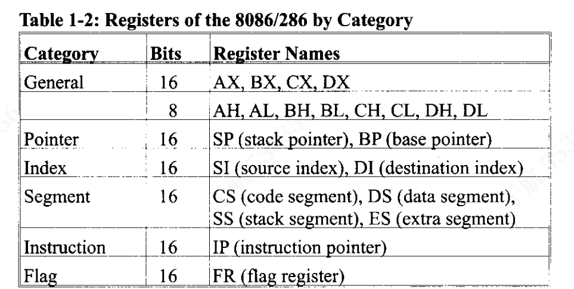

# 8086微处理器及8086汇编语言
本部编码 2026-9-B
___
## 目录<a id = "目录"></a>
- [第一章：8086微处理器](#第一章)
- [第二章：8088微处理器](#第二章)
- [第三章：汇编语言编程](#第三章)
- [第四章：算术与逻辑指令及程序](#第四章)
- [第五章：存储器与存储器接口](#第五章)
- [第六章：输入输出与 8255 芯片；ISA 总线接口](#第六章)
- [第七章：8253/54 定时器](#第七章)
- [第八章：中断与8259芯片](#第八章)
- [第九章：用汇编语言和 C 语言进行 BIOS 与 DOS 编程](#第九章)
- [第十章：串行数据通信与 8251 芯片](#第十章)
___
## 第一章：8086微处理器<a id = "第一章"></a>
### 1. 8086/8088内部结构
#### 1. 流水线
提高 CPU 处理信息速度有两种方法：提高工作频率或改变 CPU 的内部架构。
- 第一种方案依赖于技术，意味着设计者必须根据成本考量，使用当时可用的技术。如果技术和成本允许，设计者可以通过提高 CPU 的运行频率来使其工作得更快。
- 第二种提高 CPU 处理能力的方案与 CPU 的内部工作方式有关。

流水线的最基本思想是让 CPU 能够同时进行取指和执行操作
英特尔在 8088/86 微处理器中通过将其内部结构划分为两个部分实现了流水线技术：
- 执行单元（EU）：执行此前已取出的指令。
- 总线接口单元（BIU）：负责访问内存和外设

这一机制得以实现的前提是总线接口单元的处理进度始终领先于执行单元，因此 8088/86 的 BIU 中配备了一个缓冲器（也称队列）——8088 型号的缓冲器为 4 字节，8086 型号则为 6 字节。<br>
倘若某条指令的执行耗时过长，队列会被填满至最大容量，此时总线便会处于空闲状态。当 6 字节的 8086 队列中剩余 2 字节空间、或 4 字节的 8088 队列中剩余 1 字节空间时，BIU 就会取出新的指令。<br>
在某些特定情况下，微处理器必须清空队列。这种情况下，执行单元必须等待总线接口单元取出新指令，这一现象被称为分支损失。在采用流水线架构的 CPU 中，这意味着频繁的跳转会降低程序的运行效率。<br>
8088/86 的流水线仅包含取指和执行两个阶段，而性能更强的计算机中，流水线可拥有更多阶段。<br>
#### 2. 寄存器
在 CPU 中，寄存器用于临时存储信息。这些信息可以是 1 字节或 2 字节的数据，也可以是数据的地址。8088/86 微处理器的寄存器分为表中概述的六类。

8088/86 中的通用寄存器可按 16 位或 8 位寄存器进行访问。其余寄存器则只能以完整的 16 位形式访问。<br>
在 8088/86 架构中，数据类型要么是 8 位，要么是 16 位。例如，若要访问 12 位数据，需使用 16 位寄存器并将其高 4 位置为 0。<br>
寄存器的位编号遵循降序规则<br>
8088/86 中不同的寄存器承担着不同的功能。由于部分指令仅能通过特定寄存器来执行，因此寄存器的用法需结合指令及其在程序中的应用场景来阐述。<br>
通用寄存器的首字母代表其用途：
- AX 用作累加器
- BX 用作基址寻址寄存器
- CX 在循环操作中用作计数器
- DX 则在输入 / 输出操作中指向数据
### 2. 汇编程序设计简介
#### 1. 汇编语言程序设计
汇编语言程序由一系列汇编指令（以及其他元素）构成。一条汇编指令包含一个助记符，其后可跟一个或两个操作数。其中，操作数是被处理的数据，助记符则是发给 CPU 的命令，告诉它该如何处理这些数据。
#### 2. MOV指令
简单来说，MOV指令的作用是将数据从一个位置复制到另一个位置。其格式如下：
```asm
MOV  目标操作数, 源操作数   ;将源操作数的值复制到目标操作数
```
该指令会让 CPU 将源操作数的值移动（实际为复制）到目标操作数中。<br>
在 8086 CPU 中，只要源寄存器和目标寄存器的位宽（大小）匹配，数据就可以在表中列出的所有寄存器（除标志寄存器外）之间传送。<br>
代码 MOV AL, DX 会引发错误，因为不能将 16 位寄存器的内容直接送入 8 位寄存器。标志寄存器是个例外：不存在 MOV FR, AX 这类指令，标志寄存器的加载需要通过其他方式完成<br>
MOV 指令的三条重要规则：
1. 不能直接向段寄存器（CS、DS、ES、SS）加载立即数：若要给段寄存器赋值，必须先将数据加载到非段寄存器中，再通过该寄存器传送到段寄存器
2. 向 16 位寄存器加载小于 FFH 的值时，高位会自动补 0
3. 向寄存器加载超出其位宽范围的值会报错
#### 3. ADD指令
ADD 指令的格式如下：
```asm
ADD  目标操作数, 源操作数   ; 功能：将源操作数与目标操作数相加，结果存入目标操作数
```
在相加之前，不需要把两个数据都先送入寄存器<br>
一个寄存器存放了第一个值，而第二个值直接作为操作数跟在指令后面。这种直接写在指令中的操作数，被称为立即数<br>
到目前为止，ADD 和 MOV 指令的例子都说明：源操作数既可以是寄存器，也可以是立即数；而目标操作数始终是寄存器。<br>
8 位寄存器所能存储的最大值为 FFH（十进制 255）。若要使用大于 FFH 的数，必须使用 AX、BX、CX、DX 等 16 位寄存器。<br>
### 3. 程序段简介
一个典型的汇编语言程序至少包含三个段：
- 代码段：包含实现程序功能的汇编指令。
- 数据段：用于存储代码段中的指令需要处理的信息（数据）。
- 栈段：用于临时存储信息。
#### 1. 段的起源与间接
段是内存中一块最大容量为 64KB 的区域，其起始地址必须能被 16 整除（这类地址以0H结尾）。段的 64KB 容量限制源于 8085 微处理器：它的地址线仅有 16 根，因此最多只能寻址
$2^{16}=64KB$的物理内存。为了保证兼容性，这一限制被沿用到了 8088/86 的设计中。
在 8085 中，所有代码、数据和栈信息共享这 64KB 内存；而在 8088/86 中，代码、数据和栈各可以分配最多 64KB 的内存，分别称为代码段、数据段和栈段。因此，尽管 8088/86 拥有 20 根地址线，可寻址$2^{20}=1MB$的内存空间，但在任意时刻，它最多只能处理 64KB 的代码、64KB 的数据和 64KB 的栈。
#### 2. 逻辑地址与物理地址
在英特尔（Intel）关于 8086 处理器的技术资料中，有三类地址被频繁提及
- 物理地址：是实际输出到 8086 微处理器地址引脚、并由内存接口电路解码的 20 位地址。对于 8086 以及实模式下的 286、386、486 CPU，该地址的取值范围为00000H到FFFFFH，对应 1MB 的内存空间，是 RAM 或 ROM 中真实的物理存储位置。
- 偏移地址：是 64KB 段范围内的相对位置，因此取值范围为0000H到FFFFH。
- 逻辑地址：由段基址和偏移地址两部分组成。
#### 3. 代码段
为了执行程序，8086 会从代码段中读取指令（操作码和操作数）。指令的逻辑地址始终以CS:IP的格式表示，其中CS是代码段寄存器，IP是指令指针寄存器。<br>
指令存储位置的物理地址生成规则为：将 CS 寄存器的值左移 1 位十六进制（等价于乘以 16 / 左移 4 位二进制），再与 IP 寄存器的值相加。IP 中存储的就是偏移地址，最终得到的 20 位地址会被输出到外部地址总线，由内存解码电路处理，因此被称为物理地址。
#### 4. 数据段
数据和代码混合在指令里。这种写法的问题在于：如果数据发生变化，就必须在代码中逐一找到所有包含该数据的位置，重新修改数据。<br>
专门开辟一块内存区域仅用于存储数据。在 80x86 微处理器中，这块专门用于存储数据的内存区域就叫做数据段。就像代码段使用CS（代码段寄存器）和IP（指令指针，段内偏移）来寻址一样，数据段使用DS（数据段寄存器）和一个偏移值来完成寻址。
```asm
MOV  AL,0        ; 清空AL寄存器
ADD  AL,[0200]   ; 将DS:0200地址的内容加到AL中
ADD  AL,[0201]   ; 将DS:0201地址的内容加到AL中
ADD  AL,[0202]   ; 将DS:0202地址的内容加到AL中
ADD  AL,[0203]   ; 将DS:0203地址的内容加到AL中
ADD  AL,[0204]   ; 将DS:0204地址的内容加到AL中
```
偏移地址被方括号 [] 包裹。方括号的含义是：该操作数代表数据的内存地址，而非数据本身。如果省略方括号，CPU 会尝试将立即数 200H 送入 AL 寄存器，而不是读取偏移地址 200H 处的内存内容。<br>
另外需要注意 MASM（宏汇编器）和 DEBUG 工具的代码格式差异：
- DEBUG 默认所有数字为十六进制，无需加 H 后缀；
- MASM 默认所有数字为十进制，十六进制数据必须加 H 后缀。

如果数据需要存储在其他偏移地址，程序就必须重写。解决这个问题的方法是：用寄存器存储偏移地址，在每次加法操作前递增寄存器，使其指向下一个字节。<br>
8086/88 仅允许 BX、SI、DI 作为数据段的偏移寄存器。
```asm
MOV  AL,0        ; 初始化AL寄存器
MOV  BX,0200H    ; BX指向第一个字节的偏移地址
ADD  AL,[BX]     ; 将BX指向的第一个字节加到AL
INC  BX          ; BX自增1，指向下一个字节
ADD  AL,[BX]     ; 将下一个字节加到AL
INC  BX          ; 指针自增
ADD  AL,[BX]     ; 加下一个字节
INC  BX          ; 指针自增
ADD  AL,[BX]     ; 加最后一个字节
```
INC 指令的作用是将操作数加 1（自增），INC BX 的效果和 ADD BX,1 完全等价。<br>
数据的物理地址计算规则，与代码段完全相同。
#### 5. 小端序约定
之前的示例均使用 8 位（1 字节）数据，这种情况下字节会在内存中依次存储。那16 位数据该如何存储呢？例如：
```asm
MOV AX,35F3H   ; 将35F3H载入AX寄存器
MOV [1500],AX  ; 将AX寄存器中的内容复制到偏移地址1500H处
```
在这种情况下，低字节存储到低内存地址，高字节存储到高内存地址。在上述示例中，内存位置 DS:1500 存储 F3H，DS:1501 存储 35H。
- 大端序：高字节存放在低地址，低字节存放在高地址。
- 小端序：高字节存放在高地址，低字节存放在低地址

所有英特尔微处理器，以及许多小型计算机（典型代表是 Digital VAX）均采用小端序约定。而摩托罗拉微处理器（曾用于苹果 Macintosh 电脑）则采用大端序。
#### 6. 附加段
附加段是另一个数据段，常作为额外的数据存储区域。虽然在许多常规程序中不会直接使用它，但在字符串操作等特定场景中，它的作用至关重要
### 4. 深入了解8086的段
#### 1. 什么是堆栈？为什么需要它？
堆栈是 CPU 用于临时存储信息的一段读写内存（RAM）区域。CPU 之所以需要这个存储区域，是因为寄存器的数量非常有限。CPU 必须有一个地方来安全、临时地存放信息。<br>
堆栈的主要缺点在于其访问速度。由于堆栈存储在 RAM 中，它的访问速度远慢于寄存器的访问速度。
#### 2. 堆栈的访问方式
如果堆栈是 RAM 的一段区域，那么 CPU 内部就必须有寄存器来指向它。用于访问堆栈的两个核心寄存器是SS和SP。在执行任何访问堆栈的指令之前，必须先为这两个寄存器赋值。<br>
80x86 的所有 CPU 寄存器（段寄存器和 SP 除外）都可以被存入堆栈，也可以从堆栈中恢复到 CPU 寄存器中：
- 入栈（push）：将 CPU 寄存器的内容存储到堆栈中
- 出栈（pop）：将堆栈中的内容加载回 CPU 寄存器

在 80x86 架构中，堆栈指针寄存器（SP）始终指向堆栈当前的栈顶内存位置。当数据被压入堆栈时，SP 的值递减；当数据从堆栈弹出到 CPU 时，SP 的值递增。<br>
当指令对通用寄存器执行入栈 / 出栈操作时，必须操作完整的 16 位寄存器。也就是说，只能编写PUSH AX这类指令，不存在PUSH AL或PUSH AH这类 8 位操作的指令。<br>
入栈后 SP 递减的设计，是为了确保堆栈从高地址向低地址 “向下生长”，这与 IP（指令指针）的行为完全相反：IP 始终指向即将执行的下一条指令，每执行一条指令，IP 的值就会递增。<br>
为了确保程序的代码段和堆栈段不会互相覆盖，它们被分配在程序可用 RAM 内存的两端：两者会向中间方向生长，但绝对不能相遇；一旦相遇，程序就会崩溃。
#### 3. 堆栈入栈
每执行一次PUSH操作，寄存器的内容就会被保存到堆栈中，同时 SP 的值递减 2。堆栈中每存储 1 字节数据，SP 就会递减 1；而PUSH操作保存的是 16 位寄存器的内容（2 字节），因此 SP 会递减 2。<br>
同时需要注意堆栈中的数据存储规则：在 80x86 架构中，低字节始终存储在低内存地址，高字节存储在高内存地址（小端序）。
#### 4. 堆栈出栈
将堆栈中的内容弹出并恢复到 80x86 CPU，是入栈操作的逆过程。每执行一次出栈（POP）操作，堆栈顶部的 2 个字节会被复制到指令指定的寄存器中，同时堆栈指针（SP）的值递增 2。<br>
需要注意：尽管出栈后数据实际上仍留在内存中，但它已经无法被访问了 —— 因为堆栈指针已经指向了该位置之外的区域。
#### 5. 堆栈的逻辑地址与物理地址
计算堆栈物理地址的原则与代码段、数据段完全相同<br>
内存管理是操作系统的职责，因此给 SP 和 SS 赋值是 DOS 操作系统的工作。
必须明确两点：
- 在 80x86 架构的技术资料中，栈顶指的是堆栈中最后被占用的内存位置。这与其他 CPU 的定义不同。
- BP也可作为访问堆栈的偏移寄存器。它有着非常特殊的应用场景，被广泛用于传递汇编语言程序与高级语言程序（如 C 语言）之间的参数。
#### 6. 关于8086段的补充说明
同一个物理地址，对应多个不同的逻辑地址<br>
当「左移后的段寄存器值 + 偏移值」的结果，超出了最大允许地址范围FFFFFH时，地址会发生回绕
#### 7. 段重叠
在计算物理地址时，两个段完全可以发生重叠，并且在某些场景下，这种重叠是非常实用的设计。
#### 8. 标志寄存器
标志寄存器是一个 16 位寄存器，有时也被称为状态寄存器（status register）。尽管该寄存器总共有 16 位，但仅其中部分位被实际使用，其余位要么未定义，要么由 Intel 保留。<br>
其中 6 个标志被称为条件标志（conditional flags），用于指示指令执行后产生的状态结果，分别是：
- CF（Carry Flag，进位标志）：当运算产生进位输出时，该标志置 1
    - 8 位运算：结果从最高位d7产生进位 / 借位时置 1
    - 16 位运算：结果从最高位d15产生进位 / 借位时置 1
    - 用于无符号数运算的溢出 / 借位判断。
- PF（Parity Flag，奇偶标志）：在特定运算后，会检查结果低字节的奇偶性
    - 若该字节中1的个数为偶数，PF 置 1
    - 若为奇数，PF 清零
    - 常用于数据传输的奇偶校验。
- AF（Auxiliary Carry Flag，辅助进位标志）
    - 若运算中从d3（低 4 位）向d4（高 4 位）产生进位 / 借位，该位置 1，否则清零。
    - 该标志专门用于BCD（二进制编码的十进制）算术运算的调整指令。
- ZF（Zero Flag，零标志）
    - 若算术 / 逻辑运算的结果为0，ZF 置 1；否则清零。
    - 是条件跳转指令（如JZ/JNZ）最核心的判断依据之一。
- SF（Sign Flag，符号标志）
    - 有符号数用最高位作为符号位：0代表正数，1代表负数。
    - 算术 / 逻辑运算后，结果的符号位会被复制到 SF 中，用于标识运算结果的正负。
- OF（Overflow Flag，溢出标志）
    - 当有符号数运算的结果过大，导致最高位（符号位）被溢出位覆盖时，该位置 1。
    - CF 用于检测无符号数算术运算的错误
    - OF 仅用于检测有符号数算术运算的错误
剩余的 3 个标志被称为控制标志（control flags），用于在指令执行前控制指令的运行行为。
- TF（Trap Flag，陷阱标志）
    - 当该位置 1 时，程序进入单步执行模式，即每次仅执行一条指令。
    - 单步执行是调试程序的核心功能。
- IF（Interrupt Enable Flag，中断允许标志）：该位可置 1 或清零，用于仅控制外部可屏蔽中断请求的响应
    - IF=1：CPU 响应可屏蔽中断
    - IF=0：CPU 屏蔽可屏蔽中断
    - 不影响不可屏蔽中断（NMI）。
- DF（Direction Flag，方向标志）：该位用于控制串操作指令的地址方向
    - DF=0：串操作地址递增（正向）
    - DF=1：串操作地址递减（反向）


#### 9. 利用零标志实现循环
标志寄存器最常用的功能之一，就是通过零标志（ZF）实现程序循环。<br>
我们可以用一个计数器来记录循环需要重复的次数：每执行一次加法，计数器就减 1，同时检查零标志。当计数器变为 0 时，零标志被置 1（ZF=1），循环终止。
下面的程序实现了这一循环逻辑，用于对 5 个字节的数据求和：
- CX 寄存器：存储循环计数器（也可使用 SI/DI 替代）
- BX 寄存器：存储数据的偏移地址
- AL 寄存器：在循环开始前初始化为 0，用于累加求和

在每一轮迭代中，JNZ指令会检查零标志 ZF：
JNZ是Jump Not Zero的缩写，含义是：如果ZF=0（计数器非 0），则跳转到指定地址继续循环<br>
如果ZF=1（计数器为 0），则不执行跳转，循环结束，继续执行后续指令。<br>
注意：JNZ指令必须紧跟在DEC CX指令之后。因为JNZ需要检查DEC CX对零标志的影响；如果在两条指令之间插入其他指令，该指令可能会修改零标志，导致循环逻辑出错。
```asm
MOV  CX,05        ; CX = 5，设置循环次数（共5次迭代）
MOV  BX,0200H     ; BX = 0200H，BX作为数据指针，指向第一个待加字节的偏移地址
MOV  AL,00        ; AL = 0，初始化累加器AL，用于存储求和结果

ADD_LP:           ; 循环标签，作为跳转目标
ADD  AL,[BX]      ; 将BX指向的内存字节（DS:BX）加到AL中
INC  BX           ; BX自增1，指向下一个待加字节
DEC  CX           ; CX自减1，循环计数器减1
JNZ  ADD_LP       ; 若ZF=0（CX≠0），则跳回ADD_LP，继续下一轮循环
                  ; 若ZF=1（CX=0），则退出循环
```
### 5. 8086的寻址模式
CPU 可以通过多种方式访问操作数（数据），这些方式统称为寻址方式。寻址方式的数量在微处理器设计时就已确定，无法修改。
#### 1. 寄存器寻址方式
寄存器寻址方式是指使用寄存器来存储待操作的数据。执行该寻址方式时，CPU 不会访问内存，因此执行速度相对较快。<br>
需要注意：源操作数和目的操作数的寄存器大小必须匹配。
```asm
MOV  BX,DX      ; 将DX的内容复制到BX
MOV  ES,AX      ; 将AX的内容复制到ES
ADD  AL,BH      ; 将BH的内容加到AL中
```
#### 2. 立即寻址方式
在立即寻址方式中，源操作数是一个常量。顾名思义，在汇编指令时，该操作数会被直接编码在操作码之后。因此，这种寻址方式的执行速度很快，但在编程中的使用场景有限。
立即寻址可用于向除段寄存器和标志寄存器外的任意寄存器加载数据<br>
若要向段寄存器传送数据，必须先将数据送入通用寄存器，再从通用寄存器传送到段寄存器<br>
在前两种寻址方式（寄存器寻址、立即寻址）中，操作数要么位于微处理器内部（寄存器），要么直接跟随在指令中。而在大多数程序中，待处理的数据通常存储在 CPU 外部的内存中。
```asm
MOV  AX,2550H   ; 将2550H送入AX寄存器
MOV  CX,625     ; 将十进制数值625加载到CX寄存器
MOV  BL,40H     ; 将40H加载到BL寄存器
```
#### 3. 直接寻址方式
在直接寻址方式中，数据存储在内存的某个位置，而数据的内存地址会直接跟在指令之后。
注意区分：
- 立即寻址：指令中直接携带操作数本身
- 直接寻址：指令中携带的是操作数的内存地址（偏移地址）

物理地址的计算方式与数据段一致：将 DS 寄存器左移 1 位十六进制（×16），再加上偏移地址
```
MOV  DL,[2400H]   ; 将DS:2400H地址的内容送入DL寄存器
```
#### 4. 寄存器间接寻址方式
在寄存器间接寻址方式中，操作数所在内存位置的地址，由寄存器来存储。可用于该寻址方式的寄存器为 SI、DI 和 BX。这三个寄存器可作为「指针」使用：当它们存储内存的偏移地址时，必须与 DS（数据段寄存器） 结合，才能生成 20 位的物理地址。<br>
注意 BX 被方括号 [] 包裹<br>
物理地址的计算规则为：将 DS 左移 1 位十六进制（×16），再加上 BX 的值。使用 SI 或 DI 作为指针时，计算规则完全相同。
```asm
MOV  CL,[SI]   ; 将DS:SI指向的内存内容，送入CL
MOV  [DI],AH   ; 将AH的内容，写入DS:DI指向的内存位置
```
#### 5. 基址相对寻址方式
在基址相对寻址方式中，使用基址寄存器 BX、BP，加上一个偏移量，来计算所谓的有效地址。计算物理地址（PA）时，默认段寄存器的规则为：
- 使用 BX 时，默认段为DS（数据段）
- 使用 BP 时，默认段为SS（堆栈段）

```asm
MOV  CX,[BX]+10   ; 将DS:BX+10和DS:BX+10+1地址的内容送入CX
                  ; 物理地址PA = (DS左移1位十六进制) + BX + 10
MOV  AL,[BP]+5    ; 物理地址PA = (SS左移1位十六进制) + BP + 5
```
在 Intel 技术文档中，[BP]+5 里的 BP+5 被称为有效地址，表示从 BP 指向的偏移位置起，第 5 个字节的内容被送入 AL 寄存器；同理，[BX]+10 中的 BX+10 也为有效地址。
#### 6. 变址相对寻址方式
变址相对寻址方式的工作原理与基址相对寻址完全相同，区别仅在于：使用 DI、SI 寄存器存储偏移地址，而非 BX、BP。<br>
默认段寄存器为DS（数据段）。
```asm
MOV  DX,[SI]+5    ; 物理地址PA = (DS左移1位十六进制) + SI + 5
MOV  CL,[DI]+20   ; 物理地址PA = (DS左移1位十六进制) + DI + 20
```
#### 7. 基址变址寻址方式
将基址寻址与变址寻址结合，就衍生出了基址变址寻址方式。在该模式下，需要同时使用一个基址寄存器和一个变址寄存器来计算地址<br>
基址变址寻址要求必须同时使用一个基址寄存器（BX/BP）和一个变址寄存器（SI/DI），不能同时使用两个变址寄存器（SI+DI）。
```asm
MOV  CL,[BX][DI]+8      ; 物理地址PA = (DS左移1位十六进制) + BX + DI + 8
MOV  CH,[BX][SI]+20     ; 物理地址PA = (DS左移1位十六进制) + BX + SI + 20
MOV  AH,[BP][DI]+12     ; 物理地址PA = (SS左移1位十六进制) + BP + DI + 12
MOV  AH,[BP][SI]+29     ; 物理地址PA = (SS左移1位十六进制) + BP + SI + 29

MOV  AH,[BP+SI+29]
; 或
MOV  AH,[SI+BP+29]   ; 寄存器的顺序不影响结果
```

#### 8. 段超越前缀
80x86 CPU 允许程序覆盖默认段，使用任意段寄存器。要实现这一点，只需在代码中显式指定段寄存器即可。
例如，在指令 MOV AL,[BX] 中，待载入 AL 的操作数的物理地址为 DS:BX—— 这是因为 DS 是指针 BX 的默认段。若要覆盖该默认设置，可在指令中显式指定目标段，写作：
```asm
MOV AL,ES:[BX]
```
___
- [返回目录](#目录)
___
## 第二章：8088微处理器<a id = "第二章"></a>
8088 是一款 40 引脚 的微处理器芯片，它支持两种工作模式：最小模式和最大模式，最大模式用于当我们需要将 8088 与 8087 数学协处理器连接的场景；如果不需要协处理器，则使用最小模式。<br>
### 1. 微处理器总线
每一个基于微处理器的系统都必须有三组独立的总线：地址总线、数据总线和控制总线。
- 地址总线：提供传输地址的路径，用于定位目标设备；
- 数据总线：用于在 CPU 和目标设备之间传输数据；
- 控制总线：提供信号以指示正在执行的操作类型（如读操作或写操作）。
### 2. 8088的数据总线

图中展示了最小模式下的 8088/86。在 8088 中，9 至 16 号引脚（AD0 - AD7） 同时用于数据和地址传输。设计者使用了同一组引脚来传输两组不同的信息：地址和数据。注意：这个引脚的名称也反映了其双重功能。<br>
在 8088 中，地址 / 数据总线引脚被命名为 AD0 - AD7。
- ALE（地址锁存允许） 引脚信号：指示引脚 AD0 - AD7 上的信息是地址还是数据。
    - 每当微处理器发送地址时，它会激活 ALE 引脚（将其置为高电平），以指示引脚 AD0-AD7 上的信息是地址（A0 - A7）。
    - 此信息必须被锁存（latch），因为引脚 AD0 - AD7 随后会用于数据传输。
    - 当数据即将发送或接收时，ALE 变为低电平，这表示引脚 AD0 - AD7 将用作数据总线（D0 - D7）。

这种将地址和数据分离的过程，被称为多路复用。
### 3. 8088的地址总线
8088 拥有 20 根地址引脚（A0 ~ A19），因此最大可寻址 1MB 内存空间（$2^{20}=1M$）。引脚 AD0 ~ AD7 会在锁存器的辅助下，提供 A0 ~ A7 地址信号。为了从地址 / 数据复用引脚中分离出地址信号，必须使用锁存器来锁存地址。<br>
8088 的 AD0 ~ AD7 会接入 74LS373 锁存器，ALE（地址锁存允许）信号 会触发锁存动作。<br>在 8088 系统中：
- 74LS373 的输出提供 8 位地址 A0 ~ A7；
- A8 ~ A15 直接由微处理器引出（引脚 2~8、引脚 39）；
- 最后 4 位地址由 A16 ~ A19 提供（引脚 35~38）。

在任何系统中，所有地址信号都必须经过锁存，才能为系统提供稳定、高驱动能力的地址总线
### 4. 8088的控制总线
与 8088 CPU 相关的控制信号有很多，不过本节我们仅讨论读写操作相关的信号。8088 可以对存储器和I/O 设备执行读写操作，因此对应 4 种操作，需要 4 个控制信号：
- MEMR（memory read，存储器读）
- MEMW（memory write，存储器写）
- IOR（I/O read，I/O 读）
- IOW（I/O write，I/O 写）

8088 为这些控制信号提供了 3 个引脚：RD（读）、WR（写）和IO/M（I/O/ 存储器选择）。
- RD和WR引脚均为低电平有效
- IO/M引脚的电平含义为：
    - 低电平（0）：表示 CPU 访问存储器
    - 高电平（1）：表示 CPU 访问I/O 设备

通过这 3 个引脚，我们可以生成 4 个控制信号：IOR、IOW、MEMR、MEMW，注意：所有这些控制信号都必须是低电平有效，因为它们会接入存储器和外设芯片的RD/WR输入引脚（这类引脚默认低电平有效）。
### 5. 8088的总线时序

8088 执行存储器和 I/O 总线操作时，一个总线周期固定为 4 个时钟周期。以读操作时序为例：
- 第 1 个时钟周期：ALE 信号锁存地址，完成地址信号的分离与稳定；
- 第 2、3 个时钟周期：CPU 输出读控制信号，发起读操作；
- 第 4 个时钟周期结束前：外部设备（存储器 / I/O）必须将数据送到 CPU 的引脚上，由 CPU 完成数据读取。

需要注意：完整的读 / 写总线周期仅为 4 个时钟周期。如果存储器或 I/O 设备速度较慢，无法在 4 个时钟内完成读写，就可以向 CPU 申请等待状态，让 CPU 插入额外的时钟周期来等待设备就绪
### 6. 8088的其他引脚
8088 的24~32 号引脚的功能，会根据 CPU 工作在最小模式还是最大模式而变化。
下表为 8088 微处理器在最小模式下，24~32 号引脚的名称与功能说明：
|引脚号	|名称与功能	|详细翻译与解释|
| :---: | :---: | :---: |
|24|	INTA <br>低电平有效输出信号。|	中断响应低电平有效输出信号。通知中断控制器：外部中断（INTR）已发生，且中断向量号已在数据总线的低 8 位线上准备就绪，可供 CPU 读取。|
|25	|ALE <br>高电平有效输出信号。	|地址锁存允许高电平有效输出信号。表示当前地址 / 数据复用总线上传输的是有效地址信号，可用于锁存地址（如驱动 74LS373 锁存器）。|
|26|	DEN <br>低电平有效输出信号。|	数据允许低电平有效输出信号。用于使能 74LS245 数据总线收发器。在数据传输期间打开收发器，非传输期间关闭，实现 CPU 与系统总线的隔离。|
|27	|DT/R <br>低电平有效输出信号。|	数据发送 / 接收低电平有效输出信号。用于控制 74LS245 收发器的数据传输方向。高电平时表示 CPU 发送数据（写操作），低电平时表示 CPU 接收数据（读操作）。|
|28	|IO/M 	|I/O/ 存储器选择该信号用于指示地址总线当前访问的是存储器还是I/O 设备。<br> - 低电平（0）：表示访问存储器；<br> - 高电平（1）：表示访问I/O 设备。<br>该引脚需与 RD、WR 引脚配合，生成 MEMR、MEMW、IOR、IOW 四个控制信号。|
|29	|WR <br>低电平有效输出信号。	|写控制低电平有效输出信号。表示数据总线上的数据正被写入存储器或I/O 设备。与 IO/M（引脚 28）配合，生成 MEMW（存储器写）和 IOW（I/O 写）控制信号。|
|30|	HLDA <br>高电平有效输出信号。	|总线保持响应高电平有效输出信号。当 CPU 收到 DMA 控制器的 HOLD 请求后，会在当前总线周期结束后输出 HLDA，以通知 DMA 控制器：已释放总线控制权，可接管系统总线。|
|31|	HOLD <br>高电平有效输入信号。	|总线保持请求高电平有效输入信号。由 DMA 控制器发出，请求占用系统的存储器和I/O 地址空间。收到该信号后，CPU 应在合适时机释放对局部总线的控制权。|
|32	|RD <br>低电平有效输出信号。|	读控制低电平有效输出信号。表示正从存储器或I/O 设备向 CPU 读取数据。与 IO/M（引脚 28）配合，生成 MEMR（存储器读）和 IOR（I/O 读）控制信号。|

8088 的其余引脚功能说明如下：
- MN/MX (minimum/maximum) 最小 / 最大模式选择：将 MN/MX 引脚（33 号引脚） 直接接 + 5V，CPU 工作在最小模式；将该引脚接地，CPU 工作在最大模式。
- NMI (nonmaskable interrupt) 不可屏蔽中断：这是一个上升沿触发（从低到高跳变）的输入信号。当该信号有效时，微处理器会在执行完当前指令后，跳转到中断向量表执行对应中断服务程序。这类中断无法通过软件屏蔽
- INTR (interrupt request) 可屏蔽中断请求：INTR 是高电平有效、电平触发的输入信号，微处理器会持续监测该引脚，以响应外部中断请求。该引脚与 INTA（中断响应）引脚共同连接到 8259 中断控制器芯片
- CLOCK 时钟信号：微处理器需要一个高精度的时钟信号，用于同步内部事件、驱动 CPU 工作。为此，英特尔为 8088 处理器设计了配套的8284 时钟发生器。CLOCK 是输入信号，直接连接到 8284 时钟发生器，是 CPU 的 “心跳”。任何时钟异常都会导致 CPU 故障。无论 8088 工作在最小模式还是最大模式，都需要使用 8284 芯片。
- READY 就绪信号：READY 是输入信号，用于为速度较慢的存储器和 I/O 设备插入等待状态：
    - 当 READY 为低电平时，CPU 会插入等待周期，直到 READY 变为高电平；
    - 该信号是 CPU 与低速存储器、I/O 设备接口的关键信号。
- TEST 测试信号
    - 在最小模式下，该引脚未使用；
    - 在最大模式下，该引脚是来自8087 数学协处理器的输入信号，用于协调 CPU 与协处理器之间的通信。
- RESET（复位）：要终止微处理器当前的所有运行活动，只需向 RESET（复位）输入引脚 施加高电平。高电平会强制微处理器停止所有操作，并将主要寄存器设置为下图所示的值。图中的数据对 RAM 和 ROM 的内存空间分配有特定含义

___
- [返回目录](#目录)
___
## 第三章：汇编语言编程<a id = "第三章"></a>
### 1. 伪指令与示例程序
示例程序
```asm
;THE FORM OF AN ASSEMBLY LANGUAGE PROGRAM
;NOTE: USING SIMPLIFIED SEGMENT DEFINITION

.MODEL SMALL
.STACK 64
.DATA

DATA1   DB  52H
DATA2   DB  29H
SUM     DB  ?

.CODE
MAIN    PROC FAR           ;this is the program entry point
        MOV AX,@DATA       ;load the data segment address
        MOV DS,AX          ;assign value to DS
        MOV AL,DATA1       ;get the first operand
        MOV BL,DATA2       ;get the second operand
        ADD AL,BL          ;add the operands
        MOV SUM,AL         ;store the result in location SUM
        MOV AH,4CH         ;set up to return to DOS
        INT 21H            ;
MAIN    ENDP
        END MAIN           ;this is the program exit point
```
一个汇编语言程序由一系列语句（行）组成，这些语句分为两类：
- 汇编指令：如ADD、MOV等机器指令；
- 伪指令：用于向汇编器发出指令，告知汇编器如何将汇编语言指令翻译成机器码。

汇编语言指令语句由 4 个字段组成，格式如下：
```asm
[label:]  mnemonic  [operands]  [;comment]
```
方括号[]表示该字段为可选项，实际编写代码时无需输入方括号。<br>
1. 标号字段：
    - 标号用于给代码行命名，方便程序中引用。
    - 标号长度不能超过 31 个字符；
    - 伪指令的标号不需要以冒号:结尾；
    - 生成机器码的指令（即机器指令）的标号必须以冒号:结尾，冒号用于告知汇编器：该标号指向代码段内的代码；
2. 助记符与操作数字段
    - 汇编语言助记符（指令）和操作数共同完成程序的实际功能，实现程序编写的目标任务。
    - 除了助记符和操作数，这两个字段也可以包含汇编器伪指令（directives）：
        - 伪指令仅由汇编器使用，用于组织程序、控制输出文件，不会生成任何机器码；
        - 与之相对，指令会被翻译成机器码，供 CPU 执行；
3. 注释字段
    - 以分号 ; 开头。注释可以写在一行代码的末尾，也可以单独占一行。汇编器会忽略注释内容，但它们对程序员来说是必不可少的。注释是可选的，但强烈建议添加，以便他人更轻松地阅读和理解程序。
#### 1. 模型定义
示例程序中，注释之后的第一条语句是 MODEL 伪指令。该伪指令用于选择内存模型的大小，可选的内存模型包括 SMALL（小模型）、MEDIUM（中模型）、COMPACT（紧凑模型） 和 LARGE（大模型）。
SMALL（小模型） 是汇编语言程序中最常用的内存模型之一，小模型最多使用 64KB 内存用于代码，另外 64KB 内存用于数据。其他模型的定义如下：
|伪指令	|模型说明|
| :---: | :---: |
|.MODEL MEDIUM	|数据必须限制在 64KB 以内，但代码可以超过 64KB
|.MODEL COMPACT	|数据可以超过 64KB，但代码不能超过 64KB
|.MODEL LARGE	|数据和代码都可以超过 64KB，但单个数据段不能超过 64KB
|.MODEL HUGE	|数据和代码都可以超过 64KB，数据项（如数组）也可以超过 64KB
|.MODEL TINY	|用于 COM 文件，数据和代码必须共同限制在 64KB 以内

请注意，在上述列表中，中模型（MEDIUM） 与 紧凑模型（COMPACT） 是互为相反的模型。同时还需注意，微型模型（TINY） 无法与本节所描述的简化段定义搭配使用。
#### 2. 段定义
正如第 1 章中提及的，x86 中央处理器（CPU）拥有四个段寄存器：代码段寄存器（CS）、数据段寄存器（DS）、栈段寄存器（SS） 和 附加段寄存器（ES）。汇编语言程序的每一行代码都必须对应其中一个段。
简化段定义格式 仅通过三条简单伪指令即可实现对应段的管理：
- .CODE 对应代码段（CS）
- .DATA 对应数据段（DS）
- .STACK 对应栈段（SS）

除此之外，还有另一种段定义方式，被称为完整段定义
#### 3. 程序的段
虽然我们可以编写仅包含一个段的汇编语言程序，但通常情况下，一个程序至少包含三个段：栈段、数据段和代码段。
```asm
.STACK      ;标记栈段的开始
.DATA       ;标记数据段的开始
.CODE       ;标记代码段的开始
```
汇编语言语句被归类到各个段中，这样才能被汇编器识别，进而被 CPU 处理。
- 栈段用于为栈分配存储空间；
- 数据段用于定义程序所使用的数据；
- 代码段则包含了所有汇编语言指令。
#### 4. 栈段
以下这条伪指令为栈段预留了 64 字节的内存空间：
```asm
.STACK 64
```
#### 5. 数据段
示例程序中的数据段定义了三个数据项：DATA1、DATA2 和 SUM。这三个数据项均通过 DB（定义字节）伪指令定义。DB 伪指令是汇编器用于按字节（8 位）为单位分配内存的指令。<br>
内存可按不同尺寸分配，例如分配 2 字节（16 位）内存时，需使用 DW（定义字）伪指令<br>
数据段中定义的数据项，将在代码段中通过其标号（label）进行访问。其中，DATA1 和 DATA2 在数据段中被赋予了初始值；而 SUM 未赋予初始值，仅为其分配了内存空间。<br>
#### 6. 代码段定义
示例程序中的最后一个段是代码段。在 .CODE 伪指令之后，该段的第一行是 PROC 伪指令。过程是一组用于完成特定功能的指令集合。一个代码段可以只包含一个过程，但通常会拆分为多个小型过程，让程序结构更清晰。<br>
每个过程都必须通过 PROC 伪指令定义名称，后续编写汇编语言指令，最后用 ENDP 伪指令结束。PROC 和 ENDP 语句必须使用相同的标号（过程名）。PROC 伪指令可以附加 FAR 或 NEAR 选项。<br>
要执行程序，控制计算机的操作系统必须跳转到程序的起始位置。DOS 要求用户程序的入口点必须是 FAR 过程；从入口点之后，FAR 或 NEAR 均可使用。<br>
这里有一个很关键的问题：程序执行时，CS、DS、SS 寄存器实际被赋予了什么值？DOS 操作系统会先将控制权交给程序，再为段寄存器赋值。操作系统必须完成这个操作，因为它掌握着计算机的总内存容量、系统占用内存、可用内存空间等信息。<br>
在 IBM PC 中，操作系统会先检测已安装的 RAM 容量，为自身分配部分内存，再将剩余空间分配给用户程序使用。不同版本的 DOS 对内存的需求不同，而用户程序需要兼容所有版本，因此无法指定 DOS 为程序分配固定的内存区域（例如 25FFH 到 289E2H）。因此，为段寄存器分配具体数值是 DOS 的职责。<br>
当程序开始执行时，三个段寄存器中，只有 CS（代码段寄存器）和 SS（栈段寄存器）已经被赋予了正确的值；DS（数据段寄存器，以及如果使用的 ES 附加段寄存器）必须由程序自行初始化，初始化方式如下：
```asm
MOV AX,@DATA   ;@DATA 指代数据段的起始地址
MOV DS,AX
```
完成这些初始化工作后，就可以编写汇编语言指令来执行所需的任务了。在示例程序中：
- 程序将 DATA1 和 DATA2 的值分别加载到 AL 和 BL 寄存器
- 执行加法运算
- 将结果存储到 SUM 变量中
```asm
MOV AL,DATA1
MOV BL,DATA2
ADD AL,BL
MOV SUM,AL
```
程序框架中的最后两条指令是：
```asm
MOV AH,4CH
INT 21H
```
它们的作用是将程序控制权交还给操作系统。
- ENDP (MAIN) 标记过程的结束
- END 标记整个程序的结束

注意：ENDP 的标号必须与 PROC 的标号一致。END 伪指令通过向 DOS 指明入口点 MAIN 已执行完毕，来结束整个程序。因此，入口点的标号和 END 后的标号必须完全一致。<br>
下图展示了一个汇编语言程序的标准框架。在编写前几个程序时，把这个框架的副本保存在磁盘上，直接填入你自己的指令和数据，会非常方便。
```asm
;THE FORM OF AN ASSEMBLY LANGUAGE PROGRAM
;USING SIMPLIFIED SEGMENT DEFINITION
.MODEL SMALL
.STACK 64
.DATA
;
;place data definitions here  ;在此处定义数据
;
.CODE
MAIN    PROC FAR             ;this is the program entry point  这是程序入口点
        MOV AX,@DATA         ;load the data segment address   加载数据段地址
        MOV DS,AX            ;assign value to DS              为DS寄存器赋值
;
;place code here             ;在此处编写代码
;
        MOV AH,4CH           ;set up to                       准备
        INT 21H              ;return to DOS                   返回DOS
MAIN    ENDP
        END MAIN             ;this is the program exit point  这是程序退出点
```
### 2. 汇编、链接与运行程序
生成可执行汇编语言程序的三个步骤如下：
|步骤|	输入	|使用的程序|	输出|
| :---: | :---: | :---: | :---: |
|1. 编辑程序|	键盘	|编辑器|	myfile.asm|
|2. 汇编程序|	myfile.asm|	MASM 或 TASM|	myfile.obj|
|3. 链接程序|	myfile.obj|	LINK 或 TLINK|	myfile.exe|

MASM 和 LINK 是微软 MASM 汇编器对应的汇编器和链接器程序。<br>
你可以使用任意优秀的编辑器或文字处理器来创建 / 编辑程序，但编辑器必须能够生成 ASCII 文本文件。虽然文件名遵循常规的 DOS 命名规范，但本书中使用的汇编器要求源文件必须以 .asm 为后缀。这个 .asm 源文件会被汇编器（如微软 MASM 或 Borland TASM）处理，汇编器会生成目标文件、列表文件，以及其他对程序员有用的文件。<br>
目标文件的后缀必须是 .obj。这个 .obj 文件会作为 LINK 程序的输入，LINK 程序最终生成后缀为 .exe 的可执行程序，.exe 文件可以直接在微处理器上运行。<br>
在将 .obj 文件输入 LINK 之前，必须修正汇编器报出的所有语法错误。当然，修正语法错误并不能保证程序完全按预期运行，因为程序还可能存在逻辑错误。<br>

#### 1. .asm 与 .obj 文件
.asm 文件（即源文件）是通过文字处理器或行编辑器创建的文件。MASM（或其他汇编器）会将 .asm 文件中的汇编语言指令转换为机器语言，生成 .obj（目标文件）。除了生成目标程序外，MASM 还会同时创建 .lst（列表文件）。
#### 2. .lst 文件
.lst 文件是可选生成的，但对程序员非常有用：它会列出所有操作码、偏移地址，以及 MASM 检测到的全部错误。MASM 默认不生成列表文件（NUL.LST 表示不生成列表）。如果需要生成列表文件，只需在汇编时的提示符后输入文件名即可。该文件可以在显示器上查看，也可以发送到打印机输出，程序员常借助它来调试程序。只有修正了 .lst 文件中显示的所有错误后，.obj 文件才能输入到 LINK 程序中，生成可执行程序。<br>
在 DOS 环境下查看列表文件的一种方法是执行以下命令，该命令会逐屏将 myfile.lst 输出到显示器<br>
另一种查看方式是将文件导入文字处理器，之后就可以阅读或打印。有两条汇编伪指令可以让 .lst 文件更易读：PAGE 和 TITLE。<br>
#### 3. PAGE 与 TITLE 伪指令
PAGE 伪指令的格式为：
```asm
PAGE [lines],[columns]
```
它的作用是告知打印机列表文件的打印格式。
- 默认模式（即 PAGE 后不跟任何数字）：每页输出 66 行，每行最多 80 个字符。
- 本书中的程序会将默认设置修改为 60 行、132 列，写法如下：
```asm
PAGE 60,132
```
行数的取值范围是 10 到 255，列数的取值范围是 60 到 132。<br>
当列表文件超过一页时，可以通过汇编指令让程序标题打印在每一页的顶部。TITLE 伪指令后的内容由程序员自定义，但通常的做法是：在 TITLE 后紧跟磁盘上的程序文件名，再附上程序功能的简要说明。TITLE 伪指令后的文本长度不能超过 60 个 ASCII 字符。<br>
#### 4. .crf 文件（交叉引用文件）
MASM 还会生成另一个可选文件 ——交叉引用文件，后缀为 .crf。该文件按字母顺序列出了程序中使用的所有符号和标号，以及它们被引用的行号。<br>
对于包含多个数据段和代码段的大型程序而言，这个文件非常有帮助。
#### 5. 程序的链接 (LINKing the program)
汇编器（MASM）会生成 .obj 文件，其中包含操作码、操作数和偏移地址。而链接器（LINK） 的作用是生成可直接运行的程序，后缀为 .exe（可执行文件，EXEcutable）。链接器会对文件进行设置，使其能够被 DOS 加载并执行。<br>
我们使用 DEBUG 执行示例程序并分析结果。图 2-1 的程序定义了三个数据项并存放在数据段中。在运行程序前，可以通过转储 DS 的偏移内容来查看数据段中的数据。<br>
那么，DS 寄存器的值是多少？ 这个值因 PC 机型和 DOS 版本而异。因此，在执行 MOV AX,xxxx 指令时查看该值非常重要。当程序运行成功后，就可以在 DOS 命令行下运行它。要执行 myfile.exe，只需在命令行中输入：
```
C>A:myfile
```
然而，由于这个程序没有输出任何结果，因此无法直接验证运行结果。当在 DOS 命令行中输入程序名时，DOS 会将程序加载到内存中，这一过程有时被称为映射（mapping），即程序被映射到 PC 的物理内存中。
#### 6. .map 文件（映射文件）
当程序包含多个代码段或数据段时，需要查看每个段的起始位置、占用字节数等信息，这就需要用到映射文件（.map file）。<br>
该文件是可选生成的，它列出了每个段的名称、起始地址、结束地址以及以字节为单位的段大小。当我们将多个独立的子程序（模块）分别汇编后再进行链接时，map 文件的重要性将体现出来。
### 3. 控制转移指令
#### 1. FAR 与 NEAR
如果控制权被转移到当前代码段内的内存位置，这种转移就是 NEAR（近），有时也称为段内转移。如果控制权被转移到当前代码段之外，这种转移就是 FAR（远），也称为段间转移。<br>
由于 CS:IP 寄存器始终指向下一条待执行指令的地址，因此执行控制转移指令时，这两个寄存器的值必须更新：
- 在 NEAR 跳转 中，仅更新 IP（指令指针寄存器），CS 保持不变，因为控制权仍在当前代码段内。
- 在 FAR 跳转 中，由于控制权跳出了当前代码段，CS 和 IP 都必须更新为新的目标地址。

换句话说：所有控制转移指令都必须修改 IP，但只有 FAR 类型的转移会同时修改 CS。
#### 2. 条件跳转
条件跳转指令的助记符包括 JNZ（非零则跳）、JC（进位则跳）等。在条件跳转中，只有当特定条件满足时，控制权才会转移到新位置，而判断条件的依据就是标志寄存器。<br>
例如，对于指令 JNZ label：
- 处理器会检查零标志位（ZF）：如果 ZF 为 0（未置位），CPU 就会从 label 对应的地址开始取指并执行。
- 如果 ZF 为 1（置位），则不发生跳转，CPU 会执行 JNZ 指令的下一条指令。


#### 3. 短跳转
所有条件跳转指令都属于短跳转。在短跳转中，目标地址必须位于当前指令指针（IP）的 -128 到 +127 字节 范围内。换句话说，条件跳转是一条两字节指令：
- 第一个字节是条件跳转指令（J 开头的指令）的操作码
- 第二个字节是一个 00 到 FF 之间的数值（即 8 位有符号数）

00 到 FF 的偏移范围对应 256 个可能的地址，其中：
- 向后跳转（往回跳）对应 -128
- 向前跳转（往后跳）对应 +127

在向后跳转中，第二个字节是位移值的补码（2's complement）。要计算目标地址，需要将这个字节的值加到跳转指令的下一条指令的 IP 上。
#### 4. 无条件跳转
“JMP label（跳转指令，标签为跳转目标）” 属于无条件跳转指令，执行时会将程序执行控制权无条件转移至目标标签对应的位置。无条件跳转有以下几种形式：
- 短跳转（SHORT JUMP）：格式为 `JMP SHORT 标签`。此类跳转的目标地址与当前指令指针（IP）的地址间隔在 -128 至 +127 字节 范围内。其指令编码为EB，操作数为 1 字节（取值范围 00 至 FF），该操作数以二进制补码形式与当前 IP 相加，计算出目标地址，这一点与条件跳转（J 系列）的运算逻辑一致。在指令中添加SHORT directives（短跳转伪指令）可将该跳转汇编为 2 字节指令，而非 3 字节指令，从而提升编码效率。
- 近跳转（NEAR JUMP）：为默认形式，格式为 `JMP 标签`。这是当前代码段内的跳转，指令编码为E9，目标地址可通过任意寻址方式获取，包括直接寻址、寄存器间接寻址或内存间接寻址：
    - (a) 直接近跳转：逻辑与前述短跳转完全一致，仅目标地址范围扩展至当前段内任意位置，即相对于当前 IP 的 +32767 至 -32768 字节区间。
    - (b) 寄存器间接近跳转：目标地址存储于寄存器中。例如指令 JMP BX，会将寄存器BX中的数值加载至指令指针寄存器（IP）。
    - (c) 内存间接近跳转：目标地址为内存中两个连续存储单元的内容。例如指令 JMP [DI]，会将索引寄存器（DI）指向的内存单元内容，以及 DI+1 单元的内容一并加载至 IP。
- 远跳转（FAR JUMP）：格式为 `JMP FAR PTR 标签`。此类跳转跳出当前代码段，执行时不仅会更新指令指针（IP），还会替换代码段寄存器（CS）为新值，以此切换至目标代码段执行。
#### 5. CALL指令
CALL 是另一种控制转移指令，用于调用过程（子程序）。通过调用过程，可以执行需要频繁复用的任务，让程序结构更清晰、更模块化。<br>
目标地址可以位于当前代码段内（这种情况称为近调用（NEAR call）），也可以位于当前代码段寄存器（CS）之外（这种情况称为远调用（FAR call））。<br>
为了确保被调用的子程序执行完成后，处理器能正确返回原执行位置，处理器会自动将CALL 指令的下一条指令的地址压入栈中保存。需要注意：
- 近调用（NEAR call）仅将指令指针（IP）压栈保存；
- 远调用（FAR call）会同时将 ** 代码段寄存器（CS）和指令指针（IP）** 都压栈保存。

调用子程序时，程序控制权会转移到该子程序；处理器先保存 IP（远调用还会保存 CS），然后从新的地址开始取指执行。子程序执行完毕后，要将控制权交还给调用者，被调用子程序的最后一条指令必须是 RET（返回指令）。<br>
就像汇编器会为远调用和近调用生成不同的操作码一样，近调用和远调用对应的 RET 指令的操作码也不相同：
- 近调用的 RET：仅恢复 IP 寄存器的值；
- 远调用的 RET：同时恢复 CS 和 IP 寄存器的值。

这样就能确保程序控制权正确返回给调用者。
#### 6. 汇编语言子程序
在汇编语言编程中，通常的结构是一个主程序 + 多个可被主程序调用的子程序。这种设计可以将每个子程序拆分为独立的模块，每个模块都可以单独测试，再整合到一起。<br>
主程序是 DOS 的入口点，属于远过程（FAR），这一点前文已经解释过；而主程序内部调用的子程序，既可以是远过程（FAR），也可以是近过程（NEAR）。需要记住：
- 近过程（NEAR routines）：位于当前代码段内；
- 远过程（FAR routines）：位于当前代码段之外。

如果在PROC伪指令后没有显式标注FAR，则默认是NEAR（如图 2-6 所示）。后续所有代码段的编写，都将遵循这一格式。
#### 7. 汇编语言命名规则
使用有意义的标签名，能大幅提升程序的可读性和可维护性。标签名必须遵循以下规则：
1. 唯一性：每个标签名在程序中必须唯一。
2. 合法字符：汇编语言的标签名可包含：
    - 大小写英文字母（A-Z, a-z）
    - 数字 0-9
    - 特殊字符：问号?、句点.、@、下划线_、美元符号$
3. 首字符要求：名称的第一个字符必须是字母或特殊字符，绝对不能是数字。
    - 句点.仅可作为首字符使用，但不推荐这么做，因为 MASM 的后续版本中，有多个以句点开头的保留字，容易引发冲突。
4. 长度限制：名称最长为 31 个字符。
5. 保留字限制：标签名不能使用汇编语言的保留字。
### 4. 数据类型与数据定义
汇编器通过数据伪指令（data directives）支持 80x86 微处理器的各类数据类型：这些伪指令用于定义数据类型，并为其分配内存空间。
#### 1. 8086 数据类型
8088/86 微处理器支持多种数据类型，但所有数据的宽度都不超过 16 位—— 这是因为 CPU 的通用寄存器宽度为 16 位。对于超过 16 位（即数值范围大于0000H~FFFFH，对应十进制0~65535）的数据，需要由程序员手动拆分，再交由 CPU 处理<br>
8088/86 支持的数据类型分为8 位和16 位，可表示正数或负数：
- 如果一个数的有效位数不足 8 位，仍必须以 8 位寄存器的格式编码，高位补 0；
- 同理，如果有效位数不足 16 位，也必须以 16 位格式存储，剩余高位补 0。
#### 2. 汇编器数据伪指令
所有为 80x86 系列（8088、8086、80188、80186、80286、80386、80386SX、80486、奔腾等）微处理器设计的汇编器，都采用标准化的数据表示伪指令。以下介绍的这些数据伪指令，被 IBM PC 及其兼容机的所有软硬件厂商广泛支持。
#### 3. ORG（原点）
ORG 伪指令用于指定偏移地址的起始位置。ORG 后跟随的数值可以是十六进制或十进制：若数值后不加 H，汇编器会默认其为十进制，并自动转换为十六进制。<br>
ORG 被大量用于数据段，用来分隔不同的数据字段，提升程序可读性；同时它也可用于指定代码段（指令指针 IP）的偏移地址。
#### 4. DB（定义字节）
DB 是汇编器中使用最广泛的数据伪指令之一，它以字节（byte，8 位）为单位分配内存，是汇编中最小的内存分配单元。<br>
DB 支持定义多种格式的数值：十进制、二进制、十六进制，以及 ASCII 字符：
- 十进制：数值后加不加 D 都可以（可选）；
- 二进制：必须加 B；
- 十六进制：必须加 H；

无论使用哪种格式，汇编器都会自动将其转换为十六进制机器码。<br>
定义 ASCII 字符 / 字符串：只需将内容用单引号包裹（如 'like this'），汇编器会自动为字符 / 数字分配对应的 ASCII 码。<br>
DB 是唯一支持定义长度超过 2 个字符的 ASCII 字符串的伪指令，因此所有 ASCII 数据定义都应使用 DB。<br>
ASCII 字符串可以用单引号或双引号包裹。这对于需要包含单引号的字符串（例如 "O'Leary"）非常实用。
```asm
; 十进制
DATA1   DB      25          ;DECIMAL
; 二进制
DATA2   DB      10001001B   ;BINARY
; 十六进制
DATA3   DB      12H         ;HEX
        ORG     0010H
; ASCII数字
DATA4   DB      '2591'      ;ASCII NUMBERS
        ORG     0018H
; 预留1字节空间
DATA5   DB      ?           ;SET ASIDE A BYTE
        ORG     0020H
; ASCII字符串
DATA6   DB      'My name is Joe'  ;ASCII CHARACTERS
```
#### 5. DUP（重复操作符）
DUP 用于重复生成指定数量的字符 / 数值，可以大幅减少重复输入的代码量。
```asm
; 方法1：手动逐个写入（繁琐）
ORG  0030H
DATA7 DB  0FFH,0FFH,0FFH,0FFH,0FFH,0FFH  ;用FF填充6个字节

; 方法2：用DUP简化（推荐）
ORG  38H
DATA8 DB  6 DUP(0FFH)  ;用FF填充6个字节

; 用?配合DUP，仅分配内存、不初始化
; 以下代码预留32字节内存，不指定初始值
ORG  40H
DATA9 DB  32 DUP(?)  ;预留32字节空间

; DUP支持嵌套使用
; 以下代码用99填充10个字节（5×2=10）
DATA10 DB  5 DUP(2 DUP(99))  ;用99填充10个字节
```
#### 6. DW（定义字）
DW 用于一次分配 2 字节（1 个字）的内存空间。在 8088/8086 和 80286 微处理器中，DW 被广泛使用，因为这些 CPU 的通用寄存器宽度为 16 位（正好对应 1 个字）。
```asm
ORG  70H
DATA11  DW  954             ;DECIMAL（十进制）
DATA12  DW  100101010100B  ;BINARY（二进制）
DATA13  DW  253FH           ;HEX（十六进制）

ORG  78H
DATA14  DW  9,2,7,0CH,00100000B,5,'HI'  ;MISC. DATA（混合数据）
DATA15  DW  8 DUP (?)       ;SET ASIDE 8 WORDS（预留8个字的空间）
```
#### 7. EQU（等值/等价伪指令）
EQU 用于定义常量，且不占用任何内存地址。它不会为数据项分配存储空间，而是将一个常量值与一个数据标签关联起来；当该标签出现在程序中时，汇编器会自动用对应的常量值替换它。<br>
EQU 不仅可以用在数据段，也可以用在代码段中，甚至可以在立即寻址模式下，用 EQU 定义计数器常量。
```asm
COUNT EQU 25
```
EQU 最大的优势是全局统一修改：
```asm
COUNT   EQU     25
COUNTER1 DB     COUNT
COUNTER2 DB     COUNT
```
假设一个常量（固定值）在数据段和代码段的多个位置被使用，使用 EQU 定义后，只需修改一次 EQU 后的数值，汇编器就会自动替换所有引用该标签的位置，无需程序员手动查找并修改每一处。
#### 8. DD（定义双字）
DD 伪指令用于一次分配 4 字节（2 个字）大小的内存空间。和 DB/DW 一样，数据可以是十进制、二进制或十六进制格式，汇编器会自动将其转换为十六进制，并遵循小端序规则存储：低字节存低地址，高字节存高地址。
#### 9. DQ（定义四字）
DQ 伪指令用于一次分配 8 字节（4 个字）大小的内存空间，可用于表示最大 64 位宽的变量。
#### 10. DT（定义十字节）
DT 指令用于压缩 BCD 码（二进制编码的十进制数）的内存分配。注意：数据后的字母H在此处无实际意义。该指令会分配 10 字节的内存空间，最多可输入 18 位数字。<br>
DT 也可通过D选项分配10 字节整数<br>
内存存储格式说明
1. 小端序存储规则：所有数据伪指令均采用小端序格式存储数据，即最低有效字节（LSB）存储在低内存地址，最高有效字节（MSB）存储在高内存地址。
以DATA20 DQ 4523C2为例：该数据在内存中从偏移地址00C0H开始存储，其中C2（最低有效字节）存储在00C0H，23存储在00C1H，45（最高有效字节）存储在00C2H。
2. ASCII 数据存储限制：仅DB指令可用于定义任意长度的 ASCII 数据；若使用DD/DQ/DT指令存储长度超过 2 字节的 ASCII 字符串，汇编器会报错。
3. ASCII 数字的存储特点：使用DB存储 ASCII 数字时，会反向存储字节。
### 5. EXE文件与COM文件对比
到目前为止，所有程序示例都设计为汇编、链接生成 EXE 文件。本节将介绍 COM 文件：它和 EXE 文件一样包含可执行机器码，可在 DOS 环境下运行。
#### 1. 为什么使用COM文件
在内存资源有限的场景下，我们需要极致紧凑的代码，这时 COM 文件就非常实用。
- EXE 文件的大小没有限制，这是它被广泛使用的核心原因之一；
- 而 COM 文件的优势是极致紧凑，但大小不能超过 64KB。

64KB 限制的原理
80x86 架构中，单个段的最大大小就是 64KB，而 COM 文件必须完整装入单个段，因此大小上限为 64KB。要满足这个限制，需要：
- 将所有数据定义在代码段内；
- 用代码段的末尾区域（end area）作为栈空间。

COM 文件的一个核心特点是：没有独立的数据段定义（和 EXE 文件完全不同）。
|EXE 文件|	COM 文件|
| :---: | :---: |
|大小无限制|	最大大小| 64KB|
|需定义独立的堆栈段|	无堆栈段定义|
|需定义独立的数据段|	数据段定义在代码段内|
|代码、数据可位于任意偏移地址|	代码和数据从偏移地址 0100H 开始|
|文件更大（占用更多内存）|	文件更小（占用更少内存）|

EXE 和 COM 文件的大小差异，还有一个关键原因：COM 文件没有文件头（header block）。
- 每个 EXE 文件的开头都有一个 512 字节的文件头，用于存储文件大小、内存地址位置、EXE 模块的栈地址等信息；
- COM 文件没有这个文件头，因此体积更小、加载更快。
#### 2. EXE转换为COM文件
出于内存效率的考量，通常需要将 EXE 文件 转换为 COM 文件。转换过程需先将源程序修改为上述 COM 格式，再按常规流程完成汇编与链接。<br>
随后，需将生成的文件输入 DOS 系统自带的实用工具程序 EXE2BIN。该工具的核心功能是将 EXE 文件转换为 COM 文件。
___
- [返回目录](#目录)
___
## 第四章：算术与逻辑指令及程序<a id = "第四章"></a>
在本次讨论中，算术与逻辑指令的运算对象均为无符号数<br>
无符号数的特点是：所有二进制位都用于表示数值本身，没有专门的符号位来区分正负。
- 对于 8 位数据：取值范围为 00H ~ FFH（对应十进制 0 ~ 255）
- 对于 16 位数据：取值范围为 0000H ~ FFFFH（对应十进制 0 ~ 65535）
### 1. 无符号数的加减法
#### 1. 无符号数的加法
ADD 指令的语法格式如下：
```asm
ADD  destination, source   ; 目标操作数 = 目标操作数 + 源操作数
```
ADD（加法）和 ADC（带进位加法）指令用于执行两个操作数的加法运算：
- 目标操作数：可以是寄存器，也可以是内存地址中的数据
- 源操作数：可以是寄存器、内存数据，或是立即数
- 重要限制：在 80x86 汇编语言中，绝对不允许内存到内存的直接操作（即两个操作数不能同时是内存地址）

该指令会根据参与运算的操作数，修改标志寄存器中的 ZF（零标志）、SF（符号标志）、AF（辅助进位标志）、CF（进位标志）、PF（奇偶标志）等状态位。<br>
在讨论加法运算时，我们将分析以下两种情况：
- 单个字节与字数据的加法
- 多字节数据的加法
#### 2. 单个字节与字数据的加法
若要计算任意数量操作数的总和，必须在每一次加法运算后检查进位标志（CF）。
```asm
; 程序标题与汇编器控制指令
TITLE   PROG3-1A (EXE) ADDING 5 BYTES  ; 程序标题：PROG3-1A (EXE格式) 5字节加法
PAGE    60,132                          ; 设置列表文件每页60行，每行132列
.MODEL SMALL                            ; 采用SMALL小内存模型（代码段+数据段各64KB）
.STACK 64                               ; 定义64字节的堆栈段
;--------------------------------------
; 数据段定义
        .DATA
COUNT   EQU     05                      ; 定义常量COUNT=5（数据个数，循环次数）
DATA    DB      125,235,197,91,48       ; 定义5个字节的日工资数据
        ORG     0008H                   ; 从偏移地址0008H开始分配内存
SUM     DW      ?                       ; 定义1个字（2字节）的变量SUM，用于存储最终总和
;--------------------------------------
; 代码段定义
        .CODE
MAIN    PROC    FAR                     ; 定义远过程MAIN（EXE程序入口标准格式）
        MOV     AX,@DATA                ; 将数据段段地址加载到AX
        MOV     DS,AX                   ; 将AX中的段地址写入DS寄存器，完成数据段初始化
        MOV     CX,COUNT                ; CX = 5，CX作为循环计数器
        MOV     SI,OFFSET DATA          ; SI = DATA的偏移地址，SI作为数据指针
        MOV     AX,00                   ; AX清零，AX用于存储总和（AL存低8位，AH存进位/高8位）
BACK:
        ADD     AL,[SI]                 ; 将SI指向的字节数据加到AL中（累加）
        JNC     OVER                    ; 若进位标志CF=0（无进位），则跳转到OVER
        INC     AH                      ; 若CF=1（有进位），则AH加1（累计进位）
OVER:
        INC     SI                      ; SI加1，指向下一个数据字节
        DEC     CX                      ; CX减1，循环计数器减1
        JNZ     BACK                    ; 若CX≠0（循环未结束），跳回BACK继续累加
        MOV     SUM,AX                  ; 循环结束，将总和AX存入变量SUM
        MOV     AH,4CH                  ; DOS功能调用：4CH号功能，程序退出
        INT     21H                     ; 触发DOS中断，返回操作系统
MAIN    ENDP                            ; 过程MAIN结束
        END     MAIN                    ; 程序结束，入口点为MAIN
```
`ADC AH,00` 指令的实际含义是：计算 00 + AH + CF，并将结果存入 AH。这种写法效率高得多，因为原代码中的 JNC OVER 指令，每次在进位为 0（CF=0）时，都需要清空流水线指令队列，并从 OVER 目标地址重新取指，会造成性能损耗。<br>
多个字操作数的加法原理完全相同：可以用 AX（或 CX、DX、BX）作为累加器，用 BX（或任意 16 位通用寄存器）保存进位。下面程序就是上面程序针对字加法的改写版本。
```asm
; 程序标题与汇编器控制指令
TITLE   PROG3-1B (EXE) ADDING 5 WORDS  ; 程序标题：PROG3-1B (EXE格式) 5字加法
PAGE    60,132                          ; 设置列表文件每页60行，每行132列
.MODEL SMALL                            ; 采用SMALL小内存模型（代码段+数据段各64KB）
.STACK 64                               ; 定义64字节的堆栈段
;--------------------------------------
; 数据段定义
        .DATA
COUNT   EQU     05                      ; 定义常量COUNT=5（数据个数，循环次数）
DATA    DW      27345,28521,29533,30105,32375  ; 定义5个16位字的年薪数据
        ORG     0010H                   ; 从偏移地址0010H开始分配内存
SUM     DW      2 DUP(?)                ; 定义2个字（4字节）的变量SUM，用于存储最终总和（支持超过16位的结果）
;--------------------------------------
; 代码段定义
        .CODE
MAIN    PROC    FAR                     ; 定义远过程MAIN（EXE程序入口标准格式）
        MOV     AX,@DATA                ; 将数据段段地址加载到AX
        MOV     DS,AX                   ; 将AX中的段地址写入DS寄存器，完成数据段初始化
        MOV     CX,COUNT                ; CX = 5，CX作为循环计数器
        MOV     SI,OFFSET DATA          ; SI = DATA的偏移地址，SI作为数据指针
        MOV     AX,00                   ; AX清零，AX用于存储总和的低16位
        MOV     BX,AX                   ; BX清零，BX用于存储进位（总和的高16位）
BACK:
        ADD     AX,[SI]                 ; 将SI指向的字数据加到AX中（累加低16位）
        ADC     BX,0                    ; 带进位加法：BX = BX + 0 + CF，将进位累加到BX（高16位）
        INC     SI                      ; SI加1
        INC     SI                      ; SI再加1（因为是字数据，每次移动2字节，指向下一个字）
        DEC     CX                      ; CX减1，循环计数器减1
        JNZ     BACK                    ; 若CX≠0（循环未结束），跳回BACK继续累加
        MOV     SUM,AX                  ; 循环结束，将总和的低16位AX存入SUM
        MOV     SUM+2,BX                ; 将总和的高16位BX存入SUM+2的位置
        MOV     AH,4CH                  ; DOS功能调用：4CH号功能，程序退出
        INT     21H                     ; 触发DOS中断，返回操作系统
MAIN    ENDP                            ; 过程MAIN结束
        END     MAIN                    ; 程序结束，入口点为MAIN
```
#### 3. 多字节数据的加法
参与加法运算的数字可能长达 8 字节甚至更长。由于寄存器的宽度仅为 16 位（2 字节），程序员需要编写代码，将这些大数拆分为更小的块，交由 CPU 逐块处理。<br>
如果使用 16 位寄存器处理 8 字节的操作数，总共需要4 次迭代；<br>
而如果使用 8 位寄存器，同样的操作数则需要8 次迭代，这显然会让 CPU 花费更多时间。
这也是 CPU 设计中采用更宽寄存器的原因之一。
```asm
; 程序标题与汇编器控制指令
TITLE   PROG3-2 (EXE) MULTIWORD ADDITION  ; 程序标题：PROG3-2 (EXE格式) 多字加法
PAGE    60,132                            ; 设置列表文件每页60行，每行132列
.MODEL SMALL                              ; 采用SMALL小内存模型
.STACK 64                                 ; 定义64字节堆栈段
;--------------------------------------
; 数据段定义
        .DATA
DATA1   DQ      548FB9963CE7H            ; 定义第一个8字节（64位）大数 DATA1
        ORG     0010H                    ; 从偏移地址0010H开始分配内存
DATA2   DQ      3FCD4FA23B8DH            ; 定义第二个8字节（64位）大数 DATA2
        ORG     0020H                    ; 从偏移地址0020H开始分配内存
DATA3   DQ      ?                        ; 定义8字节空间，用于存储相加结果
;--------------------------------------
; 代码段定义
        .CODE
MAIN    PROC    FAR                      ; 定义远过程MAIN（EXE程序入口）
        MOV     AX,@DATA                 ; 加载数据段段地址到AX
        MOV     DS,AX                    ; 初始化DS寄存器，指向数据段
        CLC                              ; 清进位标志CF=0，确保第一次加法无初始进位
        MOV     SI,OFFSET DATA1          ; SI = DATA1的偏移地址，SI作为第一个操作数的指针
        MOV     DI,OFFSET DATA2          ; DI = DATA2的偏移地址，DI作为第二个操作数的指针
        MOV     BX,OFFSET DATA3          ; BX = DATA3的偏移地址，BX作为结果存储的指针
        MOV     CX,04                    ; CX = 4，CX作为循环计数器（8字节数用16位寄存器，需4次迭代）
BACK:
        MOV     AX,[SI]                  ; 将DATA1当前字（2字节）加载到AX
        ADC     AX,[DI]                  ; 带进位加法：AX = AX + DATA2当前字 + CF（处理进位）
        MOV     [BX],AX                  ; 将本次相加结果存入DATA3对应位置
        INC     SI                       ; SI+2，指向DATA1下一个字（INC两次等价+2）
        INC     SI
        INC     DI                       ; DI+2，指向DATA2下一个字
        INC     DI
        INC     BX                       ; BX+2，指向DATA3下一个字
        INC     BX
        LOOP    BACK                     ; CX减1，若CX≠0则跳回BACK继续循环
        MOV     AH,4CH                    ; DOS功能调用：4CH号，程序退出
        INT     21H                      ; 触发DOS中断，返回系统
MAIN    ENDP                              ; 过程MAIN结束
        END     MAIN                     ; 程序结束，入口点为MAIN
```
#### 4. 无符号数的减法
```asm
SUB  dest, source   ; dest = dest - source
```
在减法运算中，80x86 微处理器（事实上几乎所有现代 CPU）都采用 补码（2's complement） 方法实现。虽然每个 CPU 内部都有加法器电路，但设计独立的减法器电路会过于繁琐（且占用过多晶体管）。<br>
因此，80x86 利用内部的加法电路来执行减法指令。假设 CPU 正在执行无符号数的减法运算，其内部硬件执行 SUB 指令的步骤可总结如下：
- 对减数（源操作数） 求其补码；
- 将该补码与被减数（目的操作数） 相加；
- 对进位标志取反（即：若相加产生进位，则 CF=0；若无进位，则 CF=1）。

只要寻址方式允许，80x86 CPU 的内部硬件就会对每一条 SUB 指令都执行这三个步骤，与操作数的来源和目标无关。完成这三步后，即可得到减法结果并设置相应的标志位。<br>
执行 SUB 指令后：
- 若 CF = 0，说明结果为正数；
- 若 CF = 1，说明结果为负数，此时目标操作数中存储的是该结果的补码。

通常情况下，结果会以补码形式保留，但可以使用 NOT 和 INC 指令将其转换为原码：
NOT 指令会对操作数执行反码运算；<br>
再对操作数执行 INC（自增 1），即可得到补码对应的原码（负数的绝对值）。
#### 5. SBB（带借位减法）指令
该指令用于多字节（多字）数的减法运算，用于处理低位操作数产生的借位。
- 若进位标志 CF = 0，SBB 的功能与 SUB 完全相同；
- 若进位标志 CF = 1，SBB 会在减法结果的基础上再减 1（即把低位的借位带入本次运算）。

PTR 操作数：PTR（指针）是数据类型限定伪指令，当操作数的实际大小与定义大小不一致时，广泛用于明确指定操作数的尺寸。WORD PTR 会告诉汇编器：即使该数据被定义为双字，本次操作也按字（16 位）操作数处理。
```asm
DATA_A   DD  62562FAH   ; 定义32位双字数据A：0x62562FA
DATA_B   DD  412963BH   ; 定义32位双字数据B：0x412963B
RESULT   DD  ?          ; 定义32位双字空间，用于存储结果

MOV  AX, WORD PTR DATA_A        ; AX = DATA_A的低16位：0x62FA
SUB  AX, WORD PTR DATA_B        ; AX = 0x62FA - DATA_B的低16位0x963B
MOV  WORD PTR RESULT, AX        ; 将低16位结果存入RESULT的低16位
MOV  AX, WORD PTR DATA_A + 2    ; AX = DATA_A的高16位：0x0625
SBB  AX, WORD PTR DATA_B + 2    ; AX = 0x0625 - DATA_B的高16位0x0412 - 借位CF
MOV  WORD PTR RESULT + 2, AX    ; 将高16位结果存入RESULT的高16位
```
### 2. 无符号数的乘除法
从 8080/85 微处理器到 8086，一个重大的改进就是新增了乘法和除法指令。<br>
在 80x86 微处理器中执行两个数的乘除运算时，必须使用 AX、AL、AH、DX 寄存器，因为这些运算指令默认以这些寄存器作为操作数。<br>
#### 1. 无符号数的乘法
在讨论乘法时，我们将分析以下三种情况：
1. 字节 × 字节
2. 字 × 字
3. 字节 × 字

字节 × 字节（byte × byte）
- 其中一个操作数必须存放在 AL 寄存器中；
- 另一个操作数可以是寄存器、内存；
- 乘法运算完成后，16 位结果存放在 AX 寄存器中（AL 存低 8 位，AH 存高 8 位）。
```asm
RESULT  DW  ?        ; 在数据段定义结果存储区（1个字，2字节）
...
MOV     AL,25H      ; 将1个字节数据送入AL
MOV     BL,65H      ; 立即数必须先存入寄存器（MUL不支持直接用立即数）
MUL     BL          ; 执行乘法：AL = 25H × 65H，结果存入AX
MOV     RESULT,AX   ; 将AX中的结果保存到RESULT变量
```
在上述程序中，25H 与 65H 相乘，结果保存到名为 RESULT 的字长内存中。该示例使用了寄存器寻址方式，接下来的三个示例分别展示了寄存器寻址、直接寻址、寄存器间接寻址三种方式。
```asm
; 数据段定义
DATA1   DB  25H    ; 定义字节数据DATA1=25H
DATA2   DB  65H    ; 定义字节数据DATA2=65H
RESULT  DW  ?      ; 定义字变量RESULT存储结果

MOV     AL,DATA1
MOV     BL,DATA2
MUL     BL
MOV     RESULT,AX

MOV     AL,DATA1
MUL     DATA2          ; 直接用内存变量作为源操作数
MOV     RESULT,AX

MOV     AL,DATA1
MOV     SI,OFFSET DATA2 ; SI指向DATA2的内存地址
MUL     BYTE PTR [SI]   ; 用SI间接寻址，必须加BYTE PTR指定操作数大小
MOV     RESULT,AX
```
在寄存器寻址的示例中，BL 可以替换为任意 8 位寄存器（如 CL、DL 等）；同理，在寄存器间接寻址示例中，BX 或 DI 也可作为指针使用。<br>
如果使用寄存器间接寻址，必须用 PTR 伪指令指定操作数大小：
- 若上述示例中省略 BYTE PTR，汇编器无法判断 SI 指向的是字节还是字操作数，会产生汇编错误。

字 × 字（word × word）
- 其中一个操作数必须存放在 AX 寄存器中；
- 另一个操作数可以是寄存器，也可以是内存；
- 乘法完成后，32 位结果存放在 DX:AX 寄存器对中：AX 存储低 16 位（低字），DX 存储高 16 位（高字）。
```asm
; 数据段定义
DATA3   DW  2378H      ; 定义16位字数据 DATA3 = 2378H
DATA4   DW  2F79H      ; 定义16位字数据 DATA4 = 2F79H
RESULT1 DW  2 DUP(?)   ; 定义2个字（4字节）空间，存储32位结果

; 代码段
MOV     AX,DATA3       ; 将第一个操作数加载到AX
MUL     DATA4          ; 执行无符号乘法：AX × DATA4，结果存入DX:AX
MOV     RESULT1,AX     ; 保存低字结果（AX）到RESULT1
MOV     RESULT1+2,DX   ; 保存高字结果（DX）到RESULT1+2
```
字 × 字节乘法与字 × 字乘法类似，区别在于：
- 字节操作数存放在 AL 中，必须将 AH 清零（将 8 位操作数零扩展为 16 位）；
- 乘法完成后，32 位结果同样存放在 DX:AX 中。
```asm
; 数据段定义
DATA5   DB  6BH        ; 定义8位字节数据 DATA5 = 6BH
DATA6   DW  12C3H      ; 定义16位字数据 DATA6 = 12C3H
RESULT3 DW  2 DUP(?)   ; 定义2个字（4字节）空间，存储32位结果

; 代码段
MOV     AL,DATA5       ; AL 存放字节操作数
SUB     AH,AH          ; AH 清零（等价于 MOV AH,0，将AL零扩展为AX）
MUL     DATA6          ; 执行无符号乘法：AX × DATA6，结果存入DX:AX
MOV     BX,OFFSET RESULT3  ; BX 指向结果存储区
MOV     [BX],AX        ; 保存低字结果（AX）
MOV     [BX]+2,DX      ; 保存高字结果（DX）
```
下表汇总了无符号数乘法的全部规则。使用 80x86 微处理器执行超过 16 位的操作数乘法时，需要额外的编程处理；这类场景通常会使用 8087 协处理器来完成运算。

#### 2. 无符号数的除法
在无符号数的除法运算中，我们将讨论以下四种情况：
- 字节 ÷ 字节（Byte over byte）
- 字 ÷ 字（Word over word）
- 字 ÷ 字节（Word over byte）
- 双字 ÷ 字（Doubleword over word）

在除法运算中，存在两种 CPU 无法执行的情况，此时会触发中断（现代也称为异常）：
- 除数为 0：任何数除以 0；
- 商过大：计算出的商超出了目标寄存器的存储范围。

在 IBM PC 及兼容机中，一旦发生上述任意一种情况，电脑就会显示 "divide error"（除法错误） 提示。<br>

字节 ÷ 字节（byte/byte）
- 被除数必须存放在 AL 寄存器中，且必须将 AH 清零（将 8 位被除数零扩展为 16 位）；
- 除数不能是立即数，但可以是寄存器或内存；
- 执行 DIV 指令后：商存放在 AL 中，余数存放在 AH 中。

下文将展示除数可采用的各种寻址方式示例。
```asm
DATA7   DB      95      ; 被除数：95（十进制）
DATA8   DB      10      ; 除数：10（十进制）
QOUT1   DB      ?       ; 存储商
REMAIN1 DB      ?       ; 存储余数

MOV     AL,DATA7    ; 将被除数95送入AL
SUB     AH,AH       ; 清零AH（必须操作）
DIV     10          ; ❌ 立即数寻址不允许！DIV不支持直接用立即数做除数

MOV     AL,DATA7    ; AL = 95（被除数）
SUB     AH,AH       ; 清零AH，使AX=005FH（95的16位零扩展）
DIV     DATA8       ; AX ÷ DATA8（10），商存AL，余数存AH
MOV     QOUT1,AL    ; 保存商：AL = 09H（十进制9）
MOV     REMAIN1,AH  ; 保存余数：AH = 05H（十进制5）

MOV     AL,DATA7    ; AL = 95（被除数）
SUB     AH,AH       ; 清零AH
MOV     BH,DATA8    ; 将除数10送入BH寄存器
DIV     BH          ; AX ÷ BH，商AL=09H，余数AH=05H
MOV     QOUT1,AL    ; 保存商
MOV     REMAIN1,AH  ; 保存余数

MOV     AL,DATA7    ; AL = 95（被除数）
SUB     AH,AH       ; 清零AH
MOV     BX,OFFSET DATA8  ; BX = DATA8的内存地址（指针）
DIV     BYTE PTR [BX]    ; AX ÷ [BX]指向的字节（10），必须加BYTE PTR指定操作数大小
MOV     QOUT2,AX    ; 保存结果（AL=商，AH=余数）
MOV     REMAIND2,DX
```
- 间接寻址时必须用 BYTE PTR 明确操作数大小，否则汇编器无法区分字节 / 字，会报错。

字 ÷ 字除法（word/word）
- 被除数必须存放在 AX 寄存器中，且必须将 DX 清零（将 16 位被除数零扩展为 32 位 DX:AX）；
- 除数可以是寄存器或内存；
- 执行 DIV 指令后：商存放在 AX 中，余数存放在 DX 中。
```asm
MOV     AX,10050   ; AX = 10050（被除数，十进制）
SUB     DX,DX      ; 清零DX，使DX:AX=0000:2742H（10050的32位零扩展）
MOV     BX,100     ; BX = 100（除数）
DIV     BX         ; DX:AX ÷ BX，商AX=64H（十进制100），余数DX=32H（十进制50）
MOV     QOUT2,AX   ; 保存商
MOV     REMAIND2,DX ; 保存余数
```
字 ÷ 字节：这种情况下，被除数存放在 AX 中，除数可以是寄存器或内存。执行 DIV 指令后：
- AL 存储商，AH 存储余数
- 商的最大值为 FFH（十进制 255）
```asm
MOV     AX,2055    ; AX 存放被除数（2055 = 0807H）
MOV     CL,100     ; CL 存放除数（100 = 64H）
DIV     CL         ; AX ÷ CL，商存入 AL，余数存入 AH
MOV     QUO,AL     ; 保存商（AL = 14H = 20）
MOV     REMI,AH    ; 保存余数（AH = 37H = 55）
```
双字 ÷ 字：被除数存放在 DX:AX 寄存器对中，其中 DX 存储高字（高位），AX 存储低字（低位）。除数可以是寄存器或内存。执行 DIV 指令后：
- AX 存储商，DX 存储余数
- 商的最大值为 FFFFH（十进制 65535）
```asm
DATA1   DD  105432    ; 定义32位双字被除数（105432 = 00019C18H）
DATA2   DW  10000     ; 定义16位字除数（10000 = 2710H）
QUOT    DW  ?         ; 存储商
REMAIN  DW  ?         ; 存储余数

MOV     AX, WORD PTR DATA1      ; AX 加载被除数的低字（9C18H）
MOV     DX, WORD PTR DATA1+2    ; DX 加载被除数的高字（0001H）
DIV     DATA2                   ; DX:AX ÷ DATA2（10000），商存入 AX，余数存入 DX
MOV     QUOT,AX                 ; 保存商（AX = 000AH = 10）
MOV     REMAIN,DX               ; 保存余数（DX = 5432 = 1538H）
```
为什么 CPU 会自动将 DX:AX 作为被除数？
- 8086/88 微处理器在 ** 除数为字长（16 位）** 时，会自动将 DX:AX 作为 32 位被除数（这也解释了字 ÷ 字运算中必须清零 DX 的原因）。
- 注意：示例中 DATA1 被定义为 DD（双字），但通过 WORD PTR 强制按字加载到 16 位寄存器。如果省略 WORD PTR，汇编器会因操作数大小歧义而报错。


### 3. 逻辑指令及示例程序
#### 1. AND
```asm
AND  destination, source
```
该指令对两个操作数执行逻辑与运算，并将结果存入目标操作数。
- 目标操作数：可以是寄存器或内存；
- 源操作数：可以是寄存器、内存，或立即数。

X|	Y|	X AND Y|
:---: | :---: | :---: |
0|	0|	0
0|	1|	0
1|	0|	0
1|	1|	1

AND 指令会自动将 CF（进位标志） 和 OF（溢出标志） 置为 0；PF（奇偶标志）、ZF（零标志）、SF（符号标志） 则根据运算结果自动设置；其余标志位的状态未定义或不受影响。<br>
AND 指令的典型用途
1. 指定位清零（掩码操作）
    - AND 指令常用于将操作数的某些指定位清零（屏蔽位），而保留其他位。
2. 测试操作数是否为 0
    - AND 指令可以用于检测寄存器是否包含零值：
```asm
AND  DH,DH       ; DH 与自身做与运算（等价于测试DH的值）
JZ   XXXX        ; 若结果为0 (ZF=1)，则跳转到目标地址 XXXX
XXXX: ...
```
如果 DH 为 0，AND DH,DH 的结果为 0，ZF 标志位会被置 1，CPU 就会执行 JZ 跳转；否则指令继续向下执行。因此，AND 常被用来判断一个寄存器是否含有零值。
#### 2. OR
```asm
OR  destination, source
```
该指令对目标操作数和源操作数执行逻辑或运算，并将结果存入目标操作数。
- 目标操作数：可以是寄存器或内存；
- 源操作数：可以是寄存器、内存，或立即数。

X|	Y|	X OR Y
:---: | :---: | :---:
0	|0	|0
0	|1	|1
1	|0	|1
1	|1	|1

OR 指令对标志位的影响与 AND 指令完全一致：
- CF（进位标志） 和 OF（溢出标志） 会被强制置 0；
- SF（符号标志）、ZF（零标志）、PF（奇偶标志） 会根据运算结果自动设置；
- 其余标志位不受影响。

指令用途
- 按位置 1（置位操作）：OR 指令常用于将操作数的某些指定位强制置 1，同时保留其他位不变（例如将某字节的高 4 位置 1，低 4 位保留原值）。
- 测试操作数是否为 0：
    - OR BL, 0：将 BL 与 0 做或运算，若 BL 为 0 则结果为 0，ZF=1；
    - OR BL, BL：BL 与自身做或运算，效果与 OR BL, 0 完全相同，同样可用于检测零值。
#### 3. XOR
```asm
XOR  dest, src
```
XOR（异或）指令对两个操作数执行按位异或运算，并将结果存入目标操作数。异或运算的规则是：两个位不相等时结果为 1，相等时结果为 0。<br>
XOR 对标志位的影响与 AND 指令一致：
- CF（进位标志） 和 OF（溢出标志） 会被强制置 0；
- SF（符号标志）、ZF（零标志）、PF（奇偶标志） 会根据运算结果自动设置；
- 其余标志位不受影响。

操作数的使用规则也与 AND、OR 完全相同。<br>
XOR 指令的核心用途
1. 寄存器清零（最常用）
    - XOR reg, reg 是汇编中最高效的寄存器清零方式，比 MOV reg, 0 更节省指令周期。- 原理：任何数与自身异或，结果必然为 0，同时会将 ZF 置 1。
2. 比较两个操作数是否相等
    - 执行 XOR BX, CX：
    - 若 BX 与 CX 完全相等，异或结果为 0，ZF = 1；
    - 若不相等，结果非 0，ZF = 0。
    - 结果会存入目标操作数 BX。
3. 按位翻转（Toggle）
    - 异或运算可以翻转指定位，同时保留其他位不变：
    - 用 1 异或：对应位翻转（0 变 1，1 变 0）
    - 用 0 异或：对应位保持不变
#### 4. 移位指令（SHIFT）
移位分为两种类型：逻辑移位和算术移位。
- 逻辑移位：用于无符号数
- 算术移位：用于带符号数

移位指令可以将寄存器或内存中的内容向左或向右逐位移动：
- 若仅移动 1 次，可直接在指令中指定次数；
- 若移动多次，需通过 CL 寄存器指定移位次数。

SHR 是逻辑右移指令，操作规则如下：
- 操作数逐位向右移动；
- 每一次移位，最低位（LSB） 移入进位标志 CF；
- 最高位（MSB） 补 0 填充。

如果仅需要移位 1 次，可直接在指令中指定 1，无需将 1 存入 CL，节省一条指令：
```asm
MOV  BX, 0FFFFH    ; BX = FFFFH
SHR  BX, 1         ; 仅将BX右移1次
```
- 标志位影响：SHR 会影响 OF、SF、PF、ZF 标志位
- 操作数位置：待移位的操作数可以是寄存器或内存，但移位指令不支持立即数寻址模式。

SHL同样属于逻辑移位指令（用于无符号数），它是 SHR（逻辑右移） 的逆运算。<br>
操作规则如下：
- 操作数逐位向左移动；
- 每一次移位，最高位（MSB） 移入进位标志 CF；
- 最低位（LSB） 补 0 填充。

如果仅需移位 4 次，也可以连续写 4 次 SHL DH,1，效果与使用 CL 寄存器完全一致
#### 5. 无符号数比较指令 CMP
```asm
CMP  destination, source   ; 比较目标操作数与源操作数
```
CMP（比较）指令用于比较两个操作数，并根据比较结果修改标志位，但不会改变操作数本身的值。
- 目标操作数：可以是寄存器或内存；
- 源操作数：可以是寄存器、内存，或立即数。

虽然 CF、AF、SF、PF、ZF、OF 所有标志位都会反映比较结果，但对于无符号数比较，仅需使用 CF（进位 / 借位标志）和 ZF（零标志），具体规则见下表。
|比较情况（无符号数）|	CF（进位标志）|	ZF（零标志）|
| :---: | :---: | :---: |
|destination > source（目标 > 源）	|0	|0
destination = source（目标 = 源）	|0	|1
destination < source（目标 < 源）	|1	|0

需要注意：CMP 指令不会修改操作数本身的值。<br>
判断大小关系时：
- 比较「大于 / 小于」，只需检查 CF 标志；
- 比较「是否相等」，必须检查 ZF 标志。
```asm
TEMP    DB  ?               ; 定义字节变量 TEMP
...
MOV     AL,TEMP             ; 将 TEMP 的值加载到 AL
CMP     AL,99               ; 比较 AL 与 99
JZ      HOT_HOT             ; 若 ZF=1（即 AL=99），跳转到 HOT_HOT
INC     BX                  ; 否则（ZF=0），BX 自增 1
...
HOT_HOT:
HLT                        ; 系统暂停
```
CMP 指令本质上就是不保存结果的 SUB 减法指令：
- 执行 CMP dest, src 等价于执行 dest - src，但不会修改 dest 和 src 的原值；
- 仅根据减法结果修改标志位（CF、ZF 等），操作数本身完全不受影响；
- 对于无符号数比较，仅需关注 CF（大小）和 ZF（相等）两个标志。

虽然 JC（有进位则跳转）和 JNC（无进位则跳转）可以在比较指令后使用，但更推荐使用 JA（高于则跳转）和 JB（低于则跳转），原因有两点：
- DEBUG 调试工具会将 JC 反汇编为 JB，JNC 反汇编为 JA，容易给初学者造成混淆；
- jump above（高于）和 jump below（低于）的语义比 jump carry（有进位）、jump no carry（无进位）更直观，能直接体现两个数的大小关系，而不需要额外思考减法是否产生进位。
### 4. BCD 与 ASCII 操作数及指令
#### 1. BCD数制
BCD 是二进制编码的十进制数的缩写。之所以需要 BCD，是因为人类在使用数字时只用到 0-9 这 10 个数码；0 到 9 的二进制表示就被称为 BCD（如图 3-1 所示）。在计算机领域，BCD 数分为两类：
- 非压缩 BCD（unpacked BCD）：在非压缩 BCD 中，一个字节的低 4 位表示 BCD 数字，其余高位（高 4 位）为 0。
- 压缩 BCD（packed BCD）：在压缩 BCD 中，单个字节可以存储两个 BCD 数字：一个存放在低 4 位，另一个存放在高 4 位。
#### 2. ASCII码数制
ASCII 数字
在 ASCII 键盘中，按下按键 “0” 时，计算机收到的编码是 "011 0000"（即十六进制30H）；同理，按键 “1” 对应的编码是31H（011 0001），以此类推，如下表所示：
按键 (Key)|	ASCII (十六进制)|	二进制 (Binary)	|非压缩 BCD (Unpacked BCD)|
| :---: | :---: | :---: | :---: |
0|	30|	011 0000|	0000 0000|
1|	31|	011 0001|	0000 0001|
2|	32|	011 0010|	0000 0010|
3|	33|	011 0011|	0000 0011|
4|	34|	011 0100|	0000 0100
5|	35|	011 0101|	0000 0101
6|	36|	011 0110|	0000 0110
7|	37|	011 0111|	0000 0111
8|	38|	011 1000|	0000 1000
9|	39|	011 1001|	0000 1001
#### 3. ASCII 转非压缩 BCD 转换
要以 BCD 格式处理数据，首先必须将键盘输入的 ASCII 数据转换为 BCD 格式。具体是转换为非压缩 BCD还是压缩 BCD，取决于要使用的指令：部分指令要求数据为非压缩 BCD 格式，另一些指令则必须使用压缩 BCD 数据才能正常运行，我们会分别进行介绍。<br>
要将 ASCII 数据转换为 BCD，程序员需要清除 ASCII 码高 4 位的标记位"011"。实现方法是：将每个 ASCII 数字与"0000 1111"（即十六进制0FH）执行按位与（AND）运算，如下例所示。<br>
该示例以 3 种不同的寻址方式编写，以下 3 段程序展示了将 10 个 ASCII 数字转换为非压缩 BCD 的 3 种不同方法，所有程序使用相同的数据段：
```asm
汇编符号	指令 / 伪指令	含义
ASC	DB '9562481273'	定义字节数据，存储 10 个 ASCII 字符形式的数字
	ORG 0010H	设定程序起始偏移地址为0010H
UNPACK	DB 10 DUP(?)	定义 10 个字节的预留空间，用于存储转换后的非压缩 BCD
```
在第一个程序中需要注意：尽管数据是用DB（字节定义伪指令）定义的，但程序以字（word）为单位进行访问。这种方法是可行的；不过，如第二个程序中所示，使用PTR（指针）伪指令可以让代码对程序员来说更具可读性。<br>
```asm
MOV  CX,5           ; 设置循环计数器为5
MOV  BX,OFFSET ASC  ; BX 指向 ASCII 数据起始地址
MOV  DI,OFFSET UNPACK ; DI 指向 非压缩BCD 数据存储起始地址

AGAIN:
MOV  AX,[BX]        ; 从ASCII数据区取出2个ASCII字符到AX
AND  AX,0F0FH       ; 屏蔽ASCII码的高4位（去除30H-39H中的高4位0011），转换为非压缩BCD
MOV  [DI],AX        ; 将转换后的非压缩BCD数据存入目标存储区
ADD  DI,2           ; DI 指针后移2字节，指向下一个非压缩BCD存储位置
ADD  BX,2           ; BX 指针后移2字节，指向下一个ASCII数据位置
LOOP AGAIN          ; 循环执行，直到CX=0

MOV  CX,5           ; 设置循环计数器为5
MOV  BX,OFFSET ASC  ; BX 指向 ASCII 数据起始地址
MOV  DI,OFFSET UNPACK ; DI 指向 非压缩BCD 数据存储起始地址

AGAIN:
MOV  AX,WORD PTR [BX] ; 以字为单位从ASCII数据区取出2个ASCII字符到AX（显式指定字操作）
AND  AX,0F0FH        ; 屏蔽ASCII码高4位，转换为非压缩BCD
MOV  WORD PTR [DI],AX ; 以字为单位将非压缩BCD数据存入目标区（显式指定字操作）
ADD  DI,2            ; DI 指针后移2字节
ADD  BX,2            ; BX 指针后移2字节
LOOP AGAIN          ; 循环执行，直到CX=0

MOV  CX,10          ; 设置循环计数器为10（处理10个数字）
SUB  BX,BX          ; BX 寄存器清零（作为基址偏移量）

AGAIN:
MOV  AL,ASC[BX]     ; 从ASCII数据区取1个字符到AL（基址寻址，ASC为基址偏移）
AND  AL,0FH         ; 屏蔽ASCII码高4位，转换为非压缩BCD
MOV  UNPACK[BX],AL  ; 将转换后的BCD数据存入对应存储位置
INC  BX             ; BX 指针自增1，指向下一个字节
LOOP AGAIN          ; 循环执行，直到CX=0
```
在两种解决方案中，寄存器BX和DI均被用作数据数组的指针。数组本质是存储在连续内存地址中的数据集合。你可能会问：若数组包含 4 个、5 个或 6 个元素该如何处理？仅用BX、DI和SI三个寄存器，如何实现对所有元素的访问？<br>
第三个程序展示了实现方法：使用单个寄存器作为指针即可访问两个数组，不过要求这两个数组的大小和定义方式完全一致。<br>
程序 3-5c 采用基址寻址方式：BX+ASC 作为内存访问指针，其中ASC是相对于BX的位移量。实现该功能也可以使用DI或SI寄存器；对于字操作数（一次处理 2 字节），则需使用WORD PTR伪指令（若数据以DB字节定义），示例如下：
```asm
MOV  AX,WORD PTR ASC[BX] ; 以字为单位从ASCII区取2个字符到AX
AND  AX,0F0FH           ; 转换为非压缩BCD
MOV  WORD PTR UNPACK[BX],AX ; 以字为单位存入非压缩BCD数据
```
#### 4. ASCII 转压缩 BCD 转换
要将 ASCII 转换为压缩 BCD，需要先将其转换为非压缩 BCD（去除高 4 位的3），再将两个非压缩 BCD 合并为一个压缩 BCD。举个例子：数字9和5在键盘输入时对应的 ASCII 码分别是39H和35H，我们的目标是生成95H（二进制1001 0101），也就是前文提到的压缩 BCD 格式。下面以数字4和7为例，详细演示该过程：
```asm
ORG  0010H
VAL_ASC  DB  '47'    ; 定义ASCII字符'4'和'7'，对应34H、37H
VAL_BCD  DB  ?       ; 预留1字节，用于存储转换后的压缩BCD
; 提示：DB伪指令会将34H存入0010H地址，37H存入0011H地址

MOV  AX, WORD PTR VAL_ASC  ; 按字读取，AH=37H（'7'的ASCII），AL=34H（'4'的ASCII）
AND  AX, 0F0FH             ; 屏蔽高4位，得到非压缩BCD：AH=07H，AL=04H
XCHG AH, AL                ; 交换AH和AL：AH=04H，AL=07H
MOV  CL, 4                 ; 设置移位次数为4
SHL  AH, CL                ; AH左移4位：04H → 40H（二进制0100 0000）
OR   AL, AH                ; 按位或运算：07H | 40H = 47H（压缩BCD 47）
MOV  VAL_BCD, AL           ; 将最终结果存入VAL_BCD
```
完成转换后，压缩 BCD 格式的数字就可以被处理了。本节后续会介绍DAA（十进制加法调整）、DAS（十进制减法调整）等专用指令，这些指令要求数据必须为压缩 BCD 格式，并且运算结果也以压缩 BCD 形式输出。<br>
如果需要在显示器 / 打印机上输出结果，就必须将其转换回 ASCII 格式。
#### 5. 压缩 BCD 转 ASCII 转换
要将压缩 BCD 码转换为 ASCII 码，必须先将其转换为非压缩 BCD 码，然后为非压缩 BCD 码添加标记 011 0000 (30H)。以下展示了从压缩 BCD 码到 ASCII 码的转换过程
压缩 BCD 码 (Packed BCD)|	非压缩 BCD 码 (Unpacked BCD)	|ASCII 码 (ASCII)|
| :---: | :---: | :---: |
29H<br>0010 1001|	02H & 09H<br> 0000 0010 & 0000 1001|	32H & 39H <br> 011 0010 & 011 1001|
```asm
VAL1_BCD  DB  29H    ; 定义压缩BCD数29H
VAL3_ASC  DW  ?      ; 预留存储ASCII结果的空间
...
MOV   AL, VAL1_BCD   ; 将29H加载到AL寄存器
MOV   AH, AL         ; 将AL复制到AH，此时AH=29H，AL=29H
AND   AX, 0F00FH     ; 屏蔽AH的低4位、AL的高4位，得到AH=20H，AL=09H
MOV   CL, 4          ; 将移位次数4存入CL
SHR   AH, CL         ; AH右移4位，得到非压缩BCD码02H
OR    AX, 3030H      ; 高4位或30H，转换为ASCII码32H、39H
XCHG  AH, AL         ; 交换AH和AL，适配存储顺序（小端序）
MOV   VAL3_ASC, AX   ; 将ASCII结果存入VAL3_ASC
```
#### 6. BCD 码加法与减法
在学习了 ASCII 码转 BCD 码的方法后，下一步是 BCD 码的实际应用。有两条专门处理 BCD 码的指令：DAA（十进制加法调整）和DAS（十进制减法调整），下面分别进行说明。<br>
BCD 加法与校正：压缩 BCD 码相加后会出现问题：结果不再是合法的 BCD 码，必须进行校正。为了修正这个错误，程序员需要给低/高半字节加上6（二进制0110）：<br>
DAA（Decimal Adjust for Addition，加法十进制调整指令）是 80x86 微处理器专门为解决 BCD 加法校正问题设计的指令：
- 若需要，DAA 会自动给低半字节或高半字节加6完成校正；
- 若结果本身是合法 BCD 码，则不做修改，直接保留原结果。
```
; 数据定义
DATA1  DB  47H   ; 第一个BCD数：47
DATA2  DB  25H   ; 第二个BCD数：25
DATA3  DB  ?     ; 预留存储结果的空间

; 指令执行
MOV  AL, DATA1   ; 将第一个BCD数47H加载到AL寄存器
MOV  BL, DATA2   ; 将第二个BCD数25H加载到BL寄存器
ADD  AL, BL      ; 执行BCD加法：47H + 25H = 6CH（此时结果非法，需校正）
DAA              ; 对AL中的加法结果做BCD十进制调整：6CH → 72H（对应47+25=72）
MOV  DATA3, AL   ; 将校正后的合法BCD结果72H存入DATA3
```
关于 DAA 指令的核心注意事项：
1. 操作数限制：DAA仅对 AL 寄存器生效。源操作数可以是任意寻址方式，但目标操作数必须是 AL，指令才能正常工作。
2. 使用时机：DAA必须紧跟在 BCD 加法指令之后使用，且参与运算的 BCD 数每一位都不能大于 9（即不允许出现 A-F 的十六进制值）。
3. 指令兼容性：DAA 仅在ADD加法指令后生效，不能在INC自增指令后使用。

核心校正逻辑
- 低半字节校正：在执行ADD或ADC指令后，若结果的低 4 位（低半字节）大于 9，或辅助进位标志 AF=1，则给低 4 位加上0110（即十进制 6，十六进制06H）。
- 高半字节校正：若结果的高 4 位（高半字节）大于 9，或进位标志 CF=1，则给高 4 位加上0110（即十进制 6，十六进制60H）。

辅助进位标志 AF（Auxiliary Flag）除了用于 BCD 加法校正外，没有其他任何用途。<br>
压缩 BCD 数加法中遇到的问题，在减法运算中同样会出现。为此，x86 架构也设计了专门的指令DAS（Decimal Adjust for Subtraction，减法十进制调整指令）来解决这个问题。因此，在对压缩 BCD 数（单字节或多字节）执行减法时，DAS指令必须紧跟在SUB或SBB指令之后使用。和 DAA 一样，DAS 指令仅对 AL 寄存器生效，必须以 AL 作为目标寄存器才能正常工作。<br>
核心校正逻辑
- 低半字节校正：在执行SUB或SBB指令后，若结果的低 4 位（低半字节）大于 9，或辅助进位标志 AF=1，则从低 4 位减去0110（即十进制 6，十六进制06H）。
- 高半字节校正：若结果的高 4 位（高半字节）大于 9，或进位标志 CF=1，则从高 4 位减去0110（即十进制 6，十六进制60H）。

BCD 数的 DT 定义与多字节减法示例<br>
由于 BCD 数的广泛应用，汇编语言专门设计了DT（Define Ten-byte，定义 10 字节）数据伪指令，用于表示范围从0到10²⁰-1（即 20 位全 9）的 BCD 数。
```asm
BUDGET    DT   87965141012   ; 预算：10字节压缩BCD数，对应十进制87965141012
EXPENSES  DT   31610640392   ; 支出：10字节压缩BCD数，对应十进制31610640392
BALANCE   DT   ?             ; 余额：预留10字节空间，存储计算结果
; 注释：balance = budget - expenses（余额 = 预算 - 支出）

MOV   CX, 10                ; 计数器CX=10，对应10字节（20位BCD数）
MOV   BX, 00                ; 基址指针BX=0，指向内存起始位置
CLC                         ; 清除进位标志CF，为第一次减法做准备
BACK:
MOV   AL, BYTE PTR BUDGET[BX]   ; 从BUDGET中取当前字节到AL
SBB   AL, BYTE PTR EXPENSES[BX] ; 用AL减去EXPENSES的对应字节（带借位减法）
DAS                          ; 对AL中的减法结果做BCD十进制调整
MOV   BYTE PTR BALANCE[BX], AL ; 将校正后的结果存入BALANCE对应位置
INC   BX                     ; BX自增1，指向下一个字节
LOOP  BACK                   ; CX减1，若CX≠0则跳回BACK循环，直到10字节处理完成
```
#### 7. ASCII 加减法
ASCII 码数字可直接作为操作数参与加法 / 减法指令运算，无需屏蔽其高位的011标签，可借助AAA（ASCII 加法调整指令）和AAS（ASCII 减法调整指令）完成处理。
```asm
MOV AL,'5'	; 将字符 '5' 的 ASCII 码送入 AL	;AL = 35（十进制）二进制：0011 0101
ADD AL,'2'	; 将字符 '2' 的 ASCII 码与 AL 相加	;AL 中加上 32（十进制，即字符 '2' 的 ASCII 值）二进制：0011 0010
AAA	; 执行 ASCII 加法调整	; 将 AL 中结果 67H 调整为 07H
OR AL,30	; 将 AL 与 30H（十进制 48）相或，还原为 ASCII 码	二进制：0110 0111
```
若加法运算结果大于 9，AAA指令会对结果进行修正，并将进位加 1 存入AH寄存器。<br>
两点关键说明：
- AAA（加法调整）和AAS（减法调整）指令仅能作用于 AL 寄存器；
- 参与运算的数据也可以是非压缩 BCD 码（unpacked BCD），AAA和AAS指令同样能正常工作。

下方示例展示了AAS指令如何对非压缩 BCD 码的减法运算结果进行修正：
```asm
MOV AX,105H	; 给 AX 赋值，其中 AH=01H、AL=05H，代表非压缩 BCD 码的 15	;AX = 0105H
MOV CL,06	; 给 CL 赋值 06H	;CL = 06H
SUB AL,CL	;AL 减去 CL	;5 - 6 = -1，AL 结果为 FFH（十六进制）
AAS	; 执行 ASCII / 非压缩 BCD 减法调整	;AL 中 FFH 被修正为 09H，同时 AH 减 1，最终 AX = 0009H
```
#### 8. 非压缩 BCD 码的乘法与除法
有两条指令专门用于非压缩 BCD（Unpacked BCD）操作数的乘法和除法运算，它们可以将乘法、除法的运算结果转换回非压缩 BCD 格式。<br>
AAM 指令<br>
Intel 手册中说明该助记符代表 ASCII Adjust Multiplication（ASCII 乘法调整），但它本质上是非压缩 BCD 乘法校正指令。如果两个非压缩 BCD 数相乘，运算结果可以通过 AAM 指令转换回 BCD 格式。
```asm
MOV AL,'7'	; 将字符 '7' 的 ASCII 码送入 AL，AL=37H
AND AL,0FH	;AL 与 0FH 按位与，屏蔽高 4 位，得到非压缩 BCD 数 7，AL=07H
MOV DL,'6'	; 将字符 '6' 的 ASCII 码送入 DL，DL=36H
AND DL,0FH	;DL 与 0FH 按位与，屏蔽高 4 位，得到非压缩 BCD 数 6，DL=06H
MUL DL	; 执行 8 位乘法：AX = AL × DL，即07H × 06H = 002AH（对应十进制 42）
AAM	; 执行非压缩 BCD 乘法调整，将结果002AH转换为非压缩 BCD 格式0402H（对应十进制7×6=42）
OR AX,3030H	;AX 与3030H按位或，为高低字节分别添加 ASCII 标识，最终AX=3432H，对应 ASCII 字符 '4' 和 '2'
```
上述乘法是字节 × 字节运算，原始结果为十六进制数；通过AAM指令将其转换为非压缩 BCD 格式，再通过30H标识即可还原为 ASCII 码。<br>
AAD 指令<br>
同样，Intel 手册中说明该助记符代表 ASCII Adjust for Division（ASCII 除法调整），但这个名称容易产生误导：该指令要求输入数据必须为非压缩 BCD 码才能正常工作。在使用非压缩 BCD 数除以另一个非压缩 BCD 数之前，需要用AAD指令先将其转换为十六进制数；运算完成后，商和余数都会以非压缩 BCD 格式输出。
```asm
MOV AX,3539H	; 将 AX 赋值为3539H，对应 ASCII 字符 '5' 和 '9'（即十进制 59）
AND AX,0F0FH	;AX 与0F0FH按位与，屏蔽高 4 位，得到非压缩 BCD 数0509H（AH=05H，AL=09H，对应 59）
AAD	; 执行非压缩 BCD 除法调整，将非压缩 BCD0509H转换为十六进制003BH（对应十进制 59）
MOV BH,08H	; 将除数 8 送入 BH，BH=08H
DIV BH	; 执行 8 位除法：AX ÷ BH，3BH ÷ 08H，商07H存入 AL，余数03H存入 AH
OR AX,3030H	;AX 与3030H按位或，添加 ASCII 标识，最终AL=37H（商 '7'），AH=33H（余数 '3'）
```
在AAD指令的辅助下，运算结果被转换为非压缩 BCD 格式，再通过30H标识即可得到对应的 ASCII 结果。注意：AAM和AAD指令仅对 AX 寄存器生效。
### 5. 移位循环指令
在许多应用中，需要对操作数进行按位循环移位操作。ROR（循环右移）、ROL（循环左移）、RCR（带进位循环右移）、RCL（带进位循环左移）指令正是为实现这一需求设计。这类指令支持对寄存器或内存中的操作数进行右 / 左循环移位，且在实际应用中往往具备极高的针对性。<br>
若操作数的移位次数大于 1，需将移位次数存入CL 寄存器（这与移位指令的规则一致）。循环移位指令主要分为两类：一类是操作数自身的简单循环移位，另一类是通过进位标志位（CF）进行的循环移位
#### 1. 操作数位的向右与向左循环移位
循环右移（ROR）<br>
在循环右移操作中，位从操作数的右端（最低有效位 LSB）移出，并从左端（最高有效位 MSB）移入；同时，每一位从 LSB 移出时，其副本会被复制到进位标志位 CF中。<br>
简言之，ROR 指令的最低有效位（LSB）会被移至进位标志位 CF，同时也会移回至最高有效位（MSB）。若仅需移位 1 次，直接在指令中编码移位次数即可；若移位次数多于 1 次，则需用 CL 寄存器指定移位次数。
```asm
MOV AL,36H	; 给 AL 赋值36H	;AL=0011 0110
ROR AL,1	;AL 循环右移 1 位	;AL=0001 1011，CF=0
ROR AL,1	;AL 再次循环右移 1 位	;AL=1000 1101，CF=1
ROR AL,1	;AL 第三次循环右移 1 位	;AL=1100 0110，CF=1
```
或采用 CL 寄存器指定次数的写法：
```asm
MOV AL,36H	; 给 AL 赋值36H	;AL=0011 0110
MOV CL,3	;CL=3，指定移位 3 次	-
ROR AL,CL	;AL 循环右移 3 位	;AL=1100 0110，CF=1
```
操作数为字的情况示例
```asm
MOV BX,0C7E5H	; 给 BX 赋值0C7E5H	;BX=1100 0111 1110 0101
MOV CL,6	;CL=6，指定移位 6 次	-
ROR BX,CL	;BX 循环右移 6 位	;BX=1001 0111 0001 1111，CF=1
```
循环左移（ROL）<br>
在循环左移操作中，数据位从右向左移动：从左端（最高有效位 MSB）移出，并从右端（最低有效位 LSB）重新移入。同时，每一个从 MSB 移出的位，都会被复制到进位标志位 CF中。换句话说，ROL 指令会将操作数的最高位（MSB）同时移到最低位（LSB）和进位标志 CF，如下图所示。如果操作数仅需循环移位 1 次，直接在指令中写1即可；若移位次数大于 1，则需将次数存入CL寄存器。
```asm
MOV BH,72H	; 将72H送入 BH，BH=0111 0010
ROL BH,1	;BH 循环左移 1 位，BH=1110 0100，CF=0
ROL BH,1	;BH 循环左移 1 位，BH=1100 1001，CF=1
ROL BH,1	;BH 循环左移 1 位，BH=1001 0011，CF=1
ROL BH,1	;BH 循环左移 1 位，BH=0010 0111，CF=1

MOV BH,72H	; 将72H送入 BH，BH=0111 0010
MOV CL,4	;CL=4，指定循环移位 4 次
ROL BH,CL	;BH 循环左移 4 次，最终BH=0010 0111，CF=1

MOV DX,672AH	; 将672AH送入 DX，DX=0110 0111 0010 1010
MOV CL,3	;CL=3，指定循环移位 3 次
ROL DX,CL	;DX 循环左移 3 次，最终DX=0011 1001 0101 0011，CF=1
```
RCR 带进位循环右移指令<br>
在 RCR（Rotate Right through Carry，带进位循环右移） 指令中，数据位从左向右移动：
- 操作数的最低有效位（LSB，最右端）会被移出，存入进位标志位（CF）；
- 同时，进位标志位 CF 的原值会被移入操作数的最高有效位（MSB，最左端）。

换句话说，RCR 会把 CF 当作操作数的 “额外一位”，参与循环移位：LSB → CF，CF → MSB，形成一个包含 CF 的 9 位（字节操作）/17 位（字操作）循环链。<br>
如果仅需移位 1 次，直接在指令中写1即可；若移位次数大于 1，则需将次数存入CL寄存器。
```asm
CLC	; 将进位标志 CF 清零（CF=0）
MOV AL,26H	; 给 AL 赋值26H，二进制：0010 0110
RCR AL,1	;AL 带进位循环右移 1 位，AL=0001 0011，CF=0
RCR AL,1	;AL 再次带进位循环右移 1 位，AL=0000 1001，CF=1
RCR AL,1	;AL 第三次带进位循环右移 1 位，AL=1000 0100，CF=1

CLC	; 将 CF 清零（CF=0）
MOV AL,26H	;AL=0010 0110
MOV CL,3	;CL=3，指定循环移位 3 次
RCR AL,CL	;AL 带进位循环右移 3 次，最终 AL=1000 0100，CF=1

STC	; 将进位标志 CF 置 1（CF=1）
MOV BX,37F1H	; 给 BX 赋值37F1H，二进制：0011 0111 1111 0001
MOV CL,5	;CL=5，指定循环移位 5 次
RCR BX,CL	;BX 带进位循环右移 5 次，最终 BX=0001 1001 1011 1111，CF=0
```
RCL 带进位循环左移指令<br>
在 RCL（Rotate Left through Carry，带进位循环左移） 指令中，数据位从右向左移动：
- 操作数的最高有效位（MSB，最左端）会被移出，存入进位标志位（CF）；
- 同时，进位标志位 CF 的原值会被移入操作数的最低有效位（LSB，最右端）。

换句话说，RCL 会把 CF 当作操作数的 “额外一位”，参与循环移位：MSB → CF，CF → LSB，形成一个包含 CF 的 9 位（字节操作）/17 位（字操作）循环链。<br>
如果仅需移位 1 次，直接在指令中写1即可；若移位次数大于 1，则需将次数存入CL 寄存器。
```asm
STC	; 将进位标志 CF 置 1（CF=1）
MOV BL,15H	; 给 BL 赋值15H，二进制：0001 0101
RCL BL,1	;BL 带进位循环左移 1 位，BL=0010 1111，CF=0（原 MSB 为 0）
RCL BL,1	;BL 再次带进位循环左移 1 位，BL=0101 1110，CF=0（原 MSB 为 0）

STC	;CF=1
MOV BL,15H	;BL=0001 0101
MOV CL,2	;CL=2，指定循环移位 2 次
RCL BL,CL	;BL 带进位循环左移 2 次，最终 BL=0101 1110，CF=0

CLC	; 将进位标志 CF 清零（CF=0）
MOV AX,191CH	; 给 AX 赋值191CH，二进制：0001 1001 0001 1100
MOV CL,5	;CL=5，指定循环移位 5 次
RCL AX,CL	;AX 带进位循环左移 5 次，最终 AX=0010 0011 1000 0001，CF=1
```
___
- [返回目录](#目录)
___
## 第五章：存储器与存储器接口<a id = "第五章"></a>
### 1. 存储器地址译码
当前的系统设计普遍采用CPLD（复杂可编程逻辑器件），将存储器与地址译码电路集成在单个可编程芯片中。不过，理解如何用通用逻辑门实现这一功能仍然十分重要。本节将介绍如何使用简单逻辑门完成地址译码：CPU 会输出目标数据的地址，而译码电路的核心任务，就是定位到存储该数据的存储器芯片。<br>
为了深入理解译码电路的原理，我们会以与非门（NAND）和74LS138 芯片为例，讲解它们作为译码器的用法；为简化说明，讨论中统一以 SRAM（静态随机存储器）或 ROM（只读存储器）作为存储介质。


#### 1. 简单逻辑门作为地址译码器
从上一节可知，存储器芯片都带有一个或多个CS（Chip Select，片选）引脚，必须激活该引脚，才能访问存储器的内容。有时，片选也被称为CE（Chip Enable，芯片使能）。<br>
在将存储器芯片连接到 CPU 时：
- 数据总线直接连接到存储器的数据引脚；
- 控制信号MEMR（存储器读）和MEMW（存储器写），分别连接到存储器的 OE（Output Enable，输出使能）和WR（Write，写）引脚；
- 地址总线中，低地址位直接连接到存储器的地址引脚，而高地址位则用于激活存储器的 CS 引脚。

正是 CS 引脚配合 RD/WR（读 / 写）信号，才允许数据进出存储器芯片。换句话说，只有 CS 被激活时，才能对存储器进行读写操作。
CS 引脚为低电平有效，可以通过简单的逻辑门（如与非门 NAND、反相器 inverters）来激活。<br>
与非门的输出为低电平有效，而 CS 引脚同样是低电平有效，二者完美匹配。同时可以看到：只有当 A19~A16 = 1001 时，CS 才会被激活，这就为该存储块分配了9000H ~ 9FFFH的地址空间。<br>
每一个存储块都需要一个与非门。而74LS138 芯片内部集成了 8 个与非门，因此单颗芯片就可以控制 8 个存储块。这种存储器地址译码方法，在 CPLD（复杂可编程逻辑器件）出现前就已广泛使用；即使在今天，若无法使用 CPLD，它仍然是最优方案。<br>


#### 2. 使用 74LS138 作为译码器
74LS138 的 3 个输入 A、B、C，会生成 8 个低电平有效的输出 Y0~Y7。每个 Y 输出都可连接到一个存储器芯片的 CS（片选）引脚，因此单颗 74LS138 就能控制 8 个存储块，无需再使用与非门和反相器。<br>
除了用于选择激活哪个输出的 A、B、C 输入外，74LS138 还有 3 个额外输入：G2A、G2B、G1，可用于地址或控制信号的选择。需要注意：G2A 和 G2B 为低电平有效，G1 为高电平有效。
- CPU 的 A0~A15 地址线，直接连接到存储器芯片的 A0~A15 地址引脚；
- A16~A18 地址线，连接到 74LS138 的 A、B、C 输入；
- A19 地址线，用于控制 74LS138 的 G1 引脚。

74LS138 的使能条件为：G2A=0、G2B=0、G1=1。本设计中 G2A 和 G2B 直接接地（恒为 0），因此当 G1=1（即 A19=1）时，74LS138 被选中；再根据 A、B、C 引脚的状态，选中对应的 Y 输出。
### 2. RAM 与 ROM 中的数据完整性
在存储数据时，数据完整性是核心关注点之一：即确保读取的数据与写入的数据完全一致。这一原则同样适用于数据在不同位置之间的传输。<br>
根据存储类型的不同，有多种保障数据完整性的方法：
- ROM（只读存储器） 采用校验和（Checksum）方法；
- DRAM（动态随机存储器） 采用奇偶校验位（Parity bit）方法；
- 硬盘等大容量存储设备、互联网数据传输，则采用CRC（循环冗余校验，Cyclic Redundancy Check）方法。
#### 1. 校验和字节
为了保障 ROM 内容的完整性，每台 PC 都必须执行校验和计算。校验和流程可以检测 ROM 内容的任何损坏 ——ROM 损坏的常见原因包括电流浪涌（开机瞬间或运行期间）。<br>
校验和方法依赖一个校验和字节：它是附加在一组数据末尾的额外字节。计算一组数据的校验和字节，需遵循以下步骤：
1. 将所有字节相加，并丢弃进位（仅保留低 8 位结果）
2. 对总和求二进制补码（2's complement），得到的结果就是校验和字节，作为存储信息的最后一个字节写入。
3. 执行校验和验证时，将所有字节（包含校验和字节）相加，结果必须为 0。如果结果不为 0，说明一个或多个数据字节已被篡改（损坏）。

当个人计算机（PC）开机时，BIOS（基本输入输出系统）执行的首要任务之一就是测试系统 ROM。这类测试程序的代码存储在 BIOS ROM 中。<br>
程序期望零标志位（Zero flag）被置位（返回值为高），若未置位，则说明 ROM 数据已损坏。
#### 2. 奇偶校验位在 DRAM 错误检测中的应用
系统主板或内存模组上的 DRAM 芯片，其组织形式取决于设计时期、芯片厂商以及芯片的成本。内存技术更新迭代极快，主板上的 DRAM 芯片外观和规格每隔一两年就会发生变化。早期 PC 使用 64KB 的 DRAM 芯片，而如今的 PC 则普遍使用 256M 容量的芯片。<br>
为了理解奇偶校验位在检测数据存储错误中的作用，我们将使用早期 PC 的简单示例来阐明一些重要的设计概念。必须注意的是：即使如今的 DRAM 密度更高，且使用 CPLD 替代了 TTL 逻辑门，这些设计概念在今天依然适用。在继续阅读前，你可以先回顾本章前文提到的 DRAM 组织形式和容量相关知识。<br>
DRAM 芯片中可能出现两类错误：硬错误（hard error） 和 软错误（soft error）。
- 硬错误：内存芯片内部的部分位或整行存储单元永久卡在高电平 / 低电平，无论写入什么数据，该单元始终输出 1 或 0，无法恢复。
- 软错误：因电流浪涌、空气中的粒子辐射等原因，单个位发生翻转（1 变 0 或 0 变 1），属于瞬时错误。

奇偶校验正是用于检测这类错误的方法。在 RAM 中添加奇偶校验位来保障数据完整性，是目前应用最广泛的方案 —— 因为它实现最简单、成本最低。但该方法仅能检测写入数据与读出数据的差异，无法像大型机、超级计算机那样自动纠正错误。在这类计算机以及部分 x86 架构服务器中，会采用 EDC （错误检测与纠正）技术，实现错误位的检测与纠正。<br>
早期 IBM PC 及其兼容机，使用 74S280 奇偶校验位生成 / 校验芯片 来实现奇偶校验功能。研究这款芯片的原理，能帮助我们彻底理解奇偶校验的核心概念。<br>
74S280 奇偶校验位生成 / 校验芯片<br>
该芯片有 9 个输入 和 2 个输出：根据输入中 1 的个数是偶数还是奇数，偶输出（Even） 或 奇输出（Odd） 会被激活
- 若 9 个输入中 1 的总数为偶数，则偶输出（Even）置高（对应案例 1、4）；
- 若 9 个输入中 1 的总数为奇数，则奇输出（Odd）置高（对应案例 2、3）。
- 输入 A~H 连接到 8 位数据总线（1 字节），用于校验从 DRAM 读出的数据是否正确；
- 输入 I 作为奇偶校验位，用于校验数据字节的正确性。

1. 写入 DRAM 时（生成奇偶校验位）：当向内存写入数据时，通过控制信号 MEMW（存储器写）生成偶校验位，并存储在第 9 颗 DRAM 芯片中：
    - 激活 MEMW 控制三态缓冲器，此时 74S280 的 I 输入为 0（因MEMR为高）；
    - 若 A~H（8 位数据）中 1 的个数为偶数（案例 1），则 74280 的偶输出为 1，将其作为校验位写入第 9 颗 DRAM；
    - 若 A~H 中 1 的个数为奇数（案例 3），偶输出为 0，同样写入校验位 DRAM，最终保证 9 位（8 位数据 + 1 位校验）总 1 数为偶数。
2. 读出 DRAM 时（校验数据完整性）：当从内存读取数据时，通过 MEMR（存储器读）将校验位送入 74S280 的 I 输入：
    - 若数据未损坏：8 位数据的 1 个数仍为偶数，第 9 位校验位为 1，I 输入为 1，此时 74S280 的奇输出为高（案例 2）；该信号经反相后送入 74LS74 D 触发器，使 Q 为低、Q​为高，表示数据一致、无错误；
    - 若数据损坏：8 位数据的 1 个数从偶数变为奇数，第 9 位校验位仍为 1，I 输入为 1，此时输入总 1 数为偶数（案例 4），奇输出为低；该信号经反相后送入 74LS74，使 Q 为 1、Q​为 0，触发NMI（不可屏蔽中断），在屏幕上显示 “奇偶校验错误” 提示。
### 3. 16 位存储器接口设计
#### 1. 奇存储体和偶存储体
在 80286 这类 16 位 CPU 中，地址范围00000H ~ FFFFFH的存储单元被划分为奇字节（Odd byte）和偶字节（Even byte），如图 10-20 所示。尽管图中仅展示了 1MB 内存，但这种奇偶存储体的划分逻辑，适用于所有 16 位数据总线处理器的整个地址空间。<br>
为区分奇 / 偶字节，CPU 提供了一个名为 BHE（Bus High Enable，总线高使能）的信号。BHE 与地址线 A0 配合，即可选择奇字节或偶字节，对应逻辑如下表所示：
BHE（总线高使能）|	A0（地址线 0）|	操作类型|	数据总线通道|
| :---: | :---: | :---: | :---: |
|0	|0	|偶地址字（Even word）	|D0 ~ D15
0	|1	|奇地址字节（Odd byte）	|D8 ~ D15
1	|0	|偶地址字节（Even byte）	|D0 ~ D7
1	|1	|无操作（None）	|—
#### 2. 存储器周期时间与插入等待状态
要访问存储器或 I/O 等外部设备，CPU 会提供一段固定时长，称为总线周期时间（bus cycle time）。在这段时间内，存储器或 I/O 的读写操作必须完成。<br>
用于访问内存的总线周期时间通常被称为 MC（memory cycle，存储器周期）时间。从 CPU 向地址引脚送出地址开始，到数据从数据引脚读出为止的这段时间，称为存储器读周期时间。
- 早期处理器（如 8088）的存储器周期时间为 4 个时钟周期；
- 从 286 到奔腾（Pentium）的新一代 x86 CPU，存储器周期时间仅为 2 个时钟周期。

若内存速度较慢，其访问时间与 CPU 的存储器周期时间不匹配，CPU 就会请求延长读周期时间。这段额外延长的时间被称为 等待状态（Wait State，简称 WS）。<br>
必须强调的是：尽管存储器访问时间是拖慢 CPU 的最主要因素，但并非唯一因素。另一大因素是信号在数据和地址路径传输时产生的延迟。从内存中读取数据所产生的延迟，由以下两个部分构成：
- 路径延迟（Path delay）：地址信号从 CPU 引脚出发，经过译码器、缓冲器（例如 74LS245）到达内存引脚所需的时间，加上数据从内存传回 CPU 的传输时间，二者之和即为路径延迟。
- 存储器访问时间（Memory access time）：将数据从存储芯片内部读取出来所花费的时间。这是两个组成部分中占比最大的一项。

这两部分时间的总和，必须等于 CPU 提供的存储器读周期时间（memory read cycle time）。其中，存储器访问时间是主导因素，大约占整个读周期时间的 80% 左右。<br>
#### 3. 访问偶地址字和奇地址字
Intel 将 16 位数据定义为字（word）。字的地址可以从偶地址或奇地址开始：
- 指令 MOV AX,[2000]，读取的是偶地址字；
-  MOV AX,[2007] 读取的是奇地址字。

- 8 位系统：无论地址是奇还是偶，访问一个字都需要两次内存周期（因为一次只能读 1 字节）。
- 16 位系统：
    - 访问偶地址字：仅需1 次内存周期（低 8 位 D0~D7 和高 8 位 D8~D15 同时传输）。
    - 访问奇地址字：需要2 次内存周期（先读高 8 位，再读低 8 位）。

在 16 位系统中，应尽量避免让字数据位于奇地址。为解决这个问题，汇编语言专门提供了伪指令 EVEN，强制将变量对齐到偶地址边界。
#### 4. 总线带宽
16 位数据总线的核心优势，是让 CPU 与外部世界的数据传输速率翻倍。这种数据传输速率，通常被称为总线带宽（bus bandwidth），它衡量的是总线在 CPU 与内存 / 外设之间传输信息的速度。<br>
数据总线越宽，总线带宽越高。不过，更宽的外部数据总线，也会带来 PCB 电路板尺寸增大的成本问题。<br>
CPU 的速度必须与更高的总线带宽相匹配，否则高性能 CPU 就无法发挥作用。<br>
总线带宽的单位是 MB/s（兆字节 / 秒），计算公式如下：
$$总线带宽 = \frac{1}{总线周期时间} \times 数据总线宽度（字节数）$$
“总线周期时间”，可以是存储器周期时间或 I/O 周期时间<br>
提升总线带宽有两种方式：
1. 增加数据总线宽度
2. 缩短总线周期时间
___
- [返回目录](#目录)
___
## 第六章：输入输出与 8255 芯片；ISA 总线接口<a id = "第六章"></a>
### 1. 8088输入/输出指令
从 8088 到 Pentium 的所有 x86 微处理器，都可以通过I/O 指令访问被称为 “端口（ports）” 的外部设备。x86 CPU 是少数同时拥有独立I/O 地址空间和内存地址空间的处理器之一：内存中可存储操作码和数据，而 I/O 端口仅存储数据。<br>
为此，x86 提供了两条专用指令：
- OUT：将累加器（AL 或 AX）的数据发送到端口
- IN：将端口的数据读入累加器

访问端口时，既可以使用 8 位端口，也可以使用 16 位端口。
#### 1. 8位数据端口
8088 的 8 位 I/O 操作同样适用于所有 x86 CPU。8 位端口使用 D0~D7 数据总线与外部设备通信，在 8 位端口编程中：
- OUT指令使用 AL 寄存器作为数据的来源
- IN指令使用 AL 寄存器作为数据的目标

这意味着：若要对其他寄存器的数据进行输入 / 输出操作，必须先将数据移动到 AL 寄存器中。
|操作|	输入数据（Inputting Data）|	输出数据（Outputting Data）|
| :---: | :---: | :---: |
|指令格式|	IN dest, source	|OUT dest, source
直接端口寻址（1）	|IN AL, port#|	OUT port#, AL
间接端口寻址（2）	|MOV DX, port#IN AL, DX	|MOV DX, port#OUT DX, AL

- 直接端口寻址（格式 1）
    - port# 为端口地址，范围是 00H ~ FFH（8 位地址）
    - 可寻址 256 个输入端口 和 256 个输出端口
    - 端口地址通过地址总线 A0~A7 传输，无需段寄存器参与地址计算（与内存访问不同）
- 间接端口寻址（格式 2）
    - port# 为端口地址，范围是 0000H ~ FFFFH（16 位地址）
    - 可寻址 65536 个输入端口 和 65536 个输出端口
    - 端口地址存放在 DX 寄存器中，通过地址总线 A0~A15 传输，无需段寄存器（DS）参与

这是 Intel 为兼容早期 8085 处理器，同时扩展端口数量的方式。使用寄存器作为端口地址指针的优势在于，端口地址可以动态修改，特别适合动态编译场景（如端口地址可通过参数传递给 DX）
#### 2. 如何使用 I/O 指令
I/O 指令被广泛用于控制打印机、硬盘、键盘等外设。端口地址可以是8 位或16 位，不同的地址长度对应不同的寻址方式。<br>
当端口地址为 8 位时，可以使用立即寻址模式。例如，下面的程序向固定端口地址43H发送一个字节数据：<br>
立即寻址模式的 8 位端口地址，限制了输入端口和输出端口的数量各为 256 个。如果需要更多端口，必须使用 16 位端口地址指令。
```asm
MOV  AL,36H   ; 将AL寄存器的值设为36H
OUT  43H,AL   ; 向端口地址43H发送36H
```
16 位端口地址（寄存器间接寻址模式）<br>
使用 16 位端口地址时，必须采用寄存器间接寻址模式，且只能使用DX 寄存器作为地址指针。
```asm
BACK:
    MOV  DX,300H   ; 将端口地址300H存入DX寄存器
    MOV  AL,55H
    OUT  DX,AL     ; 向端口发送55H，翻转一次
    MOV  AL,0AAH
    OUT  DX,AL     ; 向端口发送AAH，再次翻转
    JMP  BACK      ; 循环执行
```
需要注意：
- 16 位 I/O 地址只能使用 DX 寄存器，其他寄存器不支持；
- 数据传输必须通过 AL 寄存器完成。例如，将 BL 寄存器的值发送到端口地址378H的代码如下：
```asm
MOV  DX,378H   ; 将端口地址378H存入DX
MOV  AL,BL     ; 将BL的数据加载到AL寄存器
OUT  DX,AL     ; 将AL的值写入DX指向的端口
```
要从外部设备向 CPU 读取一个字节的数据，需要使用IN指令。例 11-1 展示了如何根据输入的数据进行条件判断。
```asm
BACK:
    IN   AL, 22H    ; 从端口22H读取温度数据到AL
    CMP  AL, 100    ; 判断温度是否等于100
    JNZ  BACK       ; 不等于100，则继续循环监测
    MOV  BH, 'Y'    ; 温度等于100，将字符'Y'存入BH寄存器
```
和OUT指令一样，IN指令也使用DX 寄存器存放端口地址，AL 寄存器存放读取到的 8 位数据。也就是说：DX 存放 16 位端口地址，AL 接收从外部端口读取的 8 位数据。<br>
以下程序实现了：从端口地址300H读取数据，并发送到端口地址302H：
```asm
MOV  DX, 300H  ; 加载源端口地址
IN   AL, DX    ; 从300H端口读取数据
MOV  DX, 302H  ; 加载目标端口地址
OUT  DX, AL    ; 将数据发送到302H端口
```
### 2. I/O 地址译码与设计
I/O 指令的地址译码原理与存储器完全一致。<br>
具体译码步骤如下：
- 控制信号 IOR（I/O 读） 和 IOW（I/O 写） 与译码器配合使用；
- 若为8 位端口地址，则对地址线 A0 ~ A7 进行译码；
- 若为16 位端口地址（使用 DX），则对地址线 A0 ~ A15 进行译码。
#### 1. 74LS373 在输出端口设计中的应用
在每台计算机中，当 CPU 通过数据总线发出数据时，接收设备必须对数据进行锁存（latch）。许多存储器都内置了锁存功能，而对于简单的 I/O 端口，也需要设计相应的锁存系统。<br>
要使 74LS373 作为锁存器（latch）工作，必须将 OC 引脚 接地（GND）。对于输出端口而言，通常的做法是：将地址译码器的输出与控制信号 IOW 进行与运算，以此提供锁存使能信号


#### 2. 74LS244 在读端口设计中的应用
当数据通过数据总线输入到 CPU 时，数据必须经过三态缓冲器。<br>
和存储器芯片一样，这种三态缓冲器在内部是不可见的。<br>
对于简单的输入端口，我们使用 74LS244 芯片。<br>
由于G1和G2各自仅控制 74LS244 的 4 位数据，因此要实现 8 位输入，必须同时激活这两个引脚。


地址译码器和 IOR（I/O 读）控制信号共同作用，激活三态输入，使数据能够传入 CPU。<br>
74LS244 不仅承担缓冲器的角色，还能为输入数据提供足够的驱动能力，确保信号能稳定传输至 CPU。事实上，74LS244 芯片广泛应用于单向总线的缓冲设计，以提供强大的驱动能力。

#### 3. 存储器映射 I/O
使用IN和OUT指令与 I/O 设备通信的方式，被称为外设 I/O（peripheral I/O），也叫独立编址 I/O（isolated I/O）。不过，很多微处理器（如新型 RISC 处理器）并没有提供IN和OUT指令，这类处理器会采用存储器映射 I/O（memory-mapped I/O）：将某个内存地址直接映射为输入 / 输出端口。<br>
以下是 x86 PC 中，外设 I/O 与存储器映射 I/O 的核心区别：
1. 指令使用差异
    - 外设 I/O：必须使用专用的IN/OUT指令访问端口；
    - 存储器映射 I/O：使用普通的内存访问指令读写端口，例如：
    - MOV AL, [2000]：访问内存地址2000H对应的输入端口；
    - MOV [2010], AL：访问内存地址2010H对应的输出端口。
2. 地址译码差异
    - 外设 I/O：仅对 A0~A15 共 16 位地址译码；
    - 存储器映射 I/O：需要对完整的 20 位地址（A0~A19）译码，且访问前必须加载段寄存器（如 DS）。
    - 由于要对 20 位地址译码，存储器映射 I/O 的译码电路成本更高。
3. 控制信号差异
    - 外设 I/O：使用IOR/IOW控制信号；
    - 存储器映射 I/O：使用内存读写信号MEMR/MEMW。
4. 端口数量差异
    - 外设 I/O：端口总数被限制为 65536 个输入端口 + 65536 个输出端口；
    - 存储器映射 I/O：端口数量可高达$2^{20}=1,048,576$个（与 1MB 内存地址空间一致），远超实际需求。
5. 数据操作差异
    - 外设 I/O：数据必须先存入 AL/AX 寄存器，才能进行算术 / 逻辑运算；
    - 存储器映射 I/O：可以直接对端口数据执行算术 / 逻辑运算，且数据可直接传入任意通用寄存器，无需通过累加器中转。
6. 存储器映射 I/O 的一个主要且严重的缺点是它会占用内存地址空间，这可能导致内存空间碎片化。
### 3. 8255 PPI芯片

8255 是 40 引脚的双列直插（DIP）芯片，它拥有三个可独立访问的端口：A、B、C，并且都支持编程配置，因此得名 PPI<br>
与硬接线的 74LS244、74LS373 不同，8255 的端口可以被编程设置为输入或输出模式，且配置可动态修改。<br>
- 端口 A（PA0 - PA7）：这个 8 位端口可被编程设置为全部输入或全部输出模式。
- 端口 B（PB0 - PB7）：这个 8 位端口同样可被编程设置为全部输入或全部输出模式。
- 端口 C（PC0 - PC7）：这个 8 位端口 C 可被设置为全部输入或全部输出，也可被拆分为两部分：
    - CU（高 4 位，PC4 - PC7）
    - CL（低 4 位，PC0 - PC3）
    - 两部分均可独立配置为输入或输出，且 PC0~PC7 的每一位都支持单独编程控制。
- 读（RD）与写（WR）信号：这两个低电平有效的控制信号是 8255 的输入引脚：
    - 若采用独立 I/O 编址（外设 I/O）设计，系统总线的 IOR（I/O 读）和 IOW（I/O 写）信号将连接到这两个引脚；
    - 若采用存储器映射 I/O设计，则由 MEMR（内存读）和 MEMW（内存写）信号来激活它们。
- 复位信号（RESET）：这是一个高电平有效的输入信号，作用是清除 8255 的控制寄存器。当 RESET 信号有效时，所有端口会被初始化为输入模式。该引脚必须连接到系统总线的 RESET 输出，或接地使其保持无效状态；和所有 IC 输入引脚一样，不允许悬空，可以直接接地。
- A0、A1 与片选信号（CS）
    - CS（Chip Select，片选）：用于选择整个 8255 芯片；
    - A0、A1：用于选择芯片内部的具体端口。
    - 这三个引脚配合，可访问端口 A、端口 B、端口 C 或控制寄存器，

|CS	|A1	|A0	|选择对象|
| :---: | :---: | :---: | :---: |
0|	0|	0|	端口 A（Port A）
0|	0|	1|	端口 B（Port B）
0|	1|	0|	端口 C（Port C）
0|	1|	1|	控制寄存器（Control register）
1|	×|	×|	8255 未被选中（不响应任何操作）
#### 1. 8255A 的模式选择
端口 A、B、C 用于传输 I/O 数据，但控制寄存器才是决定三个端口工作模式的核心。8255 的端口可被配置为以下三种模式：
1. 模式 0（Mode 0）：简单 I/O 模式
这是应用最广泛的模式。在此模式下，端口 A、端口 B、端口 C 的高 4 位（CU）和低 4 位（CL）均可被独立编程为输入或输出。也就是说，所有位要么全为输出，要么全为输入，无法对单个引脚进行位控。
2. 模式 1（Mode 1）：带握手控制（确保发送方和接收方都准备好）的 I/O 模式
端口 A 和端口 B 可作为带有握手信号的输入 / 输出端口。
但由于与打印机等设备存在时序不兼容性，该模式在实际设计中较少使用。
3. 模式 2（Mode 2）：带握手控制的双向 I/O 模式
仅端口 A 可作为带有握手信号的双向 I/O端口。此模式同样极少使用。


- 必须将控制字的 D7 位设为 1，才能启用上述的 I/O 模式（模式 0、1、2）；
- 若 D7 位为 0，则进入 BSR 模式（Bit Set/Reset，位控 / 置位模式）。

BSR 模式（位控模式）<br>
该模式允许对端口 C 的每一位进行单独的置位（1）或复位（0）操作。这一模式也极少使用。<br>
8255 的编程方法<br>
要将 8255 设置为上述任意模式，只需向其控制寄存器写入一个控制字（control word）即可。<br>
- 示例 1：配置所有端口为输出
要使端口 A、B、C 均为输出，需将 D7 设为 1，其余位设为 0，即控制字为 10000000B（80H）。
- 示例 2：配置简单 I/O 模式（模式 0）
要选择简单 I/O 模式，需将最高位设为 1，模式位设为 0，即控制字为 10000000B（80H）（注：原文具体数值对应逻辑一致）。
- 示例 3：具体配置示例
若要配置：
    - 端口 PB 为输入；
    - 端口 PA 为输出；
    - 端口 PC 全为输出；则控制字应为 10000010B（即82H）。

英特尔将模式 0 称为基本输入 / 输出模式，而更常用的术语是简单 I/O 模式。在此模式下，端口 A、B 或 C 可被独立编程为输入或输出。需要注意的是：在该模式下，一个给定的端口不能同时作为输入和输出端口。<br>
端口 C 的一大核心特性是：可以将其高 4 位（CU，即 PC4~PC7）和低 4 位（CL，即 PC0~PC3）独立配置（例如，将 CL 设为输入，CU 设为输出，或反之）
___
- [返回目录](#目录)
___
## 第七章：8253/54 定时器<a id = "第七章"></a>
A0、A1、CS（片选信号）<br>
在 8253/54 定时器内部，包含 3 个独立的计数器，每个计数器都可单独编程，能将输入频率分频为 1~65536 之间的任意倍数。每个计数器都分配有独立的端口地址，而三个计数器共用的控制寄存器也拥有单独的端口地址。因此，单个 8253/54 定时器共需要 4 个端口，这些端口通过 A0、A1 和 CS（片选信号）进行寻址，寻址方式如下表所示：
|CS（片选）|	A1	|A0	|端口功能
| :---: | :---: | :---: | :---: |
0（低电平有效）|	0|	0|	计数器 0|
0|	0|	1|	计数器 1
0|	1|	0|	计数器 2
0|	1|	1|	控制寄存器
1（高电平）|	×|	×|	8253/54 未被选中

CLK（时钟输入引脚）<br>
CLK 是输入时钟信号频率，对于 8253 来说，其输入时钟频率范围为 0~2 MHz。如果输入频率高于 2 MHz，则必须使用 8254：8254 最高可支持 8 MHz 的时钟，而 8254-2 最高可支持 10 MHz。<br>
OUT（输出引脚）<br>
尽管输入时钟是占空比为 33% 的方波信号，但经过分频后，从 OUT 引脚输出的信号波形是可编程的。可选的输出波形包括方波、单稳态脉冲，以及其他不同占空比的方波类信号，但不支持正弦波或锯齿波。<br>
GATE（门控引脚）<br>
该引脚用于启用或禁用计数器。在 GATE 引脚施加高电平（5 V）时，计数器被启用；施加低电平（0 V）时，计数器被禁用。在部分工作模式下，需要向 GATE 引脚施加一个由低到高的脉冲（0→1 跳变）才能启用计数器。<br>
D0 ~ D7（数据总线引脚）<br>
8253/54 的 D0~D7 是双向数据总线，连接到系统数据总线的 D0~D7 引脚。通过该数据总线，CPU 可以对 8253/54 内部的各个寄存器进行读写操作。其中，RD（读信号）和 WR（写信号，二者均为低电平有效）分别连接到系统总线的 IOR（I/O 读）和 IOW（I/O 写）控制信号。

### 1. 8253/54 的初始化
8253/54 内部的三个计数器都必须单独编程配置。要配置任意一个计数器，必须先将控制字写入控制寄存器，这个控制字会向 8253/54 指明需要的输出脉冲波形等关键参数。<br>
此外，还需要将输入时钟的分频系数写入对应的计数器中。由于该系数最高可达 FFFFH（16 位数据），而 8253/54 定时器的数据总线宽度仅为 8 位，因此分频系数必须分两次逐字节写入。<br>
8253/54 在使用前必须完成初始化配置。
### 2. 控制字
- D0 位：用于选择分频系数的计数方式可选二进制计数（范围：0000H~FFFFH）或 BCD 码计数（范围：0000H~9999H）。两种方式的最小分频系数均为 0001H；二进制计数的最大值为216（即 65536），BCD 计数的最大值为104（即 10000）。要设置最大计数值（十进制 65536，BCD 码 10000），需要向计数器写入 0。
- D1、D2、D3 位：用于选择工作模式，共 6 种可选模式，决定输出信号的波形：

|模式编号|	模式名称|	中文译法|内容|
| :---: | :---: | :---: | :---: |
|Mode 0|	Interrupt on terminal count	|计数结束中断模式|软件触发，不自动重复。输出在计数期间为低电平，计数结束时变为高电平并保持，常用于产生中断信号。|
|Mode 1	|Programmable one-shot|	可编程单稳态模式|硬件触发，不自动重复。使用GATE信号触发，输出一个与计数周期等宽的单次负脉冲。
|Mode 2|	Rate generator	|速率发生器（分频器）模式|可软件/硬件触发，自动重复。计数周期内输出高电平，在最后一个CLK脉冲期间输出一个宽度的负脉冲，像一个分频器。
Mode 3	|Square wave rate generator	|方波发生器模式|可软件/硬件触发，自动重复。输出对称的方波，占空比约为50%，是最常用的产生连续方波的方式。
Mode 4	|Software triggered strobe|	软件触发选通模式|软件触发，不自动重复。计数周期内输出高电平，计数结束时输出一个CLK宽度的负脉冲。
Mode 5	|Hardware triggered strobe	|硬件触发选通模式|硬件触发，不自动重复。由GATE信号触发启动计数，计数结束时输出一个CLK宽度的负脉冲。

- D4、D5 位（RL0、RL1）：用于设置读写方式8253/54 的数据总线宽度为 8 位（1 字节），但分频系数（除数）最高可达 FFFFH（16 位），因此 RL0 和 RL1 用于指定分频系数的读写规则，共 3 种选项：
    1. 仅读写高字节（MSB，Most Significant Byte）
    2. 仅读写低字节（LSB, Least Significant Byte）
    3. 先读写低字节，再立即读写高字节
    - 这两位的配置说明，程序员不仅可以向定时器写入分频系数，也可以在任意时刻读取计数器的当前值。由于所有计数器都是减计数器（数值随时钟递减），因此可以随时读取计数寄存器的内容，将 8253/54 用作事件计数器。
- D6、D7 位：用于选择控制字要初始化的计数器（计数器 0、计数器 1 或计数器 2）。


要对 8253/54 的指定计数器进行时钟分频编程，需将分频系数写入该计数器对应的寄存器中。换言之，尽管三个计数器共用同一个控制寄存器，但每个计数器都拥有独立的分频系数寄存器。<br>
关于控制字中 D0 位（计数方式位）的选项，需注意：在 BCD 计数模式下，若将计数器配置为分频系数 9999，输入时钟将按该数值分频；而若要实现分频系数 10000，则需向计数器的高字节和低字节均写入 0。<br>
若选择 D0 位的二进制计数模式，任意计数器均可配置最大为 65536 的分频系数。若要将计数器分频系数设为 65536，需向该计数器的低字节写入 0，同时高字节也写入 0。此时，控制字的 D0 位需设为 0。
___
- [返回目录](#目录)
___
## 第八章：中断与 8259 芯片<a id = "第八章"></a>
### 1. 8088/8086的中断
中断是一种外部事件，用于通知 CPU 某个设备需要其服务。在 8086/88 中，共有 256 个中断，编号为INT 00到INT FF（有时也称为中断类型号 TYPE）。当中断被触发时，微处理器会自动将标志寄存器（FR）、指令指针（IP）和代码段寄存器（CS）压入堆栈，然后跳转到固定的内存地址执行中断服务程序。<br>
在 80x86 PC 中，中断对应的内存地址固定为中断号的 4 倍。


每个中断都必须关联一段对应的程序。当中断被触发时，CPU 会运行该程序以执行特定的服务，这段程序通常被称为中断服务程序（ISR），也叫中断处理程序（Interrupt handler）。
#### 1. 中断服务程序（ISR）
当中断被触发时，CPU 会运行对应的中断服务程序。中断向量表为每个中断分配了 4 个字节的内存空间：其中 2 个字节用于存放中断服务程序的 IP（指令指针），另外 2 个字节用于存放 CS（代码段寄存器）。这 4 个内存地址共同构成了中断服务程序的入口地址。<br>
因此，系统最低的 1024 字节（256×4=1024）内存被固定分配给中断向量表，不能用于其他用途。

#### 2. INT 指令与 CALL 指令的区别
如果INT指令保存中断服务程序的CS:IP（代码段寄存器：指令指针）并间接跳转，CALL FAR指令同样会保存 CS:IP 并跳转到目标子程序（过程）。二者的区别可总结如下：
1. 寻址范围不同：CALL FAR指令可跳转到 8088/86 1MB 地址空间内的任意位置；而INT nn指令则跳转至中断向量表中固定的内存单元，以获取中断服务程序的入口地址。
2. 调用时机不同：CALL FAR指令由程序员在程序序列中主动调用；而外部硬件触发的中断可在任意时刻请求 CPU 的关注。
3. 屏蔽特性不同：CALL FAR指令无法被屏蔽（禁用）；但属于外部硬件中断的INT nn可以被屏蔽。这一点将在后文详细讨论。
4. 堆栈操作不同：CALL FAR指令仅自动将下一条指令的CS:IP压入堆栈；而INT nn指令除了保存下一条指令的 CS:IP，还会将标志寄存器（FR）压入堆栈。
5. 返回指令不同：CALL FAR指令调用的子程序末尾执行的是RETF（远返回）指令；而中断服务程序（ISR）的末尾执行的是IRET（中断返回）指令。二者的区别在于，RETF仅从堆栈中弹出 CS 和 IP，而IRET除了弹出 CS 和 IP，还会弹出标志寄存器（FR）。
#### 3. 中断的分类
"INT nn"是一条 2 字节指令，第一字节为操作码（opcode），第二字节为中断号。这意味着系统最多支持 256 种中断（INT 00 - INT FF）。在这些中断中，一部分用于软件中断，另一部分则为硬件中断。
#### 4. 硬件中断
80x86 处理器有三个与硬件中断相关的引脚：
- INTR（可屏蔽中断请求）
- NMI（不可屏蔽中断）
- INTA（中断响应信号）

INTR 是 CPU 的输入信号，可通过 CLI（关中断）和 STI（开中断）指令进行屏蔽（忽略）或解除屏蔽。而 NMI 同样是 CPU 的输入信号，但无法通过 CLI/STI 指令屏蔽，因此被称为 “不可屏蔽中断”。当向 80x86 的 INTR 或 NMI 引脚施加 5V 高电平时，即可从外部触发这两种中断。<br>
当中断被触发时，80x86 会先完成当前正在执行的指令，然后将标志寄存器（FR）和下一条指令的 CS:IP 压入堆栈，接着跳转到中断向量表中的固定位置，读取对应中断服务程序（ISR）的 CS:IP 地址并执行。中断服务程序的末尾执行IRET指令，使 CPU 从堆栈中恢复原来的 FR 和 CS:IP，回到被中断的指令处继续执行。<br>
英特尔已将INT 02中断号预留给 NMI 专用。每当 NMI 引脚被触发，CPU 会访问内存地址00008H，获取 NMI 对应的中断服务程序入口地址（CS:IP）。地址00008H~0000BH共 4 个字节，专门存放 NMI 中断服务程序的 CS:IP。<br>
与之不同，另一个硬件引脚 INTR 在中断向量表中没有固定的入口地址。这是因为 INTR 用于扩展硬件中断的数量，可以使用任意未被占用的INT nn中断号。通过连接 8259 可编程中断控制器（PIC）到 INTR 引脚，最多可扩展至 64 个硬件中断。在 IBM PC 中，使用一片 8259 PIC 为处理器扩展了 8 个硬件中断；而 IBM PC AT、PS/2 80286/80386/80486 及 Intel Pentium 处理器则使用两片 8259，最多支持 16 个硬件中断。
#### 5. 软件中断
当中断服务程序（ISR）由INT nn这类 80x86 指令触发时，称为软件中断，因为它由软件主动调用，而非外部硬件触发。这类中断的例子包括 DOS 的INT 21H功能调用，以及视频中断INT 10H。它们可以像CALL指令一样，在代码序列中被直接调用。<br>
这类中断中的大部分被 MS-DOS 操作系统和 IBM BIOS 使用，用于执行计算机系统必须提供给系统和用户的基础功能。其中部分中断还关联了预定义的功能：
- INT 00：除零错误
- INT 01：单步调试
- INT 03：断点
- INT 04：有符号数溢出

除了INT 00~INT 04有固定的预定义功能外，其余INT 05~INT FF的中断号均可用于实现软件中断或硬件中断。
#### 6. 中断与标志寄存器
在标志寄存器（Flag Register）的 D0~D15 位中，有两位与中断直接相关：D9 位 ——IF（中断允许标志，Interrupt Enable Flag），以及 D8 位 ——TF（陷阱 / 单步标志，Trap/Single-step Flag）。此外，OF（溢出标志，Overflow Flag）也可被中断相关操作使用
中断标志（IF）用于屏蔽（忽略）来自 INTR 引脚的硬件中断请求：<br>
若IF=0，CPU 将忽略所有 INTR 引脚的硬件中断请求，但这一操作对 NMI 引脚的中断和INT nn指令触发的中断无效。
- CLI指令（清除中断标志）会将IF置为 0，实现关中断；
- STI指令（设置中断标志）会将IF置为 1，允许 INTR 引脚的中断请求被响应。
#### 7. 中断的处理过程
当 8088/86 处理器处理任何中断（软件中断或硬件中断）时，会按以下步骤执行：
- 保存标志寄存器：将标志寄存器（FR）压入堆栈，栈指针（SP）减 2（因为 FR 是 2 字节寄存器）。
- 屏蔽中断与单步调试：将 IF（中断允许标志）和 TF（陷阱 / 单步标志）同时清零（IF=0、TF=0）。这会使 CPU 在执行中断服务程序期间，忽略来自 INTR 引脚的中断请求，并禁用单步调试功能。程序员可根据中断处理程序的需要，在中断过程中通过STI指令重新开启 INTR 中断。
- 保存代码段寄存器：将当前的 CS（代码段寄存器）压入堆栈，SP 减 2。
- 保存指令指针：将当前的 IP（指令指针）压入堆栈，SP 减 2。
- 定位中断向量表：将中断号（类型号）乘以 4，得到中断向量表中该中断的物理地址，从中读取中断服务程序的 CS 和 IP。
- 执行中断服务程序：根据新的 CS:IP 地址，CPU 开始读取并执行中断服务程序（ISR）的指令。
- 中断返回：中断服务程序的最后一条指令必须是IRET（中断返回），它会从堆栈中恢复 IP、CS 和 FR，使 CPU 回到被中断前的代码位置继续执行。
#### 8. INT 00 ~ INT 04 的功能
1. INT 00（除零错误中断）：
    - 该中断属于条件 / 异常中断，这类中断由微处理器在遇到自身无法处理的异常条件时自动触发。典型场景就是除以零的操作：由于除以零的结果未定义，CPU 无法处理这种情况，因此会自动触发除零错误异常中断。
    - 在 8088/86 处理器的 256 个中断中，Intel 仅将INT 0分配给了这类异常中断。而 80286、80386、80486 和 Pentium 处理器中则有更多的异常处理中断。
    - 只要程序中出现除以零的操作，CPU 就会触发INT 00。
    - 此外，在执行DIV除法指令时，如果商超出了目标寄存器的最大存储范围，也会触发INT 00。
2. INT 01（单步中断）
    - 在执行程序指令序列时，常常需要检查 CPU 寄存器和系统内存的内容，这通常通过逐条执行指令、再检查寄存器与内存的方式实现，这种调试方法被称为单步执行（single-stepping）或跟踪（trace）。Intel 专门将INT 01中断用于实现单步调试功能。
    - 要启用单步调试，需要将标志寄存器的 D8 位 —— 陷阱标志（TF）置 1。此时，CPU 每执行完一条指令，就会自动跳转到物理地址00004H，读取该中断服务程序的 CS:IP 地址。该中断服务程序的功能之一就是将寄存器的内容输出到屏幕上。
    - 这里有一个问题：如何设置或清除陷阱标志（TF）？Intel 并没有为 TF 提供专门的设置 / 清除指令（不像 IF 标志有STI/CLI指令），但可以通过编写简单的程序来实现。
    - TF（陷阱标志）位于标志寄存器的第 8 位（D8）。如果要将 TF 标志置 1（开启单步模式），只需将上述代码中的AND指令替换为OR指令即可。
```asm
PUSHF        ; 将标志寄存器压入堆栈
POP    AX    ; 将标志寄存器的值弹出到AX中
AND    AX,1111111011111111B  ; 将TF位（D8）清零
PUSH   AX    ; 将修改后的值压回堆栈
POPF         ; 从堆栈弹出，更新标志寄存器

PUSHF        ; 将标志寄存器压入堆栈
MOV    BP,SP ; 将栈指针（SP）的值送入BP寄存器
AND    [BP] + 0,1111111011111111B  ; 直接修改堆栈中标志寄存器的值，清除TF位
POPF         ; 从堆栈弹出，更新标志寄存器
```
3. INT 02（不可屏蔽中断）<br>
    - 所有 Intel 80x86 微处理器都有一个名为 NMI 的引脚，该引脚为高电平有效输入。Intel 将INT 02分配给 NMI 中断专用。当 NMI 引脚接收到高电平（5V）信号时，CPU 会跳转到物理内存地址00008H，读取 NMI 中断服务程序的 CS:IP 入口地址。
4. INT 03（断点中断）
    - 为了在软件工程中实现断点调试功能，Intel 专门将INT 03分配给此用途。单步模式（INT 01）允许在执行每条指令后检查 CPU 和系统内存，而断点则用于在执行一组指令后检查系统状态。近年来，许多功能强大的软件调试器都基于INT 01（单步）和INT 03（断点）实现。即使在 IBM PC 上编写简单程序时，单步跟踪和断点调试也是不可或缺的。
    - INT 03的一个有趣特性是：它是一条1 字节指令，这与其他所有INT nn形式的 2 字节中断指令不同。
5. INT 04（有符号数溢出中断）
    - 该中断由有符号数溢出条件触发，与之配套的指令是INTO（溢出中断指令）。
    - 如果在有符号数算术 / 逻辑指令（如IMUL或ADD）后放置INTO指令，当溢出标志OF=1时，CPU 会触发INT 04；若OF=0，INTO指令不会执行任何操作，仅相当于一条NOP（空操作）指令。
### 2. 8259可编程中断控制器
80x86 处理器只有INTR（可屏蔽中断请求）和INTA（中断响应）两个与中断相关的引脚，但我们可以利用这两个引脚来扩展中断的数量。为了简化硬件中断扩展的工作，英特尔公司提供了一款名为 8259 可编程中断控制器（PIC）的芯片。

CAS0 - CAS2（级联信号）<br>
CAS0、CAS1、CAS2 引脚用于多片 8259 芯片的级联扩展。通过主从（master-slave）级联方式，最多可将 8088/86 的硬件中断数量扩展至 64 个。本节将重点介绍从片模式（slave mode），14.5 节将讨论 PC/AT 类计算机中主片与从片的配置方式。当 8259 工作在从片模式时，必须通过编程配置芯片，此时 CAS0~CAS2 引脚会被忽略。<br>
SP/EN（从片编程 / 使能信号）
- 在缓冲模式（buffered mode）下，它是 8259 的输出信号，用于激活收发器（EN，enable）。
- 在非缓冲模式（nonbuffered mode）下，它是输入信号：SP=1 表示主片，SP=0 表示从片。

INT（中断请求输出）<br>
INT 是输出引脚，连接到 80x86 CPU 的 INTR 引脚，用于向 CPU 发送中断请求信号。<br>
INTA（中断响应输入）<br>
INTA 是输入引脚，接收来自 80x86 CPU 的中断响应信号。<br>
IR0 - IR7（中断请求输入）<br>
IR0~IR7 是 8 路中断请求输入引脚，用于接收外部硬件的中断信号。当任意一个 IR 引脚被置为高电平时，8088/86 会跳转到中断向量表中对应的向量地址执行中断服务程序。每个 IR 引脚都对应中断向量表中的一个物理地址。80x86 架构共有 256 个中断（INT 00~INT FF），可分配给硬件或软件中断使用。
#### 1. 8259控制字与端口
与 8259 相关的 4 个初始化控制字为 ICW1（初始化命令字 1）、ICW2、ICW3、ICW4。其中 ICW3 仅在主片模式下使用。<br>
从 8259 的引脚可以看到，芯片仅通过一条地址线A0与外部通信。下表列出了初始化 8259 时，A0和片选信号CS的取值要求。
|CS	|A0	|初始化命令字
| :---: | :---: | :---: |
0|	0|	ICW1
0|	1|	ICW2, ICW3, ICW4
1|	×|	8259 未被选中

1. ICW1（初始化命令字 1）：ICW2、ICW3、ICW4 都被写入同一个地址，8259 如何区分它们？这正是 ICW1 的作用之一：
    - D0 位（LSB）：用于告诉 8259 后续是否需要接收 ICW4。
    - D1 位：为高电平时，表示系统配置为从片模式，初始化序列中无需接收 ICW3。
        - 初始化序列必须严格以 ICW1 开头，然后依次写入 ICW2，最后根据需要写入 ICW3 和 ICW4，不能跳步。
    - D2 位：对于 80x86 处理器，该位必须始终置 0。
    - D3 位：选择IR0-IR7输入信号的触发方式：
        - 边沿触发（edge triggering）：识别低→高的跳变作为中断请求。
        - 电平触发（level triggering）：识别高电平作为中断请求。
    - D4 位：必须始终置 1。
    - D5、D6、D7 位：对于 80x86 处理器，这三位必须始终置 0（仅在 8080/85 模式下使用）。
2. ICW2（初始化命令字 2）
    - ICW2 的作用是为IR0-IR7分配中断号。其低 3 位（D0、D1、D2）从000到111变化，与高 5 位（D3-D7）共同组成分配给对应IR0-IR7的 8 位中断类型号（INT type number）。这意味着：D3-D7 位必须根据中断类型号的分配来编程，而低 3 位则由 8259 根据当前被激活的 IR 通道自动提供。
3. ICW3（初始化命令字 3）：ICW3 仅在 2 片或更多 8259 级联时使用。在此模式下，1 片主 8259 可连接 8 片从 8259，最多提供 64 个硬件中断。级联模式下，主片和从片需要分别配置 ICW3：
    - 主片的 ICW3：指明哪个 IR 引脚连接了从片。
    - 从片的 ICW3：指明自己连接到主片的哪个 IR 引脚。
4. ICW4（初始化命令字 4）
    - D0 位（PM，处理器模式）：指定微处理器类型。D0=1表示 8088/86 模式，D0=0表示 8080/8085 模式。
    - D1 位（AEOI，自动中断结束）：为高电平时，中断服务程序中无需发送EOI（中断结束）指令，IRET指令会自动处理；为低电平时，必须通过OCW（操作命令字）向 8259 发送EOI指令。即当D1=0时，IR0-IR7的中断服务程序最后三条指令必须是：发送EOI指令，再执行IRET。
    - D2、D3 位：用于数据总线使用双向收发器的系统，配置 8259 的缓冲 / 非缓冲模式。
    - D4 位（SFNM，特殊全嵌套模式）：仅当 8259 工作在主片模式时使用，此时D4=1，否则为 0。
    - D5-D7 位：按 8259 的要求，必须置 0。
#### 2. OCW（操作命令字）
在依次向 8259 发送ICW1、ICW2和ICW4完成初始化后，8088/86 就可以通过 8259 的IR0-IR7引脚接收硬件中断了。初始化完成后，通过发送OCW（操作命令字），可以实现以下功能：
- 屏蔽 / 取消屏蔽任意IR0-IR7中断
- 修改每个 IR 通道的中断优先级

8259 共有 3 个操作命令字：OCW1、OCW2、OCW3，它们对应的端口地址如下表所示：
|CS|	A0|	操作命令字|
| :---: | :---: | :---: |
0|	0|	OCW2, OCW3
0|	1|	OCW1
1|	×|	8259 未被选中

借助 OCW，程序员可以动态修改每个IR0-IR7对应的优先级，也可以单独屏蔽其中任意一个中断。<br>
在介绍 OCW 之前，需要先了解 8259 内部的三个寄存器：
- ISR（in-service register，正在服务寄存器）：记录"CPU正在处理哪些中断"（8位，1表示正在服务）。
- IRR（interrupt request register，中断请求寄存器）：记录"收到了哪些中断请求"（8位，1表示有请求）。
- IMR（interrupt mask register，中断屏蔽寄存器）：控制"哪些中断被禁止"（8位，1表示屏蔽）
#### 3. OCW1（操作命令字 1）
OCW1 用于屏蔽 / 开启 IR0-IR7 中的任意中断：
- 逻辑 1：屏蔽（禁用）对应中断
- 逻辑 0：解除屏蔽（启用）对应中断

当该字节通过 A0=1、CS=低电平 写入 8259 时，它会被存入内部的 IMR（中断屏蔽寄存器）。
#### 4. OCW2（操作命令字 2）
OCW2 用于为 IR0-IR7 分配特定的优先级。下文将介绍为 IR0-IR7 分配优先级的三种方法。
全嵌套模式（Fully nested mode）<br>
该模式将 IR0 设为最高优先级，IR7 设为最低优先级。<br>
- 全嵌套模式：是 8259 初始化后的默认模式。8259 也可被编程修改默认优先级，将任意 IR 设为最高优先级。例如，若将 IR6 设为最高优先级，则优先级顺序为：IR6 > IR7 > IR0 > IR1 > IR2 > IR3 > IR4 > IR5（0 为最高，7 为最低）。<br>
- 自动旋转模式（Automatic rotation mode）：在该模式下，某 IR 被服务完成后，会被自动设为最低优先级，而其他 IR 的优先级依次轮转。这样可以防止中断饥饿（interrupt starvation）现象 —— 即某个设备持续占用中断服务，导致其他中断长期无法被响应。
- 特定旋转模式（Specific rotation mode）：该模式允许 8259 自定义优先级旋转顺序，而非局限于自动旋转的 IR0→IR7 序列。在该模式下，服务完成的 IR 会被标记为最低优先级，直至其他所有请求都被处理。该模式与自动旋转模式的唯一区别在于：优先级旋转的起始顺序不同。

在简要介绍完优先级方案后，下面我们来讲解 OCW2 各控制位的功能：
- D2~D0 位：用于为指定的 IR 通道分配新的优先级方案。例如，要将IR6设为最高优先级，需将D2~D0设为110。
- D4~D3 位：在 OCW2 中必须始终为0。
- D5 位（EOI，中断结束）：用于向 8259 发送中断结束命令。这是一个非常重要的功能，在 IBM BIOS 中被广泛使用，下文会详细说明。
- D6（SL，选择）和 D7（R，旋转）位：用于配置前面讨论过的各种优先级模式。在 IBM PC/XT、AT、PS/2 及其兼容机中，OCW2 最常用的组合是00100000B = 20H。
#### 5. EOI（中断结束）命令的重要性
为什么必须向 8259 发送 EOI 命令？我们来看一个例子：假设 8259 已初始化，并处于默认的全嵌套模式（IR0优先级最高，IR7最低）：<br>
1. IR3被触发，CPU 通过INTA信号确认中断，随后读取中断向量表并执行对应的中断服务程序。
2. CPU 响应IR3时，8259 会将 ISR（正在服务寄存器）中与IR3对应的位置1，标记该中断正在处理中。
3. 向 8259 发送EOI命令，表示IR3的服务已完成，ISR 中IR3对应的位会被清0，从而允许IR3再次触发中断。

EOI命令必须在中断服务程序的末尾发送，否则：
- IR3可能会持续触发自身中断；
- 若 CPU 处理完IR3后返回主程序，但未发送EOI，由于 ISR 中该位仍为1，IR3将永远无法再次被响应。

因此，IR0~IR7的中断服务程序最后三条指令，必须是发送 EOI 命令，再执行IRET（中断返回）指令。<br>
需要注意的是：在处理IR3时，优先级更高的IR2、IR1、IR0可以打断它，但优先级更低的IR4~IR7不会被响应。例如，若IR3正在服务时IR1被触发，只有IR0能打断IR1，IR2、IR4~IR7都不会被响应。<br>
如果程序员忘记在IR1和IR3的中断服务程序末尾发送EOI，这两个中断就会 “失效”：
- IR3的 ISR 位一直为1，导致所有比它优先级低的中断（IR4~IR7）也被屏蔽；
- 随后IR1的服务也未发送EOI，会进一步屏蔽比它优先级低的IR2；
- 最终，只有优先级最高的IR0能被 8259 响应。
#### 6. OCW3（操作命令字 3）
OCW3 的核心功能之一，是读取 8259 内部的两个关键寄存器：
- IRR（Interrupt Request Register，中断请求寄存器）
- ISR（In-Service Register，正在服务寄存器）

其中，D0 和 D1 位用于指定要读取的寄存器，从而让程序判断：
- IR0-IR7中哪些中断请求正在等待处理（pending）
- 哪些中断正在被服务（being served）

读取 IMR（中断屏蔽寄存器）的内容，使用的是OCW1。
___
- [返回目录](#目录)
___
## 第九章：用汇编语言和 C 语言进行 BIOS 与 DOS 编程<a id = "第九章"></a>
BIOS 和 DOS 中包含一些极为实用的子程序，用户可通过 INT（中断）指令调用它们。<br>
首先，我们先简单了解中断本身。INT 指令的作用与远调用（FAR call）有些类似：当它被调用时，会将代码段寄存器与指令指针寄存器（CS:IP）的值，以及标志寄存器的值压入栈中，随后跳转到与该中断关联的子程序执行。INT 指令的格式如下：
```asm
INT xx       ;中断号 xx 的取值范围为 00H - FFH
```
由于中断的编号为 00H 到 FFH，80x86 微处理器中总共支持 256 个中断。在这 256 个中断中，INT 10H 和 INT 21H 是应用最广泛的两个中断，二者均支持多种功能。<br>
在调用 INT 10H 或 INT 21H 的服务功能前，需要根据你要请求的具体功能，为特定寄存器设置对应的值。INT 21H 和 INT 10H 的各类功能，是通过在 AH 寄存器中存入功能号来选择的
### 1. BIOS INT 10H 编程
INT 10H 子程序被固化在基于 80x86 架构的 IBM PC 及其兼容机的 ROM BIOS 中，用于与计算机的屏幕视频系统交互。屏幕文本或图形的大部分操作都是通过 INT 10H 完成的。INT 10H 包含众多功能，这些功能的选择，是通过在寄存器 AH 中设置特定的值来实现的。
#### 1. 文本显示下的显示器屏幕
IBM PC 的显示器在标准文本模式下，屏幕被划分为 80 列 ×25 行（见图 4-1）。无论显示器是彩色还是单色，只要处于文本模式，这一规格都适用。计算机开机时，显示器会被设置为默认文本模式，也可以根据显示器的类型更改模式。显示器类型包括 MDA、CGA、EGA 和 VGA。文本屏幕的宽度为 80 个字符，高度为 25 个字符。<br>
由于屏幕上的每个位置都对应一个行号和列号，只需修改行和列的值，就可以将光标移动到屏幕上的任意位置。其中，80 列的编号为 0~79，25 行的编号为 0~24：
- 屏幕左上角：坐标为 00,00（行号 = 00，列号 = 00）
- 屏幕右上角：坐标为 00,79（行号 = 00，列号 = 79）
- 屏幕左下角：坐标为 24,00（行号 = 24，列号 = 00）
- 屏幕右下角：坐标为 24,79（行号 = 24，列号 = 79）


#### 2. 使用 INT 10H 的 06H 功能清屏
在显示数据前清屏是很常见的需求。使用 INT 10H 清屏时，调用中断前必须给以下寄存器设置特定值：AH = 06，AL = 00，BH = 07，CX = 0000，DH = 24，DL = 79。<br>
对应的汇编代码如下：
```asm
MOV  AH,06   ;AH=06，选择滚动功能
MOV  AL,00   ;AL=00，表示滚动整个页面
MOV  BH,07   ;BH=07，使用正常文本属性（黑底白字）
MOV  CH,00   ;CH=00，滚动区域左上角的行号（起点行）
MOV  CL,00   ;CL=00，滚动区域左上角的列号（起点列）
MOV  DH,24   ;DH=24，滚动区域右下角的行号（终点行）
MOV  DL,79   ;DL=79，滚动区域右下角的列号（终点列）
INT  10H     ;触发INT 10H中断，执行清屏操作
```
注意：在 DEBUG 调试器中，立即数默认按十六进制处理，因此 DX 寄存器的值需要写成 184FH；而在 MASM 汇编器中，立即数默认按十进制处理，因此 DH = 24、DL = 79 是直接写十进制数值。<br>
上面的程序通过向 AH 寄存器传入 06H，选择了 INT 10H 的向上滚动功能（scroll up）。其中：
- CH 和 CL 寄存器分别保存滚动区域的起始行、列号；
- DH 和 DL 寄存器分别保存滚动区域的结束行、列号；

要清空整个屏幕，就需要将起点设为左上角 (00,00)，终点设为右下角 (24,79)。<br>
实际上，INT 10H 的 AH=06H 功能是“窗口向上滚动”，因此也可以通过设置不同的起点 / 终点坐标，实现任意大小窗口的滚动。清屏时使用左上角和右下角坐标，相当于让整个屏幕向上滚动，从而清空画面。<br>
为了提高代码效率，也可以将部分指令合并，简写为以下形式：
```asm
MOV  AX,0600H   ;设置功能号06H+滚动行数00H（清屏）
MOV  BH,07      ;正常文本属性
MOV  CX,0000    ;滚动区域起点：00行00列
MOV  DX,184FH   ;滚动区域终点：18H行（24行）、4FH列（79列）
INT  10H        ;触发中断执行清屏
```
#### 3. INT 10H 功能 02：设置光标到指定位置
INT 10H 的 AH = 02 功能可以将光标移动到屏幕上的任意位置。光标目标位置由 DX 寄存器中的行、列值指定，其中：
- DH 寄存器 = 目标行号
- DL 寄存器 = 目标列号

视频 RAM 中可以保存多页文本，但同一时间只能显示其中一页。在调用 AH = 02 设置光标位置时，通过将 BH 设为 00，选择第 0 页（默认显示页）。<br>
需要注意的是：在 INT 10H（或 INT 21H）执行后，未被该中断使用的寄存器的值会保持不变。也就是说，这些寄存器在中断执行前后的值是相同的。
#### 4. INT 10H 功能 03：获取当前光标位置
在文本模式下，可以通过执行以下代码随时获取光标所在的位置：
```asm
MOV  AH,03   ;选择BIOS INT 10H的03号功能
MOV  BH,00   ;指定第0页
INT  10H     ;调用INT 10H中断服务程序
```
执行以上程序后：
- DH 寄存器会保存光标当前的行号
- DL 寄存器会保存光标当前的列号
- CX 寄存器会提供光标形状的相关信息

选择第 0 页的原因是：根据 PC 安装的显卡不同，视频内存中可能保存了多页数据，而文本模式下，当前正在显示的是第 0 页。
#### 5. 更改视频模式
首先需要说明的是：无论使用哪种显示适配器（MDA、CGA、EGA、MCGA 或 VGA），它们都是向上兼容的。例如，VGA 可以模拟 MCGA、EGA、CGA 和 MDA 的所有功能；EGA 也可以模拟 CGA 和 MDA 的功能，以此类推。<br>
因此，我们可以通过特定方式将视频模式切换到目标模式。实现方法是使用 INT 10H 中断，将 AH 设为 00，AL 设为目标视频模式号。
#### 6. 单色显示器的属性字节
屏幕上的每个字符都对应一个属性字节（attribute byte）。该属性字节会向视频电路提供字符的相关信息，例如字符（前景）和背景的颜色、亮度等。单色显示器中，每个字符的属性字节功能有限。

前景色指的是实际显示的字符本身。普通、高亮和闪烁效果仅作用于前景色。以下是几种常见的属性组合效果：
二进制|	十六进制|	效果说明|
| :---: | :---: | :---: |
0000 0000|	00|	白字白底（无显示效果）|
0000 0111|	07|	黑底白字（普通模式）|
0000 1111|	0F|	黑底白字（高亮模式）|
1000 0111|	87|	黑底白字（闪烁模式）|
0111 0111|	77|	黑字黑底（无显示效果）|
0111 0000|	70|	白底黑字（反色显示）|
1111 0000|	F0|	白底黑字（反色 + 闪烁）|
#### 7. CGA 文本模式下的属性字节
由于所有彩色显示器及其视频电路都是向上兼容的，本章在讲解彩色相关示例时，将采用 CGA 模式 作为所有彩色显示器的通用参考标准。CGA 文本模式下属性字节的位定义如图所示：

从位定义可以看出：
- 背景色可通过红、绿、蓝三原色组合出 8 种不同颜色；
- 前景色可通过红、绿、蓝三原色加亮度位组合出 16 种不同颜色。

二进制|	十六进制	|颜色效果
| :---: | :---: | :---: |
0000 0000|	00	|黑字黑底（无显示效果）
0000 0001|	01|	黑底蓝字
0001 0010|	12|	蓝底绿字
0001 0100|	14|	蓝底红字
0001 1111|	1F|	蓝底高亮白字
#### 8. 图形模式：像素分辨率与颜色
在文本模式下，屏幕被视为由字符的行和列组成的矩阵；而在图形模式下，屏幕被视为由水平和垂直方向的像素组成的矩阵。像素的数量因显示器而异，取决于显示器的分辨率和显卡。本节将介绍如何访问和编程屏幕上的像素。在开始像素编程之前，我们需要先理清像素分辨率、可用颜色数量，以及特定显卡的显存容量之间的关系。<br>
屏幕上的每个像素都包含两个信息：
1. 像素的位置；
2. 它的属性：颜色和亮度。

这两项信息都必须存储在视频 RAM 中。因此，像素数量和颜色数量越多，存储它们所需的内存就越大。换句话说，显示器的分辨率和颜色数量越高，对内存的需求也越大。CGA 显卡由于其固有的设计结构，视频内存最大为 16KB，这 16KB 内存可以以三种不同的方式使用。

CGA 颜色编码逻辑表中的 I/R/G/B 四位，对应 CGA 文本 / 图形模式下的前景色编码：
- I（第 3 位）：亮度位，为 1 时颜色会变亮（如 blue→light blue）
- R/G/B（第 2-0 位）：三原色位，组合出 8 种基础颜色

组合后共 16 种颜色，这也是早期 DOS 程序文本模式下的全部可用颜色。<br>
显存与分辨率的关系CGA 显卡的 16KB 显存限制了它的图形模式：
- 常见模式如 320×200 分辨率（4 色），每个像素用 2 位表示，刚好可以装入 16KB 显存
- 更高分辨率或更多颜色的模式，需要更大的显存，因此需要 EGA/VGA 等后续显卡支持。

1. 80×25 字符的文本模式
这种模式下，字符本身占用 2KB 内存（80×25=2000字节），字符属性占用 2KB 内存（每个字符对应 1 个属性字节）。因此，单屏数据共占用 4KB 内存，CGA 显卡最多可支持 4 页数据，每页对应一整屏画面。该模式支持 16 种颜色。在INT 10H的AH=00（设置视频模式）功能中，通过设置AL=03来选择该模式。
2. 320×200 分辨率的图形模式（中分辨率）
该模式下，屏幕总像素数为320×200=64000个。CGA 显卡的显存为 16KB（即16×8=128K位），用总位数除以像素数，得到每个像素可分配 2 位存储颜色信息。这 2 位最多可表示 4 种颜色，因此 320×200 分辨率的 CGA 模式最多支持 4 种颜色。在INT 10H的AH=00功能中，通过设置AL=04来选择该模式。
3. 640×200 分辨率的图形模式（高分辨率）
该模式下，屏幕总像素数为640×200=128000个。用 16KB 显存除以总像素数，得到每个像素仅能分配 1 位存储颜色信息。这 1 位只能表示 “开（白色）” 或 “关（黑色）” 两种状态，因此 640×200 高分辨率 CGA 模式仅支持黑白两色。在INT 10H的AH=00功能中，通过设置AL=06来选择该模式。
4. 彩色电视使用的 160×100 低分辨率模式在此不做讨论，因为现代计算机已不再使用。

从以上内容可以得出结论：在显存容量固定时，分辨率越高，支持的颜色数量就越少。这也是 VGA 显卡为了支持更多颜色，必须增加显存容量的原因 —— 需要额外的空间存储更多颜色信息。许多 VGA 显卡都支持将显存扩展到 1MB 甚至更高。
#### 9. INT 10H 与像素编程
要在屏幕上定位并操作单个像素，可使用INT 10H的AH=0CH功能。你需要提前知道像素的 X、Y 坐标：
- CX 寄存器 = 像素的列号（X 坐标）
- DX 寄存器 = 像素的行号（Y 坐标）

如果当前显示模式支持多页显存，BH 寄存器需设置为目标页号；否则该值会被忽略。要点亮或熄灭像素，可通过设置AL寄存器的值：
- AL=1：将像素设为白色（点亮）
- AL=0：将像素设为黑色（熄灭）
在支持多色的模式下，修改AL的值即可设置不同颜色的像素。
#### 10. 图形模式下绘制水平线或垂直线
绘制水平线时，先指定行号与列号作为线段起点，随后不断递增列号，直到抵达线段终点
```asm
MOV  AX,0600H   ; 滚动屏幕（实现清屏效果）
MOV  BH,07      ; 显示属性：正常显示（黑底白字）
MOV  CX,0000    ; 左上角坐标：行0、列0
MOV  DX,184FH   ; 右下角坐标：行18H、列4FH
INT  10H        ; 调用BIOS中断完成清屏

MOV  AH,00      ; 设置显示模式功能号
MOV  AL,06      ; 模式06：CGA高分辨率（640×200）
INT  10H        ; 调用BIOS中断切换模式

MOV  CX,100     ; 线段起点列号=100
MOV  DX,50      ; 线段起点行号=50
BACK:
MOV  AH,0CH     ; 功能号：写像素点
MOV  AL,01      ; 像素颜色：白色
INT  10H        ; 调用BIOS中断绘制像素点
INC  CX         ; 水平位置（列号）+1
CMP  CX,200     ; 判断是否到达终点列号200
JNZ  BACK       ; 未到达则继续循环绘制
```
绘制垂直线时，只需递增 DX 寄存器中的行号，同时保持 CX（列号）不变即可。任意直线都可以通过线性方程 y = mx + b 来绘制。
#### 11. 更改背景色
CGA 中分辨率图形模式可提供 16 种颜色。如例 4-6 所示，AH = 0BH 功能号可用于更改背景色。在 DEBUG 中运行该程序时，整个屏幕会变为蓝色；当调用 INT 3 指令时，所有寄存器会以超大字体显示。同时，由于屏幕处于图形模式，光标也会消失。要退出该模式，只需输入 Q 并按下回车键退出 DEBUG，返回 DOS 系统；随后使用 DOS 命令 MODE CO80（字母 CO 后接数字 80），即可恢复到原始的屏幕模式。
### 2. DOS 中断 21H
INT 21H 是 DOS 提供的中断，与基于 BIOS-ROM 的 INT 10H 不同。当 MS-DOS（或其 IBM 版本 PC-DOS）加载到计算机中时，可通过调用 INT 21H 执行一些非常实用的功能，这些功能通常被称为 DOS INT 21H 功能调用。
#### 1. INT 21H 功能号 09H：向显示器输出字符串
INT 21H 可用于向显示器发送一组 ASCII 数据。为此，必须设置以下寄存器：
- AH = 09H（指定功能号）
- DX = 待显示 ASCII 数据的偏移地址（默认数据段为 DS）
随后调用 INT 21H。该功能会显示 DX 指向的 ASCII 字符串，直到遇到美元符号 $ 为止。如果没有遇到 $，DOS 功能调用 09H 会继续显示后续内存位置中的任意 “垃圾数据”，直到找到 $。
```asm
; 数据段定义
DATA_ASC DB 'The earth is but one country','$'

; 代码段指令
MOV  AH,09        ; 功能号09：显示字符串
MOV  DX,OFFSET DATA_ASC  ; DX = 字符串的偏移地址
INT  21H          ; 调用DOS中断
```
#### 2. INT 21H 功能号 02H：向显示器输出单个字符
有时需要仅向显示器输出单个字符。为此，将 AH 设为 02H，DL 寄存器加载要显示的字符，然后调用 INT 21H。<br>
由于字符串显示功能（09H）无法直接显示 '$' 字符，也可以使用本功能在屏幕上输出 '$'。
#### 3. INT 21H 功能号 01H：输入单个字符（带回显）
该功能会一直等待，直到用户从键盘输入一个字符，然后将该字符回显到屏幕上。中断执行结束后，输入字符的 ASCII 码会存放在 AL 寄存器中。
#### 4. INT 21H 功能号 0AH：从键盘输入字符串
INT 21H 的 0AH 号功能，用于从键盘读取数据，并将其存入数据段中预定义的内存区域。操作方式如下：
- 设置寄存器：AH = 0AH，DX = 数据存储区（缓冲区）的偏移地址。
- DOS 要求该缓冲区必须定义在数据段中，且第一个字节指定缓冲区的最大长度。
- DOS 会将用户实际输入的字符数存入第二个字节，用户输入的字符（从第三个字节开始）会被依次存入缓冲区，直到用户按下回车键结束输入。
#### 5. 超出缓冲区长度的输入
现在我们来看一个问题：当用户输入的字符数超过缓冲区最大长度时，超出部分被丢弃了。<br>
如果用户只按下回车键，没有输入其他字符，实际输入字符数为 0，因为回车键本身不计入有效字符数，下一地址即回车键的 ASCII 码。<br>
需要注意：INT 21H 的 0AH 号功能会把用户输入的字符直接显示在屏幕上，这一过程称为回显（echo）。也就是说，该功能会从键盘接收字符串，并在用户输入的同时，把字符显示到屏幕上。
#### 6. 回车（CR）与换行（LF）的使用
通过 EQU 伪指令，将 CR（回车符） 与其 ASCII 值 0DH、LF（换行符） 与其 ASCII 值 0AH 进行了等价定义，让程序的可读性大幅提升。<br>
由于转换结果需要在下一行显示，所以在字符串前添加了 CR 和 LF。
- 如果没有 CR，字符串会直接在光标当前位置输出。
- 如果只有 CR 而没有 LF，字符串会在光标回到行首后，在同一行输出，从而覆盖掉该行原有的部分字符。
#### 7. INT 21H 功能号 07H：无回显的键盘输入
INT 21H 的 07H 号功能要求用户输入单个字符，但该字符不会在屏幕上回显（显示）。中断执行完毕后，计算机会一直等待，直到用户输入一个字符，且该字符的 ASCII 码会存放在 AL 寄存器中。
#### 8. 使用 LABEL 伪指令定义字符串缓冲区
LABEL 伪指令是定义字符串输入缓冲区区域的一种更规范的方式。它可以在数据段中为数据赋予多个不同的名称，且不占用任何内存空间，仅做地址别名映射。属性（attribute）可以是 BYTE、WORD、DWORD、FWORD、QWORD 或 TBYTE。其核心作用是为同一偏移地址分配两个名称，让程序可读性更强。
___
- [返回目录](#目录)
___
## 第十章：串行数据通信与 8251 芯片<a id = "第十章"></a>
计算机的数据传输方式分为两种：并行传输和串行传输。<br>
在并行数据传输中，通常使用 8 条或更多线路（导线），向距离仅几英尺的设备传输数据。典型例子就是使用多线电缆连接的打印机和硬盘。这种方式虽然能通过多条线路并行传输，在短时间内完成大量数据的传送，但传输距离非常有限。<br>
如果要向数米之外的设备传输数据，就需要使用串行传输方式。与并行通信一次发送一个字节或多个字节不同，串行通信是一次只发送 1 个比特的数据。
### 1. 串行通信基础
当微处理器与外部设备通信时，它会以字节为单位发送数据。在打印机这类场景中，数据可以直接从微处理器的 8 位数据总线取出，送到打印机的 8 位数据总线上。这种方式在电缆不长时可以正常工作，因为过长的电缆会衰减甚至扭曲信号；同时，8 位并行数据通路的成本也较高。因此，当两个系统相距数百英尺乃至数百万英里时，通常会采用串行通信来传输数据。

由于串行通信只需一条数据线，而非并行通信的 8 条数据线，它不仅成本更低，也让分处不同城市的两台计算机可以通过电话线进行通信。
要实现串行数据通信，首先需要将微处理器数据总线上的字节数据，通过并转串移位寄存器转换为串行比特流，再通过单条数据线发送出去；接收端则需要通过串转并移位寄存器接收串行数据，再将其打包为字节，送给接收端的系统。当然，如果数据要通过电话线传输，还需要把 0/1 的数字信号转换为正弦波形式的音频信号，这个转换工作由名为调制解调器（modem，全称 modulator/demodulator）的外设完成。<br>
当传输距离较短时，数字信号可以直接通过导线传输，无需调制。IBM PC 的键盘与主板之间就是这样传输数据的。但如果要通过电话线等通信线路进行远距离数据传输，串行通信就需要借助调制解调器（modem）来完成调制和解调：
- 调制：把数字信号的 0 和 1 转换成音频信号
- 解调：把音频信号还原回数字 0 和 1

串行数据通信分为两种方式：异步（asynchronous）和同步（synchronous）。
- 同步通信：一次传输一整块数据（多个字符）
- 异步通信：一次只传输一个字节（单个字符）

虽然可以用软件实现这两种方式，但编写的程序往往繁琐冗长。因此，很多厂商都生产了专门用于串行通信的集成电路芯片，这类芯片通常被称为：
- UART：通用异步收发器（Universal Asynchronous Receiver-Transmitter）
- USART：通用同步 / 异步收发器（Universal Synchronous-Asynchronous Receiver-Transmitter）
#### 1. 半双工与全双工传输
在数据传输中，如果设备既能发送也能接收数据，就称为双工（duplex）传输。与之相对的是单工（simplex）传输，比如打印机，计算机只能单向发送数据。双工传输又分为半双工和全双工，区别在于能否同时双向传输：
- 半双工（half duplex）：同一时间只能单向传输数据
- 全双工（full duplex）：同一时间可以双向同时传输数据

全双工传输需要两条数据线（加上地线），一条用于发送，一条用于接收，才能实现同时收发。
#### 2. 异步串行通信与数据帧（Data Framing）
在串行数据传输中，接收端收到的只有一连串的 0 和 1。如果发送方和接收方没有约定一套通信协议，规定数据如何打包、一个字符由多少位组成、数据的起止位置，就无法正确解析数据。
#### 3. 起始位与停止位
异步串行通信广泛用于面向字符的传输；而面向数据块的传输则使用同步通信方式。在异步通信中，每个字符都被封装在起始位（Start Bit）和停止位（Stop Bit）之间，这个过程就称为数据帧（Framing）。
- 起始位固定为 1 位，电平为0（低电平）；
- 停止位可以是 1 位或 2 位，电平为1（高电平）。

例如，ASCII 字符"A"（二进制0100 0001，十六进制41H）在包含 1 个起始位和 2 个停止位的帧结构中，数据传输顺序是最低有效位（LSB，D0）先发送。

当没有数据传输时，线路电平为1（高电平），称为标记态（mark）；0（低电平）则称为空号态（space）。传输以起始位开始，随后依次发送 D0（LSB）到 D7（MSB），最后以 2 个停止位结束，表示字符"A"传输完毕。<br>
在异步通信中，UART / 调制解调器等外设芯片可被编程为传输 5、6、7 或 8 位的数据，也可设置 1 位或 2 位停止位。
- 老式系统中 ASCII 字符通常为 7 位；
- 扩展 ASCII 字符则需要 8 位；
- 小型非 ASCII 键盘会使用 5 位或 6 位字符；
- 一些早期系统为了给接收端的机械装置留出足够时间处理数据，会使用 2 位停止位；
- 现代 PC 普遍使用 1 位停止位。

以传输 ASCII 文本文件、使用 2 位停止位为例：每个字符的总传输位数为 11 位（8 位 ASCII 数据 + 1 位起始位 + 2 位停止位）。这意味着，每传输 1 个 8 位字符，就要额外发送 3 位，额外开销超过 30%。<br>
在一些系统中，为了保证数据传输的正确性，会在数据帧中加入奇偶校验位。这意味着，每个字符（7 位或 8 位，视系统而定）除了起始位和停止位之外，还会额外携带一个校验位。校验位分为奇校验和偶校验两种：
- 奇校验：数据位 + 校验位中，1 的总个数为奇数。
- 偶校验：数据位 + 校验位中，1 的总个数为偶数。

如果系统启用了校验位，校验位会在最高有效位（MSB）之后、停止位之前发送。
#### 4. 数据传输速率（Data Transfer Rate）
串行通信的数据传输速率用 bps（bits per second，比特 / 秒） 表示。另一个常用术语是 波特率（baud rate），但要注意：波特率和 bps 不一定相等。<br>
波特率原本是调制解调器术语，定义为每秒信号变化的次数。在某些调制方式下，一次信号变化可以传输多个比特的数据。<br>
但在本书讨论的导线传输场景中，波特率和 bps 数值是相同的，因此文中会交替使用这两个术语。<br>
计算机的数据传输速率取决于系统集成的通信端口：
- 早期 IBM PC/XT 的串口速率为 100~9600 bps；
- 近年的 PC、PS/2 及 80x86 兼容机，速率可达 19200 bps；
- 异步串行通信的波特率通常被限制在 100,000 bps 以内。
### 2. Intel 8251 USART 与同步串行通信
#### 1. Intel 8251 USART 芯片
这是一款 28 引脚的芯片，既支持异步串行通信，也支持同步串行通信，还能实现调制解调器的所有控制握手信号。它包含多个可访问的内部寄存器，寄存器的选择方式如下表所示：
|CS	|C/D	|说明|
| :---: | :---: | :---: |
0|	0|	数据寄存器
0|	1|	模式、命令和状态寄存器
1|	×|	8251 未被选中

为了让发送器和接收器工作在相同的波特率，发送时钟（TxC）和接收时钟（RxC）必须连接到相同频率的信号源。波特率的选择有 ×1、×16 和 ×64 三种，这意味着：波特率 × (1/16/64) = RxC 和 TxC 的时钟频率<br>
8251 的模式寄存器和命令寄存器共享同一个 I/O 端口地址（CS=0 且 C/D=1）。为了区分它们，必须先向该端口写入模式寄存器，以选择数据格式和波特率；之后对同一端口的写入操作，才会被视为访问命令寄存器。若要再次访问模式寄存器，需要通过 RESET 硬件引脚复位芯片，或将命令寄存器的 D6 位置 1（软件复位）。状态寄存器是只读寄存器

以状态寄存器的编程为例，可以通过轮询状态寄存器的 TxRDY 位（发送就绪位），向 8251 发送一个字节数据，由其串行发送出去。


#### 2. 同步串行数据通信
目前讨论的异步通信方式存在一个问题：额外开销（overhead）高达 50%。如果字符仅为 5 位或 6 位，这种开销甚至会更高。
在同步串行数据通信中，起始位和停止位被特殊的代码字节取代。但与仅传输单个字节不同，同步通信会一次性传输数百个字节。在这种方式下，一整块字节数据会被封装在控制码之间，然后整体发送。<br>
不同的通信协议定义了不同的控制码。目前有两种广泛应用的同步标准协议：BISYNC 和 SDLC。在 BISYNC 协议中，没有起始位和停止位；相反，每个数据块前都有一个或多个称为同步字符（synch characters）的字节。同步字符之后是称为STX（文本开始，start of text）的字符，紧接着是数据块。数据块的大小可以是 100 字节或更多。数据块之后是名为ETX（文本结束，end of text）的控制字节。<br>
帧的最后一个字节是 BCC（块校验字符，block check character） 字节，用于错误检测。<br>
下表列出了 BISYNC 协议中使用的部分 ASCII 控制码。在某些情况下，会在同步字符（SYN）和文本开始符（STX）之间插入SOH（报头开始，Start of Header），这个报头会包含目标地址、数据块类型等信息
字符|	含义|	ASCII 值
| :---: | :---: | :---: |
SOH	|报头开始（Start of Header）	|01H
STX	|文本开始（Start of Text）	|02H
ETX	|文本结束（End of Text）	|03H
EOT	|传输结束（End of Transmission）|	04H
ENQ	|查询（Inquiry）	|05H
ETB	|传输块结束（End-of-Transmission Block）|	0FH
DLE	|数据链路转义（Data Link Escape）	|10H
SYNC|	同步（Sync）	|16H
ETB	|传输块结束（End-of-Transmission Block）|	17H
PAD	|帧尾填充（End-of-Frame Block）|	FFH
#### 3. SDLC（Serial Data Link Control，串行数据链路控制）
SDLC 是 IBM 开发的同步串行通信标准，广泛应用于计算机网络中（如 IBM 令牌环网）。<br>
它使用 8 比特模式 01111110 替代了 BISYNC 协议中的 SYNC 同步字节，IBM 的文档中将这个字节称为标志字节（flag byte）。<br>
SDLC 帧的结构如下（按传输顺序）：
- 标志字节（flag byte）：01111110，标识帧的开始。
- 地址字段（address field）：8 比特，指定数据要发送到的网络地址。
- 控制字段（control field）：8 比特，包含数据序列等控制信息。
- 信息字段（information field）：数据本身，单位为比特，每帧数据长度最高可达 200,000 比特（与 BISYNC 以字节为单位不同）。
- 帧校验序列（frame check）：16 比特，用于错误检测。
- 标志字节（flag byte）：01111110，标识帧的结束。
___
- [返回目录](#目录)
___
