# UCB CS188：Introduction to Artificial Intelligence
本部编码 2026-6-B
> 由于GitHub上markdown的渲染与IDE内的差异，导致部分数学符号未能正确显示，请将代码拉取到IDE中查看
___
## 目录 <a id = "目录"></a>
[Note 1: Rational Agents](#note1)<br>
[Note 2: Search I](#note2)<br>
[Note 3: Search II](#note3)<br>
[Note 4: Search III](#note4)<br>
[Note 5: Games I](#note5)<br>
[Note 6: Games II](#note6)<br>
[Note 7: Logic I](#note7)<br>
[Note 8: Logic II](#note8)<br>
[Note 9: Logic III](#note9)<br>
[Note 10: Introduction to Probability](#note10)<br>
[Note 11: Bayes Nets I](#note11)<br>
[Note 12: Bayes Nets II](#note12)<br>
[Note 13: Bayes Nets III](#note13)<br>
[Note 14: HMMs I](#note14)<br>
[Note 15: HMMs II](#note15)<br>
[Note 16: Utility Theory, Rationality, Decision Networks and VPI](#note16)<br>
[Note 17: MDPs I](#note17)<br>
[Note 18: MDPs II](#note18)<br>
[Note 19: ML I](#note19)<br>
[Note 20: ML II](#note20)<br>
[Note 21: ML III](#note21)<br>
[Note 22: ML VI](#note22)<br>
[Note 23: RL I](#note23)<br>
[Note 24: RL II](#note24)<br>
___
## Note 1: Rational Agents<a id = "note1"></a>
### 1. Agents
在人工智能领域，核心问题在于创建一种理性智能体——这种实体拥有目标或偏好，并试图执行一系列行动，从而在给定目标下获得最佳/最优的预期结果。理性智能体存在于某个环境中，环境的具体形式取决于智能体的具体实例。智能体通过传感器与环境交互，并通过执行器对环境施加行动。举一个非常简单的例子：跳棋智能体的环境是虚拟的跳棋棋盘，它在棋盘上与对手对弈，移动棋子就是其行动。环境与其中的智能体共同构成了一个世界。
反射型智能体不会考虑其行动的后果，而仅根据当前世界状态选择行动。这类智能体通常不如规划型智能体表现优异。规划型智能体维护一个世界模型，并利用该模型模拟执行各种行动。接着，智能体可以推断行动的假设性后果，从而选择最佳行动。这种模拟的“智能”类似于人类在任何情境下寻找最佳行动时的思考方式——即前瞻性思考。
为了定义任务环境，我们使用PEAS（性能度量、环境、执行器、传感器）描述框架。性能度量描述了智能体试图提升的效用值；环境概括了智能体的活动范围及其所受的影响；执行器和传感器则是智能体作用于环境以及从环境获取信息的手段。
智能体的设计在很大程度上取决于其所处环境的类型。我们可以通过以下方式对环境进行分类：
- 部分可观测环境中，智能体无法获取完整的状态信息，因此必须内部估计世界状态。这与完全可观测环境相对，后者中智能体拥有完整的状态信息。
- 随机性环境在转移模型中具有不确定性，即在特定状态下采取行动可能产生多种不同概率的结果。这与确定性环境相对，后者中在给定状态下采取行动只会产生一个确定的结果。
- 多智能体环境中，智能体与其他智能体共同在环境中行动。因此，智能体可能需要随机化其行动，以避免被其他智能体“预测”。
- 如果环境在智能体行动时不发生变化，则称为静态环境。这与动态环境相对，后者会随着智能体的交互而改变。
- 如果环境具有已知的物理规律，那么即使转移模型是随机的，智能体也能了解该模型并在规划路径时加以利用。如果物理规律未知，智能体则需要有意识地采取行动以学习未知的动态特性。
___
[返回目录](#目录)
___
## Note 2: Search I<a id = "note2"></a>
### 1. State Spaces and Search Problems
为了创建一个理性的规划智能体，我们需要一种数学方式来表示智能体所处的环境。为此，我们必须形式化地表达一个搜索问题——给定智能体的当前状态（它在环境中的配置），我们如何才能以最佳方式达到满足其目标的新状态？一个搜索问题包含以下要素：
- 状态空间：在给定世界中所有可能状态的集合。
- 可用动作集合：在每个状态下可执行的动作。
- 转移模型：在当前状态下执行特定动作时，输出下一个状态。
- 动作代价：应用动作后从一个状态转移到另一个状态所付出的代价。
- 起始状态：智能体最初存在的状态。
- 目标测试：一个以状态为输入，并判断其是否为目标状态的函数。

从根本上说，解决搜索问题的方法是首先考虑起始状态，然后利用动作、转移和代价方法探索状态空间，迭代计算各种状态的子状态，直到到达目标状态，此时我们就确定了从起始状态到目标状态的路径（通常称为规划）。状态被考虑的顺序由预定的策略决定。我们稍后将介绍各种策略类型及其用途。
在继续讨论如何解决搜索问题之前，区分世界状态和搜索状态很重要。世界状态包含了关于给定状态的所有信息，而搜索状态仅包含规划所必需的世界信息（主要是出于空间效率的考虑）。为了说明这些概念，我们将引入本课程的标志性示例——吃豆人。吃豆人游戏很简单：吃豆人必须在一个迷宫中导航，吃掉迷宫中的所有（小）食物豆，同时不被恶意的巡逻幽灵吃掉。如果吃豆人吃掉一个（大）能量豆，他会在设定的时间内对幽灵免疫，并获得吃掉幽灵以获取分数的能力。
让我们考虑一个只有吃豆人和食物豆的简化版游戏。在这个场景中，我们可以提出两个不同的搜索问题：路径规划和吃完所有豆子。路径规划试图解决在迷宫中从位置 (x1, y1) 最优地移动到位置 (x2, y2) 的问题，而吃完所有豆子则试图解决在尽可能短的时间内吃掉迷宫中所有食物豆的问题。下面是两个问题的状态、动作、转移模型和目标测试：
- 路径规划
   - 状态：(x, y) 位置
   - 动作：北、南、东、西
   - 转移模型（获取下一状态）：仅更新位置
   - 目标测试：(x, y) 是否等于目标位置？
- 吃完所有豆子
   - 状态：(x, y) 位置，豆子的布尔值（是否被吃）
   - 动作：北、南、东、西
   - 转移模型（获取下一状态）：更新位置和豆子的布尔值
   - 目标测试：所有豆子的布尔值是否都为假（表示被吃掉）？

注意，对于路径规划，状态包含的信息比吃完所有豆子的状态少，因为对于吃完所有豆子，我们必须维护一个布尔数组，对应每个食物豆在给定状态下是否被吃过。一个世界状态可能包含更多信息，可能编码诸如吃豆人走过的总距离、吃豆人访问过的所有位置等信息，这超出了其当前 (x, y) 位置和豆子布尔值。
### 2. State Space Size
一个重要问题在估算解决搜索问题的计算运行时间时常被提及，那就是状态空间的大小。这几乎完全依赖于基本计数原理来完成。该原理指出：如果一个给定世界中有 n 个可变对象，它们分别可以取 x₁， x₂, ..., xₙ 种不同的值，那么状态的总数为 x₁ · x₂ · ... · xₙ。让我们通过吃豆人的例子来展示这个概念：
假设可变对象及其对应的可能性数量如下：
- 吃豆人位置 - 吃豆人可以在 120 个不同的 (x， y) 位置，且只有一个吃豆人。
- 吃豆人方向 - 可以是北、南、东、西，总共 4 种可能性。
- 幽灵位置 - 有两个幽灵，每个幽灵可以在 12 个不同的 (x， y) 位置。
- 食物豆配置 - 有 30 个食物豆，每个食物豆可以被吃掉或未被吃掉。

使用基本计数原理，我们有 120 个吃豆人位置，4 个吃豆人朝向，12·12 种幽灵配置（每个幽灵 12 种），以及 2·2·...·2 = 2³⁰ 种食物豆配置（30 个食物豆，每个有两种可能值 - 被吃掉或未被吃掉）。这给出了总状态空间大小为：
120 · 4 · 12² · 2³⁰
### 3. State Space Graphs and Search Trees
既然我们已经建立了状态空间的概念以及完整定义一个状态空间所需的四个组成部分，我们几乎可以开始解决搜索问题了。最后的拼图是状态空间图和搜索树。
回想一下，图由一组节点和连接不同节点对的一组边定义。这些边也可能有权重。状态空间图以状态为节点构建，从状态到其子状态存在有向边。这些边代表动作，任何相关的权重代表执行相应动作的成本。通常，状态空间图太大而无法存储在内存中（即使是我们上面简单的吃豆人例子也有约 10¹³ 个可能状态，天哪！），但它们在解决问题时作为概念模型很有用。同样重要的是要注意，在状态空间图中，每个状态只被表示一次 - 根本没有必要多次表示一个状态，了解这一点在推理搜索问题时非常有帮助。
与状态空间图不同，我们感兴趣的下一个结构，搜索树，没有关于状态可以出现多少次的限制。这是因为搜索树虽然也是一类以状态为节点、动作为状态间边的图，但每个状态/节点不仅编码状态本身，还编码从状态空间图中的起始状态到该状态的完整路径（或计划）。观察下面的状态空间图和对应的搜索树：

给定状态空间图中的高亮路径（S → d → e → r → f → G）在对应的搜索树中体现为沿着树中路径从起始状态 S 到高亮目标状态 G。类似地，从起始节点到任何其他节点的每条路径在搜索树中都表示为从根节点 S 到对应其他节点的某个后代节点的路径。由于通常存在从一种状态到另一种状态的多种方式，状态往往在搜索树中多次出现。因此，搜索树的大小大于或等于其对应的状态空间图。
我们已经确定，即使对于简单的问题，状态空间图本身也可能非常庞大，于是问题出现了 - 如果这些结构太大而无法在内存中表示，我们如何对它们进行有用的计算？答案在于我们如何计算当前状态的子状态 - 我们只存储我们正在立即处理的状态，并使用对应的 getNextState、getAction 和 getActionCost 方法按需计算新的状态。通常，搜索问题是使用搜索树解决的，我们非常小心地一次存储和观察少数选定的节点，迭代地将节点替换为其子节点，直到到达目标状态。存在各种方法来决定执行这种搜索树节点迭代替换的顺序，我们现在就介绍这些方法。
### 4. Uninformed Search
寻找从起始状态到目标状态的计划的标准流程是维护一个源自搜索树的外部边界，其中包含部分计划。我们通过从边界中移除一个节点（使用我们给定的策略选择）并用其所有子节点替换到边界上来持续扩展我们的边界。移除边界上的一个元素并用其子节点替换，对应于丢弃一个长度为 n 的计划，并将所有从此计划衍生的长度 (n+1) 的计划纳入考虑。我们持续这个过程，直到最终从边界移除一个目标状态，此时我们得出结论：与该移除的目标状态对应的部分计划实际上是从起始状态到目标状态的路径。
实际上，大多数此类算法的实现将在节点对象中编码关于父节点、到节点的距离以及节点内状态的信息。我们刚刚概述的这个过程称为树搜索，其伪代码如下：
```text
function TREE-SEARCH(problem, frontier) return a solution or failure
    frontier ← INSERT(MAKE-NODE(INITIAL-STATE[problem]), frontier)
    while not IS EMPTY(frontier) do
        node ← POP(frontier)
        if problem.IS-GOAL(node.STATE) then
            return node
        for each child-node in EXPAND(problem, node) do
            add child-node to frontier
    return failure
```
伪代码中出现的 EXPAND 函数返回从给定节点通过考虑所有可用动作可以到达的所有可能节点。该函数的伪代码如下：
```text
function EXPAND(problem, node) yields nodes
    s ← node.STATE
    for each action in problem.ACTIONS(s) do
        s′ ← problem.RESULT(s, action)
        yield NODE(STATE=s′, PARENT=node, ACTION=action)
```
当我们不知道目标状态在我们搜索树中的位置时，我们被迫从属于无信息搜索范畴的技术中选择我们的树搜索策略。我们现在将依次介绍三种这样的策略：深度优先搜索、广度优先搜索和统一成本搜索。连同每种策略，还将根据以下方面介绍该策略的一些基本属性：
- 每种搜索策略的完备性 - 如果存在搜索问题的解，给定无限计算资源，该策略是否保证能找到它？
- 每种搜索策略的最优性 - 该策略是否保证能找到到达目标状态的最低成本路径？
- 分支因子 b - 每当一个边界节点出队并被其子节点替换时，边界上节点数量的增加是 O(b)。在搜索树的深度 k 处，存在 O($b^k$) 个节点。
- 最大深度 m。
- 最浅解的深度 s。
### 5. Depth-First Search
- 描述 - 深度优先搜索是一种探索策略，总是从起始节点开始选择最深的边界节点进行扩展。
- 边界表示 - 移除最深的节点并用其子节点替换到边界上，必然意味着子节点现在是新的最深节点 - 它们的深度比前一个最深节点的深度大 1。这意味着要实现 DFS，我们需要一个总是给予最后添加对象最高优先级的结构。后进先出栈正是这样做的，也是实现 DFS 时传统上用于表示边界的数据结构。
- 完备性 - 深度优先搜索不是完备的。如果状态空间图中存在循环，这不可避免地意味着对应的搜索树将是无限深的。因此，DFS 有可能忠实地但可悲地"卡"在搜索无限大小搜索树中的最深节点，注定永远找不到解。
- 最优性 - 深度优先搜索只是找到搜索树中"最左边"的解，而不考虑路径成本，因此不是最优的。
- 时间复杂度 - 在最坏情况下，深度优先搜索可能最终探索整个搜索树。因此，给定一个最大深度为 m 的树，DFS 的运行时间是 O($b^m$)。
- 空间复杂度 - 在最坏情况下，DFS 在边界上维护 m 个深度级别，每个级别有 b 个节点。这是一个简单的后果：一旦某个父节点的 b 个子节点入队，DFS 的性质使得在任何给定时间只能探索这些子节点中任意一个的子树。因此，DFS 的空间复杂度是 O(bm)。
### 6. Breadth-First Search
- 描述 - 广度优先搜索是一种探索策略，总是从起始节点开始选择最浅的边界节点进行扩展。
- 边界表示 - 如果我们想在访问更深节点之前访问更浅的节点，我们必须按照节点插入的顺序访问它们。因此，我们需要一个输出最早入队对象的结构来表示我们的边界。为此，BFS 使用先进先出队列，这正是我们需要的。
- 完备性 - 如果存在解，则最浅节点 s 的深度必须是有限的，因此 BFS 最终必须搜索到这个深度。所以，它是完备的。
- 最优性 - BFS 通常不是最优的，因为它简单地在决定替换边界上哪个节点时不考虑成本。BFS 保证最优的特殊情况是所有边成本相等，因为这将 BFS 简化为统一成本搜索的一个特例，下文将讨论。
- 时间复杂度 - 在最坏情况下，我们必须搜索 $1 + b + b^2 + ... + b^s$ 个节点，因为我们遍历从深度 1 到 s 的每一层的所有节点。因此，时间复杂度为 O($b^s$)。
- 空间复杂度 - 在最坏情况下，边界包含对应于最浅解所在深度的所有节点。由于最浅解位于深度 s，因此该深度有 O($b^s$) 个节点。
### 7. Uniform Cost Search
- 描述 - 统一成本搜索是我们的最后一种策略，是一种探索策略，总是从起始节点开始选择成本最低的边界节点进行扩展。
- 边界表示 - 为了表示 UCS 的边界，通常的选择是基于堆的优先队列，其中对于给定入队节点 v 的优先级是从起始节点到 v 的路径成本，即 v 的后向成本。直观地说，以这种方式构建的优先队列会在我们移除当前最小成本路径并用其子节点替换时，简单地重新调整自身以维持按路径成本所需的顺序。
- 完备性 - 统一成本搜索是完备的。如果目标状态存在，它必须具有某个有限长度的最短路径；因此，UCS 最终必须找到这条最短路径。
- 最优性 - 如果我们假设所有边成本都是非负的，UCS 也是最优的。通过构造，由于我们按路径成本递增的顺序探索节点，我们保证能找到到达目标状态的最低成本路径。统一成本搜索采用的策略与迪杰斯特拉算法相同，主要区别在于 UCS 在找到解状态时终止，而不是找到到所有状态的最短路径。注意，图中存在负边成本会使路径上的节点具有递减的长度，破坏我们关于最优性的保证。（参见贝尔曼-福特算法，这是一个处理这种可能性的较慢算法）
- 时间复杂度 - 让我们将最优路径成本定义为 C，将状态空间图中两个节点之间的最小成本定义为 ε。那么，我们大致必须探索深度从 1 到 C/ε 的所有节点，导致运行时间为 O($b^{C*/ε}$)。
- 空间复杂度 - 大致上，边界将包含最廉价解所在层次的所有节点，因此 UCS 的空间复杂度估计为 O($b^{C*/ε}$)。

关于无信息搜索的临别说明，关键是要指出上述三种策略本质上是相同的 - 仅在扩展策略上有所不同，它们的相似之处由上面给出的树搜索伪代码所概括。
___
[返回目录](#目录)
___
## Note 3: Search II<a id = "note3"></a>
统一成本搜索很好，因为它既完备又最优，但它可能相当慢，因为它从起始状态向各个方向扩展以寻找目标。如果我们对应该集中搜索的方向有所了解，就可以显著提高性能并更快地"锁定"目标。这正是启发式搜索的关注点。
### 1. Heuristics
启发式函数是允许估计到目标状态距离的驱动力——它们是接收状态作为输入并输出相应估计值的函数。此类函数执行的计算是针对所解决的特定搜索问题的。出于我们将在下面A\*搜索中看到的原因，我们通常希望启发式函数是到目标剩余距离的下界，因此启发式函数通常是松弛问题（原始问题的某些约束已被移除）的解。
回到我们的吃豆人例子，考虑之前描述的路径问题。解决这个问题常用的启发式函数是曼哈顿距离，对于两点 (x₁, y₁) 和 (x₂, y₂)，其定义如下：
Manhattan(x₁, y₁, x₂, y₂) = |x₁ − x₂| + |y₁ − y₂|
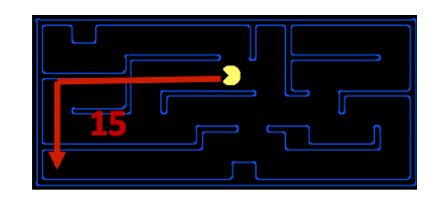
上面的可视化展示了曼哈顿距离帮助解决的松弛问题——假设吃豆人希望到达迷宫的左下角，它在假设迷宫中缺少墙壁的情况下，计算从吃豆人当前位置到期望位置的距离。这个距离是松弛搜索问题中的确切目标距离，相应地也就是实际搜索问题中的估计目标距离。有了启发式函数，在我们智能体中实现逻辑就变得非常容易，使得它们在决定执行哪个动作时，能够"偏好"扩展那些被估计为更接近目标状态的状态。这种偏好概念非常强大，并被以下两种实现启发式函数的搜索算法所利用：贪婪搜索和 A\* 搜索。
### 2. Greedy Search
- 描述 - 贪婪搜索是一种探索策略，总是选择启发值最低的边界节点进行扩展，这对应于它认为最接近目标的状态。
- 边界表示 - 贪婪搜索的操作与 UCS 完全相同，使用优先队列作为边界表示。区别在于，贪婪搜索不是使用计算的后向成本（到达该状态的路径上边的权重之和）来分配优先级，而是使用以启发值形式表示的估计前向成本。
- 完备性和最优性 - 贪婪搜索不能保证找到存在的目标状态，也不是最优的，特别是在选择了非常糟糕的启发式函数的情况下。它在不同场景下的行为通常相当不可预测，范围可能从直接到达目标状态，到表现得像一个引导很差的 DFS 并探索所有错误的区域。
### 3. A* Search
- 描述 - A* 搜索是一种探索策略，总是选择估计总成本最低的边界节点进行扩展，其中总成本是从起始节点到目标节点的全部成本。
- 边界表示 - 就像贪婪搜索和 UCS 一样，A* 搜索也使用优先队列来表示其边界。同样，唯一的区别是优先级选择的方法。A* 通过将 UCS 使用的总后向成本（到达该状态的路径上边的权重之和）与贪婪搜索使用的估计前向成本（启发值）相加，结合了这两者，有效地得出了从起点到目标的估计总成本。鉴于我们希望最小化从起点到目标的总成本，这是一个绝佳的选择。
- 完备性和最优性 - 给定一个适当的启发式函数（我们稍后会讨论），A* 搜索既是完备的也是最优的。它结合了我们目前涵盖的所有其他搜索策略的优点，融合了贪婪搜索通常的高速性以及 UCS 的最优性和完备性！
### 4. Admissibility and Consistency
既然我们已经讨论了启发式函数以及它们如何应用于贪婪搜索和 A* 搜索，让我们花些时间讨论一下什么构成了一个好的启发式函数。为此，让我们首先用以下定义重新表述 UCS、贪婪搜索和 A* 中用于确定优先队列顺序的方法：
g(n) - UCS 计算的总后向成本函数。
h(n) - 贪婪搜索使用的启发值函数，或估计前向成本。
f(n) - A* 搜索使用的估计总成本函数。f(n) = g(n) + h(n)。
在探讨什么构成"好"启发式函数之前，我们必须首先回答一个问题：无论我们使用什么启发式函数，A* 是否都能保持其完备性和最优性？确实，很容易找到破坏这两个珍贵属性的启发式函数。例如，考虑启发式函数 h(n) = 1 − g(n)。无论搜索问题是什么，使用这个启发式函数会得到：
f(n) = g(n) + h(n) = g(n) + (1 − g(n)) = 1
因此，这样的启发式函数将 A* 搜索简化为 BFS，其中所有边成本都相等。正如我们已经证明的，在边权重非常数的一般情况下，BFS 不能保证最优。
使用 A* 树搜索时保证最优性所需的条件称为可采纳性。可采纳性约束规定，可采纳启发式函数估计的值既非负也非高估。将 h*(n) 定义为从给定节点 n 到达目标状态的真正最优前向成本，我们可以将可采纳性约束用数学方式表述如下：
∀n, 0 ≤ h(n) ≤ h*(n)
定理。对于给定的搜索问题，如果启发式函数 h 满足可采纳性约束，则在该搜索问题上使用带有 h 的 A* 树搜索将产生最优解。
证明。假设在给定搜索问题的搜索树中存在两个可达目标状态：一个是最优目标A，另一个是次优目标B。由于A可从起始状态到达，因此A的某个祖先节点n（可能包括A本身）当前必然位于开放列表中。我们断言，基于以下三点陈述，节点n将在B之前被选中进行扩展：
1. g(A) < g(B)。由于已知A是最优的而B是次优的，因此可以得出A到起始状态的后向代价低于B。
2. h(A) = h(B) = 0。因为题目给定我们的启发函数满足可纳性约束。既然A和B都是目标状态，从它们到任一目标状态的真实最优代价就是 h∗(n) = 0；因此有 0 ≤ h(n) ≤ 0。
3. f(n) ≤ f(A)。这是由于启发函数h的可纳性：f(n) = g(n) + h(n) ≤ g(n) + h∗(n) = g(A) = f(A)。通过节点n的总代价最多等于A的真实后向代价，也就是A的总代价。

结合陈述1和陈述2，我们可以推导出 f(A) < f(B)，如下所示：
f(A) = g(A) + h(A) = g(A) < g(B) = g(B) + h(B) = f(B)
将上述推导出的不等式与陈述3相结合，可得到一个简单的推论：
f(n) ≤ f(A) ∧ f(A) < f(B) ⟹ f(n) < f(B)
因此，我们可以得出结论：节点n在B之前被扩展。由于这一结论对任意n都成立，所以我们可以断言，A的所有祖先节点（包括A本身）都会在B之前被扩展。
我们在上面发现的树搜索的一个问题是，在某些情况下，它可能永远找不到解，陷入状态空间图中无限循环搜索同一环路。即使在我们的搜索技术不涉及这种无限循环的情况下，也常常会因为到达同一节点有多种方式而多次重访该节点。这会导致指数级更多的工作量，自然的解决方案就是简单地跟踪已经扩展过的状态，并且不再扩展它们。更明确地说，在使用你选择的搜索方法时，维护一个已扩展节点的"已到达"集合。然后，确保每个节点在扩展前不在该集合中，如果不在，则在扩展后将其添加到集合中。带有这种优化功能的树搜索被称为图搜索，其伪代码如下：
```text
function GRAPH-SEARCH(problem, frontier) return a solution or failure
    reached ← an empty set
    frontier ← INSERT(MAKE-NODE(INITIAL-STATE[problem]), frontier)
    while not IS EMPTY(frontier) do
        node ← POP(frontier)
        if problem.IS-GOAL(node.STATE) then
            return node
        if node.STATE is not in reached then
            add node.STATE in reached
            for each child-node in EXPAND(problem, node) do
                frontier ← INSERT(child-node, frontier)
    return failure
```
请注意，在实现中，将 reached 集合存储为不相交集合而不是列表至关重要。将其存储为列表需要 O(n) 操作来检查成员资格，这会消除图搜索旨在提供的性能改进。图搜索的另一个注意事项是，即使在可采纳的启发式函数下，它也往往会破坏 A* 的最优性。考虑下面的简单状态空间图和相应的搜索树，附有权重和启发值：
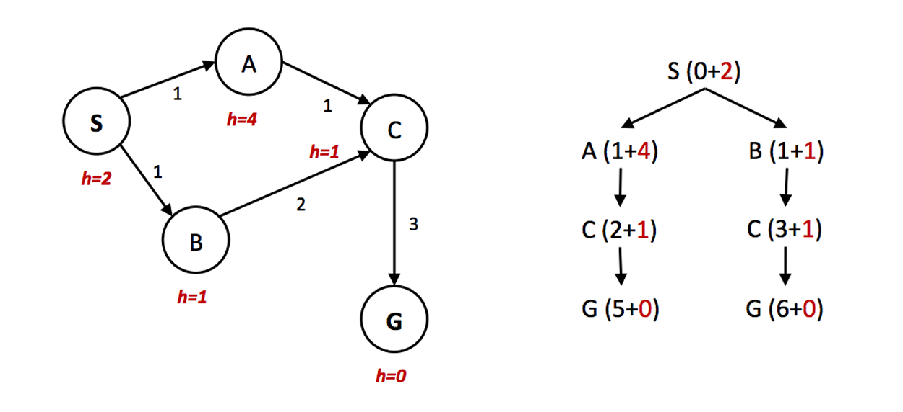
在上面的例子中，显然最优路径是 S → A → C → G，总路径成本为 1+1+3=5。另一条到目标的路径 S → B → C → G 路径成本为 1+2+3=6。然而，由于节点 A 的启发值远大于节点 B 的启发值，节点 C 首先作为节点 B 的子节点沿着第二条次优路径被扩展。然后它被放入"已到达"集合中，因此当 A* 图搜索将其作为 A 的子节点访问时，未能重新扩展它，所以永远找不到最优解。
因此，为了在 A* 图搜索下保持最优性，我们需要一个比可采纳性更强的属性——一致性。一致性的核心思想是，我们不仅强制要求启发式函数低估从任何给定节点到目标的总距离，而且还要低估图中每条边的成本/权重。启发式函数测量的边成本就是两个相连节点启发值的差。数学上，一致性约束可以表示如下：
∀A, C h(A) − h(C) ≤ cost(A, C)
定理。对于给定的搜索问题，如果启发式函数 h 满足一致性约束，则在该搜索问题上使用带有 h 的 A* 图搜索将产生最优解。
证明。为了证明上述定理，我们首先证明：当使用一致启发式运行A* 图搜索时，每当我们移除一个节点进行扩展时，我们已经找到了到达该节点的最优路径。
利用一致性约束，我们可以证明沿着任何路径的节点f(n)值是非递减的。定义两个节点n和n′，其中n′是n的子节点。则有：
f(n′) = g(n′) + h(n′)
= g(n) + cost(n, n′) + h(n′)
≥ g(n) + h(n)
= f(n)
如果对于路径上的每一对父子节点(n, n′)，都有f(n′) ≥ f(n)，那么该路径上的f(n)值必然是非递减的。我们可以检查上面的图中f(A)和f(C)之间是否违反了此规则。有了这个信息，我们现在可以证明：每当一个节点n被移除进行扩展时，其最优路径已被找到。
为了证明这一点，假设相反情况成立——即当n从开放列表中移除时，找到的到达n的路径是次优的。这意味着在开放列表上必然存在n的某个祖先节点n″，该节点从未被扩展，但却在到达n的最优路径上。然而，这与已知事实矛盾！因为我们已经证明了沿路径的f值是非递减的，所以n″本应在n之前被移除进行扩展。
为了完成我们的证明，剩下的只需证明最优目标A将总是在任何次优目标B之前被移除扩展并返回。这是显而易见的，因为h(A) = h(B) = 0，所以
f(A) = g(A) < g(B) = f(B)
这与我们在可纳性约束下对A* 树搜索最优性的证明相同。
因此，我们可以得出结论：在一致启发式下，A* 图搜索是最优的。
在我们继续之前，对上面的讨论强调几个重要的点：要使启发式函数可采纳/一致并有效，根据定义，对于任何目标状态 G，必须满足 h(G) = 0。此外，一致性不仅仅是比可采纳性更强的约束，一致性意味着可采纳性。这源于一个简单的事实：如果没有边成本被高估（由一致性保证），那么从任何节点到目标的估计总成本也不会是高估。
考虑下面的三节点网络作为可采纳但不一致的启发式函数的例子：
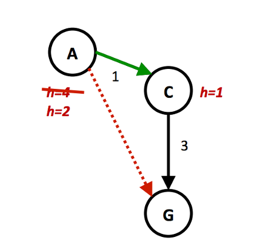
红色虚线对应于估计的总目标距离。如果 h(A) = 4，那么启发式函数是可采纳的，因为从 A 到目标的距离是 4 ≥ h(A)，h(C) = 1 ≤ 3 同理。然而，从 A 到 C 的启发式成本是 h(A) − h(C) = 4 − 1 = 3。我们的启发式函数估计 A 和 C 之间边的成本是 3，而真实值是 cost(A, C) = 1，一个更小的值。由于 h(A) − h(C) ≰ cost(A, C)，这个启发式函数不一致。然而，对 h(A) = 2 运行相同的计算，得到 h(A) − h(C) = 2 − 1 = 1 ≤ cost(A, C)。因此，使用 h(A) = 2 使我们的启发式函数一致。
### 5. Dominance
既然我们已经建立了可采纳性和一致性的属性及其在维护 A* 搜索最优性中的作用，我们可以回到我们最初的问题：创建"好"的启发式函数，以及如何判断一个启发式函数比另一个更好。其标准度量是优势关系。如果启发式函数 a 相对于启发式函数 b 具有优势，那么对于状态空间图中的每个节点，a 的估计目标距离都大于 b 的估计目标距离。数学上表示为：
$∀n : h_a(n) ≥ h_b(n)$
优势关系非常直观地捕捉了一个启发式函数优于另一个的想法——如果一个可采纳/一致的启发式函数相对于另一个具有优势，那么它一定更好，因为它对于任何给定状态总是能更接近地估计到目标的距离。此外，平凡启发式函数定义为 h(n) = 0，使用它会将 A* 搜索简化为 UCS。所有可采纳的启发式函数都优于平凡启发式函数。平凡启发式函数通常被放在搜索问题的半格底部，这是一个优势层次结构。下面是一个半格的例子，它包含了从底部的平凡启发式函数到顶部的确切目标距离的各种启发式函数 $h_a, h_b, h_c$：
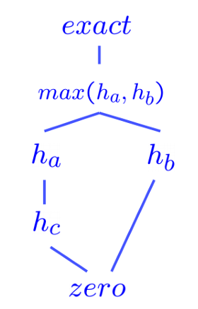
作为一般规则，应用于多个可采纳启发式函数的 max 函数也将始终是可采纳的。这仅仅是由于对于任何给定状态，所有启发式函数输出的值都受可采纳性条件 0 ≤ h(n) ≤ h*(n) 的约束。这个范围内的数字的最大值也必须落在同一范围内。对于多个一致的启发式函数，也很容易证明同样的情况。常见的做法是为任何给定的搜索问题生成多个可采纳/一致的启发式函数，并计算它们输出值的最大值，以生成一个优于（因此比它们各自都更好）的启发式函数。
### 6. Search: Summary
在本笔记中，我们讨论了搜索问题及其组成部分：状态空间、一组动作、转移函数、动作成本、起始状态和目标状态。智能体通过其传感器和执行器与环境交互。智能体函数描述了智能体在所有情况下的行为。智能体的理性意味着智能体寻求最大化其期望效用。最后，我们使用 PEAS 描述来定义我们的任务环境。
关于搜索问题，它们可以使用多种搜索技术解决，包括但不限于我们在 CS 188 中学习的五种：
- 广度优先搜索
- 深度优先搜索
- 统一成本搜索
- 贪婪搜索
- A* 搜索

上面列出的前三种搜索技术是无信息搜索的例子，而后两种是启发式搜索的例子，它们使用启发式函数来估计目标距离并优化性能。我们还区分了上述技术的树搜索和图搜索算法。
___
[返回目录](#目录)
___
## Note 4: Search III<a id = "note4"></a>
### 1. Local Search
在之前的笔记中，我们致力于寻找目标状态以及到达该状态的最优路径。但在某些问题中，我们只关心找到目标状态——重构路径可能是微不足道的。例如，在数独游戏中，最优配置就是目标状态。一旦你知道了这个配置，通过逐个填入方格就可以轻松实现。
局部搜索算法使我们能够在不关心到达路径的情况下找到目标状态。在局部搜索问题中，状态空间由一组“完整”解构成。我们使用这些算法来尝试找到满足某些约束条件或优化某个目标函数的配置。
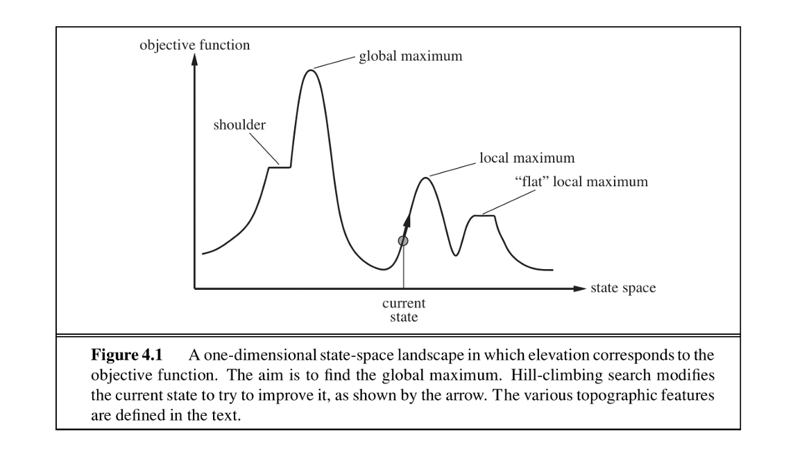
上图展示了状态空间上一维目标函数的曲线。对于该函数，我们希望找到对应最高目标值的状态。局部搜索算法的基本思想是：从每个状态出发，在局部范围内向具有更高目标值的状态移动，直到达到一个最大值（希望是全局最大值）。我们将介绍四种此类算法：爬山法、模拟退火、局部束搜索和遗传算法。这些算法也常用于优化任务中，以最大化或最小化某个目标函数。
### 2. Hill-Climbing Search
爬山搜索算法（或最陡上升法）从当前状态移动到能最大程度增加目标值的邻近状态。该算法不维护搜索树，仅保存状态及其对应的目标值。爬山法的“贪婪性”使其容易陷入局部最大值（见图4.1），因为这些局部最优点在算法看来似乎是全局最大值，同时也容易陷入平台区（见图4.1）。平台区可分为“平坦”区域（任何方向都无法改进，即“平坦局部最大值”）以及进展缓慢的平坦区域（“肩部”）。
爬山法的一些变体已被提出，例如随机爬山法，它会从可能的向上移动中随机选择一个动作。实践证明，随机爬山法能以更多迭代为代价，收敛到更高的最大值。另一种变体是随机侧向移动，它允许那些不会严格增加目标值的移动，从而使算法能够逃离“肩部”。
```
function HILL-CLIMBING(problem) returns a state
    current ← make-node(problem.initial-state)
    loop do
        neighbor ← a highest-valued successor of current
        if neighbor.value ≤ current.value then
            return current.state
        current ← neighbor
```
爬山法的伪代码如上所示。顾名思义，该算法迭代地移动到具有更高目标值的状态，直到无法进一步改进为止。爬山法是不完备的。另一方面，随机重启爬山法会从随机选择的初始状态进行多次爬山搜索，由于某个随机初始状态有可能收敛到全局最大值，因此它是平凡完备的。
需要注意的是，在后续课程中你将接触到术语“梯度下降”。它与爬山法的思想完全相同，区别在于梯度下降是最小化代价函数，而爬山法是最大化目标函数。
### 3. Simulated Annealing Search
我们将介绍的第二种局部搜索算法是模拟退火。模拟退火旨在结合随机行走（随机移动到邻近状态）和爬山法，以获得一种完备且高效的搜索算法。在模拟退火中，我们允许移动到可能降低目标值的状态。
该算法在每个时间步随机选择一个移动。如果该移动导致目标值增加，则总是接受它；如果导致目标值降低，则以一定的概率接受该移动。这个概率由温度参数决定，初始温度较高（允许更多“不良”移动），并按照某种“退火计划”逐渐降低。理论上，如果温度降低得足够慢，模拟退火算法将以接近1的概率达到全局最大值。
```
function SIMULATED-ANNEALING(problem, schedule) returns a state
current ← problem.initial-state
for t = 1 to ∞ do
    T ← schedule(t)
    if T = 0 then return current
    next ← a randomly selected successor of current
    ΔE ← next.value − current.value
    if ΔE > 0 then current ← next
        else current ← next only with probability e^{ΔE/T}
```
### 4. Local Beam Search
局部束搜索是爬山搜索算法的另一种变体。两者之间的关键区别在于，局部束搜索在每次迭代中会维护k个状态（线程）。该算法从随机初始化的k个状态开始，每次迭代按照爬山法的方式生成k个新状态。这些新状态并非简单地对常规爬山算法进行k次复制。关键在于，算法会从所有线程的后继状态完整列表中选出k个最佳后继状态。如果任一线程找到了最优值，算法即停止。
这些k个线程可以共享信息，使得“优秀”线程（目标值较高的线程）能够将其他线程吸引到该区域。
局部束搜索也容易像爬山法一样陷入“平坦”区域。随机束搜索作为随机爬山法的类比变体，可以缓解这一问题。
### 5. Genetic Algorithms
最后，我们介绍遗传算法，它是局部束搜索的一种变体，并广泛应用于许多优化任务中。顾名思义，遗传算法的灵感来源于进化论。
遗传算法从k个随机初始化的状态（称为种群）开始，类似于束搜索。状态（称为个体）表示为有限字母表上的字符串。
让我们回顾一下课堂上讲过的八皇后问题。简单来说，八皇后是一个约束满足问题，目标是在8×8棋盘上放置八个皇后。满足约束的解中不会有任何互相攻击的皇后对，即不存在同行、同列或同对角线的皇后。前面介绍的所有算法都可以用来解决八皇后问题。
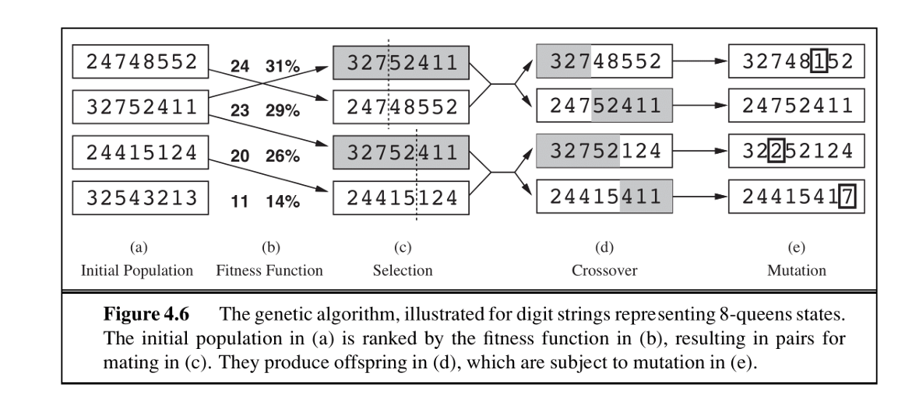
在遗传算法中，我们用一个1到8的数字来表示每个皇后在其列中的位置（图4.6中的列(a)）。每个个体通过评价函数（适应度函数）进行评估，并根据该函数值进行排名。对于八皇后问题，适应度函数是互不攻击（无冲突）的皇后对的数量。
选择某个状态进行“繁殖”的概率与该状态的值成正比。我们通过从这些概率中抽样来选择成对的状态进行繁殖（图4.6中的列(c)）。子代通过在交叉点处交换父代字符串来生成。交叉点是为每对父代随机选择的。最后，每个子代以独立的概率发生随机变异。
遗传算法的伪代码如下所示。
```
function GENETIC-ALGORITHM(population, FITNESS-FN) returns an individual
inputs: population, a set of individuals
    FITNESS-FN, a function that measures the fitness of an individual

repeat
    new_population ← empty set
    for i = 1 to SIZE(population) do
        x ← RANDOM-SELECTION(population, FITNESS-FN)
        y ← RANDOM-SELECTION(population, FITNESS-FN)
        child ← REPRODUCE(x, y)
        if (small random probability) then child ← MUTATE(child)
        add child to new_population
    population ← new_population
until some individual is fit enough, or enough time has elapsed
return the best individual in population, according to FITNESS-FN

function REPRODUCE(x, y) returns an individual
inputs: x, y, parent individuals

n ← LENGTH(x); c ← random number from 1 to n
return APPEND(SUBSTRING(x, 1, c), SUBSTRING(y, c + 1, n))
```
与随机束搜索类似，遗传算法在探索状态空间和在线程间交换信息的同时，努力向更高目标移动。它们的主要优势在于交叉操作——经过进化并带来高评分的较大基因片段可以与其他此类片段组合，从而产生总得分较高的解。
### 6. Summary
在本笔记中，我们讨论了局部搜索算法及其应用动机。当不关心到达某个目标状态的路径，而只需满足约束或优化某个目标时，我们可以采用这些方法。局部搜索方法使我们能够在庞大的状态空间中节省空间，并找到合适的解！
我们介绍了几种基础的局部搜索方法，它们彼此之间是层层递进的关系：
- 爬山法
- 模拟退火
- 局部束搜索
- 遗传算法

优化函数的思想将在本课程后续内容中再次出现，尤其是在讲解神经网络时。
___
[返回目录](#目录)
___
## Note 5: Game I<a id = "note5"></a>
### 1. Games
在首篇笔记中，我们讨论了搜索问题以及如何高效且最优地解决它们——通过使用强大的通用搜索算法，我们的智能体能够确定最佳计划，然后简单地执行它以达到目标。现在，让我们换个角度，考虑我们的智能体面临一个或多个试图阻止其达成目标的对手的情况。我们的智能体不能再运行我们已经学过的搜索算法来制定计划，因为我们通常无法确定性地预知对手将如何针对我们进行规划并对我们的行动做出反应。相反，我们需要运行一类新的算法，为对抗性搜索问题（通常更广为人知的名称是“博弈”）提供解决方案。
博弈有多种不同类型。博弈中的行动结果可以是确定性的，也可以是随机（概率性）的；玩家数量可变；并且可能是零和的，也可能不是。我们将介绍的第一类博弈是确定性零和博弈，即行动是确定性的，并且我们的收益直接等同于对手的损失，反之亦然。理解这类博弈最简单的方式是将其视为由一个单一变量值定义，一方或智能体试图最大化该值，而另一方或智能体则试图最小化它，这有效地使他们处于直接竞争之中。在吃豆人游戏中，这个变量就是你的分数，你试图通过快速高效地吃豆子来最大化分数，而幽灵则试图通过先吃掉你来最小化分数。许多常见的家庭博弈也属于这一类：
- 国际跳棋：——第一个国际跳棋电脑程序诞生于 1950 年。此后，国际跳棋已成为一个已解的博弈，这意味着在双方都最优行动的前提下，任何局面都可以确定性地评估为某一方的胜、负或平。
- 国际象棋：——1997 年，“深蓝”成为第一个在六局比赛中击败人类国际象棋冠军加里·卡斯帕罗夫的计算机智能体。“深蓝”被设计为使用极其精密的方法，每秒评估超过 2 亿个局面。尽管不那么具有历史里程碑意义，但当今的程序甚至更强大。
- 围棋：——围棋的搜索空间远大于国际象棋，因此在随后多年里，大多数人认为围棋计算机智能体不可能击败人类世界冠军。然而，谷歌开发的 AlphaGo 在 2016 年 3 月以 4 比 1 的比分历史性地击败了围棋冠军李世石。

上述所有世界冠军级别的智能体都在某种程度上使用了我们将要介绍的对抗性搜索技术。与返回全面计划的常规搜索不同，对抗性搜索返回一个策略，该策略仅根据我方智能体及其对手的给定配置，推荐最佳的可能移动。我们很快就会看到，这类算法具有一个美妙的特性：通过计算即可涌现出行为——我们运行的计算在概念上相对简单且具有广泛通用性，却能内在地生成同队智能体之间的合作以及对对手的“智胜”。
标准的博弈公式包含以下定义：
- 初始状态，\( s_0 \)
- 玩家，\( Players(s) \) 表示当前轮到谁行动
- 行动，\( Actions(s) \) 当前玩家可用的行动
- 转移模型，\( Result(s, a) \)
- 终止测试，\( Terminal-test(s) \)
- 终止效用，\( Utility(s, player) \)
### 2. Minimax
我们将考虑的第一个零和博弈算法是极小化极大，它在一个激励性假设下运行：我们面对的对手行为最优，并且总是执行对我们最不利的移动。为了介绍这个算法，我们必须首先形式化终止效用和状态价值的概念。一个状态的价值是指控制该状态的智能体所能获得的最优分数。为了理解其含义，观察下面这个极其简单的吃豆人游戏棋盘：
假设吃豆人从 10 分开始，每移动一步扣 1 分，直到他吃到豆子，此时游戏进入终止状态并结束。我们可以开始为这个棋盘构建一棵博弈树，其中节点的子节点是后继状态，就像常规搜索问题的搜索树一样：

从这棵树可以明显看出，如果吃豆人径直走向豆子，他以 8 分的成绩结束游戏；而如果他在任何时刻回溯，最终得分会更低。现在我们已经生成了包含多个终止状态和中间状态的博弈树，可以正式定义其中任一状态的价值含义了。 
一个状态的价值定义为智能体从该状态出发能够达到的最佳可能结果（效用）。我们稍后会更具体地形式化效用的概念，但目前只需将智能体的效用简单地理解为其获得的分数或点数即可。终止状态的价值称为终止效用，它总是某个确定已知的值，是博弈的内在属性。在我们的吃豆人例子中，最右侧终止状态的价值就是 8，即吃豆人径直走向豆子获得的分数。同样在此例中，非终止状态的价值定义为其子节点价值的最大值。将 \( V(s) \) 定义为计算状态 \( s \) 价值的函数，我们可以总结上述讨论：
\[
\forall \text{非终止状态}, V(s) = \max_{s' \in successors(s)} V(s')
\]
\[
\forall \text{终止状态}, V(s) = \text{已知}
\]
这建立了一个非常简单的递归规则，由此可以理解，根节点直接的右子节点价值将为 8，而根节点直接的左子节点价值将为 6，因为它们分别是智能体从起始状态向右或向左移动所能获得的最大可能分数。由此，通过运行这样的计算，智能体可以确定向右移动是最优的，因为起始状态的右子节点价值大于左子节点。
现在，我们引入一个新的游戏棋盘，其中有一个敌对的幽灵，它试图阻止吃豆人吃到豆子。
游戏规则规定两个智能体轮流行动，这导致博弈树中两个智能体交替出现在它们“控制”的层上。一个智能体控制某个节点，仅仅意味着该节点对应的状态轮到该智能体行动，因此由它来决定采取什么行动并相应地改变游戏状态。以下是上述双智能体游戏棋盘所产生的博弈树：
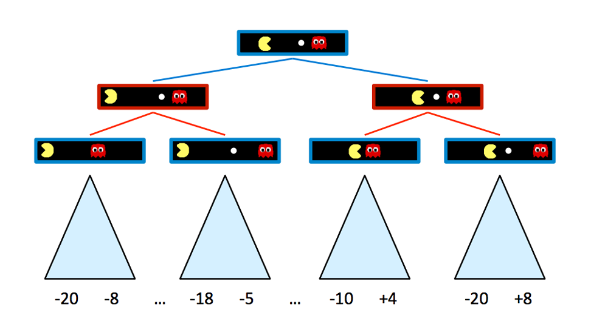
蓝色节点代表吃豆人控制的节点，它可以决定采取什么行动；而红色节点代表幽灵控制的节点。注意，幽灵控制节点的所有子节点，都是幽灵从父节点状态向左或向右移动后到达的状态；吃豆人控制节点同理。为简化起见，我们将这棵博弈树截断到深度为 2，并为终止状态分配虚构的值如下：
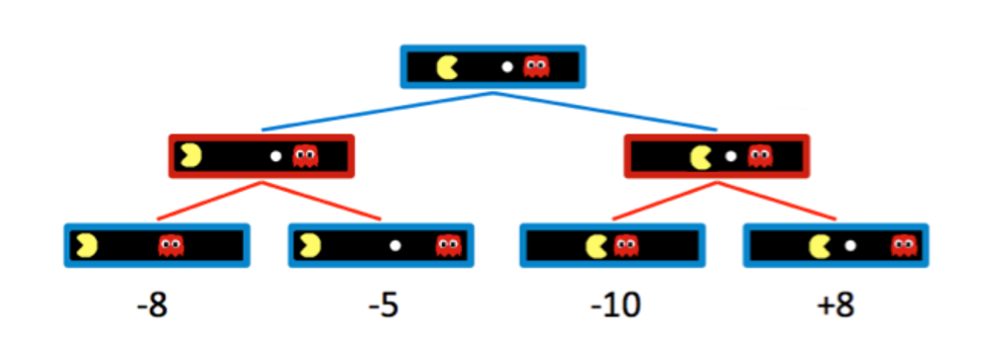
自然地，加入幽灵控制的节点改变了吃豆人认为最优的移动，而新的最优移动是通过极小化极大算法确定的。极小化极大算法并非在树的每一层都最大化子节点的效用，而是仅在吃豆人控制的节点子节点上进行最大化，在幽灵控制的节点子节点上进行最小化。因此，上面两个幽灵节点的值分别为 \( \min(-8, -5) = -8 \) 和 \( \min(-10, +8) = -10 \)。相应地，由吃豆人控制的根节点值为 \( \max(-8, -10) = -8 \)。由于吃豆人想最大化自己的分数，他会选择向左移动，接受 -8 分，而不是尝试去吃豆子得到 -10 分。这是一个通过计算涌现行为的典型例子——尽管吃豆人希望获得如果进入最右侧子状态能得到的 +8 分，但通过极小化极大，他“知道”一个最优表现的幽灵不会让他得逞。为了最优行动，吃豆人被迫规避风险，反直觉地远离豆子，以最小化失败的幅度。我们可以将极小化极大给状态赋值的方式总结如下：
\[
\forall \text{智能体控制的状态}, V(s) = \max_{s' \in successors(s)} V(s')
\]
\[
\forall \text{对手控制的状态}, V(s) = \min_{s' \in successors(s)} V(s')
\]
\[
\forall \text{终止状态}, V(s) = \text{已知}
\]
在实现中，极小化极大的行为类似于深度优先搜索，以 DFS 相同的顺序计算节点价值，从最左侧的终止节点开始，逐步向右迭代。更精确地说，它对博弈树执行后序遍历。由此产生的极小化极大伪代码既优雅又直观简单，如下所示。注意，极小化极大将返回一个行动，该行动对应于根节点通向其采纳价值的那条分支。
```
def value(state):
    if the state is a terminal state: return the state's utility
    if the agent is MAX: return max-value(state)
    if the agent is MIN: return min-value(state)

def max-value(state):
    initialize v = -∞
    for each successor of state:
        v = max(v, value(successor))
    return v
def min-value(state):
    initialize v = +∞
    for each successor of state:
        v = min(v, value(successor))
    return v
```
### 3. Alpha-Beta Pruning
极小化极大似乎近乎完美——它简单、最优且直观。然而，它的执行与深度优先搜索非常相似，时间复杂度也相同，都是糟糕的 \( O(b^m) \)。回想一下，\( b \) 是分支因子，\( m \) 是能找到终止节点的大致树深度，这对于许多博弈来说运行时间过长。例如，国际象棋的分支因子 \( b \approx 35 \)，树深度 \( m \approx 100 \)。为了帮助缓解这个问题，极小化极大有一个优化——Alpha-Beta 剪枝。
从概念上讲，Alpha-Beta 剪枝是这样的：当你试图通过查看节点 \( n \) 的后继节点来确定其价值时，一旦你知道节点 \( n \) 的价值最多等于节点 \( n \) 的父节点的最优价值，就可以停止查看。让我们通过一个例子来阐释这个略显晦涩的表述。考虑下面的博弈树，方形节点对应终止状态，向下的三角形对应极小化节点，向上的三角形对应极大化节点：
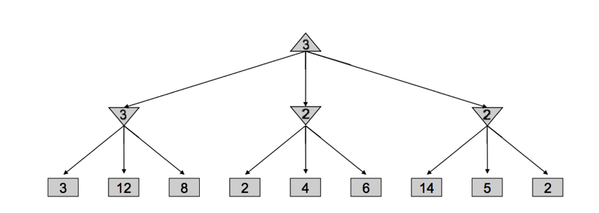
我们来回顾一下极小化极大是如何推导这棵树的——它首先遍历值为 3、12、8 的节点，并将 \( \min(3,12,8) = 3 \) 赋给最左侧的极小化节点。然后，它将 \( \min(2,4,6) = 2 \) 赋给中间的极小化节点，将 \( \min(14,5,2) = 2 \) 赋给最右侧的极小化节点，最后将 \( \max(3,2,2) = 3 \) 赋给根部的极大化节点。但是，如果我们思考一下这种情况，就能意识到：一旦我们访问了中间极小化节点的子节点值为 2，就无需再查看该极小化节点的其他子节点了。为什么？因为我们看到了中间极小化节点的子节点值为 2，我们知道无论其他子节点取何值，中间极小化节点的值最多为 2。确立了这一点之后，我们再进一步思考：根部的极大化节点正在比较左侧极小化节点的值 3 和这个 ≤2 的值，它肯定会优先选择左侧极小化节点返回的 3，而不是中间极小化节点返回的值，无论其剩余子节点的值是多少。这正是我们可以剪枝搜索树，无需查看中间极小化节点剩余子节点的确切原因：
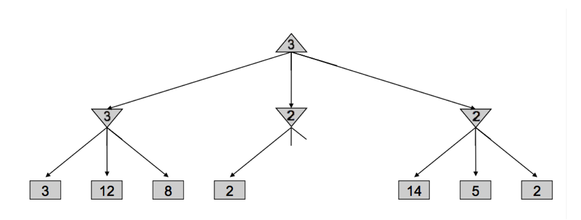
实施这样的剪枝可以将我们的运行时间降低到 \( O(b^{m/2}) \) 的理想情况，有效地使我们“可解”的深度翻倍。在实践中，提升幅度通常远小于此，但通常足以使我们能够多搜索至少一或两层。这仍然意义重大，因为能思考三步的玩家比能思考两步的玩家更具优势。这种剪枝正是带有 Alpha-Beta 剪枝的极小化极大算法所做的，其实现如下：
```
α: MAX’s best option on path to root  
β: MIN’s best option on path to root  

def max-value(state, α, β):  
    initialize v = -∞  
    for each successor of state:  
        v = max(v, value(successor, α, β))  
        if v ≥ β return v  
        α = max(α, v)  
    return v  

def min-value(state, α, β):  
    initialize v = +∞  
    for each successor of state:  
        v = min(v, value(successor, α, β))  
        if v ≤ α return v  
        β = min(β, v)  
    return v
```
花些时间将其与原始极小化极大的伪代码进行比较，并注意我们现在可以在不搜索完所有后继的情况下提前返回。
### 4. Evaluation Functions
尽管 Alpha-Beta 剪枝有助于增加我们可以实际运行极小化极大的深度，但对于绝大多数博弈来说，这仍然远远不足以到达搜索树的底部。因此，我们转向评估函数，这类函数接收一个状态，并输出该节点真实极小化价值的估计值。通常，这被直白地解释为：一个好的评估函数会给“更好”的状态赋予比“更差”的状态更高的价值。评估函数广泛用于深度受限极小化极大，在此类算法中，我们将位于最大可解深度的非终止节点视为终止节点，并给予它们由精心选择的评估函数确定的模拟终止效用。由于评估函数只能给出非终止状态价值的估计值，这消除了运行极小化极大时保证最优玩法的可能性。
在设计运行极小化极大的智能体时，评估函数的选择通常需要大量的思考和实验，评估函数越好，智能体的行为就越接近最优。此外，在使用评估函数之前深入搜索树更深层，通常也能获得更好的结果——将其计算深埋在博弈树中可以减轻对最优性的损害。这些函数在博弈中的作用，与启发式函数在标准搜索问题中的作用非常相似。
评估函数最常见的设计是特征的线性组合。
\[
Eval(s) = w_1 f_1(s) + w_2 f_2(s) + ... + w_n f_n(s)
\]
每个 \( f_i(s) \) 对应于从输入状态 \( s \) 中提取的一个特征，每个特征被赋予一个相应的权重 \( w_i \)。特征仅仅是我们可以从游戏状态中提取并为其分配数值的某些元素。例如，在国际跳棋游戏中，我们可能会构建一个包含 4 个特征的评估函数：我方兵的数量、我方王的数量、对方兵的数量、对方王的数量。然后，根据它们的重要性大致选择适当的权重。在我们的国际跳棋例子中，最合理的是为我方的兵/王选择正权重，为对方的兵/王选择负权重。此外，我们可能认为，由于王在国际跳棋中是比兵更有价值的棋子，对应我方/对方王的特征应该赋予比关于兵的特征幅度更大的权重。下面是一个可能的评估函数，符合我们刚才构思的特征和权重：
\[
Eval(s) = 2 \cdot agent\_kings(s) + agent\_pawns(s) - 2 \cdot opponent\_kings(s) - opponent\_pawns(s)
\]
如你所见，评估函数的设计可以相当自由，也不一定是线性函数。例如，基于神经网络的非线性评估函数在强化学习应用中非常常见。需要牢记的最重要的一点是，评估函数应尽可能频繁地为更好的局面给出更高的分数。这可能需要大量调整和实验，以测试使用具有多种不同特征和权重的评估函数的智能体性能。
___
[返回目录](#目录)
___
## Note 6: Game II<a id = "note6"></a>
### 1. Expectimax
我们已经了解了极小化极大的工作原理，以及运行完整的极小化极大如何使我们能够针对最优对手做出最优响应。然而，极小化极大对其所能应对的情况存在一些天然的限制。因为极小化极大假设自己是在应对一个最优对手，所以在无法保证对手会对智能体的行动做出最优响应的情况下，它往往过于悲观。这类情况包括具有内在随机性的场景，例如纸牌或骰子游戏，或者对手行为随机或次优、难以预测的情况。我们将在课程后半部分讨论马尔可夫决策过程时，更详细地探讨具有内在随机性的场景。
这种随机性可以通过极小化极大的一种泛化形式——期望极大化来表示。期望极大化在博弈树中引入了机会节点，与极小化节点考虑最坏情况不同，机会节点考虑平均情况。更具体地说，极小化节点只是计算其子节点中的最小效用，而机会节点则计算期望效用或期望值。我们使用期望极大化确定节点价值的规则如下：
$$
\forall \text{智能体控制的状态}, V(s) = \max_{s' \in successors(s)} V(s')
$$
$$
\forall \text{机会状态}, V(s) = \sum_{s' \in successors(s)} p(s'|s) V(s')
$$
$$
\forall \text{终止状态}, V(s) = \text{已知}
$$
在上述公式中，\( p(s'|s) \) 指的是：根据所考虑的博弈和博弈树的具体情况，要么是某个非确定性行动导致从状态 \( s \) 转移到状态 \( s' \) 的概率，要么是对手选择某个导致从状态 \( s \) 转移到状态 \( s' \) 的行动的概率。从这个定义可以看出，极小化极大只是期望极大化的一个特例。极小化节点就是这样的机会节点：它为其价值最低的子节点分配概率 1，而为所有其他子节点分配概率 0。
通常，概率的选择是为了恰当地反映我们试图建模的博弈状态，但我们将在未来的笔记中更详细地介绍这个过程是如何进行的。目前，可以合理地假设这些概率仅仅是博弈的固有属性。
期望极大化的伪代码与极小化极大非常相似，只需做一些小的调整，用期望效用取代最小效用，因为我们用机会节点替换了极小化节点：
```
def value(state):
    if the state is a terminal state: return the state's utility
    if the agent is MAX: return max-value(state)
    if the agent is EXP: return exp-value(state)

def max-value(state):
    initialize v = -∞
    for each successor of state:
        v = max(v, value(successor))
    return v

def exp-value(state):
    initialize v = 0
    for each successor of state:
        p = probability(successor)
        v += p * value(successor)
    return v
```
在继续之前，让我们快速浏览一个简单的例子。考虑下面的期望极大化树，其中机会节点用圆形节点表示，而不是极大化/极小化节点所用的向上/向下的三角形。
为简单起见，假设每个机会节点的所有子节点出现的概率均为 \( \frac{1}{3} \)。因此，根据我们的期望极大化价值确定规则，从左到右，三个机会节点的值分别为：\( \frac{1}{3} \cdot 3 + \frac{1}{3} \cdot 12 + \frac{1}{3} \cdot 9 = 8 \)，\( \frac{1}{3} \cdot 2 + \frac{1}{3} \cdot 4 + \frac{1}{3} \cdot 6 = 4 \)，以及 \( \frac{1}{3} \cdot 15 + \frac{1}{3} \cdot 6 + \frac{1}{3} \cdot 0 = 7 \)。极大化节点选择这三个值中的最大值 8，从而得到如下填充完整的博弈树：
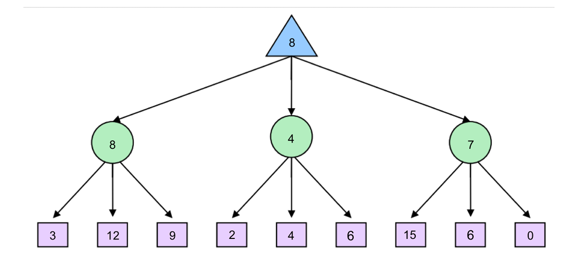
关于期望极大化的最后一点需要注意的是，通常有必要查看机会节点的所有子节点——我们不能像在极小化极大中那样进行剪枝。与在极小化极大中计算最小值或最大值不同，单个值可以任意地拉高或拉低期望极大化计算的期望值。然而，当我们知道节点价值的有限上界和下界时，剪枝是可能的。
### 2. Mixed Layer Types
尽管极小化极大和期望极大化分别要求交替的极大化/极小化节点和极大化/机会节点，但许多博弈仍然不完全遵循这两种算法所规定的精确交替模式。即使在吃豆人游戏中，吃豆人移动之后，通常会有多个幽灵轮流移动，而不是只有一个幽灵。我们可以通过在博弈树中非常灵活地按需添加层来解决这个问题。在包含四个幽灵的吃豆人游戏例子中，可以通过在第一个吃豆人/极大化层之后，第二个吃豆人/极大化层之前，连续添加 4 个幽灵/极小化层来实现。事实上，这样做本身就会在所有极小化节点之间引发合作，因为它们轮流进一步最小化极大化者所能达到的效用。甚至可以将机会节点层与极小化节点和极大化节点结合起来。如果我们有一个包含两个幽灵的吃豆人游戏，其中一个幽灵行为随机，另一个行为最优，我们可以通过交替的极大化-机会-极小化节点组来模拟这种情况。
显然，节点分层有相当大的灵活变化空间，这使得我们可以为任何零和博弈开发出经过修改的期望极大化/极小化混合算法，构建博弈树和对抗性搜索算法。
### 3. General Games
并非所有博弈都是零和的。实际上，不同的智能体在博弈中可能有不同的任务，而这些任务并不直接涉及彼此严格竞争。这类博弈可以通过具有多智能体效用的树来构建。这种效用不是单个值让交替的智能体去最小化或最大化，而是表示为元组，元组内的不同值对应于不同智能体的独特效用。然后，每个智能体在它们控制的每个节点上试图最大化自己的效用，而忽略其他智能体的效用。考虑下面的树：
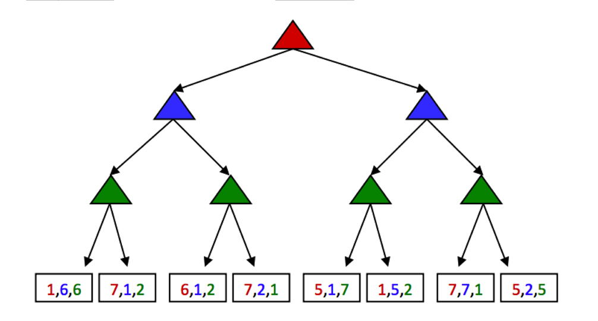
红色、绿色和蓝色节点分别对应三个独立的智能体，它们在自己所在层从可能的选项中分别最大化红色、绿色和蓝色效用。逐步分析这个例子，最终在树顶得到效用元组 (5,2,5)。具有多智能体效用的一般博弈是通过计算涌现行为的一个典型例子，因为这种设置会引发合作，因为在树根选择的效用往往能为所有参与的智能体产生一个合理的效用。
### 4. Monte Carlo Tree Search
对于像围棋这样具有巨大分支因子的应用，极小化极大已不再适用。对于此类应用，我们使用蒙特卡洛树搜索算法。MCTS 基于两个思想：
- 通过 rollout 进行评估：从状态 \( s \) 开始，使用某种策略（例如随机策略）多次进行游戏，并统计胜/负次数。
- 选择性搜索：探索树中那些有助于改进根节点决策的部分，不受深度限制。

在围棋的例子中，从给定状态出发，根据某个策略多次进行游戏直至终止。我们记录获胜比例，该比例与状态的价值有很好的相关性。
考虑以下示例：
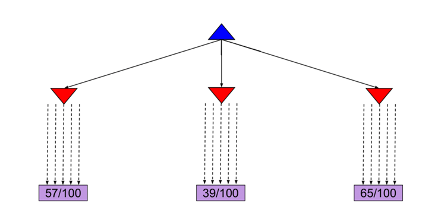
从当前状态出发，我们有三个不同的可用行动（左、中、右）。我们对每个行动执行 100 次模拟，并记录每个行动的获胜百分比。经过这些模拟后，我们相当确信右行动是最佳选择。在这种情况下，我们为每个备选行动分配了相同数量的模拟。然而，经过几次模拟后，可能会清楚某个行动并没有带来很多胜利，因此我们可能会选择将这部分计算工作重新分配，为其他行动进行更多模拟。这种情况可以在下图中看到，我们决定将原本分配给中间行动的剩余 90 次模拟分配给左行动和右行动。
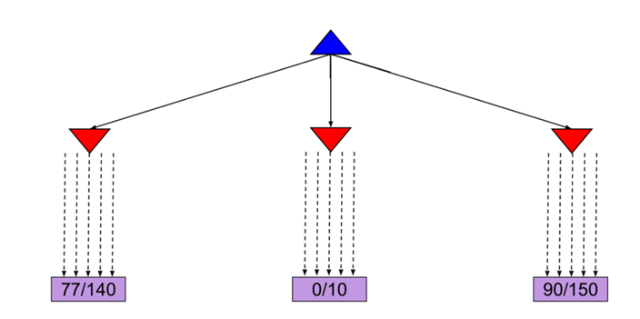
另一种有趣的情况出现在某些行动产生相似的获胜百分比，但其中一个行动用于估计该百分比所使用的模拟次数少得多，如下一张图所示。在这种情况下，使用较少模拟的行动的估计值将具有较高的方差，因此我们可能希望为该行动分配更多模拟，以对其真实的获胜百分比更有信心。
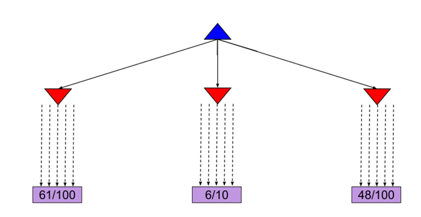
UCB 算法通过在每个节点 \( n \) 处使用以下准则来捕捉“有希望”的行动与“不确定”的行动之间的权衡：
$$
\text{UCB1}(n) = \frac{U(n)}{N(n)} + C \times \sqrt{\frac{\log N(\text{PARENT}(n))}{N(n)}}
$$
其中 \( N(n) \) 表示从节点 \( n \) 出发的 rollout 总数，\( U(n) \) 表示玩家（父节点玩家）获胜的总次数。第一项衡量该节点的前景（开发），第二项衡量我们对该节点效用的不确定程度（探索）。用户指定的参数 \( C \) 平衡了我们赋予这两项的权重，它取决于具体应用甚至任务的阶段（在后期阶段，当我们积累了大量试验后，可能会减少探索，增加开发）。
MCTS UCT 算法在树搜索问题中使用 UCB 准则。更具体地说，它会多次重复以下三个步骤：
1. 使用 UCB 准则从根节点向下沿着树的层次移动，直到到达一个尚未完全扩展的叶节点。
2. 为该叶节点添加一个新的子节点，并从该子节点开始执行一次 rollout，以确定从该节点出发的获胜次数。
3. 将从该子节点获得的获胜次数一路更新回根节点。

一旦上述三个步骤充分重复，我们就选择通向具有最高 \( N \) 值的子节点所对应的行动。注意，由于 UCT 本质上会以更高的次数探索更有希望的子节点，当 \( N \to \infty \) 时，UCT 的行为趋近于极小化极大智能体。
### 5. Summary 
在本笔记中，我们从考虑标准搜索问题（我们仅尝试找到从起点到某个目标的路径）转向考虑对抗性搜索问题（我们可能遇到试图阻碍我们达成目标的对手）。我们主要讨论了两种算法：
- 极小化极大 - 当我们的对手行为最优时使用，并可通过 α-β 剪枝进行优化。极小化极大提供的行动比期望极大化更为保守，因此在对手未知的情况下也倾向于产生有利的结果。
- 期望极大化 - 当我们面对次优对手时使用，根据我们认为对手将采取行动的概率分布来计算状态的期望值。

在大多数情况下，将上述算法一直运行到所考虑博弈树的终止节点层级在计算上过于昂贵，因此我们引入了评估函数的概念以实现提前终止。对于具有大分支因子的问题，我们描述了 MCTS 和 UCT 算法。这类算法易于并行化，允许利用现代硬件进行大量的 rollout 模拟。
最后，我们讨论了一般博弈的问题，这类博弈的规则不一定是零和的。
___
[返回目录](#目录)
___
## Note 7: Logic I<a id = "note7"></a>
### 1. A Knowledge Based Agent
想象一个充满岩浆的危险世界，唯一的避难所是远方的绿洲。我们希望智能体能够安全地从当前位置导航到绿洲。
在强化学习中，我们假设唯一能提供的指导是一个奖励函数，它会试图将智能体推向正确的方向，就像玩“热/冷”游戏一样。随着智能体探索并收集更多关于世界的观察，它逐渐学会将某些行动与未来的正奖励联系起来，而将其他行动与不想要的、致命的烫伤联系起来。这样，它可能会学会识别世界中的某些线索并据此行动。例如，如果它感觉到空气变热，它就应该转向另一个方向。
然而，我们可以考虑另一种策略。与其这样，不如告诉智能体一些关于世界的事实，并允许它根据手头的信息推理该做什么。如果我们告诉智能体，空气在岩浆坑周围会变得又热又朦胧，而在水体周围则会变得清新干净，那么它就可以根据对大气状况的读数，合理地推断出地形的哪些区域是危险的或安全的。这种不同类型的智能体被称为基于知识的智能体。这样的智能体维护一个知识库，这是一个逻辑语句的集合，编码了我们告诉智能体的信息以及它观察到的事实。智能体还能够执行逻辑推理来得出新的结论。
### 2. The Language of Logic
就像任何其他语言一样，逻辑语句是用特殊的语法书写的。每个逻辑句子都是关于某个世界的命题的编码，该命题可能为真也可能为假。例如，“地板是岩浆”这句话在我们的智能体世界中可能为真，但在我们的世界中可能不为真。我们可以通过使用逻辑连接词将更简单的句子串联起来构建复杂的句子，例如“你可以从Big C看到整个校园，并且徒步旅行是学习之余健康的休息方式”。该语言中有五种逻辑连接词：
- ¬，非：¬P 为真当且仅当 P 为假。原子语句 P 和 ¬P 被称为文字。
- ∧，与：A ∧ B 为真当且仅当 A 为真且 B 为真。“与”语句被称为合取，其组成命题称为合取项。
- ∨，或：A ∨ B 为真当且仅当 A 为真或 B 为真。“或”语句被称为析取，其组成命题称为析取项。
- ⇒，蕴含：A ⇒ B 为真，除非 A 为真且 B 为假。
- ⇔，双条件：A ⇔ B 为真当且仅当 A 和 B 同时为真或同时为假。
___
[返回目录](#目录)
___
## Note 8: Logic II<a id = "note8"></a>
### 1. Propositional Logic
与其他语言一样，逻辑有多种方言。我们将介绍两种：命题逻辑和一阶逻辑。命题逻辑由命题符号组成的句子构成，这些句子可能通过逻辑连接词连接。命题符号通常用单个大写字母表示。每个命题符号代表关于世界的一个原子命题。一个模型是对所有命题符号的真值赋值，我们可以将其视为一个“可能世界”。例如，如果我们有命题 A = “今天下雨了” 和 B = “我忘了带伞”，那么可能的模型（或“世界”）是：
1. {A=true, B=true} (“今天下雨了，我忘了带伞。”)
2. {A=true, B=false} (“今天下雨了，我没忘带伞。”)
3. {A=false, B=true} (“今天没下雨，我忘了带伞。”)
4. {A=false, B=false} (“今天没下雨，我没忘带伞。”)

通常，对于 N 个符号，有 \(2^N\) 个可能的模型。如果一个句子在所有模型中都为真，我们说它是有效的（例如句子 True）；如果至少存在一个模型使其为真，则它是可满足的；如果在任何模型中都不为真，则它是不可满足的。例如，句子 A∧B 是可满足的，因为它在模型 1 中为真，但不是有效的，因为它在模型 2、3、4 中为假。另一方面，¬A∧A 是不可满足的，因为无论 A 如何选择都不会返回 True。
下面是一些有用的逻辑等价关系，可用于将句子简化为更易于处理和推理的形式。
\[(\alpha \land \beta) \equiv (\beta \land \alpha) \quad \text{∧的交换律}\]
\[(\alpha \lor \beta) \equiv (\beta \lor \alpha) \quad \text{∨的交换律}\]
\[((\alpha \land \beta) \land \gamma) \equiv (\alpha \land (\beta \land \gamma)) \quad \text{∧的结合律}\]
\[((\alpha \lor \beta) \lor \gamma) \equiv (\alpha \lor (\beta \lor \gamma)) \quad \text{∨的结合律}\]
\[\neg(\neg\alpha) \equiv \alpha \quad \text{双重否定消除}\]
\[(\alpha \Rightarrow \beta) \equiv (\neg\beta \Rightarrow \neg\alpha) \quad \text{逆否命题}\]
\[(\alpha \Rightarrow \beta) \equiv (\neg\alpha \lor \beta) \quad \text{蕴含消去}\]
\[(\alpha \Leftrightarrow \beta) \equiv ((\alpha \Rightarrow \beta) \land (\beta \Rightarrow \alpha)) \quad \text{双条件消去}\]
\[\neg(\alpha \land \beta) \equiv (\neg\alpha \lor \neg\beta) \quad \text{德摩根律}\]
\[\neg(\alpha \lor \beta) \equiv (\neg\alpha \land \neg\beta) \quad \text{德摩根律}\]
\[(\alpha \land (\beta \lor \gamma)) \equiv (((\alpha \land \beta) \lor (\alpha \land \gamma))) \quad \text{∧对∨的分配律}\]
\[(\alpha \lor (\beta \land \gamma)) \equiv (((\alpha \lor \beta) \land (\alpha \lor \gamma))) \quad \text{∨对∧的分配律}\]
命题逻辑中一种特别有用的语法是合取范式，它是子句的合取，每个子句是文字的析取。它的一般形式为 \((P_1 \lor \cdots \lor P_i) \land \cdots \land (P_j \lor \cdots \lor P_n)\)，即“与”的“或”。正如我们将看到的，这种形式的句子适用于某些分析。重要的是，每个逻辑句子都有一个逻辑等价的合取范式。这意味着我们可以将知识库中包含的所有信息（它只是不同句子的合取）整合成一个大的 CNF 语句，通过将这些 CNF 语句“与”在一起。

CNF 表示在命题逻辑中尤为重要。这里我们将看到一个将句子转换为 CNF 表示的示例。假设我们有句子 \(A \Leftrightarrow (B \lor C)\)，我们想将其转换为 CNF。
1. 消除 ⇔：使用双条件消去，表达式变为 \((A \Rightarrow (B \lor C)) \land ((B \lor C) \Rightarrow A)\)。
2. 消除 ⇒：使用蕴含消去，表达式变为 \((\neg A \lor B \lor C) \land (\neg (B \lor C) \lor A)\)。
3. 对于 CNF 表示，“非” (¬) 必须只出现在文字上。使用德摩根定律，我们得到 \((\neg A \lor B \lor C) \land ((\neg B \land \neg C) \lor A)\)。
4. 最后一步应用分配律，得到 \((\neg A \lor B \lor C) \land (\neg B \lor A) \land (\neg C \lor A)\)。

最终表达式是三个 OR 子句的合取，因此它是 CNF 形式。
### 2. Propositional Logical Inference
逻辑之所以有用且强大，是因为它能够从已知知识中得出新的结论。为了定义推理问题，我们首先需要定义一些术语。
我们说一个句子 A 蕴涵另一个句子 B，如果在所有 A 为真的模型中，B 也为真，我们将这种关系表示为 \(A \models B\)。注意，如果 \(A \models B\)，那么 A 的模型集合是 B 的模型集合的子集，\((M(A) \subseteq M(B))\)。推理问题可以表述为判断 \(KB \models q\) 是否成立，其中 KB 是我们的逻辑语句知识库，q 是某个查询。
我们利用两个有用的定理来证明蕴涵：
1. \(A \models B\) 当且仅当 \(A \Rightarrow B\) 是有效的。
    通过证明 \(A \Rightarrow B\) 是有效的来证明蕴涵被称为直接证明。
2. \(A \models B\) 当且仅当 \(A \land \neg B\) 是不可满足的。
    通过证明 \(A \land \neg B\) 是不可满足的来证明蕴涵被称为**反证法**。
### 3. Model Checking
检查 \(KB \models q\) 是否成立的一个简单算法是枚举所有可能的模型，并检查在所有 KB 为真的模型中，q 是否也为真。这种方法称为模型检查。对于一个符号数量可行的句子，可以通过绘制真值表来完成枚举。
对于命题逻辑系统，如果有 N 个符号，则需要检查 \(2^N\) 个模型，因此该算法的时间复杂度为 \(O(2^N)\)，而在一阶逻辑中，模型的数量是无限的。实际上，命题蕴涵问题是co-NP 完全的。虽然最坏情况下的运行时间必然是问题规模的指数函数，但有些算法在实践中可以更快地终止。我们将讨论两种命题逻辑的模型检查算法。
第一种是由 Davis、Putnam、Logemann 和 Loveland 提出的算法（我们称之为 DPLL 算法），它本质上是一种深度优先、带回溯的搜索，通过三种技巧来减少过度的回溯。该算法旨在解决可满足性问题，即给定一个句子，找到所有符号的一个可行赋值。正如我们提到的，蕴涵问题可以归约为可满足性问题（证明 \(A \land \neg B\) 是不可满足的），而且 DPLL 专门处理 CNF 形式的问题。可满足性问题可以表述为约束满足问题：将变量（节点）视为符号，约束是由 CNF 施加的逻辑约束。然后 DPLL 将持续为符号分配真值，直到找到一个满足的模型，或者某个符号无法在不违反逻辑约束的情况下被赋值，此时算法将回溯到上一个可行的赋值。然而，DPLL 相对于简单的回溯搜索有三个改进：
1. 提前终止：如果子句中任何一个文字为真，则该子句为真。因此，即使在所有符号都被赋值之前，也可能知道整个句子为真。同样，如果任何一个子句为假，则整个句子为假。在所有变量都被赋值之前，提前检查整个句子是否可以被判定为真或假，可以防止在子树上不必要的漫游。
2. 纯符号启发式：纯符号是指在整个句子中，该符号仅以正形式（或仅以负形式）出现。纯符号可以立即被赋值为真或假。例如，在句子 \((A \lor B) \land (\neg B \lor C) \land (\neg C \lor A)\) 中，我们可以识别 A 是唯一的纯符号，并立即将 A 赋值为真，将满足问题简化为只需求解 \((\neg B \lor C)\) 的满足赋值。
3. 单元子句启发式：单元子句是只有一个文字，或者一个文字与多个假值析取的子句。在单元子句中，我们可以立即为该文字赋值，因为只有一种有效赋值。例如，对于单元子句 \((B \lor \text{false} \lor \cdots \lor \text{false})\) 为真，B 必须为真。
### 4. DPLL: Example
假设我们有以下合取范式的句子：
\[
(\neg N \lor \neg S) \land (M \lor Q \lor N) \land (L \lor \neg M) \land (L \lor \neg Q) \land (\neg L \lor \neg P) \land (R \lor P \lor N) \land (\neg R \lor \neg L) \land (S)
\]
我们想使用 DPLL 算法确定它是否可满足。假设我们使用固定的变量顺序（字母顺序）和固定的值顺序（先真后假）。
在每次递归调用 DPLL 函数时，我们跟踪三件事：
1. model：到目前为止已赋值的符号及其值的列表。例如，{A : T, B : F} 告诉我们目前两个已赋值符号的值。
2. symbols：尚未赋值、仍需赋值的符号列表。
3. clauses：在此次调用或未来的 DPLL 递归调用中仍需考虑的 CNF 子句列表。

换句话说，每次 DPLL 调用都在解决一个更小的可满足性问题，通常具有更少的子句、更少的符号，以及一个已经赋值了一些符号的模型。
我们从调用 DPLL 开始，模型为空（尚未赋值任何符号），symbols 包含原始句子中的所有符号，clauses 包含原始句子中的所有子句。
初始 DPLL 调用：
1. model: {}
2. symbols: [L, M, N, P, Q, R, S]
3. clauses: \((\neg N \lor \neg S) \land (M \lor Q \lor N) \land (L \lor \neg M) \land (L \lor \neg Q) \land (\neg L \lor \neg P) \land (R \lor P \lor N) \land (\neg R \lor \neg L) \land (S)\)

首先，我们应用提前终止：检查在当前模型下，每个子句是否为真，或者至少有一个子句为假。由于模型尚未赋值任何符号，我们还不知道哪些子句为真或假。
接下来，我们检查纯文字。没有任何符号仅以非否定形式出现，也没有符号仅以否定形式出现，因此没有可以简化的纯文字。例如，N 不是纯文字，因为第一个子句使用了否定的 ¬N，而第二个子句使用了非否定的 N。
接下来，我们检查单元子句（只有一个符号的子句）。这里有一个单元子句 S。为了使整个句子为真，我们知道 S 必须为真（没有其他方式可以满足该子句）。因此，我们可以再次调用 DPLL，在模型中将 S 赋值为真，并将 S 从仍需赋值的符号列表中移除。
第二次 DPLL 调用：
1. model: {S : T}
2. symbols: [L, M, N, P, Q, R]
3. clauses: \((\neg N \lor \neg S) \land (M \lor Q \lor N) \land (L \lor \neg M) \land (L \lor \neg Q) \land (\neg L \lor \neg P) \land (R \lor P \lor N) \land (\neg R \lor \neg L) \land (S)\)

首先，我们可以通过代入模型中的新赋值（S 为真，¬S 为假）来简化子句：
\[
(\neg N \lor F) \land (M \lor Q \lor N) \land (L \lor \neg M) \land (L \lor \neg Q) \land (\neg L \lor \neg P) \land (R \lor P \lor N) \land (\neg R \lor \neg L) \land (T)
\]
\[
(\neg N) \land (M \lor Q \lor N) \land (L \lor \neg M) \land (L \lor \neg Q) \land (\neg L \lor \neg P) \land (R \lor P \lor N) \land (\neg R \lor \neg L)
\]
有了新的简化子句，我们检查提前终止。我们仍然没有足够的信息来判断所有句子为真，或者至少有一个句子为假。
接下来，我们检查纯文字。和之前一样，没有任何符号仅以非否定形式出现，也没有符号仅以否定形式出现。
接下来，我们检查单元子句。这里有一个单元子句 \((\neg N)\)。为了使整个句子为真，\((\neg N)\) 必须为真，所以 N 必须为假。
因此，我们可以再次调用 DPLL，在模型中将 N 赋值为假，并将 N 从仍需赋值的符号列表中移除。我们还可以使用此次调用中计算出的简化子句（其中已将 S 简化掉）。
第三次 DPLL 调用：
1. model: {S : T, N : F}
2. symbols: [L, M, P, Q, R]
3. clauses: \((\neg N) \land (M \lor Q \lor N) \land (L \lor \neg M) \land (L \lor \neg Q) \land (\neg L \lor \neg P) \land (R \lor P \lor N) \land (\neg R \lor \neg L)\)

在此次调用中，我们首先通过代入模型中的新赋值（N 为假，¬N 为真）来简化子句：
\[
(T) \land (M \lor Q \lor F) \land (L \lor \neg M) \land (L \lor \neg Q) \land (\neg L \lor \neg P) \land (R \lor P \lor F) \land (\neg R \lor \neg L)
\]
\[
(M \lor Q) \land (L \lor \neg M) \land (L \lor \neg Q) \land (\neg L \lor \neg P) \land (R \lor P) \land (\neg R \lor \neg L)
\]
有了新的简化子句，我们检查提前终止，然后检查纯文字。和之前一样，我们没有找到任何一个。
接下来，我们检查单元子句。我们没有找到任何只剩一个文字的子句。
此时，我们需要尝试为变量赋值。根据我们的固定变量顺序，我们将首先赋值 M，根据固定值顺序，我们将首先尝试使 M 为真。如果赋值 M 为真导致句子不可满足，那么我们需要回溯并尝试将 M 赋值为假。如果赋值 M 为假也导致句子不可满足，那么我们将知道整个句子是不可满足的。换句话说，我们现在将对 DPLL 进行两次递归调用，一次 M 为真，一次 M 为假，并检查其中任何一个是否产生可满足的赋值。
在 M 为真的分支上的第一次 DPLL 调用：
- model: {S : T, N : F, M : T}
- symbols: [L, P, Q, R]
- clauses: \((M \lor Q) \land (L \lor \neg M) \land (L \lor \neg Q) \land (\neg L \lor \neg P) \land (R \lor P) \land (\neg R \lor \neg L)\)

首先，我们通过代入模型中的新赋值（M 为真）来简化子句：
\[
(T \lor Q) \land (L \lor F) \land (L \lor \neg Q) \land (\neg L \lor \neg P) \land (R \lor P) \land (\neg R \lor \neg L)
\]
\[
(L) \land (L \lor \neg Q) \land (\neg L \lor \neg P) \land (R \lor P) \land (\neg R \lor \neg L)
\]
有了新的简化子句，我们检查提前终止；和之前一样，我们没有找到。然而，我们确实找到了一个纯文字 ¬Q（回想一下，因为没有 Q 的实例，只有 ¬Q 的实例，这算作纯文字）。我们设置 Q 为假，以使 ¬Q 为真，并继续。
在 M 为真的分支上的第二次 DPLL 调用：
1. model: {S : T, N : F, M : T, Q : F}
2. symbols: [L, P, R]
3. clauses: \((L) \land (\neg L \lor \neg P) \land (R \lor P) \land (\neg R \lor \neg L)\)

我们相应地简化子句：
\[
(L) \land (L \lor T) \land (\neg L \lor \neg P) \land (R \lor P) \land (\neg R \lor \neg L)
\]
\[
(L) \land (\neg L \lor \neg P) \land (R \lor P) \land (\neg R \lor \neg L)
\]
检查提前终止和纯文字，我们都没有找到。我们确实找到了单元子句 \((L)\)，然后可以将其设置为真。
在同一个 M 为真的分支上的下一次调用：
1. model: {S : T, N : F, M : T, Q : F, L : T}
2. symbols: [P, R]
3. clauses: \((L) \land (\neg L \lor \neg P) \land (R \lor P) \land (\neg R \lor \neg L)\)

让我们简化子句：
\[
(T) \land (F \lor \neg P) \land (R \lor P) \land (\neg R \lor F)
\]
\[
(\neg P) \land (R \lor P) \land (\neg R)
\]
检查提前终止和纯文字，我们没有找到任何东西。当检查单元子句时，我们找到了 \((\neg P)\)。让我们为下一次 DPLL 调用将该表达式设置为真，即将 P 设置为假。
我们的下一次调用进行如下：
1. model: {S : T, N : F, M : T, Q : F, L : T, P : F}
2. symbols: [R]
3. clauses: \((\neg P) \land (R \lor P) \land (\neg R)\)

我们使用 P 设置为假进行简化，得到子句：
\[
(T) \land (R \lor F) \land (\neg R)
\]
\[
(R) \land (\neg R)
\]
我们检查提前终止。我们注意到这个句子同时包含 R 和 ¬R，这两者不能同时被满足。此时，我们可以说这个句子是不可满足的。
由于 M 为真的分支以不可满足的句子结束，我们回溯到赋值 M 为真之前的点，并改为使用 M 为假进行 DPLL 调用。
在 M 为假的分支上的第一次 DPLL 调用：
1. model: {S : T, N : F, M : F}
2. symbols: [L, P, Q, R]
3. clauses: \((M \lor Q) \land (L \lor \neg M) \land (L \lor \neg Q) \land (\neg L \lor \neg P) \land (R \lor P) \land (\neg R \lor \neg L)\)

我们通过代入模型中的新赋值（M 为假）来简化子句：
\[
(F \lor Q) \land (L \lor T) \land (L \lor \neg Q) \land (\neg L \lor \neg P) \land (R \lor P) \land (\neg R \lor \neg L)
\]
\[
(Q) \land (L \lor \neg Q) \land (\neg L \lor \neg P) \land (R \lor P) \land (\neg R \lor \neg L)
\]
我们无法提前终止，也没有找到任何纯文字。我们找到了一个单元子句 Q，因此我们再次调用 DPLL，将 Q 设置为真（并从符号列表中移除）。
在 M 为假的分支上的第二次 DPLL 调用：
1. model: {S : T, N : F, M : F, Q : T}
2. symbols: [L, P, R]
3. clauses: \((Q) \land (L \lor \neg Q) \land (\neg L \lor \neg P) \land (R \lor P) \land (\neg R \lor \neg L)\)

将新赋值（Q 为真）代入子句：
\[
(T) \land (L \lor F) \land (\neg L \lor \neg P) \land (R \lor P) \land (\neg R \lor \neg L)
\]
\[
(L) \land (\neg L \lor \neg P) \land (R \lor P) \land (\neg R \lor \neg L)
\]
我们无法提前终止，也没有找到任何纯文字。我们找到了一个单元子句 L，因此我们再次调用 DPLL，将 L 设置为真（并从符号列表中移除）。
在 M 为假的分支上的第三次 DPLL 调用：
1. model: {S : T, N : F, M : F, Q : T, L : T}
2. symbols: [P, R]
3. clauses: \((L) \land (\neg L \lor \neg P) \land (R \lor P) \land (\neg R \lor \neg L)\)

将新赋值（L 为真）代入子句：
\[
(T) \land (F \lor \neg P) \land (R \lor P) \land (\neg R \lor F)
\]
\[
(\neg P) \land (R \lor P) \land (\neg R)
\]
我们无法提前终止，也没有找到任何纯文字。我们找到了两个单元子句 \((\neg P)\) 和 \((\neg R)\)。根据我们的变量顺序，我们先选择 P，因此我们再次调用 DPLL，将 P 设置为假（并从符号列表中移除）。
在 M 为假的分支上的第四次 DPLL 调用：
1. model: {S : T, N : F, M : F, Q : T, L : T, P : F}
2. symbols: [R]
3. clauses: \((\neg P) \land (R \lor P) \land (\neg R)\)

将新赋值（P 为假）代入子句：
\[
(T) \land (R \lor F) \land (\neg R)
\]
\[
(R) \land (\neg R)
\]
我们检查提前终止。我们注意到这个句子同时包含 R 和 ¬R，这两者不能同时被满足。此时，我们可以说这个句子是不可满足的。
由于 M 为真的赋值导致不可满足的句子，而 M 为假的赋值也导致不可满足的句子，我们可以得出结论：整个句子是不可满足的，算法结束。
### 5. Theorem Proving
另一种方法是应用推理规则到 KB，以证明 \(KB \models q\)。例如，如果我们的知识库包含 A 和 \(A \Rightarrow B\)，那么我们可以推断出 B（这条规则称为假言推理）。前面提到的两种算法利用事实2，将 \(A \land \neg B\) 写成 CNF 并证明它是可满足的还是不可满足的。
我们也可以使用三条推理规则来证明蕴涵：
1. 如果知识库包含 A 和 \(A \Rightarrow B\)，我们可以推断 B（假言推理）。
2. 如果知识库包含 \(A \land B\)，我们可以推断 A。我们也可以推断 B（与消除）。
3. 如果知识库包含 A 和 B，我们可以推断 \(A \land B\)（合取）。
4. 归结：如果知识库包含 \(A \lor B\) 和 \(\neg B \lor C\)，我们可以推断 \(A \lor C\)。

最后一条规则构成了归结算法的基础，该算法迭代地将其应用于知识库和新推断出的句子，直到推断出 q（此时表明 \(KB \models q\)）或没有更多可以推断的内容（此时 \(KB \not\models q\)）。尽管该算法既是可靠的（答案正确）又是完备的（能找到答案），但其最坏情况运行时间与知识库的大小成指数关系。
然而，在特殊情况下，如果我们的知识库只包含文字（符号本身）和蕴含式：\((P_1 \land \cdots \land P_n \Rightarrow Q) \equiv (\neg P_1 \lor \cdots \lor \neg P_n \lor Q)\)，我们可以在与知识库大小成线性关系的时间内证明蕴涵。一种称为前向链接的算法迭代遍历每个前提（左侧）已知为真的蕴含语句，将结论（右侧）添加到已知事实列表中。重复此过程，直到 q 被添加到已知事实列表中，或者无法再推断出更多内容。
### 6. Forward Chaining: Example
假设我们有以下知识库：
1. \(A \rightarrow B\)
2. \(A \rightarrow C\)
3. \(B \land C \rightarrow D\)
4. \(D \land E \rightarrow Q\)
5. \(A \land D \rightarrow Q\)
6. \(A\)

我们想使用前向链接来确定 Q 是真还是假。
为了初始化算法，我们将初始化一个数字列表 count。列表中的第 i 个数字告诉我们第 i 个子句的前提中有多少个符号。例如，第三个子句 \(B \land C \rightarrow D\) 的前提中有 2 个符号（B 和 C），因此我们列表中的第三个数字应为 2。注意，第六个子句 A 的前提中有 0 个符号，因为它等价于 \(True \rightarrow A\)。
然后，我们将初始化 inferred，这是一个从每个符号到真/假的映射。这告诉我们哪些符号已经被证明为真。最初，所有符号都为假，因为我们还没有证明任何符号为真。
最后，我们将初始化一个符号列表 agenda，这是一个符号列表，这些符号我们可以证明为真，但尚未传播其影响。例如，如果 D 在 agenda 中，这表明我们已准备好证明 D 为真，但我们仍需检查这将如何影响其他子句。最初，agenda 只包含我们直接知道为真的符号，这里只有 A。（换句话说，agenda 从任何前提中有 0 个符号的子句开始。）
我们的初始状态如下：
- count: [1, 1, 2, 2, 2, 0]
- inferred: {A : F, B : F, C : F, D : F, E : F, Q : F}
- agenda: [A]

在每次迭代中，我们将从 agenda 中弹出一个元素。这里，我们只能弹出一个元素：A。弹出的符号不是我们想要分析的符号（Q），因此算法尚未完成。
根据 inferred 表，A 为假。然而，既然我们刚刚从 agenda 中弹出了 A，我们就可以将其设置为真。
接下来，我们需要传播 A 为真的后果。对于每个前提中包含 A 的子句，我们将递减其对应的 count，以表示前提中需要检查的符号少了一个。在这个例子中，子句 1、2 和 5 的前提中包含 A，因此我们将递减 count 中的第 1、2 和 5 个元素。
最后，我们检查是否有任何子句的 count 达到了 0。我们注意到子句 1 和 2 发生了这种情况。这表明子句 1 和 2 中的所有前提都已满足，因此子句 1 和 2 中的结论可以推断出来。例如，在子句 1 中，所有前提（这里只有 A）都已满足，因此结论 B 可以推断出来。我们将子句 1 和 2 中的结论添加到 agenda 中。
在迭代 0 之后，我们的算法如下所示：
- count: [0, 0, 2, 2, 1, 0]
- inferred: {A : T, B : F, C : F, D : F, E : F, Q : F}
- agenda: [B, C]

在下一次迭代中，我们将从 agenda 中弹出一个元素。这里我们选择弹出 B。弹出的符号不是我们想要分析的符号（Q），因此算法尚未完成。
根据 inferred 表，B 为假。然而，既然我们刚刚从 agenda 中弹出了 B，我们就可以将其设置为真。
接下来，我们需要传播 B 为真的后果。唯一前提中包含 B 的子句是子句 3。我们必须递减其对应的 count。
最后，我们检查是否有任何子句的 count 达到了 0。没有任何子句新达到 count 为 0，因此我们不能得出任何新结论，也不能向 agenda 添加任何新内容。
在迭代 1 之后，我们的算法如下所示：
- count: [0, 0, 1, 2, 1, 0]
- inferred: {A : T, B : T, C : F, D : F, E : F, Q : F}
- agenda: [C]

接下来，我们将从 agenda 中弹出 C（不是 Q，因此算法尚未完成）。我们可以在 inferred 列表中将 C 设置为真。
为了传播 C 为真的后果，我们递减子句 3 的 count（这是唯一前提中包含 C 的子句）。
子句 3 新达到了 count 为 0，因此我们可以将其结论 D 添加到 agenda 中。
在迭代 2 之后，我们的算法如下所示：
- count: [0, 0, 0, 2, 1, 0]
- inferred: {A : T, B : T, C : T, D : F, E : F, Q : F}
- agenda: [D]

接下来，我们将从 agenda 中弹出 D（不是 Q，因此算法尚未完成）。我们可以在 inferred 列表中将 D 设置为真。
为了传播 D 为真的后果，我们递减子句 4 和 5 的 count（这些子句的前提中包含 D）。
子句 5 新达到了 count 为 0，因此我们将其结论 Q 添加到 agenda 中。
在迭代 3 之后，我们的算法如下所示：
- count: [0, 0, 0, 1, 0, 0]
- inferred: {A : T, B : T, C : T, D : T, E : F, Q : F}
- agenda: [Q]

接下来，我们将从 agenda 中弹出 Q。这正是我们想要评估的符号，将其从 agenda 中弹出表明它已被证明为真。我们得出结论 Q 为真，算法结束。
___
[返回目录](#目录)
___
## Note 9: Logic III<a id = "note9"></a>
### 1. First-Order Logic
第二种逻辑方言，一阶逻辑，比命题逻辑更具表达力，并以对象作为其基本组成部分。使用一阶逻辑，我们可以描述对象之间的关系，并对其应用函数。每个对象由一个常量符号表示，每个关系由一个谓词符号表示，每个函数由一个函数符号表示。
下表总结了一阶逻辑的语法。
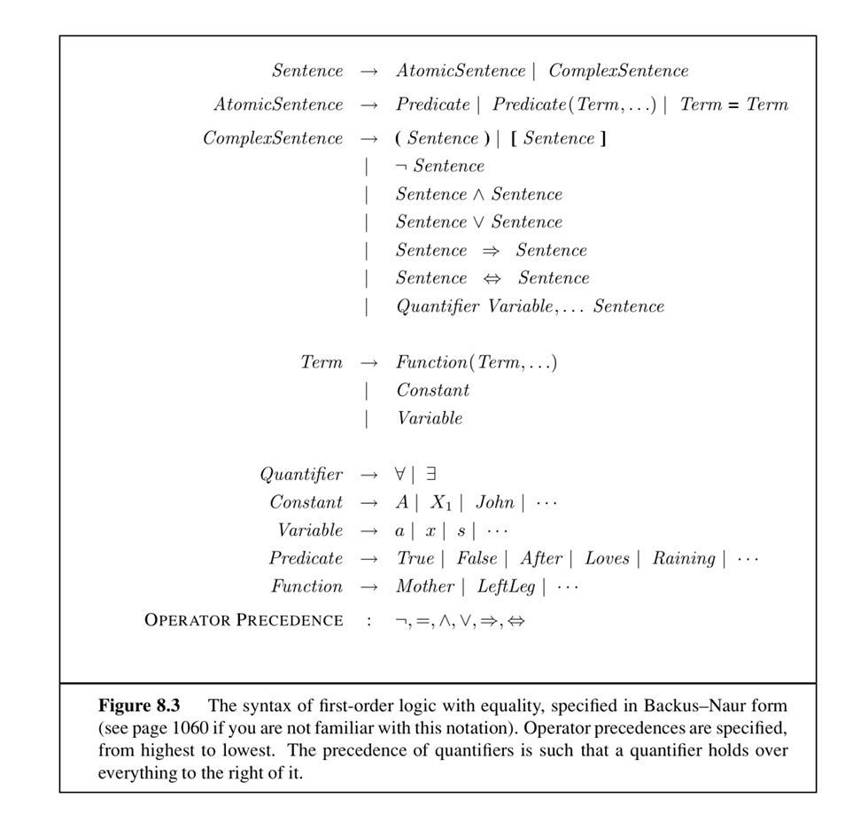
一阶逻辑中的项是指代对象的逻辑表达式。项的最简单形式是常量符号。然而，我们并不想为每一个可能的对象都定义不同的常量符号。例如，如果我们想指代约翰的左腿和理查德的左腿，我们可以使用像 Leftleg(John) 和 Leftleg(Richard) 这样的函数符号。函数符号只是命名对象的另一种方式，并非实际的函数。
一阶逻辑中的原子语句是对对象之间关系的描述，如果该关系成立，则原子语句为真。原子语句的一个例子是 Brother(John, Richard)，它由一个谓词符号后跟括号内的项列表组成。一阶逻辑的复合语句类似于命题逻辑中的复合语句，是由逻辑连接词连接的原子语句。
自然，我们希望有办法描述对象的整个集合。为此，我们使用量词。全称量词 ∀ 含义是“对于所有”，存在量词 ∃ 含义是“存在”。
例如，如果我们世界中的对象集合是所有辩论的集合，那么句子 ∀a, TwoSides(a) 可以翻译为“每个辩论都有两面性”。如果我们世界中的对象集合是人，那么句子 ∀x, ∃y, SoulMate(x, y) 将意味着“对于所有人，都存在某个人是他们的灵魂伴侣”。匿名的变量 a、x、y 是对象的占位符，可以用实际对象替换，例如，将 Laura 代入 x 到第二个例子中，会得到语句“存在某个人是 Laura 的灵魂伴侣”。
全称量词和存在量词分别是表达对所有对象的合取和析取的便捷方式。因此，它们也遵循德摩根定律（注意合取与析取之间的类比关系）：
¬∀x P(x) 等价于 ∃x ¬P(x)
¬∃x P(x) 等价于 ∀x ¬P(x)
最后，我们使用等词符号来表示两个符号指代同一个对象。例如，令人难以置信的句子 (Wife(Einstein) = FirstCousin(Einstein) ∧ Wife(Einstein) = SecondCousin(Einstein)) 居然是真的！
在命题逻辑中，模型是对所有命题符号的真值赋值；而在一阶逻辑中，模型则是将所有常量符号映射到对象，谓词符号映射到对象间的关系，函数符号映射到对象上的函数。如果一个句子描述的关系在映射下成立，那么该句子在该模型下为真。命题逻辑系统的模型数量总是有限的，而如果对象的数量不受约束，一阶逻辑系统的模型数量可能是无限的。
这两种逻辑方言使我们能够以不同的方式描述和思考世界。使用命题逻辑，我们将世界建模为一组真或假的符号。在这种假设下，我们可以将一个可能的世界表示为一个向量，每个符号对应一个 1 或 0。这种对世界的二元观点被称为因子化表示。使用一阶逻辑，我们的世界由相互关联的对象组成。这第二种面向对象的观点被称为结构化表示，它在许多方面更具表达力，并且与我们自然用来谈论世界的语言更加接近。
### 2. First Order Logical Inference
使用一阶逻辑，我们以完全相同的方式 formulate 推理问题。我们想知道 KB ⊧ q 是否成立，即在所有使 KB 为真的模型下，q 是否也为真。一种求解方法是命题化，即将问题转化为命题逻辑，以便使用我们已经掌握的技术来解决。每个全称（存在）量词句子都可以转换为句子的合取（析取），其中对于可以代入变量的每个可能对象都有一个子句。然后，我们可以使用 SAT 求解器，如 DPLL 或 Walk-SAT，来检查 (KB ∧ ¬q) 的（不）可满足性。
这种方法的一个问题是，我们可以进行的代入是无限的，因为对符号应用函数的次数没有限制。例如，我们可以根据需要多次嵌套函数 Classmate(...Classmate(Classmate(Austen))...)，直到引用到整个学校。幸运的是，Jacques Herbrand (1930) 证明的一个定理告诉我们，如果一个句子被知识库蕴涵，那么存在一个仅涉及命题化知识库的有限子集的证明。因此，我们可以尝试遍历有限子集，具体来说，通过嵌套函数应用的迭代加深进行搜索，即首先搜索带有常量符号的代入，然后搜索带有 Classmate(Austen) 的代入，然后搜索带有 Classmate(Classmate(Austen)) 的代入，依此类推。
另一种方法是直接使用一阶逻辑进行推理，也称为提升推理。例如，给定 (∀x HasAbsolutePower(x) ∧ Person(x) ⇒ Corrupt(x)) ∧ Person(John) ∧ HasAbsolutePower(John)（“权力导致绝对腐败”）。我们可以通过将 x 代入为 John 来推断 Corrupt(John)。这条规则被称为广义假言推理。一阶逻辑的前向链接算法反复应用广义假言推理和代入，以推断出 q 或证明它无法被推断。
### 3. Logical Agents
既然我们理解了如何 formulate 我们所知道的知识以及如何用它进行推理，我们将讨论如何将演绎的能力融入到我们的智能体中。智能体应该具备的一个明显能力是，根据观察历史和对世界的了解，推断出自己当前所处的状态（状态估计）。例如，如果我们告诉智能体，空气在熔岩坑附近开始闪烁，并且它观察到正前方的空气在闪烁，那么它就可以推断出危险就在附近。
为了将过去的观察整合到对其当前位置的估计中，智能体需要有时间的概念和状态之间的转移。我们称随时间变化的状态属性为fluents，并用带时间索引的 fluent 来表示，例如 Hot_t 表示时间 t 空气是热的。空气在时间 t 应该是热的，如果某个动作在那个时间导致空气变热，或者空气在前一个时间是热的并且没有发生任何动作改变它。为了表示这个事实，我们可以使用下面的一般形式的后继状态公理：
$$F_{t+1} ⇔ ActionCausesF_t ∨ (F_t ∧ ¬ActionCausesNotF_t)$$
在我们的世界中，转移可以 formulate 为 $Hot_{t+1} ⇔ StepCloseToLava_t ∨ (Hot_t ∧ ¬StepAwayFromLava_t)$。
在用逻辑写出世界的规则之后，我们现在实际上可以通过检查某个逻辑命题的可满足性来进行规划！为此，我们构造一个句子，其中包含关于初始状态、转移（后继状态公理）以及目标的信息（例如，$InOasis_T ∧ Alive_T$ 编码了在时间 T 存活并到达绿洲的目标）。如果世界规则被正确地 formulate 了，那么为所有变量找到一个可满足的赋值将使我们能够提取出将智能体带到目标的一系列动作。
### 4. Summary
在本笔记中，我们介绍了逻辑的概念，基于知识的智能体可以使用逻辑来推理世界并做出决策。我们介绍了逻辑的语言、其语法以及标准的逻辑等价关系。命题逻辑是一种简单的语言，基于命题符号和逻辑连接词。一阶逻辑是一种比命题逻辑更强大的表示语言。一阶逻辑的语法建立在命题逻辑语法的基础上，使用项来表示对象，并使用全称量词和存在量词来进行断言。
我们进一步描述了用于检查命题逻辑可满足性（SAT 问题）的 DPLL 算法。它是对可能模型的深度优先枚举，使用提前终止、纯符号启发式和单元子句启发式来提高性能。当我们的知识库仅由命题逻辑中的文字和蕴含式组成时，前向链接算法可用于推理。
一阶逻辑中的推理可以通过直接使用像广义假言推理这样的规则来完成，或者通过命题化，将问题转化为命题逻辑，然后使用 SAT 求解器得出结论。
___
[返回目录](#目录)
___
## Note 10: Introduction to Probability<a id = "note10"></a>
### 1. Probability Rundown
我们假设您已经在 CS70 课程中学习了概率论的基础知识，因此本笔记将假定您对概率论中的标准概念有基本的理解，例如概率密度函数、条件概率、独立性和条件独立性。在此，我们简要总结一下我们将使用的概率规则。
一个随机变量代表一个结果未知的事件。一个概率分布是对结果赋予权重的分配。概率分布必须满足以下条件：
$$
0 \leq P(\omega) \leq 1
$$
$$
\sum_{\omega} P(\omega) = 1
$$
例如，如果 A 是一个二元变量（只能取两个值），那么对于某个 \( p \in [0,1] \)，有 \( P(A = 0) = p \) 和 \( P(A = 1) = 1-p \)。
我们将使用这样的约定：大写字母表示随机变量，小写字母表示该随机变量的某个具体结果。
我们使用符号 \( P(A,B,C) \) 来表示变量 A、B、C 的联合分布。在联合分布中，顺序无关紧要，即 \( P(A,B,C) = P(C,B,A) \)。
我们可以使用链式法则（有时也称为乘积法则）来展开联合分布。
$$
P(A,B) = P(A|B)P(B) = P(B|A)P(A)
$$
$$
P(A_1, A_2...A_k) = P(A_1)P(A_2|A_1)...P(A_k|A_1...A_{k-1})
$$
可以通过求和变量 C 可能取的所有值来得到 A、B 的边缘分布：\( P(A,B) = \sum_{c} P(A,B,C = c) \)。A 的边缘分布也可以得到：\( P(A) = \sum_{b} \sum_{c} P(A,B=b,C=c) \)。我们有时也将边缘化的过程称为“求和消元”。
当我们对概率分布进行运算时，有时会得到不一定总和为 1 的分布。为了解决这个问题，我们进行归一化：计算分布中所有项的总和，并将每一项除以该总和。
条件概率是在已知某些事实的条件下，给事件分配概率。例如，\( P(A|B = b) \) 给出了在已知 B 的值等于 b 的条件下，A 的概率分布。条件概率定义为：
$$
P(A|B) = \frac{P(A,B)}{P(B)}.
$$
结合上述条件概率的定义和链式法则，我们得到贝叶斯规则：
$$
P(A|B) = \frac{P(B|A)P(A)}{P(B)}
$$
为了表示随机变量 A 和 B 是相互独立的，我们写作 \( A \perp\!\!\!\perp B \)。这等价于 \( B \perp\!\!\!\perp A \)。
当 A 和 B 相互独立时，\( P(A,B) = P(A)P(B) \)。您可以将其想象为两次独立的抛硬币。在其他课程中，您可能将相互独立性简称为“独立性”。我们可以从上述等式和链式法则推导出 \( P(A|B) = P(A) \) 和 \( P(B|A) = P(B) \)。
为了表示随机变量 A 和 B 在给定另一个随机变量 C 时是条件独立的，我们写作 \( A \perp\!\!\!\perp B | C \)。这也等价于 \( B \perp\!\!\!\perp A | C \)。
如果 A 和 B 在给定 C 时是条件独立的，那么 \( P(A,B|C) = P(A|C)P(B|C) \)。这意味着如果我们知道 C 的值，那么 B 和 A 互不影响。与上述条件独立的定义等价的关系有 \( P(A|B,C) = P(A|C) \) 和 \( P(B|A,C) = P(B|C) \)。请注意，这三个等式与相互独立的三个等式是如何对应的，只是在每个等式中都附加了对 C 的条件！
### 2. Probabilistic Inference
在人工智能中，我们经常希望对各种非确定性事件之间的关系进行建模。如果天气预报说有 40% 的几率下雨，我应该带伞吗？如果我买的冰淇淋勺数越多，就越可能把冰淇淋掉在地上，那我应该买几勺？如果 15 分钟前在我去甲骨文体育馆看勇士队比赛的高速公路上发生了一起事故，我是现在出发还是 30 分钟后出发？所有这些问题（以及更多问题）都可以通过概率推理来回答。
在本课程的前几部分，我们将世界建模为处于一个总是已知的特定状态。在接下来的几周里，我们将转而使用一种新模型，其中世界的每个可能状态都有其自身的概率。例如，我们可以建立一个天气模型，其中的状态由季节、温度和天气组成。我们的模型可能表明 \( P(winter, 35^\circ, cloudy) = 0.023 \)。这个数字表示当前是冬天、气温 35°F、多云这一特定结果的概率。
更精确地说，我们的模型是一个联合分布，即一个概率表，它捕获了每个可能结果（也称为变量的一个赋值）的可能性。作为例子，考虑下表：
| 季节   | 温度 | 天气 | 概率 |
| :----- | :--- | :--- | :--- |
| 夏季   | 热   | 晴   | 0.30 |
| 夏季   | 热   | 雨   | 0.05 |
| 夏季   | 冷   | 晴   | 0.10 |
| 夏季   | 冷   | 雨   | 0.05 |
| 冬季   | 热   | 晴   | 0.10 |
| 冬季   | 热   | 雨   | 0.05 |
| 冬季   | 冷   | 晴   | 0.15 |
| 冬季   | 冷   | 雨   | 0.20 |

这个模型使我们能够回答我们可能感兴趣的问题，例如：
- 天晴的概率是多少？\( P(W = sun) \)
- 已知是冬季，天气的概率分布是什么？\( P(W | S = winter) \)
- 已知下雨且寒冷，是冬季的概率是多少？\( P(S = winter | T = cold, W = rain) \)
- 已知天气寒冷，天气和季节的联合概率分布是什么？\( P(S, W | T = cold) \)
### 3. Inference By Enumeration
给定一个联合概率密度函数，我们可以使用一个简单直观的过程，称为枚举推理，轻松地计算任何期望的概率分布 \( P(Q_1...Q_m | e_1...e_n) \)。为此，我们定义将要处理的三种变量类型：
1. 查询变量 \( Q_i \)，它们是未知的，出现在所需概率分布中条件符号（|）的左侧。
2. 证据变量 \( e_i \)，它们是观测到的变量，其值已知，出现在所需概率分布中条件符号（|）的右侧。
3. 隐藏变量，它们存在于整个联合分布中，但不在目标分布中。

在枚举推理中，我们遵循以下算法：
1. 收集所有与观测到的证据变量一致的行。
2. 求和消去（边缘化）所有隐藏变量。
3. 归一化该表，使其成为一个概率分布（即各项之和为 1）。

例如，如果我们想使用上述联合分布计算 \( P(W | S = winter) \)，我们将选择 S 为 winter 的四行，然后对 T 求和消元并归一化。这将产生以下概率表：
| 天气 | 季节 | 未归一化和 | 概率 |
| :--- | :--- | :--- | :--- |
| 晴   | 冬季 | 0.10 + 0.15 = 0.25 | 0.25 / (0.25+0.25) = 0.5 |
| 雨   | 冬季 | 0.05 + 0.20 = 0.25 | 0.25 / (0.25+0.25) = 0.5 |

因此，\( P(W = sun | S = winter) = 0.5 \) 且 \( P(W = rain | S = winter) = 0.5 \)，我们得知在冬季，晴天的概率是 50%，雨天的概率是 50%。
只要我们拥有联合概率密度函数表，枚举推理就可以用来计算任何期望的概率分布，即使是对于多个查询变量 \( Q_1...Q_m \) 也是如此。
___
[返回目录](#目录)
___
## Note 11: Bayes Nets I<a id = "note11"></a>
### 1. Bayesian Network Representation
虽然枚举推理可以计算我们可能想要的任何查询的概率，但在计算机的内存中表示整个联合分布对于实际问题来说是不可行的——如果我们希望表示的 n 个变量每个都可以取 d 个可能值（其定义域大小为 d），那么我们的联合分布表将有 \(d^n\) 个条目，这在变量数量上是指数级的，存储起来非常不切实际！
贝叶斯网络通过利用条件概率的思想来避免这个问题。概率不是存储在一个巨大的表格中，而是分布在许多较小的条件概率表中，以及一个捕捉变量之间关系的有向无环图。局部概率表和 DAG 一起编码了足够的信息，可以计算我们给定整个大型联合分布时所能计算出的任何概率分布。我们将在下一节中看到这是如何工作的。
我们正式定义一个贝叶斯网络由以下部分组成：
- 一个节点的有向无环图，每个变量 X 对应一个节点。
- 每个节点的条件分布 \( P(X|A_1...A_n) \)，其中 \(A_i\) 是 X 的第 i 个父节点，以条件概率表的形式存储。每个 CPT 有 \(n+2\) 列：一列用于每个 n 个父变量 \(A_1...A_n\) 的值，一列用于 X 的值，一列用于给定其父节点时 X 的条件概率。

贝叶斯网络图的结构编码了不同节点之间的条件独立关系。这些条件独立性使我们能够存储多个小表，而不是一个大表。
重要的是要记住，贝叶斯网络节点之间的边并不特别意味着这些节点之间存在因果关系，也不意味着变量之间一定相互依赖。它仅仅意味着节点之间可能存在某种关系。
作为贝叶斯网络的一个例子，考虑一个模型，其中有五个二元随机变量，描述如下：
- B：发生入室盗窃。
- A：警报响起。
- E：发生地震。
- J：约翰打电话。
- M：玛丽打电话。

假设如果发生入室盗窃或地震，警报可能会响起，并且如果玛丽和约翰听到警报，他们会打电话。我们可以用下图所示的图来表示这些依赖关系。
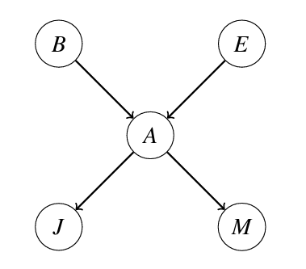
在这个贝叶斯网络中，我们将存储概率表 \(P(B)\)、\(P(E)\)、\(P(A|B,E)\)、\(P(J|A)\) 和 \(P(M|A)\)。
给定一个图的所有 CPT，我们可以使用以下规则计算给定赋值的概率：
\[
P(X_1, X_2, ..., X_n) = \prod_{i=1}^{n} P(X_i | parents(X_i))
\]
对于上面的警报模型，我们实际上可以按如下方式计算联合概率的概率：
\(P(\neg b, \neg e, +a, +j, \neg m) = P(\neg b) \cdot P(\neg e) \cdot P(+a | \neg b, \neg e) \cdot P(+j | +a) \cdot P(\neg m | +a)\)。
我们将在下一节看到这个关系是如何成立的。
作为现实检验，重要的是要内化贝叶斯网络只是一种模型。模型试图捕捉世界运作的方式，但由于它们总是一种简化，所以它们总是不完美的。然而，通过良好的建模选择，它们仍然可以是足够好的近似，从而有助于解决现实世界中的实际问题。
通常，一个好的模型可能不会解释每一个变量，甚至不会解释变量之间的每一个相互作用。但是，通过在图的结构中做出建模假设，我们可以产生极其高效的推理技术，这些技术通常比像枚举推理这样简单的方法在实践中更有用。
### 2. Structure of Bayes Nets
在本课程中，我们将提到两个关于贝叶斯网络独立性的规则，这些规则可以通过查看贝叶斯网络的图形结构来推断：
- 给定某个节点的所有父节点，该节点在图中条件独立于其所有祖先节点（非后代节点）。
- 给定某个节点的马尔可夫毯，该节点条件独立于所有其他变量。一个变量的马尔可夫毯由其父节点、子节点以及子节点的其他父节点组成。
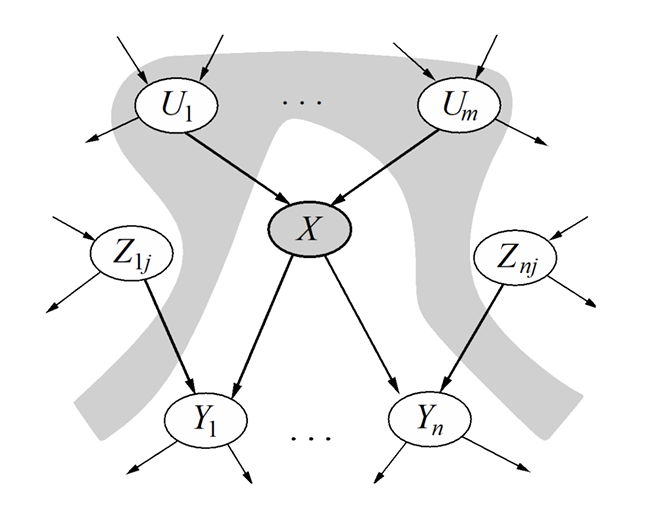
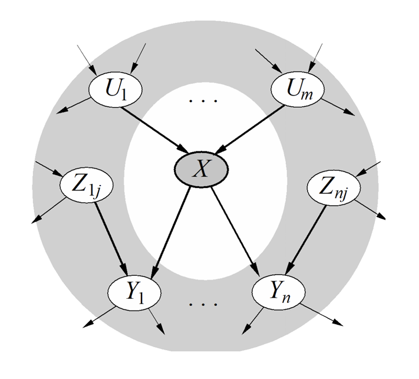
使用这些工具，我们可以回到前一节的断言：我们可以通过组合贝叶斯网络的 CPT 来获得所有变量的联合分布。
\[
P(X_1, X_2, ..., X_n) = \prod_{i=1}^{n} P(X_i | parents(X_i))
\]
联合分布与贝叶斯网络的 CPT 之间的这种关系之所以成立，是因为图所给出的条件独立性关系。我们将用一个例子来证明这一点。
让我们重新审视前面的例子。我们有 CPT \(P(B)\)、\(P(E)\)、\(P(A|B,E)\)、\(P(J|A)\) 和 \(P(M|A)\)，以及下面的图：
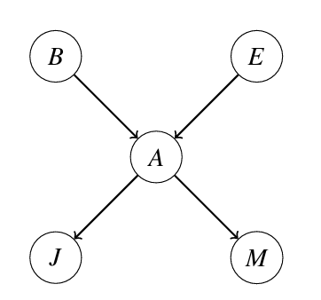
对于这个贝叶斯网络，我们试图证明以下关系：
\[
P(B, E, A, J, M) = P(B) P(E) P(A|B, E) P(J|A) P(M|A) \quad (1)
\]
我们可以用另一种方式展开联合分布：使用链式法则。如果我们按照拓扑顺序（父节点在子节点之前）展开联合分布，我们得到以下方程：
\[
P(B, E, A, J, M) = P(B) P(E|B) P(A|B, E) P(J|B, E, A) P(M|B, E, A, J) \quad (2)
\]
注意，在方程 (1) 中，每个变量都在一个 CPT \(P(var|Parents(var))\) 中表示，而在方程 (2) 中，每个变量都在一个 CPT \(P(var|Parents(var), Ancestors(var))\) 中表示。
我们依赖上述第一条条件独立性关系：给定某个节点的所有父节点，该节点在图中条件独立于其所有祖先节点。
因此，在贝叶斯网络中，\(P(var|Parents(var), Ancestors(var)) = P(var|Parents(var))\)，所以方程 (1) 和方程 (2) 是相等的。贝叶斯网络中的条件独立性允许多个较小的条件概率表来表示整个联合概率分布。
___
[返回目录](#目录)
___
## Note 12: Bayes Nets II<a id = "note12"></a>
### 1. Exact Inference in Bayes Nets
推理问题是指寻找某个概率分布 \( P(Q_1...Q_k | e_1...e_k) \) 的值，如本笔记开头的“概率推理”部分所述。给定一个贝叶斯网络，我们可以通过形成联合概率密度函数并使用枚举推理来朴素地解决这个问题。但这需要创建并迭代一个指数级大小的表。
### 2. Variable Elimination
另一种方法是逐个消除隐藏变量。要消除一个变量 X，我们需要：
1. 联结（相乘）所有涉及 X 的因子。
2. 求和消去 X。

一个因子简单定义为一个未归一化的概率。在变量消除过程中的所有时刻，每个因子都与它对应的概率成比例，但每个因子背后的分布不一定像概率分布那样总和为 1。变量消除的伪代码如下：
```
function ELIMINATION-ASK(X, e, bn) returns a distribution over X
    inputs: X, the query variable
            e, observed values for variables E
            bn, a Bayesian network specifying joint distribution P(X1, …, Xn)

    factors ← []
    for each var in ORDER(bn.VARS) do
        factors ← [MAKE-FACTOR(var, e) | factors]
        if var is a hidden variable then
            factors ← SUM-OUT(var, factors)
    return NORMALIZE(POINTWISE-PRODUCT(factors))
```
让我们用一个例子来使这些概念更具体。假设我们有一个如下所示的模型，其中 T、C、S 和 E 可以取二元值，如下所示。这里，T 代表冒险者拿走宝藏的概率，C 代表在冒险者拿走宝藏的情况下笼子掉下来的概率，S 代表如果冒险者拿走宝藏会释放蛇的概率，E 代表在已知笼子和蛇状态的情况下冒险者逃脱的概率。
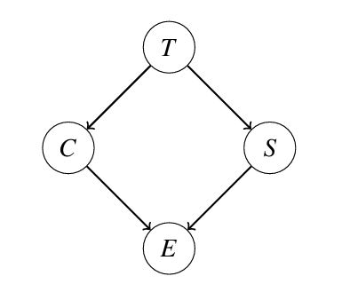
在这种情况下，我们有以下因子：\( P(T) \)、\( P(C|T) \)、\( P(S|T) \) 和 \( P(E|C,S) \)。假设我们要计算 \( P(T|+e) \)。枚举推理的方法是形成 16 行的联合概率密度函数 \( P(T, C, S, E) \)，只选择对应于 \( +e \) 的行，然后对 C 和 S 求和消去，最后归一化。
另一种方法是先消除 C，再消除 S，一次一个变量。我们将按如下步骤进行：
- 联结所有涉及 C 的因子，形成 \( f_1(C, +e, T, S) = P(C|T) \cdot P(+e|C,S) \)。有时这被写作 \( P(C, +e|T,S) \)。
- 从这个新因子中求和消去 C，得到一个新因子 \( f_2(+e, T, S) \)，有时写作 \( P(+e|T,S) \)。
- 联结所有涉及 S 的因子，形成 \( f_3(+e, S, T) = P(S|T) \cdot f_2(+e, T, S) \)，有时写作 \( P(+e, S|T) \)。
- 求和消去 S，得到 \( f_4(+e, T) \)，有时写作 \( P(+e|T) \)。
- 联结剩余的因子，得到 \( f_5(+e, T) = f_4(+e, T) \cdot P(T) \)。

一旦我们有了 \( f_5(+e, T) \)，我们就可以通过归一化轻松计算 \( P(T|+e) \)。
当写一个联结产生的因子时，我们可以使用像 \( f_1(C, +e, T, S) \) 这样的因子表示法，它忽略条件杠，只提供包含在该因子中的变量列表。或者，我们可以写成 \( P(C, +e|T,S) \)，即使这不能保证是一个有效的概率分布（例如，行总和可能不为 1）。为了机械地推导这个表达式，请注意原始因子中条件杠左侧的所有变量（这里是 \( P(C|T) \) 中的 C 和 \( P(E|C,S) \) 中的 E）都保留在杠的左侧。然后，所有剩余的变量（这里是 T 和 S）都放在杠的右侧。
这种写因子的方法基于链式法则的重复应用。在上面的例子中，我们知道不能有一个变量同时出现在条件杠的两侧。而且，我们知道
\[
P(T, C, S, +e) = P(T)P(S|T)P(C|T)P(+e|C,S) = P(S,T)P(C|T)P(+e|C,S)
\]
因此
\[
P(C|T)P(+e|C,S) = \frac{P(T, C, S, +e)}{P(S, T)} = P(C, +e|T,S)
\]
虽然从概念的角度来看，变量消除过程更复杂，但生成的任何因子的最大大小只有 8 行，而不是像我们形成整个联合概率密度函数那样有 16 行。
看待这个问题的另一种方式是观察 \( P(T|+e) \) 的计算可以通过枚举推理如下完成：
\[
\alpha \sum_{s} \sum_{c} P(T)P(s|T)P(c|T)P(+e|c,s)
\]
或者通过变量消除如下完成：
\[
\alpha P(T) \sum_{s} P(s|T) \sum_{c} P(c|T)P(+e|c,s)
\]
我们可以看到这些方程是等价的，除了在变量消除中，我们将与求和无关的项移到了每个求和符号的外部！
关于变量消除的最后一点，重要的是要观察到，只有当我们能够将最大因子的大小限制在一个合理的值时，它才能比枚举推理有所改进。
___
[返回目录](#目录)
___
## Note 13: Bayes Nets III<a id = "note13"></a>
### 1. Approximate Inference in Bayes Nets: Sampling
概率推理的另一种方法是通过简单地计数样本来隐式计算查询的概率。这不会像 IBE 或变量消除那样产生精确解，但这种近似推理通常足够好，特别是在考虑到计算量大幅减少的情况下。
例如，假设我们要计算 \( P(+t|+e) \)。如果我们有一个神奇的机器可以从我们的分布中生成样本，我们可以收集所有 \( E = +e \) 的样本，然后计算这些样本中 \( T = +t \) 的比例。我们只需查看样本就能轻松计算任何我们想要的推理。让我们看看一些不同的生成样本的方法。
### 2. Prior Sampling
给定一个贝叶斯网络模型，我们可以很容易地编写一个模拟器。例如，考虑下面给出的仅有两个变量 T 和 C 的简化模型的条件概率表。
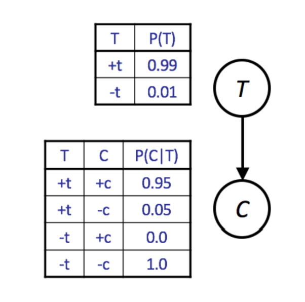
```python
import random

def get_t():
    if random.random() < 0.99:
        return True
    return False

def get_c(t):
    if t and random.random() < 0.95:
        return True
    return False

def get_sample():
    t = get_t()
    c = get_c(t)
    return [t, c]
```
我们称这种简单方法为先验采样。这种方法的缺点是为了分析不太可能发生的情景，可能需要生成大量的样本。如果我们想计算 \( P(C|\neg t) \)，我们将不得不丢弃 99% 的样本。
### 3. Rejection Sampling
缓解上述问题的一种方法是修改我们的过程，提前拒绝任何与证据不一致的样本。例如，对于查询 \( P(C|\neg t) \)，我们避免生成 C 的值，除非 t 为假。这仍然意味着我们必须丢弃大部分样本，但至少我们生成的坏样本所需时间更少。我们称这种方法为拒绝采样。
这两种方法有效的原因相同：任何有效样本出现的概率与联合概率密度函数中指定的概率相同。
### 4. Likelihood Weighting
一种更特殊的方法是似然加权，它确保我们永远不会生成坏样本。在这种方法中，我们手动将所有变量设置为等于我们查询中的证据。例如，如果我们想计算 \( P(C|\neg t) \)，我们只需声明 t 为假。这里的问题在于，这可能会产生与正确分布不一致的样本。
如果我们简单地强制一些变量等于证据，那么我们的样本出现的概率仅等于非证据变量的 CPT 的乘积。这意味着联合概率密度函数不能保证正确（尽管在某些情况下可能是正确的，比如我们的两个变量贝叶斯网络）。相反，如果我们采样了变量 \( Z_1 \) 到 \( Z_p \) 并固定了证据变量 \( E_1 \) 到 \( E_m \)，一个样本由概率 \( P(Z_1...Z_p, E_1...E_m) = \prod_{i=1}^p P(Z_i|Parents(Z_i)) \) 给出。缺少的是，样本的概率不包括所有 \( P(E_i|Parents(E_i)) \) 的概率，即并非每个 CPT 都参与。
似然加权通过为每个样本使用一个权重来解决这个问题，该权重是给定采样变量的情况下证据变量的概率。也就是说，我们可以为样本 j 定义一个权重 \( w_j \)，反映在给定采样值的情况下观察到的证据变量值的可能性，而不是同等计数所有样本。通过这种方式，我们确保每个 CPT 都参与。为此，我们遍历贝叶斯网络中的每个变量（就像我们进行常规采样一样），如果变量不是证据变量，则对其进行采样；如果变量是证据变量，则更改该样本的权重。
例如，假设我们要计算 \( P(T|+c, +e) \)。对于第 j 个样本，我们将执行以下算法：
- 将 \( w_j \) 设置为 1.0，并将 c = true，e = true。
- 对于 T：这不是证据变量，所以我们从 \( P(T) \) 中采样 \( t_j \)。
- 对于 C：这是证据变量，所以我们将样本的权重乘以 \( P(+c|t_j) \)，即 \( w_j = w_j \cdot P(+c|t_j) \)。
- 对于 S：从 \( P(S|t_j) \) 中采样 \( s_j \)。
- 对于 E：将样本的权重乘以 \( P(+e|+c, s_j) \)，即 \( w_j = w_j \cdot P(+e|+c, s_j) \)。

然后当我们执行常规计数过程时，我们用 \( w_j \) 而不是 1 来加权样本 j，其中 \( 0 \le w_j \le 1 \)。这种方法有效是因为在最终的概率计算中，权重有效地替代了缺失的 CPT。实际上，我们确保每个样本的加权概率由下式给出：
\[
P(z_1...z_p, e_1...e_m) = \prod_{i=1}^p P(z_i|Parents(z_i)) \cdot \left[ \prod_{i=1}^m P(e_i|Parents(e_i)) \right]
\]
下面提供了似然加权的伪代码。
```
function LIKELIHOOD-WEIGHTING(X, e, bn, N) returns an estimate of P(X | e)
    inputs: X, the query variable
            e, observed values for variables E
            bn, a Bayesian network
            N, the total number of samples to be generated
    local variables: W, a vector of weighted counts for each value of X, initially zero

    for j = 1 to N do
        x, w ← WEIGHTED-SAMPLE(bn, e)
        W[x] ← W[x] + w   // x 是样本中查询变量 X 的取值
    return Normalize(W)

function WEIGHTED-SAMPLE(bn, e) returns an event and a weight
    w ← 1
    x ← an event with n elements initialized from e   // 先将证据变量的值填入事件
    foreach variable Xi in X1,...,Xn do
        if Xi is an evidence variable with value xi in e
            then w ← w × P(Xi = xi | parents(Xi))     // 证据变量：更新权重，不采样
            else x[i] ← a random sample from P(Xi | parents(Xi))  // 非证据变量：采样
    return x, w
```
对于我们的三种采样方法（先验采样、拒绝采样和似然加权），我们可以通过生成更多样本来获得越来越高的精度。然而，在这三者中，似然加权计算效率最高，其原因超出了本课程的范围。
### 5. Gibbs Sampling
吉布斯采样是第四种采样方法。在这种方法中，我们首先将所有变量设置为某个完全随机的值（不考虑任何 CPT）。然后，我们反复每次挑选一个变量，清除其值，并根据当前分配给所有其他变量的值重新采样。
对于上面的 T、C、S、E 示例，我们可能分配 t = true、c = true、s = false 和 e = true。然后我们挑选四个变量中的一个重新采样，比如 S，并清除它。然后我们从分布 \( P(S|+t, +c, +e) \) 中挑选一个新值。这需要我们了解这个条件分布。事实证明，给定所有其他变量，我们可以轻松计算任何单个变量的分布。更具体地说，\( P(S|T, C, E) \) 可以仅使用将 S 与其邻居连接的 CPT 来计算。因此，在一个典型的贝叶斯网络中，大多数变量只有少数邻居，我们可以在线性时间内为每个变量预计算给定其所有邻居的条件分布。
我们不会证明这一点，但如果我们重复这个过程足够多次，即使我们从低概率的赋值开始，我们后面的样本最终也会收敛到正确的分布。如果你好奇，有一些超出本课程范围的注意事项，你可以在吉布斯采样的维基百科文章的“故障模式”部分阅读到。
下面提供了吉布斯采样的伪代码。
```
function GIBBS-ASK(X, e, bn, N) returns an estimate of P(X|e)
    local variables: N, a vector of counts for each value of X, initially zero
        Z, the nonevidence variables in bn
        x, the current state of the network, initially copied from e

    initialize x with random values for the variables in Z
    for j = 1 to N do
        for each Zi in Z do
            set the value of Zi in x by sampling from P(Zi|mb(Zi))
            N[x] <- N[x] + 1 where x is the value of X in x
    return NORMALIZE(N)
```
### 6. Summary
总结一下，贝叶斯网络是联合概率分布的一种强大表示。它的拓扑结构编码了独立性和条件独立性关系，我们可以用它来建模任意分布以执行推理和采样。
在本笔记中，我们介绍了两种概率推理方法：精确推理和概率推理（采样）。在精确推理中，我们保证得到精确正确的概率，但计算量可能过大。
涵盖的精确推理算法有：
- 枚举推理
- 变量消除

我们可以转向采样来近似解，同时使用更少的计算。
涵盖的采样算法有：
- 先验采样
- 拒绝采样
- 似然加权
- 吉布斯采样
___
[返回目录](#目录)
___
## Note 14: HMMs I<a id = "note14"></a>
### 1. Markov Models
在之前的笔记中，我们讨论了贝叶斯网络，以及它们如何成为简洁表示随机变量之间关系的优秀结构。我们现在将介绍一个本质上与之密切相关的结构，称为马尔可夫模型，在本课程中，可以将其视为类似于链式的、无限长的贝叶斯网络。本节我们将使用的示例是天气模式的日常波动。我们的天气模型将是时间相关的（马尔可夫模型通常都是如此），这意味着我们将为每一天的天气设置一个单独的随机变量。如果我们将 \(W_i\) 定义为表示第 i 天天气的随机变量，那么我们的天气示例的马尔可夫模型将如下所示：
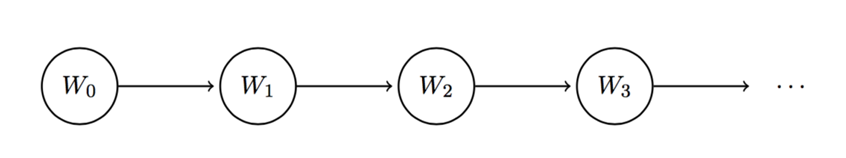
关于马尔可夫模型中涉及的随机变量，我们应该存储哪些信息？为了追踪我们考虑的量（在此例中是天气）随时间的变化，我们需要知道它在时间 t = 0 时的初始分布，以及某种转移模型，该模型描述了在各个时间步之间从一个状态转移到另一个状态的概率。马尔可夫模型的初始分布由 \(P(W_0)\) 给出的概率表列举，而从状态 i 转移到 i+1 的转移模型由 \(P(W_{i+1}|W_i)\) 给出。请注意，这个转移模型意味着 \(W_{i+1}\) 的值仅条件依赖于 \(W_i\) 的值。换句话说，时间 t = i+1 的天气满足马尔可夫性质或无记忆性质，并且除了 t = i 之外，与其他所有时间步的天气无关。
使用我们的天气马尔可夫模型，如果我们想用链式法则重建 \(W_0\)、\(W_1\) 和 \(W_2\) 的联合分布，我们会想要：
\[
P(W_0, W_1, W_2) = P(W_0)P(W_1|W_0)P(W_2|W_1, W_0)
\]
然而，根据我们假设的马尔可夫性质成立，即 \(W_0 \perp\!\!\!\perp W_2 | W_1\)，联合分布简化为：
\[
P(W_0, W_1, W_2) = P(W_0)P(W_1|W_0)P(W_2|W_1)
\]
并且我们拥有从马尔可夫模型计算此值所需的一切。更一般地说，马尔可夫模型在每个时间步都做出以下独立性假设：\(W_{i+1} \perp\!\!\!\perp \{W_0, ..., W_{i-1}\} | W_i\)。这使得我们可以通过链式法则如下重建前 n+1 个变量的联合分布：
\[
P(W_0, W_1, ..., W_n) = P(W_0)P(W_1|W_0)P(W_2|W_1)...P(W_n|W_{n-1}) = P(W_0) \prod_{i=0}^{n-1} P(W_{i+1}|W_i)
\]
马尔可夫模型中通常做的最后一个假设是转移模型是平稳的。换句话说，对于所有 i 的值（所有时间步），\(P(W_{i+1}|W_i)\) 都是相同的。这允许我们仅用两个表来表示马尔可夫模型：一个用于 \(P(W_0)\)，一个用于 \(P(W_{i+1}|W_i)\)。
### 2. The Mini-Forward Algorithm
我们现在知道如何计算马尔可夫模型跨时间步的联合分布。然而，这并没有直接帮助我们回答关于某个给定日子 t 的天气分布的问题。自然地，我们可以计算联合分布，然后对所有其他变量进行边缘化（求和消去），但这通常效率极低，因为如果我们有 j 个变量，每个变量可以取 d 个值，联合分布的大小是 \(O(d^j)\)。相反，我们将介绍一种更有效的技术，称为迷你前向算法。
它的工作原理如下。根据边缘化的性质，我们知道：
\[
P(W_{i+1}) = \sum_{w_i} P(w_i, W_{i+1})
\]
根据链式法则，我们可以将其重新表达如下：
\[
P(W_{i+1}) = \sum_{w_i} P(W_{i+1}|w_i)P(w_i)
\]
这个方程应该有一些直观意义——要计算时间步 i+1 的天气分布，我们查看由 \(P(W_i)\) 给出的时间步 i 的概率分布，并用我们的转移模型 \(P(W_{i+1}|W_i)\) 将这个模型“推进”一个时间步。有了这个方程，我们可以从初始分布 \(P(W_0)\) 开始，用它来计算 \(P(W_1)\)，然后用 \(P(W_1)\) 来计算 \(P(W_2)\)，依此类推，迭代地计算我们选择的任何时间步的天气分布。让我们通过一个示例来逐步了解，使用以下初始分布和转移模型：
| \(W_0\) | \(P(W_0)\) |
| :------ | :--------- |
| sun     | 0.8        |
| rain    | 0.2        |

| \(W_i\) | \(W_{i+1}\) | \(P(W_{i+1}\|W_i)\) |
| :------ | :---------- | :----------------- |
| sun     | sun         | 0.6                |
| sun     | rain        | 0.4                |
| rain    | sun         | 0.1                |
| rain    | rain        | 0.9                |

使用迷你前向算法，我们可以如下计算 \(P(W_1)\)：
\[
\begin{aligned}
P(W_1 = \text{sun}) &= \sum_{w_0} P(W_1 = \text{sun}|w_0)P(w_0) \\
&= P(W_1=\text{sun}|W_0 = \text{sun})P(W_0 = \text{sun}) + P(W_1 = \text{sun}|W_0 = \text{rain})P(W_0 = \text{rain}) \\
&= 0.6 \cdot 0.8 + 0.1 \cdot 0.2 = 0.5 \\
P(W_1 = \text{rain}) &= \sum_{w_0} P(W_1 = \text{rain}|w_0)P(w_0) \\
&= P(W_1=\text{rain}|W_0 = \text{sun})P(W_0 = \text{sun}) + P(W_1 = \text{rain}|W_0 = \text{rain})P(W_0 = \text{rain}) \\
&= 0.4 \cdot 0.8 + 0.9 \cdot 0.2 = 0.5
\end{aligned}
\]
因此，\(P(W_1)\) 的分布为：
| \(W_1\) | \(P(W_1)\) |
| :------ | :--------- |
| sun     | 0.5        |
| rain    | 0.5        |

值得注意的是，天晴的概率从时间 t=0 的 80% 下降到时间 t=1 的仅 50%。这是我们转移模型的直接结果，该模型倾向于转移到雨天而不是晴天。这引出了一个自然的问题：在给定的时间步，处于某个状态的概率是否会收敛？我们将在下一节中回答这个问题。
### 3. Stationary Distribution
为了解决上述问题，我们必须计算天气的平稳分布。顾名思义，平稳分布是随时间推移保持不变的分布，即：
\[
P(W_{t+1}) = P(W_t)
\]
我们可以通过将上述等价性与迷你前向算法使用的相同方程结合起来，计算这些处于给定状态的收敛概率：
\[
P(W_{t+1}) = P(W_t) = \sum_{w_t} P(W_{t+1}|w_t)P(w_t)
\]
对于我们的天气示例，这给出了以下两个方程：
\[
\begin{aligned}
P(W_t = \text{sun}) &= P(W_{t+1} = \text{sun}|W_t = \text{sun})P(W_t = \text{sun}) + P(W_{t+1} = \text{sun}|W_t = \text{rain})P(W_t = \text{rain}) \\
&= 0.6 \cdot P(W_t = \text{sun}) + 0.1 \cdot P(W_t = \text{rain}) \\
P(W_t = \text{rain}) &= P(W_{t+1} = \text{rain}|W_t = \text{sun})P(W_t = \text{sun}) + P(W_{t+1} = \text{rain}|W_t = \text{rain})P(W_t = \text{rain}) \\
&= 0.4 \cdot P(W_t = \text{sun}) + 0.9 \cdot P(W_t = \text{rain})
\end{aligned}
\]
我们现在有了求解平稳分布所需的全部条件，这是一个包含 2 个未知数的 2 个方程的方程组！我们可以利用 \(P(W_t)\) 是一个概率分布因此总和必须为 1 这一事实来获得第三个方程：
\[
\begin{aligned}
P(W_t = \text{sun}) &= 0.6 \cdot P(W_t = \text{sun}) + 0.1 \cdot P(W_t = \text{rain}) \\
P(W_t = \text{rain}) &= 0.4 \cdot P(W_t = \text{sun}) + 0.9 \cdot P(W_t = \text{rain}) \\
1 &= P(W_t = \text{sun}) + P(W_t = \text{rain})
\end{aligned}
\]
解这个方程组得到 \(P(W_t = \text{sun}) = 0.2\) 和 \(P(W_t = \text{rain}) = 0.8\)。因此，我们的平稳分布表（此后我们将其记为 \(P(W_\infty)\)）如下：
| \(W_\infty\) | \(P(W_\infty)\) |
| :----------- | :-------------- |
| sun          | 0.2             |
| rain         | 0.8             |

为了验证这个结果，让我们将转移模型应用于平稳分布：
\[
\begin{aligned}
P(W_{\infty+1} = \text{sun}) &= P(W_{\infty+1} = \text{sun}|W_\infty = \text{sun})P(W_\infty = \text{sun})\\ 
&+ P(W_{\infty+1} = \text{sun}|W_\infty = \text{rain})P(W_\infty = \text{rain}) \\
&= 0.6 \cdot 0.2 + 0.1 \cdot 0.8 = 0.2 \\
P(W_{\infty+1} = \text{rain}) &= P(W_{\infty+1} = \text{rain}|W_\infty = \text{sun})P(W_\infty = \text{sun}) \\
&+ P(W_{\infty+1} = \text{rain}|W_\infty = \text{rain})P(W_\infty = \text{rain}) \\
&= 0.4 \cdot 0.2 + 0.9 \cdot 0.8 = 0.8
\end{aligned}
\]
正如预期的那样，\(P(W_{\infty+1}) = P(W_\infty)\)。通常，如果 \(W_t\) 的定义域大小为 k，那么等式
\(P(W_t) = \sum_{w_t} P(W_{t+1}|w_t)P(w_t)\)
产生一个包含 k 个方程的方程组，我们可以用它们来求解平稳分布。
___
[返回目录](#目录)
___
## Note 15: HMMs II<a id = "note15"></a>
### 1. Hidden Markov Models
通过马尔可夫模型，我们了解了如何通过随机变量链来纳入随时间的变化。例如，如果我们想用上述标准马尔可夫模型知道第10天的天气，我们可以从初始分布 \(P(W_0)\) 开始，使用迷你前向算法和我们的转移模型来计算 \(P(W_{10})\)。然而，在时间 t=0 和 t=10 之间，我们可能会收集到新的气象证据，这可能会影响我们在任何给定时间步对天气概率分布的信念。简单来说，如果天气预报预测第10天有80%的几率下雨，但第9天晚上却是晴空万里，那么80%的概率可能会大幅下降。这正是隐马尔可夫模型能够帮助我们解决的问题——它允许我们在每个时间步观察到一些可能影响每个状态信念分布的证据。我们天气模型的隐马尔可夫模型可以使用如下所示的贝叶斯网络结构来描述：
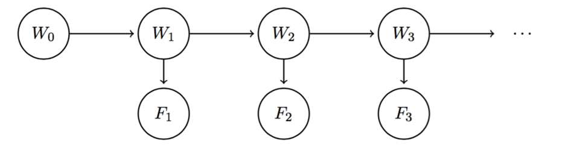
与普通马尔可夫模型不同，我们现在有两种不同类型的节点。为了区分，我们将每个 \(W_i\) 称为状态变量，将每个天气预报 \(F_i\) 称为证据变量。由于 \(W_i\) 编码了我们对第 i 天天气概率分布的信念，那么第 i 天的天气预报条件依赖于这个信念应该是一个自然的结果。该模型蕴含了与标准马尔可夫模型类似的条件独立性关系，并附带了一组关于证据变量的关系：
- \(F_1 \perp\!\!\!\perp W_0 | W_1\)
- 对于所有 \(i = 2, ..., n\): \(W_i \perp\!\!\!\perp \{W_0, ..., W_{i-2}, F_1, ..., F_{i-1}\} | W_{i-1}\)
- 对于所有 \(i = 2, ..., n\): \(F_i \perp\!\!\!\perp \{W_0, ..., W_{i-1}, F_1, ..., F_{i-1}\} | W_i\)

就像马尔可夫模型一样，隐马尔可夫模型假设转移模型 \(P(W_{i+1}|W_i)\) 是平稳的。隐马尔可夫模型还额外做了一个简化假设，即传感器模型 \(P(F_i|W_i)\) 也是平稳的。因此，任何隐马尔可夫模型都可以仅用三个概率表简洁地表示：初始分布、转移模型和传感器模型。
关于符号的最后一点，我们将定义在观察到截至当前的所有证据 \(F_1, ..., F_i\) 的情况下，时间 i 的信念分布：
\[
B(W_i) = P(W_i|f_1, ..., f_i)
\]
类似地，我们将 \(B'(W_i)\) 定义为在观察到证据 \(f_1, ..., f_{i-1}\) 的情况下，时间 i 的信念分布：
\[
B'(W_i) = P(W_i|f_1, ..., f_{i-1})
\]
将 \(e_i\) 定义为在时间步 i 观察到的证据，你有时可能会看到从时间步 \(1 \le i \le t\) 聚合的证据被重新表示为以下形式：
\[
e_{1:t} = e_1, ..., e_t
\]
在这种表示法下，\(P(W_i|f_1, ..., f_{i-1})\) 可以写成 \(P(W_i|f_{1:(i-1)})\)。这种表示法将在接下来的章节中变得重要，我们将在其中讨论时间流逝更新，这些更新迭代地将新证据纳入我们的天气模型。
### 2. The Forward Algorithm
使用上述条件概率假设和条件概率表的边缘化性质，我们可以推导出 \(B(W_i)\) 和 \(B'(W_{i+1})\) 之间的关系，其形式与迷你前向算法的更新规则相同。我们从使用边缘化开始：
\[
B'(W_{i+1}) = P(W_{i+1}|f_1, ..., f_i) = \sum_{w_i} P(W_{i+1}, w_i|f_1, ..., f_i)
\]
然后，这可以用链式法则重新表达如下：
\[
B'(W_{i+1}) = P(W_{i+1}|f_1, ..., f_i) = \sum_{w_i} P(W_{i+1}|w_i, f_1, ..., f_i) P(w_i|f_1, ..., f_i)
\]
注意到 \(P(w_i|f_1, ..., f_i)\) 就是 \(B(w_i)\)，并且 \(W_{i+1} \perp\!\!\!\perp \{f_1, ... f_i\} | W_i\)，这简化为我们从 \(B(W_i)\) 到 \(B'(W_{i+1})\) 的最终关系：
\[
B'(W_{i+1}) = \sum_{w_i} P(W_{i+1}|w_i) B(w_i)
\]
现在让我们考虑如何推导 \(B'(W_{i+1})\) 和 \(B(W_{i+1})\) 之间的关系。通过应用条件概率的定义（带有额外条件），我们可以看到：
\[
B(W_{i+1}) = P(W_{i+1}|f_1, ..., f_{i+1}) = \frac{P(W_{i+1}, f_{i+1}|f_1, ..., f_i)}{P(f_{i+1}|f_1, ..., f_i)}
\]
在处理条件概率时，一个常用的技巧是延迟归一化，直到我们需要归一化概率时才进行，我们现在将采用这个技巧。更具体地说，由于上述 \(B(W_{i+1})\) 展开式中的分母对于由 \(B(W_{i+1})\) 表示的概率表中的每一项都是共同的，我们可以省略实际除以 \(P(f_{i+1}|f_1, ..., f_i)\) 的步骤。相反，我们只需注意 \(B(W_{i+1})\) 正比于 \(P(W_{i+1}, f_{i+1}|f_1, ..., f_i)\)：
\[
B(W_{i+1}) \propto P(W_{i+1}, f_{i+1}|f_1, ..., f_i)
\]
其比例常数等于 \(P(f_{i+1}|f_1, ..., f_i)\)。每当我们决定要恢复信念分布 \(B(W_{i+1})\) 时，我们可以将每个计算值除以这个比例常数。现在，使用链式法则，我们可以观察到以下内容：
\[
B(W_{i+1}) \propto P(W_{i+1}, f_{i+1}|f_1, ..., f_i) = P(f_{i+1}|W_{i+1}, f_1, ..., f_i) P(W_{i+1}|f_1, ..., f_i)
\]
根据先前陈述的与隐马尔可夫模型相关的条件独立性假设，\(P(f_{i+1}|W_{i+1}, f_1, ..., f_i)\) 等价于简单的 \(P(f_{i+1}|W_{i+1})\)，并且根据定义 \(P(W_{i+1}|f_1, ..., f_i) = B'(W_{i+1})\)。这使得我们可以将 \(B'(W_{i+1})\) 和 \(B(W_{i+1})\) 之间的关系表达为其最终形式：
\[
B(W_{i+1}) \propto P(f_{i+1}|W_{i+1}) B'(W_{i+1})
\]
结合我们刚刚推导出的两个关系，产生了一个迭代算法，称为前向算法，它是之前迷你前向算法在隐马尔可夫模型中的对应物：
\[
B(W_{i+1}) \propto P(f_{i+1}|W_{i+1}) \sum_{w_i} P(W_{i+1}|w_i) B(w_i)
\]
前向算法可以被认为包含两个不同的步骤：时间流逝更新，对应于从 \(B(W_i)\) 确定 \(B'(W_{i+1})\)；以及观测更新，对应于从 \(B'(W_{i+1})\) 确定 \(B(W_{i+1})\)。因此，为了将我们的信念分布推进一个时间步（即从 \(B(W_i)\) 计算 \(B(W_{i+1})\)），我们必须首先通过时间流逝更新将模型的状态推进一个时间步，然后通过观测更新纳入该时间步的新证据。考虑以下初始分布、转移模型和传感器模型：
| \(W_0\) | \(B(W_0)\) |
| :------ | :--------- |
| sun     | 0.8        |
| rain    | 0.2        |

| \(W_i\) | \(W_{i+1}\) | \(P(W_{i+1}\|W_i)\) |
| :------ | :---------- | :----------------- |
| sun     | sun         | 0.6                |
| sun     | rain        | 0.4                |
| rain    | sun         | 0.1                |
| rain    | rain        | 0.9                |

| \(F_i\) | \(W_i\) | \(P(F_i\|W_i)\) |
| :------ | :------ | :-------------- |
| good    | sun     | 0.8             |
| bad     | sun     | 0.2             |
| good    | rain    | 0.3             |
| bad     | rain    | 0.7             |

为了计算 \(B(W_1)\)，我们首先执行时间更新以获得 \(B'(W_1)\)：
\[
\begin{aligned}
B'(W_1 = \text{sun}) &= \sum_{w_0} P(W_1 = \text{sun}|w_0) B(w_0) \\
&= P(W_1=\text{sun}|W_0 = \text{sun}) B(W_0 = \text{sun}) + P(W_1 = \text{sun}|W_0 = \text{rain}) B(W_0 = \text{rain}) \\
&= 0.6 \cdot 0.8 + 0.1 \cdot 0.2 = 0.5 \\
B'(W_1 = \text{rain}) &= \sum_{w_0} P(W_1 = \text{rain}|w_0) B(w_0) \\
&= P(W_1=\text{rain}|W_0 = \text{sun}) B(W_0 = \text{sun}) + P(W_1 = \text{rain}|W_0 = \text{rain}) B(W_0 = \text{rain}) \\
&= 0.4 \cdot 0.8 + 0.9 \cdot 0.2 = 0.5
\end{aligned}
\]
因此：
| \(W_1\) | \(B'(W_1)\) |
| :------ | :---------- |
| sun     | 0.5         |
| rain    | 0.5         |

接下来，我们假设第1天的天气预报是好的（即 \(F_1 = \text{good}\)），并执行观测更新以获得 \(B(W_1)\)：
\[
\begin{aligned}
B(W_1 = \text{sun}) &\propto P(F_1=\text{good}|W_1 = \text{sun}) B'(W_1 = \text{sun}) = 0.8 \cdot 0.5 = 0.4 \\
B(W_1 = \text{rain}) &\propto P(F_1 = \text{good}|W_1 = \text{rain}) B'(W_1 = \text{rain}) = 0.3 \cdot 0.5 = 0.15
\end{aligned}
\]
最后一步是归一化 \(B(W_1)\)，注意 \(B(W_1)\) 表中的条目总和为 \(0.4 + 0.15 = 0.55\)：
\[
\begin{aligned}
B(W_1 = \text{sun}) &= 0.4 / 0.55 = \frac{8}{11} \\
B(W_1 = \text{rain}) &= 0.15 / 0.55 = \frac{3}{11}
\end{aligned}
\]
因此，我们的 \(B(W_1)\) 最终表如下：
| \(W_1\) | \(B(W_1)\) |
| :------ | :--------- |
| sun     | 8/11       |
| rain    | 3/11       |

注意观察天气预报的结果。因为天气预报员预测了好天气，我们对天晴的信念从时间更新后的 \(\frac{1}{2}\) 增加到了观测更新后的 \(\frac{8}{11}\)。
作为结束语，上述讨论的归一化技巧实际上可以在使用隐马尔可夫模型时显著简化计算。如果我们从某个初始分布开始，并且对计算时间 t 的信念分布感兴趣，我们可以使用前向算法迭代地计算 \(B(W_1), ..., B(W_t)\)，并且只在最后通过将 \(B(W_t)\) 表中的每个条目除以条目总和来进行一次归一化。
### 3. Viterbi Algorithm
在前向算法中，我们使用递归来求解 \(P(X_N|e_{1:N})\)，即给定到目前为止观察到的证据变量，系统可能处于的状态的概率分布。与隐马尔可夫模型相关的另一个重要问题是：给定到目前为止观察到的证据变量，系统遵循的最可能隐藏状态序列是什么？换句话说，我们想要解出 \(\arg\max_{x_{1:N}} P(x_{1:N}|e_{1:N}) = \arg\max_{x_{1:N}} P(x_{1:N}, e_{1:N})\)。这个轨迹也可以使用动态规划通过维特比算法来求解。
该算法由两次遍历组成：第一次向前遍历，计算在给定迄今为止观察到的证据的情况下，到达每个（状态，时间）元组的最佳路径的概率。第二次向后遍历：首先找到位于概率最高路径上的终止状态，然后沿着通向该状态的路径向后回溯（该路径必定是最佳路径）。
为了可视化该算法，考虑以下状态网格图，一个随时间变化的状态和转移图：
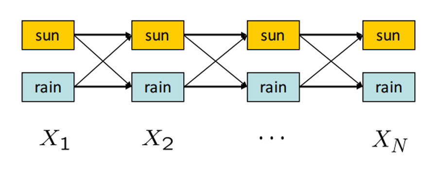
在这个具有两个可能隐藏状态（晴或雨）的HMM中，我们想要计算从 \(X_1\) 到 \(X_N\) 的最高概率路径（每个时间步的状态分配）。从 \(X_{t-1}\) 到 \(X_t\) 的边的权重等于 \(P(X_t|X_{t-1})P(E_t|X_t)\)，路径的概率通过将其边权重相乘来计算。权重公式中的第一项表示特定转移的可能性有多大，第二项表示观察到的证据与结果状态的匹配程度。
回想一下：
前向算法计算（直到归一化）：
\[
P(X_N, e_{1:N}) = \sum_{x_1, .., x_{N-1}} P(X_N, x_{1:N-1}, e_{1:N})
\]
其中
\[
P(x_{1:N}, e_{1:N}) = P(x_1)P(e_1|x_1) \prod_{t=2}^{N} P(x_t|x_{t-1})P(e_t|x_t)
\]
在维特比算法中，我们想要计算：
\[
\arg \max_{x_1, .., x_N} P(x_{1:N}, e_{1:N})
\]
以找到隐藏状态序列的最大似然估计。请注意，乘积中的每一项正是层 t-1 到层 t 之间边权重的表达式。因此，网格图上沿路径的权重乘积给出了给定证据下该路径的概率。
我们可以求解所有可能隐藏状态上的联合概率表，但这会导致指数级的空间成本。有了这样一个表，我们可以使用动态规划在多时间多项式内计算最佳路径。然而，由于我们可以使用动态规划来计算最佳路径，我们在任何给定时间都不一定需要整个表。
定义 \(m_t[x_t] = \max_{x_{1:t-1}} P(x_{1:t}, e_{1:t})\)，或者说，从任何 \(x_0\) 开始，到目前为止看到证据，到达时间 t 的给定 \(x_t\) 的路径的最大概率。这与从步骤1到t通过网格图的最高权重路径相同。还要注意：
\[
\begin{aligned}
m_t[x_t] &= \max_{x_{1:t-1}} P(e_t|x_t) P(x_t|x_{t-1}) P(x_{1:t-1}, e_{1:t-1}) \\
&= P(e_t|x_t) \max_{x_{t-1}} P(x_t|x_{t-1}) \max_{x_{1:t-2}} P(x_{1:t-1}, e_{1:t-1}) \\
&= P(e_t|x_t) \max_{x_{t-1}} P(x_t|x_{t-1}) m_{t-1}[x_{t-1}].
\end{aligned}
\]
这表明我们可以通过动态规划递归地计算所有 t 的 \(m_t\)。这使得确定最可能路径的最后一个状态 \(x_N\) 成为可能，但我们仍然需要一种方法来回溯以重建整个路径。让我们定义 \(a_t[x_t] = P(e_t|x_t) \arg\max_{x_{t-1}} P(x_t|x_{t-1}) m_{t-1}[x_{t-1}] = \arg\max_{x_{t-1}} P(x_t|x_{t-1}) m_{t-1}[x_{t-1}]\) 以跟踪到达 \(x_t\) 的最佳路径上的最后一次转移。我们现在可以概述该算法。
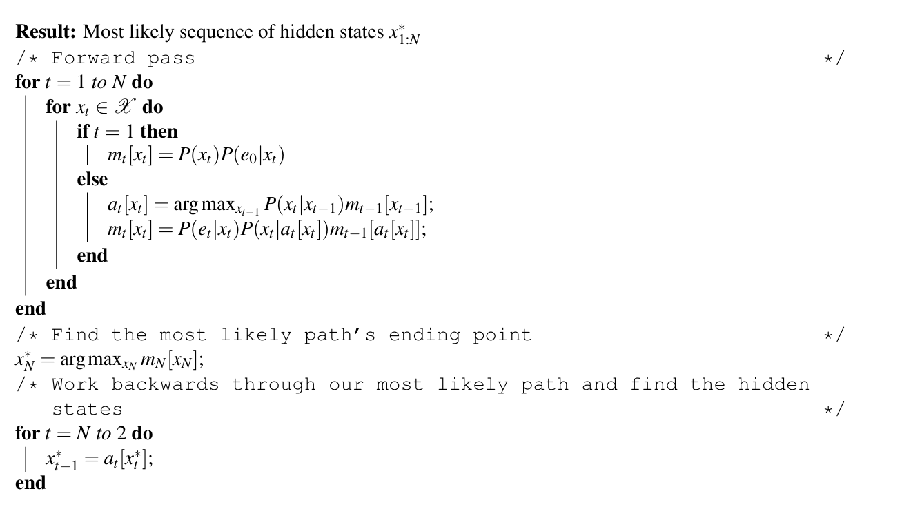
请注意，我们的 a 数组定义了 N 条序列，每条都是到达特定结束状态 \(x_N\) 的最可能序列。一旦我们完成前向遍历，我们查看这 N 条序列的可能性，选择最好的一条，并在后向遍历中重建它。因此，我们已经在多项式空间和时间中为我们的证据计算了最可能的解释。
### 4. Summary
在本笔记中，我们介绍了两种新类型的模型：
- 马尔可夫模型，它编码了具有马尔可夫性质的时间相关随机变量。我们可以使用迷你前向算法通过概率推理为马尔可夫模型计算我们选择的任何时间步的信念分布。
- 隐马尔可夫模型，它是马尔可夫模型的扩展，具有额外的性质：在每个时间步可以观察到可能影响我们信念分布的新证据。为了使用隐马尔可夫模型计算任何给定时间步的信念分布，我们使用前向算法。

有时，对这些模型运行精确推理在计算上可能过于昂贵，在这种情况下，我们可以使用粒子滤波作为一种近似推理的方法。
___
[返回目录](#目录)
___
## Note 16: Utility Theory, Rationality, Decision Networks and VPI<a id = "note16"></a>
### 1. Particle Filtering
回想一下，对于贝叶斯网络，当运行精确推理计算量过大时，使用我们讨论过的采样技术之一是一种可行的替代方法，可以有效地近似我们想要的概率分布。隐马尔可夫模型也有同样的缺点——使用前向算法运行精确推理所需的时间与随机变量定义域中值的数量成正比。在我们当前的天气问题表述中，天气只能取两个值，\(W_i \in \{\text{sun}, \text{rain}\}\)，这是可以接受的。但假设我们想要运行推理来计算某一天实际温度的分布，精确到十分之一度，那么情况就不同了。
隐马尔可夫模型对应于贝叶斯网络采样的方法称为粒子滤波，它涉及模拟一组粒子通过状态图的运动，以近似所讨论的随机变量的概率（信念）分布。这解决了与前向算法相同的问题：它给出了 \(P(X_N|e_{1:N})\) 的近似值。
我们不存储将每个状态映射到其信念概率的完整概率表，而是存储一个包含 n 个粒子的列表，其中每个粒子处于我们的时间相关随机变量定义域中的 d 个可能状态之一。通常，n 远小于 d（符号表示为 n << d），但仍然足够大以产生有意义的近似；否则粒子滤波的性能优势就变得微不足道了。粒子只是这个算法中样本的名称。
我们对于在任意给定时间步，某个粒子处于任何给定状态的信念完全取决于模拟中该时间步处于该状态的粒子数量。例如，假设我们确实想要模拟某一天 i 的温度 T 的信念分布，为简单起见，假设温度只能取 [10,20] 范围内的整数值（d = 11 个可能状态）。进一步假设我们有 n=10 个粒子，它们在模拟的时间步 i 取值如下：
\[
[15, 12, 12, 10, 18, 14, 12, 11, 11, 10]
\]
通过统计粒子列表中出现的每个温度的数量，并除以粒子总数，我们可以生成时间 i 的温度的经验分布：
| \(T_i\)      | 10 | 11 | 12 | 13 | 14 | 15 | 16 | 17 | 18 | 19 | 20 |
| :----------- | :- | :- | :- | :- | :- | :- | :- | :- | :- | :- | :- |
| \(B(T_i)\) | 0.2 | 0.2 | 0.3 | 0 | 0.1 | 0.1 | 0 | 0 | 0.1 | 0 | 0 |

现在我们已经了解了如何从粒子列表恢复信念分布，剩下的就是讨论如何为我们选择的时间步生成这样的列表。
### 2. Particle Filtering Simulation
粒子滤波模拟从粒子初始化开始，这可以非常灵活地完成——我们可以随机、均匀地采样粒子，或者根据某个初始分布采样。一旦我们采样了一个初始粒子列表，模拟就呈现出与前向算法类似的形式，在每个时间步先进行时间流逝更新，然后进行观测更新：
- 时间流逝更新 - 根据转移模型更新每个粒子的值。对于处于状态 \(t_i\) 的粒子，根据由 \(P(T_{i+1}|t_i)\) 给出的概率分布采样更新后的值。注意时间流逝更新与贝叶斯网络中的先验采样的相似性，因为处于任何给定状态的粒子频率反映了转移概率。
- 观测更新 - 在粒子滤波的观测更新期间，我们使用传感器模型 \(P(F_i|T_i)\) 根据观察到的证据和粒子状态所指示的概率为每个粒子分配一个权重。具体来说，对于处于状态 \(t_i\) 且传感器读数为 \(f_i\) 的粒子，分配一个权重 \(P(f_i|t_i)\)。
    观测更新的算法如下：
    1.  如上所述计算所有粒子的权重。
    2.  计算每个状态的总权重。
    3.  如果所有状态的总权重之和为 0，则重新初始化所有粒子。
    4.  否则，对状态的总权重分布进行归一化，并根据这个分布重新采样你的粒子列表。

    注意观测更新与似然加权的相似性，我们再次根据证据降低样本的权重。

让我们通过一个例子来更深入地理解这个过程。为我们的天气场景定义一个使用温度作为时间相关随机变量的转移模型，如下所示：对于特定的温度状态，你可以保持在相同状态，或者转移到相距一度（在 [10,20] 范围内）的状态。在可能的结果状态中，转移到最接近 15 的状态的概率是 80%，其余的结果状态均匀分配剩下的 20% 概率。
我们的温度粒子列表如下：
\[
[15, 12, 12, 10, 18, 14, 12, 11, 11, 10]
\]
为了对此粒子列表中的第一个粒子（处于状态 \(T_i = 15\)）执行时间流逝更新，我们需要相应的转移模型：
| \(T_{i+1}\) | 14 | 15 | 16 |
| :---------- | :- | :- | :- |
| \(P(T_{i+1}\|T_i = 15)\) | 0.1 | 0.8 | 0.1 |

在实践中，我们为 \(T_{i+1}\) 定义域中的每个值分配不同的数值范围，使得这些范围一起完全覆盖区间 \([0,1)\) 且不重叠。对于上述转移模型，范围如下：
1. \(T_{i+1} = 14\) 的范围是 \(0 \le r < 0.1\)。
2. \(T_{i+1} = 15\) 的范围是 \(0.1 \le r < 0.9\)。
3. \(T_{i+1} = 16\) 的范围是 \(0.9 \le r < 1\)。

为了对处于状态 \(T_i = 15\) 的粒子进行重采样，我们只需生成一个 \([0,1)\) 范围内的随机数，并查看它落在哪个范围内。因此，如果我们的随机数是 \(r = 0.467\)，那么处于 \(T_i = 15\) 的粒子将保持在 \(T_{i+1} = 15\)，因为 \(0.1 \le r < 0.9\)。现在考虑以下 10 个在区间 \([0,1)\) 内的随机数列表：
\[
[0.467, 0.452, 0.583, 0.604, 0.748, 0.932, 0.609, 0.372, 0.402, 0.026]
\]
如果我们使用这 10 个值作为重采样我们 10 个粒子的随机值，那么经过完整的时间流逝更新后，我们的新粒子列表应该如下所示：
\[
[15, 13, 13, 11, 17, 15, 13, 12, 12, 10]
\]
请自行验证！更新后的粒子列表产生了相应的更新信念分布 \(B(T_{i+1})\)：
| \(T_{i+1}\)   | 10 | 11 | 12 | 13 | 14 | 15 | 16 | 17 | 18 | 19 | 20 |
| :----------- | :- | :- | :- | :- | :- | :- | :- | :- | :- | :- | :- |
| \(B(T_{i+1})\) | 0.1 | 0.1 | 0.2 | 0.3 | 0 | 0.2 | 0 | 0.1 | 0 | 0 | 0 |

将我们更新后的信念分布 \(B(T_{i+1})\) 与初始信念分布 \(B(T_i)\) 进行比较，我们可以看到，总体趋势是粒子倾向于收敛到温度 \(T = 15\)。
接下来，我们执行观测更新。假设我们的传感器模型 \(P(F_i|T_i)\) 表明正确预测 \(f_i = t_i\) 的概率是 80%，而预测其他 10 个状态中任何一个的概率各为 2%。假设预报为 \(F_{i+1} = 13\)，我们 10 个粒子的权重如下：
| 粒子   | p1 | p2 | p3 | p4 | p5 | p6 | p7 | p8 | p9 | p10 |
| :----- | :- | :- | :- | :- | :- | :- | :- | :- | :- | :- |
| 状态   | 15 | 13 | 13 | 11 | 17 | 15 | 13 | 12 | 12 | 10 |
| 权重 | 0.02 | 0.8 | 0.8 | 0.02 | 0.02 | 0.02 | 0.8 | 0.02 | 0.02 | 0.02 |

然后我们按状态聚合权重：
| 状态   | 10 | 11 | 12 | 13 | 15 | 17 |
| :----- | :- | :- | :- | :- | :- | :- |
| 权重 | 0.02 | 0.02 | 0.04 | 2.4 | 0.04 | 0.02 |

对所有值求和得到总权重 2.54，我们可以通过将每个条目除以该和来归一化权重表，从而生成概率分布：
| 状态   | 10     | 11     | 12      | 13      | 15      | 17     |
| :----- | :----- | :----- | :------ | :------ | :------ | :----- |
| 归一化权重 | 0.0079 | 0.0079 | 0.0157 | 0.9449 | 0.0157 | 0.0079 |

最后一步是使用这个概率分布进行重采样，使用与我们在时间流逝更新期间用于重采样相同的技术。假设我们生成了 10 个在 \([0,1)\) 范围内的随机数，其值如下：
\[
[0.315, 0.829, 0.304, 0.368, 0.459, 0.891, 0.282, 0.980, 0.898, 0.341]
\]
这产生了如下的重采样粒子列表：
\[
[13, 13, 13, 13, 13, 13, 13, 15, 13, 13]
\]
以及相应的最终新信念分布：
| \(T_{i+1}\)   | 10 | 11 | 12 | 13 | 14 | 15 | 16 | 17 | 18 | 19 | 20 |
| :----------- | :- | :- | :- | :- | :- | :- | :- | :- | :- | :- | :- |
| \(B(T_{i+1})\) | 0 | 0 | 0 | 0.9 | 0 | 0.1 | 0 | 0 | 0 | 0 | 0 |

观察到我们的传感器模型编码了天气预报有 80% 的概率是非常准确的，并且我们的新粒子列表与此一致，因为大多数粒子被重采样为 \(T_{i+1} = 13\)。
### 3. Utilities
在我们对理性智能体的讨论中，效用的概念反复出现。例如，在博弈中，效用值通常被硬编码到游戏中，智能体使用这些效用值来选择行动。我们现在将讨论生成一个可行的效用函数需要什么条件。
理性智能体必须遵循最大效用原则——它们必须始终选择最大化其期望效用的行动。然而，遵守这一原则只对那些拥有理性偏好的智能体有益。为了构建一个非理性偏好的例子，假设存在三个物体 A、B 和 C，并且我们的智能体当前拥有 A。假设我们的智能体有以下一组非理性偏好：
- 我们的智能体偏好 B 胜过 A 加 1 美元
- 我们的智能体偏好 C 胜过 B 加 1 美元
- 我们的智能体偏好 A 胜过 C 加 1 美元

一个拥有 B 和 C 的恶意智能体可以用 B 与我们的智能体交换 A 加一美元，然后用 C 交换 B 加一美元，然后再用 A 交换 C 加一美元。我们的智能体就白白损失了 3 美元！通过这种方式，我们的智能体可能被迫在一个无尽而可怕的循环中交出它所有的钱。
现在让我们正确定义偏好的数学语言：
- 如果一个智能体更喜欢获得奖品 A 而不是获得奖品 B，这写作 \(A \succ B\)
- 如果一个智能体在接受 A 或 B 之间无差异，这写作 \(A \sim B\)
- 一个彩票是一种情境，不同的奖品以不同的概率出现。为了表示以概率 p 获得 A 并以概率 (1-p) 获得 B 的彩票，我们写作 \(L = [p, A; (1-p), B]\)

为了使一组偏好是理性的，它们必须遵循理性五公理：
- 可排序性：\((A \succ B) \lor (B \succ A) \lor (A \sim B)\)
    一个理性智能体必须要么偏好 A 或 B 中的一个，要么对两者无差异。
- 传递性：\((A \succ B) \land (B \succ C) \Rightarrow (A \succ C)\)
    如果一个理性智能体偏好 A 胜过 B，并且偏好 B 胜过 C，那么它偏好 A 胜过 C。
- 连续性：\(A \succ B \succ C \Rightarrow \exists p [p, A; (1-p), C] \sim B\)
    如果一个理性智能体偏好 A 胜过 B，但偏好 B 胜过 C，那么可以通过适当选择 p 构造一个介于 A 和 C 之间的彩票 L，使得智能体在 L 和 B 之间无差异。
- 可替代性：\(A \sim B \Rightarrow [p, A; (1-p), C] \sim [p, B; (1-p), C]\)
    一个对两个奖品 A 和 B 无差异的理性智能体，对于任何两个仅在将 A 替换为 B 或将 B 替换为 A 上有所不同的彩票，也是无差异的。
- 单调性：\(A \succ B \Rightarrow (p \ge q \Leftrightarrow [p, A; (1-p), B] \succeq [q, A; (1-q), B])\)
    如果一个理性智能体偏好 A 胜过 B，那么在给定仅涉及 A 和 B 的彩票之间的选择时，智能体偏好将最高概率分配给 A 的彩票。

如果一个智能体满足所有五个公理，那么可以保证该智能体的行为可以描述为期望效用的最大化。更具体地说，这意味着存在一个实值效用函数 U，该函数在实现时将为更受偏好的奖品分配更高的效用，并且彩票的效用是从该彩票中获得的奖品效用的期望值。这两个陈述可以总结为两个简洁的数学等价关系：
\[
U(A) \ge U(B) \Leftrightarrow A \succeq B \quad (1)
\]
\[
U([p_1, S_1; ...; p_n, S_n]) = \sum_i p_i U(S_i) \quad (2)
\]
如果满足这些约束条件，并且选择了适当的算法，那么实现这样一个效用函数的智能体就能保证最优地行动。让我们通过一个具体例子更详细地讨论效用函数。考虑以下彩票：
\[
L = [0.5, \$0; 0.5, \$1000]
\]
这表示一个以 0.5 的概率获得 1000 美元，以 0.5 的概率获得 0 美元的彩票。现在考虑三个智能体 A1、A2 和 A3，它们的效用函数分别为 \(U_1(\$x) = x\)、\(U_2(\$x) = \sqrt{x}\) 和 \(U_3(\$x) = x^2\)。如果这三个智能体都面临参与这个彩票还是接受 500 美元固定付款的选择，他们会选择哪个？每个智能体参与彩票和接受固定付款的相应效用列于下表：
| 智能体 | 彩票效用 | 固定付款效用 |
| :----- | :------- | :----------- |
| 1      | 500      | 500          |
| 2      | 15.81    | 22.36        |
| 3      | 500000   | 250000       |

这些彩票的效用值是通过使用上述公式 (2) 计算得到的：
\[
\begin{aligned}
U_1(L) &= U_1([0.5, \$0; 0.5, \$1000]) = 0.5 \cdot U_1(\$1000) + 0.5 \cdot U_1(\$0) = 0.5 \cdot 1000 + 0.5 \cdot 0 = 500 \\
U_2(L) &= U_2([0.5, \$0; 0.5, \$1000]) = 0.5 \cdot U_2(\$1000) + 0.5 \cdot U_2(\$0) = 0.5 \cdot \sqrt{1000} + 0.5 \cdot \sqrt{0} = 15.81 \\
U_3(L) &= U_3([0.5, \$0; 0.5, \$1000]) = 0.5 \cdot U_3(\$1000) + 0.5 \cdot U_3(\$0) = 0.5 \cdot 1000^2 + 0.5 \cdot 0^2 = 500000
\end{aligned}
\]
通过这些结果，我们可以看到智能体 A1 在参与彩票和接受固定付款之间无差异（两种情况下的效用相同）。这样的智能体被称为风险中性。类似地，智能体 A2 偏好固定付款胜过彩票，被称为风险厌恶，而智能体 A3 偏好彩票胜过固定付款，被称为风险寻求。
### 4. Decision Networks
在第三篇笔记中，我们学习了博弈树以及极小化极大和期望极大化等算法，我们用这些算法来确定最大化我们期望效用的最优行动。然后在第五篇笔记中，我们讨论了贝叶斯网络，以及如何使用我们已知的证据进行概率推理以做出预测。现在我们将讨论贝叶斯网络和期望极大化的结合，称为决策网络，我们可以使用它基于一个总体的图形化概率模型来建模各种行动对效用的影响。
让我们直接深入探讨决策网络的构成：
- 机会节点 - 决策网络中的机会节点行为与贝叶斯网络完全相同。机会节点中的每个结果都有一个关联的概率，可以通过对其所属的底层贝叶斯网络运行推理来确定。我们用椭圆表示它们。
- 行动节点 - 行动节点是我们完全控制的节点；它们代表我们有权选择的多个行动中的一个选择。我们用矩形表示行动节点。
- 效用节点 - 效用节点是某些行动和机会节点组合的子节点。它们根据其父节点所取的值输出一个效用，并在我们的决策网络中表示为菱形。

考虑一个场景：你早上离开家去上课时决定是否带伞，并且你知道天气预报说有 30% 的几率会下雨。你应该带伞吗？如果有 80% 的几率下雨，你的答案会改变吗？这种情况非常适合用决策网络建模，我们如下进行：
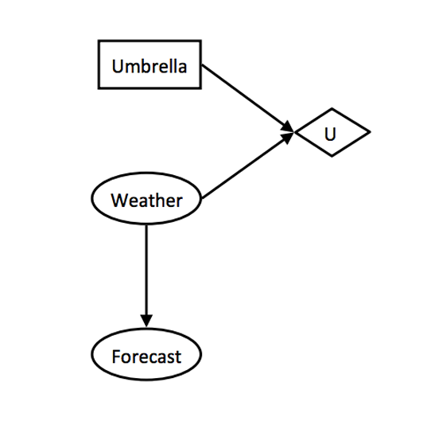
正如我们在本课程中对所讨论的各种建模技术和算法所做的那样，我们使用决策网络的目标同样是选择产生最大期望效用的行动。这可以通过一个相当直接且直观的过程来完成：
- 首先实例化所有已知的证据，并运行推理来计算效用节点的所有机会节点父节点（行动节点馈入其中）的后验概率。
- 遍历每个可能的行动，并根据上一步计算的后验概率计算采取该行动的期望效用。在给定证据 e 和 n 个机会节点的情况下，采取行动 a 的期望效用使用以下公式计算：
    \[
    EU(a|e) = \sum_{x_1, ..., x_n} P(x_1, ..., x_n|e) U(a, x_1, ..., x_n)
    \]
    其中每个 \(x_i\) 代表第 i 个机会节点可以取的值。我们简单地对在给定行动下每个结果的效用进行加权求和，权重对应于每个结果的概率。
- 最后，选择产生最高效用的行动以获得最大期望效用。

让我们通过为天气示例计算最优行动（我们应该离开还是带伞）来看看这个过程实际上是什么样子的，我们同时使用给定糟糕天气预报（预报是我们的证据变量）下天气的条件概率表，以及给定我们的行动和天气的效用表：
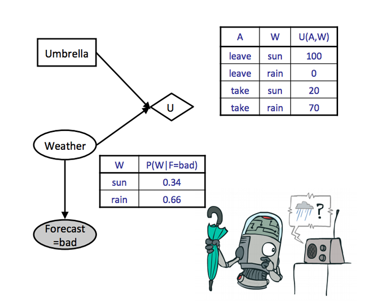
请注意，我们省略了后验概率 \(P(W|F=bad)\) 的推理计算，但我们可以使用我们讨论过的任何用于贝叶斯网络的推理算法来计算它们。相反，这里我们直接假设上面给出的后验概率表 \(P(W|F=bad)\)。遍历我们的两个行动并计算期望效用得到：
\[
\begin{aligned}
EU(\text{leave}|bad) &= \sum_w P(w|bad) U(\text{leave}, w) \\
&= 0.34 \cdot 100 + 0.66 \cdot 0 = 34 \\
EU(\text{take}|bad) &= \sum_w P(w|bad) U(\text{take}, w) \\
&= 0.34 \cdot 20 + 0.66 \cdot 70 = 53
\end{aligned}
\]
剩下要做的就是取这些计算出的效用的最大值以确定最大期望效用：
\[
MEU(F=bad) = \max_a EU(a|bad) = 53
\]
产生最大期望效用的行动是 take，因此这是决策网络推荐给我们的行动。更正式地说，产生最大期望效用的行动可以通过对期望效用取 argmax 来确定。
### 5. Outcome Trees
我们在本笔记开始时提到决策网络包含一些类似期望极大化的元素，所以让我们讨论一下这究竟意味着什么。我们可以将决策网络中选择对应于最大化期望效用的行动的过程展开为一个结果树。我们上面的天气预报示例展开为以下结果树：
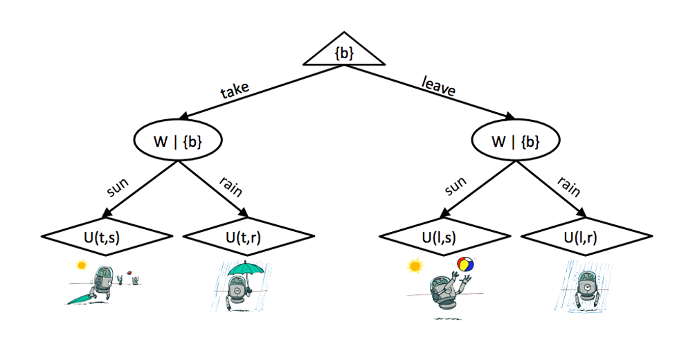
顶部的根节点是一个极大化节点，就像在期望极大化中一样，由我们控制。我们选择一个行动，这将我们带到树的下一层，由机会节点控制。在这一层，机会节点以不同的概率解析为最终层的不同效用节点，这些概率来自于对底层贝叶斯网络运行概率推理导出的后验概率。这与普通的期望极大化到底有什么不同？唯一的实际区别在于，对于结果树，我们在节点上标注了在任何给定时刻我们所知道的信息（花括号内）。
### 6. The Value of Perfect Information
到目前为止，在我们所涵盖的所有内容中，我们通常一直假设我们的智能体拥有特定问题所需的所有信息，并且/或者没有办法获取新信息。在实践中，情况并非如此，决策最重要的部分之一是知道是否值得收集更多证据来帮助决定采取哪个行动。观察新证据几乎总是有某种成本，无论是时间成本、金钱成本还是其他媒介。在本节中，我们将讨论一个非常重要的概念——完美信息的价值——它用数学量化了如果智能体观察到一些新证据，其最大期望效用预计会增加多少。我们可以将学习某些新信息的VPI与观察该信息相关的成本进行比较，以决定观察该信息是否值得。
### 7. General Formula
我们不要简单地给出计算新证据完美信息价值的公式，而是通过一个直观的推导过程来理解。根据上面的定义，我们知道完美信息的价值是，如果我们决定观察新证据，我们的最大期望效用预计会增加的量。我们知道在当前证据 e 下我们当前的最大效用：
\[
MEU(e) = \max_a \sum_s P(s|e) U(s, a)
\]
此外，我们知道如果我们在行动前观察到了一些新证据 \(e'\)，那时我们行动的最大期望效用将变为：
\[
MEU(e, e') = \max_a \sum_s P(s|e, e') U(s, a)
\]
然而，请注意我们不知道我们会得到什么新证据。例如，如果我们事先不知道天气预报并选择观察它，我们观察到的预报可能是好的也可能是坏的。因为我们不知道我们会得到什么新证据 \(e'\)，我们必须将其表示为一个随机变量 \(E'\)。如果我们不知道通过观察获得的新证据会告诉我们什么，我们如何表示选择观察一个新变量后我们将获得的新的最大期望效用？答案是计算最大期望效用的期望值，虽然说起来有点拗口，但这是一种自然的方法：
\[
MEU(e, E') = \sum_{e'} P(e'|e) MEU(e, e')
\]
观察一个新的证据变量会产生不同的最大期望效用，其概率对应于观察到该证据变量每个值的概率，因此通过如上计算 \(MEU(e, E')\)，我们计算了如果我们选择观察新证据，我们预期的新最大期望效用是多少。现在差不多完成了——回到我们对 VPI 的定义，我们想要找到如果我们选择观察新证据，我们的最大期望效用预计会增加的量。我们知道我们当前的最大期望效用，以及如果我们选择观察，新最大期望效用的期望值，因此期望的最大期望效用增加量就是这两项之差！确实，
\[
VPI(E'|e) = MEU(e, E') - MEU(e)
\]
其中我们可以将 \(VPI(E'|e)\) 理解为“在当前证据 e 下观察新证据 E’ 的价值”。
让我们最后一次回顾我们的天气场景，通过一个例子来逐步了解：
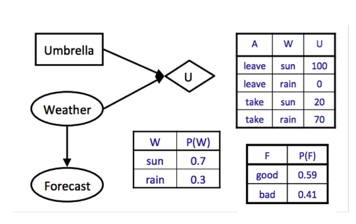
如果我们不观察任何证据，那么我们的最大期望效用可以计算如下：
\[
\begin{aligned}
MEU(\emptyset) &= \max_a EU(a) \\
&= \max_a \sum_w P(w) U(a, w) \\
&= \max\{0.7 \cdot 100 + 0.3 \cdot 0, 0.7 \cdot 20 + 0.3 \cdot 70\} \\
&= \max\{70, 35\} \\
&= 70
\end{aligned}
\]
注意，当我们没有证据时，约定写成 \(MEU(\emptyset)\)，表示我们的证据是空集。现在假设我们正在决定是否观察天气预报。我们已经计算出 \(MEU(F=bad) = 53\)，并假设对 \(F=good\) 进行相同的计算得到 \(MEU(F=good)=95\)。我们现在准备计算 \(MEU(e, E')\)：
\[
\begin{aligned}
MEU(e, E') &= MEU(F) \\
&= \sum_{e'} P(e'|e) MEU(e, e') \\
&= \sum_f P(F=f) MEU(F=f) \\
&= P(F=good) MEU(F=good) + P(F=bad) MEU(F=bad) \\
&= 0.59 \cdot 95 + 0.41 \cdot 53 \\
&= 77.78
\end{aligned}
\]
因此我们得出结论：
\[
VPI(F) = MEU(F) - MEU(\emptyset) = 77.78 - 70 = 7.78
\]
### 8. Properties of VPI
完美信息的价值有几个非常重要的性质，即：
- 非负性。\(\forall E', e \quad VPI(E'|e) \ge 0\)
    观察新信息总能让你做出更明智的决策，因此你的最大期望效用只会增加（如果信息对你必须做出的决定无关紧要，则保持不变）。
- 非可加性。通常情况下，\(VPI(E_j, E_k|e) \neq VPI(E_j|e) + VPI(E_k|e)\)。
    这可能是三个性质中最难直观理解的一个。这是正确的，因为通常观察一些新证据 \(E_j\) 可能会改变我们对 \(E_k\) 的重视程度；因此我们不能简单地将观察 \(E_j\) 的 VPI 加到观察 \(E_k\) 的 VPI 上，以得到同时观察它们两者的 VPI。相反，观察两个新证据变量的 VPI 等同于先观察一个，将其纳入我们当前的证据，然后再观察另一个。这由 VPI 的顺序无关性性质所概括，下面将详细描述。
- 顺序无关性。\(VPI(E_j, E_k|e) = VPI(E_j|e) + VPI(E_k|e, E_j) = VPI(E_k|e) + VPI(E_j|e, E_k)\)
    观察多个新证据所带来的最大期望效用增益与观察顺序无关。这应该是一个相当直接的假设——因为我们在观察到任何新证据变量之后才实际采取行动，所以我们是同时观察新证据变量还是按某种任意的顺序观察，实际上并不重要。
___
[返回目录](#目录)
___
## Note 17: MDPs I<a id = "note17"></a>
### 1. Markov Decision Processes
一个马尔可夫决策过程由以下几个属性定义：
- 一个状态集合 \(S\)。MDP中的状态表示方式与传统搜索问题中的状态相同。
- 一个动作集合 \(A\)。MDP中的动作表示方式也与传统搜索问题中的相同。
- 一个起始状态。
- 可能有一个或多个终止状态。
- 可能有一个折扣因子 \(\gamma\)。我们稍后将讨论折扣因子。
- 一个转移函数 \(T(s, a, s')\)。由于我们引入了非确定性动作的可能性，我们需要一种方法来描述从任何给定状态采取任何给定动作后可能结果的概率。MDP的转移函数正是做这个的——它是一个概率函数，表示一个智能体从状态 \(s \in S\) 采取动作 \(a \in A\) 后最终到达状态 \(s' \in S\) 的概率。
- 一个奖励函数 \(R(s, a, s')\)。通常，MDP在每个步骤都使用小的“生存”奖励来奖励智能体的存活，同时为到达终止状态提供大的奖励。奖励可以是正的也可以是负的，取决于它们是否对相关智能体有利，智能体的目标自然是在到达某个终止状态之前获得尽可能多的奖励。

为一种情境构建MDP与为搜索问题构建状态空间图非常相似，但有一些额外的注意事项。考虑一个赛车的激励示例：
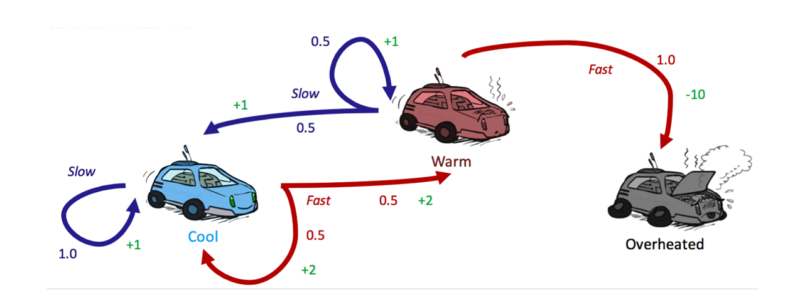
有三个可能的状态，\(S = \{\text{cool}, \text{warm}, \text{overheated}\}\)，以及两个可能的动作 \(A = \{\text{slow}, \text{fast}\}\)。就像在状态空间图中一样，三个状态中的每一个都由一个节点表示，边代表动作。Overheated是一个终止状态，因为一旦赛车智能体到达这个状态，它就无法再执行任何动作来获得更多奖励（它是MDP中的一个吸收状态，没有出边）。值得注意的是，对于非确定性动作，从同一状态出发有多个代表相同动作但指向不同后继状态的边。每条边不仅标注了它所代表的动作，还标注了转移概率和相应的奖励。这些总结如下：
- 转移函数：\(T(s, a, s')\)
    - \(T(\text{cool}, \text{slow}, \text{cool}) = 1\)
    - \(T(\text{warm}, \text{slow}, \text{cool}) = 0.5\)
    - \(T(\text{warm}, \text{slow}, \text{warm}) = 0.5\)
    - \(T(\text{cool}, \text{fast}, \text{cool}) = 0.5\)
    - \(T(\text{cool}, \text{fast}, \text{warm}) = 0.5\)
    - \(T(\text{warm}, \text{fast}, \text{overheated}) = 1\)
- 奖励函数**：\(R(s, a, s')\)
    - \(R(\text{cool}, \text{slow}, \text{cool}) = 1\)
    - \(R(\text{warm}, \text{slow}, \text{cool}) = 1\)
    - \(R(\text{warm}, \text{slow}, \text{warm}) = 1\)
    - \(R(\text{cool}, \text{fast}, \text{cool}) = 2\)
    - \(R(\text{cool}, \text{fast}, \text{warm}) = 2\)
    - \(R(\text{warm}, \text{fast}, \text{overheated}) = -10\)

我们用离散的时间步来表示智能体随时间在不同MDP状态中的移动，分别定义 \(s_t \in S\) 和 \(a_t \in A\) 为智能体在时间步 t 所处的状态和采取的动作。智能体在时间步 0 从状态 \(s_0\) 开始，并在每个时间步采取一个动作。因此，智能体在MDP中的移动可以建模如下：
\[
s_0 \xrightarrow{a_0} s_1 \xrightarrow{a_1} s_2 \xrightarrow{a_2} s_3 \xrightarrow{a_3} ...
\]
此外，知道智能体的目标是最大化其所有时间步的奖励，我们可以相应地将其数学表达为对以下效用函数的最大化：
\[
U([s_0, a_0, s_1, a_1, s_2, ...]) = R(s_0, a_0, s_1) + R(s_1, a_1, s_2) + R(s_2, a_2, s_3) + ...
\]
马尔可夫决策过程，就像状态空间图一样，可以展开成搜索树。不确定性在这些搜索树中使用 Q-状态（也称为动作状态）来建模，本质上与期望极大化中的机会节点相同。这是一个合适的选择，因为Q-状态使用概率来建模环境将智能体置于给定状态的不确定性，正如期望极大化中的机会节点使用概率来建模对手通过其选择的动作将我们的智能体置于给定状态的不确定性一样。从状态 s 采取动作 a 所表示的 Q-状态记作元组 \((s, a)\)。
观察我们为赛车展开的、截断到深度2的搜索树：
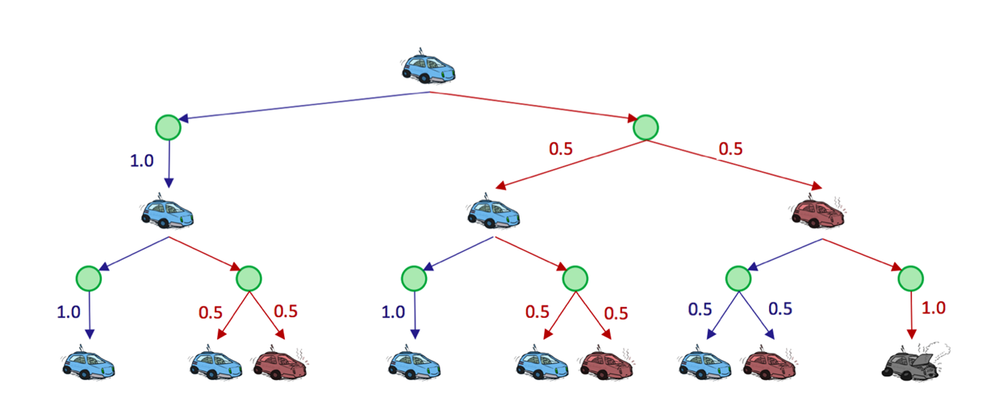
绿色的节点代表Q-状态，表示已经从一个状态采取了动作，但尚未解析出后继状态。重要的是要理解，智能体在Q-状态中花费的时间步长为零，它们仅仅是为了便于表示和开发MDP算法而创建的构造。
### 2. Finite Horizons and Discounting
我们的赛车MDP存在一个固有的问题——我们没有对赛车可以采取动作并收集奖励的时间步数量施加任何时间限制。按照我们目前的表述，它可以常规地在每个时间步选择 \(a = \text{slow}\) 永远持续下去，安全有效地获得无限奖励，而没有任何过热的风险。这通过引入有限视野和/或折扣因子来防止。
强制有限视野的MDP很简单——它本质上为智能体定义了一个“生命周期”，给予它们一定数量的时间步 n，让它们在自动终止之前尽可能多地积累奖励。我们稍后将回到这个概念。
折扣因子稍微复杂一些，它们被引入来模拟奖励价值随时间的指数衰减。具体来说，使用折扣因子 \(\gamma\)，在时间步 t 从状态 \(s_t\) 采取动作 \(a_t\) 并最终到达状态 \(s_{t+1}\) 所产生的奖励是 \(\gamma^t R(s_t, a_t, s_{t+1})\)，而不仅仅是 \(R(s_t, a_t, s_{t+1})\)。现在，我们不再最大化加性效用
\[
U([s_0, a_0, s_1, a_1, s_2, ...]) = R(s_0, a_0, s_1) + R(s_1, a_1, s_2) + R(s_2, a_2, s_3) + ...
\]
而是试图最大化折扣效用
\[
U([s_0, a_0, s_1, a_1, s_2, ...]) = R(s_0, a_0, s_1) + \gamma R(s_1, a_1, s_2) + \gamma^2 R(s_2, a_2, s_3) + ...
\]
注意到上述折扣效用函数的定义看起来类似于一个公比为 \(\gamma\) 的几何级数，我们可以证明只要满足约束 \(|\gamma| < 1\)（其中 \(|n|\) 表示绝对值运算符），它保证是有限值的，通过以下逻辑：
\[
\begin{aligned}
U([s_0, s_1, s_2, ...]) &= R(s_0, a_0, s_1) + \gamma R(s_1, a_1, s_2) + \gamma^2 R(s_2, a_2, s_3) + ... \\
&= \sum_{t=0}^{\infty} \gamma^t R(s_t, a_t, s_{t+1}) \le \sum_{t=0}^{\infty} \gamma^t R_{max} = \frac{R_{max}}{1 - \gamma}
\end{aligned}
\]
其中 \(R_{max}\) 是MDP中任何给定时间步可获得的最大可能奖励。通常，\(\gamma\) 严格选自范围 \(0 < \gamma < 1\)，因为范围 \(-1 < \gamma \le 0\) 的值在大多数现实世界情境中没有意义——\(\gamma\) 为负值意味着状态 s 的奖励会在交替的时间步中正负翻转。
### 3. Markovianess
马尔可夫决策过程是“马尔可夫的”，因为它们满足马尔可夫性质，或称无记忆性质，该性质指出，在给定现在的情况下，未来与过去是条件独立的。直观地说，这意味着，如果我们知道现在的状态，知道过去不会给我们关于未来的更多信息。为了用数学表达这一点，考虑一个智能体在某个MDP中，在采取动作 \(a_0, a_1, ..., a_{t-1}\) 后已经访问了状态 \(s_0, s_1, ..., s_t\)，并且刚刚采取了动作 \(a_t\)。给定其先前访问过的状态和采取过的动作的历史，该智能体随后到达状态 \(s_{t+1}\) 的概率可以写成如下形式：
\[
P(S_{t+1} = s_{t+1} | S_t = s_t, A_t = a_t, S_{t-1} = s_{t-1}, A_{t-1} = a_{t-1}, ..., S_0 = s_0)
\]
其中每个 \(S_t\) 表示代表我们智能体在时间 t 的状态的随机变量，\(A_t\) 表示代表我们智能体在时间 t 采取的动作的随机变量。马尔可夫性质指出上述概率可以简化为：
\[
P(S_{t+1} = s_{t+1} | S_t = s_t, A_t = a_t, S_{t-1} = s_{t-1}, A_{t-1} = a_{t-1}, ..., S_0 = s_0) = P(S_{t+1} = s_{t+1} | S_t = s_t, A_t = a_t)
\]
这在以下意义上是“无记忆的”：在时间 t+1 到达状态 \(s'\) 的概率仅取决于时间 t 的状态 s 和采取的动作 a，而不取决于任何更早的状态或动作。事实上，正是这些无记忆的概率由转移函数编码：\(T(s, a, s') = P(s'|s, a)\)。
### 4. Solving Markov Decision Processes
回想一下，在确定性的、非对抗性的搜索中，解决一个搜索问题意味着找到一个到达目标状态的最优计划。而解决一个马尔可夫决策过程，则意味着找到一个最优策略 \(\pi^*: S \rightarrow A\)，一个将每个状态 \(s \in S\) 映射到动作 \(a \in A\) 的函数。一个明确的策略 \(\pi\) 定义了一个反应式智能体——给定一个状态 s，实现 \(\pi\) 的处于 s 的智能体将选择 \(a = \pi(s)\) 作为要采取的适当动作，而不考虑其行动的未來后果。最优策略是指，如果被实现的智能体遵循它，将产生最大期望总奖励或效用。
考虑以下 MDP，其中 \(S = \{a, b, c, d, e\}\)，\(A = \{\text{East}, \text{West}, \text{Exit}\}\)（其中 Exit 仅在状态 a 和 e 中是有效动作，并分别产生奖励 10 和 1），折扣因子 \(\gamma = 0.1\)，且转移是确定性的：
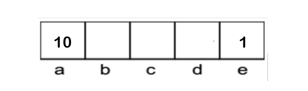
该MDP的两个可能策略如下：
(a) 策略 1
(b) 策略 2
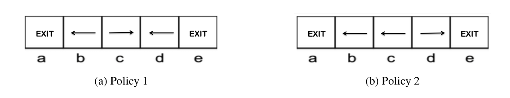
通过一些研究，不难确定策略 2 是最优的。遵循该策略直到采取动作 \(a = \text{Exit}\)，每个起始状态产生的奖励如下：
| 起始状态 | 奖励 |
| :------- | :--- |
| a        | 10   |
| b        | 1    |
| c        | 0.1  |
| d        | 0.1  |
| e        | 1    |

我们现在将学习如何使用马尔可夫决策过程的贝尔曼方程来算法性地求解此类MDP（以及更复杂的！）。
### 5. The Bellman Equation
为了讨论MDP的贝尔曼方程，我们必须首先引入两个新的数学量：
- 一个状态 s 的最优价值 \(U^*(s)\) – s 的最优价值是指一个从 s 开始的最优行为智能体，在其剩余的“生命周期”中将获得的效用的期望值。请注意，在文献中，相同的量通常用 \(V^*(s)\) 表示。
- 一个 Q-状态 \((s, a)\) 的最优价值 \(Q^*(s, a)\) – \((s, a)\) 的最优价值是指一个智能体从 s 开始，采取 a，并在此后最优地行动所获得的效用的期望值。

使用这两个新量以及之前讨论的其他MDP量，贝尔曼方程定义如下：
\[
U^*(s) = \max_a \sum_{s'} T(s, a, s') [R(s, a, s') + \gamma U^*(s')]
\]
在我们开始解释这意味着什么之前，让我们也定义一下 Q-状态最优价值（更常称为最优 Q-值）的方程：
\[
Q^*(s, a) = \sum_{s'} T(s, a, s') [R(s, a, s') + \gamma U^*(s')]
\]
请注意，第二个定义允许我们将贝尔曼方程重新表达为
\[
U^*(s) = \max_a Q^*(s, a)
\]
这是一个大大简化了的量。贝尔曼方程是动态规划方程的一个例子，这种方程通过固有的递归结构将问题分解成更小的子问题。我们可以在 Q-值方程中的项 \([R(s, a, s') + \gamma U^*(s')]\) 中看到这种固有的递归性。这一项表示智能体通过首先从 s 采取 a 并到达 s'，然后在此后最优地行动所获得的总效用。采取动作 a 的即时奖励 \(R(s, a, s')\) 被加到从 s' 可获得的最优折扣奖励和 \(U^*(s')\) 上，后者被 \(\gamma\) 折现以计入采取动作 a 所经过的一个时间步。尽管在大多数情况下，从 s' 到某个终止状态存在大量可能的状态和动作序列，但所有这些细节都被抽象掉，并封装在一个单一的递归值 \(U^*(s')\) 中。
我们现在可以再向外迈出一步，考虑 Q-值的完整方程。知道了 \([R(s, a, s') + \gamma U^*(s')]\) 代表从 Q-状态 \((s, a)\) 到达状态 s' 后最优地行动所获得的效用，那么显然量
\[
\sum_{s'} T(s, a, s') [R(s, a, s') + \gamma U^*(s')]
\]
就是效用的加权和，每个效用按其发生概率加权。根据定义，这正是从 Q-状态 \((s, a)\) 开始最优地行动的期望效用！这完成了我们的分析，并给了我们足够的洞察力来解释完整的贝尔曼方程——一个状态的最优价值 \(U^*(s)\)，就是来自 s 的所有可能动作的最大期望效用。计算状态 s 的最大期望效用本质上与运行期望极大化相同——我们首先计算每个 Q-状态 \((s, a)\) 的期望效用（相当于计算机会节点的价值），然后计算这些节点的最大值以得到最大期望效用（相当于计算极大化节点的价值）。
关于贝尔曼方程的最后一件事——它的用途是作为最优性的条件。换句话说，如果我们能够以某种方式为每个状态 \(s \in S\) 确定一个值 \(U(s)\)，使得贝尔曼方程对这些状态中的每一个都成立，那么我们可以断定这些值就是它们各自状态的最优值。实际上，满足这个条件意味着 \(\forall s \in S, U(s) = U^*(s)\)。
___
[返回目录](#目录)
___
## Note 18: MDPs II<a id = "note18"></a>
### 1. Value Iteration
现在我们有了一个框架来测试 MDP 中状态价值的最优性，接下来自然要问的问题是如何实际计算这些最优价值。为了回答这个问题，我们需要时间限制价值（强制执行有限视野的自然结果）。一个状态 s 在时间限制为 k 个时间步下的时间限制价值记为 \(U_k(s)\)，它表示在当前考虑的马尔可夫决策过程将在 k 个时间步后终止的情况下，从 s 出发可获得的最大期望效用。等价地，这就是对 MDP 的搜索树运行深度为 k 的期望极大化所返回的结果。
值迭代是一种动态规划算法，它使用迭代增长的时间限制来计算时间限制价值，直到收敛（即，直到每个状态的 U 值与过去迭代中的值相同：\(\forall s, U_{k+1}(s) = U_k(s)\)）。其操作如下：
1.  \(\forall s \in S\)，初始化 \(U_0(s) = 0\)。这应该是直观的，因为将时间限制设置为 0 个时间步意味着在终止前不能采取任何动作，因此无法获得任何奖励。
2.  重复以下更新规则直到收敛：
    \[
    \forall s \in S, \quad U_{k+1}(s) \leftarrow \max_a \sum_{s'} T(s, a, s') [R(s, a, s') + \gamma U_k(s')]
    \]

在值迭代的第 k 次迭代中，我们使用每个状态的时间限制为 k 的时间限制价值来生成时间限制为 (k+1) 的时间限制价值。本质上，我们使用已计算出的子问题解（所有 \(U_k(s)\)）来迭代构建更大子问题的解（所有 \(U_{k+1}(s)\)）；这就是使值迭代成为动态规划算法的原因。
请注意，尽管贝尔曼方程在结构上与上述更新规则看起来基本相同，但它们并不相同。贝尔曼方程给出了最优性的条件，而更新规则给出了一种迭代更新值直到收敛的方法。当达到收敛时，贝尔曼方程将对每个状态成立：\(\forall s \in S, U_k(s) = U_{k+1}(s) = U^*(s)\)。
为简洁起见，我们经常用简写 \(U_{k+1} \leftarrow \mathcal{B} U_k\) 来表示 \(U_{k+1}(s) \leftarrow \max_a \sum_{s'} T(s, a, s') [R(s, a, s') + \gamma U_k(s')]\)，其中 \(\mathcal{B}\) 被称为贝尔曼算子。贝尔曼算子是一个 \(\gamma\) 的压缩。为了证明这一点，我们需要以下一般不等式：
\[
|\max_z f(z) - \max_z h(z)| \le \max_z |f(z) - h(z)|
\]
现在考虑在相同状态 s 上评估的两个价值函数 \(U(s)\) 和 \(U'(s)\)。我们如下证明贝尔曼更新 \(\mathcal{B}\) 关于最大范数是一个 \(\gamma \in (0,1)\) 的压缩：
\[
\begin{aligned}
|\mathcal{B}U(s) - \mathcal{B}U'(s)|
&= \left| \max_a \sum_{s'} T(s, a, s')[R(s, a, s') + \gamma U(s')] - \max_a \sum_{s'} T(s, a, s')[R(s, a, s') + \gamma U'(s')] \right| \\
&\le \max_a \left| \sum_{s'} T(s, a, s')[R(s, a, s') + \gamma U(s')] - \sum_{s'} T(s, a, s')[R(s, a, s') + \gamma U'(s')] \right| \\
&= \max_a \left| \gamma \sum_{s'} T(s, a, s') U(s') - \gamma \sum_{s'} T(s, a, s') U'(s') \right| \\
&= \gamma \max_a \left| \sum_{s'} T(s, a, s') (U(s') - U'(s')) \right| \\
&\le \gamma \max_a \sum_{s'} T(s, a, s') \max_{s'} |U(s') - U'(s')| \\
&= \gamma \max_{s'} |U(s') - U'(s')| \\
&= \gamma ||U(s') - U'(s')||_\infty,
\end{aligned}
\]
其中第一个不等式来自上面介绍的一般不等式，第二个不等式来自于取 U 和 U' 之间差值的最大值，最后在倒数第二步中，我们使用了无论 a 如何选择，概率之和为 1 这一事实。最后一步使用了向量 \(x = (x_1, ..., x_n)\) 的最大范数的定义，即 \(||x||_\infty = \max(|x_1|, ..., |x_n|)\)。
因为我们刚刚证明了通过贝尔曼更新的值迭代是一个 \(\gamma\) 的压缩，我们知道值迭代会收敛，并且当我们达到满足 \(U^* = \mathcal{B}U^*\) 的不动点时，收敛发生。
让我们通过重新审视之前的赛车 MDP，并引入折扣因子 \(\gamma = 0.5\)，来实际看看值迭代的几次更新：
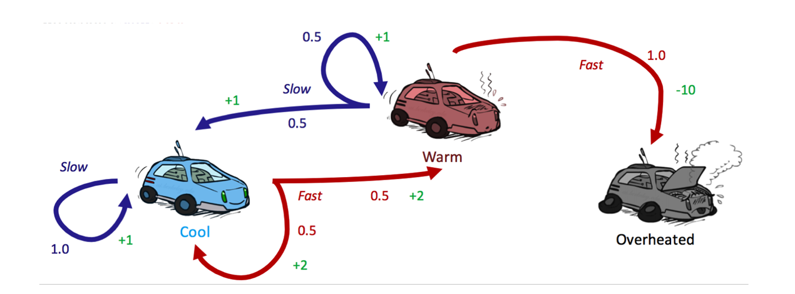
我们通过初始化所有 \(U_0(s) = 0\) 开始值迭代：
|          | cool | warm | overheated |
| :------- | :--- | :--- | :--------- |
| \(U_0\)  | 0    | 0    | 0          |

在第一轮更新中，我们可以如下计算 \(\forall s \in S, U_1(s)\)：
\[
\begin{aligned}
U_1(\text{cool}) &= \max\{ 1 \cdot [1 + 0.5 \cdot 0], \quad 0.5 \cdot [2 + 0.5 \cdot 0] + 0.5 \cdot [2 + 0.5 \cdot 0] \} \\
&= \max\{1, 2\} = 2 \\
U_1(\text{warm}) &= \max\{ 0.5 \cdot [1 + 0.5 \cdot 0] + 0.5 \cdot [1 + 0.5 \cdot 0], \quad 1 \cdot [-10 + 0.5 \cdot 0] \} \\
&= \max\{1, -10\} = 1 \\
U_1(\text{overheated}) &= \max\{\} = 0
\end{aligned}
\]

|          | cool | warm | overheated |
| :------- | :--- | :--- | :--------- |
| \(U_0\)  | 0    | 0    | 0          |
| \(U_1\)  | 2    | 1    | 0          |

类似地，我们可以重复该过程，用我们新得到的 \(U_1(s)\) 值来计算第二轮更新，得到 \(U_2(s)\)。

\[
\begin{aligned}
U_2(\text{cool}) &= \max\{ 1 \cdot [1 + 0.5 \cdot 2], \quad 0.5 \cdot [2 + 0.5 \cdot 2] + 0.5 \cdot [2 + 0.5 \cdot 1] \} \\
&= \max\{2, 2.75\} = 2.75 \\
U_2(\text{warm}) &= \max\{ 0.5 \cdot [1 + 0.5 \cdot 2] + 0.5 \cdot [1 + 0.5 \cdot 1], \quad 1 \cdot [-10 + 0.5 \cdot 0] \} \\
&= \max\{1.75, -10\} = 1.75 \\
U_2(\text{overheated}) &= \max\{\} = 0
\end{aligned}
\]
|          | cool | warm | overheated |
| :------- | :--- | :--- | :--------- |
| \(U_0\)  | 0    | 0    | 0          |
| \(U_1\)  | 2    | 1    | 0          |
| \(U_2\)  | 2.75 | 1.75 | 0          |

值得观察的是，任何终止状态的 \(U^*(s)\) 必须为 0，因为无法从任何终止状态采取任何动作来获得任何奖励。
### 2. Policy Extraction
回想一下，我们求解 MDP 的最终目标是确定一个最优策略。一旦确定了状态的所有最优价值，就可以使用一种称为策略提取的方法来做到这一点。策略提取背后的直觉非常简单：如果你处于状态 s，你应该采取能产生最大期望效用的动作 a。毫不奇怪，a 是将我们带到具有最大 Q-值的 Q-状态的那个动作，从而可以给出最优策略的正式定义：
\[
\forall s \in S, \quad \pi^*(s) = \arg\max_a Q^*(s, a) = \arg\max_a \sum_{s'} T(s, a, s') [R(s, a, s') + \gamma U^*(s')]
\]
出于性能原因，最好记住，对于策略提取来说，拥有状态的最优 Q-值是很有用的，在这种情况下，只需要一个 argmax 操作就可以确定从一个状态出发的最优动作。如果只存储每个 \(U^*(s)\)，则意味着在应用 argmax 之前，我们必须使用贝尔曼方程重新计算所有必要的 Q-值，这相当于执行深度为 1 的期望极大化。
### 3. Q-Value Iteration
在使用值迭代求解最优策略时，我们首先找到所有最优价值，然后使用策略提取提取策略。然而，你可能已经注意到，我们还处理另一种编码了最优策略信息的价值：Q-值。
Q-值迭代是一种计算时间限制 Q-值的动态规划算法。它由以下方程描述：
\[
Q_{k+1}(s, a) \leftarrow \sum_{s'} T(s, a, s') [R(s, a, s') + \gamma \max_{a'} Q_k(s', a')]
\]
请注意，这个更新只是对值迭代更新规则的轻微修改。实际上，唯一的真正区别在于 max 运算符在动作上的位置发生了变化，因为当我们处于状态时，我们在转移之前选择动作，但当我们处于 Q-状态时，我们在转移之后、选择新动作之前。一旦我们有了每个状态和动作的最优 Q-值，我们就可以通过简单地选择具有最高 Q-值的动作来找到该状态的策略。
### 4. Policy Iteration
值迭代可能相当慢。在每次迭代中，我们必须更新所有 \(|S|\) 个状态的值（其中 \(|n|\) 指基数运算符），当我们计算每个动作的 Q-值时，每个状态都需要遍历所有 \(|A|\) 个动作。而计算这些 Q-值中的每一个，又需要再次遍历每个 \(|S|\) 个状态，导致较差的运行时间 \(O(|S|^2|A|)\)。此外，当我们想要确定的只是 MDP 的最优策略时，值迭代往往会做很多过度计算，因为通过策略提取计算出的策略通常比价值本身收敛得快得多。针对这些缺陷的解决方法是使用策略迭代作为替代方案，这是一种在保持值迭代的最优性的同时提供显著性能提升的算法。策略迭代操作如下：
1.  定义一个初始策略。这可以是任意的，但初始策略越接近最终的最优策略，策略迭代收敛得越快。
2.  重复以下步骤直到收敛：
    - 使用策略评估评估当前策略。对于一个策略 \(\pi\)，策略评估意味着计算所有状态 s 的 \(U^\pi(s)\)，其中 \(U^\pi(s)\) 是从状态 s 开始遵循 \(\pi\) 时的期望效用：
        \[
        U^\pi(s) = \sum_{s'} T(s, \pi(s), s') [R(s, \pi(s), s') + \gamma U^\pi(s')]
        \]
        将策略迭代在第 i 次迭代的策略定义为 \(\pi_i\)。由于我们为每个状态固定了一个动作，我们不再需要 max 运算符，这实际上给我们留下了一个由上述规则生成的 \(|S|\) 个方程组成的系统。然后可以通过简单地求解这个系统来计算每个 \(U^{\pi_i}(s)\)。或者，我们也可以像值迭代一样，使用以下更新规则直到收敛来计算 \(U^{\pi_i}(s)\)：
        \[
        U^{\pi_i}_{k+1}(s) \leftarrow \sum_{s'} T(s, \pi_i(s), s') [R(s, \pi_i(s), s') + \gamma U^{\pi_i}_k(s')]
        \]
        然而，在实践中，第二种方法通常较慢。
    - 一旦我们评估了当前策略，使用策略改进来生成一个更好的策略。策略改进使用策略评估生成的状态价值上的策略提取来生成这个新的、改进后的策略：
        \[
        \pi_{i+1}(s) = \arg\max_a \sum_{s'} T(s, a, s') [R(s, a, s') + \gamma U^{\pi_i}(s')]
        \]
        如果 \(\pi_{i+1} = \pi_i\)，算法已收敛，我们可以得出结论 \(\pi_{i+1} = \pi_i = \pi^*\)。

让我们最后一次过一遍我们的赛车示例，看看使用策略迭代是否得到与值迭代相同的策略。回想一下，我们使用的折扣因子是 \(\gamma = 0.5\)。
我们从一个初始策略总是慢行开始：
|          | cool | warm | overheated |
| :------- | :--- | :--- | :--------- |
| \(\pi_0\) | slow | slow | -          |

由于终止状态没有出动作，没有策略可以给它们赋值。因此，像我们所做的那样，将状态 overheated 从考虑中忽略是合理的，只需为任何终止状态 s 分配 \(\forall i, U^{\pi_i}(s) = 0\)。下一步是对 \(\pi_0\) 运行一轮策略评估：
\[
\begin{aligned}
U^{\pi_0}(\text{cool}) &= 1 \cdot [1 + 0.5 \cdot U^{\pi_0}(\text{cool})] \\
U^{\pi_0}(\text{warm}) &= 0.5 \cdot [1 + 0.5 \cdot U^{\pi_0}(\text{cool})] + 0.5 \cdot [1 + 0.5 \cdot U^{\pi_0}(\text{warm})]
\end{aligned}
\]
求解这个关于 \(U^{\pi_0}(\text{cool})\) 和 \(U^{\pi_0}(\text{warm})\) 的方程组得到：
|            | cool | warm | overheated |
| :--------- | :--- | :--- | :--------- |
| \(U^{\pi_0}\) | 2    | 2    | 0          |

我们现在可以用这些值运行策略提取：
\[
\begin{aligned}
\pi_1(\text{cool}) &= \arg\max \{ \text{slow}: 1 \cdot [1 + 0.5 \cdot 2], \quad \text{fast}: 0.5 \cdot [2 + 0.5 \cdot 2] + 0.5 \cdot [2 + 0.5 \cdot 2] \} \\
&= \arg\max \{ \text{slow}: 2, \quad \text{fast}: 3 \} = \text{fast} \\
\pi_1(\text{warm}) &= \arg\max \{ \text{slow}: 0.5 \cdot [1 + 0.5 \cdot 2] + 0.5 \cdot [1 + 0.5 \cdot 2], \quad \text{fast}: 1 \cdot [-10 + 0.5 \cdot 0] \} \\
&= \arg\max \{ \text{slow}: 3, \quad \text{fast}: -10 \} = \text{slow}
\end{aligned}
\]
运行第二轮策略迭代得到 \(\pi_2(\text{cool}) = \text{fast}\) 和 \(\pi_2(\text{warm}) = \text{slow}\)。由于这与 \(\pi_1\) 是相同的策略，我们可以得出结论 \(\pi_1 = \pi_2 = \pi^*\)。请自行验证！
|          | cool | warm |
| :------- | :--- | :--- |
| \(\pi_0\) | slow | slow |
| \(\pi_1\) | fast | slow |
| \(\pi_2\) | fast | slow |

这个例子展示了策略迭代的真正力量：仅仅两次迭代，我们就已经为赛车 MDP 找到了最优策略！这比我们在同一个 MDP 上运行值迭代时所能说的要好得多，后者在我们执行了两次更新后，距离收敛还有几次迭代。
### 5. Summary
上面呈现的材料有很多容易混淆的地方。我们介绍了值迭代、策略迭代、策略提取和策略评估，所有这些看起来都很相似，都使用贝尔曼方程，但有细微的变化。以下是每个算法目的的总结：
- 值迭代：用于通过迭代更新直到收敛来计算状态的最优价值。
- 策略评估：用于计算在特定策略下的状态价值。
- 策略提取：用于在给定某个状态价值函数的情况下确定一个策略。如果状态价值是最优的，这个策略将是最优的。该方法在运行值迭代后使用，用于从最优状态价值计算最优策略；或者作为策略迭代中的子程序，用于为当前估计的状态价值计算最佳策略。
- 策略迭代：一种封装了策略评估和策略提取的技术，用于迭代收敛到最优策略。由于策略通常比状态价值收敛得快得多，它往往优于值迭代。
___
[返回目录](#目录)
___
## Note 19: ML I<a id = "note19"></a>
### 1. Machine Learning
在之前几篇笔记中，我们学习了各种有助于我们在不确定性下进行推理的模型。到目前为止，我们一直假设我们所使用的概率模型是理所当然的，而我们所使用的底层概率表的生成方法则被抽象掉了。当我们深入讨论机器学习时，我们将开始打破这种抽象屏障。机器学习是计算机科学的一个广阔领域，它涉及根据给定的数据构建和/或学习特定模型的参数。
有许多机器学习算法处理许多不同类型的问题和不同类型的数据，它们根据希望完成的任务和处理的数据类型进行分类。机器学习算法的两个主要子类是监督学习算法和无监督学习算法。监督学习算法推断输入数据和相应输出数据之间的关系，以便预测新的、以前未见过的输入数据的输出。另一方面，无监督学习算法的输入数据没有任何相应的输出数据，因此它处理的是识别数据点之间或内部的内在结构，并据此对它们进行分组和/或处理。在本课程中，我们将讨论的算法仅限于监督学习任务。
一旦你有了准备用来学习的数据集，机器学习过程通常涉及将数据集分成三个不同的子集。第一个，训练数据，用于实际生成一个将输入映射到输出的模型。然后，验证数据用于通过预测输入并生成准确率分数来衡量模型的性能。如果你的模型表现不如预期，你总是可以回去重新训练，要么调整称为超参数的特定于模型的值，要么完全使用不同的学习算法，直到你对结果满意为止。最后，使用你的模型对第三个也是最后一个数据子集，即测试集，进行预测。测试集是你在开发结束前智能体从未见过的数据部分，相当于评估在真实世界数据上性能的“期末考试”。
接下来，我们将介绍一些基础的机器学习算法，如朴素贝叶斯、线性回归、逻辑回归和感知机算法。
### 2. Naive Bayes
我们将通过一个机器学习算法的具体例子来展开我们对机器学习的讨论。考虑构建一个电子邮件垃圾邮件过滤器的常见问题，该过滤器将邮件分为垃圾邮件（不需要的邮件）或正常邮件（想要的邮件）。这样的问题被称为分类问题——给定各种数据点（在这种情况下，每封电子邮件是一个数据点），我们的目标是将它们分成两个或多个类别之一。对于分类问题，我们得到一个由数据点及其相应标签组成的训练集，这些标签通常是几个离散值之一。
正如我们所讨论的，我们的目标是使用这个训练数据（电子邮件，以及每封邮件的垃圾/正常标签）来学习某种关系，我们可以用它来对以前未见过的电子邮件进行预测。在本节中，我们将描述如何构建一种用于解决分类问题的模型，称为朴素贝叶斯分类器。
为了训练一个将电子邮件分类为垃圾邮件或正常邮件的模型，我们需要一些包含预先分类的电子邮件的训练数据，我们可以从中学习。然而，电子邮件只是文本字符串，为了学习任何有用的东西，我们需要从每封邮件中提取某些称为特征的属性。特征可以是任何东西，从特定单词计数到文本模式，再到你能想象到的数据的几乎任何其他属性。
为训练提取的特定特征通常取决于你试图解决的特定问题，而你决定选择哪些特征通常会极大地影响模型的性能。决定使用哪些特征被称为特征工程，是机器学习的基础，但出于本课程的目的，你可以假设你总是会得到任何给定数据集的提取特征。在本笔记中，\(f(x)\) 指的是在将所有输入 x 放入模型之前应用于它们的特征函数。
现在假设你有一个包含 n 个单词的字典，并且从每封电子邮件中提取一个特征向量 \(F \in \mathbb{R}^n\)，其中 F 中的第 i 个条目是一个随机变量 \(F_i\)，它可以取值 0 或 1，具体取决于字典中的第 i 个单词是否出现在所考虑的电子邮件中。例如，如果 \(F_{200}\) 是单词“free”的特征，那么如果“free”出现在邮件中，我们将有 \(F_{200} = 1\)，否则为 0。通过这些定义，我们可以更具体地定义如何预测一封电子邮件是否是垃圾邮件——如果我们能生成每个 \(F_i\) 和标签 Y 之间的联合概率表，我们就可以计算任何一封给定特征向量的电子邮件是垃圾邮件或正常邮件的概率。具体来说，我们可以计算
$$P(Y = \text{spam} | F_1 = f_1, ..., F_n = f_n)$$
和
$$P(Y = \text{ham} | F_1 = f_1, ..., F_n = f_n)$$
然后简单地根据这两个概率中较高的一个来标记电子邮件。不幸的是，由于我们有 n 个特征和 1 个标签，每个都可以取 2 个不同的值，对应于这个分布的联合概率表需要的表大小是 n 的指数级，有 \(2^{n+1}\) 个条目——非常不切实际！这个问题通过使用贝叶斯网络对联合概率表进行建模来解决，同时做出一个关键性的简化假设：在给定类别标签的情况下，每个特征 \(F_i\) 独立于所有其他特征。这是一个非常强的建模假设（这也是朴素贝叶斯被称为“朴素”的原因），但它简化了推理，并且在实践中通常效果很好。它引出了以下贝叶斯网络来表示我们想要的联合概率分布。
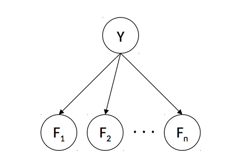
注意，先前课程中描述的 d-分离规则可以立即清楚地表明，在这个贝叶斯网络中，给定 Y，每个 \(F_i\) 条件独立于所有其他 \(F_i\)。现在我们有一个包含 2 个条目的 P(Y) 表，以及 n 个 P(Fi | Y) 表，每个有 \(2^2 = 4\) 个条目，总共 \(4n + 2\) 个条目，是 n 的线性关系！这个简化假设突显了统计效率概念带来的权衡；我们有时需要妥协模型的复杂性，以便保持在计算资源的限制范围内。
实际上，在特征数量足够低的情况下，通常会对特征之间的关系做出更多假设以生成更好的模型（这相当于在你的贝叶斯网络中添加边）。采用这个模型后，对未知数据点进行预测相当于在我们的贝叶斯网络上运行推理。我们观察到了 \(F_1, \cdots, F_n\) 的值，并希望选择在这些特征条件下概率最高的 Y 值：
\[
\begin{aligned}
\text{prediction}(f_1, \cdots f_n) &= \arg\max_y P(Y = y | F_1 = f_1, ... F_N = f_n) \\
&= \arg\max_y P(Y = y, F_1 = f_1, ... F_N = f_n) \\
&= \arg\max_y P(Y = y) \prod_{i=1}^n P(F_i = f_i | Y = y)
\end{aligned}
\]
其中第一步是因为在归一化或未归一化的分布中，概率最高的类将是相同的，第二步直接来自朴素贝叶斯的独立性假设，即给定类别标签，特征相互独立（如图形模型结构所示）。
从垃圾邮件过滤器推广开来，现在假设有 k 个类别标签（Y 的可能值）。此外，注意到我们想要的概率——给定我们的特征，每个标签 \(y_i\) 的概率 \(P(Y = y_i | F_1 = f_1, ..., F_n = f_n)\)——与联合概率 \(P(Y = y_i, F_1 = f_1, ..., F_n = f_n)\) 成正比，我们可以计算：
\[
P(Y, F_1 = f_1, ..., F_n = f_n) =
\begin{bmatrix}
P(Y = y_1, F_1 = f_1, ..., F_n = f_n) \\
P(Y = y_2, F_1 = f_1, ..., F_n = f_n) \\
\vdots \\
P(Y = y_k, F_1 = f_1, ..., F_n = f_n)
\end{bmatrix}
\]
\[
\begin{bmatrix}
P(Y = y_1) \prod_i P(F_i = f_i | Y = y_1) \\
P(Y = y_2) \prod_i P(F_i = f_i | Y = y_2) \\
\vdots \\
P(Y = y_k) \prod_i P(F_i = f_i | Y = y_k)
\end{bmatrix}
\]
对应于特征向量 F 的类别标签的预测就是上述计算向量中最大值对应的标签：
\[
\text{prediction}(F) = \arg\max_{y_i} P(Y = y_i) \prod_j P(F_j = f_j | Y = y_i)
\]
我们现在已经学习了朴素贝叶斯分类器建模假设背后的基本理论，以及如何使用它进行预测，但尚未触及我们究竟如何从输入数据中学习贝叶斯网络中使用的条件概率表。这将在我们下一个讨论主题——参数估计中介绍。
### 3. Parameter Estimation
假设你有一组 N 个样本点或观测值 \(x_1, ..., x_N\)，并且你认为这些数据是从一个由未知值 \(\theta\) 参数化的分布中抽取的。换句话说，你认为每个观测值的概率 \(P_\theta(x_i)\) 是 \(\theta\) 的函数。例如，我们可能正在抛一枚硬币，其正面朝上的概率为 \(\theta\)。
给定你的样本，你如何“学习”\(\theta\) 的最可能值？例如，如果我们抛了 10 次硬币，看到其中 7 次是正面，我们应该为 \(\theta\) 选择什么值？这个问题的一个答案是推断 \(\theta\) 等于从你假设的概率分布中选取你的样本 \(x_1, ..., x_N\) 的概率最大化的那个值。机器学习中一种常用且基本的方法，称为最大似然估计，正是做这个的。
最大似然估计通常做出以下简化假设：
- 每个样本来自相同的分布。换句话说，每个 \(x_i\) 是同分布的。在我们的抛硬币例子中，每次抛硬币有相同的概率 \(\theta\) 出现正面。
- 在给定我们分布的参数的情况下，每个样本 \(x_i\) 条件独立于其他样本。这是一个很强的假设，但正如我们将看到的，它极大地简化了最大似然估计问题，并且在实践中通常效果很好。在抛硬币的例子中，一次抛掷的结果不会影响其他任何一次。
- 在我们看到任何数据之前，\(\theta\) 的所有可能值是等可能的（这被称为均匀先验）。

以上前两个假设通常被称为独立同分布。上述第三个假设使最大似然估计方法成为最大后验方法的一个特例，后者允许非均匀先验。
现在让我们定义样本的似然\(L(\theta)\)，这是一个表示从我们的分布中抽取到我们的样本的概率的函数。对于一个固定的样本 \(x_1, ..., x_N\)，似然只是 \(\theta\) 的函数：
\[
L(\theta) = P_\theta(x_1, ..., x_N)
\]
使用我们的简化假设，即样本 \(x_i\) 是独立同分布的，似然函数可以重新表达如下：
\[
L(\theta) = \prod_{i=1}^N P_\theta(x_i)
\]
我们如何找到最大化这个函数的 \(\theta\) 值？这将是最能解释我们观察到的数据的 \(\theta\) 值。从微积分中回想，在函数实现最大值和最小值的点，其关于每个输入的一阶导数必须等于零。因此，\(\theta\) 的最大似然估计是满足以下方程的值：
\[
\frac{\partial}{\partial \theta} L(\theta) = 0
\]
让我们通过一个例子使这个概念更具体。假设你有一个装满红色和蓝色球的袋子，不知道每种各有多少。你通过从袋子里取出一个球，记下颜色，然后把球放回去（有放回抽样）来抽取样本。从这个袋子里抽取三个球的样本，结果是红、红、蓝。这似乎意味着我们应该推断袋子里有 2/3 的球是红色，1/3 的球是蓝色。我们将假设从袋子里取出的每个球是红色的概率为 \(\theta\)，是蓝色的概率为 \(1-\theta\)，对于某个我们想要估计的 \(\theta\) 值（这被称为伯努利分布）：
\[
P_\theta(x_i) = \begin{cases} \theta & x_i = \text{red} \\ (1-\theta) & x_i = \text{blue} \end{cases}
\]
那么样本的似然是：
\[
L(\theta) = \prod_{i=1}^3 P_\theta(x_i) = P_\theta(x_1 = \text{red}) P_\theta(x_2 = \text{red}) P_\theta(x_3 = \text{blue}) = \theta^2 \cdot (1-\theta)
\]
最后一步是将似然的导数设为 0 并求解 \(\theta\)：
\[
\frac{\partial}{\partial \theta} L(\theta) = \frac{\partial}{\partial \theta} \theta^2 \cdot (1-\theta) = \theta(2 - 3\theta) = 0
\]
解这个方程得到 \(\theta = \frac{2}{3}\)，这直观上是合理的！（还有第二个解，\(\theta = 0\)——但这对应于似然函数的最小值，因为 \(L(0) = 0 < L(\frac{2}{3}) = \frac{4}{27}\)。）
### 4. Maximum Likelihood for Naive Bayes
现在让我们回到为垃圾邮件分类器推断条件概率表的问题，首先回顾一下我们知道的变量：
- n——我们字典中的单词数。
- N——你用于训练的观测值（电子邮件）的数量。在我们接下来的讨论中，我们还定义 \(N_h\) 为标记为正常邮件的训练样本数，\(N_s\) 为标记为垃圾邮件的训练样本数。注意 \(N_h + N_s = N\)。
- \(F_i\)——一个随机变量，如果所考虑的电子邮件中存在第 i 个字典单词，则为 1，否则为 0。
- Y——一个随机变量，根据相应电子邮件的标签，可以是 spam 或 ham。
- \(f_i^{(j)}\)——这指的是训练集中第 j 项中随机变量 \(F_i\) 的解析值。换句话说，如果单词 i 出现在第 j 封所考虑的电子邮件中，则每个 \(f_i^{(j)}\) 是 1，否则为 0。这是我们第一次看到这种表示法，但在接下来的推导中会很有用。

现在在每个条件概率表 \(P(F_i|Y)\) 中，注意我们有两个不同的伯努利分布：\(P(F_i|Y=\text{ham})\) 和 \(P(F_i|Y=\text{spam})\)。为简单起见，让我们具体考虑 \(P(F_i|Y=\text{ham})\)，并尝试找到参数 \(\theta = P(F_i=1|Y=\text{ham})\) 的最大似然估计，即字典中第 i 个单词出现在正常邮件中的概率。由于我们的训练集中有 \(N_h\) 封正常邮件，我们有 \(N_h\) 个关于单词 i 是否出现在正常邮件中的观测值。因为我们的模型假设给定其标签，每个单词的出现服从伯努利分布，我们可以将似然函数表述如下：
\[
L(\theta) = \prod_{j=1}^{N_h} P(F_i = f_i^{(j)} | Y = \text{ham}) = \prod_{j=1}^{N_h} \theta^{f_i^{(j)}} (1-\theta)^{1-f_i^{(j)}}
\]
第二步来自一个小的数学技巧：如果 \(f_i^{(j)} = 1\)，则
\[
P(F_i = f_i^{(j)} | Y = \text{ham}) = \theta^1 (1-\theta)^0 = \theta
\]
类似地，如果 \(f_i^{(j)} = 0\)，则
\[
P(F_i = f_i^{(j)} | Y = \text{ham}) = \theta^0 (1-\theta)^1 = (1-\theta)
\]
为了计算 \(\theta\) 的最大似然估计，回顾一下下一步是计算 \(L(\theta)\) 的导数并将其设为 0。尝试这样做被证明是相当困难的，因为隔离和求解 \(\theta\) 并非易事。相反，我们将采用一个在最大似然推导中非常常见的技巧，那就是转而找到最大化似然函数对数的 \(\theta\) 值。因为 \(\log(x)\) 是一个严格递增函数，找到最大化 \(\log L(\theta)\) 的值也将最大化 \(L(\theta)\)。\(\log L(\theta)\) 的展开如下：
\[
\begin{aligned}
\log L(\theta) &= \log \prod_{j=1}^{N_h} \theta^{f_i^{(j)}} (1-\theta)^{1-f_i^{(j)}} \\
&= \sum_{j=1}^{N_h} \log \left( \theta^{f_i^{(j)}} (1-\theta)^{1-f_i^{(j)}} \right) \\
&= \sum_{j=1}^{N_h} \log \theta^{f_i^{(j)}} + \sum_{j=1}^{N_h} \log (1-\theta)^{1-f_i^{(j)}} \\
&= \log(\theta) \sum_{j=1}^{N_h} f_i^{(j)} + \log(1-\theta) \sum_{j=1}^{N_h} (1 - f_i^{(j)})
\end{aligned}
\]
注意，在上述推导中，我们使用了 \(\log\) 函数的性质：\(\log(a^c) = c \cdot \log(a)\) 和 \(\log(ab) = \log(a) + \log(b)\)。现在我们将似然函数的对数的导数设为 0 并求解 \(\theta\)：
\[
\begin{aligned}
\frac{\partial}{\partial \theta} \left[ \log(\theta) \sum_{j=1}^{N_h} f_i^{(j)} + \log(1-\theta) \sum_{j=1}^{N_h} (1 - f_i^{(j)}) \right] &= 0 \\
\frac{1}{\theta} \sum_{j=1}^{N_h} f_i^{(j)} - \frac{1}{(1-\theta)} \sum_{j=1}^{N_h} (1 - f_i^{(j)}) &= 0 \\
\frac{1}{\theta} \sum_{j=1}^{N_h} f_i^{(j)} &= \frac{1}{(1-\theta)} \sum_{j=1}^{N_h} (1 - f_i^{(j)}) \\
(1-\theta) \sum_{j=1}^{N_h} f_i^{(j)} &= \theta \sum_{j=1}^{N_h} (1 - f_i^{(j)}) \\
\sum_{j=1}^{N_h} f_i^{(j)} - \theta \sum_{j=1}^{N_h} f_i^{(j)} &= \theta \sum_{j=1}^{N_h} 1 - \theta \sum_{j=1}^{N_h} f_i^{(j)} \\
\sum_{j=1}^{N_h} f_i^{(j)} &= \theta \cdot N_h \\
\theta &= \frac{1}{N_h} \sum_{j=1}^{N_h} f_i^{(j)}
\end{aligned}
\]
我们得出了一个非常简单的最终结果！根据上面的公式，\(\theta\) 的最大似然估计对应于统计单词 i 出现的正常邮件数量除以正常邮件总数。你可能认为这对一个直观的结果来说工作量很大（确实如此），但这里的推导和技术对于比我们这里为每个特征使用的简单伯努利分布更复杂的分布是有用的。总而言之，在这个具有伯努利特征分布的朴素贝叶斯模型中，在任何给定的类别中，任何结果概率的最大似然估计对应于该结果的计数除以给定类别的样本总数。上述推导可以推广到我们有超过两个类别和每个特征有超过两个结果的情况，但这里不提供此推导。
### 5. Smoothing
尽管最大似然估计是一种非常强大的参数估计方法，但糟糕的训练数据常常会导致不幸的后果。例如，如果每次单词“minute”出现在我们训练集中的一封电子邮件中，那封电子邮件就被归类为垃圾邮件，那么我们训练好的模型将学到：
\[
P(F_{\text{minute}} = 1 | Y = \text{ham}) = 0
\]
因此，在一封未见过的邮件中，如果“minute”这个词出现，那么 \(P(Y = \text{ham}) \prod_i P(F_i|Y = \text{ham}) = 0\)，所以你的模型永远不会将任何包含“minute”单词的邮件归类为正常邮件。这是过拟合的一个经典例子，即构建的模型不能很好地推广到以前未见过的数据。仅仅因为一个特定的词没有出现在你的训练数据的邮件中，这并不意味着它不会出现在你的测试数据或现实世界的邮件中。朴素贝叶斯分类器的过拟合可以通过拉普拉斯平滑来缓解。从概念上讲，强度为 k 的拉普拉斯平滑假设每个结果额外出现了 k 次。因此，如果对于一个给定的样本，你对一个可以取 \(|X|\) 个不同值的结果 x 的最大似然估计，基于大小为 N 的样本，是：
\[
P_{\text{MLE}}(x) = \frac{\text{count}(x)}{N}
\]
那么强度为 k 的拉普拉斯估计是：
\[
P_{\text{LAP},k}(x) = \frac{\text{count}(x) + k}{N + k|X|}
\]
这个方程说明了什么？我们假设看到了每个结果的 k 个额外实例，因此就像看到了 x 的 \(\text{count}(x) + k\) 个实例，而不是 \(\text{count}(x)\) 个实例。类似地，如果我们看到了 \(|X|\) 个类别中每个的 k 个额外实例，那么我们必须将 \(k|X|\) 加到我们原始的样本数 N 上。这两个陈述一起产生了上面的公式。计算条件概率的拉普拉斯估计（这对于计算不同类别下结果的拉普拉斯估计很有用）也有类似的结果：
\[
P_{\text{LAP},k}(x|y) = \frac{\text{count}(x, y) + k}{\text{count}(y) + k|X|}
\]
拉普拉斯平滑有两个特别值得注意的情况。第一种是当 \(k = 0\) 时，那么 \(P_{\text{LAP},0}(x) = P_{\text{MLE}}(x)\)。第二种是 \(k = \infty\) 的情况。观察到每个结果的非常大、无限多的实例会使你的实际样本的结果变得无关紧要，因此你的拉普拉斯估计意味着每个结果是等可能的。实际上：
\[
P_{\text{LAP},\infty}(x) = \frac{1}{|X|}
\]
适合在你的模型中使用的 k 的具体值通常通过反复试验来确定。k 是你的模型中的一个超参数，这意味着你可以将它设置为你想要的任何值，并查看哪个值在你的验证数据上产生最佳的预测准确率/性能。
___
[返回目录](#目录)
___
## Note 20: ML II<a id = "note20"></a>
### 1. Perceptron
### 2. Linear Classifiers
朴素贝叶斯背后的核心思想是提取训练数据的某些属性，称为特征，然后估计给定特征下标签的概率：\( P(y | f_1, f_2, ... f_n) \)。因此，给定一个新的数据点，我们可以提取相应的特征，并将新数据点分类为给定特征下概率最高的标签。然而，这需要我们去估计分布，而我们是用最大似然估计来做的。如果我们决定不去估计概率分布呢？让我们先看一个简单的线性分类器，它可以用于二元分类，即标签只有两种可能：正类或负类。
线性分类器的基本思想是使用特征的线性组合来进行分类——这个值我们称为激活值。具体来说，激活函数接收一个数据点，将数据点的每个特征 \( f_i(x) \) 乘以相应的权重 \( w_i \)，然后输出所有结果值的和。用向量形式表示，这可以写成权重向量 \( w \) 与特征化数据点向量 \( f(x) \) 的点积：
\[
\text{activation}_w(x) = h_w(x) = \sum_i w_i f_i(x) = w^T f(x) = w \cdot f(x)
\]
如何使用激活值进行分类？对于二元分类，当数据点的激活值为正时，我们将该数据点分类为正类；如果为负，则分类为负类。
$$
\text{classify}(\mathbf{x}) = 
\begin{cases} 
\text{+} & \text{if } h_w(\mathbf{x}) > 0 \\ 
\text{--} & \text{if } h_w(\mathbf{x}) < 0 
\end{cases}
$$
为了从几何上理解这一点，让我们重新审视向量化的激活函数。我们可以将点积改写如下，其中 \( \| \cdot \| \) 是模长运算符，\( \theta \) 是 \( w \) 和 \( f(x) \) 之间的夹角：
\[
h_w(x) = w \cdot f(x) = \| w \| \| f(x) \| \cos(\theta)
\]
由于模长总是非负的，并且我们的分类规则看的是激活值的符号，那么决定类别的唯一项就是 \( \cos(\theta) \)。
$$
\text{classify}(x) = 
\begin{cases}
\text{+} & \text{如果 } \cos(\theta) > 0 \\
\text{--} & \text{如果 } \cos(\theta) < 0
\end{cases}
$$
因此，我们关心的是 \( \cos(\theta) \) 何时为负或正。容易看出，当 \( \theta < \frac{\pi}{2} \) 时，\( \cos(\theta) \) 在区间 (0,1] 内，为正；当 \( \theta > \frac{\pi}{2} \) 时，\( \cos(\theta) \) 在区间 [-1,0) 内，为负。你可以通过单位圆来确认这一点。本质上，我们的简单线性分类器是在检查新数据点的特征向量是否大致与预定义的权重向量指向同一方向，如果是，则应用正类标签。
$$
\text{classify}(x) = 
\begin{cases}
\text{+} & \text{如果 } \theta < \frac{\pi}{2} \text{（即锐角）} \\
\text{--} & \text{如果 } \theta > \frac{\pi}{2} \text{（即钝角）}
\end{cases}
$$
到目前为止，我们还没有考虑 \( \text{activation}_w(x) = w^T f(x) = 0 \) 的点。遵循同样的逻辑，我们会发现这些点的 \( \cos(\theta) = 0 \)。此外，这些点的 \( \theta = \frac{\pi}{2} \)（即90度）。换句话说，这些是特征向量与 \( w \) 正交的数据点。我们可以添加一条与 \( w \) 正交的蓝色虚线，任何位于这条线上的特征向量其激活值都将为0。
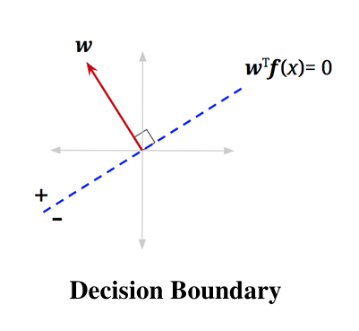
我们称这条蓝线为决策边界，因为它是将我们分类为正类的区域与分类为负类的区域分开的边界。在更高维空间中，线性决策边界通常被称为超平面。超平面是一个比潜在空间低一维的线性曲面，从而将曲面一分为二。对于一般的分类器（非线性的），决策边界可能不是线性的，但可以简单地定义为特征向量空间中分隔各类别的曲面。对于落在决策边界上的点，我们可以应用任意一个标签，因为两个类别同样有效（在下面的算法中，我们将线上的点分类为正类）。
### 3. Binary Perceptron
很好，现在你知道线性分类器是如何工作的了，但如何构建一个好的分类器呢？构建分类器时，你从带有正确类别标签的数据开始，我们称之为训练集。你通过在训练数据上评估分类器，将其与训练标签进行比较，并调整分类器的参数，直到达到你的目标。
让我们探讨一种简单的线性分类器的具体实现：二元感知机。感知机是一种二元分类器——尽管它可以扩展用于处理两个以上的类别。二元感知机的目标是找到一个能够完美分隔训练数据的决策边界。换句话说，我们寻求最佳的权重——最佳的 \( w \)——使得任何特征化的训练点与权重相乘后都能被完美分类。
算法
感知机算法的工作原理如下：
1. 将所有权重初始化为 0：\( w = 0 \)
2. 对于每个训练样本，其特征为 \( f(x) \)，真实类别标签为 \( y^* \in \{-1, +1\} \)，执行：
   (a) 使用当前权重对样本进行分类，令 \( y \) 为当前 \( w \) 预测的类别：
   \[
   y = \text{classify}(x) = 
   \begin{cases}
   +1 & \text{如果 } h_w(x) = w^T f(x) > 0 \\
   -1 & \text{如果 } h_w(x) = w^T f(x) < 0
   \end{cases}
   \]
   (b) 比较预测标签 \( y \) 与真实标签 \( y^* \)：
      * 如果 \( y = y^* \)，不做任何操作
      * 否则，如果 \( y \neq y^* \)，则更新你的权重：\( w \leftarrow w + y^* f(x) \)
3. 如果你遍历了每个训练样本而无需更新权重（所有样本都预测正确），则终止。否则，重复步骤 2。

权重更新
让我们检查并证明更新权重的过程。回想一下，在上面步骤 2b 中，当分类器正确时，什么也不改变。但当分类器错误时，权重向量按如下方式更新：
\[
w \leftarrow w + y^* f(x)
\]
其中 \( y^* \) 是真实标签，可以是 1 或 -1，\( x \) 是我们错误分类的训练样本。你可以将这个更新规则解释为：
- 情况 1：将正类误分类为负类，则 \( w \leftarrow w + f(x) \)
- 情况 2：将负类误分类为正类，则 \( w \leftarrow w - f(x) \)

为什么这样有效？一种看待这个问题的方式是将其视为一种平衡行为。误分类发生在训练样本的激活值远小于应有的值（导致情况 1 误分类）或远大于应有的值（导致情况 2 误分类）。
考虑情况 1，激活值应为正但实际为负。换句话说，激活值太小。我们应该如何调整 \( w \) 以纠正这个问题，并使该训练样本的激活值变大？为了确信我们的更新规则 \( w \leftarrow w + f(x) \) 确实做到了这一点，让我们更新 \( w \) 并看看激活值如何变化。
\[
h_{w + f(x)}(x) = (w + f(x))^T f(x) = w^T f(x) + f(x)^T f(x) = h_w(x) + f(x)^T f(x)
\]
使用我们的更新规则，我们看到新激活值增加了 \( f(x)^T f(x) \)，这是一个正数，因此表明我们的更新是合理的。激活值正在变大——更接近变为正数。
你可以对分类器因激活值太大（激活值应为负但实际为正）而误分类的情况重复同样的逻辑。你会发现更新将导致新激活值减少 \( f(x)^T f(x) \)，从而变小，更接近正确分类。
虽然这说明了为什么我们要加或减某些东西，但为什么我们要加减样本点的特征呢？一种好的思考方式是，决定这个分数的不仅仅是权重，分数是由权重乘以相关样本得到的。这意味着样本的某些部分比其他部分贡献更大。考虑下面的情况，其中 \( x \) 是我们给定的训练样本，真实标签 \( y^* = -1 \)：
\[
w^T = [2, 2, 2], \quad f(x) = \begin{bmatrix} 4 \\ 0 \\ 1 \end{bmatrix}, \quad h_w(x) = (2*4) + (2*0) + (2*1) = 10
\]
我们知道我们的权重需要减小，因为激活值需要为负才能正确分类。不过我们不想让它们都改变相同的量。你会注意到样本的第一个元素 4 对分数 10 的贡献远大于第三个元素，而第二个元素根本没有贡献。因此，一个合适的权重更新应该大幅度改变第一个权重，稍微改变第三个权重，而第二个权重根本不应该改变。毕竟，第二个和第三个权重可能根本没有问题，我们不想修复没坏的东西！
当考虑一个好的方法来改变我们的权重向量以满足上述愿望时，结果证明仅使用样本本身确实做到了我们想要的；它大幅改变了第一个权重，稍微改变了第三个权重，而第二个权重根本没变！
可视化也可能有所帮助。在下图中，\( f(x) \) 是一个正类（\( y^* = +1 \)）数据点的特征向量，它当前被误分类——它位于由“旧 \( w \)”定义的决策边界的错误一侧。将其加到权重向量上会产生一个新的权重向量，它与 \( f(x) \) 的夹角更小。它也会移动决策边界。在这个例子中，它移动了决策边界足够多，使得 \( x \) 现在将被正确分类（注意，错误不一定会被修正——这取决于权重向量的大小以及 \( f(x) \) 当前越过边界多远）。
偏置
如果你尝试根据目前提到的内容实现一个感知机，你会注意到一个特别不友好的怪癖。你最终画出的任何决策边界都会穿过原点。基本上，你的感知机只能产生可以由函数 \( w^T f(x) = 0, w, f(x) \in \mathbb{R}^n \) 表示的决策边界。问题是，即使在数据中存在能够分隔正负类的线性决策边界的问题中，这个边界也可能不经过原点，而我们希望能够画出这些线。
为了做到这一点，我们将修改我们的特征和权重，添加一个偏置项：在样本特征向量中添加一个始终为 1 的特征，并在权重向量中为这个特征添加一个额外的权重。这样做本质上允许我们产生一个可由 \( w^T f(x) + b = 0 \) 表示的决策边界，其中 \( b \) 是加权的偏置项（即权重向量中最后一个权重乘以 1）。
从几何上，我们可以通过思考激活函数在 \( w^T f(x) \) 时和带有偏置 \( w^T f(x) + b \) 时的样子来可视化这一点。为此，我们需要比特征化数据空间（下图中标记的数据空间）高一个维度。在上述所有部分中，我们只看到了数据空间的平面视图。
让我们看一个逐步运行感知机算法的例子。
让我们用感知机算法按顺序对每个数据点运行一次遍历。我们从权重向量 \([w_0, w_1, w_2] = [-1, 0, 0]\) 开始（其中 \( w_0 \) 是我们偏置特征的权重，记住偏置特征总是 1）。
训练集
| # | f1 | f2 | y* |
|---|---|---|---|
| 1 | 1  | 1  | -  |
| 2 | 3  | 2  | +  |
| 3 | 2  | 4  | +  |
| 4 | 3  | 4  | +  |
| 5 | 2  | 3  | -  |

单次感知机更新遍历
| 步骤 | 权重 | 分数 | 正确？ | 更新 |
|---|---|---|---|---|
| 1 | [-1, 0, 0] | -1·1 + 0·1 + 0·1 = -1 | 是 | 无 |
| 2 | [-1, 0, 0] | -1·1 + 0·3 + 0·2 = -1 | 否 | +[1, 3, 2] |
| 3 | [0, 3, 2] | 0·1 + 3·2 + 2·4 = 14 | 是 | 无 |
| 4 | [0, 3, 2] | 0·1 + 3·3 + 2·4 = 17 | 是 | 无 |
| 5 | [0, 3, 2] | 0·1 + 3·2 + 2·3 = 12 | 否 | -[1, 2, 3] |
| 6 | [-1, 1, -1] | ... | ... | ... |

我们在这里停止，但实际上这个算法会在所有数据点在一次遍历中被正确分类之前，对数据运行更多次遍历。
### 4. Multiclass Perceptron
上面介绍的感知机是一个二元分类器，但我们可以很容易地将其扩展到处理多个类别。主要区别在于我们如何设置权重以及如何更新这些权重。对于二元情况，我们有一个权重向量，其维度等于特征数量（加上偏置特征）。对于多类情况，我们将为每个类别设置一个权重向量，所以在 3 类情况下，我们有 3 个权重向量。为了对一个样本进行分类，我们通过计算特征向量与每个权重向量的点积来为每个类别计算一个分数。产生最高分数的类别就是我们选择的预测类别。
例如，考虑 3 类情况。假设样本的特征为 \( f(x) = [-2, 3, 1] \)，类别 0、1 和 2 的权重分别为：
\[
w_0 = [-2, 2, 1], \quad w_1 = [0, 3, 4], \quad w_2 = [1, 4, -2]
\]
计算每个类别的点积，得到分数 \( s_0 = 11, s_1 = 13, s_2 = 8 \)。因此，我们会预测 \( x \) 属于类别 1。
需要注意的一件重要事情是，在实际实现中，我们不会将权重作为单独的结构来跟踪，我们通常会将它们堆叠起来创建一个权重矩阵。这样，我们就不需要执行与类别数量一样多的点积，而可以执行一次矩阵-向量乘法。这在实践中往往效率更高（因为矩阵-向量乘法通常有高度优化的实现）。
在我们上面的例子中，那就是：
\[
W = \begin{bmatrix}
-2 & 2 & 1 \\
0 & 3 & 4 \\
1 & 4 & -2
\end{bmatrix}, \quad x = \begin{bmatrix}
-2 \\
3 \\
1
\end{bmatrix}
\]
而我们的标签将是：
\[
\arg\max(Wx) = \arg\max\left(\begin{bmatrix}11 \\ 13 \\ 8\end{bmatrix}\right) = 1
\]
随着权重的结构变化，当我们转向多类情况时，权重的更新也会改变。如果我们正确分类了数据点，那么就像二元情况一样什么也不做。如果我们选择了错误的类别，比如我们选择了类别 \( y \neq y^* \)，那么我们将特征向量加到真实类别 \( y^* \) 的权重向量上，并从预测类别 \( y \) 对应的权重向量中减去特征向量。在上面的例子中，假设正确的类别是类别 2，但我们预测了类别 1。我们现在将类别 1 对应的权重向量减去 \( x \)：
\[
w_1 = [0, 3, 4] - [-2, 3, 1] = [2, 0, 3]
\]
接下来，我们将特征向量加到正确类别（本例中为类别 2）的权重向量上：
\[
w_2 = [1, 4, -2] + [-2, 3, 1] = [-1, 7, -1]
\]
这相当于“奖励”正确的权重向量，“惩罚”误导的错误权重向量，而其他权重向量则保持不变。在考虑了权重和权重更新的差异之后，算法的其余部分基本相同：循环遍历每个样本点，在出错时更新权重，直到不再出错。
为了加入偏置项，执行与二元感知机相同的操作——在每个特征向量中添加一个额外的特征 1，并为每个类别的权重向量添加一个针对该特征的额外权重（这相当于在矩阵形式中添加一个额外的列）。
___
[返回目录](#目录)
___
## Note 21: ML III<a id = "note21"></a>
### 1. Linear Regression
现在我们将从之前对朴素贝叶斯的讨论转向线性回归。这种方法，也称为最小二乘法，其历史可以追溯到卡尔·弗里德里希·高斯，并且是机器学习与计量经济学中研究最深入的工具之一。
回归问题是机器学习问题的一种形式，其输出是一个连续变量（用 \(y\) 表示）。特征可以是连续的或分类的。我们将一组特征用 \(x \in \mathbb{R}^n\) 表示，其中 \(n\) 个特征，即 \(x = (x_1, ..., x_n)\)。
我们使用以下线性模型来预测输出：
\[
h_w(x) = w_0 + w_1 x_1 + \cdots w_n x_n
\]
其中，线性模型的权重 \(w_i\) 是我们想要估计的。权重 \(w_0\) 对应于模型的截距。有时在文献中，我们在特征向量 \(x\) 上加一个 1，以便将线性模型写成 \(w^T x\)，此时 \(x \in \mathbb{R}^{n+1}\)。
为了训练模型，我们需要一个衡量模型预测输出好坏程度的指标。为此，我们将使用 L2 损失函数，它使用 L2 范数来惩罚预测输出与实际输出之间的差异。如果我们的训练数据集有 \(N\) 个数据点，那么损失函数定义如下：
\[
\text{Loss}(h_w) = \frac{1}{2} \sum_{j=1}^{N} L_2(y_j, h_w(x_j)) = \frac{1}{2} \sum_{j=1}^{N} (y_j - h_w(x_j))^2 = \frac{1}{2} \|y - Xw\|_2^2
\]
注意，\(x_j\) 对应第 \(j\) 个数据点 \(x_j \in \mathbb{R}^n\)。添加项 \(\frac{1}{2}\) 只是为了简化闭式解的表达式。最后一个表达式是损失函数的等价形式，它使最小二乘的推导更容易。向量 \(y\)、矩阵 \(X\) 和向量 \(w\) 定义如下：
\[
y = \begin{bmatrix} y_1 \\ y_2 \\ \vdots \\ y_n \end{bmatrix}, \quad X = \begin{bmatrix} 1 & x_1^1 & \cdots & x_n^1 \\ 1 & x_1^2 & \cdots & x_n^2 \\ \vdots & \vdots & \ddots & \vdots \\ 1 & x_1^N & \cdots & x_n^N \end{bmatrix}, \quad w = \begin{bmatrix} w_0 \\ w_1 \\ \vdots \\ w_n \end{bmatrix}
\]
其中，\(y\) 是堆叠输出的向量，\(X\) 是特征向量矩阵，\(x_i^j\) 表示第 \(j\) 个数据点的第 \(i\) 个分量。用 \(\hat{w}\) 表示的最小二乘解现在可以使用基本的线性代数规则推导出来。更具体地说，我们将通过微分损失函数并将导数设为零来找到最小化损失函数的 \(\hat{w}\)。
\[
\begin{aligned}
\nabla_w \frac{1}{2} \|y - Xw\|_2^2 &= \nabla_w \frac{1}{2} (y - Xw)^T (y - Xw) \\
&= \nabla_w \frac{1}{2} \left( y^T y - y^T X w - w^T X^T y + w^T X^T X w \right) \\
&= \nabla_w \frac{1}{2} \left( y^T y - 2 w^T X^T y + w^T X^T X w \right) \\
&= -X^T y + X^T X w.
\end{aligned}
\]
将梯度设为零，我们得到：
\[
-X^T y + X^T X w = 0 \quad \Rightarrow \quad \hat{w} = (X^T X)^{-1} X^T y.
\]
获得估计的权重向量后，我们现在可以对新的未见测试数据点进行预测，如下所示：
\[
h_{\hat{w}}(x) = \hat{w}^T x.
\]
在本笔记中，我们将介绍如何使用梯度下降算法优化函数。我们还将了解一种称为逻辑回归的分类方法，以及如何将其扩展到多类分类。这将为我们进一步讨论神经网络和反向传播奠定基础。
### 2. Optimization
我们在上一篇关于线性回归的笔记中看到，我们可以通过微分损失函数并将梯度设为零来推导出最优权重的闭式解。但一般来说，对于给定的目标函数，可能不存在闭式解。在这种情况下，我们必须使用基于梯度的方法来找到最优权重。其背后的思想是，梯度指向目标函数最陡峭上升的方向。我们通过向最陡峭上升方向移动来最大化函数，通过向最陡峭下降方向移动来最小化函数。
梯度上升用于我们试图最大化的目标函数。
```
Randomly initialize w
while w not converged do
    w←w+α∇wf(w)
end
```
梯度下降用于我们试图最小化的损失函数。注意，它与梯度上升的唯一区别在于我们沿着梯度的相反方向移动。
```
Randomly initialize w
while w not converged do
    w←w−α∇wf(w)
end
```
开始时，我们随机初始化权重。我们用 α 表示学习率，它捕捉了我们沿着梯度方向迈出的步长大小。对于机器学习世界中的大多数函数，很难为学习率找到一个最优值。实际上，我们希望学习率足够大，以便我们能够快速朝着正确方向移动，但同时又要足够小，以免方法发散。机器学习文献中的一种典型方法是以相对较大的学习率开始梯度下降，并随着迭代次数的增加而降低学习率（学习率衰减）。
如果我们的数据集有大量的 n 个数据点，那么在梯度下降算法的每次迭代中计算上述梯度可能会计算量过大。因此，人们提出了像随机梯度下降和小批量梯度下降这样的方法。在随机梯度下降中，在算法的每次迭代中，我们只使用一个数据点来计算梯度。这个数据点每次都是从数据集中随机抽样的。鉴于我们只使用一个数据点来估计梯度，随机梯度下降可能会导致噪声梯度，从而使收敛变得更加困难。小批量梯度下降是随机梯度下降和普通梯度下降算法之间的一种折衷，因为它每次使用大小为 m 的一批数据点来计算梯度。批量大小 m 是用户指定的参数。
让我们在我们之前见过的模型——线性回归上，看一个梯度下降的例子。回顾一下，在线性回归中，我们将损失函数定义为
\[
\text{Loss}(h_w) = \frac{1}{2} \|y - Xw\|_2^2
\]
线性回归有一个著名的闭式解 \(\hat{w} = (X^T X)^{-1} X^T y\)，我们在上一节笔记中看到过。然而，我们也可以选择通过运行梯度下降来求解最优权重。我们计算损失函数的梯度为
\[
\nabla_w \text{Loss}(h_w) = -X^T y + X^T X w
\]
然后，我们使用这个梯度写出线性回归的梯度下降算法。创建一个线性回归问题并确认闭式解与从梯度下降获得的收敛解相同是一个很好的练习。
### 3. Logistic Regression
让我们再次思考之前的线性回归方法。在它里面，我们假设输出是一个数值实数值。
如果我们想要预测一个分类变量呢？逻辑回归允许我们使用逻辑函数将输入特征的线性组合转换为概率：
\[
h_w(x) = \frac{1}{1 + e^{-w^T x}}.
\]
需要注意的是，虽然逻辑回归被命名为“回归”，但这其实是一个误称。逻辑回归用于解决分类问题，而不是回归问题。
逻辑函数 \(g(z) = \frac{1}{1 + e^{-z}}\) 经常被用来对二元输出进行建模。注意，函数的输出始终在 0 和 1 之间，如下图所示：
直观地说，逻辑函数模拟了数据点属于标签为 1 的类别的概率。原因是逻辑函数的输出被限制在 0 和 1 之间，而我们希望我们的模型能够捕捉特征具有特定标签的概率。例如，在我们训练完逻辑回归后，我们获得一个新数据点的逻辑函数输出。如果输出值大于 0.5，我们将其分类为标签 1，否则分类为标签 0。更具体地说，我们如下对概率进行建模：
\[
P(y = +1 | f(x); w) = \frac{1}{1 + e^{-w^T f(x)}} 
\]
和
\[
P(y = -1 | f(x); w) = 1 - \frac{1}{1 + e^{-w^T f(x)}},
\]
其中我们用 \(f(x)\) 表示特征向量 \(x\) 的函数（通常是恒等函数），分号 ; 表示概率是参数权重 \(w\) 的函数。
一个需要记录的有用性质是，逻辑函数的导数为 \(g'(z) = g(z)(1 - g(z))\)。
我们如何训练逻辑回归模型？逻辑回归的损失函数是 L2 损失 \(\text{Loss}(w) = \frac{1}{2}(y - h_w(x))^2\)。由于逻辑回归不可能有闭式解，我们通过梯度下降来估计未知的权重 \(w\)。为此，我们需要使用微分的链式法则来计算损失函数的梯度。损失函数关于第 i 个坐标的权重的梯度由下式给出：
\[
\frac{\partial}{\partial w_i} \frac{1}{2} (y - h_w(x))^2 = (y - h_w(x)) \frac{\partial}{\partial w_i} (y - h_w(x)) = -(y - h_w(x)) h_w(x) (1 - h_w(x)) x_i,
\]
这里我们利用了逻辑函数 \(g(z) = \frac{1}{1+e^{-z}}\) 的梯度满足 \(g'(z) = g(z)(1 - g(z))\) 这一事实
然后我们可以使用梯度下降来估计权重，然后按上述细节进行预测。
### 4. Multi-Class Logistic Regression
在多类逻辑回归中，我们希望将数据点分类到 K 个不同的类别中，而不仅仅是两个。因此，我们希望构建一个模型，输出一个新数据点属于每个可能类别的概率估计。为此，我们使用softmax 函数代替逻辑函数，它对具有特征 \(x\) 的新数据点具有标签 i 的概率建模如下：
\[
P(y = i | f(x); w) = \frac{e^{w_i^T f(x)}}{\sum_{k=1}^K e^{w_k^T f(x)}}.
\]
请注意，这些概率估计之和为 1，因此它们构成了一个有效的概率分布。我们估计参数 \(w\) 以最大化我们观察到数据的似然。假设我们已经观测到 n 个带标签的数据点 \((x_i, y_i)\)。似然，定义为样本的联合概率分布，用 \(\ell(w_1, ..., w_K)\) 表示，并由下式给出：
\[
\ell(w_1, ..., w_K) = \prod_{i=1}^n P(y_i | f(x_i); w).
\]
为了计算最大化似然的参数 \(w_i\) 的值，我们计算似然函数关于每个参数的梯度，将其设为零，并求解未知参数。如果闭式解不可能，我们计算似然的梯度并使用梯度上升来获得最优值。
为了简化这些计算，我们经常采用的一个技巧是先取似然函数的对数，这将把乘积分解为求和，并简化梯度计算。我们可以这样做是因为对数是一个严格递增函数，这种变换不会影响函数的最大化点。
对于似然函数，我们需要一种方法来表示概率 \(P(y_i | f(x_i); w)\)，其中 \(y \in \{1, ..., K\}\)。因此，对于每个数据点 i，我们定义 K 个参数 \(t_{i,k}, k = 1,...,K\)，使得如果 \(y_i = k\) 则 \(t_{i,k} = 1\)，否则为 0。因此，我们现在可以如下表示似然：
\[
\ell(w_1, ..., w_K) = \prod_{i=1}^n \prod_{k=1}^K \left( \frac{e^{w_k^T f(x_i)}}{\sum_{\ell=1}^K e^{w_\ell^T f(x_i)}} \right)^{t_{i,k}}
\]
并且我们也可以得到对数似然：
\[
\log \ell(w_1, ..., w_K) = \sum_{i=1}^n \sum_{k=1}^K t_{i,k} \log \left( \frac{e^{w_k^T f(x_i)}}{\sum_{\ell=1}^K e^{w_\ell^T f(x_i)}} \right)
\]
现在我们有了目标的表达式，我们必须估计使得该目标最大化的 \(w_i\)。
在多类逻辑回归的例子中，关于 \(w_j\) 的梯度由下式给出：
\[
\nabla_{w_j} \log \ell(w) = \sum_{i=1}^n \left( t_{i,j} - \frac{e^{w_j^T f(x_i)}}{\sum_{k=1}^K e^{w_k^T f(x_i)}} \right) f(x_i) = \sum_{i=1}^n \left( t_{i,j} - P(y = j | f(x_i); w) \right) f(x_i)
\]
这里我们利用了 \(\sum_k t_{i,k} = 1\) 这一事实。
___
[返回目录](#目录)
___
## Note 22: ML IV<a id = "note22"></a>
### 1. Neural Networks: Motivation
接下来，我们将介绍神经网络的概念。在此过程中，我们将使用一些为二元逻辑回归和多类逻辑回归开发的建模技术。
### 2. Non-linear Separators
我们知道如何构建一个模型来为二元分类任务学习线性边界。这是一种强大的技术，并且在底层最优决策边界本身是线性的情况下效果很好。然而，许多实际问题涉及的决策边界本质上是非线性的，而我们线性感知机模型的表达能力不足以捕捉这种关系。
考虑一个数据集，其中数据点无法用一个一维点（即一维决策边界）分开。为了解决这个问题，我们可以添加额外的（可能是非线性的）特征来构建决策边界。例如，添加 \(x^2\) 作为特征后，我们能够在二维空间中构建一个线性分隔符。通过手动向数据点添加有用的特征，我们将数据映射到更高维空间，从而解决了问题。然而，在许多高维问题中，例如图像分类，手动选择有用的特征是一项繁琐的任务。这需要特定领域的努力和专业知识，并且不利于跨任务泛化的目标。一个自然的愿望是同时学习这些特征化或变换函数，也许使用能够表示更广泛函数类型的非线性函数类。
### 3. Multi-layer Perceptron
让我们研究一下如何从我们最初的感知机架构中推导出一个更复杂的函数。考虑以下设置，一个两层感知机，它是一个将另一个感知机的输出作为输入的感知机。

实际上，我们可以将其推广到 N 层感知机。
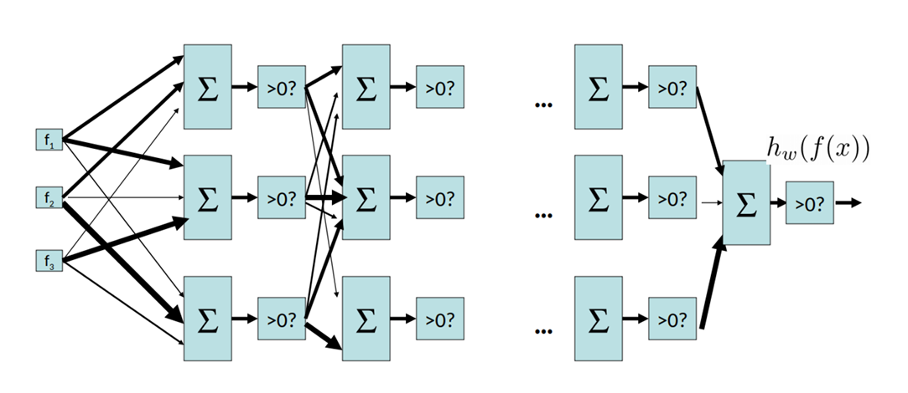
有了这种额外的结构和权重，我们可以表达更广泛的函数集。通过增加模型的复杂性，我们反过来大大增加了它的表达能力。多层感知机为我们提供了一种通用方式来表示更广泛的函数集。事实上，多层感知机是一个通用函数逼近器，可以表示任何实数函数，剩下的问题只是选择最佳的权重集来参数化我们的网络。这正式陈述如下：
定理 (通用函数逼近器) 一个具有足够数量神经元的双层神经网络可以以任意期望的精度逼近任何连续函数。
### 4. Measuring Accuracy
二元感知机在进行 n 次预测后的准确率可以表示为：
\[
l_{acc}(w) = \frac{1}{n} \sum_{i=1}^n (\text{sgn}(w \cdot f(x_i)) == y_i)
\]
其中 \(x_i\) 是数据点 i，\(w\) 是我们的权重向量，\(f\) 是我们的函数，用于从原始数据点导出特征向量，\(y_i\) 是 \(x_i\) 的实际类别标签。在此上下文中，\(\text{sgn}(x)\) 表示一个指示函数，当 \(x\) 为负时计算为 -1，当 \(x\) 为正时计算为 1。考虑到这种表示法，我们可以注意到上面的准确率函数等价于正确预测的总数除以预测的总数。
有时，我们希望输出比二元标签更具表达力。这时，为我们想要分类的 N 个类别中的每一个产生一个概率就变得很有用，这反映了我们对数据点属于每个可能类别的确定程度。为此，正如我们在多类逻辑回归中所做的那样，我们从存储单个权重向量过渡到为每个类别 j 存储一个权重向量，并使用 softmax 函数估计概率。softmax 函数将 \(x^{(i)}\) 分类为类别 j 的概率定义为：
\[
\sigma(x_i)_j = \frac{e^{f(x_i)^T w_j}}{\sum_{\ell=1}^N e^{f(x_i)^T w_\ell}} = P(y_i = j | f(x_i); w).
\]
给定由函数 \(f\) 输出的向量，softmax 执行归一化以输出概率分布。为了为我们的模型提出一个通用的损失函数，我们可以使用这个概率分布来生成一组权重的似然表达式：
\[
\ell(w) = \prod_{i=1}^n P(y_i | f(x_i); w).
\]
这个表达式表示特定权重集解释观察到的标签和数据点的似然。我们希望找到最大化这个量的权重集。这与找到对数似然表达式的最大值相同（因为 log 是一个单调函数，一个的最大化者将是另一个的最大化者）：
\[
\log \ell(w) = \log \prod_{i=1}^n P(y_i | x_i; w) = \sum_{i=1}^n \log P(y_i | f(x_i); w).
\]
根据应用的不同，将其表述为对数概率之和可能更有用。在对数似然关于权重可微的情况下，我们可以使用梯度上升对其进行优化。
### 5. Multi-layer Feedforward Neural Networks
我们现在介绍（人工）神经网络的概念。这与多层感知机非常相似，但是，我们在各个感知机节点之后选择应用不同的非线性。注意，正是这些添加的非线性使得整个网络成为非线性并更具表达力（如果没有它们，多层感知机将只是线性函数的组合，因此也是线性的）。在多层感知机的情况下，我们选择了一个阶跃函数：
\[
f(x) = 
\begin{cases} 
1 & \text{如果 } x \ge 0 \\
-1 & \text{否则}
\end{cases}
\]
由于许多原因，这很难优化。首先，它不是连续的，其次，它在所有点上的导数为零。直观地说，这意味着我们无法知道朝着哪个方向寻找函数的局部最小值，这使得以平滑的方式最小化损失变得困难。
与其使用像上面这样的阶跃函数，更好的解决方案是选择一个连续函数。我们有许多这样的函数可供选择，包括 sigmoid 函数（因其希腊字母 σ 或 's' 而得名，因为它看起来像一个 's'）以及修正线性单元 (ReLU)。让我们看看它们的定义：
- Sigmoid: \(\sigma(x) = \frac{1}{1 + e^{-x}}\)
- ReLU: \(f(x) = 
\begin{cases} 
0 & \text{如果 } x < 0 \\
x & \text{如果 } x \ge 0
\end{cases}\)

计算多层感知机的输出与之前一样，区别在于，在每个层的输出处，我们现在应用我们新的非线性之一（作为神经网络架构的一部分选择），而不是最初的指示函数。在实践中，非线性的选择是一个设计选择，通常需要一些实验来为每个用例选择一个好的非线性。
### 6. Loss Functions and Multivariate Optimization
现在我们对前馈神经网络如何构建以及如何进行预测有了概念，我们希望开发一种方法来训练它，迭代地提高其准确性，类似于我们在感知机情况下所做的那样。为此，我们需要能够衡量它们的性能。回到我们想要最大化的对数似然函数，我们可以推导出一个直观的算法来优化我们的权重，前提是我们的函数是可微的。
为了最大化我们的对数似然函数，我们对其求导，得到一个由每个参数的偏导数组成的梯度向量：
\[
\nabla_w \ell(w) = \left( \frac{\partial \ell \ell(w)}{\partial w_1}, ..., \frac{\partial \ell \ell(w)}{\partial w_n} \right).
\]
现在，我们可以使用前面描述的梯度上升方法找到参数的最优值。鉴于数据集通常很大，批量梯度上升是神经网络优化中最流行的梯度上升变体。
### 7. Neural Networks: Backpropagation
为了有效计算神经网络中每个参数的梯度，我们将使用一种称为反向传播的算法。反向传播将神经网络表示为算子和操作数的依赖图，称为计算图。图结构允许我们有效地计算网络在输入数据上的误差（损失），以及每个参数关于损失的梯度。这些梯度可以在梯度下降中用于调整网络参数并最小化训练数据上的损失。
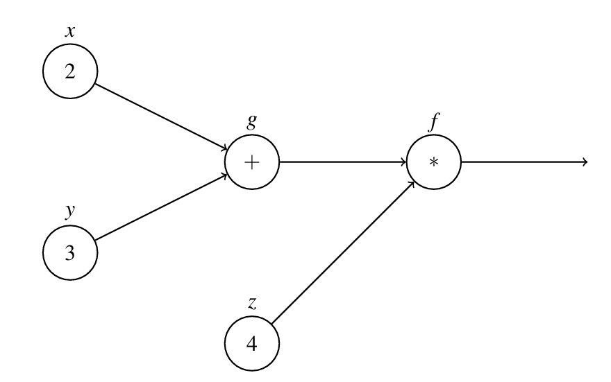
### 8. The Chain Rule
链式法则是微积分中的基本法则，它既激发了计算图的使用，也使得计算上可行的反向传播算法成为可能。数学上，它指出对于一个变量 \(f\)，它是 n 个变量 \(x_1,...,x_n\) 的函数，并且每个 \(x_i\) 是 m 个变量 \(t_1,...,t_m\) 的函数，那么我们可以计算 \(f\) 关于任何 \(t_i\) 的导数如下：
\[
\frac{\partial f}{\partial t_i} = \frac{\partial f}{\partial x_1} \cdot \frac{\partial x_1}{\partial t_i} + \frac{\partial f}{\partial x_2} \cdot \frac{\partial x_2}{\partial t_i} + ... + \frac{\partial f}{\partial x_n} \cdot \frac{\partial x_n}{\partial t_i}.
\]
在计算图的上下文中，这意味着要计算给定节点 \(t_i\) 关于输出 \(f\) 的梯度，我们取该节点的子节点项之和。
### 9. The Backpropagation Algorithm
考虑一个计算 \((x+y)*z\) 的计算图示例，其中值为 \(x=2, y=3, z=4\)。我们将 \(g = x + y\)，\(f = g * z\)。在前向传播中，我们计算每个节点的输出值：\(g = 5\)，\(f = 20\)。在反向传播中，我们从最终节点开始计算每个节点的梯度。最终节点 \(f\) 的梯度为 \(\frac{\partial f}{\partial f} = 1\)。然后我们计算其子节点 \(g\) 和 \(z\) 的梯度：\(\frac{\partial f}{\partial g} = z = 4\)，\(\frac{\partial f}{\partial z} = g = 5\)。
接着，我们继续向上游计算 \(x\) 和 \(y\) 的梯度。根据链式法则：
\[
\frac{\partial f}{\partial x} = \frac{\partial f}{\partial g} \frac{\partial g}{\partial x} = 4 \cdot 1 = 4,
\]
\[
\frac{\partial f}{\partial y} = \frac{\partial f}{\partial g} \frac{\partial g}{\partial y} = 4 \cdot 1 = 4.
\]
对于有多个子节点的节点，例如计算 \(((x+y)+(x \cdot y)) \cdot z\)，其中 \(x\) 和 \(y\) 各被用于两个操作，它们的梯度值是其子节点为它们计算的梯度之和。具体来说，\(x\) 的梯度为：
\[
\frac{\partial f}{\partial x} = \frac{\partial f}{\partial h} \frac{\partial h}{\partial x} + \frac{\partial f}{\partial i} \frac{\partial i}{\partial x}.
\]
这个过程表明，一个节点的反向传播步骤依赖于该节点的输入（在前向传播中计算），以及由该节点的子节点在“下游”计算的梯度。我们将所有这些值缓存在图中以提高效率。综合起来，对图的前向传播和反向传播构成了反向传播算法。
为了最大化对数似然，在梯度下降的每次迭代中，我们使用数据点 \(x^{(1)}, ..., x^{(m)}\) 计算参数 \(w\) 的梯度，更新参数，并重复直到参数收敛。对数似然函数为：
\[
\ell\ell(w) = \log \prod_{i=1}^m P(y^{(i)} | x^{(i)}; w) = \sum_{i=1}^m \log P(y^{(i)} | x^{(i)}; w)
\]
其中 \(x^{(1)}, ..., x^{(m)}\) 是我们训练集中的 m 个数据点。
现在我们有了为网络所有参数计算梯度的方法，我们可以使用梯度下降方法来优化参数，以在训练数据上获得高准确率。假设我们设计了一些分类网络来为数据点 \(x\) 输出类别 \(y\) 的概率，并且有 m 个不同的训练数据点。令 \(w\) 为网络的所有参数。我们希望找到使数据真实类别概率的似然最大化的参数 \(w\) 的值，因此我们有如下函数需要运行梯度上升：
\[
\sum_{i=1}^m \log P(y^{(i)} | x^{(i)}; w)
\]
### 10. Summary
神经网络是强大（且通用！）的函数逼近器，但可能难以设计和训练。目前有大量关于深度学习的研究，专注于神经网络设计的各个方面，例如：
1. 网络架构 - 设计一个适合特定问题的网络（选择激活函数、层数等）
2. 学习算法 - 如何找到实现低损失函数值的参数，这是一个难题，因为梯度下降是贪心算法，而神经网络可能有许多局部最优点
3. 泛化与迁移学习 - 由于神经网络有许多参数，很容易过拟合训练数据——如何保证它们在你以前未见过的测试数据上也有低损失？

在本笔记中，我们介绍了逻辑回归及其近亲多类逻辑回归。我们还研究了如何使用梯度方法解决优化问题。结合这些概念，我们得出了神经网络的思想，它本质上是在层与层之间具有非线性激活的多层感知机。这些网络对于逼近函数极为强大，并使用梯度下降进行训练。
___
[返回目录](#目录)
___
## Note 23: RL I<a id = "note23"></a>
### 1. Reinforcement Learning
在之前的笔记中，我们讨论了马尔可夫决策过程，并使用诸如值迭代和策略迭代等技术来求解它们，以计算状态的最优价值并提取最优策略。求解马尔可夫决策过程是离线规划的一个例子，其中智能体完全了解转移函数和奖励函数，它们拥有预先计算由 MDP 编码的世界中的最优动作所需的所有信息，而无需实际采取任何行动。在本笔记中，我们将讨论在线规划，在此过程中，智能体事先不知道世界中的奖励或转移（仍表示为 MDP）。在线规划中，智能体必须尝试探索，在此期间它执行动作，并以它到达的后继状态和获得的相应奖励的形式接收反馈。智能体通过称为强化学习的过程，利用这些反馈来估计最优策略，然后再利用这个估计的策略进行利用或奖励最大化。
让我们从一些基本术语开始。在在线规划的每个时间步，智能体从状态 s 开始，然后采取动作 a，最终到达后继状态 s′，并获得一些奖励 r。每个 (s, a, s′, r) 元组被称为一个样本。通常，智能体会连续采取行动并收集样本，直到到达终止状态。这样一组样本被称为一个回合。智能体在探索期间通常会经历许多回合，以便收集学习所需的足够数据。
强化学习有两种类型，基于模型的学习和无模型学习。基于模型的学习尝试用探索期间获得的样本估计转移函数和奖励函数，然后像平常一样使用值迭代或策略迭代来求解 MDP。另一方面，无模型学习尝试直接估计状态的值或 Q 值，而无需使用任何内存来构建 MDP 中奖励和转移的模型。
### 2. 基于模型的学习
在基于模型的学习中，智能体通过记录进入每个 Q 状态 (s, a) 后到达每个状态 s′ 的次数，来生成转移函数的近似值 \( \hat{T}(s, a, s') \)。然后，智能体可以在需要时通过归一化它收集的计数来生成近似的转移函数 \( \hat{T} \)——将每个观察到的元组 (s, a, s′) 的计数除以智能体处于 Q 状态 (s, a) 的所有实例的计数总和。计数的归一化使它们总和为 1，从而可以将它们解释为概率。考虑以下示例 MDP，其状态为 S = {A, B, C, D, E, x}，其中 x 表示终止状态，折扣因子 γ = 1：
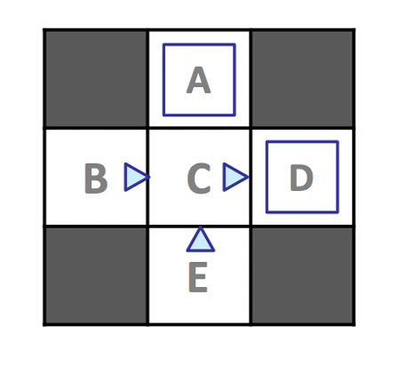
假设我们允许我们的智能体按照上面描述的 π\_explore 策略探索 MDP 四个回合，并产生以下结果：
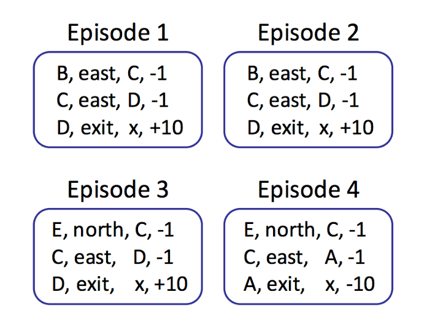
现在我们总共有 12 个样本，每个回合 3 个，计数如下：
| s   | a    | s′ | count |
| :-- | :--- | :- | :---- |
| A   | exit | x  | 1     |
| B   | east | C  | 2     |
| C   | east | A  | 1     |
| C   | east | D  | 3     |
| D   | exit | x  | 3     |
| E   | north| C  | 2     |

回想一下 \( T(s, a, s') = P(s' | a, s) \)，我们可以通过将每个元组 (s, a, s′) 的计数除以我们在 Q 状态 (s, a) 的总次数，以及直接从我们在探索中获得的奖励来估计奖励函数，从而用这些计数估计转移函数：
- 转移函数：\( \hat{T}(s, a, s') \)
    - \( \hat{T}(A, \text{exit}, x) = \frac{\#(A, \text{exit}, x)}{\#(A, \text{exit})} = \frac{1}{1} = 1 \)
    - \( \hat{T}(B, \text{east}, C) = \frac{\#(B, \text{east}, C)}{\#(B, \text{east})} = \frac{2}{2} = 1 \)
    - \( \hat{T}(C, \text{east}, A) = \frac{\#(C, \text{east}, A)}{\#(C, \text{east})} = \frac{1}{4} = 0.25 \)
    - \( \hat{T}(C, \text{east}, D) = \frac{\#(C, \text{east}, D)}{\#(C, \text{east})} = \frac{3}{4} = 0.75 \)
    - \( \hat{T}(D, \text{exit}, x) = \frac{\#(D, \text{exit}, x)}{\#(D, \text{exit})} = \frac{3}{3} = 1 \)
    - \( \hat{T}(E, \text{north}, C) = \frac{\#(E, \text{north}, C)}{\#(E, \text{north})} = \frac{2}{2} = 1 \)
- 奖励函数：\( \hat{R}(s, a, s') \)
    - \( \hat{R}(A, \text{exit}, x) = -10 \)
    - \( \hat{R}(B, \text{east}, C) = -1 \)
    - \( \hat{R}(C, \text{east}, A) = -1 \)
    - \( \hat{R}(C, \text{east}, D) = -1 \)
    - \( \hat{R}(D, \text{exit}, x) = +10 \)
    - \( \hat{R}(E, \text{north}, C) = -1 \)

根据大数定律，随着我们通过让智能体经历更多回合来收集越来越多的样本，我们对 \( \hat{T} \) 和 \( \hat{R} \) 的模型将会改进，随着我们发现新的 (s, a, s′) 元组，\( \hat{T} \) 会收敛到 T，而 \( \hat{R} \) 会获得先前未发现的奖励。只要我们觉得合适，我们就可以结束智能体的训练，通过使用我们当前的 \( \hat{T} \) 和 \( \hat{R} \) 模型运行值迭代或策略迭代来生成一个策略 π\_exploit，并利用 π\_exploit 进行利用，让我们的智能体遍历 MDP，采取寻求奖励最大化的行动，而不是寻求学习。我们很快将讨论如何有效地在探索和利用之间分配时间。基于模型的学习非常简单直观，但非常有效，仅通过计数和归一化就能生成 \( \hat{T} \) 和 \( \hat{R} \)。然而，为每个观察到的 (s, a, s′) 元组维护计数可能很昂贵，因此在下一节关于无模型学习的内容中，我们将开发一些方法，完全绕过维护计数，并避免基于模型的学习所需的内存开销。
### 3. Model-Free Learning
接下来是无模型学习！有几种无模型学习算法，我们将介绍其中的三种：直接评估、时序差分学习和 Q 学习。直接评估和时序差分学习属于一类称为被动强化学习的算法。在被动强化学习中，智能体被赋予一个要遵循的策略，并在经历回合时学习该策略下的状态价值，这与在已知 T 和 R 的情况下对 MDP 进行策略评估完全相同。Q 学习属于第二类无模型学习算法，称为主动强化学习，在此过程中，学习智能体可以在学习时利用它收到的反馈迭代地更新其策略，直到在充分探索后最终确定最优策略。
### 4. Direct Evaluation
我们将介绍的第一种被动强化学习技术称为直接评估，这种方法就像它的名字听起来一样简单。直接评估所做的就是固定某个策略 π，并让智能体在遵循 π 的同时经历几个回合。当智能体通过这些回合收集样本时，它会维护从每个状态获得的总效用以及访问每个状态的次数。在任何时候，我们都可以通过将从 s 获得的总效用除以访问 s 的次数来计算任何状态 s 的估计值。让我们对之前的例子运行直接评估，记得 γ = 1。
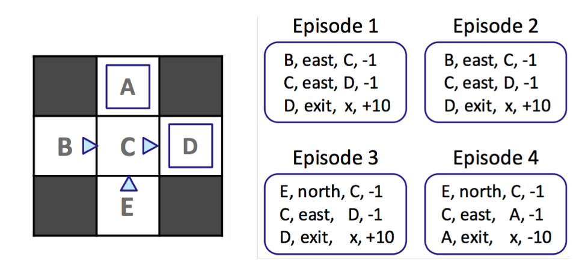
浏览第一个回合，我们可以看到从状态 D 到终止我们获得了 10 的总奖励，从状态 C 我们获得了 (−1) + 10 = 9 的总奖励，从状态 B 我们获得了 (−1) + (−1) + 10 = 8 的总奖励。完成这个过程，得出每个状态跨回合的总奖励和结果估计值如下：
| s   | 总奖励 | 访问次数 | \( V^\pi(s) \) |
| :-- | :----- | :------- | :------------- |
| A   | -10    | 1        | -10            |
| B   | 16     | 2        | 8              |
| C   | 16     | 4        | 4              |
| D   | 30     | 3        | 10             |
| E   | -4     | 2        | -2             |

尽管直接评估最终会学习每个状态的状态价值，但它收敛的速度通常不必要地慢，因为它浪费了关于状态之间转移的信息。在我们的示例中，我们计算出 \( V^\pi(E) = -2 \) 和 \( V^\pi(B) = 8 \)，尽管根据我们收到的反馈，两个状态都只有 C 作为后继状态，并且在转移到 C 时都获得相同的奖励 -1。根据贝尔曼方程，这意味着在 π 下 B 和 E 应该具有相同的值。然而，我们的智能体处于状态 C 的 4 次中，它转移到了 D 并获得了 10 的奖励三次，转移到了 A 并获得了 -10 的奖励一次。纯粹是偶然，它收到 -10 奖励的那一次是从状态 E 而不是 B 开始的，但这严重扭曲了 E 的估计值。经过足够多的回合，B 和 E 的值将收敛到它们的真实值，但像这样的情况会导致这个过程比我们希望的更长。选择使用我们的第二种被动强化学习算法，时序差分学习，可以缓解这个问题。
### 5. Temporal Difference Learning
时序差分学习使用从每一次经验中学习的思想，而不是像直接评估那样简单地记录总奖励和访问状态的次数并在最后学习。在策略评估中，我们使用由固定策略和贝尔曼方程生成的方程组来确定该策略下的状态价值（或者像值迭代那样使用迭代更新）。
\[
V^\pi(s) = \sum_{s'} T(s, \pi(s), s') [R(s, \pi(s), s') + \gamma V^\pi(s')]
\]
这些方程中的每一个都将一个状态的价值等同于其后继状态折现价值的加权平均，加上转移到它们所获得的奖励。TD 学习试图回答如何在没有权重的情况下计算这个加权平均的问题，巧妙地使用指数移动平均来实现。我们首先初始化 ∀s, \( V^\pi(s) = 0 \)。在每个时间步，智能体从状态 s 采取动作 π(s)，转移到状态 s′，并获得奖励 \( R(s, \pi(s), s') \)。我们可以通过将获得的奖励与 s′ 在 π 下的折现当前值相加来获得一个样本值：
\[
\text{sample} = R(s, \pi(s), s') + \gamma V^\pi(s')
\]
这个样本是 \( V^\pi(s) \) 的一个新估计。下一步是使用指数移动平均将这个样本估计纳入我们现有的 \( V^\pi(s) \) 模型，该模型遵循以下更新规则：
\[
V^\pi(s) \leftarrow (1 - \alpha) V^\pi(s) + \alpha \cdot \text{sample}
\]
上面，α 是一个由 \( 0 \le \alpha \le 1 \) 约束的参数，称为学习率，它指定了我们想赋予现有 \( V^\pi(s) \) 模型的权重 1-α，以及赋予新样本估计的权重 α。通常从学习率 α = 1 开始，相应地将 \( V^\pi(s) \) 设置为第一个样本的值，然后慢慢将其缩小到 0，此时所有后续样本将被清零并停止影响我们的 \( V^\pi(s) \) 模型。
让我们停下来分析一下这个更新规则。通过定义 \( V^\pi_k(s) \) 和 sample\_k 分别为第 k 次更新后状态 s 的估计值和第 k 个样本，我们可以重新表达我们的更新规则：
\[
V^\pi_k(s) \leftarrow (1 - \alpha) V^\pi_{k-1}(s) + \alpha \cdot \text{sample}_k
\]
这个 \( V^\pi_k(s) \) 的递归定义展开后非常有趣：
\[
\begin{aligned}
V^\pi_k(s) &\leftarrow (1 - \alpha) V^\pi_{k-1}(s) + \alpha \cdot \text{sample}_k \\
V^\pi_k(s) &\leftarrow (1 - \alpha)[(1 - \alpha) V^\pi_{k-2}(s) + \alpha \cdot \text{sample}_{k-1}] + \alpha \cdot \text{sample}_k \\
V^\pi_k(s) &\leftarrow (1 - \alpha)^2 V^\pi_{k-2}(s) + (1 - \alpha) \cdot \alpha \cdot \text{sample}_{k-1} + \alpha \cdot \text{sample}_k \\
&\vdots \\
V^\pi_k(s) &\leftarrow (1 - \alpha)^k V^\pi_0(s) + \alpha \cdot [(1 - \alpha)^{k-1} \cdot \text{sample}_1 + ... + (1 - \alpha) \cdot \text{sample}_{k-1} + \text{sample}_k] \\
V^\pi_k(s) &\leftarrow \alpha \cdot [(1 - \alpha)^{k-1} \cdot \text{sample}_1 + ... + (1 - \alpha) \cdot \text{sample}_{k-1} + \text{sample}_k]
\end{aligned}
\]
因为 \( 0 \le (1 - \alpha) \le 1 \)，随着我们将 (1-α) 提高到越来越大的幂，它越来越接近 0。根据我们推导出的更新规则展开，这意味着较旧的样本被赋予指数级更小的权重，这正是我们想要的，因为这些较旧的样本是使用我们 \( V^\pi(s) \) 模型的较旧（因此更差）版本计算得出的！这就是时序差分学习的美妙之处——通过一个简单的更新规则，我们能够：
- 在每个时间步学习，因此在我们获得状态转移信息时就使用它们，因为我们在样本中使用的是迭代更新的 \( V^\pi(s') \) 版本，而不是等到最后才进行计算。
- 给较旧的、可能不那么准确的样本赋予指数级更小的权重。
- 比直接评估更快、用更少的回合收敛到学习真实的状态价值。
### 6. Q-Learning
直接评估和 TD 学习最终都会学习它们所遵循策略下所有状态的真实价值。然而，它们都有一个主要的固有问题——我们想为我们的智能体找到一个最优策略，这需要知道状态的 Q 值。要从我们已有的价值计算 Q 值，我们需要像贝尔曼方程所规定的那样，需要一个转移函数和奖励函数。
\[
Q^*(s, a) = \sum_{s'} T(s, a, s') [R(s, a, s') + \gamma V^*(s')]
\]
因此，TD 学习或直接评估通常与一些基于模型的学习结合使用，以获得 T 和 R 的估计，以便有效地更新学习智能体遵循的策略。一个称为 Q 学习的革命性新想法使得这变得可以避免，它提出直接学习状态的 Q 值，从而无需知道任何价值、转移函数或奖励函数。因此，Q 学习完全是无模型的。Q 学习使用以下更新规则执行所谓的Q 值迭代：
\[
Q_{k+1}(s, a) \leftarrow \sum_{s'} T(s, a, s') [R(s, a, s') + \gamma \max_{a'} Q_k(s', a')]
\]
请注意，这个更新只是对值迭代更新规则的轻微修改。实际上，唯一的真正区别在于 max 运算符在动作上的位置发生了变化，因为当我们处于状态时，我们在转移之前选择动作，但当我们处于 Q 状态时，我们在转移之后、选择新动作之前。
有了这个新的更新规则，Q 学习的推导方式与 TD 学习基本相同，通过获取 Q 值样本：
\[
\text{sample} = R(s, a, s') + \gamma \max_{a'} Q(s', a')
\]
并将它们纳入指数移动平均。
\[
Q(s, a) \leftarrow (1 - \alpha) Q(s, a) + \alpha \cdot \text{sample}
\]
只要我们在探索中花费足够的时间，并以适当的速度降低学习率 α，Q 学习就能学习每个 Q 状态的最优 Q 值。这就是 Q 学习如此革命性的原因——当 TD 学习和直接评估通过遵循策略学习状态价值，然后通过其他技术确定策略最优性时，Q 学习甚至可以通过采取次优或随机行动来直接学习最优策略。这被称为离策略学习（与直接评估和 TD 学习相反，它们是在策略学习的例子）。
### 7. Approximate Q-Learning
Q 学习是一种不可思议的学习技术，它继续处于强化学习领域发展的中心。然而，它仍然有一些改进的空间。就目前而言，Q 学习只是以表格形式存储所有状态的 Q 值，考虑到强化学习的大多数应用都有数千甚至数百万个状态，这并不是特别有效。这意味着我们无法在训练期间访问所有状态，即使可以，由于内存不足，我们也无法存储所有 Q 值。
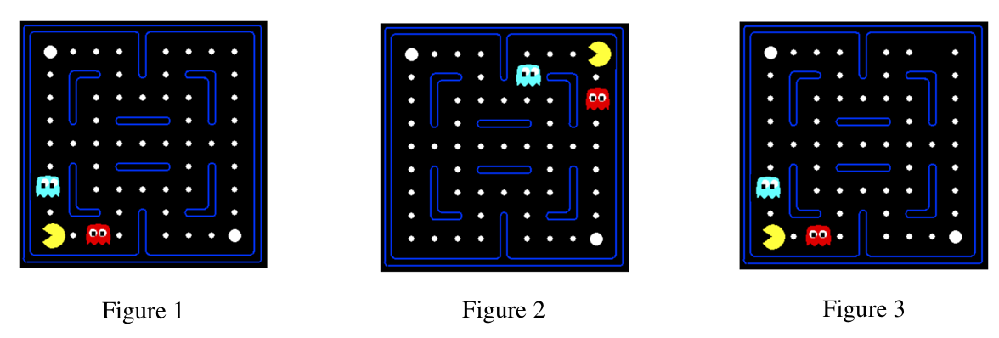
在上面，如果吃豆人在运行普通 Q 学习后了解到图 1 是不利的，它仍然不知道图 2 甚至图 3 也是不利的。近似 Q 学习试图通过学习一些一般情况并外推到许多类似情况来解决这个问题。泛化学习经验的关键是基于特征的状态表示，它将每个状态表示为一个称为特征向量的向量。例如，吃豆人的特征向量可能编码：
- 到最近幽灵的距离。
- 到最近食物粒的距离。
- 幽灵的数量。
- 吃豆人被困住了吗？0 或 1

有了特征向量，我们可以将状态和 Q 状态的价值视为线性价值函数：
\[
V(s) = w_1 \cdot f_1(s) + w_2 \cdot f_2(s) + ... + w_n \cdot f_n(s) = \vec{w} \cdot \vec{f}(s)
\]
\[
Q(s, a) = w_1 \cdot f_1(s, a) + w_2 \cdot f_2(s, a) + ... + w_n \cdot f_n(s, a) = \vec{w} \cdot \vec{f}(s, a)
\]
其中 \( \vec{f}(s) = [f_1(s), f_2(s), ..., f_n(s)]^T \) 和 \( \vec{f}(s, a) = [f_1(s, a), f_2(s, a), ..., f_n(s, a)]^T \) 分别表示状态 s 和 Q 状态 (s, a) 的特征向量，\( \vec{w} = [w_1, w_2, ..., w_n] \) 表示权重向量。将差异定义为：
\[
\text{difference} = [R(s, a, s') + \gamma \max_{a'} Q(s', a')] - Q(s, a)
\]
近似 Q 学习的工作方式与 Q 学习几乎相同，使用以下更新规则：
\[
w_i \leftarrow w_i + \alpha \cdot \text{difference} \cdot f_i(s, a)
\]
使用近似 Q 学习，我们不再需要存储每个状态的 Q 值，而只需存储单个权重向量，并可以根据需要按需计算 Q 值。因此，这不仅为我们提供了更通用的 Q 学习版本，而且也是一个显著更节省内存的版本。
作为关于 Q 学习的最后一点说明，我们可以使用差异重新表达精确 Q 学习的更新规则如下：
\[
Q(s, a) \leftarrow Q(s, a) + \alpha \cdot \text{difference}
\]
这第二种表示法为我们提供了对更新的另一种略有不同但同样有价值的解释：它计算样本估计与当前 Q(s, a) 模型之间的差异，并将模型向估计的方向移动，移动的幅度与差异的大小成正比。
___
[返回目录](#目录)
___
## Note 24: RL II<a id = "note24"></a>
### 1. Exploration and Exploitation
我们已经介绍了几种让智能体学习最优策略的不同方法，并反复强调“充分探索”的必要性，但并没有详细阐述“充分”的真正含义。在接下来的两节中，我们将讨论在探索和利用之间分配时间的两种方法：ε-贪心策略和探索函数。
### 2. ε-Greedy Policies
遵循 ε-贪心策略的智能体会定义一个概率 \(0 \le \varepsilon \le 1\)，并以概率 \(\varepsilon\) 随机行动进行探索。相应地，它们以概率 \((1-\varepsilon)\) 遵循当前已建立的策略进行利用。这是一种非常容易实现的策略，但处理起来可能仍然相当困难。如果选择了一个较大的 \(\varepsilon\) 值，即使在学习了最优策略之后，智能体仍然会表现得大多随机。类似地，选择一个较小的 \(\varepsilon\) 值意味着智能体很少进行探索，导致 Q 学习（或任何其他选定的学习算法）学习最优策略的速度非常慢。为了解决这个问题，必须手动调整 \(\varepsilon\) 并随时间降低其值才能看到效果。
### 3. Exploration Functions
探索函数避免了手动调整 \(\varepsilon\) 的问题，它使用修改后的 Q 值迭代更新来对访问较少的州给予一些偏好。修改后的更新如下：
\[
Q(s, a) \leftarrow (1 - \alpha) Q(s, a) + \alpha \cdot [R(s, a, s') + \gamma \max_{a'} f(s', a')]
\]
其中 \(f\) 表示一个探索函数。在设计探索函数时存在一定程度的灵活性，但一个常见的选择是使用：
\[
f(s, a) = Q(s, a) + \frac{k}{N(s, a)}
\]
其中 \(k\) 是某个预定值，\(N(s, a)\) 表示 Q 状态 \((s, a)\) 已被访问的次数。处于状态 s 的智能体总是选择使 \(f(s, a)\) 值最高的那个动作，因此永远不必在探索和利用之间做出概率性的决定。相反，探索被自动编码到探索函数中，因为 \(\frac{k}{N(s, a)}\) 项可以为某个不常采取的动作提供足够的“奖励”，使其能够被优先选择，即使它当前的 Q 值较低。随着时间的推移，状态被更频繁地访问，这个奖励对于每个状态都会逐渐减少到 0，并且 \(f(s, a)\) 回归到 \(Q(s, a)\)，使得利用变得越来越占主导地位。
### 4. Summary
非常重要的一点是要记住，强化学习背后有一个潜在的 MDP，强化学习的目标是通过推导出最优策略来解决这个 MDP。使用强化学习与使用值迭代和策略迭代等方法之间的区别在于，对底层 MDP 的转移函数 T 和奖励函数 R 缺乏了解。因此，智能体必须通过在线试错来学习最优策略，而不是纯粹通过离线计算。有多种方法可以做到这一点：
- 基于模型的学习 - 进行计算以估计转移函数 T 和奖励函数 R 的值，并使用这些估计值通过值迭代或策略迭代等 MDP 求解方法来求解。
- 无模型学习 - 避免估计 T 和 R，转而使用其他方法直接估计状态的值或 Q 值。
    - 直接评估 - 遵循策略 \(\pi\)，简单地统计从每个状态获得的总奖励以及每个状态被访问的总次数。如果采集了足够的样本，这将收敛到 \(\pi\) 下状态的真实值，尽管速度较慢且浪费了关于状态间转移的信息。
    - 时序差分学习 - 遵循策略 \(\pi\)，使用采样值的指数移动平均，直到收敛到 \(\pi\) 下状态的真实值。TD 学习和直接评估是在策略学习的例子，它们在决定该策略是否次优需要更新之前，学习特定策略下的价值。
    - Q 学习 - 通过带有 Q 值迭代更新的试错，直接学习最优策略。这是离策略学习的一个例子，即使在采取次优行动时也能学习最优策略。
    - 近似 Q 学习 - 执行与 Q 学习相同的操作，但使用基于特征的状态表示来泛化学习。
- 为了量化不同强化学习算法的性能，我们使用遗憾的概念。遗憾捕捉了从开始就在环境中采取最优行动所能累积的总奖励与我们运行学习算法所累积的总奖励之间的差异。
___
[返回目录](#目录)
___

