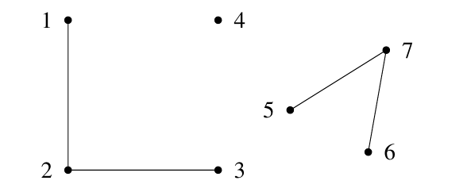
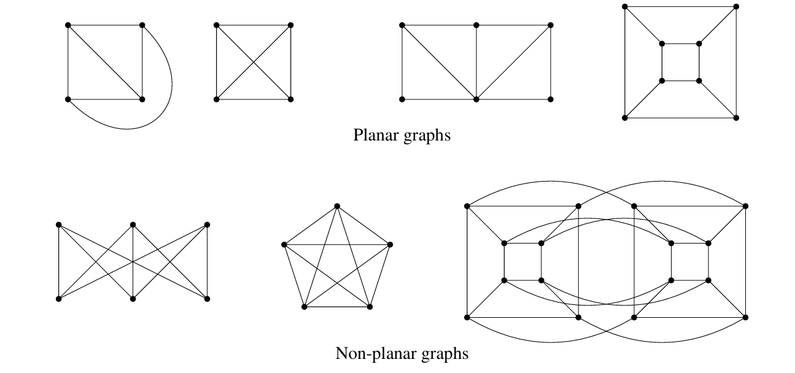
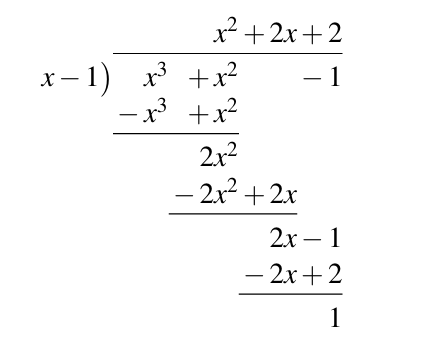
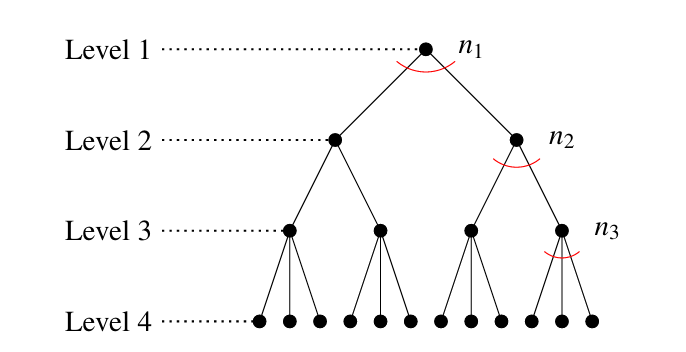
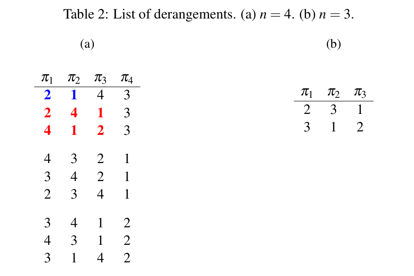
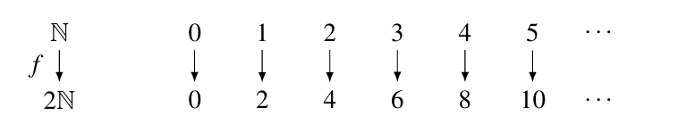
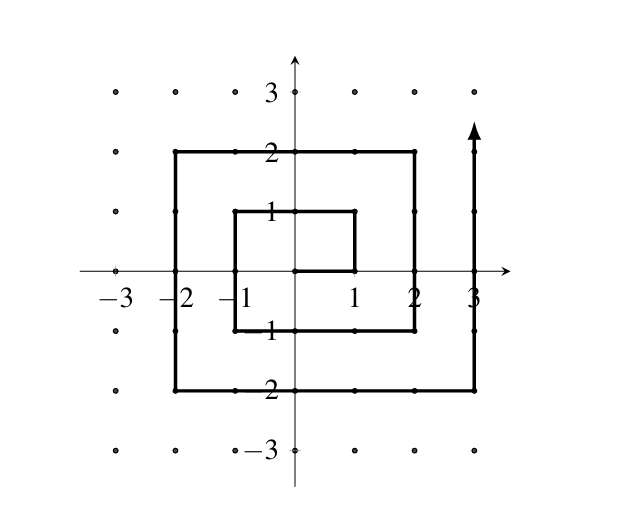
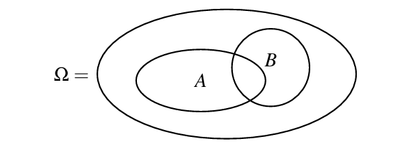
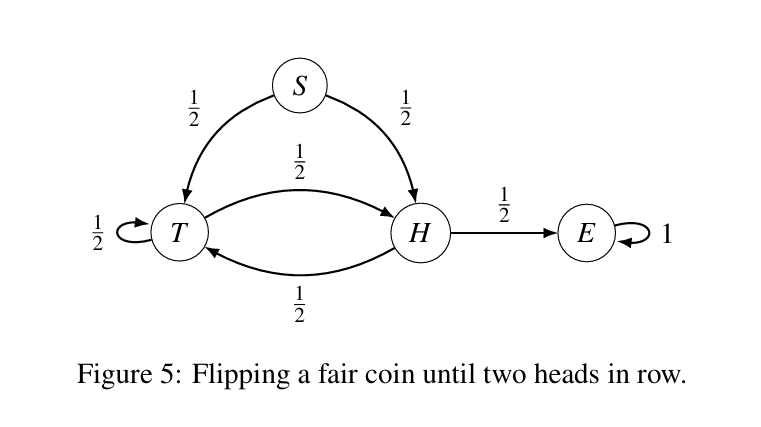

# UCB CS70：Discrete Mathematics and Probability Theory
本部编号 2026-4-B
___
## 目录 <a id = "目录"></a>
[Note 0: Introduction](#note0)<br>
[Note 1: Propositional Logic](#note1)<br>
[Note 2: Proofs](#note2)<br>
[Note 3: Induction](#note3)<br>
[Note 4: Stable Matching](#note4)<br>
[Note 5: Graphs](#note5)<br>
[Note 6: Modular Arithmetic](#note6)<br>
[Note 7: RSA](#note7)<br>
[Note 8: Polynomials](#note8)<br>
[Note 9: Error Correcting Codes](#note9)<br>
[Note 10: Counting](#note10)<br>
[Note 11: Countability](#note11)<br>
[Note 12: Computability](#note12)<br>
[Note 13: Introduction to Discrete Probability](#note13)<br>
[Note 14: Conditional Probability, Independence, and Combinations of Events](#note14)<br>
[Note 15: Applications](#note15)<br>
[Note 16: Random Variables and Expectations I](#note16)<br>
[Note 17: Random Variables and Expectations II](#note17)<br>
[Note 18: Variance](#note18)<br>
[Note 19: Covariance and Conditional Expectation](#note19)<br>
[Note 20: Concentration Inequalities](#note20)<br>
[Note 21: Continuous Probability](#note21)<br>
[Note 22: Normal Distribution](#note22)<br>
[Note 23: Markov Chains I](#note23)<br>
[Note 24: Markov Chains II](#note24)
___
## Note 0: Introduction <a id = "note0"></a>
### 1. Review of Sets and Mathematical Notation
集合是明确定义的对象的集合。这些对象称为集合的元素或成员，它们可以是任何事物，包括数字、字母、人、城市，甚至是其他集合。按照惯例，集合通常用大写字母表示，并且可以通过列出其元素并用花括号括起来来描述或定义（列举法）。
如果 x 是 A 的元素，则我们写作 x ∈ A。类似地，如果 y 不是 A 的元素，则我们写作 y ∉ A。如果两个集合 A 和 B 具有相同的元素，则称它们相等，记作 A = B。元素的顺序和重复无关紧要
有时，可以使用不同的符号来定义更复杂的集合（描述法）
#### 1. 基数
我们也可以讨论集合的大小，或称为基数。如果 A = {1, 2, 3, 4}，那么 A 的基数（记作 |A|）为 4。集合的基数也可能为 0。存在一个唯一的这样的集合，称为空集，记作符号 ∅。一个集合也可以有无限多个元素，例如所有整数、素数或奇数的集合。
#### 2. 子集与真子集
如果集合 A 中的每个元素也在集合 B 中，那么我们称 A 是 B 的子集，记作 A ⊆ B。等价地，我们可以写作 B ⊇ A，或者 B 是 A 的超集。真子集是严格包含在 B 中的集合 A，记作 A ⊂ B，意味着 A 至少排除了 B 中的一个元素。
以下是一些关于子集的基本性质：
- 空集（记作 {} 或 ∅）是任何非空集 A 的真子集：{} ⊂ A。
- 空集是每个集合 B 的子集：{} ⊆ B。
- 每个集合 A 都是其自身的子集：A ⊆ A。
#### 3. 交集与并集
集合 A 与集合 B 的交集，记作 A ∩ B，是包含所有同时属于 A 和 B 的元素的集合。如果 A ∩ B = ∅，则称两个集合是不相交的。集合 A 与集合 B 的并集，记作 A ∪ B，是所有属于 A 或 B 或两者都有的元素的集合。
以下是交集和并集的一些性质：
- A ∪ B = B ∪ A
- A ∪ ∅ = A
- A ∩ B = B ∩ A
- A ∩ ∅ = ∅
#### 4. 差集
如果 A 和 B 是两个集合，那么 A 在 B 中的相对补集，或 B 与 A 的集合差，记作 B − A 或 B \ A，是那些在 B 中但不在 A 中的元素的集合：B \ A = {x ∈ B | x ∉ A}
以下是补集的一些重要性质：
- A \ A = ∅
- A \ ∅ = A
- ∅ \ A = ∅
#### 5. 重要集合
在数学中，某些集合被频繁引用，因此用特殊符号表示。这些包括：
- N 表示所有自然数的集合：{0, 1, 2, 3, …}。
- Z 表示所有整数的集合：{…, −2, −1, 0, 1, 2, …}。
- Q 表示所有有理数的集合：{a/b | a, b ∈ Z, b ≠ 0}。
- R 表示所有实数的集合。
- C 表示所有复数的集合。
#### 6. 笛卡尔积与幂集
两个集合 A 和 B 的笛卡尔积（也称为叉积），记作 A × B，是所有第一个分量是 A 的元素、第二个分量是 B 的元素的序对的集合。用集合符号表示，A × B = {(a, b) | a ∈ A, b ∈ B}。
给定一个集合 S，S 的幂集记作 P(S)，是 S 的所有子集的集合
如果 |S| = k，那么 |P(S)| = 2ᵏ。
### 2. Mathematical Notation
#### 1. 求和与乘积
有一种紧凑的符号用于书写大量项的和或积。
我们可以将和 f(m) + f(m+1) + … + f(n) 写作 $∑\limits_{i=m}ⁿ f(i)$。
类似地，要写出乘积 f(m)f(m+1)…f(n)，我们使用符号 $∏\limits_{i=m}ⁿ f(i)$。
#### 2. 全称量词与存在量词
全称量词 ∀（“对于所有”）。
存在量词 ∃（“存在”）
___
[返回目录](#目录)
___
## Note 1: Propositional Logic <a id = "note1"></a>
### 1. Propositional Logic
它指的是一个要么为真、要么为假的陈述。
命题可以组合在一起形成更复杂的陈述。设 P、Q 和 R 是表示命题的变量。组合这些命题的最简单方法是使用连接词“且”、“或”和“非”。
1. 合取：P∧Q（“P 且 Q”）。仅当 P 和 Q 同时为真时为真。
2. 析取：P∨Q（“P 或 Q”）。当 P 和 Q 至少有一个为真时为真。
3. 否定：¬P（“非 P”）。当 P 为假时为真。

像这样带有变量的陈述称为命题形式。
一个称为排中律的基本原则指出，对于任何命题 P，要么 P 为真，要么 ¬P 为真（但不能同时为真）。因此，P∨¬P 总是为真，无论 P 的真值如何。一个无论其变量的真值如何总是为真的命题形式称为重言式。相反，像 P∧¬P 这样总是为假的陈述称为矛盾式。
描述命题形式可能取值的一个有用工具是真值表。真值表与函数表相同：列出变量的所有可能输入值，然后列出给定这些输入的输出值。（顺序无关紧要。）
以下是合取和否定的真值表：
合取（P∧Q）的真值表
| P | Q | P∧Q |
|---|---|-----|
| T | T | T   |
| T | F | F   |
| F | T | F   |
| F | F | F   |

否定（¬P）的真值表
| P | ¬P |
|---|---|
| T | F  |
| F | T  |

最重要且微妙的命题形式是蕴含：
蕴含：P =⇒ Q（“P 蕴含 Q”）。这等价于“如果 P，那么 Q。”
这里，P 称为蕴含的前提，Q 称为结论。
以下是 P =⇒ Q 的真值表（以及我们稍后将解释的额外一列）：
| P | Q | P ⇒ Q | ¬P ∨ Q |
|---|---|-------|--------|
| T | T | T     | T      |
| T | F | F     | F      |
| F | T | T     | T      |
| F | F | T     | T      |

注意，当 P 为假时，P =⇒ Q 总是为真。这意味着许多在英语中听起来无意义的陈述在数学意义上是真的。
当一个蕴含因为前提为假而愚蠢地为真时，我们称其为空洞真。
还请注意，P =⇒ Q 逻辑上等价于 ¬P ∨ Q，通过比较上表最后两列可以看出：对于 P 和 Q 的所有可能真值，P =⇒ Q 和 ¬P ∨ Q 取相同的值（即它们有相同的真值表）。我们写作 (P =⇒ Q) ≡ (¬P ∨ Q)。
P =⇒ Q 是数学定理最常见的形式。以下是表达它的几种不同方式：
1. 如果 P，则 Q；
2. Q 如果 P；
3. 仅当 Q 时 P；
4. P 对 Q 是充分的；
5. Q 对 P 是必要的；
6. Q 除非非 P。

如果 P =⇒ Q 和 Q =⇒ P 同时为真，那么我们说“P 当且仅当 Q”（缩写为“P iff Q”）。形式上，我们写作 P ⇐⇒ Q。注意，仅当 P 和 Q 有相同的真值（同真或同假）时，P ⇐⇒ Q 为真。
给定一个蕴含 P =⇒ Q，我们还可以定义其
- 逆否命题：¬Q =⇒ ¬P
- 逆命题：Q =⇒ P

| P | Q | ¬P | ¬Q | P ⇒ Q | Q ⇒ P | ¬Q ⇒ ¬P | P ⇔ Q |
|---|---|----|----|-------|-------|---------|-------|
| T | T | F  | F  | T     | T     | T       | T     |
| T | F | F  | T  | F     | T     | F       | F     |
| F | T | T  | F  | T     | F     | T       | F     |
| F | F | T  | T  | T     | T     | T       | T     |

注意，P =⇒ Q 与其逆否命题在真值表中的所有地方都有相同的真值，因此它们逻辑等价：(P =⇒ Q) ≡ (¬Q =⇒ ¬P)。许多学生将逆否命题与逆命题混淆：注意 P =⇒ Q 和 ¬Q =⇒ ¬P 逻辑等价，但 P =⇒ Q 和 Q =⇒ P 并不等价！
当两个命题形式逻辑等价时，我们可以认为它们“意义相同”。
### 2. Quantifiers
我们将引用变量的陈述称为谓词或命题公式，因为将变量替换为值会使该陈述变为真或假。
这些陈述是在该论域上被量化的。为了用数学表达这些陈述，我们需要两个量词：全称量词 ∀（“对于所有”）和存在量词 ∃（“存在”）
注意，在有限论域中，我们可以不使用量词，分别使用析取和合取来表达存在和全称量化的命题。然而，在无限论域（如自然数）中，这是不可能的。
有些陈述可以有多个量词。然而，量词不可交换
### 3. Much Ado About Negation
一个命题 P 为假意味着什么？意味着它的否定 ¬P 为真。有一些处理否定的规则是很有帮助的，这在我们下一讲看证明时会变得更明显。
首先，让我们看看如何否定合取和析取：
- ¬(P ∧ Q) ≡ (¬P ∨ ¬Q)
- ¬(P ∨ Q) ≡ (¬P ∧ ¬Q)

这两个等价关系被称为德摩根定律
等价关系
- ¬(∀x P(x)) ≡ ∃x ¬P(x)
- ¬(∃x P(x)) ≡ ∀x ¬P(x)

是适用于任何命题 P 在任何论域（包括无限论域）上量化的定律。
___
[返回目录](#目录)
___
## Note 2: Proofs <a id = "note2"></a>
### 1. Proofs
证明是一个有限的步骤序列，称为逻辑推导，用以确立所需命题的真实性。特别是，证明的力量在于，使用有限的手段，我们可以保证一个包含无限多情况的命题为真。
更具体地说，证明通常结构如下。回想一下，有些陈述被称为公理或公设，我们不加证明地接受它们（我们必须从某个地方开始）。从这些公理出发，证明由一系列逻辑推导组成：这些简单的步骤应用了逻辑规则。这产生了一系列陈述，其中每个后续陈述在前述陈述为真的情况下必然为真。这个性质由逻辑规则强制执行：每个陈述都从前述陈述得出。这些逻辑规则是对被认为构成人类思维基础法则的形式化提炼。
### 2. Notation and basic facts
我们使用以下符号和基本数学事实。
用 Z 表示整数集，即 Z = {...,−2,−1,0,1,2,...}，用 N 表示自然数集 N = {0,1,2,...}。回想一下，两个整数的和或积仍然是整数，即整数集对加法和乘法封闭。自然数集也对加法和乘法封闭。
给定整数 a 和 b，我们说 a 整除 b（记为 a | b），当且仅当存在一个整数 q 使得 b = aq。
最后，我们使用符号 := 来表示定义。
### 3. Direct Proof
在高层面上，直接证明按如下步骤进行。对于每个 x，我们试图证明的命题形式为 P(x) =⇒ Q(x)。该命题的直接证明从假设一个通用的 x 值满足 P(x) 开始，最终通过一系列蕴含关系得出结论 Q(x)：
直接证明
目标：证明 P =⇒ Q。
方法：假设 P
...
因此 Q
#### 1. 定理 2.1：对于任意 a,b,c ∈ Z，如果 a | b 且 a | c，那么 a | (b+c)。
假设 $a | b$ 且 $a | c$，即存在整数 $q_1$ 和 $q_2$ 使得 $b = q_1 a$ 且 $c = q_2 a$。那么，$b+c = q_1 a + q_2 a = (q_1 + q_2) a$。由于整数集对加法封闭，我们得出结论 $(q_1 + q_2) ∈ Z$，因此 $a | (b+c)$，证毕。
#### 2. 定理 2.2：设 0 < n < 1000 为一个整数。如果 n 的各位数字之和能被 9 整除，那么 n 能被 9 整除。
设 n 的十进制表示为 n = abc，即 n = 100a + 10b + c。假设 n 的各位数字之和能被 9 整除，即 ∃k ∈ Z 使得 a + b + c = 9k。(1)
在 (1) 式两边加上 99a + 9b，我们有 100a + 10b + c = n = 9k + 99a + 9b = 9(k + 11a + b)。我们得出结论 n 能被 9 整除。
#### 3. 定理 2.3（定理 2.2 的逆命题）：设 0 < n < 1000 为一个整数。如果 n 能被 9 整除，那么 n 的各位数字之和能被 9 整除。
假设 n 能被 9 整除。我们使用与定理 2.2 证明中相同的数字符号表示法。我们按如下步骤进行：
n 能被 9 整除 =⇒ n = 9l，其中 l ∈ Z
=⇒ 100a + 10b + c = 9l
=⇒ 99a + 9b + (a + b + c) = 9l
=⇒ a + b + c = 9l − 99a − 9b
=⇒ a + b + c = 9(l − 11a − b)
=⇒ a + b + c = 9k，其中 k = l − 11a − b ∈ Z
我们得出结论 a + b + c 能被 9 整除。
当你希望证明一个等价关系 P ⇐⇒ Q 时，总是通过分别证明 P =⇒ Q 和 Q =⇒ P 来进行
### 4. Proof by Contraposition
任何蕴含式 P =⇒ Q 都等价于它的逆否命题 ¬Q =⇒ ¬P。然而，有时证明 ¬Q =⇒ ¬P 比证明 P =⇒ Q 要简单得多。因此，对位证明通过证明 ¬Q =⇒ ¬P 来代替证明 P =⇒ Q。
对位证明
目标：证明 P =⇒ Q。
方法：假设 ¬Q
...
因此 ¬P
结论：¬Q =⇒ ¬P，等价于 P =⇒ Q。
#### 1. 定理 2.4：设 n 为正整数，d 整除 n。如果 n 是奇数，那么 d 是奇数。
我们采用对位证明法。假设 d 是偶数。那么，根据定义，d = 2k，其中 k ∈ Z。因为 d | n，所以 n = dl，其中 l ∈ Z。结合这两个陈述，我们有 n = dl = (2k)l = 2(kl)。我们得出结论 n 是偶数。
#### 2. 定理 2.5（鸽巢原理）：设 n 和 k 为正整数。将 n 个物体放入 k 个盒子中。如果 n > k，那么至少有一个盒子包含多个物体。
该定理的名称源于想象这些 n 个物体是鸽子，我们试图将它们放入鸽巢中。
我们采用对位证明法。如果所有盒子最多包含一个物体，那么物体的数量最多等于盒子的数量，即 n ≤ k。
该定理的实用性源于这样一个事实：无论物体在盒子中如何配置，它都成立。在物体以复杂方式放入盒子的情况下，该定理的结论可能是非平凡的。
### 5. Proof by Contradiction
反证法的思想是假设你想证明的主张是错误的（是的，这看起来是反向的，但请耐心听我们说）。然后，你证明这会导致一个毫无意义的结论：一个矛盾。因此，你得出结论，你的主张实际上必须是真的。
反证法
目标：证明 P。
方法：假设 ¬P
...
R
...
¬R
结论：¬P =⇒ ¬R∧R，这是一个矛盾。因此，P。
反证法表明 ¬P =⇒ ¬R∧R ≡ False。这个陈述的逆否命题因此是 True =⇒ P。
#### 1. 定理 2.6：存在无限多个素数。
引理 2.1：每个大于 1 的自然数要么是素数，要么有一个素因子。
我们采用反证法。假设定理 2.6 是假的，即只有有限个素数，比如有 k 个。那么，我们可以将它们枚举为：p₁, p₂, p₃, ..., p~k~。
现在，定义数 $q := p₁p₂p₃...p_k + 1$，它是所有素数的乘积加一。我们声称 $q$ 不可能是素数。为什么？因为根据定义，它大于所有素数 $p₁$ 到 $p_k$！根据引理 2.1，我们因此得出结论，$q$ 有一个素因子 $p$。这将是我们陈述 R。
接下来，因为$ p₁, p₂, p₃, ..., p_k $ 是所有素数，所以 $p$ 必须等于其中之一；因此，$p$ 整除 $r := p₁p₂p₃...p_k$。因此，$p | q$ 且 $p | r$，意味着 $p | (q−r)$。但 $q−r = 1$，意味着 $p ≤ 1$，因此 $p $不是素数；这是陈述 ¬R。于是我们得到 R∧¬R，这是一个矛盾，证毕。
#### 2. 定理 2.：√2 是无理数。
引理 2.2：如果 a² 是偶数，那么 a 是偶数。
我们采用反证法。假设 √2 是有理数。根据有理数的定义，存在整数 a 和 b，它们除了 1 之外没有其他公因子，使得 √2 = a/b。让我们的断言 R 表示 a 和 b 没有公因子。
现在，对于任何数 x 和 y，我们知道 x = y =⇒ x² = y²。因此 2 = a²/b²。两边乘以 b²，我们有 a² = 2b²。因为 b 是整数，所以 b² 是整数，因此 a² 是偶数（根据偶数的定义）。代入引理 2.2，我们因此有 a 是偶数。换句话说，存在整数 c 使得 a = 2c。
结合我们目前的所有事实，我们有 2b² = 4c²，或 b² = 2c²。因为 c 是整数，c² 是整数，因此 b² 是偶数。因此，再次应用引理 2.2，我们得出结论 b 是偶数。
但我们刚刚证明了 a 和 b 都是偶数。特别是，这意味着它们有公因子 2。这蕴含 ¬R。我们得出结论 R∧¬R 成立；因此，我们得到了一个矛盾，证毕。
定理 2.6 和定理 2.7 有一个根本的共同点——在这两种情况下，我们都希望证明某物不存在。一般来说，证明某物不存在似乎很困难。但这实际上是反证法大放异彩的一个场景。
### 6. Proof by Cases
具体来说，分情形证明背后的思想如下：有时当我们希望证明一个主张时，我们不知道一组可能情形中哪一种是真的，但我们知道至少有一种情形是真的。那么我们可以做的就是在所有情形下证明该结果；然后，显然该一般陈述必须成立。
#### 1. 定理 2.8：存在无理数 x 和 y 使得 xʸ 是有理数。
证明。我们采用分情形证明法。请注意，该定理的陈述由一个存在量词量化：因此，为了证明我们的主张，只需证明一个具体的 $x$ 和 $y$ 使得 $xʸ$ 是有理数即可。为此，令$ x = √2 $且 $y = √2$。让我们将证明分为两种情形，其中恰好一种为真：
(a) $√2^√2$ 是有理数，或
(b) $√2^√2$ 是无理数。
（情形 (a)）首先假设 $√2^√2$ 是有理数。但这立即得到了我们的主张，因为 $x$ 和 $y$ 是无理数且 $xʸ$ 是有理数。
（情形 (b)）现在假设 $√2^√2$ 是无理数。我们对 $x$ 和 $y$ 的第一次猜测并不完全正确，但现在我们有了一个新的无理数可以尝试，即 $√2^√2$。那么，尝试设 $x = √2^√2$ 且 $y = √2$。那么，
$xʸ = (√2^√2)^√2 = √2^(√2·√2) = √2² = 2$，
其中第二个等式来自公理$ (xʸ)ᶻ = xʸᶻ$。但现在我们再次从两个无理数 $x$ 和 $y$ 开始，得到了有理数 $xʸ$。
由于情形 (a) 或情形 (b) 中必须有一个成立，我们因此得出结论定理 2.8 的陈述为真。
在结束之前，让我们指出上述证明的一个奇特之处。满足定理 2.8 主张的具体数 $x$ 和 $y$ 是什么？是 $x = √2$ 且 $y = √2$ 吗？还是 $x = √2^√2$ 且 $y = √2$？嗯，因为我们做了情形分析，所以不清楚这两个选择中哪一个是真正正确的。换句话说，我们刚刚证明了一个相当了不起的东西，称为非构造性证明：我们证明了某个对象 X 存在，但没有明确揭示 X 本身是什么！
### 7. Common Errors When Writing Proofs
#### 教训 1：撰写证明时，不要假设你旨在证明的主张！
命题 2.1。-2 = 2。
证明？ 假设 -2 = 2。两边平方，我们有 (-2)² = 2²，即 4 = 4，这是真的。我们得出结论 -2 = 2，证毕。
该定理显然是错误的，那么我们哪里做错了？我们的算术是正确的，每一步都严格遵循上一步。所以，错误一定发生在证明的最开始，我们做了一个大胆的假设：-2 = 2。但是等等，这不正是我们试图证明的陈述吗？完全正确。换句话说，为了证明陈述 P ≡ “-2 = 2”，我们只是证明了 P =⇒ True，这与证明 P 不同。
#### 教训 2：永远不要忘记考虑你的变量取值为 0 的情形。
证明？ 假设对于整数 x, y ∈ Z，x = y。那么，
x² − xy = x² − y²
x(x − y) = (x + y)(x − y)
x = x + y （因为 x = y）
x = 2x （两边除以 x − y）
设 x = y = 1 得到该命题。
但是，显然 1 ≠ 2，除非你的小学老师在骗你。我们哪里出错了？在推导第三个等式时，我们除以了 (x − y)。在我们的设定中，(x − y) 的值是多少？零。除以零是没有定义的；因此第三个等式不成立。
#### 教训 3：在混合负数和不等式时要小心。
命题 2.3。4 ≤ 1。
证明？ 我们知道 -2 ≤ 1；将这个不等式两边平方得到 4 ≤ 1。
要了解这个证明为何失败，问问自己：如果 a ≤ b，是否必然有 |a| ≤ |b|？
此外，不要忘记不等式两边乘以负数会翻转不等号的方向！例如，将 -2 < 5 两边乘以 -1 得到 2 > -5，正如你所期望的那样。
### 8. Style and substance in proofs
首先，养成在下笔写下一句证明之前仔细思考的习惯。如果你无法清楚地解释为什么该步骤是合理的，那么你就是在跳跃，你需要回头再思考一下。理论上，证明中的每一步都必须通过诉诸定义或一般公理来证明其合理性。在实践中，这样做的深度是一个品味问题。
注意，在证明 √2 是无理数时，我们两次使用了结果“对于任意整数 n，如果 n² 是偶数，那么 n 是偶数”。这表明它在许多证明中可能是一个有用的事实。在一个更复杂的证明中，有用的辅助结果称为引理。将长证明分解为几个引理通常是个好主意。此外，使每个引理（像每个子程序一样）尽可能通用，以便可以在其他地方重用。
引理和定理之间的界限并不清晰。通常，在撰写论文时，定理是你想从论文中“导出”到世界其他部分的命题，而引理是在证明定理时局部使用的命题。然而，有些引理（例如，泵引理和提升引理）可能比它们用来证明的定理更有名、更重要。
___
[返回目录](#目录)
___
## Note 3: Induction <a id = "note3"></a>
### 1. Mathematical Induction
归纳法是一种强大的工具，用于建立一个命题对所有自然数都成立。当然，自然数有无穷多个——归纳法提供了一种通过有限手段来推理它们的方法。
你可以从检查 n = 0, 1, 2 等是否成立开始。但是有无限多个 n 值需要检查！而且，仅仅检查 n 的前几个值不足以得出该命题对所有 n ∈ N 都成立的结论
在数学归纳法中，我们通过一个有趣的观察来规避这个问题：假设该命题对某个值 n = k 成立，那么该命题对 n = k+1 也成立
换句话说，如果命题对某个 k 成立，那么它对 k+1 也必定成立。让我们把上面的论证称为归纳步骤
归纳步骤是一个非常强大的工具：如果我们能证明命题对 k 成立，那么归纳步骤允许我们得出结论它对 k+1 也成立；但现在既然它对 k+1 成立，归纳步骤意味着它对 k+2 也成立；以此类推。事实上，我们可以对任意 n ≥ k 无限重复这个论证。
问题在于，为了应用归纳步骤，我们首先必须确定对某个初始值 k 成立。由于我们的目标是证明该命题对所有自然数成立，显然选择 k = 0。我们称 k 的这个选择为基本情况。那么，如果基本情况成立，数学归纳法公理表明归纳步骤允许我们得出结论：确实对所有 n ∈ N 成立。
归纳法的三个步骤
1. 基本情况：证明 P(0) 为真。
2. 归纳假设：对于任意的 k ≥ 0，假设 P(k) 为真。
3. 归纳步骤：在手握归纳假设的前提下，证明 P(k+1) 为真。
#### 1. 定理 3.1：∀n ∈ N, $∑\limits_{i=0}^{n} i = \frac{n(n+1)}{2}$。
我们对变量 n 进行归纳证明。
基本情况 (n = 0)：这里，$∑\limits_{i=0}^{0} i = 0 = \frac{0(0+1)}{2}$。因此，基本情况正确。
归纳假设：对于任意的 n = k ≥ 0，假设 $∑\limits_{i=0}^{k} i = \frac{k(k+1)}{2}$。换句话说，归纳假设表示“假设我们已经证明了该命题对某个任意的 n = k ≥ 0 成立”。
归纳步骤：证明命题对 n = (k+1) 成立，即证明 $∑\limits_{i=0}^{k+1} i = \frac{(k+1)(k+2)}{2}$：
$∑\limits_{i=0}^{k+1} i = ∑\limits_{i=0}^{k} i + (k+1) = \frac{k(k+1)}{2} + (k+1) = \frac{k(k+1)+2(k+1)}{2} = \frac{(k+1)(k+2)}{2}$
其中第二个等式由归纳假设得出。根据数学归纳法原理，该命题得证。
#### 2. 定理 3.2：对于所有 n ∈ N，n³ − n 能被 3 整除。
我们对 n 进行归纳证明。令 P(n) 表示“n³ − n 能被 3 整除”这一命题。
基本情况 (n = 0)：P(0) 断言 3 | (0³ − 0) 或 3 | 0，这是真的，因为任何非零整数都整除 0。
归纳假设：假设对于 n = k ≥ 0，P(k) 为真。即，3 | (k³ − k)，或者等价地，k³ − k = 3q，其中 q 是某个整数。
归纳步骤：我们证明 P(k+1) 为真，即 3 | ((k+1)³ − (k+1))。为了证明这一点，我们展开 (k+1)³ − (k+1) 如下：
(k+1)³ − (k+1) = k³ + 3k² + 3k + 1 − (k+1)
= (k³ − k) + 3k² + 3k
= 3q + 3(k² + k) （根据归纳假设，其中 q ∈ Z）
= 3(q + k² + k)
我们得出结论 3 | ((k+1)³ − (k+1))。因此，根据归纳原理，∀n ∈ N, 3 | (n³ − n)。
#### 定理 3.3：令 P(n) 表示命题“任何具有 n 条线的上述形式的地图都是可双着色的”。那么，∀n ∈ N, P(n) 成立。
证明。我们对 n 进行归纳证明。
基本情况 (n = 0)：显然 P(0) 成立，因为如果 n = 0 条线，我们可以用单一颜色为整个地图着色。
归纳假设：对于某个任意的 n = k ≥ 0，假设 P(k) 成立。
归纳步骤：我们证明 P(k+1)。具体来说，我们有一个有 k+1 条线的地图，希望证明它可以被双着色。让我们看看如果移除一条线会发生什么。地图上只有 k 条线时，归纳假设说我们可以双着色该地图。让我们做如下观察：给定一个有效的着色，如果我们交换红色 ↔ 蓝色，我们仍然得到一个有效的着色。记住这一点，让我们放回移除的线，并保持线一侧的颜色不变。在线的另一侧，交换红色 ↔ 蓝色。我们声称这是具有 k+1 条线的地图的有效双着色。
为什么这可行？考虑任何两个由共享边界分隔的区域。那么，以下两种情况之一必须成立：情况 1 是当共享边界是被移除和替换的线，即第 k+1 条线。但根据构造，我们翻转了这条线一侧的颜色，使得任何由它分隔的两个区域都有不同的颜色。情况 2 是当共享边界是前 k 条线之一时；这里，归纳假设保证由这条边界分隔的两个区域具有不同的颜色。因此，在这两种情况下，由共享边界分隔的区域都具有不同的颜色，符合要求。
### 2. Strengthening the Induction Hypothesis
使用归纳法时，选择正确的命题来证明可能非常重要。例如，假设我们希望证明：对于所有 n ≥ 1，前 n 个奇数的和是一个完全平方数。下面是第一次通过归纳法进行证明的尝试。
证明尝试。我们对 n 进行归纳证明。
基本情况 (n = 1)：第一个奇数是 1，它是一个完全平方数。
归纳假设：假设前 k 个奇数的和是一个完全平方数，记为 m²。
归纳步骤：第 (k+1) 个奇数是 2k+1。因此，根据归纳假设，前 k+1 个奇数的和是 m² + 2k + 1。但现在我们卡住了。为什么 m² + 2k + 1 应该是一个完全平方数呢？看起来我们的归纳假设太“弱”了；它没有给我们足够的结构来对 (k+1) 的情形说任何有意义的东西。
所以让我们退一步，暂时先做一个初步检查，以确保我们的命题显然不假：让我们计算前几种情形的值。也许在这个过程中，我们还能发现一些尚未发现的隐藏结构。
- n=1：1 = 1² 是一个完全平方数。
- n=2：1+3=4=2² 是一个完全平方数。
- n=3：1+3+5=9=3² 是一个完全平方数。
- n=4：1+3+5+7=16=4² 是一个完全平方数。
看起来我们有好消息和更好的消息：好消息是我们还没有找到反例来反驳我们的命题。更好的消息是，一个令人惊讶的模式出现了：前 n 个奇数的和不仅仅是一个完全平方数，而且恰恰等于 n²！受此发现的启发，让我们尝试一些反直觉的事情：让我们尝试证明以下更强的命题。
#### 定理 3.4：对于所有 n ≥ 1，前 n 个奇数的和是 n²。
证明。我们对 n 进行归纳证明。
基本情况 (n = 1)：第一个奇数是 1，它等于 1²。
归纳假设：假设前 k 个奇数的和是 k²。
归纳步骤：第 (k+1) 个奇数是 2k+1。应用归纳假设，前 k+1 个奇数的和是 k² + (2k+1) = (k+1)²。因此，根据归纳原理，该定理成立。
那么，我们来理清一下——我们无法证明原来的命题，所以我们假设了一个更强的命题并设法证明了它。这究竟为什么可行？原因是，我们原来的命题没有捕捉到我们试图证明的基本事实的真实结构——它太模糊了。因此，我们的归纳假设不足以证明我们想要的结果。相比之下，虽然我们的第二个命题在逻辑上更强，但它也更有结构；这反过来使我们的归纳假设更强——我们不仅可以使用前 k 个奇数的和是一个完全平方数这一事实，而且可以使用它实际上等于 k² 这一事实。这个额外的结构正是我们完成证明所需要的。总之，我们展示了一个例子，其中尽管命题为真，但归纳假设的精确表述决定了证明的成败。
### 3. Simple Induction vs. Strong Induction
到目前为止，我们使用的是一种称为简单归纳法或弱归纳法的归纳概念。还有另一种归纳概念，我们现在来讨论，称为强归纳法。后者类似于简单归纳法，只是我们有一个稍有不同的归纳假设：我们不仅假设 P(k) 为真（就像简单归纳法那样），而且假设更强的命题，即 P(0), P(1), ..., 以及 P(k) 都为真（即 $∧_{i=0}^{k} P(i)$ 为真）。
考虑以下内容。令 Q(n) = P(0)∧P(1)∧···∧P(n)。那么，对 P 的强归纳法等价于对 Q 的弱归纳法。
#### 定理 3.6：对于每个自然数 n ≥ 12，存在 x, y ∈ N 使得 n = 4x + 5y。
证明。我们对 n 进行归纳证明。
基本情况 (n = 12)：我们有 12 = 4·3 + 5·0。
基本情况 (n = 13)：我们有 13 = 4·2 + 5·1。
基本情况 (n = 14)：我们有 14 = 4·1 + 5·2。
基本情况 (n = 15)：我们有 15 = 4·0 + 5·3。
归纳假设：假设命题对所有 12 ≤ n ≤ k 成立，其中 k ≥ 15。
归纳步骤：我们证明命题对 n = k+1 ≥ 16 成立。具体来说，注意 (k+1) − 4 ≥ 12；因此，归纳假设意味着 (k+1) − 4 = 4x′ + 5y′，其中 x′, y′ ∈ N。令 x = x′ + 1 和 y = y′ 即完成证明。
这个问题也称为邮票问题，即任何 12 分或以上的邮资都可以只用 4 分和 5 分邮票支付。
#### 定理 3.7：每个自然数 n > 1 都可以写成一个或多个素数的乘积。
证明。我们对 n 进行归纳证明。令 P(n) 为“n 可以写成素数的乘积”这一命题。我们将证明 P(n) 对所有 n ≥ 2 为真。
基本情况 (n = 2)：我们从 n = 2 开始。显然 P(2) 成立，因为 2 是一个素数。
归纳假设：假设 P(n) 对所有 2 ≤ n ≤ k 为真。
归纳步骤：证明 n = k+1 可以写成素数的乘积。我们有两种情况：要么 k+1 是素数，要么它不是。对于第一种情况，如果 k+1 是素数，那么我们就完成了，因为 k+1 显然是一个素数（它本身）的乘积。对于第二种情况，如果 k+1 不是素数，那么根据定义，k+1 = xy，其中 x, y ∈ Z⁺ 满足 1 < x, y < k+1。根据归纳假设，x 和 y 都可以写成素数的乘积（因为 x, y ≤ k）。但这意味着 k+1 也可以写成素数的乘积。
___
[返回目录](#目录)
___
## Note 4: Stable Matching <a id = "note4"></a>
### 1. The Stable Matching Problem
将 n 个职位和 n 个候选人进行匹配。每个职位都有一个按顺序排列的候选人偏好列表（共 n 个候选人），每个候选人也有一个类似的 n 个职位的偏好列表。
|职位|候选人|
| :---: | :---: |
|Approximation Inc.|Anita Bridget Christine|
|Basis Co.|Bridget Anita Christine|
|Control Corp.|Anita Bridget Christine|

|候选人|职位|
| :---: | :---: |
|Anita|Basis Co. Approximation Inc. Control Corp.|
|Bridget| Approximation Inc. Basis Co. Control Corp.|
|Christine| Approximation Inc. Basis Co. Control Corp.|

你希望匹配能让"每个人都满意"，即没有人能够通过换工作而切实期望获益。
### 2. The Propose-and-Reject Algorithm
为了明确离散时间的概念，我们认为算法在"天"中逐步进行。
- 每天早晨：每个职位向其列表中尚未拒绝过它的、最偏好的候选人发出提议（即提供工作机会）。
- 每天下午：每个候选人收集她在上午收到的所有工作机会；她对这些机会中她最喜欢的那一个回应"也许"（她现在将其握在手中或"留作备选"），并对其他机会说"不"（即拒绝它们）。（这只是我们模拟没有"爆炸性录用通知"且职位一旦发出录用通知就不能撤回的一种方式。）
- 每天晚上：每个被拒绝的职位从其列表中划掉拒绝其录用通知的候选人。

上述循环每天重复，直到没有录用通知被拒绝为止。此时，每个候选人手中都有一个工作机会（即留作备选）；在这一天，每个候选人接受提供给她的工作（即她手中的工作机会），算法终止。
| 天数 | 候选人 Anita    | 候选人 Bridget | 候选人 Christine |
|---|---|---|---|
| 1    | Approximation Inc., Control Corp. | Basis Co.    | —    |
| 2    |  Approximation Inc.   |Basis Co., Control Corp.   | —    |
| 3    | Approximation Inc. Control Corp.    |Basis Co.|  Control Corp.    |

因此，算法输出匹配：{(Approximation Inc., Anita), (Basis Co., Bridget), (Control Corp., Christine)}。
### 3. Properties of the Propose-and-Reject Algorithm
我们希望证明提议-拒绝算法的两个性质：
1. 它不会永远运行，即它会终止；
2. 它输出一个"好的"（即稳定的）匹配。
#### 1. 引理 4.1：提议-拒绝算法总是终止。
证明. 论证很简单：在算法未终止的每一天，至少有一个职位必须从其列表中划掉某个候选人（否则算法的终止条件将被触发）。由于每个列表有 n 个元素，并且有 n 个列表，这意味着算法最多在 n^2^ 次迭代（天）内必须终止。
#### 2. 稳定性
如果存在一个职位和一个候选人，他们都更喜欢与对方合作而不是他们当前的匹配对象，则该匹配是不稳定的。我们将这样的配对称为"不稳定配对"。因此，如果没有不稳定配对，则 n 个职位和 n 个候选人的匹配是稳定的。
在我们讨论如何找到稳定匹配之前，让我们问一个更基本的问题：稳定匹配是否总是存在？答案当然是肯定的，因为我们可以从任何匹配开始，并似乎可以使其越来越稳定，如下所示：如果存在不稳定配对，则修改当前匹配，使这对候选人配对。重复此过程。这个过程肯定会产生一个稳定的匹配吗？不幸的是，这个推理是不正确的！为什么？尽管配对不稳定配对将不稳定配对的数量减少了一个，但它也可能产生新的不稳定配对。因此，完全不清楚这个过程是否会终止！
让我们通过将其应用于一个称为"室友问题"的密切相关场景来进一步说明上述推理的谬误。在这个问题中，我们有 2n 个人，他们必须配对成为室友（不同之处在于，与我们在稳定匹配中看待不同类型的不对称伙伴不同，一个人可以与另外 2n−1 人中的任何一个配对，即类型上没有不对称性）。现在，假设我们迭代匹配不稳定配对的方法确实有效。由于这种方法没有利用不对称性，我们可以将其应用于室友问题。因此，根据（错误的）上述推理，我们可以得出结论：室友问题一定总是存在稳定匹配。那么，当你读到以下反例时，会不会感到惊讶呢？该反例给出了一个室友问题的实例，该实例没有稳定匹配！
|室友|室友|
| :---: | :---: |
|A|B C D|
|B|C A D|
|C|A B D|
|D|— — —|

我们现在证明提议-拒绝算法总是输出一个稳定匹配。为什么会这样呢？考虑以下直观的观察：
观察 4.1. 每个职位在算法开始时，其第一选择是可能的；然而，随着算法的进行，其最佳可用选项只能随着时间的推移而变差。相反，每个候选人的工作机会只能随着时间的推移而变得更好。
因此，随着算法的进行，每个职位的选择变差，而每个候选人的选择变好；在某个时刻，职位和候选人必须在"中间"相遇，直观上这样的匹配应该是稳定的。
#### 3. 引理 4.2（改进引理）：如果职位 \( J \) 在第 \( k \) 天向候选人 \( C \) 发出提议，那么在随后的每一天，\( C \) 手中（留作备选）都有一个她至少与 \( J \) 一样喜欢的工作机会。
证明. 我们对天数 \( i \) (\( i \geq k \)) 进行归纳。
基础情况 (\( i = k \))：在第 \( k \) 天，\( C \) 至少收到一个工作机会（来自 \( J \)）。因此，在第 \( k \) 天结束时，她手中将有一个来自 \( J \) 或者她比 \( J \) 更喜欢的工作机会，因为她会在她的工作机会中选择最好的。
归纳假设：假设该主张对某个任意的 \( i \geq k \) 成立。
归纳步骤：我们证明该主张对第 \( i + 1 \) 天成立。根据归纳假设，在第 \( i \) 天，\( C \) 手中有一个来自职位 \( J' \) 的留作备选的工作机会，她至少与喜欢 \( J \) 一样喜欢 \( J' \)。（注意 \( J' \) 可能就是 \( J \)。）根据算法，\( J' \) 在第 \( i + 1 \) 天会再次向 \( C \) 提议（因为这个工作机会尚未被她拒绝并且不允许过期）。因此，在第 \( i + 1 \) 天结束时，\( C \) 手中将要么有 \( J' \)，要么有一个她比 \( J' \) 更喜欢的工作机会留作备选；在这两种情况下，她至少与喜欢 \( J \) 一样喜欢这个工作。因此，该主张对第 \( i + 1 \) 天成立，完成了归纳步骤。
#### 4. 良序原理
如果 \( S \subseteq \mathbb{N} \) 且 \( S \neq \emptyset \)，则 \( S \) 有一个最小元素。

正如我们最初的证明，该主张在第 \( i = k \) 天肯定成立。现在，为了矛盾起见，假设第 \( i \) 天（\( i > k \)）是第一个反例，其中 \( C \) 手中要么没有工作机会，要么有一个来自某个比 \( J \) 差的职位 \( J^* \) 的工作机会留作备选。在第 \( i - 1 \) 天，她手中有一个来自某个职位 \( J' \) 的留作备选的工作机会，并且她喜欢 \( J' \) 至少与喜欢 \( J \) 一样多。根据算法，\( J' \) 在第 \( i \) 天仍然在向 \( C \) 发出工作机会。（即工作机会不会过期且不能被撤回）因此，\( C \) 在第 \( i \) 天至少有 \( J' \) 这个选择；因此，她的最佳选择必须至少与 \( J' \) 一样好，因此肯定比 \( J^* \) 或没有更好。这与我们的初始假设相矛盾。
我们用什么证明技巧来证明这个引理？是反证法吗？还是其他完全不同的方法？事实证明，这也是一个归纳证明！为什么？我们首先建立了基础情况 \( i = k \)。接下来，我们没有证明对于所有 \( i \)，\( P(i) \Rightarrow P(i + 1) \)，而是证明了这一陈述的否定是错误的，即“存在 \( i \) 使得 \( \neg (P(i) \Rightarrow P(i + 1)) \)”不成立；因此，根据排中律，对于所有 \( i \)，\( P(i) \Rightarrow P(i + 1) \) 确实必须成立。
#### 5. 引理 4.3. 提议-拒绝算法总是终止于一个匹配。
证明. 我们采用反证法。假设算法终止时，有一个职位 \( J \) 未被配对。它必须已经向其列表中的所有 \( n \) 个候选人发出了提议，并且被他们所有人拒绝了。根据改进引理，由于它的提议被拒绝，这 \( n \) 个候选人中的每一个自 \( J \) 向她发出提议以来，手中都有一个更好的工作机会。因此，当算法终止时，\( n \) 个候选人有 \( n \) 个职位留作备选，不包括 \( J \)。所以必须至少有 \( n + 1 \) 个职位。但这是一个矛盾，因为根据假设只有 \( n \) 个职位。
为了完成对提议-拒绝算法的分析，我们需要验证关键性质：算法产生的匹配是稳定的。
#### 6. 定理 4.1. 算法产生的匹配总是稳定的。
证明. 我们直接证明，在算法输出的匹配中，没有职位可以涉及一个不稳定配对。考虑最终匹配中的任何一对 \( (J, C) \)，并假设 \( J \) 更喜欢某个候选人 \( C^* \) 而不是 \( C \)。我们将论证 \( C^* \) 更喜欢她的工作而不是 \( J \)，因此 \( (J, C^*) \) 不能是一个不稳定配对。由于在 \( J \) 的列表中 \( C^* \) 出现在 \( C \) 之前，\( J \) 必须在向 \( C \) 发出提议之前向 \( C^* \) 发出过提议。因此，根据改进引理，\( C^* \) 喜欢她的最终工作至少与喜欢 \( J \) 一样多，因此更喜欢它而不是 \( J \)。因此，没有职位 \( J \) 可以涉及一个不稳定配对，匹配是稳定的。
注意，我们是从职位的角度而不是从候选人的角度来做这个稳定性证明的。
### 5. Optimality
考虑 4 个职位和 4 个候选人的情况，其偏好列表如下（为简单起见，我们使用数字和字母来标记职位和候选人）：
|职位|候选人|
| :---: | :---: |
|1| A B C D |
|2| A D C B |
|3| A C B D |
|4| A B C D |

|候选人|职位|
| :---: | :---: |
|A| 1 3 2 4 |
|B| 4 3 2 1 |
|C| 2 3 1 4 |
|D| 3 4 2 1 |

对于这些列表，恰好有两个稳定匹配：S = \{(1,A),(2,D),(3,C),(4,B)\}和T = \{(1,A),(2,C),(3,D),(4,B)\}.
定义 4.2（职位的最优候选人）. 对于给定的职位 J，最优候选人是 J 的偏好列表中排名最高的、在某个稳定匹配中 J 可以与之配对的候选人。
换句话说，最优候选人在匹配是稳定的前提下，是一个职位在匹配中能得到的最好结果。
定义 4.3（候选人的最优职位）. 对于给定的候选人 C，最优职位是 C 的偏好列表中排名最高的、在某个稳定匹配中 C 可以与之配对的职位。
换句话说，最优职位是在匹配是稳定的前提下，一个候选人可能得到的最好工作。
上述匹配中，S是一个职位最优匹配，T是一个候选人最优匹配
相反，我们能够定义职位最差匹配和候选人最差匹配
#### 1. 定理 4.2. 提议-拒绝算法输出的匹配是职位最优的。
证明. 为了矛盾起见，假设匹配不是雇主最优的。那么，存在某一天，某个职位被其最优候选人拒绝了提议；让第 \( k \) 天是第一个发生这种情况的日子。在这一天，假设 \( J \) 被其最优候选人 \( C^* \) 拒绝，而 \( C^* \) 更倾向于来自 \( J^* \) 的提议。根据最优候选人的定义，一定存在一个稳定匹配 \( T \)，其中 \( J \) 和 \( C^* \) 配在一起。假设 \( T \) 看起来像这样：  
\[ \{ \ldots, (J, C^*), \ldots, (J^*, C'), \ldots \}. \]
我们将论证 \((J^*, C^*)\) 是 \( T \) 中的一个不稳定配对，从而与稳定性相矛盾。

首先，很明显 \( C^* \) 更喜欢 \( J^* \) 而不是 \( J \)，因为她在提议-拒绝算法执行过程中拒绝了来自 \( J \) 的提议，而倾向于来自 \( J^* \) 的提议。此外，由于第 \( k \) 天是第一个有职位被其最优候选人拒绝提议的日子，在第 \( k \) 天之前，职位 \( J^* \) 尚未被其最优候选人拒绝过提议。由于 \( J^* \) 在第 \( k \) 天向 \( C^* \) 发出了提议，这意味着 \( J^* \) 喜欢 \( C^* \) 至少与其喜欢其他最优候选人一样多，因此至少与其喜欢 \( C' \)（它在稳定匹配 \( T \) 中的伙伴）一样多。因此，\((J^*, C^*)\) 在 \( T \) 中形成了一个不稳定配对，所以 \( T \) 不稳定。因此，我们得到了矛盾，意味着提议-拒绝算法输出的匹配必须是雇主/职位最优的。
#### 2. 定理 4.3. 如果一个匹配是雇主/职位最优的，那么它也是候选人最差的。
证明. 我们采用反证法。设 \( T = \{ \ldots, (J, C), \ldots \} \) 是雇主最优匹配（根据定理 4.2，我们知道它由算法输出）。为了矛盾起见，假设存在一个稳定匹配 \( S = \{ \ldots, (J^*, C), \ldots, (J, C'), \ldots \} \)，使得职位 \( J^* \) 在 \( C \) 的偏好列表中排名低于职位 \( J \)（即 \( J \) 不是她的最差工作）。我们将论证 \( S \) 不可能是稳定的，通过证明 \((J, C)\) 是 \( S \) 中的一个不稳定配对。根据假设，\( C \) 更喜欢职位 \( J \) 而不是 \( J^* \)，因为 \( J^* \) 在她的列表中排名较低。而 \( J \) 更喜欢候选人 \( C \) 而不是它在 \( S \) 中的伙伴 \( C' \)，因为 \( C \) 是在雇主最优匹配 \( T \) 中的 \( J \) 伙伴。矛盾。因此，雇主最优匹配是候选人最差的。
___
[返回目录](#目录)
___
## Note 5: Graphs <a id = "note5"></a>
### 1. Graph Theory: An Introduction
找到一条路线，恰好经过每座桥一次，并返回起点。

1736年，杰出的数学家莱昂哈德·欧拉证明了这个任务是不可能的。他是如何做到的？关键在于意识到为了选择这样的路线，图1a可以被替换为图1b，其中每个陆地A、B、C和D被替换为一个小圆圈，每座桥被替换为一个线段。有了这个抽象，选择路线的任务可以重新表述如下：用笔描过所有线段并返回起点，过程中不提起笔，也不重复描画任何线段。不可能的证明很简单。根据这些描画规则，笔进入每个小圆圈的次数必须等于离开它的次数，因此与该圆圈相连的线段数量必须是偶数。但在图1b中，每个圆圈都有奇数条线段与之相连，所以不可能进行这样的描画。实际上欧拉做得更多。他给出了一个可以进行这种描画的精确条件。因此，欧拉通常被誉为图论的发明者。
#### 1. 正式定义
形式上，一个（无向）图由一组顶点V和一组边E定义。顶点对应于上图1中的小圆圈，边对应于顶点之间的线段。我们通常不考虑一对顶点之间存在多条边的情况，所以在我们的定义中，我们要求E是一个集合，而不是多重集。这意味着任意一对顶点之间要么有0条边，要么有1条边。如果一对顶点之间有多条边，那么我们将它们合并为一条边。
更一般地，我们也可以定义有向图。如果无向图中的一条边代表一条街道，那么有向图中的一条边就代表一条单行道。为了形式化这一点，让V表示图G的顶点集合。例如，我们可以有V = {1,2,3,4}。那么，（有向）边集合E是V × V的一个子集，即E ⊆ V × V。（回忆一下，U × V表示集合U和V的笛卡尔积，定义为U × V = {(u, v) : u ∈ U 且 v ∈ V}。）继续我们的例子，令E = {(1,2), (1,3), (1,4)}。那么，对应的图由下面的G1给出。

注意G1中的每条边都有一个由箭头指定的方向；因此，例如，(1,2) ∈ E 但 (2,1) ∉ E。这种图对于模拟单向关系很有用，例如两个地点之间的单行道，被称为有向图。另一方面，如果每条边都是双向的，即 (u, v) ∈ E 当且仅当 (v, u) ∈ E，那么我们称该图为无向图。对于无向图，我们放弃边的有序对表示法，简单地用集合{u, v}表示u和v之间的边。无向图自然地模拟了诸如地点之间的双向街道等关系，上面的G2就是一个例子。为简单起见，我们在绘制无向图的边时省略箭头。我们得出结论，一个图因此被正式指定为一个有序对G = (V, E)，其中V是顶点集，E是边集。
我们说边e = {u, v}（或e = (u, v)）关联于顶点u和v，并且u和v是邻居或相邻的。如果G是无向的，那么顶点u ∈ V的度数是关联到u的边的数量，即 degree(u) = |{v ∈ V : {u, v} ∈ E}|。度数为0的顶点称为孤立顶点，因为没有边将u连接到图的其余部分。
另一方面，有向图由于边的方向，有两种不同的度数概念。具体来说，顶点u的入度是从其他顶点到u的边的数量，u的出度是从u到其他顶点的边的数量。
最后，我们目前对图的定义允许形式为{u, u}（或(u, u)）的边，即自环。
#### 2. 路径、行走和圈
设G = (V, E)是一个无向图。G中的一条路径是一系列边{v~1~, v~2~}, {v~2~, v~3~}, ..., {v~n-2~, v~n-1~}, {v~n-1~, v~n~}。在这种情况下，我们说在v~1~和v~n~之间存在一条路径。我们假设一条路径是简单的，意味着v~1~, ..., v~n~是不同的。
一个圈（或回路）是一系列边{v~1~, v~2~}, {v~2~, v~3~}, ..., {v~n-2~, v~n-1~}, {v~n-1~, v~n~}, {v~n~, v~1~}，其中v~1~, ..., v~n~是不同的。
现在假设你的目标不是尽快从1到3，而是悠闲地从1散步到3，通过序列{1,2}, {2,1}, {1,4}, {4,3}。像这样可能重复顶点的边序列，称为从1到3的行走。类似于路径和圈之间的关系，环游是起点和终点在同一顶点的行走
|  | no repeated vertices | no repeated edges | start = end |
|---|---|---|---|
| walk |       |      |             |
| Path | ✓    | ✓    |             |
| Tour |      |       | ✓           |
| Cycle | ✓*   | ✓    | ✓           |

(*起点和终点顶点除外)
#### 3. 连通性
如果任意两个不同顶点之间存在一条路径，则称一个图是连通的。
任何图（即使是不连通的）总是由一组连通分量组成，即顶点集合V~1~, ..., V~k~，使得每个集合Vi中的所有顶点都是连通的。例如，上面的图不连通，但仍然包含三个连通分量：V~1~ = {1,2,3}, V~2~ = {4}, 和 V~3~ = {5,6,7}。

### 2. Revisiting the Seven Bridges of Koenigsberg: Eulerian Tours
有了图论的形式基础，我们准备重新审视柯尼斯堡七桥问题。这个问题到底在问什么？它说：给定一个图G（在这种情况下，G是柯尼斯堡的抽象），G中是否存在一条行走，恰好使用每条边一次？我们称图中任何这样的行走为欧拉行走。（相比之下，根据定义，行走通常可以根据需要多次访问每条边或每个顶点。）此外，如果欧拉行走是闭合的，即它结束于起点，那么它被称为欧拉环游。因此，柯尼斯堡七桥问题问：给定一个图G，它是否有欧拉环游？
我们现在根据图G的更简单性质给出一个精确的特征描述。为此，定义偶度图为所有顶点度数均为偶数的图。
#### 1. 定理 5.1（欧拉定理（1736））：一个无向图G = (V, E)具有欧拉环游当且仅当G是偶度的且连通的（可能除了孤立顶点）。
证明。 为了证明这一点，我们必须确立两个方向：当且仅当（充分性和必要性）。
1. 仅当方向（必要性）。
我们为前向方向提供一个直接证明，即，如果G有欧拉环游，则它是连通的且具有偶度数。假设G有欧拉环游。这意味着每个有边与之相邻的顶点（即每个非孤立顶点）都必须位于环游上，因此与环游上的所有其他顶点相连。这证明了该图是连通的（除了孤立顶点）。
接下来，我们通过证明关联到一个顶点的所有边都可以配对来证明每个顶点都有偶度数。注意，每次环游沿着一条边进入一个顶点时，它都会沿着另一条边离开。我们可以将这两条边配对（它们在环游中永远不会再被遍历）。唯一的例外是起点，从它出发的第一条边无法以这种方式配对。但请注意，根据定义，环游必然结束于起点。因此，我们可以将第一条边与最后一条进入起点的边配对。所以，关联到环游上任何顶点的所有边都可以配对，因此每个顶点都有偶度数。
2. 当方向（充分性）。 
我们给出一个寻找欧拉环游的递归算法，并通过归纳证明它正确地输出欧拉环游。
我们从一个有用的子程序 FINDTOUR(G,s) 开始，它在G中找到一个环游（不一定是欧拉的）。FINDTOUR非常简单：它只是从顶点s ∈ V开始行走，每一步选择当前顶点的一条未遍历的关联边，直到因为不再有相邻的未遍历边而卡住。我们现在证明FINDTOUR实际上必须卡在原始顶点s上。

断言 5.1. FINDTOUR(G,s) 必须在s处卡住。
断言证明。 通过对行走长度的归纳可以轻松证明，当FINDTOUR进入任何顶点v ≠ s时，它将遍历了关联到v的奇数条边，而当它进入s时，它将遍历了关联到s的偶数条边。由于G中的每个顶点都有偶度数，这意味着每次它进入v ≠ s时，至少有一条关联到v的未遍历边，因此行走不可能卡住。所以它唯一可能卡住的顶点是s。
算法 FINDTOUR(G,s) 返回它在s处卡住时所走过的环游。注意，虽然 FINDTOUR(G,s) 总是成功找到一个环游，但它并不总是返回欧拉环游。
我们现在给出一个递归算法 EULER(G,s)，它输出一个从s开始并结束于s的欧拉环游。EULER(G,s) 调用另一个子程序 SPLICE(T, T1, ..., Tk)，该子程序以若干条边不相交的环游 T, T1, ..., Tk（k ≥ 1）作为输入，条件是环游T与每个环游T1, ..., Tk相交（即，T与每个Ti共享一个顶点）。过程 SPLICE(T, T1, ..., Tk) 输出一个单独的环游T'，它遍历了T, T1, ..., Tk中的所有边，即它将所有环游拼接在一起。组合环游T'是通过遍历T的边获得的，每当它到达与另一个环游Ti相交的顶点si时，它会绕道遍历Ti从si回到si，然后才继续遍历T。
算法 EULER(G,s) 如下：
```
函数 Euler(G, s)
    T = FindTour(G, s)
    令 G1, ..., Gk 为从G中移除T的边后的连通分量
    令 si 为T中与Gi相交的第一个顶点
    输出 Splice(T, Euler(G1, s1), ..., Euler(Gk, sk))
结束 Euler
```
我们通过对 G 的大小进行归纳，证明 EULER(G, s) 在 G 中输出一个欧拉回路。无论我们认为大小是顶点数还是边数，同样的证明都适用。为具体起见，这里我们使用 G 的边数 m。
基本情况：m = 0，这意味着 G 是空的（没有边），所以没有回路可找。
归纳假设：对于任何边数最多为 m ≥ 0 的偶度连通图，EULER(G, s) 输出 G 中的一个欧拉回路。
归纳步骤：假设 G 有 m+1 条边。回顾 T = FINDTOUR(G, s) 是一个回路，因此在每个顶点都有偶度数。当我们从 G 中移除 T 的边时，我们剩下一个边数少于 m 的偶度图，但它可能不连通。设 G1, ..., Gk 为连通分量。每个这样的连通分量都是偶度的且是连通的（可能除孤立点外）。此外，T 与每个 Gi 相交，当我们遍历 T 时，存在一个它与 Gi 相交的第一个顶点。称之为 si。根据归纳假设，EULER(Gi, si) 输出 Gi 的一个欧拉回路。现在根据 SPLICE 的定义，它将各个回路拼接成一个大的回路，其并集是 G 的所有边，因此是一个欧拉回路。
### 3. Planarity, Euler’s Formula, Coloring
#### 1. 树
一个图如果是连通的且无环（不包含环），则它是一个树。还有许多其他等价定义。例如，树是顶点数比边数多一的连通图。或者，树是连通图，使得如果删除任何一条边，它就会变得不连通。

#### 2. 平面图
如果一个图可以在平面上绘制且没有交叉，则它是平面图。
例如，下面显示的前四个图是平面图。注意第一个和第二个图是相同的，但绘制方式不同。尽管第二个图有交叉，但该图仍然被认为是平面的，因为它可以绘制得没有交叉。
其他三个图不是平面图。第一个是臭名昭著的“三房三井图”，也称为 K~3,3~。（这个符号表示有两组顶点，每组大小为三，并且两组顶点之间的所有边都存在。）第二个是五个节点的“完全”图（每条边都存在），或 K5。第三个是四维立方体。我们很快将看到如何证明这三个图都是非平面的。

一个有用的概念是二分图，G = (V, E)，它是一个顶点被分成两组且边只存在于两组之间的图。更正式地说，我们有 V = L ∪ R 且 E ⊆ L × R。
显然，K~3,3~ 是二分图。此外，四维立方体也是二分图：这源于立方体中每个环的长度都是偶数这一事实。我们稍后将展示其等价性。
当一个平面图绘制在平面上时，除了它的顶点（其数量在此处记为 v）和边（其数量为 e）之外，还可以区分图的面（更准确地说，是绘制的面）。面是图将平面划分成的区域。其中一个是无限的，其他是有限的。面的数量记为 f。例如，对于第一个图，f = 4，对于第四个（立方体），f = 6。
关于平面图的一个基本且重要的事实是欧拉公式：v + f = e + 2
#### 3. 定理 5.2（欧拉公式）：对于每个连通平面图，v + f = e + 2。
证明。对 e 进行归纳。当 e = 0，且 v = f = 1 时，公式显然成立。现在取任意连通平面图。分两种情况：
- 如果它是树，则 f = 1（在平面上绘制树不会分割平面），且 e = v - 1（检查作业）。
- 如果它不是树，找到一个环并删除环中的任意一条边。这相当于将 e 和 f 各减少一。根据归纳法，公式在较小的图中成立，因此它在原图中也必然成立。

取一个有 f 个面的平面图，并考虑一个面。它有一定数量的边，即顺时针方向界定它的边。注意，一条边可能被计算两次，如果它两侧是同一个面，例如在树中（这样的边称为桥）。用 s~i~ 表示第 i 个面的边数。现在，如果我们把 s~i~ 相加，我们将得到 2e，因为每条边被计算两次，一次是它右侧的面，一次是它左侧的面（如果边是桥，它们可能重合）。我们得出结论，在任何平面图中，
$∑\limits_{i=1}^{f} s_i = 2e $ (1)
现在注意，由于我们不允许同一对节点之间存在平行边，并且假设至少有三条边（所以至少有三个顶点），每个面至少有三条边，即对所有 i 有 s~i~ ≥ 3。由此可得 3f ≤ 2e。解出 f 并代入欧拉公式，我们得到 e ≤ 3v - 6。
这是一个重要的事实。首先，它告诉我们平面图是稀疏的，它们不能有太多的边。一个有 1000 个顶点的连通图可以有 1000 到 50 万条边。这个不等式告诉我们，对于平面图，范围非常小，在 999 到 2994 之间。
它还告诉我们 K~5~ 不是平面图：只需注意到它有五个顶点和十条边。
K~3,3~ 有 v = 6, e = 9，因此它轻松通过了平面性测试。我们必须更努力地思考才能证明 K~3,3~ 是非平面的。注意，如果我们在平面上绘制它，就不会有三角形。因为三角形意味着两口井或两座房子连接在一起，这是错误的。所以，(1) 式现在给我们 4f ≤ 2e，解出 f 并代入欧拉公式，得到 e ≤ 2v - 4，这表明 K~3,3~ 是非平面的。
因此，我们已经确定了 K~5~ 和 K~3,3~ 都是非平面的。更深层次的是：在某种意义上，这些是唯一的非平面图。以下著名结果使之精确，该结果归功于波兰数学家库拉托夫斯基（这就是“K”所代表的）。
#### 4. 定理 5.3：一个图是非平面的，当且仅当它包含 K~5~ 或 K~3,3~。
这里的“包含”意味着可以在图中识别出节点（K~5~ 为五个，K~3,3~ 为六个），这些节点通过路径（可能是单条边）以对应图的方式连接，并且这些路径中任意两条不共享顶点。
#### 5. 对偶性与着色
平面图之间存在有趣的对偶性
取一个平面图 G，并假设它没有桥且没有度数为二的节点。绘制一个新图 G*：首先在 G 的每个面上放置一个节点。然后，如果两个面在某条边处接触，就在它们之间画一条边——新边以穿过该边的方式绘制。结果就是 G*，也是一个平面图。现在注意，如果你构造 G* 的对偶，它就是原图：(G*)* = G。
暂时回到着色背景下的二分图概念，可以看到，一个可二着色的图等价于一个二分图，因为着色将顶点分成两个集合，边只连接两个集合（颜色）中的顶点。这里，有了这个观察，我们可以看到任何不含奇数长度环的图都是二分图，因为我们可以贪婪地用两种颜色为任何这样的连通图着色，如下所示：将一个顶点（比如 x）着为红色，将其邻居着为蓝色，然后继续将它们未着色的邻居着为红色，并交替为未着色的邻居分配颜色。如果这不起作用，那么某条边 (u, v) 必须连接两个相同颜色的顶点，在这种情况下，我们可以通过使用从 x 到 u 的路径 p1、边 (u, v) 和从 v 到 x 的路径 p2，并去除 p1 和 p2 的公共部分来识别一个奇数环。p1 和 p2 的长度具有相同的奇偶性（偶数或奇数），因为 u 和 v 具有相同的颜色，并且环的总长度因此必须是奇数，因为它包含了额外的边 (u, v)。
回到平面图，一个著名的定理指出四种颜色总是足够的！
#### 6. 定理 5.4：每个平面图都可以用五种颜色着色。
在继续证明之前，我们考虑图的替代合法着色。我们首先取两种颜色（比如 1 和 2）的顶点子集，并计算连通分量。我们注意到，我们可以在单个连通分量中切换这两种颜色；考虑任何不在连通分量中的边显然没问题，连通分量中的任何边都有两个端点被切换，这也是可以的。
证明。对 v 进行归纳。基本情况不值一提，所以我们直接进入归纳步骤。
设 G 是一个平面图。我声称存在一个度数不超过五的节点。为了证明这一点，考虑不等式 e ≤ 3v - 6。如果所有顶点的度数都在六或以上，那么 e 将至少是 3v。
因此，考虑一个度数不超过五的节点 u。如果它的度数不超过四，那么我们就完成了：移除 u，用 5 种颜色为剩余的图着色（根据归纳法），然后将 u 放回并用其邻居缺失的颜色为其着色。
所以，u 必须有 5 个邻接顶点，并且在 G - u 的着色中它们都得到了不同的颜色。将它们绕 u 顺时针排列，称它们为 u1, u2, u3, u4, u5，它们的颜色为 1, 2, 3, 4, 5。
现在尝试通过确定包含 u2 且由颜色为 2 或 4 的顶点组成的连通分量，将 u2 的颜色更改为颜色 4。如果 u4 在该连通分量中，切换 2 和 4 没有帮助。但是，我们确实知道存在一条由颜色 2 和 4 组成的 u2 和 u4 之间的路径。
类似地，我们可以尝试将 u1 的颜色更改为 3，如果不存在一条由颜色 1 和 3 组成的 u1 到 u3 的路径，这将会成功。
如果这两个尝试都失败了，那么我们得到两条路径：一条由颜色 1 和 3 组成的 u1 到 u3 的路径，另一条由颜色 2 和 4 组成的 u2 到 u4 的路径。但是平面性要求这两条路径必须在某个顶点相交。这个顶点不可能同时为两种颜色，因此出现矛盾

### 4. Important classes of graphs
#### 1. 完全图
我们从最简单的图类——完全图开始。为什么这样的图被称为完全图？因为它们包含可能的最大边数。换句话说，在一个无向完全图中，每对（不同的）顶点 u 和 v 都由一条边 {u, v} 连接。
这里，符号 K~n~ 表示 n 个顶点上的唯一完全图。形式上，对于 |V| = n 且 E = { {v~i~, v~j~} | v~i~ ≠ v~j~ 且 v~i~, v~j~ ∈ V }，我们可以写成 K~n~ = (V, E)。
完全图的特殊之处在于每个顶点都与其他每个顶点相邻。因此，这样的图“连接非常紧密”，因为在我们将图断开成两个分量之前，必须移除大量边。
最后，我们也可以讨论有向图的完全图，其定义可能如你所料：对于任意一对顶点 u 和 v，有 (u, v), (v, u) ∈ E。
#### 2. 树
只移除一条边就会使图变得不连通！形式上，关于图 G = (V, E) 何时是树有许多等价定义，包括：
1. G 是连通的且不包含环。
2. G 是连通的且有 n-1 条边（其中 n = |V|）。
3. G 是连通的，并且移除任何单条边都会断开 G。
4. G 没有环，并且添加任何单条边都会创建一个环。

在有根树中，有一个指定的节点称为根，我们将其视为树的顶部。最底层的节点称为叶，中间节点称为内部节点。注意，在有根树中，根永远不是叶。特别地，这与无根树不同；在无根树中，叶是任何度为 1 的顶点。树的深度 d 是从根到叶的最长路径的长度。此外，树可以被视为分组为层或级，其中对于 k ∈ {0, 1, ..., d}，第 k 级是通过恰好 k 条边与根相连的顶点集合。

归纳法在证明树的性质时特别有效。
#### 3. 定理 5.5：“G 是连通的且不包含环”和“G 是连通的且有 n-1 条边”这两个陈述是等价的。
证明。我们通过证明前向和反向方向来进行。
前向方向。我们使用强归纳法证明，如果 G 是连通的且不包含环，那么 G 是连通的且有 n-1 条边。假设 G = (V, E) 是连通的且不包含环。
基本情况（n = 1）：在这种情况下，G 是单个顶点且没有边。因此，断言成立。
归纳假设：假设断言对 1 ≤ n ≤ k 成立。
归纳证明：我们证明断言对 n = k+1 成立。从 G 中移除任意顶点 v ∈ V 及其关联边，并将结果图称为 G'。显然，移除顶点不能创建环；因此，G' 不包含环。然而，移除 v 可能导致图 G' 不连通，在这种情况下，不能将归纳假设直接应用于整个 G'。因此，我们需要检查两种情况——要么 G' 是连通的，要么 G' 是不连通的。这里，我们展示前一种情况，因为它更简单且抓住了证明的本质思想。后一种情况留作下面的练习。
那么，假设 G' 是连通的。但现在 G' 是一个在 k 个顶点上的连通无环图，所以我们可以对 G' 应用归纳假设，得出结论：G' 是连通的且有 k-1 条边。现在让我们将 v 加回到 G' 以得到 G。有多少条边可能与 v 关联？嗯，由于 G' 是连通的，那么如果 v 关联的边超过一条，G 将包含一个环。但根据假设，G 没有环！因此，v 必须恰好关联一条边，这意味着 G 有 (k-1) + 1 = k 条边，符合预期。
反向方向。我们使用反证法证明，如果 G 是连通的且有 n-1 条边，那么 G 是连通的且不包含环。假设 G 是连通的，有 n-1 条边，并且包含一个环。那么，根据环的定义，移除环中的任何边都不会断开图 G。换句话说，我们可以移除环中的一条边，得到一个新的连通图 G'，包含 n-2 条边。然而，我们声称 G' 必须是不连通的，这将产生我们期望的矛盾。这是因为为了使一个图连通，它必须至少有 n-1 条边。这是你必须在下面练习中证明的事实。这就完成了反向方向的证明。
#### 4. 超立方体
n 维超立方体 G = (V, E) 的顶点集由 V = {0, 1}^n^ 给出，其中 {0, 1}^n^ 表示所有 n 位字符串的集合。换句话说，每个顶点由一个唯一的 n 位字符串标记，例如 00110...0100。边集 E 定义如下：两个顶点 x 和 y 由边 {x, y} 连接，当且仅当 x 和 y 在恰好一个比特位上不同。例如，x = 0000 和 y = 1000 是邻居，但 x = 0000 和 y = 0011 不是。更正式地说，x = x~1~ x~2~ ... x~n~ 和 y = y~1~ y~2~ ... y~n~ 是邻居，当且仅当存在一个 i ∈ {1, ..., n}，使得对于所有 j ≠ i 有 x~j~ = y~j~，并且 x~i~ ≠ y~i~。为了帮助你可视化超立方体，我们在下面描绘了 1-维、2-维和 3-维超立方体。

还有一种替代且有用的方法通过递归来定义 n 维超立方体，我们现在讨论。定义0-子立方体（相应地，1-子立方体）为顶点标记为 0x（相应地，1x）的 (n-1) 维超立方体，其中 x ∈ {0, 1}^(n-1)^。那么，n 维超立方体是通过在 0-子立方体中的每个顶点 0x 和 1-子立方体中的对应顶点 1x 之间放置一条边而获得的。
#### 5. 引理 5.1：n 维超立方体中的总边数是 n2^(n-1)^。
证明 1。每个顶点的度数为 n，因为对于任何 x ∈ {0, 1}^n^，可以翻转 n 个比特位。由于每条边从每个端点被计数一次，这总共产生 n2^n^ / 2 = n2^(n-1)^ 条边。
证明 2。根据超立方体的第二个定义，可得 E(n) = 2 E(n-1) + 2^(n-1)^，且 E(1) = 1，其中 E(n) 表示 n 维超立方体中的边数。一个简单的归纳法表明 E(n) = n2^(n-1)^。
并证明 n 维超立方体在以下意义上是良好连接的：为了将任何顶点子集 S ⊆ V 从图的其余部分断开，必须丢弃大量的边。特别地，我们将看到丢弃的边数必须随 |S| 增长。在下面的定理中，回顾 V - S = {v ∈ V | v ∉ S} 是不在 S 中的顶点集合。
#### 6. 定理 5.6：令 S ⊆ V 满足 |S| ≤ |V - S|（即 |S| ≤ 2^(n-1)），并令 E~S~ 表示连接 S 与 V - S 的边的集合，即 E~S~ := { {u, v} ∈ E | u ∈ S 且 v ∈ V - S }。那么，有 |E~S~| ≥ |S|。
证明。我们对 n 进行归纳。
基本情况（n = 1）：1 维超立方体图有两个顶点 0 和 1，以及一条边 {0, 1}。我们还有假设 |S| ≤ 2^(1-1)^ = 1，因此有两种可能性。首先，如果 |S| = 0，那么断言显然成立。否则，如果 |S| = 1，那么 S = {0} 且 V - S = {1}，反之亦然。无论哪种情况，我们都有 E~S~ = { {0, 1} }，所以 |E~S~| = 1 = |S|。
归纳假设：假设断言对 1 ≤ n ≤ k 成立。
归纳步骤：我们证明断言对 n = k+1 成立。回顾我们有假设 |S| ≤ 2^k^。令 S~0~（相应地，S~1~）为 S 中来自 0-子立方体（相应地，1-子立方体）的顶点。我们需要检查两种情况：要么 S 与 0-子立方体和 1-子立方体的交集大小相当均衡，要么不均衡。
情况 1：|S~0~| ≤ 2^(k-1)^ 且 |S~1~| ≤ 2^(k-1)^
在这种情况下，我们可以分别对 0-子立方体和 1-子立方体应用归纳假设。这意味着限制在 0-子立方体本身内，在 |S~0~| 与其补集（在 0-子立方体内）之间至少有 |S~0~| 条边，类似地，在 |S~1~| 与其补集（在 1-子立方体内）之间至少有 |S~1~| 条边。因此，连接 S 与 V - S 的总边数至少为 |S~0~| + |S~1~| = |S|，符合预期。
情况 2：|S~0~| > 2^(k-1)^
在这种情况下，不幸的是 S~0~ 太大，无法应用归纳假设。但是，注意由于 |S| ≤ 2^k^，我们有 |S~1~| = |S| - |S~0~| ≤ 2^(k-1)^，所以我们可以对 S~1~ 应用假设。如情况 1，这使我们能够得出结论，在 1-子立方体内，至少有 |S~1~| 条边横跨 S 与 V - S。
那么 0-子立方体呢？在这里，我们不能直接应用归纳假设，但经过一些处理后可以应用它。考虑集合 V~0~ - S~0~，其中 V~0~ 是 0-子立方体中的顶点集合。注意 |V~0~| = 2^k^ 且 |V~0~ - S~0~| = |V~0~| - |S~0~| = 2^k^ - |S~0~| < 2^k^ - 2^(k-1)^ = 2^(k-1)^。因此，我们可以对集合 V~0~ - S~0~ 应用归纳假设。这得出在 S~0~ 与 V~0~ - S~0~ 之间的边数至少为 2^k^ - |S~0~|。加上我们目前对 0-子立方体和 1-子立方体的总数，我们得出结论，在 S 与 V - S 之间至少有 2^k^ - |S~0~| + |S~1~| 条横跨边。然而，回顾我们的目标是证明横跨边数至少为 |S|；因此，我们仍然低于我们希望的水平。
但是，还有一些边我们没有考虑——即那些在 E~S~ 中横跨 0-子立方体和 1-子立方体之间的边。由于在每个形式为 0x 的顶点和对应的顶点 1x 之间都有一条边，我们得出结论，在 E_S 中至少有 |S~0~| - |S~1~| 条边横跨两个子立方体之间。因此，横跨边的总数至少为 2^k^ - |S~0~| + |S~1~| + |S~0~| - |S~1~| = 2^k^ ≥ |S|，符合预期。
___
[返回目录](#目录)
___
## Note 6: Modular Arithmetic <a id = "note6"></a>
### 1. Modular Arithmetic
在某些情况下，在特定数字的范围内进行算术运算是合理的。也就是说，我们只跟踪余数，当我们需要将两个数相加时，我们只加余数。这种方法在保持中间值尽可能小方面非常高效
更一般地，我们可以定义 x (mod m)（读作“x模m”）为 x 除以 m 时的余数 r。即，如果 x (mod m) ≡ r，那么 x = mq + r，其中 0 ≤ r ≤ m-1，q 是整数。因此 29 (mod 12) ≡ 5，13 (mod 5) ≡ 3。
#### 1. 计算
如果我们想计算 x+y (mod m)，我们会先将 x+y 相加，然后将结果除以 m 并计算余数。例如，如果 x = 14，y = 25，m = 12，我们会计算 x+y = 14+25 = 39 除以 12 的余数，得到答案 3。注意，如果我们先计算 2 ≡ x (mod 12) 和 1 ≡ y (mod 12)，然后将结果模 12 相加得到 3，我们会得到相同的答案。减法也同理：x-y (mod 12) 是 -11 (mod 12)，也就是 1。同样，我们可以通过先化简直接得到这个结果，即 (x (mod 12)) - (y (mod 12)) ≡ 2 - 1 ≡ 1。
这个想法在乘法上为我们节省了更多精力：要计算 xy (mod 12)，我们可以先计算 xy = 14 × 25 = 350，然后计算除以 12 的余数，即 2。注意，如果我们先计算 2 ≡ x (mod 12) 和 1 ≡ y (mod 12)，然后简单地将结果模 12 相乘，会得到相同的答案。
更一般地，在进行任意序列的模 m 加法、减法或乘法时，如果我们减少任何中间结果模 m，我们会得到相同的答案。这可以大大简化计算。
#### 2. 集合表示法
有一种理解模运算的替代视角，有助于更好地理解这一切。对于任意整数 m，如果 x 和 y 相差 m 的倍数，我们说它们对模 m 同余，用符号表示为：
x ≡ y (mod m) ⇐⇒ m 整除 (x - y)。
例如，29 和 5 对模 12 同余，因为 12 整除 29 - 5。我们也可以写成 22 ≡ -2 (mod 12)。注意，x 和 y 对模 m 同余当且仅当它们有相同的模 m 余数；换句话说，
x ≡ y (mod m) ⇐⇒ x (mod m) = y (mod m)。
通常，如果我们对模 m 运算，那么我们得到 m 个这样的不相交集合，其并集是所有整数的集合：这些集合通常称为模 m 的剩余类。我们可以把每个集合看作由它在范围 (0, ..., m-1) 中包含的唯一元素表示。由元素 i 表示的集合将是所有满足 z = mx + i（其中 x 是某个整数）的数字 z。观察到所有这些数字除以 m 时都有余数 i；因此它们对模 m 同余。
我们可以通过这些集合来理解加法、减法和乘法运算。当我们把两个数字相加时，比如 x ≡ 2 (mod 12) 和 y ≡ 1 (mod 12)，我们从这两个集合中选取哪个 x 和 y 并不重要，因为结果总是包含 3 的集合的一个元素。减法和乘法也是如此。现在应该清楚，在计算模 m 时，每个集合的元素是可以互换的，这就是为什么我们可以减少任何中间结果模 m。
#### 3. 定理 6.1：如果 a ≡ c (mod m) 且 b ≡ d (mod m)，那么 a+b ≡ c+d (mod m) 且 a·b ≡ c·d (mod m)。
证明。我们知道 c = a + k·m 且 d = b + ℓ·m，其中 k, ℓ 是整数，所以 c+d = a + k·m + b + ℓ·m = a+b + (k+ℓ)·m，这意味着 a+b ≡ c+d (mod m)。
### 2. Exponentiation
将一个数对另一个数取模的幂运算。即，我们如何计算 x^y^ (mod m)，其中 x, y, m 是自然数且 m > 1。一种朴素的方法是计算序列 x (mod m), x^2^ (mod m), x^3^ (mod m), ... 直到 y 项，但这需要时间与 y 的位数成指数关系。我们可以使用重复平方的技巧做得更好：
```
算法 mod-exp(x, y, m)
如果 y = 0 则返回 (1)
否则
    z = mod-exp(x, y div 2, m)
    如果 y (mod 2) ≡ 0 则返回 (z * z (mod m))
    否则返回 (x * z * z (mod m))
```
这个算法利用了任何 y > 0 都可以写成 y = 2a 或 y = 2a+1 的事实，其中 a = ⌊y/2⌋（我们在上面的伪代码中写为 y div 2），以及以下事实：
x^(2a)^ = (x^a^)^2^;
x^(2a+1)^ = x·(x^a^)^2^。
如果我们假设每次算术运算（div, mod 等）只花费常数时间，那么 mod-exp 的运行时间是 O(n)。
### 3. Bijections
函数是从一个称为定义域的输入集合 A 到输出集合 B 的映射：对于输入 x ∈ A，f(x) 必须在集合 B 中。为了表示这样的函数，我们写 f: A → B。
双射是这样一个函数：对于每个 b ∈ B，都有唯一的原像 a ∈ A 使得 f(a) = b。注意，这包括两个条件：
- f 是满射：每个 b ∈ B 都有一个原像 a ∈ A。
- f 是单射：对于所有 a, a' ∈ A，如果 f(a) = f(a')，那么 a = a'。

引理：对于一个有限集合 A，f: A → A 是双射，如果存在一个逆函数 g: A → A 使得 ∀x ∈ A 有 g(f(x)) = x。
证明。如果 f(x) = f(x')，那么 x = g(f(x)) = g(f(x')) = x'。因此，f 是单射。由于 f 是单射，f 的值域中必须有 |A| 个元素。这意味着 f 也是满射。
### 4. Inverses
到目前为止，我们讨论了加法、乘法和幂运算。减法是加法的逆运算，只需要我们注意到模 m 减去 b 与加上 -b ≡ m-b (mod m) 是相同的。
除法呢？这有点难。在实数中，除以一个数 x 与乘以 y = 1/x 相同。这里的 y 是满足 x·y = 1 的那个数。当然，当 x = 0 时我们必须小心，因为这样的 y 不存在。类似地，当我们希望除以 x (mod m) 时，我们需要找到 y (mod m) 使得 x·y ≡ 1 (mod m)；那么模 m 除以 x 将与模 m 乘以 y 相同。这样的 y 称为 x 模 m 的乘法逆元。
首先，对于一个非零的数，似乎不存在乘法逆元。（在通常的算术中，唯一没有逆元的数是零。）其次，一个非零数的“乘法表”中出现了零！
那么，x 何时有模 m 的乘法逆元？答案是：当且仅当 m 和 x 的最大公约数为 1。此外，当逆元存在时，它是唯一的。回想一下，两个自然数 x 和 y 的最大公约数，记作 gcd(x, y)，是能整除它们的最大自然数。例如，gcd(30, 24) = 6。如果 gcd(x, y) 是 1，这意味着 x 和 y 没有公因数（除了 1）。这通常表述为 x 和 y 互质或互素。
#### 1. 定理 6.2。令 m, x 为正整数，且 gcd(m, x) = 1。那么 x 有模 m 的乘法逆元，并且它是唯一的（模 m）。
证明。考虑 m 个数字的序列：0, x, 2x, ..., (m-1)x。我们声称这些数字模 m 都是不同的。由于模 m 只有 m 个不同的值，那么对于恰好一个 a（模 m），必须有 ax ≡ 1 (mod m)。这个 a 就是 x 的唯一乘法逆元。
为了验证上述断言，假设矛盾地，对于两个不同的值 a, b（在范围 0 ≤ b ≤ a ≤ m-1 内）有 ax ≡ bx (mod m)。那么我们将有 (a-b)x ≡ 0 (mod m)，或者等价地，(a-b)x = km，其中 k 是某个整数（可能为零或负）。
然而，x 和 m 互质，所以 x 不能与 m 共享任何因子。这意味着 a-b 必须是 m 的整数倍。这是不可能的，因为 a-b 的范围在 1 到 m-1 之间。
实际上，gcd(m, x) = 1 也是逆元存在的必要条件：即，如果 gcd(m, x) > 1，那么 x 没有模 m 的乘法逆元。
既然我们知道当 gcd(m, x) = 1 时乘法逆元是唯一的，我们将把 x 的逆元写为 x^{-1} (mod m)。能够计算一个数的乘法逆元对许多应用至关重要，所以理想情况下使用的算法应该是高效的。事实证明，我们可以使用欧几里得算法的一个扩展版本，它计算两个数的 gcd，来计算乘法逆元。
### 5. Computing Inverses: Euclid’s Algorithm
让我们首先讨论计算 x 模 m 的乘法逆元与求 gcd(x, m) 之间的关系。对于任意一对数字 x, y，假设我们不仅可以计算 gcd(x, y)，而且能找到整数 a, b，使得
d = gcd(x, y) = a x + b y。 (1)
（注意这不是一个模方程；整数 a, b 可以是零或负的。）例如，我们可以写出 1 = gcd(35, 12) = -1·35 + 3·12，所以这里 a = -1 和 b = 3 是 a, b 的可能值。
如果我们能做到这一点，那么我们就能计算逆元，如下所示。我们首先找到整数 a 和 b，使得
1 = gcd(m, x) = a m + b x。
但这意味着 b x ≡ 1 (mod m)，所以 b 是 x 模 m 的乘法逆元。将 b 模 m 化简就得到我们正在寻找的唯一逆元。在上面的例子中，我们看到 3 是 12 模 35 的乘法逆元。所以，我们已经将计算逆元的问题简化为寻找满足 (1) 的整数 a, b 的问题。值得注意的是，用于计算 gcd 的欧几里得算法也允许我们找到如上所述的整数 a 和 b。所以计算 x 模 m 的乘法逆元就像在输入 x 和 m 上运行欧几里得 gcd 算法一样简单！
#### 1. 欧几里得算法
定理 6.3。令 x ≥ y > 0。那么 gcd(x, y) = gcd(y, x (mod y))。
证明。该定理直接源于一个事实：一个数 d 是 x 和 y 的公除数当且仅当 d 是 y 和 x (mod y) 的公除数。为了说明这一点，写出 x = qy + r，其中 q 是整数，r = x (mod y)。那么，如果 d 整除 x 和 y，那么它也整除 x 和 qy，因此它也整除它们的差 r = x - qy（正如我们在 Note 1 中证明的）。相反，如果 d 整除 y 和 r，那么它也整除 qy 和 r，因此也整除它们的和 x = qy + r。
在每一行中，我们将参数对 (x, y) 替换为 (y, x (mod y))，直到第二个参数变为 0。此时 gcd 就是第一个参数。根据定理，这些替换中的每一个都保持 gcd 不变。
这个算法可以递归地写成如下形式。该算法假设输入是满足 x ≥ y ≥ 0 且 x > 0 的自然数 x, y。
```
算法 gcd(x, y)
如果 y = 0 则返回 (x)
否则返回 (gcd(y, x (mod y)))
```
定理 6.4。上述算法正确计算了 x 和 y 的 gcd。
证明。正确性通过对 y（两个输入数中较小的一个）进行（强）归纳来证明。对于每个 y ≥ 0，令 P(y) 表示命题：对于所有满足 x ≥ y（且 x > 0）的 x 值，该算法正确计算 gcd(x, y)。显然 P(0) 成立，因为 gcd(x, 0) = x，并且算法在 if 子句中正确计算了这个。对于归纳步骤，我们可以假设对于所有 z < y，P(z) 成立（归纳假设）；我们的任务是证明 P(y)。这里的关键观察是 gcd(x, y) = gcd(y, x (mod y))——即，将 x 替换为 x (mod y) 不会改变 gcd。这在定理 6.3 中得到了证明。因此，只要递归调用 gcd(y, x mod y) 正确计算了值 gcd(y, x (mod y))，算法的 else 子句将返回正确的值。但由于 x (mod y) < y，我们知道根据归纳假设这是真的！这就完成了我们对 P(y) 的验证，从而完成了归纳证明。
这个算法的运行时间是多少？我们将看到，就整数上的算术运算而言，它花费的时间是 O(n)，其中 n 是输入 (x, y) 的总位数。这同样非常高效。这个事实的论证类似于我们之前用于幂运算的论证，但稍微复杂一些：很明显，递归调用的参数变得越来越小（因为 y ≤ x 且 x (mod y) < y）。问题是，速度有多快？
我们将证明的关键点是，在计算 gcd(x, y) 的过程中，经过两次递归调用后，第一个（较大的）参数至少减小到 x 的一半（假设 x > 0）。(注意，我们不能仅仅从一个调用来论证。) 有两种情况：
y ≤ x/2。那么下一次递归调用中的第一个参数 y，已经小于 x 的一半，因此在接下来的递归调用中它会更小。
x ≥ y > x/2。那么在两次递归调用后，第一个参数将是 x (mod y)，它小于 x/2。
所以，在两种情况下，第一个参数每两次递归调用至少减少一半。因此，最多经过 2n 次递归调用，其中 n 是 x 的位数，递归必须停止。(注意第一个参数始终是一个自然数。)
#### 2. 扩展欧几里得算法
回想一下，为了计算乘法逆元，我们需要一个也能返回整数 a 和 b 使得 (2) 式成立的算法：
gcd(x, y) = a x + b y。 (2)
那么，特别地，当 gcd(x, y) = 1 时，我们可以推断出 b 是 y 模 x 的逆元。
既然这个问题是基本 gcd 的推广，也许我们能用欧几里得算法的一个相当直接的扩展来解决它，这并不太令人惊讶。
以下递归算法 extended-gcd 遵循与欧几里得原始算法相同的递归结构，但在递归展开时跟踪所需的系数 a, b 以满足 (2)。具体来说，该算法输入一对自然数 x ≥ y，如同欧几里得算法，并返回一个三元组整数 (d, a, b)，使得 d = gcd(x, y) 且 d = a x + b y：
```
算法 extended-gcd(x, y)
如果 y = 0 则返回 (x, 1, 0)
否则
    (d, a, b) := extended-gcd(y, x (mod y))
    返回 ((d, b, a - (x div y) * b))
```
在这个算法中，x div y 表示通常的截断整数除法，数学上写作 ⌊x/y⌋。
最终返回的三元组是 (d, a, b)
现在让我们反向分析这个算法，理解它为什么有效以及为什么这样设计。在基本情况（y = 0），算法像以前一样返回 gcd 值 d = x，以及系数 a = 1 和 b = 0；显然它们满足 a x + b y = d，符合要求。
当 y > 0 时，算法首先递归计算值 (d, a, b)，使得 d = gcd(y, x (mod y)) 且
d = a y + b (x (mod y))。 (3)
然后它返回三元组 (d, A, B)，其中 A = b 且 B = a - ⌊x/y⌋ b。正如我们之前对原始 gcd 算法的分析一样，我们知道递归计算的值 d 将等于 gcd(x, y)。所以算法返回的三元组的第一个分量是正确的。
那么其他两个分量 A 和 B 呢？根据算法的规范，它们应该是满足 (4) 的整数：
d = A x + B y。 (4)
要弄清楚 A 和 B 应该是什么（根据先前返回的 a 和 b），我们可以重新排列 (3)，如下所示：
d = a y + b (x (mod y))
= a y + b (x - ⌊x/y⌋ y)
= b x + (a - ⌊x/y⌋ b) y。 (5)
（在这里的第二行，我们使用了事实：x (mod y) = x - ⌊x/y⌋ y——验证这个！）现在比较 (5) 和 (4)：比较 x 和 y 的系数，我们看到需要取 A = b 和 B = a - ⌊x/y⌋ b。但这正是算法最后一行所做的，这就是它有效的原因！
由于扩展 gcd 算法具有与原始版本完全相同的递归结构，其运行时间将相同，最多相差常数因子（反映了每次递归调用增加的时间）。所以同样，在 n 位数上的运行时间将是 O(n) 次算术操作。这意味着我们可以非常高效地找到乘法逆元。
>注：
我们注意到，可以开发出更容易手工运行的算法版本，如下所述。目标是找到 a x + b y = d = gcd(x, y)。我们首先观察到，如果 d | x（或 x = i d）且 d | y（或 y = j d），我们有
a x + b y = a (i d) + b (j d) = (a i + b j) d，
或者表达式 a x + b y 必须是 gcd(x, y) 的倍数。因此，我们只希望找到这种形式的、右边是严格正且最小的方程。
我们首先从以下这种形式的恒等式开始：
(1)x + (0)y = x
(0)x + (1)y = y
同样，右边是 d = gcd(x, y) 的倍数，这两个方程的任意整数倍的和也是。我们希望让右边“更小”：一种方法是从第一个方程减去第二个方程，或者更积极地，从第一个方程减去第二个方程的倍数。以 x = 16, y = 6 为例，我们有
(1)16 + (0)6 = 16
(0)16 + (1)6 = 6
现在从第一个方程减去第二个方程的两次（⌊16/6⌋）倍数，我们得到
(1)16 + (-2)6 = 4。
然后我们可以从上一个方程减去这个方程，得到
(-1)16 + (3)6 = 2。
现在，我们得到了一个解，因为右边是 gcd(16, 6)。一般来说，如果观察到前一个方程右边是 x（例如，16）和 y（例如，6），则后续方程的右边是 x - ⌊x/y⌋ y（例如，16 - (2)(6) = 4），类似于 gcd 算法中的递归调用。而且，左边的系数就是 e-gcd 算法以 x 和 y 为输入调用时返回的 A, B 对。这个方法本质上是 e-gcd 算法的迭代版本。
#### 3. 模运算中的除法
既然我们知道如何计算 x 模 m 的逆元（假设 x 和 m 互质），我们如何用它来做算术？最简单的场景是解一个模方程，如下所示：
8x ≡ 9 (mod 15)。 (6)
为了在有理数上解类似的方程 8x = 9，我们会在两边乘以 8^{-1} 得到 x = 9/8。让我们在模 15 的算术中做同样的事情。回想一下，8 (mod 15) 的逆元是 2（因为 2·8 = 16 ≡ 1 (mod 15)）。因此，我们可以将 (6) 的两边乘以 8^{-1} ≡ 2 得到
x ≡ 18 ≡ 3 (mod 15)。
即，模方程 (6) 的解是 x = 3，并且这个解模 15 是唯一的。
### 6. Fundamental Theorem of Arithmetic
#### 1. 断言：设 x, y, z 为正整数，且 gcd(x, y) = 1。如果 x | yz，那么 x | z。
证明：根据扩展欧几里得算法，由于 gcd(x, y) = 1，存在整数 a 和 b，使得
1 = gcd(x, y) = a x + b y。
两边乘以 z 得到
z = a x z + b y z。
我们知道 x | a x z，并且 x | b y z 因为 x | yz。因此，x 整除它们的和，换句话说，x | a x z + b y z。由于 a x z + b y z = z，我们得出结论 x | z。
回想一下，素数 p 是一个正因数只有 1 和 p 的数。
#### 2. 算术基本定理
每个大于 1 的正整数 n 都可以唯一地表示为 p~1~ p~2~ ··· p~k~ 的形式，其中每个 p~i~ 是一个（不一定不同的）素数，除了素因子的顺序。
证明：我们在课程中已经证明，每个正整数 n 都可以表示为 p~1~ p~2~ ··· p~k~ 的形式，其中每个 p~i~ 是一个（不一定不同的）素数。因此，只需证明这种形式除了因子顺序外是唯一的。
换句话说，假设我们可以用两种素因数分解表示 n：
n = p~1~ p~2~ ··· p~k~ = q~1~ q~2~ ··· q~l~，
其中 p~i~ 和 q~j~ 是素数。我们需要证明 k = l，并且 p~i~ 是 q~j~ 的某种重新排列。
不失一般性，假设 k ≤ l。（如果 k ≥ l，我们可以简单地交换两种分解。）我们的目标是证明每个 p~i~ 是 q~j~ 之一。
首先，考虑 p~1~。由于 p~1~ | n，我们必须有 p~1~ | q~1~ q~2~ ··· q~l~。如果 p~1~ 是 q~1~, q~2~, ..., q~(l-1)~ 之一，那么我们就完成了。否则，如果对于 1 ≤ j ≤ l-1，p1 ≠ qj，那么由于它们唯一共享的公因数是 1，所以对于 1 ≤ j ≤ l-1，gcd(p1, qj) = 1。应用之前的断言，我们得出结论 p~1~ | q~l~。由于 1 不是素数，p~1~ 不是 1，所以 p~1~ = q~l~。
因此，我们得出结论 p~1~ = 某个 j 对应的 q~j~。然后我们可以两边除以 p~1~，将两边的素数数量各减少 1。
现在我们对 p~2~, p~3~，一直到 p~k~ 重复这个过程。最终，左边将变为 1，右边将是 l - k 个素数的乘积。每个素数至少是 2，所以为了使两边相等，我们必须有 l - k = 0，或 k = l。此外，在这个过程中，我们将每个 p~i~ 与一个唯一的 q~j~ 匹配。因此，正如期望的那样，p~i~ 是 q~j~ 的某种重新排列。
### 7. Chinese Remainder Theorem
断言：对于满足 gcd(m, n) = 1 的 m, n，存在恰好一个 x（模 mn）满足方程组：
x ≡ a (mod n) 且 x ≡ b (mod m)。
该证明源于 n 和 m 分别在模 m 和模 n 下的逆元的存在性，当 gcd(n, m) = 1 时成立。
证明：令 u ≡ m (m^(-1)^ (mod n)) 且 v ≡ n (n^(-1)^ (mod m))。
注意，由于 m (m^(-1)^ (mod n)) ≡ m m^(-1)^ ≡ 1 (mod n) 且对于任何 x（包括 x ≡ m^(-1)^ (mod n)）有 m x ≡ 0 (mod m)，所以
u ≡ 1 (mod n) 且 u ≡ 0 (mod m)
类似地，我们有
v ≡ 0 (mod n) 且 v ≡ 1 (mod m)
因此，x = u a + v b ≡ a(1) + b(0) ≡ a (mod n)，且类似地 x ≡ b (mod m)。即我们有一个满足方程组的 x。
为了论证解的唯一性，考虑 {0, ..., mn-1} 中的两个解 x 和 y。现在 x - y ≡ 0 (mod n) 且 x - y ≡ 0 (mod m)，这意味着 x - y 是 m 和 n 的倍数。由于 gcd(m, n) = 1，我们有 x - y = k m n 对于某个整数 k，这意味着 |x - y| = 0 或 |x - y| ≥ mn。前者意味着 x = y，后者意味着 x 或 y 中有一个不在 {0, ..., mn-1} 中。也就是说，在 {0, ..., mn-1} 中最多有一个解。
简单回顾一下，我们通过找到一个 u（其中 u ≡ 0 (mod n)）和一个 v（其中 v ≡ 0 (mod m)）来形成一个解，然后将它们相加，为每个模数得到一个解，因为 0 不影响另一个模数中的方程。唯一性源于任何两个解的差都是 mn 的倍数。
这可以推广到完整的中国剩余定理，其陈述如下：
中国剩余定理：设 n~1~, n~2~, ..., n~k~ 是互质的正整数。那么，对于任何整数序列 a~i~，存在一个介于 0 和 $N = ∏\limits_{i=1}^k n_i$ 之间的唯一整数 x，满足同余式：
x ≡ a~1~ (mod n~1~)
x ≡ a~2~ (mod n~2~)
...
x ≡ a~k~ (mod n~k~)
而且，
$x ≡ ∑\limits_{i=1}^k a_i b_i \pmod N$ (7)
其中 $b_i = \frac{N}{n_i} (\frac{N}{n_i})^{-1}_{n_i}$，这里 $(\frac{N}{n_i})^{-1}_{n_i}$ 表示整数 $\frac{N}{n_i}$ 模 $n_i$ 的乘法逆元。
这里，每个 b~i~ 满足 b~i~ ≡ 1 (mod n~i~) 且对于 i ≠ j 有 b~i~ ≡ 0 (mod n~j~)，因此 b~i~ 的倍数可以用来满足（模 n~i~ 的）方程，同时不影响（模 n~j~，i ≠ j）的方程的解。将每个 x 视为第 i 个分量是 x (mod n~i~) 的 k 维向量可能是有用的。从这个角度来看，b~i~ 是在第 i 个分量上为 1，其他分量为 0 的向量。然后，通过加上“基”向量 b~i~ 的倍数，可以得到 x 的向量。
唯一性再次源于两个解 x 和 y 的差必须是 N = n~1~ × ··· × n~k~ 的倍数，因为它们是互质的，因此在范围 ${0, ..., ∏\limits_{i=0}^k n_i - 1}$ 中不可能有两个解。或者简而言之，注意对于任意两个解 x, y，有 (x - y) ≡ 0 (mod n~i~) 对所有 i 成立，这意味着差是所有 n~i~ 的倍数，因此大于 $∏\limits_{i=0}^k n_i$，这就导致了所需的矛盾。
最后，我们注意到 x 可以由 (a, b) 表示，其中 x ≡ a (mod n) 且 x ≡ b (mod m)，并且给定 x 和 y，其表示分别为 (x~a~, x~b~) 和 (y~a~, y~b~)，那么 x+y 的表示是 (x~a~+y~a~, x~b~+y~b~)。类似的观察适用于乘法，这意味着（模 mn 的）算术运算与分别模 m 和模 n 的数对上的算术运算行为相同。因此，除了这些集合之间的双射之外，{0, ..., mn-1} 和 {0, ..., n-1} × {0, ..., m-1} 之间的映射在这些运算下也被认为是同构的。这种关系以相同的方式扩展到两个以上互质模数的情况。
___
[返回目录](#目录)
___
## Note 7: RSA <a id = "note7"></a>
### 1. Public Key Cryptography
RSA公钥密码系统，以其发明者罗纳德·李维斯特、阿迪·萨莫尔和伦纳德·阿德曼的名字命名。
密码学是一门古老的学科，但它真正以现代形式蓬勃发展起来的时间点¹，与信息科学/工程领域其他重大革命大致相同。密码学的基本设置通常通过三个角色来描述：爱丽丝和鲍勃，他们希望通过某个（不安全的）链路进行保密通信；以及伊芙，一个窃听者，她正在监听并试图发现他们在说什么。假设爱丽丝想向鲍勃发送一条消息 x（以二进制书写）。她将对其加密函数 E 应用于 x，并通过链路发送加密后的消息 E(x)；鲍勃收到 E(x) 后，将对其应用解密函数 D，从而恢复原始消息：即 D(E(x)) = x。
由于链路不安全，爱丽丝和鲍勃必须假设伊芙可能截获 E(x)。（可以把伊芙想象成网络上的“嗅探器”。）因此，理想情况下，我们希望加密函数 E 的选择使得仅知道 E(x)（而不知道解密函数 D）无法让人发现原始消息 x 的任何信息。
几个世纪以来，密码学一直基于现在称为私钥协议的方案。在这种方案中，爱丽丝和鲍勃事先会面，共同选择一个密码本，用该密码本加密他们之间未来的所有通信。（该密码本扮演了上述函数 E 和 D 的角色。）那么伊芙唯一的希望就是收集一些加密消息，并利用它们至少部分地破解密码本。
而像 RSA 这样的公钥方案，首次发明于 20 世纪 70 年代，则要微妙和巧妙得多：它们允许爱丽丝在从未见过鲍勃的情况下发送消息给他！这听起来几乎不可能，因为在这种场景下，鲍勃和伊芙之间存在对称性：为什么鲍勃在理解爱丽丝消息的能力方面会比伊芙有任何优势？RSA 密码系统背后的核心思想是，鲍勃能够实现一个数字锁，只有他拥有钥匙。现在，通过将这个数字锁公开，他给爱丽丝（或者实际上是任何其他人）提供了一种向他发送只有他能打开的保密消息的方式。
以下是 RSA 方案中数字锁的实现方式。每个人都有一个人人皆知的公钥，以及一个只有自己知道的私钥。当爱丽丝想发送消息 x 给鲍勃时，她使用鲍勃的公钥对其进行加密。然后鲍勃使用他的私钥解密，从而检索出 x。伊芙可以随意查看鲍勃的任意多加密消息，但她将无法解码它们（基于本笔记后面解释的一些基本假设）。
RSA 方案在很大程度上基于模运算。设 p 和 q 是两个大素数（通常每个可能有 512 比特），并令 N = pq。我们将把发送给鲍勃的消息视为模 N 的数字，不包括平凡值 0 和 1。（较大的消息总是可以分解成较小的部分分别发送。）另外，令 e 为与 (p-1)(q-1) 互质的任意数字。（通常 e 被选为一个较小的值，例如 3。）那么鲍勃的公钥就是这对数字 (N, e)。这对数字向全世界公布。（但请注意，数字 p 和 q 并不公开；这一点至关重要，我们将在下文回到这个问题。）
鲍勃的私钥是什么？这将是数字 d，它是 e 模 (p-1)(q-1) 的逆元。（这个逆元保证存在，因为 e 和 (p-1)(q-1) 互质。）
我们现在可以描述加密和解密函数：
加密：当爱丽丝想发送消息 x（假设是模 N 的整数）给鲍勃时，她计算值 E(x) ≡ x^e^ (mod N) 并将其发送给鲍勃。
解密：收到值 y = E(x) 后，鲍勃计算 D(y) ≡ y^d^ (mod N)；这将等于原始消息 x。


#### 1. 定理 7.2（费马小定理）：对于任意素数 p 和任意 a ∈ {1, 2, ..., p-1}，我们有 a^(p-1)^ ≡ 1 (mod p)。
证明。令 S 表示模 p 的非零整数集合，即 S = {1, 2, ..., p-1}。考虑序列 a, 2a, 3a, ..., (p-1)a mod p。我们在上一讲中已经看到，只要 gcd(p, a) = 1（即 p, a 互质，这里显然成立，因为 p 是素数）这些数字都是不同的。因此，由于它们都不是零，并且有 p-1 个，它们必须恰好包含 S 的每个元素一次。因此，数字集合 S' = {a (mod p), 2a (mod p), ..., (p-1)a (mod p)} 正好与 S 相同（只是顺序不同）！
现在假设我们取 S 中所有数字的乘积，模 p。显然，这个乘积是 1 × 2 × ··· × (p-1) ≡ (p-1)! (mod p)。另一方面，如果我们取 S' 中所有数字的乘积呢？显然这是 a × 2a × ··· × (p-1)a ≡ a^{p-1} (p-1)! (mod p)。（公式 (1) 和 (2)）
但根据我们上一段的观察，S 和 S' 中的数字集合（模 p）完全相同，(1) 和 (2) 中的乘积模 p 必须相等。因此我们有 (p-1)! ≡ a^(p-1)^ (p-1)! (mod p)。（公式 (3)）
最后，由于 p 是素数，我们知道每个非零整数模 p 都有逆元，因此 (p-1)! 模 p 有逆元。因此我们可以将 (3) 式两边乘以 (p-1)! 的逆元，得到 a^(p-1) ≡ 1 (mod p)，如所需。
借助费马小定理，我们现在可以回头证明 RSA 的正确性。
#### 2. 定理 7.2：在上述加密和解密函数 E 和 D 的定义下，对于每个可能的消息 x ∈ {0, 1, ..., N-1}，我们有 D(E(x)) ≡ x (mod N)。
为了证明该陈述，我们需要证明对于每个 x ∈ {0, 1, ..., N-1}，都有 (x^e^)^d^ ≡ x (mod N)。（公式 (4)）
让我们考虑指数，它是 ed。根据 d 的定义，我们知道 ed ≡ 1 (mod (p-1)(q-1))；因此我们可以写出 ed = 1 + k(p-1)(q-1) 对于某个整数 k，于是 x^(ed)^ - x = x^(1+k(p-1)(q-1))^ - x = x(x^(k(p-1)(q-1))^ - 1)。（公式 (5)）
回顾 (4)，我们的目标是证明对于每个 x，(5) 中的最后一个表达式模 N 等于 0。
现在我们断言 (5) 中的表达式 x(x^(k(p-1)(q-1))^ - 1) 能被 p 整除。为了看清这一点，我们考虑两种情况：
情况 1：x 不是 p 的倍数。在这种情况下，由于 x ≡ 0 (mod p) 不成立，我们可以使用费马小定理推导出 x^(p-1)^ ≡ 1 (mod p)，因此 x^(k(p-1)(q-1))^ - 1 ≡ 0 (mod p)，如所需。
情况 2：x 是 p 的倍数。在这种情况下，(5) 中的表达式含有因子 x，显然能被 p 整除。
通过完全对称的论证，x(x^(k(p-1)(q-1))^ - 1) 也能被 q 整除。因此，它被 p 和 q 都整除，并且由于 p 和 q 是素数，它必须被它们的乘积 pq = N 整除。但这意味着该表达式模 N 等于 0，这正是我们想要证明的。
定理 7.1 的 CRT 证明。一个密切相关的证明可以使用中国剩余定理获得。即，x^(ed)^ = x^(k(p-1)(q-1)+1)^ = (x^(k(q-1))^)^((p-1))^ x ≡ x (mod p)，对于 x ≡ 0 (mod p) 由费马定理不成立，对于 x = 0 (mod p) 通过直接检查成立。类似地，x^(ed)^ ≡ x (mod q)。根据中国剩余定理建立的唯一性性质，只有 x (mod pq) 满足这两个方程。
#### 3. 给定 N、e 和 y ≡ x^e (mod N)，没有有效的算法来确定 x。
这个假设相当合理。伊芙可能会如何尝试猜测 x？她可以尝试所有可能的 x 值，每次都检查 x^e ≡ y (mod N) 是否成立；但她将不得不尝试大约 N 个 x 值，如果 N 是一个具有（例如）512 比特的数字，这完全不现实。或者，她可以尝试对 N 进行因式分解以恢复 p 和 q，然后通过计算 e 模 (p-1)(q-1) 的逆元来找出 d；但这种方法要求伊芙能够将 N 分解为其质因数，这个问题被认为对于大的 N 值不可能有效解决。我们应该指出，RSA 的安全性尚未得到正式证明：它基于这样的假设，即破解 RSA 本质上等同于对 N 进行因式分解，并且因式分解是困难的。
爱丽丝和鲍勃实际上只需要做两件非平凡的事情：
1. 鲍勃必须找到素数 p 和 q，每个都有很多（例如 512）比特。
2. 爱丽丝和鲍勃都必须计算模 N 的幂运算。（爱丽丝必须计算 x^e (mod N)，鲍勃必须计算 y^d (mod N)。

为了找到大素数，我们利用这样一个事实：给定一个正整数 n，存在一个有效的算法来确定 n 是否是素数。（这里的“有效”意味着运行时间为 O((log n)^k^)，对于某个小的 k，即 n 的比特数的低次幂。请注意这里与因式分解的显著对比：我们可以有效地判断 n 是否是素数，但在 n 不是素数的情况下，我们无法有效地找到它的因子。RSA 的成功关键取决于这种区别。）鉴于我们可以测试素数，鲍勃只需要生成一些具有正确比特数的随机整数 n，并测试它们直到找到两个素数 p 和 q。这是有效的，因为数论中的以下基本事实（我们肯定不会证明），它说相当大比例的正整数是素数：
#### 4. 定理 7.3（素数定理）：令 π(n) 表示小于等于 n 的素数的数量。那么对于所有 n ≥ 17，我们有 $π(n) ≥ \frac{n} {ln n}$。（并且实际上，$\lim\limits_{n→∞} \frac{π(n)} { \frac{n} {ln n}} = 1$。）
例如，设 n = 2^(512)^，素数定理表明，大约每 355 个 512 比特数字中就有一个是素数。因此，如果我们不断挑选随机 512 比特数并测试它们，我们预计只需尝试大约 355 个数就能找到一个素数。
我们现在转向上述第二个任务：模幂运算。这实际上我们在上一讲中已经讨论过。回想上一讲，我们可以通过重复平方来计算幂表达式 x^y^ (mod N)，使用的乘法次数仅为 O(n)，其中 n 是 y 的比特数（即 y 的二进制表示的长度）。由于在 RSA 应用中，爱丽丝和鲍勃需要计算的表达式（分别为 e, d）中的指数都小于 N，所需的乘法次数是 O(log N)，因为 N 的比特数是 O(log N)。此外，由于所有乘法都是模 N 进行的，所有乘法涉及的数字最多有 O(log N) 比特；并且，正如小学长乘法所熟知，乘以 m 比特数字需要 O(m^2^) 次操作
总而言之，在 RSA 协议中，鲍勃只需要执行简单的计算，如乘法、幂运算和素数测试，来实现他的数字锁。类似地，爱丽丝和鲍勃分别只需要执行简单的计算来锁定和解锁消息——任何口袋计算设备都能处理的操作。相比之下，要在没有钥匙的情况下解锁消息，伊芙将不得不执行诸如因式分解大数之类的操作，这（根据广泛接受的信念）需要比世界上所有最先进的计算机加起来还要多的计算能力！这种无需私钥即可保证安全性的诱人保证，解释了为什么 RSA 密码系统是密码学领域如此革命性的发展。
___
[返回目录](#目录)
___
## Note 8: Polynomials <a id = "note8"></a>
### 1. Polynomials
单变量多项式是一个具有关联函数的表达式。多项式表达式为 p(x) = a~d~ x^d^ + a~d-1~ x^d-1^ + ··· + a~1~ x + a~0~。这里变量 x 和系数 a~i~ 通常是实数。
多项式函数可以通过自然方式求值表达式，被视为某个定义域上具有乘法和加法运算的函数。
一个熟悉的定义：如果 p(a) = 0，我们说 a 是多项式 p(x) 的一个根。
我们现在陈述将在适当时候证明的两个多项式的基本性质。
性质 1：一个 d 次非零多项式最多有 d 个根。
性质 2：给定 d+1 对 (x~1~, y~1~), ..., (x~d+1~, y~d+1~)，且所有 x~i~ 互不相同，存在一个次数（至多）为 d 的唯一多项式 p(x)，使得对于 1 ≤ i ≤ d+1，p(x~i~) = y~i~。
### 2. Polynomial Interpolation
性质2表明：两个点唯一确定一个一次多项式（一条直线），三个点唯一确定一个二次多项式，四个点唯一确定一个三次多项式，以此类推。给定 \(d+1\) 对数据点 \((x_1, y_1), \ldots, (x_{d+1}, y_{d+1})\)，我们如何确定多项式 \(p(x) = a_d x^d + \cdots + a_1 x + a_0\)，使得对于 \(i = 1\) 到 \(d+1\)，都有 \(p(x_i) = y_i\)？
我们将给出一种重构系数 \(a_0, \ldots, a_d\)（从而得到多项式 \(p(x)\)）的算法。
#### 1. 拉格朗日插值法
它应该会让你联想到中国剩余定理。
让我们从一个更简单的问题开始：假设已知 \(y_1 = 1\)，且对于 \(2 \le j \le d+1\)，有 \(y_j = 0\)。现在我们能重构出 \(p(x)\) 吗？
是的，这很容易！考虑：
\[
q(x) = (x - x_2)(x - x_3) \cdots (x - x_{d+1})
\]
这是一个 \(d\) 次多项式（因为 \(x_i\) 是常数，而 \(x\) 出现了 \(d\) 次）。显然，对于 \(2 \le j \le d+1\)，有 \(q(x_j) = 0\)。但是 \(q(x_1)\) 是多少呢？
\[
q(x_1) = (x_1 - x_2)(x_1 - x_3) \cdots (x_1 - x_{d+1})
\]
这是一个不等于 \(0\) 的常数（因为 \(x_1\) 不等于任何其他的 \(x_i\)）。因此，如果我们令 \(p(x) = q(x)/q(x_1)\)（因为 \(q(x_1) \ne 0\)，所以可以相除），我们就得到了要找的多项式。
当然，如果我们把索引 \(1\) 换成任意一个索引 \(i\)，问题也不会变难：即 \(y_i = 1\) 且对于 \(j \ne i\) 有 \(y_j = 0\)。
我们引入一些记号：用 \(\Delta_i(x)\) 表示通过这 \(d+1\) 个点的 \(d\) 次多项式。那么：
\[
\Delta_i(x) = \frac{\prod_{j \ne i} (x - x_j)}{\prod_{j \ne i} (x_i - x_j)}
\]
现在我们回到原始问题。给定 \(d+1\) 对点 \((x_1, y_1), \ldots, (x_{d+1}, y_{d+1})\)，我们首先按照上述方法构造 \(d+1\) 个多项式 \(\Delta_1(x), \ldots, \Delta_{d+1}(x)\)。现在我们断言可以写成：
\[
p(x) = \sum_{i=1}^{d+1} y_i \Delta_i(x)
\]
首先注意到 \(p(x)\) 是一个 \(d\) 次多项式（符合要求），因为它是 \(d\) 次多项式的和。当它在 \(x_i\) 处求值时，求和的 \(d+1\) 项中有 \(d\) 项值为 \(0\)，第 \(i\) 项值为 \(y_i\) 乘以 \(1\)，这符合要求。
在上述构造中，我们可以将多项式 \(\Delta_i(x)\) 视为所有在点集 \(\{x_j\}\) 处指定值的多项式的"自然基"。注意，这些基多项式仅依赖于 \(x_j\)，而不依赖于点上的值 \(y_j\)。然后，我们将基多项式 \(\Delta_i\) 求和，其系数等于值 \(y_i\)，从而构造出所需的多项式 \(p(x)\)。
示例
假设我们想找到经过三个点：
- \((x_1, y_1) = (1,1)\)
- \((x_2, y_2) = (2,2)\)  
- \((x_3, y_3) = (3,4)\)

的二次多项式 \(p(x)\)。三个多项式 \(\Delta_i\) 如下：
计算基多项式
\[
\Delta_1(x) = \frac{(x-2)(x-3)}{(1-2)(1-3)} = \frac{(x-2)(x-3)}{2} = \frac{1}{2}x^2 - \frac{5}{2}x + 3
\]
\[
\Delta_2(x) = \frac{(x-1)(x-3)}{(2-1)(2-3)} = \frac{(x-1)(x-3)}{-1} = -x^2 + 4x - 3
\]
\[
\Delta_3(x) = \frac{(x-1)(x-2)}{(3-1)(3-2)} = \frac{(x-1)(x-2)}{2} = \frac{1}{2}x^2 - \frac{3}{2}x + 1
\]
构造插值多项式
\[
\begin{aligned}
p(x) &= 1 \cdot \Delta_1(x) + 2 \cdot \Delta_2(x) + 4 \cdot \Delta_3(x) \\
&= \left(\frac{1}{2}x^2 - \frac{5}{2}x + 3\right) + 2(-x^2 + 4x - 3) + 4\left(\frac{1}{2}x^2 - \frac{3}{2}x + 1\right) \\
&= \frac{1}{2}x^2 + \frac{1}{2}x + 1
\end{aligned}
\]
#### 2. 性质2：给定 \(d+1\) 对点 \((x_1, y_1), \dots, (x_{d+1}, y_{d+1})\)，其中所有 \(x_i\) 互不相同，则存在一个唯一的（至多）\(d\) 次多项式 \(p(x)\)，使得对于 \(1 \leq i \leq d+1\)，都有 \(p(x_i) = y_i\)。
我们上面已经展示了如何为 \(d+1\) 对点 \((x_1, y_1), \dots, (x_{d+1}, y_{d+1})\) 找到一个满足 \(p(x_i) = y_i\) 的多项式 \(p(x)\)。这证明了性质2的一部分（多项式的存在性）。
下面证明第二部分，即多项式的唯一性
假设存在另一个多项式 \(q(x)\) 也对所有上述 \(d+1\) 对点满足 \(q(x_i) = y_i\)。现在考虑多项式：
\[
r(x) = p(x) - q(x)
\]
由于我们假设 \(q(x)\) 和 \(p(x)\) 是不同的多项式，\(r(x)\) 必须是一个非零的、次数至多为 \(d\) 的多项式。
因此，性质1（将在下面证明）意味着它至多有 \(d\) 个根。但另一方面，在 \(d+1\) 个不同的点 \(x_i\) 处：
\[
r(x_i) = p(x_i) - q(x_i) = 0
\]
所以 \(r(x)\) 在 \(d+1\) 个不同的点 \(x_i\) 处均为零，即 \(r(x)\) 至少有 \(d+1\) 个根。矛盾。
因此，\(p(x)\) 是满足这 \(d+1\) 条件的唯一多项式。
#### 3. 多项式除法
如果我们有一个 d 次多项式 \( p(x) \)，我们可以用它除以一个次数 ≤ d 的多项式 \( q(x) \)，方法是使用长除法。结果是：
\[
p(x) = q'(x)q(x) + r(x)
\]
其中 \( q'(x) \) 是商式，\( r(x) \) 是余式。\( r(x) \) 的次数必须小于 \( q(x) \) 的次数。我们可以使用多项式的长除法来计算商式和余式，如下例所示
我们希望将 \( p(x) = x^3 + x^2 - 1 \) 除以 \( q(x) = x - 1 \)：
用你可能熟悉的长除法符号写出来：

因此，商式是 \( q'(x) = x^2 + 2x + 2 \)，余式是 \( r(x) = 1 \)。
#### 4. 性质1：一个非零的 \( d \) 次多项式至多有 \( d \) 个根。
证明思路如下。我们将证明以下两个断言：
断言1：如果 \( a \) 是次数 \( d \geq 1 \) 的多项式 \( p(x) \) 的一个根，则 \( p(x) = (x - a)q(x) \)，其中 \( q(x) \) 是一个 \( d-1 \) 次多项式。
断言2：一个具有不同根 \( a_1, \dots, a_d \) 的 \( d \) 次多项式 \( p(x) \) 可以写为 \( p(x) = c(x - a_1)\cdots(x - a_d) \)，其中 \( c \) 是实数。
注意断言2直接蕴含性质1：我们只需要说明对于 \( i = 1, \dots, d \)，若 \( a_i \neq a_j \)，则 \( a \) 不能是 \( p(x) \) 的根。但这由断言2可得，因为：
\[
p(a) = c(a - a_1)\cdots(a - a_d) \neq 0
\]
断言1的证明：
用 \( (x - a) \) 除 \( p(x) \) 得到：
\[
p(x) = (x - a)q(x) + r(x)
\]
其中 \( q(x) \) 是商式（次数为 \( d-1 \)），\( r(x) \) 是余式。余式 \( r(x) \) 的次数必然小于除数 \( (x - a) \) 的次数。因此 \( r(x) \) 必须是 0 次的，所以是某个常数 \( c \)。
但将 \( x = a \) 代入，我们得到：
\[
p(a) = c
\]
由于 \( a \) 是根，\( p(a) = 0 \)。因此 \( c = 0 \)，所以：
\[
p(x) = (x - a)q(x)
\]
断言2的证明：
对 \( d \) 进行归纳证明。
基础情况：\( d = 0 \)  
如果 \( p(x) \) 是一个 0 次多项式，那么它就是一个常数 \( c \)，所以显然可以写成所需的形式。
归纳假设：对于某个 \( d \geq 0 \)，任何具有不同根 \( a_1, \dots, a_d \) 的 \( d \) 次多项式都可以写成 \( p(x) = c(x - a_1)\cdots(x - a_d) \)。
归纳步骤：令 \( p(x) \) 是一个具有不同根 \( a_1, \dots, a_{d+1} \) 的 \( d+1 \) 次多项式。
由断言1，\( p(x) = (x - a_{d+1})q(x) \)，其中 \( q(x) \) 是某个 \( d \) 次多项式。
由于对所有 \( i \neq d+1 \)，有：
\[
0 = p(a_i) = (a_i - a_{d+1})q(a_i)
\]
且 \( a_i - a_{d+1} \neq 0 \)，所以 \( q(a_i) \) 必须等于 0。因此 \( q(x) \) 是一个具有不同根 \( a_1, \dots, a_d \) 的 \( d \) 次多项式。
我们现在可以对 \( q(x) \) 应用归纳假设，写成 \( q(x) = c(x - a_1)\cdots(x - a_d) \)。
代入 \( p(x) = (x - a_{d+1})q(x) \)，我们得到：
\[
p(x) = c(x - a_1)\cdots(x - a_{d+1})
\]
符合要求。
### 3. Finite Fields
性质1和性质2在系数和变量 x 的值取自复数甚至有理数时也成立，而不仅仅是实数。然而，如果值被限制为自然数或整数，证明就不成立了。让我们更仔细地理解这些事实。我们在多项式插值以及性质1和性质2的证明中使用的唯一数字属性是：我们可以对任意两个数进行加、减、乘、除运算，只要除数不为0。因此，对于复数和有理数，一切同样成立。另一方面，我们不能保证两个自然数相减的结果还是自然数，两个整数相除通常也不是整数，所以对于自然数和整数，一切都失效了。
但是，如果我们处理模一个素数 \( m \) 的数，那么我们可以对任意一对数进行加、减、乘、除（除以任何模 \( m \) 的非零数）。为了验证这一点，回想一下，若 \( \gcd(m, x) = 1 \)，则 \( x \) 在模 \( m \) 下存在逆元，所以如果 \( m \) 是素数，所有数 \( \{1, \dots, m-1\} \) 在模 \( m \) 下都有逆元。因此，如果系数和变量 \( x \) 限制为取模 \( m \) 的值，性质1和性质2都成立。
模5下的多项式例子
让我们考虑一个模5的一次多项式（d=1）的例子。令 \( p(x) = 2x + 3 \pmod{5} \)。这个多项式的根是所有满足 \( 2x + 3 \equiv 0 \pmod{5} \) 的 \( x \) 值。解 \( x \)，我们得到 \( 2x = -3 \equiv 2 \pmod{5} \)，因此 \( x = 1 \pmod{5} \)。注意这与性质1一致，因为我们只得到一个一次多项式的根。

现在考虑多项式 \( p(x) = 2x + 3 \pmod{5} \) 和 \( q(x) = 3x - 2 \pmod{5} \)。我们可以在 \( x-y \) 平面上画出每个多项式的 \( y \) 值作为 \( x \) 的函数。由于我们在模5下运算，\( x \) 只有5种可能的选择，\( y \) 也只有5种可能的选择。

观察到：
- \( p(0) = 3 \)，\( q(0) = 3 \)  
- 对于 \( x = 1, 2, 3, 4 \)，\( p(x) \neq q(x) \)

因此这两条"线"恰好相交于一点 \((0,3)\)，尽管这个图形看起来一点也不像欧几里得平面中的直线！
观察这些图形可能会觉得非常奇妙：对于任何素数 \( m \)，当我们模 \( m \) 运算时，性质1和性质2竟然都成立。但正如我们上面所说，性质1和性质2的证明所需要的仅仅是对任意两个数进行加、减、乘、除的能力（只要除数不为0）。因此，当我们使用整数模一个素数 \( m \) 进行运算时，它们成立。
当我们使用整数模一个素数 \( m \) 进行运算时，我们说我们是在一个有限域上工作，记作 \( F_m \) 或 \( \mathrm{GF}(m) \)（Galois Field，伽罗瓦域）。为了使一个集合被称为域，它必须满足某些公理，这些公理是这些性质及其他性质成立的基础。
### 4. Counting
模 m 下有多少个（至多）2 次的多项式？这很简单：有 3 个系数，每个系数可以取 m 个值中的一个，总共 \(m^3\) 个。
通过指定其 \(d+1\) 个系数 \(a_i\) 来写：
\[
p(x) = a_d x^d + a_{d-1} x^{d-1} + \cdots + a_0
\]
这被称为 \(p(x)\) 的系数表示。
我们的（至多）2 次多项式可以被它在任意三个点（例如 \(x=0,1,2\)）的值唯一确定。同样地，多项式在这三个点的每个点上可以取 m 个值中的任意一个，总共 \(m^3\) 种可能性。
一般来说，我们可以通过指定一个 d 次多项式 \(p(x)\) 在 \(d+1\) 个点（例如 \(0,1,\ldots,d\)）的值来指定它，总共 \(m^{d+1}\) 种可能性。这 \(d+1\) 个值 \((y_0,y_1,\ldots,y_d)\) 被称为 \(p(x)\) 的值表示。
系数表示可以通过在 \(0,1,\ldots,d\) 处求值多项式转换为值表示。并且，如我们所知，拉格朗日插值可以用于将值表示转换为系数表示。
如果我们给定三个点对 \((x_1,y_1),(x_2,y_2),(x_3,y_3)\)，那么存在一个唯一的二次多项式使得 \(p(x_i) = y_i\)。
但是，假设我们只给定两个点对 \((x_1,y_1),(x_2,y_2)\)；有多少个不同的二次多项式通过这两个点？
注意，恰好有 \(m\) 个选择用于 \(y_3\)，而对于每个选择，存在一个唯一的（且不同的）通过三个点 \((x_1,y_1),(x_2,y_2),(x_3,y_3)\) 的二次多项式。因此，恰好有 \(m\) 个（至多）2 次的多项式通过两个点 \((x_1,y_1),(x_2,y_2)\)。

如果你只给定一个点 \((x_1,y_1)\) 呢？那么，对于 \(y_2\) 和 \(y_3\) 有 \(m^2\) 种选择，产生 \(m^2\) 个通过给定点的（至多）2 次多项式。
一个模式开始出现，总结在下表中：
有限域 \( F_m \) 上次数 ≤ d 的多项式
| 给定的点数 | 满足条件的多项式数量 |
|------------|----------------------|
| d+1        | 1                    |
| d          | \( m \)              |
| d-1        | \( m^2 \)            |
| ...        | ...                  |
| d-k        | \( m^{k+1} \)        |
| ...        | ...                  |
| 0          | \( m^{d+1} \)        |

注意：我们能够在这种设置下计算多项式数量的原因是因为我们在有限域上工作。如果我们工作在像实数这样的无限域上，将有无限多个次数为 d 的多项式可以通过 d 个点
### 5. Secret Sharing
在20世纪50年代末到60年代，冷战期间，美国总统德怀特·D·艾森豪威尔批准了指令，并授权高级指挥官在非常紧急的情况下使用核武器。制定这些措施是为了在遭受攻击时保护美国，特别是在没有足够时间与总统商议并决定适当应对措施的情况下。这将允许在苏联攻击美国本土时能够快速反应。这是一个完美的情况，可以使用秘密共享方案来确保一定数量的官员必须联合起来才能成功启动核打击，例如，使得没有单个人拥有和控制如此毁灭性的武器。
假设美国政府决定，只有当至少 k > 1 位主要官员同意时，才能启动核打击。我们想设计一个方案，使得以下两个属性都成立：
1. 任何 k 位官员组成的群体可以汇集他们的信息以找出发射代码并启动打击。
2. 任何 k-1 位或更少官员组成的群体，即使汇集他们的知识，也对发射代码没有任何信息。例如，他们不应该知道秘密是奇数还是偶数、是否为素数、是否能被某个数 a 整除，或者秘密的最低有效位是什么。

我们如何才能做到这一点？
假设有 \( n \) 位官员，索引从 1 到 \( n \)，发射代码是某个自然数 \( s \)。选择一个大于 \( n \) 和 \( s \) 的素数 \( q \)。从现在开始，我们将在 \( GF(q) \) 上工作。
随机选择一个 \( k-1 \) 次多项式 \( P(x) \)，使得 \( P(0) = s \)，然后将：
- \( P(1) \) 给第一位官员
- \( P(2) \) 给第二位官员
- ...
- \( P(n) \) 给第 \( n \) 位官员

任何 \( k \) 位官员，拥有多项式在 \( k \) 个点上的值，可以使用拉格朗日插值找到 \( P \)，一旦他们知道 \( P \)，他们就可以计算 \( P(0) = s \) 来获知秘密。
另一种说法是：任何 \( k \) 位官员共同拥有该多项式的一个值表示，他们可以将其转换为系数表示，从而计算 \( P(0) = s \)。
任何 \( k-1 \) 位（或更少）官员组成的群体对 \( s \) 没有任何信息！
为了理解这一点，观察到他们只知道 \( P(x) \)（一个未知的 \( k-1 \) 次多项式）所通过的 \( k-1 \) 个点。他们希望重构 \( P(0) = s \)。但是根据我们在上一节的讨论，对于每个可能的 \( P(0) = b \)，都存在一个唯一的 \( k-1 \) 次多项式，它通过官员拥有的 \( k-1 \) 个点以及点 \( (0, b) \)。
因此，秘密可能是 \( q \) 个可能值 \( \{0, 1, \dots, q-1\} \) 中的任何一个，所以官员们——在非常精确的意义上——对 \( s \) 没有任何信息。
另一种说法是：官员们的信息与 \( q \) 个不同的值表示一致，每个对应于秘密的一个可能值，因此官员们对 \( s \) 没有任何信息。
___
[返回目录](#目录)
___
## Note 9: Error Correcting Codes <a id = "note9"></a>
### 1. Error Correcting Codes
信道可能导致消息的某些部分（“数据包”）丢失或丢弃；或者更严重地，可能导致某些数据包被损坏。我们将学习如何通过引入冗余来“编码”消息，以防范这两种类型的错误。这种编码方案被称为“纠错码”。纠错码是数学、计算机科学和电气工程中的一个主要研究对象；它们属于“信息论”领域，这是核心计算机科学之一，与计算理论、控制理论、通信理论以及估计/学习/信号处理理论并列。除了它们背后优美的理论，它们还具有巨大的实际意义：每次你使用手机、卫星电视、DSP、电缆调制解调器、磁盘驱动器、CD-ROM、DVD播放器等，或者在互联网上收发数据时，你都在使用纠错码来确保信息可靠传输。纠错码也用于数据中心和加速并行计算。
大致而言，纠错码至少有两大类别：代数码（基于有限域上的多项式）和组合码（基于图论）。在本笔记中，我们将重点讨论代数码，特别是所谓的里德-所罗门码（以其两位发明者的名字命名）。为此，我们将充分利用上一讲中学到的多项式性质。正如本笔记将逐步阐明的那样，这些纠错码也具有基本的线性代数特性。基于有限域，线性代数建模中“信息作为自由度”的观点可以精确地用离散符号、比特率等来表达。
#### 1. 擦除错误
我们将考虑两种我们希望通过不可靠信道传输信息的情况。第一种以互联网为例，信息（例如一个文件）被分割成数据包，不可靠性体现在传输过程中有些数据包会丢失
我们将此类错误称为擦除错误。假设消息由 n 个数据包组成，并且传输过程中最多丢失 k 个数据包。我们将展示如何将初始的 n 个数据包消息编码成一个包含 n+k 个数据包的冗余编码，使得接收方可以从任意 n 个接收到的数据包中重构消息。注意，在此设置中，数据包带有头部标签，因此接收方确切知道哪些数据包在传输中丢失了。
不失一般性，我们可以假设每个数据包的内容是模 \( q \) 的一个数，其中 \( q \) 是一个素数。例如，数据包内容可能是一个 32 位字符串，因此可以视为 0 到 \( 2^{32} - 1 \) 之间的一个数；那么我们可以选择 \( q \) 为大于 \( 2^{32} \) 的任意素数。\( GF(q) \) 上多项式（即系数和值都模 \( q \) 约简）的性质完美适合解决此问题，并且是此纠错方案的支柱。
为了理解这一点，我们将要发送的消息表示为 \( m_1, \dots, m_n \)，其中每个 \( m_i \) 是 \( GF(q) \) 中的一个数，并做出以下关键观察：
1. 存在唯一的 \( n-1 \) 次多项式 \( P(x) \)，使得对于 \( 1 \leq i \leq n \)，有 \( P(i) = m_i \)。
即 \( P(x) \) 包含所有关于消息的信息，计算 \( P(i) \) 得到第 \( i \) 个数据包的预期内容。
2. 要发送的消息现在是 \( m_1 = P(1), \dots, m_n = P(n) \)。我们可以通过计算 \( P(x) \) 在点 \( n+j \) 的值来生成额外的数据包。
（回想一下，我们传输的码字应该是冗余的，即它应该包含比原始消息更多的数据包以应对丢失的数据包。这是码字和消息的区别。码字是传输的内容，通过构造具有冗余性；而消息是用户给我们的东西，不一定包含任何冗余。）
因此，传输的码字是：
\[
c_1 = P(1), c_2 = P(2), \dots, c_{n+k} = P(n+k)
\]
由于我们是在模 \( q \) 下工作，我们必须确保 \( n+k \leq q \)，但这个条件不会构成严重限制，因为 \( q \) 被假定为非零大。
3. 我们可以从 \( P(x) \) 在任意 \( n \) 个不同点上的值唯一地重构 \( P(x) \)，因为它的次数是 \( n-1 \)。这意味着 \( P(x) \) 可以从传输的数据包中的任意 \( n \) 个（不仅仅是原始的 \( n \) 个数据包）重构出来。
一旦我们重构了多项式 \( P \)，我们就可以计算 \( P(x) \) 在 \( x=1, \dots, n \) 处的值来恢复原始消息 \( m_1, \dots, m_n \)。
#### 2. 多项式插值再探
让我们简要讨论另一种多项式插值方法
算法的目标是以 \( d+1 \) 对点 \((x_1, y_1), \dots, (x_{d+1}, y_{d+1})\) 作为输入，并输出多项式 \( p(x) = a_d x^d + \dots + a_1 x + a_0 \)，使得对于 \( i = 1 \) 到 \( d+1 \)，有 \( p(x_i) = y_i \)。
算法的第一步是写出一个包含 \( d+1 \) 个线性方程的方程组，变量有 \( d+1 \) 个：这些变量是多项式的系数 \( a_0, \dots, a_d \)。每个方程是通过将 \( x \) 固定为 \( d+1 \) 个值之一得到的：\( x_1, \dots, x_{d+1} \)。
注意，在 \( p(x) \) 中，\( x \) 是变量，\( a_0, \dots, a_d \) 是固定常数。在下面的方程中，这些角色互换了：\( x_i \) 是固定常数，而 \( a_0, \dots, a_d \) 是变量。
例如，第 \( i \) 个方程是将 \( x \) 固定为 \( x_i \)，并说多项式值是 \( y_i \)：
\[
a_d x_i^d + a_{d-1} x_i^{d-1} + \dots + a_0 = y_i
\]
假设我们给定三对点 \((-1,2)\)、\((0,1)\) 和 \((2,5)\)；我们的目标是构造出这三点的二次多项式 \( p(x) \)。
1. 第一个方程：
   \[
   a_2(-1)^2 + a_1(-1) + a_0 = 2
   \]
   简化得：
   \[
   a_2 - a_1 + a_0 = 2
   \]
2. 第二个方程：
   \[
   a_2(0)^2 + a_1(0) + a_0 = 1
   \]
   或：
   \[
   a_0 = 1
   \]
3. 第三个方程：
   \[
   a_2(2)^2 + a_1(2) + a_0 = 5
   \]
   得到：
   \[
   4a_2 + 2a_1 + a_0 = 5
   \]

我们得到以下方程组：
\[
\begin{cases}
a_2 - a_1 + a_0 = 2 \\
a_0 = 1 \\
4a_2 + 2a_1 + a_0 = 5
\end{cases}
\]
求解
因此，我们确定了多项式：
\[
p(x) = x^2 + 1
\]
#### 3. 一般错误
假设 Alice 希望通过一个嘈杂的信道（例如，通过调制解调器）与 Bob 通信。她的消息是 \( m_1, \dots, m_n \)，我们可以将 \( m_i \) 视为字符（可以是字母或英文字母）。由于信道噪声，一些字符在传输过程中被损坏。因此，Bob 接收到的字符数量与 Alice 发送的完全相同，但其中有 \( k \) 个被损坏了，而 Bob 完全不知道这 \( k \) 个是哪些！
如果你愿意，可以将其视为由恶意对手引入的一般错误，该对手的能力仅限于最多损坏 \( k \) 个字符。从这种一般错误中恢复比从擦除错误中恢复更困难且具挑战性，尽管多项式次是关键的。
正如我们将看到的，Alice 仍然可以防范 \( k \) 个一般错误，代价是仅传输 \( 2k \) 个额外的字符（比我们上面看到的擦除情况多一倍）。
我们将再次把每个字符视为模某个素数 \( q \) 的数。（对于英文字母表，\( q \) 是大于 26 的素数，例如 \( q = 29 \)。）
如前所述，我们可以用 \( GF(q) \) 上的一个 \( n-1 \) 次多项式 \( P(x) \) 来描述消息，使得：
\[
P(1) = m_1, \dots, P(n) = m_n
\]
为了应对错误，Alice 将通过计算 \( P(x) \) 在额外点上的值来传输额外的字符。如上所述，为了防止 \( k \) 个一般错误，Alice 必须传输 \( 2k \) 个额外字符：
因此编码的码字是 \( c_1, \dots, c_{n+2k} \)，其中对于 \( 1 \leq j \leq n + 2k \)，有 \( c_j = P(j) \)，而 Bob 收到的这些字符中有 \( n+k \) 个是未损坏的。
如前所述，我们必须对 \( q \) 施加一个温和的约束，即它必须足够大，使得 \( q > n + 2k \)。
从 Bob 的角度看，重构 Alice 消息的问题等同于从接收到的 \( n+2k \) 个字符 \( r_1, r_2, \dots, r_{n+2k} \) 中重构多项式 \( P(x) \)。
换句话说，Bob 给定 \( n+2k \) 个模 \( q \) 的值 \( r_1, r_2, \dots, r_{n+2k} \)，并已知存在一个 \( GF(q) \) 上的 \( n-1 \) 次多项式 \( P(x) \)，使得对于介于 1 和 \( n+2k \) 之间的 \( n+k \) 个不同的 \( i \) 值，有 \( P(i) = r_i \)。
Bob 必须从这些数据中重构 \( P(x) \)（在上面的例子中，\( n+k = 5 \)，并且 \( r_2 = P(2) = 1, r_3 = P(3) = 5, r_4 = P(4) = 0, r_5 = P(5) = 6, r_6 = P(6) = 1 \)）。
但是注意，Bob 并不知道哪 \( n+k \) 个值是正确的！
观察1：至多存在一个次数至多为 \( n-1 \) 的多项式 \( P(x) \)，使得对于介于 1 和 \( n+2k \) 之间的 \( i \) 值至少有 \( n+k \) 个，有 \( P(i) = r_i \)。
为了理解这一点，假设：
- \( P(i) = r_i \) 对 \( n+k \) 个点成立
- \( P'(i) = r_i \) 也对（可能不同的）\( n+k \) 个点成立

由于总共有 \( n+2k \) 个点，这两个集合必须在 \( n \) 个点上重叠，因此在 \( n \) 个点上 \( P(i) = r_i = P'(i) \)，这意味着它们必须是相同的 \( n-1 \) 次多项式。
观察2：由于最多有 \( k \) 个错误，原始多项式有 \( P(i) = r_i \) 对 \( n+k \) 个点成立。因此，\( P(x) \) 是唯一与 Bob 信息一致的多项式。
总结一下，Bob 的任务是找到一个 \( n-1 \) 次多项式 \( P(x) \)，使得对于至少 \( n+k \) 个 \( i \) 值，有 \( P(i) = r_i \)。
如果他能做到这一点，他可以确信他找到的多项式确实是原始多项式 \( P(x) \)。
但是 Bob 如何才能有效地找到这样一个多项式呢？当前的问题在于 \( k \) 个错误的位置。设 \( e_1, \dots, e_k \) 是发生错误的 \( k \) 个位置（因此对所有 \( i \notin \{e_1, \dots, e_k\} \)，有 \( P(i) = r_i \)）。Bob 不知道这些错误在哪里。
现在 Bob 可以尝试猜测 \( k \) 个错误的位置，但这需要太长时间（实际上是指数时间）。
相反，Bob 将采用一个巧妙的技巧，基于以下定义。考虑所谓的错误定位多项式：
\[
E(x) = (x - e_1)(x - e_2)\cdots(x - e_k)
\]
注意 \( E(x) \) 是一个 \( k \) 次多项式（因为 \( x \) 出现了 \( k \) 次）。还要注意 Bob 并不知道这个多项式的具体形式，因为他不知道错误位置 \( e_i \)。然而，他将以符号方式使用这个多项式，并最终计算出其中出现的 \( e_i \) 值！
让我们对这个多项式做一个简单但至关重要的观察：
\[
P(i)E(i) = r_iE(i) \quad \text{对于 } 1 \leq i \leq n+2k. \tag{1}
\]
要理解这一点，注意：
- 在未发生错误的点 \( i \) 上，因为 \( P(i) = r_i \)，所以等式成立；
- 在发生错误的点 \( i \) 上，因为 \( E(i) = 0 \)，所以等式显然成立。

这一观察构成了 Berlekamp-Welch 算法的基础。更仔细地看等式 (1)，我们将展示它们可以对应于 \( n+2k \) 个线性方程，包含 \( n+2k \) 个未知数，从中可以轻松推导出错误位置和 \( P(x) \) 的系数（类似于我们在上一节中看到的插值方案）。
定义多项式 \( Q(x) := P(x)E(x) \)，它的次数是 \( n+k-1 \)，因此由 \( n+k \) 个系数 \( a_0, a_1, \dots, a_{n+k-1} \) 描述。
错误定位多项式 \( E(x) := (x - e_1)\cdots(x - e_k) \) 的次数是 \( k \)，由 \( k+1 \) 个系数 \( b_0, b_1, \dots, b_k \) 描述，但首项系数（\( x^k \) 的系数 \( b_k \)）总是 1。
所以我们可以写成：
\[
Q(x) = a_{n+k-1}x^{n+k-1} + a_{n+k-2}x^{n+k-2} + \cdots + a_1x + a_0;
\]
\[
E(x) = x^k + b_{k-1}x^{k-1} + \cdots + b_1x + b_0.
\]
（记住，我们还不知道任何系数 \( a_i \) 或 \( b_i \)。）
现在注意，将 \( Q(x) = P(x)E(x) \) 代入 (1)，我们得到 \( n+2k \) 个方程：
\[
Q(i) = r_iE(i) \quad \text{对于 } 1 \leq i \leq n+2k.
\]
用 \( Q(x) \) 和 \( E(x) \) 的系数写出第 \( i \) 个方程，我们得到：
\[
a_{n+k-1}i^{n+k-1} + a_{n+k-2}i^{n+k-2} + \cdots + a_1i + a_0 = r_i(i^k + b_{k-1}i^{k-1} + \cdots + b_1i + b_0) . 
\]
这是一组 \( n+2k \) 个线性方程（每个 \( i \) 值对应一个），包含 \( n+2k \) 个未知数：
\[
a_0, a_1, \cdots, a_{n+k-1}, b_0, b_1, \cdots, b_{k-1}.
\]
我们可以解这个线性方程组，得到 \( E(x) \) 和 \( Q(x) \)。然后我们可以计算比值 \( Q(x)/E(x) \) 得到 \( P(x) \)。
有两个问题需要进一步讨论。
我们如何知道 \( n+2k \) 个方程是一致的？如果它们没有解怎么办？
这很简单。方程必须是一致的，因为 \( Q(x) = P(x)E(x) \) 连同实际的错误定位多项式 \( E(x) \) 给出了一个解！
一个更有趣的问题是：我们如何知道 \( n+2k \) 个方程是独立的，即我们如何知道除了我们要找的真实解之外，没有其他虚假解？
用更数学化的语言来说：假设我们构造的解是 \( Q'(x), E'(x) \)，我们如何知道这个解满足 \( E'(x) \) 整除 \( Q'(x) \) 且 \( Q'(x)/E'(x) = Q(x)/E(x) = P(x) \) 的性质？
要理解这是正确的，我们首先注意到：
基于我们计算 \( Q'(x), E'(x) \) 的方法，我们知道对于 \( 1 \leq i \leq n+2k \)，有：
\[
Q'(i) = r_i E'(i)
\]
根据定义，对于相同的 \( i \) 值，我们也有：
\[
Q(i) = r_i E(i)
\]
将第一个方程乘以 \( E(i) \)，第二个方程乘以 \( E'(i) \)，我们得到：
\[
Q'(i)E(i) = Q(i)E'(i) \quad \text{对于 } 1 \leq i \leq n+2k, \tag{2}
\]
因为两边都等于 \( r_i E(i)E'(i) \)。
方程 (2) 告诉我们两个多项式 \( Q(x)E'(x) \) 和 \( Q'(x)E(x) \) 在 \( n+2k \) 个点相等。但这两个多项式的次数都是 \( n+2k-1 \)，所以它们完全由它们在 \( n+2k \) 个点的值决定。
因此，由于它们在 \( n+2k \) 个点一致，它们必须是同一个多项式，即对于所有 \( x \)，有：
\[
Q(x)E'(x) = Q'(x)E(x)
\]
现在我们可以除以多项式 \( E(x)E'(x) \)（根据构造它不是零多项式），得到：
\[
\frac{Q'(x)}{E'(x)} = \frac{Q(x)}{E(x)} = P(x)
\]
这正是我们想要的。因此，我们可以确信我们找到的任何解都是正确的。
#### 4. 距离性质
到目前为止，我们讨论里德-所罗门码的方式不断涉及它们的多项式求值性质。然而，退一步思考，问自己码字的哪些通用特性使我们能够从擦除和一般错误中恢复，这是有益的。
在这里，将码字视为长度为 \( L \) 的字符串/向量是很有用的。为了保护长度为 \( n \) 的消息免受 \( k \) 个擦除的影响，我们看到需要 \( L \geq n + k \)。为了保护长度为 \( n \) 的消息免受恶意对手引入的 \( k \) 个一般错误的影响，我们看到需要 \( L \geq n + 2k \)。很自然地想知道这仅仅是里德-所罗门码的特性，还是更根本的性质。
为了回答这个问题，我们定义一种字符串间的“距离”。我们说字符串 \( \vec{s} = (s_1, s_2, ..., s_L) \) 和 \( \vec{r} = (r_1, r_2, ..., r_L) \) 之间的汉明距离就是两个字符串不同位置的数量。用数学符号表示：
\[
d(\vec{s}, \vec{r}) = \sum_{i=1}^{L} 1(r_i \neq s_i) \tag{3}
\]
其中符号 \( 1(r_i \neq s_i) \) 表示一个函数，如果内部条件为真则返回 1，为假则返回 0。
码的纠错和擦除能力由码字 \( \vec{c}(m) \) 的距离性质决定。直观上，如果码字彼此太近，那么码对错误和擦除更敏感。让码字彼此远离，原则上允许一个码容忍更多的擦除和错误。
为了精确说明，一个码的最小距离定义为两个最接近的码字之间的距离。设 \( m \) 和 \( m' \) 是两个不同的消息，\( m \neq m' \)。那么码的最小距离是：
\[
\min_{m \neq m'} d(\vec{c}(m), \vec{c}(m'))
\]
如果消息本身是长度为 \( n \) 的字符串集合，那么消息集合的最小距离正好是 1，因为两个不同的字符串必然在某处不同。所以显然，当最小距离为 1 时，对错误或擦除没有保护作用。
当最小距离大于 1 时，对擦除和错误就有一定的保护作用。
假设最小距离是 2，并且一个码字的一个位置被擦除。原则上，遍历该位置所有可能的字符，肯定至少会产生一个码字，因为真正的码字可以通过这种方式获得。但是请注意，不可能通过这种方式得到另一个码字，因为如果得到一个，它的汉明距离将仅为 1——而我们规定最小距离为 2。
将上述论证推广到一个简单的练习：当最小距离为 \( k+1 \) 或更大时，原则上该码可以从 \( k \) 个擦除错误中恢复。如果最小距离为 \( k \) 或更小，那么显然存在一对码字，擦除 \( k \) 个位置会使这对码字变得模糊。得到的字符串可能来自这两个码字中的任何一个。所以我们不能指望更好的结果。
对于一般错误，情况稍微复杂一些。为了直观了解相应的规律，想象你是一个攻击者，想混淆解码器。你看到了编码的码字。你会怎么做？直观上，你会想让接收到的字符串看起来像是来自另一个码字。你会选择模仿哪个码字？直观上，在附近寻找最接近的码字是有意义的。假设它的汉明距离是 \( d \)。这意味着如果你改变 \( d \) 个位置，你就可以让接收到的字符串看起来完全像另一个码字。显然，此时解码器几乎肯定会出错。
但是，如果你只改变 \( d-1 \) 个位置来部分模仿另一个码字呢？此时，解码器面临一个选择。它可以解码到另一个码字，并将单一位置的不一致归因于一般错误，或者它可以解码到真正的码字，并认为有 \( d-1 \) 个位置被改变了。它会做出什么选择？一般来说，如果恰好有 \( d/2 \) 个错误以恶意的方式被引入，旨在部分模仿另一个码字，解码器将完全困惑于这两个选择之间。然而，如果一般错误的数量严格小于码的最小距离的一半，原则上我们应该能够解码出与接收到的字符串距离小于 \( d/2 \) 的唯一码字。
事实证明，里德-所罗门码具有最佳可能的距离性质。（当然，这仅仅是它们吸引力的一个部分。它们的另一个吸引力在于它们的代数结构为我们提供了一种非常优雅高效的方式来解码这些码，通过求解线性方程组，而不是暴力搜索所有附近的码字。）
#### 5. 定理 9.1：将 \( n \) 个消息字符转换为大小为 \( n+2k \) 的码字的里德-所罗门码，其最小距离为 \( 2k+1 \)。

我们通过以下两个断言来证明这一点：

1. 断言 9.1：最小距离 \( \leq 2k+1 \)
2. 断言 9.2：最小距离 \( \geq 2k+1 \)

如果我们证明断言 9.1 和断言 9.2 都为真，那么最小距离必须是 \( 2k+1 \)。
断言 9.1 的证明
我们通过构造一个例子来证明断言 9.1。如果我们能证明存在两个码字 \( \vec{c}_a \) 和 \( \vec{c}_b \)，使得 \( d(\vec{c}_a, \vec{c}_b) \leq 2k+1 \)，那么所有码字对之间的距离的最小值必须 \( \leq 2k+1 \)。
考虑消息 \( \vec{m}_a = m_1 m_2 \cdots m_n \)。再考虑消息 \( \vec{m}_b = m_1 m_2 \cdots \overline{m}_n \)，其中两个消息在前 \( n-1 \) 个位置相同，但最后一个位置不同。（所有长度为 \( n \) 的字符串都是有效消息。）所以 \( m_n \neq \overline{m}_n \)。这两个消息之间的汉明距离是 1。
我们使用这些消息生成多项式 \( P_a(x) \) 和 \( P_b(x) \)，并在 \( 1 \leq i \leq n+2k \) 时计算这些多项式的值，生成长度为 \( n+2k \) 的码字 \( \vec{c}_a \) 和 \( \vec{c}_b \)。我们使用值/插值编码，所以对于 \( 1 \leq i \leq n-1 \)，有 \( P_a(i) = m_i = P_b(i) \)。所以 \( \vec{c}_a \) 和 \( \vec{c}_b \) 的前 \( n-1 \) 个位置是相同的。
因此，它们最多在 \( n+2k - (n-1) = 2k+1 \) 个位置不同。但这意味着它们之间的汉明距离 \( \leq 2k+1 \)。所以我们构造了两个距离至多为 \( 2k+1 \) 的码字。那么所有码字对之间的最小距离必须小于或等于这个值。因此，最小距离 \( \leq 2k+1 \)。
断言 9.2 的证明
假设两个不同码字之间的最小距离可能 \( \leq 2k \)。我们以此导出矛盾。设这两个不同的码字为 \( \vec{c}_a \) 和 \( \vec{c}_b \)，对应于不同的消息多项式 \( P_a(x) \) 和 \( P_b(x) \)。（注意：这与断言 9.1 证明中使用的 \( \vec{c}_a \) 和 \( \vec{c}_b \) 无关，我们只是使用相同的变量名。）根据里德-所罗门码的构造，由于消息大小为 \( n \)，\( P_a(x) \) 和 \( P_b(x) \) 的次数至多为 \( n-1 \)。
那么，\( d(\vec{c}_a, \vec{c}_b) \leq 2k \)。所以 \( \vec{c}_a \) 和 \( \vec{c}_b \) 必须在 \( \geq n+2k-2k = n \) 个位置上相同。但 \( \vec{c}_a \) 和 \( \vec{c}_b \) 仅仅是消息多项式 \( P_a(x) \) 和 \( P_b(x) \) 在 \( 1 \leq i \leq n+2k \) 处的求值。所以 \( P_a(x) \) 和 \( P_b(x) \) 至少在 \( n \) 个点上相同。但这意味着它们必须是同一个多项式，因为它们的次数至多为 \( n-1 \)。这与我们假设 \( \vec{c}_a \neq \vec{c}_b \) 是不同的码字相矛盾。
所以我们的假设必定是错的，两个不同码字之间的最小距离 \( \geq 2k+1 \)。
___
[返回目录](#目录)
___
## Note 10: Counting <a id = "note10"></a>
### 1. Counting Sequences
我们从一个简单场景开始。我们从 n 元素集合 S = {1, 2, ..., n} 中，每次选取一个元素，共选取 k ≤ n 个元素，同时将选取的元素从 S 中移除。这种抽样类型称为无放回抽样。我们希望计算以这种方式进行抽样的不同方法总数，并考虑到元素被选取的顺序。例如，当 k = 2 时，先选 1 再选 2 被认为与先选 2 再选 1 是不同的结果。另一种提问方式是：我们希望形成一个由 k 个不同元素组成的有序序列，其中每个元素都来自集合 S。有多少个不同的这种有序序列？
如果我们处理的是发牌，集合将是 S = {1, ..., 52}，其中每个数字代表一副 52 张牌中的一张。在这种情况下，选取 S 的一个元素意味着发一张牌。注意，一旦一张牌被发出，它就不再在牌堆中，因此不能被再次发出。所以，发出的 k 张牌手牌由来自集合 S 的 k 个不同元素组成。
对于第一张牌，显然我们有 52 种不同的选择。但现在第二张牌的可选选择取决于我们第一张牌选了哪张。关键的观察点是：无论我们第一张牌选了哪张，第二张牌都恰好有 51 种选择。所以，选择前两张牌的方法总数是 52×51。同理推理，无论前两张牌我们如何选择，第三张牌都恰好有 50 种选择。因此，恰好有 52×51×50 种三张牌的序列。一般来说，k 张牌的序列数为 52×51×...×[52−(k−1)]。
这是计数第一法则的一个例子：
计数第一法则：如果一个对象可以通过一连串 k 次选择来构成，其中第一次选择有 n₁ 种方式，对于第一次选择的每一种方式，第二次选择有 n₂ 种方式，对于第一次和第二次选择的每一种方式，第三次选择有 n₃ 种方式，依此类推直到第 nₖ 次选择，那么以这种方式可以构成的不同对象总数就是乘积 n₁ × n₂ × n₃ × ... × nₖ。
这是计数第一法则的另一种图示方式。考虑以下树：

它在根节点的分支因子为 n₁，在第二层的每个顶点分支因子为 n₂，...，在第 k 层的每个顶点分支因子为 nₖ。从根节点到第 k+1 层（即叶子顶点）的每条路径代表通过一连串 k 次选择来构成对象的一种可能方式。因此，可以构成的不同对象数量等于树中叶子的数量。而且，树中叶子的数量是乘积 n₁ × n₂ × n₃ × ... × nₖ。例如，如果 n₁=2, n₂=2, n₃=3，那么有 12 片叶子（即 12 种结果）。
### 2. Counting Sets
考虑一个略有不同的问题。我们希望从 S = {1,2,...,n} 中选取 k 个不同的元素（即不允许重复），但我们不关心选取这 k 个元素的顺序。例如，选取元素 1,...,k 被视为与选取元素 2,...,k 并将 1 作为最后一个（第 k 个）元素选取的结果相同。那么，有多少种方式可以选择这些元素以获得相同的结果？
在发牌时，比如发扑克手牌时，计算不同手牌（即手牌中发出的 5 张牌组成的集合）的数量通常比计算发牌顺序更自然。正如我们在第 1 节所见，如果我们考虑顺序，有 52·51·50·49·48 = 52! / 47! 种结果。但是有多少种不同的 5 张牌手牌呢？这是另一种提问方式：每手这样的 5 张牌手牌只是 S 的一个基数为 5 的子集。所以我们问的是：S 有多少个 5 元素子集？
这里有一个计算 S 中恰好有 5 个元素的不同子集数量的巧妙技巧。为每个这样的 5 元素子集创建一个箱子。现在将所有 5 张牌的序列分配到这些箱子中，分配方式很自然：每个序列被放入对应于该序列中 5 个元素集合的箱子中。因此，如果序列是 (2,1,3,5,4)，那么它被放入标为 {1,2,3,4,5} 的箱子中。每个箱子中放置了多少个序列？答案恰好是 5!，因为有恰好 5! 种不同的方式来排列 5 张牌。
回想一下，我们的目标是计算 5 元素子集的数量，这现在对应于箱子的数量。我们知道有 52! / 47! 个不同的 5 张牌序列，并且每个箱子中放置了 5! 个序列。因此，箱子总数为 $\frac{52!}{47! 5!}$。
这个量 $\frac{n!}{(n−k)! k!}$ 使用非常频繁，因此有特殊的符号表示： $\left( \begin{matrix} n \\ k \end{matrix} \right)$，读作 "n 选 k"，它被称为二项式系数。这是从 S 中选取 k 个不同元素的方式数，其中放置顺序无关紧要。等价地，它是从总共 n 个不同对象中选择 k 个对象的方式数，其中选择顺序无关紧要。
我们上面使用的技巧实际上就是我们的计数第二法则：
计数第二法则：假设一个对象是通过一连串选择构成的，并且选择的顺序无关紧要。令 A 是有序对象的集合，B 是无序对象的集合。如果存在一个从 A 到 B 的 m 对 1 函数 f，我们可以计数有序对象的数量（假设顺序重要）然后除以 m（每个无序对象对应的有序对象数量）来得到 |B|，即无序对象的数量。
注意，我们假设每个无序对象对应的有序对象数量是相同的；否则该法则不适用。这是计数第二法则的另一种图示：

函数 f 只是将有序结果放入对应于无序结果的箱子中。在我们的扑克手牌示例中，f 将函数定义域中的 5! 个元素（有序的 5 张牌结果集合）映射到值域中的一个元素（S 的 5 元素子集集合）。因此，函数值域中的元素数量为 $\frac{52!}{47! 5!}$。
### 3. Sampling with Replacement
有时我们希望考虑另一种抽样场景：从 S = {1,2,...,n} 中选择一个元素后，我们将其放回 S，以便我们可以再次选择它。假设我们仍然一次从 S 中选取 k 个元素并且顺序重要。在这种新的抽样方案下，我们可以获得多少种不同的 k 元素序列？我们可以使用计数第一法则。由于每次试验我们有 n 种选择，所以 n₁ = n₂ = ... = nₖ = n。那么总共有 nᵏ 个序列。
这种抽样类型称为有放回抽样；多次试验可能产生相同的结果。发牌是一种无放回抽样，因为两次试验不可能有相同的结果（一张牌不能被发两次）。
#### 1. 抛硬币
让我们回到抛硬币。如果我们抛一枚硬币 k 次，有多少种不同的结果？所谓结果，我们指的是一个由正面和反面组成的长度为 k 的序列。假设我们用一个长度为 k 的二进制字符串表示每个结果，其中 0 对应于反面 (T)，1 对应于正面 (H)。例如，字符串 001 表示一个两次反面接着一次正面的结果。下面的树展示了 k = 3 时的实验，其中叶子与可能结果的集合一一对应：

这里 S = {0,1}。这是一个有放回抽样的例子；多次抛硬币可能都是反面（我们可以在多次试验中从集合 S 中选取元素 0）。顺序也很重要；例如，字符串 001 和 010 被认为是不同的结果。根据上面的推理（使用计数第一法则），我们总共有 nᵏ = 2ᵏ 种不同的结果，因为 n = 2。
#### 2. 掷骰子
假设我们掷两个骰子，所以 k = 2，S = {1,2,3,4,5,6}。有多少种可能的结果？在这个设定中，顺序重要；第一个骰子掷出 1 且第二个掷出 2 与第一个掷出 2 且第二个掷出 1 是不同的。我们是在有放回抽样，因为我们两个骰子可能掷出相同的结果。
因此，此设定与上面的抛硬币示例相同（顺序重要且我们有放回抽样），所以我们可以以同样的方式使用计数第一法则。不同结果的数量因此是 n² = 6² = 36。
#### 3. 有放回但顺序无关的抽样
假设你有无限量的苹果、香蕉和橙子。你想选择 5 个水果来制作水果沙拉。有多少种方法可以做到这一点？在这个例子中，S = {1,2,3}，其中 1 代表苹果，2 代表香蕉，3 代表橙子。k = 5，因为我们希望选择 5 个水果。顺序无关紧要；先选苹果再选香蕉与先选香蕉再选苹果会导致相同的水果沙拉。
这个场景分析起来比较棘手。应用计数第二法则似乎很自然，因为顺序无关紧要。让我们考虑这个方法。我们首先假设顺序重要，并观察到有序对象的数量如上所述是 3⁵。每个无序对象对应多少个有序选项？问题是，这个数量根据我们考虑的无序对象而不同。假设无序对象是一个包含 5 个香蕉的结果。只有一个这样的有序结果。但是，如果我们考虑 4 个香蕉和 1 个苹果，则有 5 个这样的有序结果（表示为 12222, 21222, 22122, 22212, 22221）。
既然我们看到计数第二法则无法直接帮助，我们能否从不同角度看这个问题？我们首先将其概括回原始设定：我们有一个集合 S = {1,2,...,n}，我们想知道有多少种方式可以选择大小为 k 的多重集（允许重复的集合）。令人惊讶的是，我们可以用二进制字符串来建模这个问题，如下所述。
假设我们为 S 的每个元素设置一个箱子，总共有 n 个箱子。例如，如果我们选择了 2 个苹果和 1 个香蕉，那么箱子 1 将有 2 个元素，箱子 2 将有 1 个元素。为了计算多重集的数量，我们需要计算有多少种不同的方式可以用 k 个元素填满这些箱子。我们不在乎箱子本身的顺序，只在乎每个箱子包含 k 个元素中的多少个。让我们用二进制字符串中的 0 表示每个 k 元素，用 1 表示箱子之间的分隔。下图展示了一个放置示例，其中 S = {1,...,5}，k = 4：
计算多重集的数量现在等价于计算放置 k 个 0 的方式数量。我们只是通过从不同角度看待问题，将一个看似非常复杂的问题简化为关于二进制字符串的问题！
我们可以用多少种方式选择这些位置？我们的二进制字符串长度为 k + n − 1，我们选择其中哪 k 个位置应包含 0。剩下的 n−1 个位置将包含 1。一旦我们为一个 0 选择了一个位置，就不能再选择它；不允许重复。先选位置 1 再选位置 2 与先选位置 2 再选位置 1 是一样的，所以顺序无关紧要。由此可见，我们想要计算的就是从 k+n−1 个元素中选取 k 个元素的方式数，无放回且放置顺序无关紧要。如第 2 节所述，这由 $\left( \begin{matrix} n+k-1 \\ k \end{matrix} \right)$ 给出。这就是我们可以从集合 S 中选择大小为 k 的多重集的方式数。
回到我们上面的例子，选择 5 个水果的方式数恰好是 $\left( \begin{matrix} 3+5-1 \\ 5 \end{matrix} \right) = \left( \begin{matrix} 7 \\ 5 \end{matrix} \right)$。注意，我们从一个看似与之前例子非常不同的问题开始，但通过从特定视角看待它，我们能够使用之前的技术（用于计算集合的技术）来找到解决方案！
在某种意义上，我们发现了计数第零法则：
计数第零法则：如果一个集合 A 可以与一个集合 B 一一对应（即你可以在两者之间找到一个双射 —— 一对可逆的映射，将 A 的元素映射到 B 的元素，反之亦然），那么 |A| = |B|。
### 4. Combinatorial Proofs
#### 1. 定理 10.1 (二项式定理)。对于所有 $n ∈ N，(a+b)ⁿ = ∑\limits_{k=0}ⁿ \left( \begin{matrix} n \\ k \end{matrix} \right) aᵏ bⁿ⁻ᵏ。$
证明。左边可以写成 n 重乘积 (a+b)(a+b)···(a+b)。将这些 n 个因子标记为 f₁, f₂, ..., fₙ。当 (a+b)(a+b)···(a+b) 通过乘法展开时，将得到一个包含 2ⁿ 个单项式的和，并且对于和中的每个单项式，每个因子 fᵢ 贡献一个 a 或一个 b。例如，在 (a+b)(a+b) = a²+ab+ba+b² 中，a² 是由 f₁ 的 a 和 f₂ 的 a 相乘形成的；ab 是由 f₁ 的 a 和 f₂ 的 b 相乘形成的；ba 是由 f₁ 的 b 和 f₂ 的 a 相乘形成的；b² 是由 f₁ 的 b 和 f₂ 的 b 相乘形成的。一般来说，单项式 aᵏ bⁿ⁻ᵏ 是在乘以 k 个 a 的副本和 n−k 个 b 的副本时获得的。从 n 个因子 f₁, f₂,..., fₙ 中选择 k 个 a 的副本和 n−k 个 b 的副本恰好有 $\left( \begin{matrix} n \\ k \end{matrix} \right)$ 种方式。
#### 2. 组合恒等式
使用组合论证，我们可以证明复杂的事实，例如
\[
\left( \begin{matrix} n \\ k+1 \end{matrix} \right) = \left( \begin{matrix} n-1 \\ k \end{matrix} \right) + \left( \begin{matrix} n-2 \\ k \end{matrix} \right) + \dots + \left( \begin{matrix} k \\ k \end{matrix} \right),\tag{1}\]
这被称为曲棍球棒恒等式。你可以通过代数操作直接验证这个恒等式。但你也可以通过将每一边的含义解释为一个组合过程来做到这一点。(1) 式的左边只是从集合 \( S = \{1,\dots,n\} \) 中选择一个具有 \( k+1 \) 个元素的子集 \( X \) 的方式数。
让我们思考一个导致选择具有 \( k+1 \) 个元素的子集的不同过程。我们首先从 \( X \) 中选取编号最小的元素。如果我们选了 1，为了完成构建 \( X \)，我们现在必须从 \( S \) 中剩余的 \( n-1 \) 个大于 1 的元素中选择 \( k \) 个元素；这可以用 \( \left( \begin{matrix} n-1 \\ k \end{matrix} \right) \) 种方式完成。相反，如果我们选取的最小元素是 2，那么我们必须从 \( S \) 中剩余的 \( n-2 \) 个大于 2 的元素中选择 \( k \) 个元素，这可以用 \( \left( \begin{matrix} n-2 \\ k \end{matrix} \right) \) 种方式完成。而且，所有这些子集都与最小元素为 1 时的子集不同。所以我们应该将选择每种情况的方式数相加得到总数。按照这种方式，我们根据我们选择的第一个（即编号最小的）对象，将过程分成若干情况，得到：
选择的最小元素是
- 元素 1, 导致 \( \left( \begin{matrix} n-1 \\ k \end{matrix} \right) \) 种剩余方式,
- 元素 2, 导致 \( \left( \begin{matrix} n-2 \\ k \end{matrix} \right) \) 种剩余方式,
- 元素 3, 导致 \( \left( \begin{matrix} n-3 \\ k \end{matrix} \right) \) 种剩余方式,
- …… ,
- 元素 \( n-k \), 导致 \( \left( \begin{matrix} k \\ k \end{matrix} \right) \) 种剩余方式。

这些因子对应于 (1) 式右边的项。（注意，我们选择的编号最小的对象不能高于 \( n-k \)，因为我们必须选择 \( k+1 \) 个不同的对象。）
我们将证明的另一个组合恒等式是
\[
\left( \begin{matrix} n \\ 0 \end{matrix} \right) + \left( \begin{matrix} n \\ 1 \end{matrix} \right) + \dots + \left( \begin{matrix} n \\ n \end{matrix} \right) = 2^n. \tag{2}
\]
这个恒等式实际上可以通过在上述二项式定理中设 \( a = 1 \) 和 \( b = 1 \) 立即得出，但我们将提供一个更直接的组合证明。假设我们有一个包含 \( n \) 个不同元素的集合 \( S \)。(2) 式左边的 \( \left( \begin{matrix} n \\ i \end{matrix} \right) \) 计算了从 \( S \) 中选择恰好大小为 \( i \) 的子集的方式数；所以左边的和计算了 \( S \) 的所有子集（任意大小）的总数。
我们声称 (2) 式的右边也确实计算了子集的总数。要看到这一点，只需将子集与一个 \( n \) 位向量对应起来，其中在每个位置 \( j \)，如果第 \( j \) 个元素在子集中，我们放一个 1，否则放一个 0。所以子集的数量等于 \( n \) 位向量的数量，即 \( 2^n \)（每个位有 2 种选择）。
#### 3. 排列和错位排列
问题：假设我们收集 n 个学生的作业，随机打乱，然后归还给学生。如果我们多次重复这个实验，平均有多少学生会收到他们自己的作业？
起初，这似乎是一个相当具有挑战性的问题，但一旦你掌握了一些概率论的基本工具，你将能够在课程后面用几行字回答这个问题。现在，让我们将问题转化为数学陈述，并考虑一个相关的计数问题。
将作业标记为 1,2,...,n，并令 πᵢ 表示归还给第 i 个学生的作业。那么，向量 π = (π₁,...,πₙ) 对应于集合 {1,...,n} 的一个排列。注意，π₁,...,πₙ ∈ {1,2,...,n} 都是不同的，所以 {1,...,n} 中的每个元素在排列 π 中恰好出现一次。总共有 n! 个 {1,...,n} 的不同排列。
在这个设定中，当且仅当 πᵢ = i 时，第 i 个学生会收到他们自己的作业。那么问题“有多少学生收到他们自己的作业？”转化为有多少个索引 (i 的) 满足 πᵢ = i。这些被称为排列 π 的不动点。为了具体说明这个想法，让我们考虑 n = 3 的例子。表 1 显示了 {1,2,3} 的所有 3! = 6 个排列的完整列表，以及相应的不动点数量。
我们现在考虑一个关于错位排列的有趣计数问题，其定义如下。
定义 10.1 (错位排列)。没有不动点的排列称为错位排列。
令 Dₙ 表示 {1,2,...,n} 的错位排列数量。如表 1 所示，D₃ = 2；具体来说，错位排列是 (2,3,1) 和 (3,1,2)。我们的目标是找到所有 n ∈ Z⁺ 下 Dₙ 作为 n 的函数的公式。我们将学习两种不同的方法来解决这个问题。
第一个方法涉及组合证明。具体来说，让我们考虑 n=4 的情况。表 2a 列出了 {1,2,3,4} 的所有错位排列，每一行对应一个错位排列。在第一个错位排列中，请注意蓝色条目对应于 {1,2} 的一个错位排列。在第二个和第三个错位排列中，红色条目与表 2b 中 {1,2,3} 的错位排列一一对应。注意，表 2a 中的红色 4 满足与表 2b 中的数字 3 相同的约束；具体来说，在前者中 π₃ ≠ 4，在后者中 π₃ ≠ 3。总之，上述讨论表明 D₄ 与 D₂ 和 D₃ 有关。以下定理形式化了这种关系。

#### 4. 定理 10.2：对于任意正整数 n ≥ 3，{1,...,n} 的错位排列数 Dₙ 满足 Dₙ = (n−1)(Dₙ₋₁ + Dₙ₋₂)。
证明。我们通过建立相关的双射来提供组合证明。在 {1,...,n} 的一个错位排列 (π₁,...,πₙ) 中，假设 πₙ = j ∈ {1,...,n−1}；即，在排列下 n 映射到 j。对于 j 有 n−1 种选择，这产生了 (3) 式中的乘性因子 (n−1)。（j = n 的情况被排除，因为错位排列不能有 πₙ = n。）对于给定的 j ∈ {1,...,n−1} 值，有两种情况需要考虑：
情况 1：如果 πⱼ = n，那么 j 和 n 被交换，并且剩余元素的错位排列集合与 {1,...,n−2} 的错位排列集合之间存在一一对应关系。这产生了 Dₙ₋₂。
情况 2：如果 πⱼ ≠ n，那么 n 满足与 j 相同的约束条件，因此集合 {1,...,j−1, j+1,...,n} 的错位排列集合与 {1,...,n−1} 的错位排列集合之间存在一一对应关系。这产生了 Dₙ₋₁。
这就完成了我们对 (3) 式的推导。
结合边界条件 D₁ = 0 和 D₂ = 1（请验证），Dₙ 可以使用 (3) 式中的递归和记忆化高效地（以 n 的线性时间）确定。实际上，可以解析地解这个递归以得到（见练习 2）显式公式：
$Dₙ = n! ∑\limits_{k=0}ⁿ \frac{(-1)ᵏ} {k!}。 (4)$
想出 (3) 式中的递归并求解它需要一些创造力。如前所述，有另一种方法来处理这个计数问题，结果证明这是一种更直接的方法。这种替代方法利用了一个强大的工具，称为容斥原理，我们现在来描述它。
### 5. The Principle of Inclusion-Exclusion
在本节中，我们将学习一个有用的公式，该公式可用于计数对象而不会重复计数。
我们从一个熟悉的例子开始。令 A₁ 和 A₂ 是同一有限集 A 的两个子集，并假设我们想计算 A₁ ∪ A₂ 中的元素数量。如果 A₁ 和 A₂ 不相交，那么显然 |A₁ ∪ A₂| = |A₁| + |A₂|。然而，如果 A₁ 和 A₂ 有公共元素，那么这些元素在前面的公式中会被计算两次。为了纠正这种重复计数，我们需要从 |A₁| + |A₂| 中减去 |A₁ ∩ A₂|，从而得到
|A₁ ∪ A₂| = |A₁| + |A₂| − |A₁ ∩ A₂|。
容斥原理将此概念推广到任意数量的子集。
定理 10.3 (容斥原理)。令 A₁,..., Aₙ 是同一有限集 A 的任意子集。那么，
$|A₁ ∪···∪ Aₙ| = ∑\limits_{k=1}ⁿ (-1)ᵏ⁻¹ ∑\limits_{S⊆{1,...,n} : |S|=k} | ∩_{i∈S} Aᵢ |$。 (5)
备注：
(5) 式中的内求和是针对 {1,2,...,n} 的所有大小为 k 的子集。更明确地说，(5) 可以写成
$|A₁ ∪···∪ Aₙ| = ∑\limits_{i=1}^n |Aᵢ| − ∑\limits_{i<j} |Aᵢ ∩ Aⱼ| + ∑\limits_{i<j<k} |Aᵢ ∩ Aⱼ ∩ Aₖ| − ∑\limits_{i<j<k<l} |Aᵢ ∩ Aⱼ ∩ Aₖ ∩ Aₗ| + ... + (−1)ⁿ⁻¹ |A₁∩A₂∩···∩Aₙ|$，(6)
其中 $∑\limits_{i<j}$ 表示对所有 i, j ∈ {1,...,n} 且 i < j 的情况求和，依此类推。
证明定理 10.3 的标准方法是通过归纳法。这里，我们将提供一个组合证明。
证明。首先注意，如果 a ∉ A₁ ∪···∪ Aₙ，那么对于所有 i ∈ {1,...,n}，有 a ∉ Aᵢ，因此对于任何 S ⊆ {1,...,n}，有 a ∉ ∩~{i∈S}~ Aᵢ，所以它不被 (5) 式的右边 (RHS) 计数。
我们现在证明如果 a ∈ A₁ ∪···∪ Aₙ，那么它恰好被 RHS 计数一次。定义索引集 M ⊆ {1,...,n} 为 M = {i ∈ {1,...,n} | a ∈ Aᵢ}；
也就是说，当且仅当 i ∈ M 时，a ∈ Aᵢ。注意 m := |M| ≥ 1，因为 a ∈ A₁ ∪···∪ Aₙ。显然，如果 S ⊈ M，那么 a ∉ ∩~{i∈S}~ Aᵢ（即，如果 S 包含一个不在 M 中的索引 i，那么 a ∉ Aᵢ，所以 a ∉ ∩~{i∈S}~ Aᵢ）。此外，对于任何非空子集 S ⊆ M，有 a ∈ ∩~{i∈S}~ Aᵢ。因此，a 在 (5) 式 RHS 上被计数的次数是
$∑\limits_{k=1}ᵐ (-1)ᵏ⁻¹ ∑\limits_{S⊆M : |S|=k} 1 = ∑\limits_{k=1}ᵐ (-1)ᵏ⁻¹ \left( \begin{matrix} m \\ k \end{matrix} \right) = 1$，
其中第一个等式源于 M 的 k 元素不同子集的数量为 $\left( \begin{matrix} m \\ k \end{matrix} \right)$ 这一事实，而第二个等式由推论 10.1 得出。
___
[返回目录](#目录)
___
## Note 11: Countability <a id = "note11"></a>
### 1. Bijections
两个有限集合具有相同的大小，当且仅当它们的元素可以一一配对，使得一个集合中的每个元素在另一个集合中都有唯一的伙伴，反之亦然。我们通过双射的概念来形式化这一点。
考虑一个函数（或映射）$f$，它将集合 $A$（称为 $f$ 的定义域）中的元素映射到集合 $B$（称为 $f$ 的值域）中的元素。由于 $f$ 是一个函数，它必须为每个元素 $x \in A$（"输入"）指定恰好一个元素 $f(x) \in B$（"输出"）。我们将其记为 $f : A \to B$。如果每个元素 $a \in A$ 都有唯一的像 $b = f(a) \in B$，并且每个元素 $b \in B$ 都有唯一的原像 $a \in A$ 使得 $f(a) = b$，则称 $f$ 是一个双射。
$f$ 是一个一对一函数（或单射），如果 $f$ 将不同的输入映射到不同的输出。更严格地说，如果满足以下条件，则 $f$ 是一对一的：
\[
x \neq y \implies f(x) \neq f(y).
\]
$f$ 是满射，如果它"覆盖"了值域中的每一个元素（即值域中的每个元素至少有一个原像）。更精确地说，如果满足以下条件，则函数 $f$ 是满射：
\[
\forall y \in B, \; \exists x \in A \text{ 使得 } f(x) = y.
\]
以下是一些简单的例子，帮助可视化一对一、满射函数以及双射：

根据上述定义，𝑓 是双射当且仅当它既是单射又是满射。
### 2. Cardinality
我们如何判断两个集合是否具有相同的“大小”（或称“基数”）？通过展示两个集合元素之间的配对。更正式地说，我们需要证明两个集合之间存在一个双射 $f$。这个双射在两个集合的元素之间建立了一一对应关系，或者说配对。
关于无限集的第一个问题是：自然数集 $N$ 是否比正整数集 $Z^+$ 的元素更多？答案似乎是肯定的，因为每个正整数都是自然数，但自然数比正整数多一个元素 $0 \notin Z^+$。然而，经过更仔细的观察，我们发现可以定义自然数与正整数之间的如下映射：

为什么这个映射是双射？显然，函数 $f : N \to Z^+$ 是满射的，因为每个正整数都被映射到。它也是单射的，因为没有两个自然数具有相同的像。（ $n$ 的像是 $f(n) = n + 1$，所以如果 $f(n) = f(m)$，那么必须有 $n = m$。）由于我们展示了 $N$ 和 $Z^+$ 之间的双射，这说明自然数和正整数一样多！非常不正式地说，我们证明了“ $\infty + 1 = \infty$ ”。
那么偶数自然数集 $2N = 0, 2, 4, 6, \dots $ 呢？在上一个例子中，差异只是一个元素。但在这个例子中，自然数的数量似乎是偶数自然数的两倍。因为 $N$ 包含了所有奇数自然数，所以 $N$ 的势肯定比 $2N$ 大吧？尽管看起来更难，但让我们尝试使用以下映射来找到这两个集合之间的双射：

这个例子中的映射也是一个双射。$f$ 显然是单射的，因为不同的自然数被映射到不同的偶数自然数（因为 $f(n) = 2n$）。$f$ 也是满射的，因为范围内的每个元素 $n$ 都被映射到：它的原像是 $\frac{n}{2}$。由于我们找到了这两个集合之间的双射，这表明 $N$ 和 $2N$ 实际上具有相同的基数！
那么所有整数组成的集合 $Z$ 呢？乍一看，整数集似乎显然比自然数集大，因为它包含了无限多个负数。然而，事实证明，我们可以在两个集合之间找到双射，这意味着它们大小相同！考虑以下映射 $f$：
\[
f(x) =
\begin{cases}
-\frac{x}{2} & \text{如果 } x \text{ 是偶数} \\\\
\frac{x+1}{2} & \text{如果 } x \text{ 是奇数}
\end{cases}
\]
我们将证明这个函数 $f : N \to Z$ 是一个双射，首先证明它是单射，然后证明它是满射。
证明（单射）： 假设 $f(x) = f(y)$。那么它们必须有相同的符号。因此，要么 $f(x) = \frac{x}{2}$ 且 $f(y) = \frac{y}{2}$，要么 $f(x) = -\frac{x+1}{2}$ 且 $f(y) = -\frac{y+1}{2}$。在第一种情况下，
\[
f(x) = f(y) \implies \frac{x}{2} = \frac{y}{2} \implies x = y.
\]
在第二种情况下，
\[
f(x) = f(y) \implies -\frac{x+1}{2} = -\frac{y+1}{2} \implies x = y.
\]
因此，在这两种情况下，$f(x) = f(y) \implies x = y$，所以 $f$ 是单射。
证明（满射）： 如果 $y \in Z$ 是非负的，那么 $f(2y) = y$。因此，$y$ 有一个原像。如果 $y$ 是负数，那么 $f(-(2y+1)) = y$。因此，$y$ 有一个原像。所以每个 $y \in Z$ 都有一个原像，因此 $f$ 是满射。
由于 $f$ 是双射，这说明 $N$ 和 $Z$ 大小相同。
现在来看一个重要定义。如果集合 $S$ 与 $N$ 或 $N$ 的某个子集之间存在双射，则称 $S$ 是可数的。因此，任何有限集 $S$ 都是可数的（因为 $S$ 与子集 $0, 1, 2, \dots, m-1$ 之间存在双射，其中 $m = |S|$ 是 $S$ 的大小）。并且我们已经看到了三个可数无限集的例子：$Z^+$ 和 $2N$ 显然是可数的，因为它们本身就是 $N$ 的子集；而 $Z$ 也是可数的，因为我们刚刚看到了它与 $N$ 之间的双射。
那么所有有理数组成的集合呢？回想一下 $Q = \{ \frac{x}{y} \mid x, y \in Z, y \neq 0 \}$。当然有理数比自然数多吧？毕竟，任意两个自然数之间有无限多个有理数。令人惊讶的是，这两个集合的基数相同！为了说明这一点，我们引入一种稍有不同的比较两个集合基数的方法。
如果存在一个单射函数 $f : A \to B$，那么 $A$ 的基数小于或等于 $B$ 的基数。现在要证明 $A$ 和 $B$ 的基数相同，我们可以证明 $|A| \leq |B|$ 且 $|B| \leq |A|$。这对应于证明存在一个单射函数 $f : A \to B$ 和一个单射函数 $g : B \to A$。这两个单射函数的存在意味着存在一个双射 $h : A \to B$，从而证明 $A$ 和 $B$ 具有相同的基数。这个事实的证明被称为康托尔-伯恩斯坦定理，实际上相当困难，我们在此略过。
回到比较自然数和整数。首先，显然 $|N| \leq |Q|$，因为 $N \subseteq Q$。所以我们现在要证明 $|Q| \leq |N|$。为此，我们必须构造一个单射 $f : Q \to N$。下面的螺旋图表达了这种单射的思想：

每个有理数 $\frac{a}{b}$（写成最简形式，即 $\gcd(a,b)=1$）由无限二维网格（对应于 $Z \times Z$，即所有整数对的集合）中的点 $(a, b)$ 表示。注意，并非网格上的所有点都能有效表示有理数：例如，x 轴上的所有点都有 $b=0$，因此都无效（除了代表有理数 0 的 (0,0)）；而像 (2,8) 和 (-1,-4) 这样的点也无效，因为有理数 $\frac{1}{4}$由 (1,4) 表示。但在这种表示下，$Z \times Z$ 肯定包含所有有理数，所以如果我们构造一个从 $Z \times Z$ 到 $N$ 的单射，那么这也将是一个从 $Q$ 到 $N$ 的单射（为什么？）。
这个想法是将每个整数对 $(a, b)$ 映射到它在螺旋中的位置，从原点开始。（例如，(0,0) → 0，(1,0) → 1，(1,1) → 2，(0,1) → 3，依此类推。）显然，这个映射将每个整数对单射地映射到一个自然数，因为每个对在螺旋中占据一个唯一的位置。
这告诉我们 $|Q| \leq |N|$。由于之前我们也观察到 $|N| \leq |Q|$，根据康托尔-伯恩斯坦定理，$N$ 和 $Q$ 具有相同的基数。
我们的下一个例子涉及所有（任意有限长度的）二进制字符串的集合，记作 $\\{0, 1\\}^*$。尽管这个集合包含长度无界的字符串，但事实证明它与 $N$ 的势相同。为了说明这一点，我们直接建立一个双射 $f : \\{0, 1\\}^* \to N$ 如下。注意，只要以一种每个字符串在列表中恰好出现一次的方式枚举 $\\{0, 1\\}^*$ 的元素就足够了。然后，通过将 $f(n)$ 设为列表中的第 $n$ 个字符串，我们就得到了双射。如何枚举 $\\{0, 1\\}^*$ 中的字符串？很自然地按照长度递增的顺序列出它们，然后在每个长度内按字典序（或者等价地，看作二进制数时的数值递增顺序）排列。这意味着列表看起来像这样：
\[
\varepsilon, 0, 1, 00, 01, 10, 11, 000, 001, 010, 011, 100, 101, 110, 111, 1000, \dots
\]
其中 $\varepsilon$ 表示空字符串（唯一的长度为 0 的字符串）。显然，这个列表包含每个二进制字符串恰好一次，因此我们得到了与 $N$ 的双射。
我们最后一个可数的例子是所有具有自然数系数的多项式的集合，记作 $N(x)$。为了证明这个集合是可数的，我们将利用（一个变体的）前一个例子。首先注意，通过与 $\\{0, 1\\}^*$ 本质上相同的论证，我们可以看到所有三元字符串 $\\{0, 1, 2\\}^*$（即字母表 $\\{0, 1, 2\\}$ 上的字符串）是可数的。因此，要证明 $N(x)$ 可数，只需构造一个单射 $f : N(x) \to \\{0, 1, 2\\}^*$，这反过来将给出一个从 $N(x)$ 到 $N$ 的单射。（显然存在一个从 $N$ 到 $N(x)$ 的单射，因为每个自然数 $n$ 本身就是一个平凡的多项式，即常数多项式 $n$ 本身。）
如何定义 $f$？让我们先考虑一个例子，即多项式 $p(x) = 5x^5 + 2x^4 + 7x^3 + 4x + 6$。我们可以这样列出 $p(x)$ 的系数：(5, 2, 7, 0, 4, 6)。然后我们可以将这些系数写成二进制字符串：(101, 10, 111, 0, 100, 110)。现在，我们可以构造一个三元字符串，其中在每个二进制系数之间插入一个“2”作为分隔符（忽略系数为 0 的情况）。因此，我们将 $p(x)$ 映射到一个三元字符串，如下所示：
\[
5x^5 + 2x^4 + 7x^3 + 4x + 6 \quad \text{映射为} \quad 1012102111221002110
\]
很容易验证这是一个单射，因为原始多项式可以通过简单地读取每对连续的 2 之间的系数从这个三元字符串中唯一地恢复。（注意，这个映射 $f : N(x) \to \\{0, 1, 2\\}^*$ 不是满射（因此不是双射），因为许多三元字符串不会是任何多项式的像；例如，任何包含带有前导零的二进制子序列的三元字符串都属于这种情况。）
因此，我们有一个从 $N(x)$ 到 $N$ 的单射，所以 $N(x)$ 是可数的。
### 3. Cantor’s Diagonalization
我们已经确定了 $N$、$Z$、$Q$ 都具有相同的势。那么实数集 $R$ 呢？当然它们也是可数的吧？毕竟，像实数一样，有理数也是稠密的（即，在任意两个有理数 $a,b$ 之间总有一个有理数，例如 $\frac{a+b}{2}$）。事实上，在任意两个实数之间总有一个有理数。那么，实数比有理数多就非常令人惊讶了。也就是说，在有理数（或自然数）与实数之间不存在双射。我们现在将使用康托尔提出的一个优美论证，称为对角线论证法，来证明这一点。事实上，我们将证明一个更强的结论：区间 $[0,1]$ 中的实数是不可数的！
为证明做准备，回想一下，任何实数都可以唯一地写成一个无限小数，且末尾没有零。特别地，区间 $[0,1]$ 中的实数可以写成 $0.d_1d_2d_3\ldots$。在这种表示中，我们例如将 1 写成 $0.999\ldots$，将 0.5 写成 $0.4999\ldots$。因此，有理数总是表示为循环小数，而无理数则表示为非循环小数。重要的是，所有这些表达式都是无限长且唯一的。
#### 1. 定理 11.1：实数区间 $[0,1]$（因此实数集 $R$）是不可数的。
**证明**。 假设存在一个双射 $f : N \to [0,1]$。那么，我们可以将实数枚举在一个无限列表中：$f(0), f(1), f(2), \ldots$，如下所示：

\[
\begin{array}{ccccccc}
f(0) &=& 0.& \mathbf{5}& 2& 1& 4& 9\ldots\\
f(1) &=& 0.& 1& \mathbf{4}& 1& 6& 2\ldots\\
f(2) &=& 0.& 9& 4& \mathbf{7}& 8& 2\ldots\\
f(3) &=& 0.& 5& 3& 0& \mathbf{9}& 8\ldots\\
\vdots & & &\vdots & \vdots& \vdots& \vdots& \vdots
\end{array}
\]

对角线上的数字（示例中圈出的）可以看作某个实数 $r = 0.5479\ldots$，因为它是一个无限小数展开。现在考虑通过修改 $r$ 的每一位数字得到的实数 $s$，例如，将每个数字 $d$ 替换为 $(d+2)\bmod 10$；因此，在上面的例子中，$s = 0.7691\ldots$。我们声称 $s$ 没有出现在我们的无限实数列表中。假设相反，它出现了，并且是列表中的第 $n$ 个数 $f(n)$。但根据构造，$s$ 在第 $(n+1)$ 位数字上与 $f(n)$ 不同，因此这两个数不可能相等！所以我们构造了一个不在 $f$ 的值域内的实数 $s$。但这与 $f$ 是双射的断言相矛盾。因此实数是不可数的。

需要说明的是，我们通过加 2（模 10）来修改每个数字，而不是加 1，是因为同一个实数可以有两种小数表示；例如 $0.999\ldots = 1.000\ldots$。但如果两个实数在任何一位数字上相差超过 1，它们就不可能相等。因此我们的断言是完全安全的。（避免这个潜在陷阱的另一种方法是将每个数字替换为从范围 $\{1,2,\ldots,8\}$ 中选择的不同数字。）

使用康托尔的对角线论证法，我们证明了 $R$ 是不可数的。如果我们将同样的方法应用到 $Q$ 上，试图（徒劳地）证明有理数不可数，会发生什么？假设我们的双射函数 $f : N \to Q \cap [0,1]$ 产生了以下映射：

\[
\begin{array}{cccccc}
f(0) &=& 0.& \mathbf{1}& 4& 0& 0\ldots\\
f(1) &=& 0.& 5& \mathbf{9}& 2& 4\ldots\\
f(2) &=& 0.& 2& 1& \mathbf{4}& 2\ldots\\
\vdots & & &\vdots & \vdots& \vdots& \vdots
\end{array}
\]

这次，让我们考虑通过修改对角线上的每一位数字得到的数 $q$，例如，将每个数字 $d$ 替换为 $(d+2)\bmod 10$。那么在上面的例子中，$q = 0.316\ldots$，我们试图证明它没有出现在我们的有理数无限列表中。但是，我们不知道 $q$ 是否是有理数（事实上，$q$ 的小数展开几乎不可能是循环的）。这就是当应用于有理数时该方法失败的原因。当处理实数时，修改后的对角线数字被保证是一个实数。
### 4. The Cantor Set
康托尔集是涉及区间 $[0,1]$ 内实数的一个非凡集合构造。该集合的定义是：从原始区间开始，反复移除线段的三分之一中间部分无限多次。例如，第一次迭代将移除（开）区间 $(\frac{1}{3},\frac{2}{3})$，留下 $[0,\frac{1}{3}]\cup[\frac{2}{3},1]$。然后我们继续移除剩下的两个区间的中间三分之一
康托尔集包含所有未被移除的点：$C = \\{x : x \text{ 未被移除}\\}$。在无限重复这个过程之后，原始单位区间还剩下多少？我们从一个长度为 1 的区间开始，第一次迭代后，我们移除了其中的 $\frac{1}{3}$，剩下 $\frac{2}{3}$。第二次迭代后，我们保留原始区间的 $\frac{2}{3} \times \frac{2}{3}$。当我们无限次重复这些迭代时，剩下的部分是：
\[
1 \longrightarrow \frac{2}{3} \longrightarrow \frac{2}{3} \times \frac{2}{3} \longrightarrow \frac{2}{3} \times \frac{2}{3} \times \frac{2}{3} \longrightarrow \cdots \longrightarrow \lim_{n\to\infty} \left(\frac{2}{3}\right)^n = 0
\]
根据计算，我们从原始区间中移除了一切！这是否意味着康托尔集是空的？不，不是的。这意味着康托尔集的测度为零；康托尔集由孤立点组成，不包含任何非平凡的区间。事实上，康托尔集不仅非空，而且是不可数的！

为了理解原因，让我们先对三进制字符串做一些观察。在三进制记数法中，所有字符串由集合 $\\{0,1,2\\}$ 中的数字（称为“三进制位”）组成。区间 $[0,1]$ 中的所有实数都可以用三进制记数法表示。（例如，$\frac{1}{3}$ 可以写成 $0.1$，或等价地写成 $0.0222\ldots$，而 $\frac{2}{3}$ 可以写成 $0.2$ 或 $0.1222\ldots$。）因此，在第一次迭代中，移除的中间三分之一包含所有形式为 $0.1xxxxx$ 的三进制数。第一次移除后剩下的三进制数都可以表示为 $0.0xxxxx\ldots$ 或 $0.2xxxxx\ldots$ 的形式（这里我们必须小心处理区间的端点；但我们可以通过将 $\frac{1}{3}$ 写为 $0.02222\ldots$，将 $\frac{2}{3}$ 写为 $0.2$ 来处理）。第二次迭代移除形式为 $0.01xxxxx$ 和 $0.21xxxxx$ 的三进制数（即第二位为 1 的任何数）。第三次迭代移除第三位为 1 的数，依此类推。因此，剩下的是所有仅由 0 和 2 组成的三进制数。因此我们证明了：
\[
C = \{x \in [0,1] : x \text{ 的三进制表示仅由 0 和 2 组成}\}.
\]

最后，利用这个特性，我们可以建立一个从 $C$ 到 $[0,1]$ 的满射映射 $f$。既然我们已经知道 $[0,1]$ 是不可数的，这意味着 $C$ 也是不可数的。映射 $f$ 定义如下：对于 $x \in C$，$f(x)$ 定义为将 $x$ 的三进制表示的每一位数字除以 2 得到的二进制小数。因此，例如，如果 $x = 0.0220$（三进制），那么 $f(x)$ 是二进制小数 $0.0110$。但是所有形如 $0.xxxxx\ldots$ 的二进制小数的集合与实数区间 $[0,1]$ 一一对应，并且映射 $f$ 是满射的，因为每个二进制小数都是某个三进制字符串在 $f$ 下的像（通过将每个二进制位数字加倍得到）。这完成了 $C$ 是不可数的证明。
### 5. Power Sets and Higher Orders of Infinity
设 $S$ 是一个集合。那么 $S$ 的幂集，记作 $\mathcal{P}(S)$，是 $S$ 的所有子集的集合。更正式地，它定义为：
\[
\mathcal{P}(S) = \{ T : T \subseteq S \}.
\]
例如，如果 $S = \{1,2,3\}$，那么 
\[
\mathcal{P}(S) = \{\emptyset, \{1\}, \{2\}, \{3\}, \{1,2\}, \{1,3\}, \{2,3\}, \{1,2,3\}\}.
\]
$\mathcal{P}(S)$ 的基数是多少？如果 $|S| = k$ 是有限的，那么 $|\mathcal{P}(S)| = 2^k$。为了理解这一点，让我们将 $S$ 的每个子集对应于一个 $k$ 位二进制字符串，其中第 $i$ 位为 1 表示 $S$ 的第 $i$ 个元素在该子集中，为 0 表示不在。在上面的例子中，子集 $\{1,3\}$ 对应于字符串 $101$。现在，长度为 $k$ 的二进制字符串的数量是 $2^k$，因为每个位有两种选择。因此 $|\mathcal{P}(S)| = 2^k$。所以对于有限集 $S$，其幂集的势是指数级地大于 $S$ 本身的势。那么对于无限（可数）集呢？我们断言不存在从 $S$ 到 $\mathcal{P}(S)$ 的双射，因此 $\mathcal{P}(S)$ 是不可数的。因此，例如，自然数集的所有子集的集合是不可数的，即使自然数集本身是可数的。
#### 1. 定理：$|\mathcal{P}(N)| > |N|$。
证明。 假设存在一个双射 $f : N \to \mathcal{P}(N)$。回想一下，我们可以用一个二进制字符串来表示一个子集，每个自然数对应一位。（因此，由于 $N$ 是无限的，该字符串将是无限长的。与前面讨论的 $\{0,1\}^*$ 情况对比，后者包含所有有限长度的二进制字符串。）考虑下面的对角线论证图，其中函数 $f$ 将自然数 $x$ 映射到对应于 $N$ 的子集的二进制字符串：
在这个例子中，我们分配了以下映射：
$0 \to \{0\},\ 1 \to \emptyset,\ 2 \to \{0,2\},\ \dots$（即，第 $n$ 行描述第 $n$ 个子集如下：如果第 $k$ 列有 1，则 $k$ 在这个子集中，否则不在。）使用与之前类似的对角线论证，将对角线上的每个位取反：$1 \to 0$，$0 \to 1$，并令 $b$ 表示得到的二进制字符串。首先，我们必须证明这个新元素是 $N$ 的一个子集。显然它是，因为 $b$ 是一个无限的二进制字符串，对应于 $N$ 的一个子集。现在假设 $b$ 是第 $n$ 个二进制字符串。但这是不可能的，因为 $b$ 的第 $n$ 位与对角线上第 $n$ 位不同（位被取反了）。所以它不在我们的列表中，但它应该在，因为我们假设该列表枚举了 $N$ 的所有可能子集。因此我们得到了一个矛盾，意味着 $\mathcal{P}(N)$ 是不可数的。
因此我们看到，$\mathcal{P}(N)$（自然数集的幂集）的基数严格大于 $N$ 本身的基数。$N$ 的势记作 $\aleph_0$（读作“阿列夫零”），而 $\mathcal{P}(N)$ 的势记作 $2^{\aleph_0}$。事实上，$\mathcal{P}(N)$ 的势与 $R$（实数集）的基数相同，实际上也与区间 $[0,1]$ 中的实数基数相同。这个基数被称为 $\mathfrak{c}$，即“连续统的基数”。所以我们知道 $2^{\aleph_0} = \mathfrak{c} > \aleph_0$。利用集合论的工具，可以定义更大的无限基数（或“更高阶的无限”），记作 $\aleph_1,\ \aleph_2,\ \dots$；它们遵循（对外行来说有些奇怪的）算术规则。现代数学中的几个基本问题涉及这些对象。例如，著名的“连续统假设”断言 $\mathfrak{c} = \aleph_1$（这等价于说没有集合的基数介于自然数的基数和实数的基数之间）。
___
[返回目录](#目录)
___
## Note 12: Computability <a id = "note12"></a>
### 1. The Liar’s Paradox
回想一下，命题是那些要么为真要么为假的陈述。我们在之前的课程中看到，有些陈述定义不清或过于模糊，不能称为命题。但下面这个陈述由于更微妙的原因而存在问题：
"所有克里特人都是说谎者。"
这是一个克里特人在古代说的话，从而产生了所谓的说谎者悖论，几个世纪以来一直困扰着人们。为什么？因为如果上面的陈述是真的，那么这个克里特人就在说谎，这意味着这个陈述是假的。但实际上，上面的陈述并不真的是一个悖论；它只是在假设它为真的情况下会导致矛盾，但如果它是假的，那就没有问题。
这个悖论的真正表述是下面的陈述：
"这个陈述是假的。"
上面的陈述是真的吗？如果该陈述为真，那么它所断言的内容必须为真；即它是假的。但如果它是假的，那么它必须是真的。所以它确实是一个悖论，我们看到它产生的原因是陈述的自指性质。大约一个世纪前，这个悖论发现自己处于关于数学和计算的基础性问题的中心。
我们现在将研究这个悖论如何与计算相关联。在此之前，让我们考虑一下这个悖论的另一种表现形式，由伟大的逻辑学家伯特兰·罗素创造。在一个只有一个理发师的村庄里，每个男人都保持面部清洁。有些男人自己刮胡子，而有些人则去理发店。理发师宣称：
"我给所有不自己刮胡子的人刮胡子，而且只给这些人刮胡子。"
那么，问这样一个问题似乎是合理的：理发师给自己刮胡子吗？然而，更仔细地思考这个问题，我们会发现，假设理发师的陈述是真的，我们就会面临同样的自指悖论：一个逻辑上不可能的场景。如果理发师不给自己刮胡子，那么根据他的声明，他给自己刮胡子。如果理发师给自己刮胡子，那么根据他的声明，他就不给自己刮胡子！
### 2. Self-Replicating Programs
我们能利用自指来设计一个输出自身的程序吗？为了说明这个想法，让我们考虑一下如果我们能用自然语言写程序，我们该怎么做。考虑以下指令：
打印下面的句子：
"打印下面的句子："
如果我们执行上面的指令（将其解释为一个程序），那么我们将得到以下输出：
打印下面的句子：
显然，这与上面由两行组成的原始指令不同。我们可以尝试修改指令如下：
将下面的句子打印两次：
"将下面的句子打印两次："
执行这个修改后的指令会得到现在由两行组成的输出：
将下面的句子打印两次：
将下面的句子打印两次：
这几乎可以了，只是第二行缺少引号。我们可以通过修改指令来修复它：
将下面的句子打印两次，第二次加上引号：
"将下面的句子打印两次，第二次加上引号："
然后我们看到，当我们执行这个指令时，我们得到的输出与指令本身完全一样：
将下面的句子打印两次，第二次加上引号：
"将下面的句子打印两次，第二次加上引号："
#### 1. Quine 与递归定理
一般来说，一个打印自身的程序被称为 quine，事实证明我们总能在任何编程语言中编写 quine。
作为另一个例子，考虑以下伪代码：
```
(Quine "s")
(s "s")
```
上面的伪代码定义了一个程序 Quine，它接受一个字符串 s 作为输入，并输出 (s "s")，这意味着我们让字符串 s（现在被解释为一个程序）在其自身上运行。现在考虑用输入 "Quine" 来执行程序 Quine：
```
(Quine "Quine")
```
根据定义，这将输出
```
(Quine "Quine")
```
这与我们执行的指令相同！
这是一个简单的例子，但是我们如何一般地构造 quine 呢？答案由递归定理给出。递归定理指出，给定任何程序 P(x, y)，我们总是可以将其转换为另一个程序 Q(x)，使得 Q(x) = P(x, Q)，即，如果 P 的第二个输入是程序 Q 的描述，那么 Q 的行为与 P 完全一样。从这个意义上说，我们可以把 Q 看作 P 的一个“有自我意识”的版本，因为 Q 本质上可以访问它自己的描述。
### 3. The Halting Problem
有计算机无法执行的任务吗？例如，我们在编译程序时想问下面这个基本问题：它是否会进入无限循环？1936年，艾伦·图灵证明没有程序可以执行这个测试。这个非凡事实的证明非常优雅，并结合了两种成分：自指（如同说谎者悖论），以及我们无法将程序与数据分离的事实。在计算机中，程序由一串比特表示，就像整数、字符和其他数据一样。唯一的区别在于这串比特如何被解释。
我们现在来研究停机问题。给定一个程序及其输入的描述，我们想知道当程序在给定输入上执行时是否会最终停止。换句话说，我们想编写一个程序 TestHalt，其行为如下：
```
TestHalt(P, x) = "是"，  如果程序 P 在输入 x 上停止
                 "否"，  如果程序 P 在输入 x 上循环
```
为什么这样的程序不可能存在？首先，让我们利用程序只是一串比特，因此可以作为数据输入这一事实。这意味着考虑 TestHalt(P, P) 的行为是完全有效的，如果 P 在 P 上停止，它将输出“是”，如果 P 在 P上永远循环，它将输出“否”。我们现在证明这样的程序不可能存在。
#### 1. 定理 12.1：停机问题是不可计算的；即，不存在一个在所有输入 (P, x) 上具有上述指定行为的计算机程序 TestHalt。
证明. 假设存在程序 TestHalt，使用它构造以下程序：
```
Turing(P)
如果 TestHalt(P, P) = "是" 那么 永远循环
否则 停止
```
所以，如果程序 P 在给定 P 作为输入时停止，那么 Turing(P) 永远循环；否则，Turing(P) 停止。假设我们拥有程序 TestHalt，我们可以很容易地将其用作上述程序 Turing 中的一个子程序。
现在让我们看看 Turing(Turing) 的行为。有两种情况：要么它停止，要么不停止。
如果 Turing(Turing) 停止，那么情况一定是 TestHalt(Turing, Turing) 返回了“否”。但根据 TestHalt的定义，这将意味着 Turing(Turing) 本不应该停止。
在第二种情况下，如果 Turing(Turing) 不停止，那么情况一定是 TestHalt(Turing, Turing) 返回了“是”，这将意味着 Turing(Turing) 本应该停止。
在这两种情况下，我们都得出了一个矛盾，这必定意味着我们的初始假设，即程序 TestHalt 存在，是错误的。因此，TestHalt 不可能存在，所以程序不可能检查任何一般程序是否停止！
我们使用了什么证明技巧？这实际上是一种对角化证明，与我们在上一讲中用来证明实数不可数的技巧相同。为什么？由于所有计算机程序的集合是可数的（它们毕竟只是某个字母表上的有限长度字符串，而所有有限长度字符串的集合是可数的），我们可以如下枚举所有程序（其中 P~i~ 表示第 i 个程序）：
\[ \quad \quad P_0 \quad P_1 \quad P_2 \quad P_3 \quad P_4 \cdots \]

\[P_0 \quad H \quad L \quad H \quad L \quad H \cdots\]

\[P_1 \quad L \quad C \quad H \quad L \quad L \cdots\]

\[P_2 \quad H \quad H \quad H \quad H \quad L \cdots\]

\[P_3 \quad H \quad H \quad H \quad H \quad H \cdots\]

\[\vdots\]
上表中第 (i, j) 项如果是 H 表示程序 P~i~ 在输入 P~j~ 上停止，如果是 L（表示“循环”）表示它不停止。现在，如果程序 Turing 存在，它必须出现在我们的程序列表中的某个位置，比如说作为 P~n~。但这不可能，因为如果对角线上的第 n 项是 H，意味着 P~n~ 在 P~n~ 上停止，那么根据其定义，Turing 在 P~n~ 上循环；如果该项是 L，那么根据定义，Turing 在 P~n~ 上停止。因此 Turing 的行为与 P~n~ 不同，因此 Turing 没有出现在我们的列表中。由于该列表包含所有可能的程序，我们必须得出结论：程序 Turing 不存在。而由于 Turing 是通过对 TestHalt 的简单修改构造出来的，我们可以得出结论：TestHalt 也不存在。因此，停机问题是无法解决的。
#### 2. 简易停机问题
如上所述，确立停机问题不可计算性的关键思想是自指：给定一个程序 P，我们在决定 P(P) 是否停止时遇到了麻烦。但在实践中，我们有多想用一个程序自己的描述作为输入来执行它？如果我们禁止这种自指，我们有可能解决停机问题吗？
例如，给定一个程序 P，如果我们改为问这个问题：“P 在输入 0 上停止吗？” 这看起来比停机问题更容易（因此得名简易停机问题），因为我们只需要检查 P 是否在一个特定的输入 0 上停止，而不是在一个任意给定的输入（例如 P 自身）上。然而，事实证明，这个看似更容易的问题仍然是不可计算的！我们通过证明如果我们能解决简易停机问题，那么我们也能解决停机问题本身来证明这一论断；既然我们知道停机问题是不可计算的，这意味着简易停机问题也必定是不可计算的。
具体来说，假设我们有一个解决简易停机问题的程序 TestEasyHalt：
```
TestEasyHalt(P) = "是"，  如果程序 P 在输入 0 上停止
                  "否"，  如果程序 P 在输入 0 上循环
```
然后我们可以将 TestEasyHalt 用作以下解决停机问题的算法中的子程序：
```
Halt(P, x)
构造一个程序 P'，在输入 0 时，返回 P(x)
返回 TestEasyHalt(P')
```
算法 Halt 构造了另一个程序 P'，它依赖于原始程序 P 和原始输入 x，使得当我们调用 P'(0) 时，我们返回 P(x)。这样的程序 P' 可以非常简单如下构造：
```
P'(y)
返回 P(x)
```
也就是说，新程序 P' 忽略其输入 y 并始终返回 P(x)。（注意，P 和 x 的描述被“硬编码”到 P'中。）然后我们看到，P'(0) 停止当且仅当 P(x) 停止。因此，如果我们有这样的程序 TestEasyHalt，那么 Halt 将正确解决停机问题。既然我们知道不可能有这样的程序 Halt，我们得出结论 TestEasyHalt也不存在。
我们在这里使用的技巧被称为归约。这里，我们将一个问题“P 在 x 上停止吗？”归约到另一个问题“P'在 0 上停止吗？”，意思是，如果我们知道如何解决第二个问题，那么我们可以利用这个知识来构建第一个问题的答案。这意味着第二个问题实际上与第一个问题一样困难，尽管第二个问题的描述看起来更简单。
### 4. Godel’s Incompleteness Theorem
在20世纪初，数学家（如希尔伯特）希望将整个数学建立在一个严格的形式系统之上，并证明该系统是：
- 一致的（无矛盾）：系统中不可能同时证明一个命题及其否定。
- 完备的：系统中任何一个命题，要么可以证明，要么可以证伪（即系统能判定所有真命题）。

#### 1. 哥德尔证明概述
假设我们有一个形式系统 F，它由一系列公理和推理规则组成，并假设 F 足够丰富，我们可以用它来表达所有算术。
现在假设我们可以写出以下陈述：
S(F) = "这个陈述在 F 中不可证。"
一旦我们有了这个陈述，有两种可能性：
1. 情况 1：S(F) 是可证的。那么陈述 S(F) 是真的，但通过检查陈述本身的内容，我们看到这意味着 S(F) 应该不可证。因此，在这种情况下，F 是不一致的。
2. 情况 2：S(F) 是不可证的。根据构造，这意味着陈述 S(F) 是真的。因此，在这种情况下，F 是不完备的，因为存在一个真实陈述（即 S(F)）无法被证明。

为了完成证明，现在只需构造这样一个陈述 S(F)。这是哥德尔证明的困难部分，它需要巧妙地将符号和命题编码（即所谓的“哥德尔编号”）为自然数。
#### 2. 通过停机问题证明
现在让我们看看如何通过归约到停机问题来证明哥德尔的结果。这里我们通过反证法进行：假设算术既一致又完备；我们将利用这个假设来解决停机问题，而我们已经知道这是不可能的。
回想一下，在停机问题中，我们想判断一个给定程序 P 是否在给定输入 x 上停止。对于固定的 P 和 x，让 S~{P,x}~ 表示命题“P 在输入 x 上停止”。关键观察是，这个命题可以表述为算术中的一个陈述。陈述 S~{P,x}~ 的形式将是：
∃z (z 编码了 P 在输入 x 上的一个有效停止执行序列)。
虽然细节需要一些工作，但你的编程直觉应该能让你相信，这样一个陈述可以用相当机械的方式，仅使用标准算术的语言，包括通常的运算符、连接词和量词来编写：基本上，该陈述只需要一步一步地检查，字符串 z（编码为一个非常长的二进制整数）列出了计算机在输入 x 上运行程序 P 时经历的状态序列。
现在，为了矛盾，假设算术既一致又完备。这意味着，对于任何 (P, x)，陈述 S~{P,x}~ 要么为真要么为假，并且必须存在一个算术证明，证明 S~{P,x}~ 或其否定 ¬S~{P,x}~（且不会同时存在两者）。但现在回想一下，一个证明只是一个有限的二进制字符串。因此，只有可数多个可能的证明，所以我们可以一个一个地枚举它们，并搜索 S~{P,x}~ 或 ¬S~{P,x}~ 的证明。下面的程序执行这个任务：
```
Search(P, x)
对于每一个证明 q：
    如果 q 是 S{P,x} 的证明，那么输出 "是"
    如果 q 是 ¬S{P,x} 的证明，那么输出 "否"
```
程序 Search 将程序 P 作为输入，然后逐一检查每个可能的证明，直到找到要么证明 S~{P,x}~，要么证明 ¬S~{P,x}~ 的证明。根据假设，我们知道其中一个证明总是存在的，因此程序 Search 将在有限时间内终止，并且它将正确解决停机问题。另一方面，由于我们已经确立停机问题是不可计算的，这样的程序 Search 不可能存在。因此，我们的初始假设必定是错误的，所以算术并非既一致又完备。
___
[返回目录](#目录)
___
## Note 13: Introduction to Discrete Probability <a id = "note13"></a>
### 1. Random Experiments
通常，一个随机实验包括从一个包含n个元素的集合S中抽取一个包含k个元素的样本。这种实验的可能结果正是我们在第10讲中计数的对象。回想第10讲，根据我们是有放回还是无放回地抽样，以及选择的k个元素的顺序是否重要，我们考虑了四种可能的计数场景。我们的随机实验也将是同样的情况。随机实验的结果称为样本点，而样本空间（通常用Ω表示）是实验所有可能结果的集合。
我们如何确定实验的每个特定结果的几率？为了做到这一点，我们需要为每个样本点定义概率
### 2. Probability Spaces
一个概率空间是一个样本空间Ω，连同每个样本点ω的一个概率P[ω]（通常也表示为Pr[ω]），使得：
• （非负性）：对于所有ω ∈ Ω，0 ≤ P[ω] ≤ 1。
• （和为1）：∑_{ω ∈ Ω} P[ω] = 1，即所有结果的概率之和为1。
为样本点分配概率最简单的方法是均匀分配：如果|Ω| = N，则对于所有ω ∈ Ω，P[ω] = 1/N。例如，如果我们抛一枚均匀硬币4次，16个样本点中的每一个都被分配概率1/16。我们很快就会看到非均匀概率空间的例子。
在进行实验后，我们通常想知道某个事件是否发生。例如，我们可能对“抛硬币4次恰好得到2次正面”这一事件感兴趣。我们如何根据样本空间Ω正式定义事件的概念？答案是将事件“恰好2次正面”等同于所有那些恰好有两个正面的结果的集合，即：{HHTT, HTHT, HTTH, THHT, THTH, TTHH} ⊆ Ω。因此，形式上，一个事件A只是样本空间Ω的一个子集，即 A ⊆ Ω。
我们应该如何定义事件A的概率？自然，我们应该将A中样本点的概率相加。对于任意事件 A ⊆ Ω，我们定义A的概率为：
\[
P[A] = \sum_{\omega \in A} P[\omega]
\]
注意，对于所有 A ⊆ Ω，有 0 ≤ P[A] ≤ 1，且 P[Ω] = 1。抛硬币4次恰好得到两个正面的概率可以用这个定义计算如下。事件A由所有恰好有两个正面的序列组成，所以 |A| = C(4,2) = 6。对于这个例子，抛4次硬币有2^4 = 16种可能的结果。因此，每个样本点 ω ∈ A 的概率为 1/16；并且由于A中有六个样本点，我们得到 P[A] = 6 * (1/16) = 3/8。
### 3. Examples
#### 1. 抛硬币
假设我们有一枚硬币，P[H] = p，P[T] = 1-p，我们的实验包括抛这枚硬币4次。样本空间Ω由16种可能的H和T序列组成。
概率空间取决于p。如果 p = 1/2，则概率均匀分配；每个样本点的概率是1/16。如果 p = 2/3 呢？那么概率就不同了。例如，P[HHHH] = (2/3)×(2/3)×(2/3)×(2/3) = 16/81，而 P[TTHH] = (1/3)×(1/3)×(2/3)×(2/3) = 4/81。（注意：我们在这里简单地乘了概率；我们稍后会解释为什么对这个例子来说这是正确的做法。像这样乘概率并不总是可以的。）
在这种设定下，我们可以考虑什么类型的事件？设A为事件：四次抛掷结果都相同。那么 A = {HHHH, TTTT}。HHHH的概率为 (2/3)^4，TTTT的概率为 (1/3)^4。因此，P[A] = P[HHHH] + P[TTTT] = (2/3)^4 + (1/3)^4 = 17/81。
接下来，考虑事件B：恰好出现两个正面。任何具有两个正面的特定结果（如HTHT）的概率是 (2/3)^2 * (1/3)^2。这样的结果有多少个？有 C(4,2) = 6 种方式选择正面的位置，这些选择完全决定了序列。所以，P[B] = 6 * (2/3)^2 * (1/3)^2 = 24/81 = 8/27。
更一般地，如果我们抛硬币n次，我们得到一个基数为2^n的样本空间Ω。样本点是所有长度为n的H和T的可能序列。如果硬币有 P[H] = p，并且我们考虑任何恰好有r个正面的n次抛掷序列，那么这个序列的概率是 p^r * (1-p)^{n-r}。
现在考虑事件C：当我们抛硬币n次时，恰好得到r个正面。这个事件恰好包含 C(n, r) 个样本点，每个概率为 p^r * (1-p)^{n-r}。所以，P[C] = C(n, r) * p^r * (1-p)^{n-r}。
有偏的抛硬币序列出现在许多上下文中：例如，它们可能模拟一个有缺陷系统的n次独立试验行为，该系统每次失败的概率为p。
#### 2. 掷骰子
考虑掷两个均匀的骰子。在这个实验中，Ω = {(i, j) : 1 ≤ i, j ≤ 6}。概率空间是均匀的，即所有样本点具有相同的概率 1/|Ω| = 1/36。因此，任何事件A的概率是：
\[
P[A] = \frac{\text{事件 } A \text{ 中的样本点数}}{\text{样本空间中的样本点数}} = \frac{|A|}{|\Omega|}.
\]
所以，对于均匀空间，计算概率就简化为对样本点进行计数！
现在考虑两个事件：事件A是骰子点数之和至少为10，事件B是至少出现一个6。通过枚举每个事件中包含的样本点，可以很容易地证明 |A| = 6，|B| = 11。然后，根据上述观察，可以得出 P[A] = 6/36 = 1/6，P[B] = 11/36。
#### 3. 洗牌
考虑洗一副标准扑克牌的随机实验。这里，Ω等于这副牌所有52!种排列的集合。我们假设概率空间是均匀的。（注意，我们这里讨论的实际上是洗牌的一个理想化数学模型；在现实生活中，我们的洗牌总会有一点偏差。然而，这个数学模型足够接近，是有用的。）我们可以将这个实验推广到随机“洗”n个物品，对于任意n。（对于洗牌，n=52。）例如，假设我们收集一个班级n名学生的作业，然后随机重新分发，每人一份。结果是一个随机的作业排列，每个结果的概率为 1/n!。
#### 4. 扑克手牌
这是另一个实验：洗一副牌并发一手扑克牌。在这种情况下，S是52张牌的集合，我们的样本空间 Ω = {所有可能的扑克手牌}，这对应于从一个n=52的集合中无放回地选择k=5个对象，且顺序无关。因此，正如我们在第10讲中看到的，|Ω| = C(52,5) = (52×51×50×49×48)/(5×4×3×2×1) = 2,598,960。假设牌被充分洗匀，每个结果的可能性相等，因此我们处理的是一个均匀概率空间。
设A为事件：扑克手牌是同花。（对于那些不熟悉扑克的人，同花是指所有牌花色相同的手牌，比如都是红心。）由于概率空间是均匀的，计算P[A]简化为简单地计算|A|，即同花扑克手牌的数量。每种花色有13张牌，所以每种花色的同花数量为 C(13,5)。因此，同花的总数为 4 × C(13,5)。那么我们有：
\[
P[\text{手牌是同花}] = \frac{4 \times C(13,5)}{C(52,5)} 
= \frac{4 \times \frac{13!}{5!8!}}{\frac{52!}{5!47!}} 
= \frac{4 \times (13 \cdot 12 \cdot 11 \cdot 10 \cdot 9)}{52 \cdot 51 \cdot 50 \cdot 49 \cdot 48} 
\approx 0.002
\]
#### 5. 球与箱子
在这个实验中，我们将把20个（有标签的）球扔进10个（有标签的）箱子。假设每个球落入任何一个箱子的可能性相等，与其他球发生的情况无关。
如果你想根据从一个基数为n的集合S中抽取一个包含k个元素的序列来理解这种情况：集合S由10个箱子组成，我们是有放回地抽取k=20次。抽样的顺序很重要，因为球是有标签的。
样本空间 Ω = {(b₁, b₂, ..., b₂₀) : 1 ≤ b_i ≤ 10 对于每个 i=1,...,20}，其中分量 b_i 表示球i落入的箱子。样本空间的基数 |Ω| 等于 10^20，因为序列中的每个元素 b_i 有10种可能的选择，并且序列中有20个元素。更一般地，如果我们把m个球扔进n个箱子，我们有一个大小为 n^m 的样本空间。概率空间是均匀的；正如我们之前所说，每个球落入任何箱子的可能性相等。
设A为事件：1号箱子是空的。由于概率空间是均匀的，我们只需要计算有多少个结果具有这个属性。这正好是所有20个球可以落入其余9个箱子的方式数，即 9^20。因此，P[A] = 9^20 / 10^20 = (9/10)^20 ≈ 0.12。
设B为事件：1号箱子至少有一个球。这个事件是A的补集，即它恰好由那些不在A中的样本点组成。所以 P[B] = 1 - P[A] ≈ 0.88。更一般地，如果我们把m个球扔进n个箱子，我们有：
\[
P[\text{箱子1为空}] = \left( \frac{n-1}{n} \right)^m = \left( 1 - \frac{1}{n} \right)^m.
\]
正如我们将要看到的，球与箱子是计算机科学中经常出现的另一个概率空间：例如，我们可以将其视为负载均衡方案的模型，其中每个作业被发送到一个随机处理器。
它也是我们先前考虑过的问题的更一般模型。例如，抛一枚均匀硬币4次是当球数(m)为4且箱数(n)为2时的特例。掷两个骰子是当m=2且n=6时的特例。
#### 6. 生日悖论
“生日悖论”是一个引人注目的现象，它考察一组人中两个人生日相同的概率。它之所以是“悖论”，不是因为逻辑矛盾，而是因为它与直觉相悖。为了计算方便，我们取一年中的天数为365。那么 S = {1, ..., 365}，随机实验包括从S中有放回地抽取n个元素的样本，这些元素是一组n个人的生日。那么 |Ω| = 365^n。这是因为每个样本点是n个人可能的生日序列；所以序列中有n个点，每个点有365个可能的值。
设A为事件：至少有一对人生日相同。如果我们想确定 P[A]，可能更简单的方法是计算A的补集的概率；即 P[A̅]，其中A̅是事件：没有两个人的生日相同。由于 P[A] = 1 - P[A̅]，我们可以很容易地计算出 P[A]。
我们再次在一个均匀概率空间中工作，所以我们只需要确定 |A̅|。等价地，我们是在计算没有两个人生日相同的方式数。第一个人有365种选择，第二个人有364种，...，第n个人有 365 - n + 1 种选择，总共是 365×364×...×(365−n+1)。这只是第10讲中第一计数法则的一个应用；我们是在无放回地抽样（因为我们需要避免碰撞），并且顺序很重要。
$$P[\bar{A}] = \frac{\bar{|A|}}{|\Omega|} = \frac{365 \times 364 \times \cdots \times (365 - n + 1)}{365^n}$$
所以
$$P[A] = 1 - P[\bar{A}] = 1 - \frac{365 \times 364 \times \cdots \times (365 - n + 1)}{365^n}.$$
这允许我们将 P[A] 计算为人数n的函数。当然，随着n的增加，P[A] 会增加。事实上，当 n=23 人时，你应该愿意打赌至少有一对人生日相同，因为此时 P[A] 大于50%。当 n=60 人时，P[A] 超过99%。
#### 7. 蒙提霍尔问题
这个例子大致基于20世纪70年代一个（不）著名的电视游戏节目，由蒙提·霍尔主持。参赛者面前有三扇门；其中一扇门后面是有价值的奖品（一辆汽车），另外两扇门后面是山羊。参赛者选择一扇门（但不打开）。然后霍尔的助手（卡罗尔）打开另外两扇门中的一扇，露出一只山羊（因为卡罗尔知道奖品在哪里，她总是可以做到这一点）。然后参赛者可以选择坚持当前选择的门，或者切换到另一扇未打开的门。当且仅当选中的门是正确的时候，参赛者赢得奖品。问题是：如果参赛者换门，他/她有更高的获胜几率吗？
直观上，似乎很明显，因为卡罗尔打开一扇门后只剩下两扇门，它们必须具有相等的概率。所以你可能会急于得出结论，无论参赛者是否坚持或换门，应该无关紧要。我们将看到，实际上，如果参赛者使用换门策略，他或她有更高的几率选中汽车。我们将首先给出一个直观的图示论证，然后对这个问题采取更严谨的概率方法。
要理解为什么换门符合参赛者的最佳利益，请考虑以下情况。最初，当参赛者选择门时，他或她有1/3的几率选中汽车。这一定意味着其他门加起来有2/3的获胜几率。但是在卡罗尔打开一扇后面是山羊的门之后，概率如何变化？嗯，参赛者最初选择的门仍然有1/3的获胜几率，而卡罗尔打开的门获胜几率为0。最后一扇门呢？它必须有2/3的几率包含汽车，因此如果参赛者换门，他或她有更高的获胜几率。这个论证可以在下图中很好地总结：
这里的样本空间是什么？我们可以用形式为 (i, j, k) 的三元组来描述游戏的结果（直到参赛者做出最终决定为止），其中 i, j, k ∈ {1,2,3}。值 i, j, k 分别指定奖品的位置、参赛者最初选择的门以及卡罗尔打开的门。注意，有些三元组是不可能的：例如，(1,2,1) 不可能，因为卡罗尔永远不会打开奖品门。将样本空间视为一个树结构，其中先选择i，然后选择j，最后选择k（取决于i和j），我们看到恰好有12个样本点。
为这里的样本点分配概率需要确定一些假设：
- 奖品在任意一扇门后的可能性相等。
- 最初，参赛者选择任意一扇门的可能性相等。
- 如果参赛者碰巧选中了奖品门（所以卡罗尔有两扇可能的门可以打开），卡罗尔选择其中任何一扇的可能性相等。（实际上，无论卡罗尔如何选择门，我们的计算结果都将相同。）

由此，我们可以为每个样本点分配概率。例如，点 (2,1,3) 对应于奖品放在2号门后（概率1/3），参赛者选择1号门（概率1/3），以及卡罗尔打开3号门（概率1，因为她别无选择）。所以：
\[
P[(2,1,3)] = \frac{1}{3} \times \frac{1}{3} \times 1 = \frac{1}{9}.
\]
[注意：我们再次在没有适当理由的情况下乘了概率！] 注意，有六个这种类型的结果，其特征是 \(i \ne j\)（因此 \(k\) 必须不同于两者）。另一方面，我们有：
\[
P[(1,1,2)] = \frac{1}{3} \times \frac{1}{3} \times \frac{1}{2} = \frac{1}{18}.
\]
___
[返回目录](#目录)
___
## Note 14: Conditional Probability, Independence, and Combinations of Events <a id = "note14"></a>
### 1. Conditional Probability
让我们考虑一个较小样本空间的例子。假设我们将 \( m = 4 \) 个有标签的球扔进 \( n = 3 \) 个有标签的箱子；这是一个均匀样本空间，有 \( 3^4 = 81 \) 个样本点。从上一讲我们已经知道，第一个箱子为空（事件 \( A \) ）的概率是 \( (1-\frac{1}{3})^4 = (\frac{2}{3})^4 = \frac{16}{81} \)。在第二个箱子为空（事件 \( B \) ）的条件下，这个事件的概率是多少？用条件概率的语言，我们希望计算 \( P[A \mid B] \)，我们读作“给定 \( B \) 条件下 \( A \) 的条件概率”。
我们应该如何计算 \( P[A \mid B] \) ？由于事件 \( B \) 保证会发生，我们需要看的不是整个样本空间 \( \Omega \)，而是仅由 \( B \) 中的样本点组成的较小样本空间。用下图来说，我们不再看大的椭圆，而只看标记为 \( B \) 的椭圆：

给定事件 \( B \) 发生时，每个样本点 \( \omega \in B \) 的概率应该是多少？如果它们都只是从 \( \Omega \) 继承它们的概率，那么这些概率之和将是
\[
\sum_{\omega \in B} P[\omega] = P[B],
\]
这个值通常小于 1。所以，为了得到正确的归一化，我们需要将每个样本点的概率缩放 \( 1/P[B] \)。也就是说，对于每个样本点 \( \omega \in B \)，新的概率变为：
\[
P[\omega \mid B] = \frac{P[\omega]}{P[B]}.
\]
现在如何计算 \( P[A \mid B] \) 就很清楚了：我们只需将所有既在 \( A \) 中又在 \( B \) 中的样本点的这些缩放概率加起来：
\[
P[A \mid B] = \sum_{\omega \in A \cap B} P[\omega \mid B] = \sum_{\omega \in A \cap B} \frac{P[\omega]}{P[B]} = \frac{P[A \cap B]}{P[B]}.
\]
定义 14.1（条件概率）。对于同一概率空间中满足 \( P[B] > 0 \) 的事件 \( A, B \subseteq \Omega \)，给定 \( B \) 的条件下 \( A \) 的条件概率定义为：
\[
P[A \mid B] = \frac{P[A \cap B]}{P[B]}.
\]
回到我们球与箱子的例子，要计算 \( P[A \mid B] \)，我们需要先算出 \( P[A \cap B] \)。但 \( A \cap B \) 是事件：前两个箱子都为空，即所有四个球都落入第三个箱子。所以 \( P[A \cap B] = 1/81 \)（为什么？）。因此，
\[
P[A \mid B] = \frac{P[A \cap B]}{P[B]} = \frac{1/81}{16/81} = \frac{1}{16}.
\]
毫不奇怪，\( P[A \mid B] = 1/16 = 0.0625 \) 比 \( P[A] = 16/81 \approx 0.1975 \) 小得多；知道箱子 2 为空使得箱子 1 为空的可能性显著降低。
### 2. Bayesian Inference
条件概率是一门称为贝叶斯推断的学科的核心，广泛用于机器学习、通信和信号处理等领域。贝叶斯推断是一种在进行观测后更新知识的方法。例如，我们可能对给定事件A的概率有一个估计。在事件B发生后，我们可以将这个估计更新为 P[A | B]。在这种解释中，P[A] 可以被视为先验概率：我们在进行观测之前对感兴趣事件A的可能性评估。它反映了我们先前的知识。P[A | B] 可以解释为观测后的后验概率。它反映了我们更新后的知识。
这里有一个我们可以应用这种技术的例子。一家制药公司正在推广一种针对某种疾病的新测试。根据临床试验，该测试具有以下属性：
1. 当应用于患病者时，测试呈阳性的情况占90%，呈阴性的情况占10%（这些称为“假阴性”）。
2. 当应用于健康者时，测试呈阴性的情况占80%，呈阳性的情况占20%（这些称为“假阳性”）。

假设该疾病在美国人口中的发病率是5%；这是我们的先验知识。当一个随机的人接受测试且测试呈阳性时，我们如何更新该人患病的概率？（注意，这可能与人口中随机一人患病的简单概率不同，后者仅为1/20。）这里隐含的概率空间是全体美国人口，概率相等。
这里的样本空间由美国所有人口组成——设其数量为 \( N \)（所以 \( N \approx 3.3 \) 亿）。令 \( A \) 为随机选择的人是患者的事件，\( B \) 为随机选择的人测试呈阳性的事件。现在我们可以将上述信息重写为：
- \( P[A] = 0.05 \)，（5%的美国人口患病）
- \( P[B \mid A] = 0.9 \)，（90%的患者测试呈阳性）
- \( P[B \mid \neg A] = 0.2 \)，（20%的健康者测试呈阳性）

我们想要计算 \( P[A \mid B] \)。我们可以进行如下计算：
\[
P[A \mid B] = \frac{P[A \cap B]}{P[B]} = \frac{P[B \mid A] P[A]}{P[B]}.
\]
我们通过应用条件概率的定义得到了上面的第二个等式：
\[
P[B \mid A] = \frac{P[A \cap B]}{P[A]}. \tag{1}
\]
为了计算 (1)，我们需要计算 \( P[B] \)。这是一个随机的人测试呈阳性的概率。要计算这个，我们可以将两个值相加：健康者测试呈阳性的概率 \( P[\neg A \cap B] \) 和患者测试呈阳性的概率 \( P[A \cap B] \)。我们可以相加，因为事件 \( A \cap B \) 和 \( \neg A \cap B \) 不相交：
再次应用条件概率的定义，我们有：
\[
\begin{aligned}
P[B] &= P[A \cap B] + P[\neg A \cap B] \\
&= P[B \mid A] P[A] + P[B \mid \neg A] P[\neg A] \\
&= P[B \mid A] P[A] + P[B \mid \neg A] (1 - P[A]). \tag{2}
\end{aligned}
\]
结合 (1) 和 (2)，我们已用 \( P[A] \)、\( P[B \mid A] \) 和 \( P[B \mid \neg A] \) 表达了 \( P[A \mid B] \)：
\[
P[A \mid B] = \frac{P[B \mid A] P[A]}{P[B \mid A] P[A] + P[B \mid \neg A] (1 - P[A])}. \tag{3}
\]
通过代入上面写的数值，我们得到：
\[
P[A \mid B] = \frac{0.9 \times 0.05}{0.9 \times 0.05 + 0.2 \times 0.95} = \frac{0.045}{0.045 + 0.19} = \frac{0.045}{0.235} \approx 0.1915 \approx \frac{9}{47}.
\]
方程 (3) 对于许多推断问题很有用。我们已知 \( P[A] \)，即感兴趣事件 \( A \) 发生的（无条件）概率。我们已知 \( P[B \mid A] \) 和 \( P[B \mid \neg A] \)，它们量化了观测的噪声程度。（例如，如果 \( P[B \mid A] = 1 \) 且 \( P[B \mid \neg A] = 0 \)，则观测完全没有噪声。）现在我们想要计算 \( P[A \mid B] \)，即给定我们进行了观测的情况下，感兴趣事件发生的概率。方程 (3) 正好允许我们这样做。
当然，(1) 到 (3) 是从概率的基本公理和条件概率的定义推导出来的，因此无论有没有上述贝叶斯推断的解释，它们都是正确的。然而，当我们将概率论应用于研究推断问题时，这种解释非常有用。
### 3. Bayes’ Rule and Total Probability Rule
方程(1)和(2)本身非常有用。前者称为贝叶斯规则，后者称为全概率规则。当我们想要计算 P[A|B] 但已知的是 P[B|A] 时，贝叶斯规则很有用，即它允许我们“翻转”条件。
全概率规则是“分情况讨论”策略的一个应用。有两种可能性：要么事件A发生，要么A不发生。如果A发生，则B发生的概率是 P[B|A]。如果A不发生，则B发生的概率是 P[B|¬A]。如果我们知道或可以很容易地计算这两个概率以及 P[A]，那么全概率规则就给出了事件B的概率。
我们现在在更一般的背景下考虑贝叶斯规则和全概率规则。首先，我们定义事件的一个划分如下。
定义 14.2（事件的划分）。如果满足以下条件，我们说事件 \( A \) 被划分为 \( n \) 个事件 \( A_1, \dots, A_n \)：
1. \( A = A_1 \cup A_2 \cup \dots \cup A_n \)，且
2. 对于所有 \( i \neq j \)，有 \( A_i \cap A_j = \emptyset \)（即 \( A_1, \dots, A_n \) 互不相交）。

换句话说，\( A \) 中的每个结果恰好属于事件 \( A_1, \dots, A_n \) 之一。
现在，令 \( A_1, \dots, A_n \) 为样本空间 \( \Omega \) 的一个划分。那么，对于任意事件 \( B \)，全概率规则为：
\[
P[B] = \sum_{i=1}^{n} P[B \cap A_i] = \sum_{i=1}^{n} P[B \mid A_i] P[A_i]. \tag{4}
\]
而贝叶斯规则，假设 \( P[B] \neq 0 \)，由下式给出：
\[
P[A_i \mid B] = \frac{P[B \mid A_i] P[A_i]}{P[B]} = \frac{P[B \mid A_i] P[A_i]}{\sum_{j=1}^{n} P[B \mid A_j] P[A_j]}, \tag{5}
\]
其中第二个等式来自全概率规则。
### 4. Combinations of Events
在计算机科学的大多数概率应用中，我们感兴趣的是诸如 $P[⋂\limits_{i=1}^n A_i] 和 P[⋃\limits_{i=1}^n A_i]$ 之类的事情，其中 A_i 是简单事件（即我们知道或可以很容易地计算 $P[A_i]$）。交集$ ⋂\limits_i A_i $对应事件 $A_i$ 的逻辑AND，而并集 $⋃\limits_i A_i$ 对应它们的逻辑OR。
作为一个例子，如果 $A_i$ 表示某系统中发生类型i故障的事件，那么 $⋃\limits_i A_i$ 就是系统故障的事件。
一般来说，计算这种组合的概率可能非常困难。在本节中，我们讨论一些可以做到的情况。让我们从独立事件开始，对于这些事件，交集的计算相当简单。
#### 1. 独立事件
定义 14.3（独立性）。同一概率空间中的两个事件 \( A \)、\( B \) 被称为是独立的，如果：
\[
P[A \cap B] = P[A] \times P[B].
\]
这个定义背后的直觉如下。假设 \( P[B] > 0 \)。那么我们有：
\[
P[A \mid B] = \frac{P[A \cap B]}{P[B]} = \frac{P[A] \times P[B]}{P[B]} = P[A].
\]
因此，独立性具有自然的含义：“\( A \) 的概率不受 \( B \) 是否发生的影响。”（通过对称论证，只要 \( P[A] > 0 \)，我们也有 \( P[B \mid A] = P[B] \)。）对于满足 \( P[B] > 0 \) 的事件 \( A \)、\( B \)，条件 \( P[A \mid B] = P[A] \) 实际上等价于独立性的定义。
我们之前提到的几个随机实验由独立事件组成。例如，如果我们抛一枚硬币两次，第一次得到正面的事件与第二次得到正面的事件是独立的。同样适用于掷骰子两次；每次试验的结果是独立的。
以上定义可以推广到任何有限的事件集合：
定义 14.4（相互独立）。事件 \( A_1, \dots, A_n \) 被称为是相互独立的，如果对于每个子集 \( I \subseteq \{1, \dots, n\} \) 且大小 \( |I| \ge 2 \)，有：
\[
P\left[\bigcap_{i \in I} A_i\right] = \prod_{i \in I} P[A_i]. \tag{6}
\]
相互独立的一个等价定义如下：
定义 14.5（相互独立）。事件 \( A_1, \dots, A_n \) 被称为是相互独立的，如果对于所有 \( B_i \in \{A_i, \neg A_i\} \)，\( i = 1, \dots, n \)，有：
\[
P[B_1 \cap \cdots \cap B_n] = \prod_{i=1}^{n} P[B_i]. \tag{7}
\]
>注：
>1. 在定义 14.4 中，(6) 需要对 \(\{1, \dots, n\}\) 的每个大小 \( |I| \ge 2 \) 的子集 \( I \) 成立。\( |I| = 0 \) 和 \( |I| = 1 \) 的情况被省略，因为它们没有施加约束。
>2. 注意，(6) 对概率分布施加了 \( 2^n - n - 1 \) 个约束，而 (7) 定义了 \( 2^n \) 个约束。事实证明，(7) 所隐含的恰好有 \( n + 1 \) 个约束实际上是冗余的。

对于相互独立的事件 \( A_1, \dots, A_n \)，从条件概率的定义不难验证，对于任何 \( 1 \le i \le n \) 和任何子集 \( I \subseteq \{1, \dots, n\} \setminus \{i\} \)，我们有：
\[
P\left[A_i \;\Bigg|\; \bigcap_{j \in I} A_j\right] = P[A_i].
\]
注意，每对事件的独立性（所谓的两两独立）并不必然意味着相互独立。如下例所示，可以构造三个事件 \( A, B, C \)，使得每对都是独立的，但三元组 \( A, B, C \) 不是相互独立的。
例子：两两独立但非相互独立的事件
假设你抛一枚均匀硬币两次，令 \( A \) 为第一次抛得正面的事件，\( B \) 为第二次抛得正面的事件。现在令 \( C \) 为两次抛掷结果相同的事件（即都是正面或都是反面）。当然 \( A \) 和 \( B \) 是独立的。更有趣的是，\( A \) 和 \( C \) 也是独立的：给定第一次抛掷是正面，第二次抛掷与第一次相同的概率仍然是 \( \frac{1}{2} \)。另一种说法是 \( P[A \cap C] = \frac{1}{4} = P[A] P[C] \)，因为 \( A \cap C \) 是第一次抛得正面且第二次也是正面的事件。同样推理，\( B \) 和 \( C \) 也是独立的。另一方面，\( A \)、\( B \) 和 \( C \) 不是相互独立的。例如，如果我们已知 \( A \) 和 \( B \) 发生了，那么 \( C \) 发生的概率是 1。所以，尽管 \( A \)、\( B \) 和 \( C \) 不是相互独立的，但其中的每一对都是独立的。换句话说，\( A \)、\( B \) 和 \( C \) 是两两独立但不是相互独立的。
#### 2. 事件的交集
计算相互独立事件的交集的概率很容易；它直接来自定义。我们只需将每个事件的概率相乘。我们如何计算不是相互独立的事件的交集的概率？从条件概率的定义，我们立即得到以下计算事件交集概率的乘积规则（有时也称为链式法则）。
定理 14.1（乘积规则）。对于任意事件 \( A \)、\( B \)，我们有：
\[
P[A \cap B] = P[A] \, P[B \mid A].
\]
更一般地，对于任意事件 \( A_1, \dots, A_n \)，
\[
P\!\left[\bigcap_{i=1}^{n} A_i\right] = P[A_1] \times P[A_2 \mid A_1] \times P[A_3 \mid A_1 \cap A_2] \times \cdots \times P\!\left[A_n \;\Bigg|\; \bigcap_{i=1}^{\,n-1} A_i\right].
\]
证明。第一个断言直接来自 \( P[B \mid A] \) 的定义（实际上是 \( n=2 \) 时第二个断言的特例）。
为了证明第二个断言，我们将对 \( n \)（事件的数量）使用归纳法。基本情况是 \( n=1 \)，对应陈述 \( P[A] = P[A] \)，这显然成立。对于任意 \( n > 1 \)，假设（归纳假设）：
\[
P\!\left[\bigcap_{i=1}^{n-1} A_i\right] = P[A_1] \times P[A_2 \mid A_1] \times \cdots \times P\!\left[A_{n-1} \;\Bigg|\; \bigcap_{i=1}^{\,n-2} A_i\right].
\]
现在我们可以将条件概率的定义应用于两个事件 \( A_n \) 和 \( \bigcap_{i=1}^{n-1} A_i \) 来推导：
\[
\begin{aligned}
P\!\left[\bigcap_{i=1}^{n} A_i\right] &= P\!\left[A_n \cap \left(\bigcap_{i=1}^{n-1} A_i\right)\right] \\
&= P\!\left[A_n \;\Bigg|\; \bigcap_{i=1}^{\,n-1} A_i\right] \times P\!\left[\bigcap_{i=1}^{n-1} A_i\right] \\
&= P\!\left[A_n \;\Bigg|\; \bigcap_{i=1}^{\,n-1} A_i\right] \times P[A_1] \times P[A_2 \mid A_1] \times \cdots \times P\!\left[A_{n-1} \;\Bigg|\; \bigcap_{i=1}^{\,n-2} A_i\right],
\end{aligned}
\]
其中最后一行我们使用了归纳假设。这通过归纳法完成了证明。
当我们可以将样本空间视为一系列选择时，乘积规则特别有用。
#### 3. 事件的并集
你在拉斯维加斯，看到一个新游戏，规则如下。你选择一个1到6之间的数字。然后掷三个骰子。当且仅当你的数字出现在至少一个骰子上时，你获胜。赌场声称你获胜的几率是50%，使用以下论证：令 \( A \) 为你获胜的事件。我们可以写 \( A = A_1 \cup A_2 \cup A_3 \)，其中 \( A_i \) 是你的数字出现在骰子 \( i \) 上的事件。显然每个 \( i \)，\( P[A_i] = \frac{1}{6} \)。因此，他们声称：
\[
P[A] = P[A_1 \cup A_2 \cup A_3] = P[A_1] + P[A_2] + P[A_3] = 3 \times \frac{1}{6} = \frac{1}{2}.
\]
这个计算正确吗？假设赌场掷了六个骰子，同样你获胜当且仅当你的数字至少出现一次。那么类似的将计算为：你获胜的概率是 \( 6 \times \frac{1}{6} = 1 \)，即必然获胜！当骰子的数量超过6时，情况变得更加荒谬。
问题在于事件 \( A_i \) 并不互不相交：即，有些样本点位于多个 \( A_i \) 中。（我们可能非常幸运，我们的数字可能出现在两个骰子或所有三个骰子上。）所以，如果我们把 \( P[A_i] \) 加起来，我们是在多次计算某些样本点。
幸运的是，在第10讲中我们学习了容斥原理，它允许我们处理这种情况。在定理10.3的证明中，已表明每个不在 \( A_1 \cup \dots \cup A_n \) 中的 \( \omega \) 不被容斥公式计数，而每个在 \( A_1 \cup \dots \cup A_n \) 中的 \( \omega \) 恰好被公式计数一次。因此，在容斥公式中，如果我们不是对 \( \bigcap_{i \in S} A_i \) 的基数求和（带适当符号），而是对它们的概率 \( P\!\left[\bigcap_{i \in S} A_i\right] \) 求和，我们得到以下用于计算 \( P[A_1 \cup \dots \cup A_n] \) 的有用公式：
定理 14.2（容斥原理）。令 \( A_1, \dots, A_n \) 为某个概率空间中的事件，其中 \( n \ge 2 \)。那么，我们有：
\[
P[A_1 \cup \cdots \cup A_n] = \sum_{k=1}^{n} (-1)^{k-1} \sum_{\substack{S \subseteq \{1,\dots,n\} \\ |S|=k}} P\!\left[\bigcap_{i \in S} A_i\right]. \tag{8}
\]
(8) 的右手边可以写成：

\[
\begin{aligned}
P\!\left[\bigcup_{i=1}^{n} A_i\right] = &\sum_{i=1}^{n} P[A_i] - \sum_{i<j} P[A_i \cap A_j] + \sum_{i<j<k} P[A_i \cap A_j \cap A_k] \\
&-\, \cdots + (-1)^{n-1} P[A_1 \cap A_2 \cap \cdots \cap A_n],
\end{aligned}
\]
其中 \( \sum_{i<j} \) 表示对所有 \( i, j \in \{1,\dots,n\} \) 且 \( i < j \) 的情况求和，依此类推。也就是说，要计算 \( P[\bigcup_i A_i] \)，我们从求和事件概率 \( P[A_i] \) 开始，然后减去所有两两交集的概率，然后加回所有三向交集的概率，等等。你可能想通过画维恩图来验证 \( n=3 \) 的特殊情况。你可能还想通过归纳法证明一般 \( n \) 的公式（类似于上面乘积规则的证明方式）。
使用 (8)，我们在拉斯维加斯新游戏中走运的概率由下式给出：
\[
\begin{aligned}
P[A_1 \cup A_2 \cup A_3] = &\; P[A_1] + P[A_2] + P[A_3] \\
& - P[A_1 \cap A_2] - P[A_1 \cap A_3] - P[A_2 \cap A_3] \\
& + P[A_1 \cap A_2 \cap A_3].
\end{aligned}
\]
这里的好处是事件 \( A_i \) 是相互独立的（任何骰子的结果不依赖于其他骰子），所以 \( P[A_i \cap A_j] = P[A_i] P[A_j] = \left(\frac{1}{6}\right)^2 = \frac{1}{36} \)，类似地 \( P[A_1 \cap A_2 \cap A_3] = \left(\frac{1}{6}\right)^3 = \frac{1}{216} \)。所以，我们得到：
\[
P[A_1 \cup A_2 \cup A_3] = 3 \times \frac{1}{6} - 3 \times \frac{1}{36} + \frac{1}{216} = \frac{91}{216} \approx 0.42.
\]
所以你的几率比赌场声称的要差很多！
当 \( n \) 很大时（即，我们对许多事件的并集感兴趣），容斥公式基本上没用，因为它涉及计算每个非空事件子集的交集的概率：这样的子集有 \( 2^n - 1 \) 个！有时我们只看它的前几项而忽略其余部分：注意，当前 \( k \) 项求和时，当 \( k \) 为奇数时给出高估，当 \( k \) 为偶数时给出低估，并且随着 \( k \) 增加，这两个估计都会变得更好。
然而，在许多情况下，我们只看第一项就能走很远：
1. （互斥事件） 如果事件 \( A_1, \dots, A_n \) 是互斥的（即，对于所有 \( i \neq j \)，有 \( A_i \cap A_j = \emptyset \)），那么：
   \[
   P\!\left[\bigcup_{i=1}^{n} A_i\right] = \sum_{i=1}^{n} P[A_i].
   \]
   [注意，我们已经在我们的例子中多次使用了这个事实，例如，在声称同花的概率是红心同花概率的四倍时——显然不同花色的同花是不相交的事件。]

2. （并集界限） 令 \( A_1, \dots, A_n \) 为某个概率空间中的事件。那么，对于所有 \( n \in \mathbb{Z}^+ \)：
   \[
   P\!\left[\bigcup_{i=1}^{n} A_i\right] \le \sum_{i=1}^{n} P[A_i]. \tag{9}
   \]

这仅仅说明，将 \( P[A_i] \) 相加只会高估并集的概率。尽管看起来很粗糙，但我们稍后将看到如何在计算机科学的例子中有效地使用并集界限。
___
[返回目录](#目录)
___
## Note 15: Applications <a id = "note15"></a>
### 1. Hashing
哈希中的一个基本问题是哈希表大小与碰撞次数之间的权衡。以下是一个量化这种权衡的简单问题：
假设哈希函数将键均匀分布到大小为 $n$ 的表中。在碰撞概率超过（例如）$1/2$ 之前，我们可以哈希多少个键？
回想一下，哈希表是一种支持存储来自大型全域 $U$（例如美国所有 3.25 亿人的姓名）的键集合的数据结构。待存储的键集合随时间变化，因此该数据结构允许快速添加和删除键。给定一个键，它还能报告该键是否属于当前存储的集合。关键问题是：哈希表需要多大才能快速实现这些操作（添加、删除和成员查询）？
哈希的工作原理如下：哈希函数 $h$ 将 $U$ 映射到一个大小适中的表 $T$（远小于 $U$）。要添加一个键 $x$ 到集合中，我们计算 $h(x)$（即将哈希函数应用于该键），并将 $x$ 存储在表 $T$ 的位置 $h(x)$ 处。所有映射到同一表位置的键存储在一个简单的链表中。删除和成员查询操作以类似方式实现，通过计算 $h(x)$ 并搜索 $h(x)$ 处的链表。注意，哈希函数的效率取决于碰撞次数较少——即映射到同一位置的键数量。这是因为删除和成员查询的搜索时间与对应链表的长度成正比。
当然，我们可能不幸地选择了许多键，使得哈希函数将它们映射到表中的同一位置。但哈希的核心思想是精心选择哈希函数，使其对输入键进行"打乱"，并将其映射到表中的随机位置，从而降低所选键大多映射到同一位置的可能性。为了定量理解这一现象，我们将哈希函数建模为随机函数——即每个键独立且均匀随机地映射到表中的位置。我们将回答以下问题：在碰撞概率达到 $1/2$ 之前，我们可以存储的最大键数 $m$ 是多少？注意，$1/2$ 并无特殊之处。我们可以用不同的碰撞概率值提出并回答相同的问题，最大键数 $m$ 会相应变化。
#### 1. 球与箱模型
首先，我们看看如何将这个问题转化为球与箱模型。球代表待存储的 $m$ 个键，箱子代表哈希表 $T$ 中的 $n$ 个位置。由于哈希函数将每个键随机映射到表 $T$ 中的位置，我们可以将每个键（球）视为从 $T$ 中均匀选择一个哈希表位置（箱子），且独立于其他键。因此，该哈希实验对应的概率空间与球和箱空间完全相同。
我们感兴趣的事件 $A$ 是"没有碰撞"，即所有 $m$ 个球落入不同的箱子。显然，$P[A]$ 会随着 $m$ 的增加而减小（$n$ 固定）。我们的目标是找到最大的 $m$ 值，使得 $P[A] \geq 1-\epsilon$，其中 $\epsilon \in (0,1)$ 是指定的碰撞概率容忍水平。
#### 2. 使用联合边界
让我们看看如何使用联合边界来实现这一目标。固定 $m$ 的值，尝试计算 $P[A]$。在 $m$ 个键中，共有 $\binom{m}{2} = \frac{m(m-1)}{2}$ 个可能的键对。假设这些键对从 1 到 $\binom{m}{2}$ 编号（编号方式无关紧要）。令 $C_i$ 表示第 $i$ 对发生碰撞的事件（即该对中的两个键被哈希到同一位置）。那么，发生碰撞的事件 $A$ 可以表示为：
$$
A = \bigcup_{i=1}^{\binom{m}{2}} C_i.
$$
$P[C_i]$ 是多少？我们声称它就是 $1/n$（对于每个 $i$），这是两个特定球在 $n$ 个箱子中落入同一箱子的概率。
使用联合边界，我们有：
$$
P[A] = P\left[\bigcup_{i=1}^{\binom{m}{2}} C_i\right] \leq \sum_{i=1}^{\binom{m}{2}} P[C_i] = \binom{m}{2} \times \frac{1}{n} = \frac{m(m-1)}{2n} \approx \frac{m^2}{2n}.
$$
这意味着，如果 $\frac{m^2}{2n} \leq \epsilon$，则碰撞概率小于 $\epsilon$。即，如果 $m \leq \sqrt{2\epsilon n}$。（对于 $\epsilon = 1/2$，这意味着 $m \leq \sqrt{n}$。）因此，如果我们希望以高概率避免碰撞，哈希表的大小应约为待存储集合基数的平方。
#### 3. 生日悖论回顾
回忆之前讲座中的生日悖论：为了保证至少两个人有相同生日的概率至少为 $1/2$，房间中需要有多少人？这正是上一节考虑的哈希问题，其中 $n=365$。我们在之前的讲座中通过精确计算指出，答案是 23。这与我们之前的近似计算一致，因为 23 与 $\sqrt{365} \approx 19$ 处于同一数量级。
#### 4. 更精确的边界
本节我们推导碰撞问题的更精确边界，以证明 $m = O(\sqrt{n})$ 的平方根依赖不仅是充分的，也是必要的。
主要思路
固定 $m$ 的值，尝试精确计算 $P[A]$，而不是像之前那样用联合边界近似。由于我们的概率空间是均匀的（每个结果的概率为 $1/n^m$），只需计算 $A$ 中结果的数量。有多少种方式可以将 $m$ 个球放入 $n$ 个箱子，使得没有箱子包含超过一个球？这相当于从 $n$ 个物品中选择 $m$ 个且无放回的方式数，即：
$$
n \times (n-1) \times (n-2) \times \cdots \times (n-m+2) \times (n-m+1).
$$
只要 $m \leq n$，该公式就有效。现在我们可以计算无碰撞的概率：
$$
P[A] = \frac{n(n-1)(n-2)\cdots(n-m+1)}{n^m} = \prod_{i=0}^{m-1} \left(1 - \frac{i}{n}\right).
$$
我们可以取对数以简化计算：
$$
\ln(P[A]) = \sum_{i=0}^{m-1} \ln\left(1 - \frac{i}{n}\right).
$$
对于小的 $x$，有近似 $\ln(1-x) \approx -x$。因此：
$$
\ln(P[A]) \approx -\sum_{i=0}^{m-1} \frac{i}{n} = -\frac{m(m-1)}{2n} \approx -\frac{m^2}{2n}.
$$
取指数后：
$$
P[A] \approx e^{-m^2/(2n)}.
$$
我们希望找到最大的 $m$，使得 $P[A] \geq 1-\epsilon$。这要求：
$$
e^{-m^2/(2n)} \geq 1-\epsilon \implies m \leq \sqrt{2\ln\left(\frac{1}{1-\epsilon}\right)} \times \sqrt{n}.
$$
对于 $\epsilon = 1/2$，系数为 $\sqrt{2\ln 2} \approx 1.177$。因此，在碰撞概率达到 $1/2$ 之前，我们可以哈希大约 $m = \lfloor 1.177\sqrt{n} \rfloor$ 个键。这一近似在 $n$ 较大时非常准确。
### 2. Coupon Collecting
在优惠券收集问题中，我们的目标是收集一套 $n$ 张不同的棒球卡。我们通过购买麦片盒来获得卡片：每盒恰好包含一张卡片，且每张卡片等概率出现。我们需要购买多少盒才能收集到至少一套完整的卡片？
这个问题也可以用球与箱模型来建模：问题是“需要投入多少个球，才能保证每个箱子中至少有一个球？”。
我们可以用联合边界方法来分析。首先计算第一个箱子为空的概率：一个球错过该箱子的概率为 $(1-\frac{1}{n})$，所有 $m$ 个球都错过该箱子的概率为 $(1-\frac{1}{n})^m \approx e^{-m/n}$。使用联合边界，任何箱子为空的事件 $A$ 的概率为：
$$P[A] \leq n \times e^{-m/n}.$$
选择 $m = n \ln n + n$，则任何箱子为空的概率最多为 $1/e$。因此，以至少 $1-1/e$ 的概率（略大于 $1/2$），在购买至多 $n \ln n + n$ 盒麦片后，我们将收集齐所有 $n$ 张优惠券。
这一粗略计算实际上给出了相当准确的答案：更精细的计算表明，即使对于中等大小的 $n$，收集所有优惠券所需的盒数接近 $n \ln n$。$\ln n$ 因子可视为为了确保收集所有优惠券而需要额外购买的盒数“开销”。
尽管描述简单，优惠券收集问题在分析许多随机过程和算法时频繁出现：例如，给定每秒有一个随机组件触发，系统中所有 $n$ 个组件触发需要多长时间？
### 3. Load Balancing
分布式计算中的一个重要实际问题是如何在分布式系统的处理器之间分配工作负载。我们研究一个极其简单的场景，它本身具有基础性，并为评估更复杂的方法提供了基准。
假设我们有 $m$ 个相同的作业和 $n$ 个相同的处理器。任务是以负载不过重的方式将作业分配给处理器。当然，这里有一个简单的最优解：尽可能均匀地分配作业，使每个处理器接收 $\lfloor m/n \rfloor$ 或 $\lceil m/n \rceil$ 个作业。然而，这种解决方案需要大量集中控制和/或通信：负载必须由一个强大的集中调度器均匀平衡，或者通过作业与处理器之间的大量消息交换来平衡。在大多数分布式系统中，这种操作成本很高。
因此，问题是：在调度和通信成本极低或为零的情况下，我们能做什么？
#### 1. 回到球与箱模型
首先想到的方法是……球与箱模型！换句话说，每个作业独立且均匀随机地选择一个处理器，并前往该处理器。该方案无需通信。然而，它通常无法实现最优负载均衡。令 $A_k$ 表示某个处理器负载至少为 $k$ 的事件。作为该负载均衡方案的设计者或用户，我们可能关心以下问题：
问题：找到最小的 $k$，使得 $P[A_k] \leq \frac{1}{2}$。
如果我们有这样的 $k$ 值，那么我们将知道，以高概率（至少 $\frac{1}{2}$），系统中的每个处理器负载最多为 $k$。这将使我们很好地了解系统性能。为简化问题，我们假设 $m = n$（作业数等于处理器数）。我们的分析可以推广到其他 $m$ 值。
#### 2. 应用联合边界
从哈希应用可知，当 $m \approx 1.177 n$ 时，碰撞概率已经很高。因此，当 $m = n$ 时，最大负载必然大于 1（以高概率）。但具体有多大？如果我们直接分析最大负载，会遇到它依赖于每个处理器的作业数（或每个箱子中的球数）的问题。由于一个箱子的负载依赖于其他箱子，这变得非常棘手。相反，我们将分析任何一个箱子（例如箱子 1）的负载；这相对容易。令 $A_k^{(1)}$ 表示箱子 1 的负载至少为 $k$ 的事件。我们将找到最小的 $k$，使得：
$$P[A_k^{(1)}] \leq \frac{1}{2n}.$$
由于所有箱子相同，对于相同的 $k$，有：
$$P[A_k^{(i)}] \leq \frac{1}{2n}, \quad i = 1, 2, \dots, n.$$
事件 $A_k$ 正是事件 $A_k^{(i)}$ 的并集，因此我们可以使用联合边界：
$$P[A_k] = P\left[ \bigcup_{i=1}^{n} A_k^{(i)} \right] \leq \sum_{i=1}^{n} P[A_k^{(i)}] \leq n \times \frac{1}{2n} = \frac{1}{2}.$$
这种推理在计算机科学等工程领域的概率应用中非常常见。
现在剩下的就是找到满足上述条件的最小 $k$。我们需要限制箱子 1 至少有 $k$ 个球的概率。注意，对于事件 $A_k^{(1)}$ 发生，必须存在某个恰好包含 $k$ 个球的子集 $S$，使得 $S$ 中的所有球最终都落入箱子 1。对于子集 $S$（其中 $|S| = k$），令 $B_S$ 表示 $S$ 中所有球落入箱子 1 的事件。那么：
$$P[A_k^{(1)}] = P\left[ \bigcup_{S} B_S \right] \leq \sum_{S} P[B_S].$$
共有 $\binom{n}{k}$ 个这样的子集 $S$，且对于每个 $S$，$P[B_S] = \frac{1}{n^k}$。因此：
$$P[A_k^{(1)}] \leq \binom{n}{k} \frac{1}{n^k} \leq \frac{1}{k!}.$$
我们需要 $\frac{1}{k!} \leq \frac{1}{2n}$，即 $k! \geq 2n$。取对数，并使用斯特林近似 $\ln k! \approx k \ln k - k$，可得 $k \approx \frac{\ln n}{\ln \ln n}$ 对于大 $n$。更精细的分析表明，$k = \frac{2 \ln n}{\ln \ln n}$ 是 $n$ 合理取值时最大负载的一个良好上界。
最后一点：假设美国人口约为 3.5 亿。如果我们寄出 3.5 亿封垃圾邮件，每封邮件随机发送到一个美国地址，那么以至少 $\frac{1}{2}$ 的概率，没有任何一个人会收到超过大约一打（约 12 封）邮件！
___
[返回目录](#目录)
___
## Note 16: Random Variables and Expectation I <a id = "note16"></a>
### 1. Random Variables
示例：排列的不动点
问题：假设我们收集了 $n$ 个学生的作业，随机打乱后归还给学生。有多少学生会收到自己的作业？
这里的概率空间由所有 $n!$ 个作业排列组成，每个排列等概率 $\frac{1}{n!}$。如果我们将作业标记为 $1, 2, \dots, n$，那么每个样本点是一个排列 $\pi = (\pi_1, \dots, \pi_n)$，其中 $\pi_i$ 是归还给第 $i$ 个学生的作业。如果 $\pi_i = i$，即学生 $i$ 收到自己的作业，则称 $i$ 为 $\pi$ 的一个不动点。
与上面的抛硬币情况类似，我们的问题没有简单的数值答案（如 4），因为这个数字取决于我们选择的特定排列（即样本点）。我们将不动点的数量称为 $X_n$，这是一个取值为集合 $\{0, 1, 2, \dots, n\}$ 的随机变量。（实际上，值 $X_n = n-1$ 是不可能的：为什么？）
我们现在形式化上面讨论的概念。
定义 18.1（随机变量）：样本空间 $\Omega$ 上的随机变量 $X$ 是一个函数 $X: \Omega \to \mathbb{R}$，它为每个样本点 $\omega \in \Omega$ 分配一个实数 $X(\omega)$。
在进一步说明之前，我们将把注意力限制在离散随机变量上，即它们取值的范围是有限的或可数无限的。这意味着即使我们定义 $X$ 将 $\Omega$ 映射到 $\mathbb{R}$，但 $X$ 实际取值的集合 $\{X(\omega) : \omega \in \Omega\}$ 是 $\mathbb{R}$ 的离散子集。
随机变量通常可以用图 1 来可视化。注意“随机变量”这个术语其实是用词不当：它是一个函数，所以它本身没有任何随机性，也绝对不是变量！随机的是实验的哪个样本点被实现，从而随机变量将该样本点映射到的值。

### 2. Probability Distribution
当我们在之前的笔记中介绍基本概率空间时，我们定义了两件事：
1. 由实验所有可能结果（样本点）组成的样本空间 $\Omega$。
2. 每个样本点的概率。

类似地，任何随机变量也有两个重要方面：
1. 它可以取的值的集合。
2. 它以这些概率取值。

由于随机变量定义在概率空间上，我们可以根据样本点的概率来计算这些概率。设 $a$ 是随机变量 $X$ 值域中的任意数。那么集合
$$
\{ \omega \in \Omega : X(\omega) = a \}
$$
是样本空间中的一个事件（因为它是 $\Omega$ 的子集）。我们通常将这个事件简写为“$X = a$”。由于 $X = a$ 是一个事件，我们可以讨论它的概率 $P[X = a]$。所有这些概率的集合（对于所有可能的 $a$ 值）称为随机变量 $X$ 的分布。
定义 18.2（分布）：离散随机变量 $X$ 的分布是集合 $\{(a, P[X = a]) : a \in A\}$，其中 $A$ 是 $X$ 所有可能取值的集合。
因此，上面排列例子中随机变量 $X$ 的分布是：
$$
P[X = 0] = \frac{1}{3}; \quad P[X = 1] = \frac{1}{2}; \quad P[X = 3] = \frac{1}{6}.
$$
如果需要，我们也可以对所有其他 $a$ 值写 $P[X = a] = 0$。
随机变量的分布可以可视化为条形图，如图 2 所示。x 轴表示随机变量可以取的值。条形在值 $a$ 处的高度是概率 $P[X = a]$。每个这样的概率都可以通过查看样本空间中相应事件的概率来计算。
注意，对于 $a \in A$，事件 $X = a$ 的集合满足两个重要性质：
- 任何两个事件 $X = a_1$ 和 $X = a_2$（其中 $a_1 \neq a_2$）是互斥的。
- 所有这些事件的并集等于整个样本空间 $\Omega$。

因此，事件集合构成了样本空间的一个划分。这两个性质都直接源于 $X$ 是定义在 $\Omega$ 上的函数，即 $X$ 为 $\Omega$ 中的每个可能样本点分配一个唯一值。所以，当我们对事件 $X = a$ 的概率求和时，我们实际上是在对所有样本点的概率求和，总和恰好为 1。
#### 1. 伯努利分布
一个简单但非常有用的概率分布是取值于 $\{0,1\}$ 的随机变量的伯努利分布：
$$
P[X=i] = 
\begin{cases} 
p, & \text{如果 } i = 1, \\
1-p, & \text{如果 } i = 0,
\end{cases}
$$
其中 $0 \leq p \leq 1$。我们说 $X$ 服从参数为 $p$ 的**伯努利随机变量**分布，并记作
$$
X \sim \text{Bernoulli}(p) \quad \text{或} \quad X \sim \text{Ber}(p).
$$
#### 2. 二项分布
让我们回到上面的抛硬币例子，其中我们将随机变量 $X$ 定义为正面数量。更形式化地，考虑一个随机实验：独立抛掷一枚有偏硬币 $n$ 次，正面概率为 $p$。每个样本点 $\omega$ 是一个抛掷序列，$X(\omega)$ 定义为 $\omega$ 中正面的数量。例如，当 $n=3$ 时，$X(THH) = 2$。
为了计算 $X$ 的分布，我们首先枚举 $X$ 可以取的可能值。它们就是 $0, 1, \dots, n$。然后我们计算每个事件 $X = i$（其中 $i = 0, 1, \dots, n$）的概率。事件 $X = i$ 的概率是所有恰好有 $i$ 个正面的样本点的概率之和（例如，如果 $n=3$ 且 $i=2$，会有三个这样的样本点 $\{HHT, HTH, THH\}$）。由于硬币抛掷是独立的，任何这样的样本点具有概率 $p^i (1-p)^{n-i}$。恰好有 $\binom{n}{i}$ 个这样的样本点。因此，
$$
P[X = i] = \binom{n}{i} p^i (1-p)^{n-i}, \quad \text{对于 } i = 0, 1, \dots, n. \tag{1}
$$
这种分布称为二项分布，是概率论中最重要的分布之一。具有这种分布的随机变量称为二项随机变量，我们记作
$$
X \sim \text{Bin}(n, p),
$$
其中 $n$ 表示试验次数，$p$ 表示成功（在例子中观察到正面）的概率。二项分布的一个例子如图 3 所示。注意，由于前面提到的 $X$ 的性质，必须有 $\sum_{i=0}^n P[X = i] = 1$，这意味着 $\sum_{i=0}^n \binom{n}{i} p^i (1-p)^{n-i} = 1$。这从概率角度证明了二项式定理（我们在早期的笔记中从组合角度见过，其中 $a = p$，$b = 1-p$）。
尽管我们通过抛硬币实验来定义二项分布，但这种分布对许多现实世界问题的建模很有用。例如，考虑之前研究过的纠错问题。回想一下，我们希望将 $n$ 个数据包编码为 $n+k$ 个数据包，使得接收方可以从接收到的任意 $n$ 个数据包重构原始 $n$ 个数据包。但在实践中，数据包丢失的数量是随机的，那么我们如何选择冗余量 $k$？如果我们假设每个数据包以概率 $p$ 丢失且丢失相互独立，那么如果我们传输 $n+k$ 个数据包，接收到的数据包数量是一个随机变量 $X$，服从二项分布：$X \sim \text{Bin}(n+k, 1-p)$（我们抛掷硬币 $n+k$ 次，每次硬币以概率 $1-p$ 出现正面（数据包被接收））。因此，成功解码原始数据的概率为：
$$
P[X \ge n] = \sum_{i=n}^{n+k} P[X = i] = \sum_{i=n}^{n+k} \binom{n+k}{i} (1-p)^i p^{n+k-i}.
$$
给定固定的 $n$ 和 $p$，我们可以选择 $k$ 使得这个概率不小于某个值，比如 0.99。
#### 3. 超几何分布
考虑一个装有 $N = B + W$ 个球的瓮，其中 $B$ 个球是黑色的，$W$ 个是白色的。假设你从瓮中有放回地随机抽取 $n \le N$ 个球，并令 $X$ 表示样本中黑球的数量。$X$ 的概率分布是什么？由于每次抽取看到黑球的概率为 $\frac{B}{N}$，且各次抽取相互独立，因此 $X$ 服从二项分布 $\text{Bin}(n, p)$，其中 $p = \frac{B}{N}$。
如果你从瓮中无放回地随机抽取 $n \le N$ 个球呢？在这种情况下，第 $i$ 次抽取看到黑球的概率取决于前 $i-1$ 次已抽取球的颜色；也就是说，与有放回抽样不同，样本之间不是独立的。在这种设置下，黑球数量 $Y$ 的概率分布可计算如下。
由于所有抽取 $n$ 个球的方式都是等可能的，我们处于一个均匀概率空间 $\Omega$ 中，因此我们可以使用计数来计算概率。具体来说，对于任意 $k = 0, 1, \dots, n$，我们有
$$
P[Y = k] = \frac{|E_k|}{|\Omega|}, \tag{2}
$$
其中 $E_k \subseteq \Omega$ 是恰好包含 $k$ 个黑球的结果集合。可能结果的总数为 $|\Omega| = \binom{N}{n}$。恰好包含 $k$ 个黑球的结果总数为
$$
|E_k| = \binom{B}{k} \binom{N-B}{n-k};
$$
注意，有 $\binom{B}{k}$ 种方式从瓮中的 $B$ 个黑球中选择 $k$ 个，有 $\binom{N-B}{n-k}$ 种方式从瓮中的 $N-B$ 个白球中选择剩余的 $n-k$ 个球。将这些计算代入 (2)，我们得出结论：
$$
P[Y = k] = \frac{\binom{B}{k} \binom{N-B}{n-k}}{\binom{N}{n}}, \quad \text{对于 } k \in \{0, 1, \dots, n\}.
$$
（注意，如果 $j > m$，则 $\binom{m}{j} = 0$，所以只有满足 $\max(0, n+B-N) \le k \le \min(n, B)$ 时，$P[Y = k] \ne 0$。）
这种概率分布称为超几何分布，参数为 $N, B, n$，我们记作
$$
Y \sim \text{Hypergeometric}(N, B, n).
$$
### 3. Expectation
随机变量的分布包含关于该随机变量的所有信息。然而，在大多数应用中，随机变量的完整分布很难计算。例如，考虑有 $n=20$ 个学生的作业排列例子。原则上，我们必须枚举 $20! \approx 2.4 \times 10^{18}$ 个样本点，计算 $X$ 在每个样本点的值，并统计 $X$ 取每个可能值的样本点数量（尽管在实践中我们可以稍微简化计算）！此外，即使我们能计算随机变量的完整分布，它往往也不太具有信息性。
出于这些原因，我们寻求将分布总结为更紧凑、更方便且更易于计算的形式。最广泛使用的这种形式是随机变量的期望（或均值或平均值）。
定义 18.3（期望）：离散随机变量 $X$ 的期望定义为
$$
E[X] = \sum_{a \in A} a \times P[X = a], \tag{3}
$$
其中求和遍及随机变量所有可能取的值。
技术说明：当 (3) 式右边的和绝对收敛时，即 $\sum_{a \in A} |a| \times P[X = a] < \infty$，期望是良定义的。有些离散随机变量的期望不存在，例如分布为 $P[X = i] = \frac{6}{\pi^2 i^2}$（对所有正整数 $i$）的随机变量 $X$。（这里系数 $\frac{6}{\pi^2}$ 是为了使概率和为 1，因为 $\sum_{i=1}^{\infty} \frac{1}{i^2} = \frac{\pi^2}{6}$。）
对于我们只有 3 个学生的简单排列例子，期望为
$$
E[X] = 0 \times \frac{1}{3} + 1 \times \frac{1}{2} + 3 \times \frac{1}{6} = 0 + \frac{1}{2} + \frac{1}{2} = 1.
$$
也就是说，三个物品的排列中不动点数量的期望恰好是 1。
期望在某种意义上可以看作随机变量的“典型”值（但注意 $E[X]$ 可能实际上不是 $X$ 可以取的值）。对于一个给定的随机变量，期望的典型程度是一个非常重要的问题，我们将在以后的讲座中讨论。
### 4. Geometric Distribution
考虑反复抛掷一枚正面概率为 $p$ 的有偏硬币。令 $X$ 表示直到第一次出现正面所需的抛掷次数。那么 $X$ 是一个取值于正整数集 $\mathbb{Z}^+$ 的随机变量。事件 $X = i$ 等于前 $i-1$ 次抛掷观察到反面且第 $i$ 次得到正面，该事件的概率为 $(1-p)^{i-1} p$。这样的随机变量称为几何随机变量。注意 $X$ 是无界的：即对于任何正整数 $i$（无论多大），都有某个正概率使 $X = i$。
几何分布经常出现在应用中，因为我们常常感兴趣的是在某个事件发生之前需要等待多长时间：系统在多少次运行后失效，多少次射击后命中目标，多少次民意调查抽样后找到民主党人，多少次数据包重传后成功到达目的地，等等。
定义 18.4（几何分布）：如果一个随机变量 $X$ 满足
$$
P[X = i] = (1-p)^{i-1} p, \quad \text{对于 } i = 1, 2, 3, \dots,
$$
则称其具有参数为 $p$ 的几何分布。这记作 $X \sim \text{Geometric}(p)$ 或 $X \sim \text{Geom}(p)$。
作为一个快速检查，我们可以验证 $X$ 的总概率等于 1：
$$
\sum_{i=1}^{\infty} P[X = i] = \sum_{i=1}^{\infty} (1-p)^{i-1} p = p \sum_{i=1}^{\infty} (1-p)^{i-1} = p \times \frac{1}{1 - (1-p)} = 1,
$$
在倒数第二步中，我们使用了等比数列求和公式。
如果我们绘制 $X$ 的分布（即 $P[X = i]$ 对 $i$ 的图形），我们得到一条曲线，它在每一步以因子 $1-p$ 单调递减
#### 1. 无记忆性
几何分布具有一种特殊性质，称为无记忆性。为了直观理解这一性质，假设我们重新审视之前反复抛掷正面概率为 $p$ 的有偏硬币的例子，并令 $X$ 表示直到第一次出现正面所需的抛掷次数。因此 $X \sim \text{Geometric}(p)$。正如我们已经看到的，在第一次正面出现之前需要超过 $n$ 次抛掷的概率是 $P[X > n] = (1-p)^n$，因为前 $n$ 次抛掷必须都是反面。
如果我们已经抛掷硬币 $m$ 次而没有得到正面，那么在得到第一次正面之前需要超过 $n$ 次额外抛掷的概率是多少？我们可以计算这个概率为：
$$
P[X > n+m \mid X > m] = \frac{P[X > n+m]}{P[X > m]} = \frac{(1-p)^{n+m}}{(1-p)^m} = (1-p)^n = P[X > n].
$$
这给出了几何分布无记忆性的形式化陈述：
$$
P[X > n+m \mid X > m] = P[X > n].
$$
几何分布在以下意义上具有无记忆性：我们已经等待的时间长度不影响我们得到第一次正面所需的额外时间。（这当然违背了“常识”：如果我们抛硬币十次，每次都出现反面，那么第 11 次出现正面的可能性应该更大！）
### 5. Poisson Distribution
另一种从抛硬币考虑中产生的分布是泊松分布。在这些笔记中，与硬币的联系可能不明显，但我们将在以后讨论这一点。
考虑盖革计数器的点击次数，它测量放射性发射。单位时间内这种点击的平均次数 $\lambda$ 是放射性的度量，但实际点击次数按照某种称为泊松分布的分布波动。值得注意的是，平均值 $\lambda$ 完全决定了点击次数 $X$ 的概率分布。
定义 18.5（泊松分布）：如果一个随机变量 $X$ 满足
$$
P[X = i] = \frac{\lambda^i}{i!} e^{-\lambda}, \quad \text{对于 } i = 0, 1, 2, \dots, \tag{4}
$$
则称其具有参数为 $\lambda$ 的泊松分布。这记作 $X \sim \text{Poisson}(\lambda)$。
为了确保这是一个有效的定义，让我们检查 (4) 是否确实是一个分布，即概率之和是否为 1。我们有
$$
\sum_{i=0}^{\infty} \frac{\lambda^i}{i!} e^{-\lambda} = e^{-\lambda} \sum_{i=0}^{\infty} \frac{\lambda^i}{i!} = e^{-\lambda} \times e^{\lambda} = 1.
$$
在倒数第二步中，我们使用了泰勒级数展开 $e^x = 1 + x + \frac{x^2}{2!} + \frac{x^3}{3!} + \cdots$。
泊松分布是一种被广泛接受的所谓“稀有事件”模型，例如电话断开、放射性发射、染色体中的交叉、病例数量、每小时出生人数等。只要可以假设事件以某个恒定密度 $\lambda$ 在连续区域（时间或空间）中随机发生，并且不相交子区域中的事件相互独立，这个模型就是合适的。然后可以证明，单位大小区域中事件的数量应服从参数为 $\lambda$ 的泊松分布。
示例
假设当我们写一篇文章时，平均每页有 1 个错字。我们可以用参数 $\lambda = 1$ 的泊松随机变量 $X$ 来建模。因此，一页有 5 个错字的概率为
$$
P[X = 5] = \frac{1^5}{5!} e^{-1} = \frac{1}{120 e} \approx \frac{1}{326}.
$$
现在假设文章有 200 页。如果我们假设每页的错字数量是独立的，那么至少有一页恰好有 5 个错字的概率为
$$
\begin{aligned}
P[\exists \text{ 一页恰好有 5 个错字}]
&= 1 - P[\text{每页都有 } \neq 5 \text{ 个错字}] \\
&= 1 - \prod_{k=1}^{200} P[\text{第 } k \text{ 页恰好有 5 个错字}] \\
&= 1 - \prod_{k=1}^{200} \bigl(1 - P[\text{第 } k \text{ 页恰好有 5 个错字}]\bigr) \\
&= 1 - \left(1 - \frac{1}{120 e}\right)^{200} \approx 0.46,
\end{aligned}
$$
在最后一步中，我们使用了之前对 $P[X = 5]$ 的计算。
#### 1. 泊松随机变量的期望
现在让我们计算泊松随机变量的期望。
定理 18.1：对于泊松随机变量 $X \sim \text{Poisson}(\lambda)$，我们有 $E[X] = \lambda$ 且 $\text{Var}(X) = \lambda$。
证明：我们可以直接从期望的定义计算 $E[X]$：
$$
\begin{aligned}
E[X] &= \sum_{i=0}^{\infty} i \times P[X = i] \\
&= \sum_{i=1}^{\infty} i \times \frac{\lambda^i}{i!} e^{-\lambda} \quad (\text{项 } i=0 \text{ 等于 0，因此省略}) \\
&= \lambda e^{-\lambda} \sum_{i=1}^{\infty} \frac{\lambda^{i-1}}{(i-1)!} \\
&= \lambda e^{-\lambda} e^{\lambda} \quad \left(\text{因为 } e^{\lambda} = \sum_{j=0}^{\infty} \frac{\lambda^j}{j!} \text{，其中 } j = i-1\right) \\
&= \lambda.
\end{aligned}
$$
泊松分布的图形显示了一条单调上升到单一峰值然后单调递减的曲线。峰值尽可能接近期望值，即在 $i = \lfloor \lambda \rfloor$ 处。图 6 展示了 $\lambda = 1, 2, 5, 20$ 时的泊松分布 $\text{Poisson}(\lambda)$。

___
[返回目录](#目录)
___
## Note 17: Random Variables and Expectation II <a id = "note17"></a>
### 1. Poisson as Limit of Binomial
在之前的笔记中，我们给出了泊松随机变量的分布，但没有给出理由。与二项分布和几何分布类似，泊松分布也产生于一系列抛硬币实验。假设我们想要模拟在一个时间周期（比如1分钟）内网络中的手机用户发起呼叫的数量。网络中有许多客户，他们都有可能在此期间发起呼叫。然而，实际上只有很小一部分会发起呼叫。在这种情况下，做出以下两个假设似乎是合理的：
1. 在任何小时间间隔内，有超过1个客户发起呼叫的概率可以忽略不计。
2. 不相交时间间隔内的呼叫发起是独立事件。

那么，如果我们把一分钟的时间周期分成 $n$ 个不相交的时间间隔，那么该时间段内的呼叫次数 $X$ 可以建模为一个二项随机变量 $\text{Binomial}(n, p)$，其中 $p$ 是在长度为 $1/n$ 的时间间隔内发起呼叫的概率。但 $p$ 应该根据问题的相关参数是什么？如果呼叫以平均每分钟 $\lambda$ 次的速率发起，那么 $E[X] = \lambda$，因此 $np = \lambda$，即 $p = \frac{\lambda}{n}$。所以 $X \sim \text{Binomial}(n, \frac{\lambda}{n})$。正如我们下面将看到的，当我们让 $n$ 趋于无穷大时，这个分布趋于参数为 $\lambda$ 的泊松分布。这解释了为什么泊松分布是“稀有事件”的模型：它计算了在非常长的抛硬币序列 ($n \to \infty$) 中正面出现的次数，其中正面出现的期望次数是一个较小的有限数。
现在我们将证明上述断言：泊松分布 $\text{Poisson}(\lambda)$ 是二项分布 $\text{Binomial}(n, \frac{\lambda}{n})$ 当 $n$ 趋于无穷大时的极限。
定理 19.1：令 $X \sim \text{Binomial}(n, \frac{\lambda}{n})$，其中 $\lambda > 0$ 是一个固定常数。则对于每个 $i = 0, 1, 2, \dots$，
$$
P[X = i] \longrightarrow \frac{\lambda^i}{i!} e^{-\lambda} \quad \text{当 } n \to \infty。
$$
也就是说，$X$ 的概率分布收敛到参数为 $\lambda$ 的泊松分布。
证明：固定 $i \in \{0, 1, 2, \dots\}$，并假设 $n \ge i$（因为我们将令 $n \to \infty$）。那么，由于 $X$ 服从参数为 $n$ 和 $p = \frac{\lambda}{n}$ 的二项分布，
$$
P[X = i] = \binom{n}{i} p^i (1-p)^{n-i} = \frac{n!}{i!(n-i)!} \left( \frac{\lambda}{n} \right)^i \left( 1 - \frac{\lambda}{n} \right)^{n-i}。
$$
我们将因子收集如下：
$$
P[X = i] = \frac{\lambda^i}{i!} \left[ \frac{n!}{(n-i)!} \cdot \frac{1}{n^i} \right] \cdot \left( 1 - \frac{\lambda}{n} \right)^n \cdot \left( 1 - \frac{\lambda}{n} \right)^{-i}。 \tag{1}
$$
对于任何固定的 $i$，当 $n \to \infty$ 时，(1) 式中的第一个括号变为：
$$
\begin{aligned}
\frac{n!}{(n-i)!} \cdot \frac{1}{n^i} &= \frac{n \cdot (n-1) \cdots (n-i+1) \cdot (n-i)!}{(n-i)!} \cdot \frac{1}{n^i} \\
&= \frac{n}{n} \cdot \frac{n-1}{n} \cdots \frac{n-i+1}{n} \to 1。
\end{aligned}
$$
由于 $\lambda$ 是固定常数，当 $n \to \infty$ 时，(1) 式中的第二个括号变为：
$$
\left( 1 - \frac{\lambda}{n} \right)^n \to e^{-\lambda}。
$$
由于 $i$ 是固定的，当 $n \to \infty$ 时，(1) 式中的第三个括号变为：
$$
\left( 1 - \frac{\lambda}{n} \right)^{-i} \to (1 - 0)^{-i} = 1。
$$
将这些结果代回 (1) 式，我们得到：
$$
P[X = i] \to \frac{\lambda^i}{i!} \cdot 1 \cdot e^{-\lambda} \cdot 1 = \frac{\lambda^i}{i!} e^{-\lambda},
$$
如所期望。
### 2. Expectation of a Geometric Random Variable
在之前的笔记中，我们没有讨论几何随机变量的期望 $E[X]$。现在让我们计算这个量。
直接应用期望的定义，我们得到：
$$
E[X] = \sum_{i=1}^{\infty} i \times P[X = i] = p \sum_{i=1}^{\infty} i (1-p)^{i-1}。
$$
然而，最后的求和计算起来有些棘手（尽管可以完成）。相反，我们将使用以下期望的替代公式，它简化了计算，并且本身很有用。
定理 19.2（尾部和公式）：设 $X$ 是一个取值于 $\{0, 1, 2, \dots\}$ 的随机变量。那么
$$
E[X] = \sum_{i=1}^{\infty} P[X \ge i]。
$$
证明：为方便记，令 $p_i = P[X = i]$，其中 $i = 0, 1, 2, \dots$。根据期望的定义，我们有：
$$
\begin{aligned}
E[X] &= (0 \times p_0) + (1 \times p_1) + (2 \times p_2) + (3 \times p_3) + (4 \times p_4) + \cdots \\
&= p_1 + (p_2 + p_2) + (p_3 + p_3 + p_3) + (p_4 + p_4 + p_4 + p_4) + \cdots \\
&= (p_1 + p_2 + p_3 + p_4 + \cdots) + (p_2 + p_3 + p_4 + \cdots) \\
&+ (p_3 + p_4 + \cdots) + (p_4 + \cdots) + \cdots \\
&= P[X \ge 1] + P[X \ge 2] + P[X \ge 3] + P[X \ge 4] + \cdots。
\end{aligned}
$$
在第三行，我们将各项重新分组为方便的无穷和，每个无穷和恰好是对应 $i$ 的 $P[X \ge i]$。你应该检查自己是否理解第四行如何从第三行得出。
让我们用更紧凑的数学符号更形式化地重复证明：
$$
\begin{aligned}
E[X] &= \sum_{j=1}^{\infty} j \times P[X = j] \\
&= \sum_{j=1}^{\infty} \sum_{i=1}^{j} P[X = j] \\
&= \sum_{i=1}^{\infty} \sum_{j=i}^{\infty} P[X = j] \\
&= \sum_{i=1}^{\infty} P[X \ge i],
\end{aligned}
$$
其中第三个等式源于交换求和顺序。
现在我们可以使用定理 19.2 来更容易地计算 $E[X]$。
定理 19.3：对于 $X \sim \text{Geometric}(p)$，我们有 $E[X] = \frac{1}{p}$。
证明：关键的观察是，对于几何随机变量 $X$，
$$
P[X \ge i] = (1-p)^{i-1} \quad \text{对于 } i = 1, 2, \dots. \tag{2}
$$
我们可以简单地对 $j \ge i$ 求和 $P[X = j]$ 来得到这个结果。另一种理解方式是注意到事件“$X \ge i$”意味着至少需要 $i$ 次抛掷。这等价于说前 $i-1$ 次抛掷都是反面，而这个事件的概率恰好是 $(1-p)^{i-1}$。现在，将 (2) 代入定理 19.2，我们得到：
$$
E[X] = \sum_{i=1}^{\infty} P[X \ge i] = \sum_{i=1}^{\infty} (1-p)^{i-1} = \frac{1}{1 - (1-p)} = \frac{1}{p},
$$
其中我们使用了等比数列求和公式。
因此，直到第一次出现正面为止的有偏硬币抛掷次数的期望是 $\frac{1}{p}$。所以对于一枚公平硬币，直到第一次出现正面为止的抛掷次数期望是 2（当然实际抛掷次数可以是任何正整数）。
### 3. Multiple Random Variables and Independence
通常我们关心同一样本空间上的多个随机变量。例如，考虑抛三枚硬币的样本空间。我们可以定义许多随机变量：例如，表示正面数量的随机变量 $X$，或表示反面数量的随机变量 $Y$，或指示第一次抛掷是否为正面的二元随机变量 $Z$。注意，对于每个样本点，任何随机变量都有一个特定的值：例如，对于 $\omega = HTT$，我们有 $X(\omega) = 1$，$Y(\omega) = 2$，$Z(\omega) = 1$。
分布的概念可以扩展到多个随机变量值组合的概率。
定义 19.1：两个离散随机变量 $X$ 和 $Y$ 的联合分布是值的集合：
$$
\{((a, b), P[X = a, Y = b]) : a \in A, b \in B\},
$$
其中 $A$ 是 $X$ 所有可能取值的集合，$B$ 是 $Y$ 所有可能取值的集合。
给定 $X$ 和 $Y$ 的联合分布，$X$ 的分布 $P[X = a]$ 称为 $X$ 的边际分布，可以通过对 $Y$ 的值求和得到。即：
$$
P[X = a] = \sum_{b \in B} P[X = a, Y = b]。
$$
$Y$ 的边际分布类似定义。
任意一组随机变量 $X_1, \dots, X_n$ 的联合分布（例如，$X_i$ 可以是 $n$ 次骰子投掷序列中第 $i$ 次投掷的值）是 $P[X_1 = a_1, \dots, X_n = a_n]$，其中 $a_i \in A_i$，$A_i$ 是 $X_i$ 的可能值集合。$X_i$ 的边际分布可以通过对所有其他变量的可能值求和得到。
#### 1. 随机变量的独立性
随机变量的独立性以类似于事件独立性的方式定义：
定义 19.2（独立性）：称同一概率空间上的随机变量 $X$ 和 $Y$ 是独立的，如果对于所有值 $a, b$，事件 $X = a$ 和 $Y = b$ 是独立的。等价地，独立随机变量的联合分布分解为：
$$
P[X = a, Y = b] = P[X = a] P[Y = b], \quad \forall a, b。
$$
超过两个随机变量的相互独立性类似定义。
独立随机变量的一个非常重要的例子是独立事件的指示随机变量。如果 $I_i$ 表示第 $i$ 次抛硬币出现正面的指示随机变量，那么 $I_1, \dots, I_n$ 是相互独立的随机变量。这个例子启发了常用的短语“独立同分布（i.i.d.）随机变量集合”。在这个例子中，$\{I_1, \dots, I_n\}$ 是一组 i.i.d. 指示随机变量。
#### 2. 独立泊松随机变量之和
如前一笔记所示，随着 $\lambda$ 的增加，泊松分布 $\text{Poisson}(\lambda)$ 变得更加对称，并类似于“钟形曲线”。正如我们稍后将学到的，这种现象与以下关于独立泊松随机变量之和的有用事实密切相关。
定理 19.4：设 $X \sim \text{Poisson}(\lambda)$ 和 $Y \sim \text{Poisson}(\mu)$ 是独立的泊松随机变量。那么，
$$
X + Y \sim \text{Poisson}(\lambda + \mu)。
$$
证明：对于所有 $k = 0, 1, 2, \dots$，我们有：
$$
\begin{aligned}
P[X + Y = k] &= \sum_{j=0}^{k} P[X = j, Y = k - j] \\
&= \sum_{j=0}^{k} P[X = j] P[Y = k - j] \quad (\text{由独立性}) \\
&= \sum_{j=0}^{k} \frac{\lambda^j}{j!} e^{-\lambda} \cdot \frac{\mu^{k-j}}{(k-j)!} e^{-\mu} \\
&= e^{-(\lambda + \mu)} \frac{1}{k!} \sum_{j=0}^{k} \frac{k!}{j!(k-j)!} \lambda^j \mu^{k-j} \\
&= e^{-(\lambda + \mu)} \frac{(\lambda + \mu)^k}{k!},
\end{aligned}
$$
其中最后一个等式来自二项式定理。
通过归纳，我们得出结论：如果 $X_1, X_2, \dots, X_n$ 是独立的泊松随机变量，参数分别为 $\lambda_1, \lambda_2, \dots, \lambda_n$，那么：
$$
X_1 + X_2 + \cdots + X_n \sim \text{Poisson}(\lambda_1 + \lambda_2 + \cdots + \lambda_n)。
$$
### 4. Linearity of Expectation
到目前为止，我们通过暴力方法计算期望：即写下整个分布，然后累加随机变量所有可能值的贡献。期望的真正威力在于，在许多现实生活的例子中，可以使用一个简单的快捷方式来更容易地计算它们。这个快捷方式如下：
定理 19.5：对于同一概率空间上的任意两个随机变量 $X$ 和 $Y$，我们有：
$$
E[X + Y] = E[X] + E[Y].
$$
此外，对于任意常数 $c$，我们有：
$$
E[cX] = cE[X].
$$
证明：我们首先以更方便的形式重写期望的定义。回忆之前的定义：
$$
E[X] = \sum_{a \in A} a \times P[X = a].
$$
考虑上述求和中的一项 $a \times P[X = a]$。注意，根据定义，$P[X = a]$ 是那些满足 $X(\omega) = a$ 的样本点 $\omega$ 的概率 $P[\omega]$ 之和。此外，我们知道每个样本点 $\omega \in \Omega$ 恰好属于这些事件 $X = a$ 之一。这意味着我们可以将上述定义以更冗长的形式写为：
$$
E[X] = \sum_{\omega \in \Omega} X(\omega) \times P[\omega]. \tag{3}
$$
期望的这个等价定义将使当前的证明更容易（尽管对于实际计算通常不太方便）。将 (3) 式应用于 $E[X + Y]$ 得到：
$$
\begin{aligned}
E[X + Y] &= \sum_{\omega \in \Omega} (X + Y)(\omega) \times P[\omega] \\
&= \sum_{\omega \in \Omega} (X(\omega) + Y(\omega)) \times P[\omega] \\
&= \sum_{\omega \in \Omega} (X(\omega) \times P[\omega]) + \sum_{\omega \in \Omega} (Y(\omega) \times P[\omega]) \\
&= E[X] + E[Y].
\end{aligned}
$$
在最后一步，我们使用了 (3) 式两次。
这就完成了第一个等式的证明。第二个等式的证明要简单得多，留作练习。
定理 19.5 非常强大：它表明随机变量之和的期望等于它们期望之和，且无需对随机变量做任何假设。我们可以使用定理 19.5 得出结论，例如 $E[3X - 5Y] = 3E[X] - 5E[Y]$，无论 $X$ 和 $Y$ 是否独立。这个重要性质称为期望的线性性。
重要注意事项：定理 19.5 并没有说 $E[XY] = E[X]E[Y]$，或 $E[\frac{1}{X}] = \frac{1}{E[X]}$，等等。这些断言在一般情况下并不成立。只有随机变量的和、差以及常数倍才表现得如此良好。
#### 1. 两个骰子再探
这是一种计算两个骰子点数之和 $X$ 的期望 $E[X]$ 的轻松得多的方法。注意 $X = Y_1 + Y_2$，其中 $Y_i$ 是第 $i$ 个骰子的点数。从之前的例子我们知道 $E[Y_1] = E[Y_2] = \frac{7}{2}$。因此，根据定理 19.5，我们有 $E[X] = E[Y_1] + E[Y_2] = 7$。
#### 2. 更多轮盘赌
假设我们玩前面提到的轮盘赌游戏 $n \ge 1$ 次。令 $X_n$ 为我们的期望净收益。那么 $X_n = Y_1 + Y_2 + \cdots + Y_n$，其中 $Y_i$ 是第 $i$ 局游戏的净收益。我们从之前知道对于每个 $i$，$E[Y_i] = -\frac{1}{19}$。因此，根据定理 19.5，$E[X_n] = E[Y_1] + E[Y_2] + \cdots + E[Y_n] = -\frac{n}{19}$。对于 $n = 1000$，$E[X_n] = -\frac{1000}{19} \approx -53$，所以如果你玩 1000 局游戏，你预计会损失大约 53 美元。
#### 3. 排列的不动点
让我们回到有任意 $n$ 个学生的作业排列示例。令 $X_n$ 表示打乱后收到自己作业的学生数量（或等价地，不动点的数量）。为了利用定理 19.5，我们需要将 $X_n$ 写成更简单的随机变量之和。由于 $X_n$ 计算某事发生的次数，我们可以使用以下有用的技巧将其写成和：
$$
X_n = I_1 + I_2 + \cdots + I_n,
$$
其中：
$$
I_i = 
\begin{cases} 
1, & \text{如果学生 } i \text{ 收到自己的作业}, \\
0, & \text{否则}.
\end{cases} \tag{4}
$$
像 $I_i$ 这样的伯努利随机变量称为相应事件的指示随机变量（在这种情况下，是学生 $i$ 收到自己作业的事件）。对于指示随机变量，期望特别容易计算。具体来说：
$$
E[I_i] = (0 \times P[I_i = 0]) + (1 \times P[I_i = 1]) = P[I_i = 1].
$$
在我们的情况下，我们有：
$$
P[I_i = 1] = P[\text{学生 } i \text{ 收到自己的作业}] = \frac{1}{n}.
$$
我们现在可以将定理 19.5 应用于 (4) 式，得到：
$$
E[X_n] = E[I_1] + E[I_2] + \cdots + E[I_n] = n \times \frac{1}{n} = 1.
$$
因此，我们看到，在一个有 $n$ 个学生的班级中，收到自己作业的学生的期望数量是 1。也就是说，$n$ 个项目的随机排列中不动点数量的期望总是 1，与 $n$ 无关！
#### 4. 抛硬币
抛一枚公平硬币 $n \ge 1$ 次。令随机变量 $X_n$ 为观察到的正面数量。与前面的例子类似，为了利用定理 19.5，我们写成：
$$
X_n = I_1 + I_2 + \cdots + I_n,
$$
其中 $I_i$ 是第 $i$ 次抛掷为正面的指示随机变量。由于硬币是公平的，我们有：
$$
E[I_i] = P[I_i = 1] = P[\text{第 } i \text{ 次抛掷为正面}] = \frac{1}{2}.
$$
使用定理 19.5，我们因此得到：
$$
E[X_n] = \sum_{i=1}^n \frac{1}{2} = \frac{n}{2}.
$$
更一般地，在抛掷一枚正面概率为 $p$ 的有偏硬币 $n$ 次中，$E[X_n] = np$。（验证这个！）所以二项随机变量 $X \sim \text{Bin}(n, p)$ 的期望等于 $np$。注意，如果直接从期望的定义和二项随机变量的分布来计算，将会混乱得多（尽管可能）。
#### 5. 球与箱子
将 $m$ 个球投入 $n$ 个箱子。令随机变量 $X$ 为落入第一个箱子的球数。那么 $X$ 的行为完全类似于抛掷一枚有偏硬币 $m$ 次中正面的数量，其中 $P[\text{正面}] = \frac{1}{n}$（为什么？）。因此，从前一个例子，我们得到 $E[X] = \frac{m}{n}$。在特殊情况 $m = n$ 下，任何箱子中球的期望数量是 1。如果我们想直接从 $X$ 的分布计算这个，将会陷入涉及二项系数的混乱计算。
下面是同一样本空间上的另一个例子。令随机变量 $Y_n$ 为空箱子的数量。$Y_n$ 的分布是可怕的，难以想象：要感受一下，你可能想写下 $m = n = 3$（即 3 个球，3 个箱子）的情况。然而，使用定理 19.5 计算期望 $E[Y_n]$ 是容易的。与前两个例子类似，我们写成：
$$
Y_n = I_1 + I_2 + \cdots + I_n, \tag{5}
$$
其中 $I_i$ 是事件“箱子 $i$ 为空”的指示随机变量。$I_i$ 的期望很容易找到：
$$
E[I_i] = P[I_i = 1] = P[\text{箱子 } i \text{ 为空}] = \left(1 - \frac{1}{n}\right)^m,
$$
如前所述。将定理 19.5 应用于 (5)，我们因此得到：
$$
E[Y_n] = \sum_{i=1}^n E[I_i] = n\left(1 - \frac{1}{n}\right)^m,
$$
这是一个简单的公式，很容易推导。让我们看看在特殊情况 $m = n$（球与箱子数量相同）下的表现。在这种情况下，我们得到 $E[Y_n] = n \left(1 - \frac{1}{n}\right)^n$。现在，量 $\left(1 - \frac{1}{n}\right)^n$ 可以（对于足够大的 $n$）近似为 $\frac{1}{e}$。因此我们看到，对于大的 $n$，
$$
E[Y_n] \approx \frac{n}{e} \approx 0.368n.
$$
最终结论是，如果我们（例如）将 1000 个球投入 1000 个箱子，空箱子的期望数量约为 368。
___
[返回目录](#目录)
___
## Note 18: Variance <a id = "note18"></a>
### 1. Application of a Geometric Random Variable: Coupon Collecting
回顾之前的优惠券收集问题：我们试图通过购买麦片盒来收集一套 $n$ 张不同的棒球卡，每个麦片盒恰好包含一张随机卡片（在 $n$ 张卡片中均匀分布）。我们需要购买多少盒才能收集到至少一张每种卡片？
令 $S_n$ 表示我们需要购买以收集所有 $n$ 张卡片的麦片盒数量。$S_n$ 的分布很难直接计算（试试 $n = 3$ 的情况！），我们在之前的笔记中做了一些计算来估计 $S_n$ 的可能值。但如果我们只关心期望值 $E[S_n]$，那么我们可以利用期望的线性性和我们刚刚学到的关于几何分布的知识轻松计算它。
我们首先将 $S_n$ 写为：
$$
S_n = X_1 + X_2 + \cdots + X_n \tag{1}
$$
其中 $X_i$ 是更简单的随机变量，$X_i$ 表示在尝试获得第 $i$ 张新卡片时购买的盒子数量（从我们刚获得第 $i-1$ 张新卡片后立即开始）。在继续之前，请确保你相信这个定义下的 (1) 式。
$X_i$ 的分布是怎样的？嗯，$X_1$ 很简单：无论发生什么，我们总是在第一个盒子中获得一张新卡片（因为我们开始时没有卡片）。所以 $P[X_1 = 1] = 1$，因此 $E[X_1] = 1$。
$X_2$ 呢？每次我们购买一个盒子，我们以概率 $\frac{1}{n}$ 得到相同的旧卡片，以概率 $\frac{n-1}{n}$ 得到一张新卡片。所以我们可以将购买盒子视为抛掷一枚有偏硬币，正面概率 $p = \frac{n-1}{n}$；那么 $X_2$ 就是直到第一次出现正面所需的抛掷次数。因此 $X_2$ 服从参数为 $p = \frac{n-1}{n}$ 的几何分布，并且：
$$
E[X_2] = \frac{n}{n-1}.
$$
$X_3$ 呢？这与 $X_2$ 非常相似，只是现在我们只以概率 $\frac{n-2}{n}$ 得到一张新卡片（因为现在有两张旧卡片）。所以 $X_3$ 服从参数为 $p = \frac{n-2}{n}$ 的几何分布，并且：
$$
E[X_3] = \frac{n}{n-2}.
$$
以同样的方式论证，我们看到对于 $i = 1, 2, \dots, n$，$X_i$ 服从参数为 $p = \frac{n-i+1}{n}$ 的几何分布，因此：
$$
E[X_i] = \frac{n}{n-i+1}.
$$
最后，将期望的线性性应用于 (1) 式，我们得到：
$$
E[S_n] = \sum_{i=1}^n E[X_i] = \frac{n}{n} + \frac{n}{n-1} + \cdots + \frac{n}{2} + \frac{n}{1} = n \sum_{i=1}^n \frac{1}{i}. \tag{2}
$$
这是 $E[S_n]$ 的精确表达式。我们可以通过注意到 (2) 式中的求和实际上有一个非常好的近似¹来获得更简洁的形式，即：
$$
\sum_{i=1}^n \frac{1}{i} \approx \ln n + \gamma_E,
$$
其中 $\gamma_E = 0.5772\dots$ 称为欧拉常数。
因此，收集 $n$ 张卡片所需的麦片盒的期望数量约为 $n(\ln n + \gamma)$。即使对于相当小的 $n$ 值，这也是对 (2) 式中精确公式的极好近似。例如，对于 $n = 100$，我们预计购买约 518 盒。
### 2. Expectation of a Function of a Random Variable
在上一笔记中，我们看到对于任何常数 $c$，有：
$$
E[cX] = cE[X]。
$$
在本笔记中，我们将考虑更一般的随机变量函数。例如，如果我们知道随机变量 $X$ 的分布，如何计算 $X^2$ 的期望？
形式化地，设 $X$ 是样本空间 $\Omega$ 上的随机变量，具有概率分布 $P_X$。那么对于 $X$ 值域上的函数 $f(\cdot)$，$f(X)$ 是同一样本空间 $\Omega$ 上的随机变量 $Y$，其中 $Y(\omega) = f(X(\omega))$ 对于 $\omega \in \Omega$。
从样本空间的角度看，事件“$Y = y$”等价于事件“$X \in f^{-1}(y)$”。这里，我们取 $f^{-1}(y)$ 为集合 $\{x \mid f(x) = y\}$。（当 $f(\cdot)$ 是一对一函数时，更简单一些，即“$X = x$”与“$Y = f(x)$”是同一事件。）
基于这种观点，$Y = f(X)$ 的分布 $P_Y$ 可以从 $X$ 的分布推导如下：
$$
P_Y[Y = y] = \sum_{x: f(x) = y} P_X[X = x].
$$
由此，我们观察到：
$$
\begin{aligned}
E[Y] &= \sum_{y} y P_Y[Y = y] \\
&= \sum_{y} \sum_{x: f(x) = y} y P_X[X = x] \\
&= \sum_{x} f(x) P_X[X = x].
\end{aligned} \tag{3}
$$
第一个等式是期望的定义，第二个是 (3) 式，最后一个源于注意到每个 $x$ 值在内部求和中恰好被包含一次。因此，我们得到以下恒等式：
$$
E[f(X)] = \sum_{x} f(x) P_X[X = x].
$$
换句话说：要计算 $f(X)$ 的期望，我们采用与通常的 $X$ 期望相同的加权平均，但将 $X$ 的值 $x$ 替换为 $f(x)$。（这个恒等式有时被称为“无意识统计学家法则”（LOTUS），因为它很有用，并且有时不假思索地被使用。）
我们将广泛使用的一个例子是：对于任何随机变量 $X$，我们有 $E[X^2] = \sum_{x} x^2 P_X[X = x]$。
警告：注意 $E[X^2]$ 与 $(E[X])^2$ 不同；更一般地，$E[f(X)]$ 与 $f(E[X])$ 不同。
### 3. Random Walk
让我们考虑一个更简单的设置，它等价于抛一枚公平硬币 $n$ 次，但更容易想象。假设有一个粒子从位置 0 开始，在一维中进行随机游走。在每个时间步，粒子以相等概率向右移动一步或向左移动一步（这种随机游走称为对称的），并且每个时间步的移动独立于所有其他移动。我们认为这些随机移动是根据一枚公平硬币出现正面或反面而发生的。
经过 $n$ 次移动后，粒子的期望位置回到 0，但我们通常预期粒子最终离 0 有多远？
用 $+1$ 表示向右移动，$-1$ 表示向左移动，我们可以将这里的概率空间描述为字母表 $\{\pm 1\}$ 上所有长度为 $n$ 的序列的集合，每个序列具有相等的概率 $\frac{1}{2^n}$。令随机变量 $S_n$ 表示 $n$ 次移动后粒子的位置（相对于我们的起点 0）。因此，我们可以写：
$$
S_n = X_1 + X_2 + \cdots + X_n, \tag{4}
$$
其中 $X_i = +1$ 如果第 $i$ 次移动向右，$X_i = -1$ 如果移动向左。
$S_n$ 的期望可以很容易地计算如下。由于 $E[X_i] = (\frac{1}{2} \times 1) + (\frac{1}{2} \times (-1)) = 0$，应用期望的线性性立即给出 $E[S_n] = \sum_{i=1}^n E[X_i] = 0$。但这当然不是很有信息量，这是因为与 0 的正负偏差相互抵消了。
我们真正要问的是：$|S_n|$（粒子离 0 的距离）的期望值是多少？
与其考虑随机变量 $|S_n|$（由于绝对值运算符而有点难以处理），我们将改为考虑随机变量 $S_n^2$。注意，这也有使所有与 0 的偏差变为正数的效果，因此它也应该能很好地衡量离 0 的距离。然而，因为它是平方距离，我们最后需要取平方根。
我们现在将证明，$n$ 步后期望的平方距离等于 $n$：
命题 20.1：对于 (4) 中定义的随机变量 $S_n$，我们有 $E[S_n^2] = n$。
证明：我们使用 (4) 式中的表达式并展开平方：
$$
\begin{aligned}
E[S_n^2] &= E[(X_1 + X_2 + \cdots + X_n)^2] \\
&= E\left[ \sum_{i=1}^n X_i^2 + 2 \sum_{i < j} X_i X_j \right] \\
&= \sum_{i=1}^n E[X_i^2] + 2 \sum_{i < j} E[X_i X_j].
\end{aligned} \tag{5}
$$
在最后一个等式中，我们使用了期望的线性性。为了继续，我们需要计算 $E[X_i^2]$ 和 $E[X_i X_j]$（对于 $i \ne j$）。由于 $X_i$ 只能取值 $\pm 1$，显然 $X_i^2 = 1$ 总是成立，所以 $E[X_i^2] = 1$。要计算 $i \ne j$ 时的 $E[X_i X_j]$，注意当 $X_i = X_j = +1$ 或 $X_i = X_j = -1$ 时 $X_i X_j = +1$，否则 $X_i X_j = -1$。因此，
$$
\begin{aligned}
P[X_i X_j = 1] &= P[(X_i = X_j = +1) \lor (X_i = X_j = -1)] \\
&= P[X_i = X_j = +1] + P[X_i = X_j = -1] \\
&= P[X_i = +1] \times P[X_j = +1] + P[X_i = -1] \times P[X_j = -1] \\
&= \frac{1}{4} + \frac{1}{4} = \frac{1}{2},
\end{aligned}
$$
其中第二个等式源于事件 $X_i = X_j = +1$ 和 $X_i = X_j = -1$ 互斥，而第三个等式源于事件 $X_i = +1$ 和 $X_j = +1$ 的独立性，同样对于事件 $X_i = -1$ 和 $X_j = -1$。由于 $X_i X_j$ 唯一其他可能的值是 $-1$，我们也必须有 $P[X_i X_j = -1] = \frac{1}{2}$，因此 $E[X_i X_j] = 0$。（注意：稍后我们将看到一种更简单的方法来计算 $E[X_i X_j]$，利用 $X_i, X_j$ 独立这一事实。）
最后，将 $E[X_i^2] = 1$ 和 $E[X_i X_j] = 0$（对于 $i \ne j$）代入 (5) 式，得到 $E[S_n^2] = \sum_{i=1}^n 1 + 2 \sum_{i<j} 0 = n$，如所声称。
因此，对于对称随机游走例子，我们看到距离 0 的期望平方距离是 $n$。对此的一种解释是，我们可能预期在 $n$ 步后离 0 的距离约为 $\sqrt{n}$。然而，这里我们必须小心：我们不能简单地认为 $E[|S_n|] = \sqrt{E[S_n^2]} = \sqrt{n}$。（为什么不行？）我们将在课程后面看到如何从 $E[S_n^2]$ 的知识中做出关于 $|S_n|$ 的精确推断。但目前，让我们同意将 $E[S_n^2]$ 视为随机变量 $S_n$ 的“散布”的直观度量。
对于一个更一般的随机变量 $X$，其期望 $E[X] = \mu$，我们真正感兴趣的是 $E[(X-\mu)^2]$，即与均值的期望平方距离。在我们的对称随机游走例子中，我们有 $E[S_n] = \mu = 0$，所以 $E[(S_n - \mu)^2]$ 就简化为 $E[S_n^2]$。
#### 1. 方差
定义 20.1（方差）：对于一个期望为 $E[X] = \mu$ 的随机变量 $X$，$X$ 的方差定义为：
$$
\text{Var}(X) = E[(X - \mu)^2].
$$
平方根 $\sigma(X) := \sqrt{\text{Var}(X)}$ 称为 $X$ 的标准差。
对方差取平方根的目的是将标准差置于与随机变量本身“相同的尺度”上。由于方差和标准差仅相差一个平方，我们选择使用哪一个并不重要，因为我们总是可以从一个计算另一个。我们通常使用方差。
对于上面的随机游走例子，命题 20.1 意味着 $\text{Var}(S_n) = n$，标准差为 $\sigma(S_n) = \sqrt{n}$。
以下观察提供了一种略有不同的计算方差的方法，有时证明更简单。
#### 2. 定理 20.1：对于一个期望为 $E[X] = \mu$ 的随机变量 $X$，我们有 $\text{Var}(X) = E[X^2] - \mu^2$。
证明：从方差的定义出发，我们有：
$$
\begin{aligned}
\text{Var}(X) &= E[(X - \mu)^2] \\
&= E[X^2 - 2\mu X + \mu^2] \\
&= E[X^2] - 2\mu E[X] + \mu^2 \\
&= E[X^2] - \mu^2.
\end{aligned}
$$
在第三个等式中，我们使用了期望的线性性；注意，由于 $\mu = E[X]$ 是常数，$E[\mu X] = \mu E[X] = \mu^2$ 且 $E[\mu^2] = \mu^2$。
另一个将来会有用的重要性质是：对于任何随机变量 $X$ 和常数 $c$，我们有：
$$
\text{Var}(cX) = c^2 \text{Var}(X). \tag{6}
$$
### 4. Variance Computation
#### 1. 公平骰子
令 $X$ 为一次公平骰子投掷的点数。从上一笔记回顾，$E[X] = \frac{7}{2}$。所以我们只需要计算 $E[X^2]$，这是一个常规计算：
$$
E[X^2] = \frac{1}{6} (1^2 + 2^2 + 3^2 + 4^2 + 5^2 + 6^2) = \frac{91}{6}.
$$
因此，由定理 20.1，
$$
\text{Var}(X) = E[X^2] - (E[X])^2 = \frac{91}{6} - \frac{49}{4} = \frac{35}{12}.
$$
#### 2. 均匀分布
更一般地，假设 $X$ 是集合 $\{1, \dots, n\}$ 上的均匀随机变量，记作 $X \sim \text{Uniform}\{1, \dots, n\}$，因此 $X$ 以相等概率 $\frac{1}{n}$ 取值 $1, \dots, n$。$X$ 的均值、方差和标准差由下式给出：
$$
E[X] = \frac{n+1}{2}, \quad \text{Var}(X) = \frac{n^2 - 1}{12}, \quad \sigma(X) = \sqrt{\frac{n^2 - 1}{12}}. \tag{7}
$$
#### 3. 排列的不动点
令 $X_n$ 为 $n$ 个项目的随机排列中不动点的数量（即在作业排列示例中，$X_n$ 是班级中 $n$ 个学生在打乱后收到自己作业的学生数量）。我们在上一笔记中看到 $E[X_n] = 1$，与 $n$ 无关。为了计算 $E[X_n^2]$，将 $X_n$ 写为 $X_n = I_1 + I_2 + \cdots + I_n$，其中 $I_i = 1$ 如果 $i$ 是不动点，否则 $I_i = 0$。那么像通常一样，我们有：
$$
E[X_n^2] = \sum_{i=1}^n E[I_i^2] + 2 \sum_{i<j} E[I_i I_j]. \tag{8}
$$
由于 $I_i$ 是指示随机变量，我们有 $E[I_i^2] = P[I_i = 1] = \frac{1}{n}$。对于 $i < j$，由于 $I_i$ 和 $I_j$ 都是指示变量，我们可以计算 $E[I_i I_j]$ 如下：
$$
E[I_i I_j] = P[I_i I_j = 1] = P[I_i = 1 \land I_j = 1] = P[ i \text{ 和 } j \text{ 都是不动点 }] = \frac{1}{n(n-1)}.
$$
将此代入 (8) 式，我们得到：
$$
E[X_n^2] = \sum_{i=1}^n \frac{1}{n} + 2 \sum_{i<j} \frac{1}{n(n-1)} = n \times \frac{1}{n} + 2 \times \binom{n}{2} \times \frac{1}{n(n-1)} = 1 + 1 = 2.
$$
因此，$\text{Var}(X_n) = E[X_n^2] - (E[X_n])^2 = 2 - 1 = 1$。也就是说，方差和均值都等于 1。至少直观上，这意味着即使项目数量 $n$ 很大，也不太可能出现超过少量不动点的情况。
#### 4. 几何随机变量的方差
定理 20.2：对于 $X \sim \text{Geometric}(p)$，我们有 $\text{Var}(X) = \frac{1-p}{p^2}$。
证明：我们使用公式：
$$
\text{Var}(X) = E[X^2] - (E[X])^2 = E[X^2] - \frac{1}{p^2}. \tag{9}
$$
因此我们只需要计算 $E[X^2]$，我们可以使用一个微积分技巧如下。从以下开始：
$$
\sum_{i=0}^\infty (1-p)^i = \frac{1}{p},
$$
对 $p$ 求导，我们得到：
$$
\sum_{i=1}^\infty i (1-p)^{i-1} = \frac{1}{p^2}. \tag{10}
$$
这里我们省略了 $i=0$ 的第一项，因为它的导数为零，并将两边乘以 $-1$。（注意，(10) 式给出了 $E[X] = \frac{1}{p}$ 的另一种证明；为什么？）
现在我们将 (10) 式两边乘以 $(1-p)$ 并再次求导，得到：
$$
\sum_{i=1}^\infty i^2 (1-p)^{i-1} = \frac{2-p}{p^3}.
$$
由于左边恰好是 $\frac{1}{p} E[X^2]$，我们得出结论：
$$
E[X^2] = \frac{2-p}{p^2}.
$$
最后，将此代入 (9) 式，我们得到：
$$
\text{Var}(X) = \frac{2-p}{p^2} - \frac{1}{p^2} = \frac{1-p}{p^2},
$$
如所声称。
#### 5. 泊松随机变量的方差
定理 20.3：对于泊松随机变量 $X \sim \text{Poisson}(\lambda)$，我们有 $\text{Var}(X) = \lambda$。
证明：我们从之前的笔记知道 $E[X] = \lambda$。
我们可以如下计算 $E[X^2]$：
$$
\begin{aligned}
E[X^2] &= \sum_{i=0}^\infty i^2 \times P[X = i] \\
&= \sum_{i=1}^\infty i^2 \frac{\lambda^i}{i!} e^{-\lambda} \quad (\text{项 } i=0 \text{ 等于 0，因此省略}) \\
&= \lambda e^{-\lambda} \sum_{i=1}^\infty i \frac{\lambda^{i-1}}{(i-1)!} \\
&= \lambda e^{-\lambda} \left( \sum_{i=2}^\infty \frac{\lambda^{i-1}}{(i-2)!} + \sum_{i=1}^\infty \frac{\lambda^{i-1}}{(i-1)!} \right) \quad (\text{将 } i \text{ 替换为 } (i-1)+1) \\
&= \lambda e^{-\lambda} (\lambda e^{\lambda} + e^{\lambda}) \quad \left( \text{使用 } e^{\lambda} = \sum_{j=0}^\infty \frac{\lambda^j}{j!} \text{ 两次，分别取 } j = i-1 \text{ 和 } j = i-2 \right) \\
&= \lambda^2 + \lambda.
\end{aligned}
$$
因此，
$$
\text{Var}(X) = E[X^2] - E[X]^2 = \lambda^2 + \lambda - \lambda^2 = \lambda,
$$
如所期望。
### 5. Sum of Independent Random Variables
关于方差最重要和有用的事实之一是，如果一个随机变量 $X$ 是独立随机变量之和 $X = X_1 + \cdots + X_n$，那么它的方差是各个随机变量的方差之和。特别是，如果各个随机变量 $X_i$ 是同分布的（即它们具有相同的分布），那么 $\text{Var}(X) = \sum\limits_{i=1}^n \text{Var}(X_i) = n \cdot \text{Var}(X_1)$。这意味着标准差为 $\sigma(X) = \sqrt{n} \cdot \sigma(X_1)$。注意，相比之下，期望值为 $E[X] = n \cdot E[X_1]$。直观上，这意味着虽然 $X$ 的平均值按比例 $n$ 增长，但分布的散布按比例 $\sqrt{n}$ 增长，这比 $n$ 小得多。换句话说，$X$ 的分布倾向于集中在其均值附近。
现在让我们形式化这些思想。首先，我们有如下结果：两个独立随机变量乘积的期望值等于它们期望值的乘积。
#### 1. 定理 20.4：对于独立的随机变量 $X, Y$，我们有 $E[XY] = E[X]E[Y]$。
证明：我们有：
$$
\begin{aligned}
E[XY] &= \sum_a \sum_b ab \times P[X = a, Y = b] \\
&= \sum_a \sum_b ab \times P[X = a] \times P[Y = b] \quad (\text{独立性}) \\
&= \left( \sum_a a \times P[X = a] \right) \times \left( \sum_b b \times P[Y = b] \right) \\
&= E[X] \times E[Y],
\end{aligned}
$$
如所需。在第二行中我们关键地使用了独立性。
我们现在使用上述定理来得出独立随机变量之和的方差等于它们方差之和的良好性质。
#### 2. 定理 20.5：对于独立的随机变量 $X, Y$，我们有：
$$
\text{Var}(X + Y) = \text{Var}(X) + \text{Var}(Y).
$$
证明：根据定理 20.1 中方差的替代公式和期望的线性性，我们有：
$$
\begin{aligned}
\text{Var}(X + Y) &= E[(X + Y)^2] - (E[X + Y])^2 \\
&= E[X^2] + E[Y^2] + 2E[XY] - (E[X] + E[Y])^2 \\
&= (E[X^2] - E[X]^2) + (E[Y^2] - E[Y]^2) + 2(E[XY] - E[X]E[Y]) \\
&= \text{Var}(X) + \text{Var}(Y) + 2(E[XY] - E[X]E[Y]).
\end{aligned}
$$
由于 $X, Y$ 独立，定理 20.4 意味着这个表达式中的最后一项为零。
记住以上两个结果在 $X, Y$ 不独立时通常不成立，这一点非常重要。作为一个简单的例子，注意即使对于取值为 $\{0, 1\}$ 的随机变量 $X$，$P[X = 1] = p$，$E[X^2] = p$ 也不等于 $E[X]^2 = p^2$（因为 $X$ 和 $X$ 当然不独立！）。这与期望的线性性形成对比，在期望的线性性中，我们看到随机变量之和的期望是各个随机变量期望之和，无论随机变量是否独立。
让我们回到我们最初激发兴趣的例子：一系列 $n$ 次抛硬币。令 $X_n$ 表示抛掷一枚正面概率为 $p$ 的有偏硬币 $n$ 次中正面的数量（即 $X_n \sim \text{Binomial}(n, p)$）。像通常一样，我们写 $X_n = I_1 + I_2 + \cdots + I_n$，其中 $I_i = 1$ 如果第 $i$ 次抛掷是正面，否则 $I_i = 0$。
我们已经知道 $E[X_n] = \sum_{i=1}^n E[I_i] = np$。我们可以计算 $\text{Var}(I_i) = E[I_i^2] - E[I_i]^2 = p - p^2 = p(1-p)$。由于 $I_i$ 是独立的，由定理 20.5 我们得到 $\text{Var}(X_n) = \sum\limits_{i=1}^n \text{Var}(I_i) = np(1-p)$。
例如，对于一枚公平硬币 ($p = \frac{1}{2}$)，$n$ 次抛掷中正面数量的期望是 $\frac{n}{2}$，标准差为 $\sqrt{\frac{n}{4}} = \frac{\sqrt{n}}{2}$。注意，由于正面的最大数量是 $n$，标准差对于大的 $n$ 远小于这个最大数量。这与前面均匀分布随机变量例子 (7) 形成对比，那里标准差 $\sigma(X) = \sqrt{\frac{n^2 - 1}{12}} \approx \frac{n}{\sqrt{12}}$（对于大的 $n$）与最大值 $n$ 是同一数量级。在这个意义上，二项分布随机变量的散布远小于均匀分布随机变量的散布。
___
[返回目录](#目录)
___
## Note 19: Covariance and Conditional Expectation <a id = "note19"></a>
### 1. Standardized Random Variables
如果 $X$ 是一个随机变量，期望为 $E[X] = \mu$，标准差为 $\sigma > 0$，那么这个随机变量的标准化版本由下式给出：
$$
\tilde{X} = \frac{X - \mu}{\sigma}.
$$
标准化随机变量是 $X$ 的一个平移和重新缩放版本，使得：
$$
E[\tilde{X}] = E\left[\frac{X - \mu}{\sigma}\right] = \frac{E[X] - \mu}{\sigma} = 0,
$$
$$
\text{Var}(\tilde{X}) = \text{Var}\left(\frac{X - \mu}{\sigma}\right) = \frac{\text{Var}(X)}{\sigma^2} = 1.
$$
注意，标准化随机变量的分布与原始随机变量具有相同的概率，但值域中的值被重新缩放。也就是说，虽然 $X$ 的分布是 $\{(a, P[X = a]) : a \in A\}$，但 $\tilde{X}$ 的分布是 $\{(\frac{a - \mu}{\sigma}, P[X = a]) : a \in A\}$。
如果我们将数据集合视为来自分布的样本，标准化这些数据在概念上等同于标准化等效的基础随机变量模型。标准化为我们提供了一种在无尺度方式下推理数据的方法。
例如，假设我们想比较两所使用完全不同评分标准的学校的考试成绩分布。标准化使我们能够更容易地进行同类比较。标准化在训练机器学习模型时也经常使用。通过保持数据属性在同一尺度上，我们可以从用于训练机器学习模型的数值方法中获得更好的行为。
正如我们将在下面的笔记中看到的那样，标准化还允许我们将两个随机变量的一个重要量——“协方差”——转换为其无尺度等价物，称为“相关性”。
### 2. Covariance and Correlation
#### 1. 协方差
在之前的笔记中，我们证明了对于随机变量 $X, Y$，有：
$$
\text{Var}(X + Y) = \text{Var}(X) + \text{Var}(Y) + 2(E[XY] - E[X]E[Y]).
$$
表达式 $E[XY] - E[X]E[Y]$ 是衡量 $X, Y$ 之间关联性的一个度量，称为**协方差**。
定义 21.1（协方差）：随机变量 $X$ 和 $Y$ 的协方差，记为 $\text{cov}(X, Y)$，定义为：
$$
\text{cov}(X, Y) = E[(X - \mu_X)(Y - \mu_Y)] = E[XY] - E[X]E[Y],
$$
其中 $\mu_X = E[X]$，$\mu_Y = E[Y]$。
备注：我们注意到一些关于方差和协方差的重要事实。
- $\text{Var}(X + Y) = \text{Var}(X) + \text{Var}(Y) + 2 \text{cov}(X, Y)$。
- 如果 $X, Y$ 独立，则 $\text{cov}(X, Y) = 0$。但反之不成立。
- $\text{cov}(X, X) = \text{Var}(X)$。
- $\text{cov}(aX + b, cX + d) = ac \, \text{cov}(X, X) = ac \, \text{Var}(X)$。
- 协方差是双线性的；即，对于任何随机变量集合 $\{X_1, \dots, X_n\}, \{Y_1, \dots, Y_m\}$ 和固定常数 $\{a_1, \dots, a_n\}, \{b_1, \dots, b_m\}$：
$$
\text{cov}\left( \sum_{i=1}^n a_i X_i, \sum_{j=1}^m b_j Y_j \right) = \sum_{i=1}^n \sum_{j=1}^m a_i b_j \, \text{cov}(X_i, Y_j).
$$
#### 2. 相关性
虽然协方差 $\text{cov}(X, Y)$ 的符号（正或负）可以说明 $X$ 和 $Y$ 如何关联，但其大小很难解释。一个更容易解释的统计量是相关性：
定义 21.2（相关性）：假设 $X$ 和 $Y$ 是随机变量，且 $\sigma(X) > 0$，$\sigma(Y) > 0$。那么，$X$ 和 $Y$ 的相关性定义为：
$$
\text{Corr}(X, Y) = \frac{\text{cov}(X, Y)}{\sigma(X) \sigma(Y)}.
$$
相关性比协方差更有用，因为前者总是在 $-1$ 和 $+1$ 之间，如下定理所示：
#### 3. 定理 21.1：对于任何一对随机变量 $X$ 和 $Y$，若 $\sigma(X) > 0$，$\sigma(Y) > 0$，则：$-1 \le \text{Corr}(X, Y) \le +1.$
证明：令 $E[X] = \mu_X$，$E[Y] = \mu_Y$，并定义 $\tilde{X} = (X - \mu_X)/\sigma(X)$ 和 $\tilde{Y} = (Y - \mu_Y)/\sigma(Y)$。那么，$E[\tilde{X}^2] = E[\tilde{Y}^2] = 1$，所以：
$$
\begin{aligned}
0 &\le E[(\tilde{X} - \tilde{Y})^2] = E[\tilde{X}^2] + E[\tilde{Y}^2] - 2E[\tilde{X}\tilde{Y}] = 2 - 2E[\tilde{X}\tilde{Y}], \\
0 &\le E[(\tilde{X} + \tilde{Y})^2] = E[\tilde{X}^2] + E[\tilde{Y}^2] + 2E[\tilde{X}\tilde{Y}] = 2 + 2E[\tilde{X}\tilde{Y}],
\end{aligned}
$$
这蕴含 $-1 \le E[\tilde{X}\tilde{Y}] \le +1$。最后，注意：
$$
\text{Corr}(X, Y) = \frac{\text{cov}(X, Y)}{\sigma(X) \sigma(Y)} = \frac{E[(X - \mu_X)(Y - \mu_Y)]}{\sigma(X) \sigma(Y)} = E[\tilde{X}\tilde{Y}].
$$
因此，我们可以推断 $-1 \le \text{Corr}(X, Y) \le +1$。
注意，上述证明表明，当且仅当 $E[(\tilde{X} - \tilde{Y})^2] = 0$ 时，$\text{Corr}(X, Y) = +1$，这意味着以概率 1 有 $\tilde{X} = \tilde{Y}$。类似地，当且仅当 $E[(\tilde{X} + \tilde{Y})^2] = 0$ 时，$\text{Corr}(X, Y) = -1$，这意味着以概率 1 有 $\tilde{X} = -\tilde{Y}$。就原始随机变量 $X, Y$ 而言，这意味着：如果 $\text{Corr}(X, Y) = \pm 1$，则存在常数 $a$ 和 $b$，使得以概率 1 有：
$$
Y = aX + b,
$$
其中若 $\text{Corr}(X, Y) = +1$ 则 $a > 0$，若 $\text{Corr}(X, Y) = -1$ 则 $a < 0$。（值 $a, b$ 取决于 $\mu_X, \mu_Y, \sigma(X), \sigma(Y)$；特别地，根据 $\text{Corr}(X, Y) = \pm 1$，有 $a = \pm \frac{\sigma(Y)}{\sigma(X)}$。）因此，$X$ 和 $Y$ 仅相差一个缩放因子和一个平移。
### 3. Joint Distributions: conditional expectation
定义 21.3：两个离散随机变量 $X$ 和 $Y$ 的联合分布是值的集合：
$$
\{((a, b), P[X = a, Y = b]) : a \in A, b \in B\},
$$
其中 $A$ 是 $X$ 所有可能取值的集合，$B$ 是 $Y$ 所有可能取值的集合。
当给定 $X$ 和 $Y$ 的联合分布时，$X$ 的分布 $P[X = a]$ 称为 $X$ 的边际分布，可以通过对 $Y$ 的值“求和”找到。即：
$$
P[X = a] = \sum_{b \in B} P[X = a, Y = b].
$$
$Y$ 的边际分布类似，任何数量随机变量的联合分布概念也类似。
从联合分布中，我们可以根据条件概率的定义计算给定 $Y = y$ 时 $X = x$ 的条件概率：
$$
P[X = x \mid Y = y] = \frac{P[X = x, Y = y]}{P[Y = y]}.
$$
给定 $Y = y$ 时 $X$ 的条件期望自然地定义如下：
$$
E[X \mid Y = y] = \sum_{x \in A} x \cdot P[X = x \mid Y = y].
$$
也就是说，$E[X \mid Y = y]$ 就是在给定 $Y = y$ 时 $X$ 的期望。
#### 1. 全期望定律
假设我们掷一个公平的四面骰子，然后抛掷与骰子结果数量相等的公平硬币。令 $X$ 为正面的数量，并且我们想求 $E[X]$。
全期望定律（LoTE）说：给定任何随机变量 $X$ 和划分样本空间 $\Omega$ 的事件 $A_1, A_2, \dots, A_n$，我们有：
$$
E[X] = \sum_{i=1}^n E[X \mid A_i] P[A_i].
$$
我们可以将这个和视为将样本空间分割成几个部分（事件），然后对每个部分中 $X$ 的期望进行求和，并以该事件发生的概率加权。
对于我们激发兴趣的例子，如果我们定义 $A_i$ 为骰子掷出 $i$ 的事件，那么 $E[X \mid A_i] = \frac{i}{2}$，且 $P[A_i] = \frac{1}{4}$。因此，全期望定律给出：
$$
E[X] = \frac{1}{4} \times \left( \frac{1}{2} + \frac{2}{2} + \frac{3}{2} + \frac{4}{2} \right) = \frac{5}{4}.
$$
#### 2. 迭代期望与 Wald 恒等式
我们可以换一种方式，用联合随机变量 $X$（正面数量）和 $Y$（骰子结果）来概念化我们激发兴趣的例子。在这种情况下，我们可以将全期望定律重写为：
$$
E[X] = \sum_{y \in \text{range}(Y)} E[X \mid Y = y] P[Y = y]. \tag{1}
$$
我们还可以将上述骰子和求和的例子视为一个迭代期望，其中事件 $Y = y_1, Y = y_2, \dots$ 划分了样本空间，这里 $\{y_1, y_2, \dots\}$ 是 $Y$ 的所有可能值。在这种情况下，$E[X \mid Y = y]$ 是 $Y$ 的函数：它输入 $y \in Y$ 并输出 $f(y) = E[X \mid Y = y]$。所以 $f(Y) = E[X \mid Y]$ 本身就是一个随机变量。
我们观察到，另一种书写全期望定律的方式是作为迭代期望，首先对 $Y$ 的条件期望，然后再对 $Y$ 本身取期望：
$$
E[X] = E[E[X \mid Y]]. \tag{2}
$$
更具体地，如果 $Y$ 是一个随机变量，那么事件 $Y = y_1, Y = y_2, \dots$ 划分了样本空间，其中 $\{y_1, y_2, \dots\}$ 是 $Y$ 的所有可能值。在这种情况下，$E[X \mid Y = y]$ 是 $Y$ 的函数：它输入 $y \in Y$ 并输出 $f(y) = E[X \mid Y = y]$。所以 $f(Y) = E[X \mid Y]$ 本身就是一个随机变量。
最后，我们讨论迭代期望定律，也称为全期望定律，即：
$$
E[X] = E[E[X \mid Y]] = \sum_{y \in B} E[X \mid Y = y] P[Y = y]. \tag{3}
$$
这个简单的概念可能非常有用。例如，考虑随机选择一个整数 $N$，并形成随机变量 $Y = X_1 + \cdots + X_N$，其中 $X_i$ 是独立同分布的。注意这里项的数量是一个随机变量！我们希望计算 $E[Y]$，并假设随机变量 $X_i$ 与 $N$ 的值独立。
$$
\begin{aligned}
E[Y] &= E[E[Y \mid N]] \\
&= \sum_{n} E[Y \mid N = n] P[N = n] \\
&= \sum_{n} n E[X_1] P[N = n] \quad (\text{因为 } Y = X_1 + \cdots + X_n) \\
&= E[X_1] \sum_{n} n P[N = n] \\
&= E[X_1] E[N].
\end{aligned}
$$
第三行源于 $Y = X_1 + \cdots + X_N$ 以及 $X_i$ 同分布且与 $N$ 的值独立。因此，我们有 $E[Y] = E[X_1] E[N]$，这是 Wald 恒等式的基本形式。这对于建模在时间区间内服务客户的总时间非常有用，其中我们有“泊松”到达，并且每个客户的服务时间来自相同的分布。也就是说，我们有一个泊松随机变量 $N \sim \text{Poisson}(\lambda)$ 来决定客户数量，每个 $X_i$ 是对应于服务客户 $i$ 所需时间的随机变量。
最后，我们注意到迭代期望定律有时被称为塔式规则，因为可以将这个概念扩展到两个以上的随机变量，例如 $E[X] = E[E[E[X \mid Y, Z]]]$，其中外层期望类似于 (3) 式对 $Y$ 和 $Z$ 的值进行。
___
[返回目录](#目录)
___
## Note 20: Concentration Inequalities <a id = "note20"></a>
假设我们有一枚有偏硬币，但我们不知道偏倚是多少。为了估计偏倚，我们抛掷硬币 $n$ 次，并统计观察到的正面次数。那么我们的偏倚估计为 $\hat{p} = \frac{1}{n} S_n$，其中 $S_n$ 是 $n$ 次抛掷中正面的数量。这是一个好的估计吗？令 $p$ 表示硬币的真实偏倚（我们未知）。由于 $E[S_n] = np$，我们看到估计量 $\hat{p}$ 总是具有正确的期望值：$E[\hat{p}] = \frac{1}{n} E[S_n] = p$。这里 $n$ 的作用是什么？为什么我们取多个样本的平均值，而不是只取一个？正如我们将看到的，随着 $n$ 变大，估计 $\hat{p}$ 越来越接近期望值 $p$。这是大数定律的一种体现，它符合我们的经验
$n$ 应该多大才能保证我们的估计 $\hat{p}$ 与真实偏倚 $p$ 的误差在 $\varepsilon$ 以内，即 $|\hat{p} - p| \le \varepsilon$？答案是我们永远无法绝对保证 $|\hat{p} - p| \le \varepsilon$。这是因为 $S_n$ 是一个可以取 0 到 $n$ 之间任何整数值的随机变量，因此 $\hat{p} = \frac{1}{n} S_n$ 也是一个可以取 0 到 1 之间任何值的随机变量。所以无论真实偏倚 $p \in (0, 1)$ 是多少，在我们 $n$ 次抛硬币的实验中，有可能观察到 $n$ 次正面（这以概率 $p^n$ 发生），此时 $S_n = n$ 且 $\hat{p} = 1$。类似地，也有可能所有 $n$ 次抛硬币都是反面（这以概率 $(1-p)^n$ 发生），此时 $S_n = 0$ 且 $\hat{p} = 0$。
因此，我们不是要求绝对保证 $|\hat{p} - p| \le \varepsilon$，而是放宽要求，只要求以置信度 $1 - \delta$ 满足 $|\hat{p} - p| \le \varepsilon$，即 $P[|\hat{p} - p| \le \varepsilon] \ge 1 - \delta$。这意味着我们有很小的概率 $\delta$ 犯超过 $\varepsilon$ 的错误，但以高概率（至少 $1 - \delta$）我们的估计非常接近 $p$。现在我们可以陈述我们的结果：为了保证 $P[|\hat{p} - p| \le \varepsilon] \ge 1 - \delta$，只需抛掷硬币 $n$ 次，其中：
$$
n \ge \frac{1}{4 \varepsilon^2 \delta}.
$$
为了证明这样的结果，我们使用一个称为切比雪夫不等式的数学工具，它提供了关于随机变量与其期望值之间距离的定量概率界限。
### 1. Markov’s Inequality
在讨论切比雪夫不等式之前，我们首先证明以下更简单的界限，它只适用于非负随机变量（即只取 $\ge 0$ 值的随机变量）。
马尔可夫不等式在直觉上类似于“不是每个人都能得分高于平均分”的概念。更准确地说，最多只有一半的人能得分至少是平均分的两倍（假设分数非负）。
定理 22.1（马尔可夫不等式）：对于一个非负随机变量 $X$（即对所有 $\omega \in \Omega$，$X(\omega) \ge 0$）且均值有限，对于任意正常数 $c$，有：
$$
P[X \ge c] \le \frac{E[X]}{c}.
$$
证明：令 $A$ 表示 $X$ 的值域，并考虑任意常数 $c \in A$。那么：
$$
\begin{aligned}
E[X] &= \sum_{a \in A} a \times P[X = a] \\
&\ge \sum_{a \ge c} a \times P[X = a] \quad (\text{因为 } X \text{ 非负}) \\
&\ge \sum_{a \ge c} c \times P[X = a] \\
&= c \sum_{a \ge c} P[X = a] \\
&= c P[X \ge c].
\end{aligned}
$$
重新排列最后一个不等式即得所需结果。
在马尔可夫不等式中设 $c = 2E[X]$，该陈述表示最多 $1/2$ 的人能达到至少两倍平均值。证明本身与这一观察类似。
可以使用指示函数 $I\{\cdot\}$ 给出一个更简洁的证明，指示函数对任何事件 $E$ 定义为：
$$
I\{E\} = 
\begin{cases} 
1, & \text{如果 } E \text{ 为真}, \\
0, & \text{如果 } E \text{ 为假}.
\end{cases}
$$
定理 22.1 的另一种证明：由于 $X$ 是非负随机变量且 $c > 0$，我们有：
$$
X \ge c I\{X \ge c\},
$$
因为如果 $X < c$ 右边为 0，如果 $X \ge c$ 右边为 $c$。取两边的期望，得到：
$$
E[X] \ge c E[I\{X \ge c\}] = c P[X \ge c], \tag{1}
$$
其中第一个不等式来自 (1)，最后一个等式来自 $I\{X \ge c\}$ 是指示随机变量这一事实。
通过跷跷板的类比，可以直观地理解马尔可夫不等式。想象一个非负随机变量 $X$ 的概率分布支撑在支点 $\mu = E[X]$ 上。我们试图找到分布中超出 $k\mu$ 的部分（即 $P[X \ge k\mu]$）的上界。换句话说，我们试图在跷跷板的 $k\mu$ 处（或超出）添加尽可能多的质量 $m_2$，同时保持平衡。这个质量将代表我们正在寻找的上界。为了使质量的影响最小，我们必须想象超出 $k\mu$ 的分布质量集中在恰好 $k\mu$ 处。然而，为了保持平衡，我们必须尽可能在支点左侧添加另一个质量 $m_1$，使得 $m_2$ 尽可能大。我们能移动到的最左侧是 0，因为假设 $X$ 是非负的。此外，两个质量 $m_1$ 和 $m_2$ 之和必须为 1，因为它们代表概率分布的总质量。由于到支点的距离比例为 $k-1$ 到 1，在 $k\mu$ 处的单位质量平衡在 0 处的 $k-1$ 单位质量。所以质量应该是 $0$ 处 $\frac{k-1}{k}$ 和 $k\mu$ 处 $\frac{1}{k}$。这告诉我们质量 $m_2$ 的最大值是 $\frac{1}{k}$，这正是马尔可夫界限，其中 $\alpha = k\mu$。
### 2. Chebyshev’s Inequality
我们已经看到，直观上，方差（或更准确地说是标准差）是衡量“散布”或偏离均值的度量。现在我们可以使这种直觉定量精确：
定理 22.2（切比雪夫不等式）：对于一个期望有限 $E[X] = \mu$ 的随机变量 $X$，对于任意正常数 $c$，有：
$$
P[|X - \mu| \ge c] \le \frac{\text{Var}(X)}{c^2}. \tag{2}
$$
证明：定义 $Y = (X - \mu)^2$，注意 $E[Y] = E[(X - \mu)^2] = \text{Var}(X)$。同时注意，我们感兴趣的事件 $|X - \mu| \ge c$ 正好与事件 $Y = (X - \mu)^2 \ge c^2$ 相同。因此，$P[|X - \mu| \ge c] = P[Y \ge c^2]$。此外，$Y$ 显然是非负的，所以我们可以应用定理 22.1 中的马尔可夫不等式得到：
$$
P[|X - \mu| \ge c] = P[Y \ge c^2] \le \frac{E[Y]}{c^2} = \frac{\text{Var}(X)}{c^2}.
$$
这就完成了证明。
让我们暂停一下，思考切比雪夫不等式说明了什么。它告诉我们，任何给定偏离 $c$（高于或低于均值，注意绝对值符号）的概率至多是 $\frac{\text{Var}(X)}{c^2}$。正如预期，如果方差小，这个偏离概率就小。切比雪夫不等式的一个直接推论是：
#### 1. 推论 22.1：对于任何期望有限 $E[X] = \mu$ 且标准差有限 $\sigma = \sqrt{\text{Var}(X)}$ 的随机变量 $X$，对于任意常数 $k > 0$，有：$P[|X - \mu| \ge k\sigma] \le \frac{1}{k^2}.$
证明：将 $c = k\sigma$ 代入切比雪夫不等式。
因此，例如，我们看到偏离均值超过（比如）两个标准差的概率至多为 $\frac{1}{4}$。在这个意义上，标准差是分布“宽度”或“散布”的一个良好工作定义。
在某些特殊情况下，可能获得偏离均值的概率更紧的界限。然而，对于只有均值和方差的一般随机变量，切比雪夫不等式本质上是唯一的工具。它的力量源于它可以应用于任何具有均值和方差的随机变量。
### 3. Applications
在本节中，我们讨论切比雪夫不等式在估计问题中的应用。
#### 1. 估计硬币的偏倚
让我们回到我们激发兴趣的估计硬币偏倚的例子。回想我们有一枚未知偏倚 $p$ 的硬币，我们对 $p$ 的估计是 $\hat{p} = \frac{1}{n} S_n$，其中 $S_n$ 是 $n$ 次抛掷中正面的数量。
像往常一样，我们会发现将 $S_n$ 写为 $S_n = X_1 + \cdots + X_n$ 很有帮助，其中 $X_i = 1$ 如果第 $i$ 次抛掷出现正面，否则为 0，并且随机变量 $X_1, \dots, X_n$ 是独立同分布的。那么 $E[X_i] = P[X_i = 1] = p$，所以由期望的线性性：
$$
E[\hat{p}] = E\left[ \frac{1}{n} S_n \right] = \frac{1}{n} \sum_{i=1}^n E[X_i] = p.
$$
那么 $\hat{p}$ 的方差呢？注意由于 $X_i$ 独立，$S_n = \sum_{i=1}^n X_i$ 的方差等于方差之和：
$$
\text{Var}(\hat{p}) = \text{Var}\left( \frac{1}{n} S_n \right) = \frac{1}{n^2} \text{Var}(S_n) = \frac{1}{n^2} \sum_{i=1}^n \text{Var}(X_i) = \frac{\sigma^2}{n},
$$
其中我们记每个 $X_i$ 的方差为 $\sigma^2$。
所以我们看到 $\hat{p}$ 的方差与 $n$ 成反比。这一事实确保，随着我们取越来越大的样本量 $n$，我们偏离期望 $p$ 很大的概率越来越小。
现在让我们使用切比雪夫不等式来找出 $n$ 需要多大，才能确保我们估计真实偏倚 $p$ 的指定精度。正如我们在本笔记开头讨论的，衡量这一点的自然方式是我们指定两个参数 $\varepsilon$ 和 $\delta$，都在范围 $(0, 1)$ 内。参数 $\varepsilon$ 控制我们准备容忍的估计误差，$\delta$ 控制我们希望拥有的置信度。
应用切比雪夫不等式，我们有：
$$
P[|\hat{p} - p| \ge \varepsilon] \le \frac{\text{Var}(\hat{p})}{\varepsilon^2} = \frac{\sigma^2}{n\varepsilon^2}.
$$
为了使右边小于期望值 $\delta$，我们需要设定：
$$
n \ge \frac{\sigma^2}{\varepsilon^2 \delta}. \tag{3}
$$
现在回想 $\sigma^2 = \text{Var}(X_i)$ 是单个样本 $X_i$ 的方差。由于 $X_i$ 是指示随机变量，且 $P[X_i = 1] = p$，我们有 $\sigma^2 = p(1-p)$，(3) 式中的不等式变为 $n \ge \frac{p(1-p)}{\varepsilon^2 \delta}$。由于 $p(1-p)$ 在 $p = \frac{1}{2}$ 时最大化，我们可以得出结论，选择 $n$ 满足以下条件即可：
$$
n \ge \frac{\max_p p(1-p)}{\varepsilon^2 \delta} = \frac{1}{4\varepsilon^2 \delta}, \tag{4}
$$
正如我们之前声称的那样。
例如，代入 $\varepsilon = 0.1$ 和 $\delta = 0.05$，我们看到样本量 $n = 500$ 足以以至少 95% 的概率获得误差在 0.1 以内的估计 $\hat{p}$。
作为一个具体例子，考虑通过抽取小规模随机样本来估计美国人口中民主党人比例 $p$ 的问题。我们可以将此建模为上述估计硬币偏倚的问题，其中每次抛硬币对应于我们从整个人口中随机选择的一个人。并且抛硬币是独立的。我们上面的计算表明，为了以至少 95% 的概率获得误差在 0.01 以内的估计 $\hat{p}$，抽取 $n = 50000$ 人就足够了。特别是注意，样本的大小与总人口规模无关！这就是民意调查如何能够通过仅抽样相当少的人来准确估计数亿人口中感兴趣的数量。
#### 2. 估计一般期望
如果我们想估计比硬币偏倚稍微复杂一点的东西呢？例如，假设我们想估计美国人的平均财富。我们可以将此建模为估计未知概率分布的期望值的问题。那么我们可以使用与之前完全相同的方案，只不过现在我们从我们的未知分布中独立抽样随机变量 $X_1, X_2, \dots, X_n$。显然 $E[X_i] = \mu$，即我们试图估计的期望值。我们对 $\mu$ 的估计将是 $\hat{\mu} = \frac{1}{n} \sum_{i=1}^n X_i$，其中样本量 $n$ 选择适当。
遵循与之前相同的计算，我们有 $E[\hat{\mu}] = \mu$ 且 $\text{Var}(\hat{\mu}) = \frac{\sigma^2}{n}$，其中 $\sigma^2 = \text{Var}(X_i)$ 是 $X_i$ 的方差。（回想一下，我们使用的关于 $X_i$ 的唯一事实是它们独立且具有相同分布——实际上相同的期望和方差就足够了：为什么？）然而这次，由于我们对均值 $\mu$ 没有任何先验界限，让 $\varepsilon$ 作为相对误差更合理，即我们希望找到一个在附加误差 $\varepsilon\mu$ 内的估计 $\hat{\mu}$：
$$
P[|\hat{\mu} - \mu| \ge \varepsilon\mu] \le \delta.
$$
使用 (3) 式，但用 $\varepsilon\mu$ 替换 $\varepsilon$，样本量 $n$ 满足下式即可：
$$
n \ge \frac{\sigma^2}{\mu^2} \times \frac{1}{\varepsilon^2 \delta}. \tag{5}
$$
这里 $\varepsilon$ 和 $1 - \delta$ 分别是期望的相对误差和置信水平。当然，我们不知道出现在 (5) 式中的另外两个量 $\mu$ 和 $\sigma^2$。在实践中，我们会使用 $\mu$ 的下界和 $\sigma^2$ 的上界（就像我们在抛硬币问题中使用 $p(1-p)$ 的上界一样）。将这些界限代入 (5) 式将确保我们的样本量足够大。
例如，在平均财富问题中，我们可能可以安全地取 $\mu$ 至少为（比如）20,000 美元（可能更多）。然而，像比尔·盖茨这样的超级富豪的存在意味着我们需要为方差 $\sigma^2$ 取一个非常高的值。事实上，如果在 3.25 亿的人口中至少有一个人的财富是 500 亿美元，假设 $\mu$ 相对较小，则方差至少约为 $\frac{(50 \times 10^9)^2}{325 \times 10^6} \approx 7.7 \times 10^{12}$。通过简单的均匀抽样，这个问题真的无法绕过：财富分布的不均衡意味着方差本质上非常大，我们需要巨量的样本才可能找到极其富有的人。但如果我们不将这样的人包括在样本中，那么我们的估计将严重偏低。
### 4. The Law of Large Numbers
我们在前面部分使用的估计方法基于一个我们日常生活中接受的原则：即大数定律。这断言，如果我们多次观察某个随机变量，并取观测值的平均值，那么这个平均值将收敛于一个单一值，这个值当然是随机变量的期望。换句话说，平均倾向于平滑任何大的波动，我们做的平均越多，平滑效果越好。
定理 22.3（大数定律）：令 $X_1, X_2, \dots$ 是一列独立同分布的随机变量，具有共同的有限期望 $E[X_i] = \mu$（对所有 $i$）。那么，它们的部分和 $S_n = X_1 + X_2 + \cdots + X_n$ 满足：
$$
P\left[ \left| \frac{1}{n} S_n - \mu \right| \ge \varepsilon \right] \to 0 \quad \text{当 } n \to \infty,
$$
对于每个 $\varepsilon > 0$，无论多小。
证明：令 $\text{Var}(X_i) = \sigma^2$ 为随机变量的共同方差；我们假设 $\sigma^2$ 有限。在这个（相对温和的）假设下，大数定律是定理 22.2 的直接推论。由于 $X_1, X_2, \dots$ 是独立同分布的随机变量，且 $E[X_i] = \mu$，$\text{Var}(X_i) = \sigma^2$，我们有 $E\left[\frac{1}{n} S_n\right] = \mu$ 且 $\text{Var}\left(\frac{1}{n} S_n\right) = \frac{\sigma^2}{n}$，所以由切比雪夫不等式，我们有：
$$
P\left[ \left| \frac{1}{n} S_n - \mu \right| \ge \varepsilon \right] \le \frac{\text{Var}\left(\frac{1}{n} S_n\right)}{\varepsilon^2} = \frac{\sigma^2}{n\varepsilon^2} \to 0 \quad \text{当 } n \to \infty.
$$
注意大数定律说，任何偏离均值 $\varepsilon$ 的概率，无论多小，随着我们平均值中的观测数 $n$ 趋于无穷而趋于零。因此，通过取足够大的 $n$，我们可以使任何给定偏离的概率尽可能小。
___
[返回目录](#目录)
___
## Note 21: Continuous Probability <a id = "note21"></a>
截至目前，我们主要关注离散样本空间 Ω，其中样本点 ω ∈ Ω 要么是有限的，要么是可数无限的（例如整数）。因此，我们只能讨论离散随机变量，这类变量仅取有限个或可数无限个值。
但在现实生活中，我们希望进行概率建模的许多量都是实值的；例如：粒子在盒子中的位置、某个事件发生的时间或陨石的飞行方向。
### 1. Continuous Uniform Probability Space
假设我们旋转一个“幸运轮”，并记录指针在轮子外圆周上的位置。假设圆周长度为 ℓ 且轮子是无偏的，则指针位置等可能地取实数区间 [0, ℓ] 中的任何值。¹ 我们如何用概率空间来建模这个实验？
先考虑一下类似的离散情形：指针只能停在轮子周围均匀分布的 m 个有限位置。（如果 m 非常大，那么在某种意义上这类似于连续情形，我们可以将其视为 m → ∞ 的极限。）那么，我们将使用离散样本空间 Ω = {0, ℓ/m, 2ℓ/m, ..., (m-1)ℓ/m} 来建模这种情况，并对每个 ω ∈ Ω 赋予均匀概率 P[ω] = 1/m。
然而，在连续情形中，如果我们尝试相同的方法，就会遇到问题。如果让 ω 取遍 Ω = [0, ℓ] 中的所有实数，我们应该为每个 P[ω] 分配什么值呢？根据均匀性，这个概率对所有 ω 应该相同。但是，如果我们给 P[ω] 分配任何正值，那么由于 Ω 中有无限多个 ω，所有概率 P[ω] 的总和将是 ∞！因此，对所有 ω ∈ Ω 必须有 P[ω] = 0。但是，如果我们所有的样本点概率都是零，我们就无法为任何事件分配有意义的概率！
为了解决这个问题，考虑任意区间 [a, b] ⊆ [0, ℓ]，其中 b > a。我们能否为该区间分配一个非零的概率值？由于分配给 [0, ℓ] 的总概率必须为 1，并且我们希望概率是均匀的，因此区间 [a, b] 概率的逻辑值应为：
\[
\frac{\text{[a,b] 的长度}}{\text{[0,ℓ] 的长度}} = \frac{b-a}{\ell}.
\]
换句话说，区间的概率与其长度成正比。
注意，区间是样本空间 Ω 的子集，因此是事件。所以与离散概率（在样本空间中为点分配概率）不同，在连续概率中，我们为某些基本事件（在这种情况下是区间）分配概率。其他事件的概率呢？通过指定区间的概率，我们也指定了任何可以写成（有限或可数无限个）区间的不交并的事件 E 的概率，即 E = ∪ᵢ Eᵢ。因为这样我们就可以写成 P[E] = ∑ᵢ P[Eᵢ]，类似于离散情况。例如，指针停在轮子的第一或第三象限的概率是 (ℓ/4)/ℓ + (ℓ/4)/ℓ = 1/2。在实际应用中，这样的事件就足够了。
### 2. Continuous Random Variables
回想一下，在离散背景下，我们通常处理随机变量及其分布，而不是直接处理概率空间和事件。连续随机变量最简单的例子是前面讨论的幸运轮指针的位置 X。这个随机变量在 [0, ℓ] 上具有均匀分布。我们应如何精确定义连续随机变量的分布？在离散情况下，随机变量 X 的分布是通过为每个可能的值 a 指定概率 P[X = a] 来描述的。但是对于对应于指针位置的随机变量 X，我们对每个 a 都有 P[X = a] = 0，因此我们遇到了与上面定义概率空间时相同的问题。解决方法是相同的：我们不为每个点指定 P[X = a]，而是为所有区间 [a, b] 指定 P[a ≤ X ≤ b]。 为了正式做到这一点，我们需要引入概率密度函数的概念（有时简称为“密度”或“p.d.f.”）。
定义 23.1（概率密度函数）
实值随机变量 X 的概率密度函数是一个函数 f : R → R，满足：
1. f 是非负的：对所有 x ∈ R，有 f(x) ≥ 0。
2. f 的总积分等于 1：$∫_{-∞}^{∞} f(x) dx = 1$。

那么 X 的分布由下式给出：
对所有 a < b，有 $P[a ≤ X ≤ b] = ∫_{a}^{b} f(x) dx$。
让我们检查一下这个定义。注意定积分就是曲线 f 在 a 和 b 之间的面积。因此，f 的作用类似于我们有时为描述离散随机变量分布而绘制的“直方图”。第一个条件（f 非负）确保每个事件的概率都是非负的。第二个条件（f 的总积分等于 1）确保它定义了一个有效的概率分布，因为随机变量 X 必须取实数值：
\[
P[X \in \mathbb{R}] = P[-\infty < X < \infty] = \int_{-\infty}^{\infty} f(x) dx = 1.
\tag{1}
\]
例如，考虑幸运轮随机变量 X，它在区间 [0, ℓ] 上具有均匀分布。这意味着 X 的密度 f 在此区间外为零：对于 x < 0 和 x > ℓ，有 f(x) = 0。在区间 [0, ℓ] 内，我们希望 X 的分布是均匀的，这意味着我们应该取 f 为常数 f(x) = c，其中 0 ≤ x ≤ ℓ。c 的值由 (1) 中 f 下总面积等于 1 的要求决定：
\[
1 = \int_{-\infty}^{\infty} f(x) dx = \int_{0}^{\ell} c dx = c \ell,
\]
由此得到 c = 1/ℓ。因此，[0, ℓ] 上均匀分布的密度由下式给出：
\[
f(x) = 
\begin{cases}
0, & \text{对于 } x < 0, \\
1/\ell, & \text{对于 } 0 \le x \le \ell, \\
0, & \text{对于 } x > \ell.
\end{cases}
\]
备注：根据上面的“直方图”类比，很容易将 f(x) 视为一个“概率”。但是，f(x) 本身并不对应于任何事件的概率！特别是，不要求 f(x) 有界于 1。例如，区间 [0, ℓ] 上均匀分布的密度，当 ℓ = 1/2 时，有 f(x) = 1/(1/2) = 2 对于 0 ≤ x ≤ 1/2，这大于 1。为了将密度 f(x) 与概率联系起来，我们需要看一个非常接近 x 的小区间 [x, x+dx]；那么我们有：
\[
P[x \le X \le x+dx] = \int_{x}^{x+dx} f(z) dz \approx f(x) dx.
\tag{2}
\]
因此，我们可以将 f(x) 解释为在 x 附近“每单位长度的概率”。
#### 1. 累积分布函数
对于连续随机变量 X，通常从累积分布函数（c.d.f.）开始讨论，它是函数 F(x) = P[X ≤ x]。它与 X 的概率密度函数 f(x) 密切相关，因为：
\[
F(x) = P[X \le x] = \int_{-\infty}^{x} f(z) dz.
\tag{3}
\]
因此，我们可以用其 c.d.f.（记为 F(x)）来描述随机变量 X，然后通过下式得到概率密度函数 f(x)：
\[
f(x) = \frac{dF(x)}{dx}.
\]
为了与离散概率联系起来，可以将连续随机变量 X 近似为 X 落在实轴上长度为 dx 的可数无限个区间集合中的概率集合。即，概率集合 P[x_k < X ≤ x_k + dx]，其中 x_k = k dx，k ∈ Z。在这种观点下，P[X ≤ x_i] = ∑_{j ≤ i} P[x_j < X ≤ x_j + dx]。将其与概率密度函数 f(x) 联系起来，对于“小”的 dx，我们有：
\[
P[x_j < X \le x_j + dx] \approx f(x_j) dx,
\]
并且：
\[
F(x_i) = P[X \le x_i] \approx \sum_{j \le i} f(x_j) dx.
\]
当我们将上面的表达式视为黎曼和时，微积分就派上用场了。取 dx 趋于零的极限，就得到了我们在 (3) 中看到的积分。
#### 2. 期望和方差
与离散情况类似，我们定义连续随机变量的期望如下：
定义 23.2（期望）
具有概率密度函数 f 的连续随机变量 X 的期望为：
\[
E[X] = \int_{-\infty}^{\infty} x f(x) dx.
\]
注意，积分在离散公式 $E[X] = ∑_a a P[X = a]$ 中扮演了求和角色。类似地，我们可以如下定义方差：
定义 23.3（方差）
具有概率密度函数 f 的连续随机变量 X 的方差为：
\[
\operatorname{Var}(X) = E\left[(X - E[X])^2\right] = E[X^2] - (E[X])^2 = \int_{-\infty}^{\infty} x^2 f(x) dx - \left( \int_{-\infty}^{\infty} x f(x) dx \right)^2.
\]
#### 3. 联合密度
回想一下，对于离散随机变量 X 和 Y，它们的联合分布由所有可能值 a, c 的概率 P[X = a, Y = c] 指定。类似地，如果 X 和 Y 是连续随机变量，那么它们的联合分布由所有 a ≤ b, c ≤ d 的概率 P[a ≤ X ≤ b, c ≤ Y ≤ d] 指定。此外，正如 X 的分布可以用其密度函数来表征一样，X 和 Y 的联合分布也可以用它们的联合密度来表征。
定义 23.4（联合密度）
两个随机变量 X 和 Y 的联合密度函数是一个函数 f : R² → R，满足：
1. f 是非负的：对所有 x, y ∈ R，有 f(x, y) ≥ 0。
2. f 的总积分等于 1：$∫_{-∞}^{∞} ∫_{-∞}^{∞} f(x, y) dx dy = 1$。

那么 X 和 Y 的联合分布由下式给出：
对所有 a ≤ b 且 c ≤ d，有 $P[a ≤ X ≤ b, c ≤ Y ≤ d] = ∫_{c}^{d} ∫_{a}^{b} f(x, y) dx dy$。
类比于 (2)，我们可以将联合密度 f(x, y) 与概率联系起来，方法是在 (x, y) 附近看一个非常小的正方形 [x, x+dx] × [y, y+dy]；那么我们有：
\[
P[x \le X \le x+dx, \, y \le Y \le y+dy] = \int_{y}^{y+dy} \int_{x}^{x+dx} f(u, v) du dv \approx f(x, y) dx dy.
\tag{4}
\]
因此，我们可以将 f(x, y) 解释为在 (x, y) 附近“每单位面积的概率”。
与离散随机变量的联合分布类似，我们可以为连续随机变量定义边际密度函数和条件密度函数如下：
定义 23.5（边际和条件密度）
对于具有联合密度函数 f_{X,Y}(x, y) 的 X 和 Y 的联合分布，
1. X 上的边际密度函数为：
   \[
   f_X(x) = \int_{-\infty}^{\infty} f_{X,Y}(x, y) dy,
   \]
   类似地，Y 上的边际密度函数为：
   \[
   f_Y(y) = \int_{-\infty}^{\infty} f_{X,Y}(x, y) dx.
   \]
2. 对于具有联合分布 f_{X,Y}(x, y) 的两个随机变量 X 和 Y，条件密度函数 f_{Y|X}(x, y) 定义为：
   \[
   f_{Y|X}(x, y) = \frac{f_{X,Y}(x, y)}{f_X(x)}.
   \]

上面的边际密度积分将 X 和 Y 的联合密度函数转换为仅关于 X（或 Y）的密度函数。
条件密度函数 $f_{Y|X}(x, y)$ 是在事件 X = x 条件下 Y 的密度函数。回想一下，给定 A 的事件 B 的概率计算为 P[B | A] = P[A∩B] / P[A]。对于连续随机变量 X 和 Y，事件 B 对应于事件 Y ∈ [y, y+dy]，事件 A 是 X ∈ [x, x+dx]。使用 (4)，我们可以代入 $P[A∩B] ≈ f_{X,Y}(x, y) dx dy 和 P[B] ≈ f_X(x) dx$，得到：
\[
P[Y \in [y, y+dy] \mid X \in [x, x+dx]] \approx \frac{f_{X,Y}(x, y) dx dy}{f_X(x) dx} \approx \frac{f_{X,Y}(x, y)}{f_X(x)} dy.
\]
除以 dy 就得到了在给定 X 条件下 Y 的条件密度。最后这部分可以通过使用极限使之严格化。
#### 4. 独立性
回想一下，两个离散随机变量 X 和 Y 被称为独立的，如果对于所有可能的值 a, c，事件 X = a 和 Y = c 都是独立的。对于连续随机变量，我们有类似的定义：
定义 23.6（连续随机变量的独立性）
两个连续随机变量 X, Y 是独立的，如果对于所有 a ≤ b 和 c ≤ d，事件 a ≤ X ≤ b 和 c ≤ Y ≤ d 是独立的：
\[
P[a \le X \le b, \, c \le Y \le d] = P[a \le X \le b] \cdot P[c \le Y \le d].
\]
这个定义对于独立随机变量 X 和 Y 的联合密度意味着什么？应用 (4) 将联合密度与概率联系起来，对于小的 dx 和 dy，我们得到：
\[
\begin{aligned}
f(x, y) dx dy &\approx P[x \le X \le x+dx, \, y \le Y \le y+dy] \\
&= P[x \le X \le x+dx] \cdot P[y \le Y \le y+dy] \quad \text{(由独立性)} \\
&\approx f_X(x) dx \times f_Y(y) dy = f_X(x) f_Y(y) dx dy,
\end{aligned}
\]
其中 f_X 和 f_Y 分别是 X 和 Y 的（边际）密度。因此我们得到以下结果：
定理 23.1
独立随机变量 X 和 Y 的联合密度是边际密度的乘积：
\[
f(x, y) = f_X(x) f_Y(y) \quad \text{对所有 } x, y \in \mathbb{R}.
\]
#### 5. 全概率
有了条件密度的知识，我们可以类似地定义连续概率的全概率规则。
回想一下，在离散概率中，我们将事件 A 的全概率规则定义为：
\[
P[A] = \sum_{x} P[A \mid X = x] P[X = x].
\]
现在处理连续随机变量，全概率规则定义为：
\[
P[A] = \int_{-\infty}^{\infty} P[A \mid X = x] f_X(x) dx.
\]
现在假设事件 A 定义为 y ≤ Y ≤ y + dy，其中 Y 是另一个连续随机变量。回想一下，概率 P[y ≤ Y ≤ y+dy] 可以近似为 $f_Y(y) dy$；条件概率 P[y ≤ Y ≤ y+dy | X = x] 类似地可以近似为 $f_{Y|X}(x, y) dy$。
这意味着我们会有：
\[
\begin{aligned}
f_Y(y) dy &\approx P[y \le Y \le y+dy] \\
&= \int_{-\infty}^{\infty} P[y \le Y \le y+dy \mid X = x] f_X(x) dx \\
&\approx \int_{-\infty}^{\infty} f_{Y|X}(x, y) dy \cdot f_X(x) dx \\
&= \left( \int_{-\infty}^{\infty} f_{Y|X}(x, y) f_X(x) dx \right) dy.
\end{aligned}
\]
因此，
\[
f_Y(y) = \int_{-\infty}^{\infty} f_{Y|X}(x, y) f_X(x) dx.
\]
这是离散随机变量全概率规则的连续类比。注意，这也可以视为利用条件密度的定义来计算边际密度：
\[
f_Y(y) = \int_{-\infty}^{\infty} f_{X,Y}(x, y) dx = \int_{-\infty}^{\infty} f_{Y|X}(x, y) f_X(x) dx.
\]
### 3. Exponential Distribution
指数分布是几何分布的连续版本，我们已经见过几何分布。回想一下，几何分布描述了硬币直到第一次出现正面朝上所需的投掷次数；该分布有一个参数 p，即硬币的偏向（正面朝上的概率）。当然，在现实生活应用中，我们通常不是在等待硬币出现正面，而是在等待系统故障、闹钟响起、实验成功等。
在此类应用中，我们通常处理的不再是离散事件或离散时间，而是连续时间：例如，如果我们等待一个苹果从树上掉下来，它可以在任何时间发生，而不一定是在离散时钟的滴答声中。这种情况自然用指数分布建模，定义如下。
定义 23.7（指数分布）
对于 λ > 0，若连续随机变量 X 具有 p.d.f.
\[
f(x) = 
\begin{cases}
\lambda e^{-\lambda x}, & \text{如果 } x \ge 0, \\
0, & \text{否则},
\end{cases}
\]
则称 X 为具有参数 λ 的指数随机变量，记为 X ∼ Exp(λ)。
注意，根据定义 f(x) 是非负的。此外，我们可以检查它满足 (1)：
\[
\int_{-\infty}^{\infty} f(x) dx = \int_{0}^{\infty} \lambda e^{-\lambda x} dx = \left. -e^{-\lambda x} \right|_{0}^{\infty} = 1,
\]
所以 f(x) 确实是一个有效的概率密度函数。图 1 显示了指数分布在几个不同 λ 值下的概率密度函数。
#### 1. 指数随机变量的均值和方差
现在让我们计算 X ∼ Exp(λ) 的期望和方差。
定理 23.2
令 X 为参数 λ > 0 的指数随机变量。则
\[
E[X] = \frac{1}{\lambda} \quad \text{且} \quad \operatorname{Var}(X) = \frac{1}{\lambda^2}.
\]
证明：我们可以使用分部积分计算期望值：
\[
\begin{aligned}
E[X] &= \int_{-\infty}^{\infty} x f(x) dx = \int_{0}^{\infty} \lambda x e^{-\lambda x} dx \\
&= \left[ -x e^{-\lambda x} \right]_{0}^{\infty} + \int_{0}^{\infty} e^{-\lambda x} dx \\
&= 0 + \left[ -\frac{e^{-\lambda x}}{\lambda} \right]_{0}^{\infty} = \frac{1}{\lambda}.
\end{aligned}
\]
为了计算方差，我们首先计算 E[X²]，同样使用分部积分：
\[
\begin{aligned}
E[X^2] &= \int_{-\infty}^{\infty} x^2 f(x) dx = \int_{0}^{\infty} \lambda x^2 e^{-\lambda x} dx \\
&= \left[ -x^2 e^{-\lambda x} \right]_{0}^{\infty} + \int_{0}^{\infty} 2x e^{-\lambda x} dx \\
&= 0 + \frac{2}{\lambda} E[X] = \frac{2}{\lambda^2}.
\end{aligned}
\]
因此方差为：
\[
\operatorname{Var}(X) = E[X^2] - (E[X])^2 = \frac{2}{\lambda^2} - \frac{1}{\lambda^2} = \frac{1}{\lambda^2},
\]
证毕。
#### 2. 作为几何分布的连续时间类比
与几何分布类似，指数分布有一个参数 λ，它表征事件发生的速率。注意，指数分布满足，对于任何 t ≥ 0：
\[
P[X > t] = \int_{t}^{\infty} \lambda e^{-\lambda x} dx = \left. -e^{-\lambda x} \right|_{t}^{\infty} = e^{-\lambda t}.
\tag{5}
\]
换句话说，我们必须等待超过时间 t 事件才发生的概率是 e^{-λt}，这是一个以速率 λ 呈指数衰减的函数。
现在考虑一个离散时间场景，我们每 δ 秒进行一次试验（其中 δ 非常小——实际上，我们将取 δ → 0 以使时间“连续”），并且成功概率为 p = λδ。使成功概率与 δ 成正比是合理的，因为它对应于单位时间有固定成功率的自然假设，我们用 λ = p/δ 表示。在这种离散设置中，直到我们获得成功所需的试验次数服从参数为 p 的几何分布，所以如果我们让随机变量 Y 表示直到成功的时间（以秒为单位），我们有：
\[
P[Y > k\delta] = (1 - p)^k = (1 - \lambda\delta)^k, \quad \text{对于任意整数 } k \ge 0.
\]
因此，对于任意 t > 0，我们有：
\[
P[Y > t] = P\left[Y > \left\lfloor \frac{t}{\delta} \right\rfloor \delta \right] = (1 - \lambda\delta)^{\lfloor t/\delta \rfloor} \approx e^{-\lambda t},
\tag{6}
\]
其中最后的近似在 δ → 0 而 λ 和 t 固定的极限下成立。（我们忽略了将 t/δ 取整为整数的细节，因为反正是近似。）
将 (6) 与 (5) 比较，我们看到这个分布与参数为 λ 的指数分布具有相同的形式。因此，我们可以将指数分布视为几何分布的连续时间类比，其中参数 p（每次试验的成功概率）被参数 λ（单位时间的成功率）所取代。但请注意，λ 不受限于 ≤ 1。
___
[返回目录](#目录)
___
## Note 22: Normal Distribution <a id = "note22"></a>
### 1. Normal Distribution
我们将考虑的另一个连续分布，也是迄今为止在应用中最普遍的分布，称为正态分布或高斯分布。它有两个参数 μ 和 σ²，分别是分布的均值和方差。
#### 1. 定义和性质
定义 24.1（正态分布）
对于任意 μ ∈ R 和 σ > 0，若连续随机变量 X 具有 p.d.f.
\[
f(x) = \frac{1}{\sqrt{2\pi\sigma^2}} e^{-(x-\mu)^2/(2\sigma^2)},
\]
则称 X 为具有参数 μ 和 σ² 的正态随机变量，记为 X ∼ N(μ, σ²)。在 μ = 0 且 σ = 1 的特殊情况下，称 X 服从标准正态分布。
首先验证这是概率密度函数的有效定义。由定义显然有 f(x) ≥ 0。然后验证概率的积分为 1：
\[
\int_{-\infty}^{\infty} f(x) dx = \int_{-\infty}^{\infty} \frac{1}{\sqrt{2\pi\sigma^2}} e^{-(x-\mu)^2/(2\sigma^2)} dx = 1.
\tag{1}
\]
这个积分值为 1 是（多元）积分微积分的标准习题（或在任何标准概率教科书或互联网上查找）。
绘制 p.d.f. f 的图像会显示一条经典的"钟形"曲线，以 x = μ 为中心（并关于 μ 对称），"宽度"由 σ 决定。图 1 显示具有不同 μ 和 σ 值的正态密度曲线彼此非常相似。实际上，正态分布关于平移和缩放具有以下良好性质。
#### 2. 引理 24.1（标准正态变换）：如果 X ∼ N(μ, σ²)，那么 Y = (X - μ)/σ ∼ N(0, 1)。等价地，如果 Y ∼ N(0, 1)，那么 X = σY + μ ∼ N(μ, σ²)。
证明：给定 X ∼ N(μ, σ²)，我们可以计算 Y = (X - μ)/σ 的分布如下：
\[
\begin{aligned}
P[a \le Y \le b] &= P[\sigma a + \mu \le X \le \sigma b + \mu] \\
&= \frac{1}{\sqrt{2\pi\sigma^2}} \int_{\sigma a + \mu}^{\sigma b + \mu} e^{-(x-\mu)^2/(2\sigma^2)} dx \\
&= \frac{1}{\sqrt{2\pi}} \int_a^b e^{-y^2/2} dy,
\end{aligned}
\]
其中在积分中使用了简单的变量代换 x = σy + μ。因此 Y 确实是标准正态的。注意 Y 是通过将原点平移到 μ 并缩放 σ 而从 X 得到的。
#### 3. 正态随机变量的均值和方差
现在计算正态随机变量的期望和方差。
定理 24.1
对于 X ∼ N(μ, σ²)，
\[
E[X] = \mu \quad \text{且} \quad \operatorname{Var}(X) = \sigma^2.
\]
证明：首先考虑 X ∼ N(0, 1) 的情况。根据定义，其期望为：
\[
\begin{aligned}
E[X] &= \int_{-\infty}^{\infty} x f(x) dx = \frac{1}{\sqrt{2\pi}} \int_{-\infty}^{\infty} x e^{-x^2/2} dx \\
&= \frac{1}{\sqrt{2\pi}} \left( \int_{-\infty}^{0} x e^{-x^2/2} dx + \int_{0}^{\infty} x e^{-x^2/2} dx \right) = 0.
\end{aligned}
\]
最后一步是因为函数 $e^{-x^2/2}$ 关于 x = 0 对称，所以两个积分除了符号外是相同的。对于方差，我们有：
\[
\begin{aligned}
\operatorname{Var}(X) &= E[X^2] - (E[X])^2 = \frac{1}{\sqrt{2\pi}} \int_{-\infty}^{\infty} x^2 e^{-x^2/2} dx \\
&= \frac{1}{\sqrt{2\pi}} \left[ -x e^{-x^2/2} \right]_{-\infty}^{\infty} + \frac{1}{\sqrt{2\pi}} \int_{-\infty}^{\infty} e^{-x^2/2} dx \\
&= \frac{1}{\sqrt{2\pi}} \int_{-\infty}^{\infty} e^{-x^2/2} dx = 1.
\end{aligned}
\]
第一行我们使用了 E[X] = 0 的事实；第二行使用了分部积分；最后一行我们使用了 (1) 在 μ = 0, σ = 1 的特殊情况。所以标准正态分布的期望 E[X] = 0 = μ，方差 Var(X) = 1 = σ²。
现在考虑 X ∼ N(μ, σ²) 的一般情况。根据引理 24.1，我们知道 Y = (X - μ)/σ 是标准正态随机变量，所以如上所述，E[Y] = 0 且 Var(Y) = 1。因此，我们可以从 Y 的期望和方差读出 X 的期望和方差。对于期望，利用线性性，我们有：
\[
0 = E[Y] = E\left[ \frac{X - \mu}{\sigma} \right] = \frac{E[X] - \mu}{\sigma},
\]
因此 E[X] = μ。对于方差，我们有：
\[
1 = \operatorname{Var}(Y) = \operatorname{Var}\left( \frac{X - \mu}{\sigma} \right) = \frac{\operatorname{Var}(X)}{\sigma^2},
\]
因此 Var(X) = σ²。
综上，正态分布的期望为 μ，方差为 σ²。这解释了参数 μ 和 σ² 的记法。
方差是 σ²（因此标准差是 σ）这一事实解释了我们之前关于 σ 决定正态分布"宽度"的评论。即，根据切比雪夫不等式，分布中恒定比例的部分落在距离期望 μ 为（比如）2σ 的范围内。
注意：上述分析表明，通过简单的原点平移和缩放，我们可以将任何正态分布与标准正态分布联系起来。这意味着，在进行正态分布的计算时，只需对标准正态分布进行计算即可。因此，数学公式的书籍和在线资源通常包含描述标准正态密度函数的表格。由此，对于任何正态随机变量 X ∼ N(μ, σ²)，我们可以通过公式：
\[
P[X \le a] = P\left[ Y \le \frac{a - \mu}{\sigma} \right],
\]
其中 Y 是标准正态随机变量，来读取相应的信息。
正态分布在整个科学和社会科学中无处不在，因为它是聚合数据的标准模型，这些数据源于对同一随机变量进行大量独立观测的平均值。众所周知，这种平均后的数据倾向于以其均值为中心呈"钟形"曲线分布，且随着观测次数增加，对应关系变得更加准确。
#### 4. 独立正态随机变量之和
正态分布的一个重要性质是，独立正态随机变量之和也是正态分布的。我们首先从 X 和 Y 是独立标准正态随机变量的简单情况开始。在这种情况下，结果成立是因为 X 和 Y 的联合分布是旋转对称的。一般情况则从引理 24.1 中正态分布的平移和缩放性质得出。
定理 24.2
设 X ∼ N(0,1) 和 Y ∼ N(0,1) 是独立的标准正态随机变量，并设 a, b ∈ R 为常数。则 Z = aX + bY ∼ N(0, a² + b²)。
证明：由于 X 和 Y 独立，我们知道 (X,Y) 的联合密度就是边际密度的乘积：
\[
f(x,y) = f(x) \cdot f(y) = \frac{1}{2\pi} e^{-(x^2 + y^2)/2}.
\]
关键观察是 f(x, y) 关于原点旋转对称，即 f(x, y) 仅依赖于值 x² + y²，这是点 (x, y) 到原点 (0,0) 的距离（见图 2）。
因此，对于平面的任何关于原点的旋转 T，有 f(T(x, y)) = f(x, y)。由此可得，对于任何集合 A ⊆ R²，
\[
P[(X,Y) \in A] = P[(X,Y) \in T(A)],
\]
其中 T 是 R² 的一个旋转。现在对于任意 t ∈ R，我们有：
\[
P[Z \le t] = P[aX + bY \le t] = P[(X,Y) \in A],
\tag{2}
\]
其中 A 是半平面 {(x, y) | ax + by ≤ t}。边界线 ax + by = t 到原点的距离为 d = t / √(a² + b²)。因此，如图 3 所示，集合 A 可以旋转成集合：
\[
T(A) = \left\{ (x,y) \mid x \le \frac{t}{\sqrt{a^2 + b^2}} \right\}.
\]
根据 (2)，这个旋转不改变概率：
\[
\begin{aligned}
P[Z \le t] &= P[(X,Y) \in A] = P[(X,Y) \in T(A)] \\
&= P\left[ X \le \frac{t}{\sqrt{a^2 + b^2}} \right] = P\left[ \sqrt{a^2 + b^2} X \le t \right].
\end{aligned}
\]
由于上式对所有 t ∈ R 成立，我们得出结论 Z 与 √(a² + b²) X 具有相同的分布。
由于 X 服从标准正态分布，根据引理 24.1，√(a² + b²) X 服从均值为 0、方差为 a² + b² 的正态分布。因此我们得出结论，Z = aX + bY 也服从均值为 0、方差为 a² + b² 的正态分布。
现在从引理 24.1 和定理 24.2 很容易得到一般情况。
#### 5. 推论 24.1设$ X ∼ N(μ_X, σ_X²) 和 Y ∼ N(μ_Y, σ_Y²)$ 是独立的正态随机变量。则对于任意常数 a, b ∈ R，随机变量 Z = aX + bY 也是正态分布的，其均值 $μ = aμ_X + bμ_Y$，方差 $σ² = a²σ_X² + b²σ_Y²$。
证明：根据引理 24.1，$Z₁ = (X - μ_X)/σ_X$ 和 $Z₂ = (Y - μ_Y)/σ_Y$ 是独立的标准正态随机变量。我们可以写出：
\[
\begin{aligned}
Z &= aX + bY = a(\mu_X + \sigma_X Z_1) + b(\mu_Y + \sigma_Y Z_2) \\
&= (a\mu_X + b\mu_Y) + (a\sigma_X Z_1 + b\sigma_Y Z_2).
\end{aligned}
\]
根据定理 24.2，$Z' = aσ_X Z₁ + bσ_Y Z₂$ 服从均值为 0、方差为 $σ² = a²σ_X² + b²σ_Y²$ 的正态分布。由于 $μ = aμ_X + bμ_Y$ 是常数，根据引理 24.1，我们得出结论 Z = μ + Z' 是均值为 μ、方差为 σ² 的正态随机变量，符合要求。
### 2. The Central Limit Theorem
回想一下之前讲义中关于独立同分布随机变量 {Xᵢ} 的大数定律：它表明，随着我们平均值中观测次数 n 趋于无穷大，样本平均值 $S_n/n$（其中 $S_n = ∑\limits_{i=1}^n X_i$）与均值 μ 的任何偏差（无论多小）的概率趋于零。因此，通过取足够大的 n，我们可以使任何给定偏差的概率尽可能小。
实际上，我们可以得出比大数定律更强的结论：即，对于足够大的 n，样本平均值 $S_n/n$ 的分布看起来像是一个均值为 μ、方差为 σ²/n 的正态分布。（当然，我们已经知道这些是 $S_n/n$ 的均值和方差；关键在于分布变成了正态的！）标准差随 n 减小（具体为 σ/√n）意味着分布趋近于在 μ 处的一个尖峰。
回想上一节，正态分布的密度是一条以均值 μ 为中心的对称钟形曲线。其高度和宽度由标准差 σ 决定如下：在均值 x = μ 处的高度为 1/√(2πσ²) ≈ 0.4/σ；50% 的质量包含在均值两侧宽度为 0.67σ 的区间内，99.7% 包含在均值两侧宽度为 3σ 的区间内。（注意，要获得正确的尺度，偏差的量级是 σ 而不是 σ²。）
为了精确表述中心极限定理（使得极限分布是一个常数而不是依赖于 n 的东西），我们将 $S_n/n$ 标准化为：
\[
\frac{\frac{S_n}{n} - \mu}{\frac{\sigma}{\sqrt{n}}} = \frac{S_n - n\mu}{\sigma\sqrt{n}}.
\]
中心极限定理于是说，$(S_n - nμ) / (σ√n)$ 的分布收敛到标准正态分布。
定理 24.3（中心极限定理）
设 X₁, X₂, ... 是一个独立同分布的随机变量序列，具有共同的有限期望 $E[X_i] = μ$ 和有限方差 $Var(X_i) = σ²。令 S_n = ∑_{i=1}^n X_i$。则当 n → ∞ 时，$(S_n - nμ) / (σ√n)$ 的分布收敛到 N(0, 1)。换句话说，对于任意常数 c ∈ R，
\[
P\left[ \frac{S_n - n\mu}{\sigma\sqrt{n}} \le c \right] \to \frac{1}{\sqrt{2\pi}} \int_{-\infty}^{c} e^{-x^2/2} dx \quad \text{当 } n \to \infty.
\]
中心极限定理是一个非常惊人的事实。它说的是：如果我们对任意随机变量 X 进行 n 次观测并取平均，那么这个平均值的分布将是一条以 μ = E[X] 为中心的钟形曲线。因此，随着 n 变大，X 分布的所有痕迹都消失了：所有分布，无论多么复杂²，当被平均时，看起来都像正态分布。原始分布的唯一影响是通过方差 σ²，它决定了给定 n 值时曲线的宽度，从而决定了曲线收缩为尖峰的速率。
中心极限定理立即告诉我们，平均后的数据倾向于看起来是正态的，即使从中抽取的分布本身不是正态的。由于我们在现实生活中处理的许多数据是平均的结果（平均财富、平均身高、平均温度等），我们如此频繁地处理正态分布就不足为奇了。但实际上，即使（例如）人群的身高本身也倾向于服从正态分布，还有一个更深层次的原因：这是因为一个人的身高实际上是许多因素（营养、环境、各种遗传因素等）平均的结果，所以至少直观上，我们期望它服从正态分布。
### 3. Buffon’s Needle
这里是一个简单而有趣的应用，利用连续随机变量分析一个估计 π 值的经典程序；这被称为布丰投针问题，以其 18 世纪的发明者乔治-路易·勒克莱尔，布丰伯爵命名。
我们有一根长度为 ℓ 的针，以及一块画有间隔为 ℓ 的水平线的板子。实验包括将针随机投掷到板子上，并观察它是否与其中一条线相交。我们将在下面看到（假设完全随机投掷）此事件的概率恰好是 2/π。这意味着，如果我们多次进行实验并记录针与线相交的投掷比例，那么大数定律告诉我们，我们将得到量 2/π 的良好估计，因此也是 π 的良好估计；并且我们可以像在之前讲义中考虑的其他估计问题一样使用切比雪夫不等式，来确定我们需要多少次投掷才能达到指定的精度和置信度。
#### 1. 联合密度函数的积分
为了分析实验，让我们考虑涉及哪些随机变量。注意，针落地位置完全由两个随机变量确定：针的中点与最近水平线之间的垂直距离 Y，以及针与垂直线之间的角度 Θ。随机变量 Y 的范围在 0 到 ℓ/2 之间，而 Θ 的范围在 -π/2 到 π/2 之间。由于我们假设完全随机投掷，我们可以假设它们的联合分布具有在矩形 [0, ℓ/2] × [-π/2, π/2] 上均匀的密度 f(y, θ)。由于这个矩形的面积为 πℓ/2，密度应为：
\[
f(y,\theta) = 
\begin{cases}
\frac{2}{\pi\ell}, & \text{对于 } (y,\theta) \in [0, \ell/2] \times [-\pi/2, \pi/2], \\
0, & \text{否则}.
\end{cases}
\tag{3}
\]
等价地，Y 和 Θ 是独立的随机变量，各自在其相应范围内均匀分布。为了验证我们的答案，检查该密度在所有可能值上的积分确实为 1：
\[
\begin{aligned}
\int_{-\infty}^{\infty} \int_{-\infty}^{\infty} f(y,\theta) dy d\theta &= \int_{-\pi/2}^{\pi/2} \int_{0}^{\ell/2} \frac{2}{\pi\ell} dy d\theta \\
&= \int_{-\pi/2}^{\pi/2} \left[ \frac{2y}{\pi\ell} \right]_{0}^{\ell/2} d\theta 
&= \int_{-\pi/2}^{\pi/2} \frac{1}{\pi} d\theta \\
&= \left[ \frac{\theta}{\pi} \right]_{-\pi/2}^{\pi/2} = 1.
\end{aligned}
\]
由于我们现在处理的是联合分布，我们计算的是“曲面” f(y, θ) 下的面积，而不是曲线 f(x) 下的面积。
现在让 E 表示针与线相交的事件。我们如何用 Y 和 Θ 的值来表达这个事件？根据基本几何，针的端点与其中点的垂直距离为 (ℓ/2) cos Θ，因此当且仅当 Y ≤ (ℓ/2) cos Θ 时，针会与线相交。所以我们有：
\[
P[E] = P\left[ Y \le \frac{\ell}{2} \cos \Theta \right] = \int_{-\pi/2}^{\pi/2} \int_{0}^{(\ell/2)\cos\theta} f(y,\theta) dy d\theta.
\]
代入密度 f(y, θ) 从 (3) 并执行积分，我们得到：
\[
\begin{aligned}
P[E] &= \int_{-\pi/2}^{\pi/2} \int_{0}^{(\ell/2)\cos\theta} \frac{2}{\pi\ell} dy d\theta \\
&= \int_{-\pi/2}^{\pi/2} \left[ \frac{2y}{\pi\ell} \right]_{0}^{(\ell/2)\cos\theta} d\theta \\
&= \frac{1}{\pi} \int_{-\pi/2}^{\pi/2} \cos\theta \, d\theta \\
&= \frac{1}{\pi} \left[ \sin\theta \right]_{-\pi/2}^{\pi/2} = \frac{2}{\pi}.
\end{aligned}
\]
这正是我们在本节开头所声称的。
___
[返回目录](#目录)
___
## Note 23: Markov Chains I <a id = "note23"></a>
### 1. Introduction
马尔可夫链是在有限或可数集合中随机运动的模型。这些模型功能强大，因为它们捕捉了我们在应用中遇到的大量系统。然而，这些模型又很简单，因为它们的许多性质通常可以用初等矩阵代数来确定。在本课程中，我们将讨论限制在有限马尔可夫链的情况，即在有限集合中的运动。
想象以下场景。你抛一枚公平的硬币，直到连续出现两次“正面”。平均需要抛多少次？你掷一个平衡的六面骰子，直到最近两次掷出的点数之和为 8。平均需要掷多少次？
另一个例子，假设你用一枚有偏向的硬币玩“正面或反面”游戏，该硬币出现“正面”的概率为 0.48。你从 10 美元开始。每一步，如果抛出“正面”，你赚 1 美元；否则，你输 1 美元。你在输光（达到 0 美元）之前达到 100 美元的概率是多少？在达到 100 美元或 0 美元之前需要多长时间？
你尝试爬一个有 20 级横档的梯子。在每个时间步，你有 0.9 的概率成功向上爬一级。否则，你掉回地面。平均需要多少时间步才能到达梯子顶部？
你浏览一个网页，然后以相等的概率随机选择该页面上的一个链接。然后在你访问的下一个页面上重复此操作，依此类推。当你以这种方式持续浏览网页时，你打开特定页面的时间比例是多少？到达特定页面需要多长时间？在到达另一个给定页面之前访问某个给定页面的可能性有多大？
所有这些问题都可以用马尔可夫链的方法来回答，正如我们在本讲义中解释的那样。
### 2. A First Example

图 1 展示了一个简单的马尔可夫链。它描述了在集合 {0,1} 中的随机运动。在时间 n = 0, 1, 2, ... 的位置是 $X_n ∈ {0,1}$。我们称 $X_n$ 为马尔可夫链在第 n 步（或时间 n）的状态。集合 {0,1} 是状态空间，即状态可能值的集合。$X_n$ 的运动，即时间演化，遵循以下规则。给定一个数字 a ∈ [0,1] 以及两个和为 1 的非负数 π₀(0) 和 π₀(1)。然后，
\[
P[X_0 = 0] = \pi_0(0) \quad \text{和} \quad P[X_0 = 1] = \pi_0(1).
\]
也就是说，初始状态 X₀ 以概率 π₀(0) 等于 0，否则等于 1。然后对于 n ≥ 0，
\[P[X_{n+1} = 0 | X_n = 0, X_{n-1}, ..., X_0] = 1 - a,\tag{2}\]
\[P[X_{n+1} = 1 | X_n = 0, X_{n-1}, ..., X_0] = a,\tag{3}\]
\[P[X_{n+1} = 0 | X_n = 1, X_{n-1}, ..., X_0] = a,\tag{4}\]
\[P[X_{n+1} = 1 | X_n = 1, X_{n-1}, ..., X_0] = 1 - a.\tag{5}\]
图 1 总结了规则 (2) 到 (5)。这些规则指定了马尔可夫链的转移概率。规则 (2) 到 (3) 规定，如果马尔可夫链在第 n 步处于状态 0，那么在下一步，它以概率 1-a 保持在状态 0，以概率 a 移动到状态 1，无论之前发生了什么。规则 (4) 到 (5) 类似。图 1 被称为马尔可夫链的状态转移图。它以图形形式捕捉了转移概率。
马尔可夫链的关键性质是它无记忆：在第 n 步，它忘记了到达当前状态之前所做的一切，其未来步骤仅依赖于当前状态。思考运动规则的一种方式是：当马尔可夫链到达状态 0 时，它抛一枚正面概率为 a 的硬币。如果结果是 H，则它前往状态 1；否则，它保持在状态 0 并再次抛硬币。当马尔可夫链到达状态 1 时，情况类似。
描述马尔可夫链的一种等价且更紧凑的方式是它的转移概率矩阵 P，对于上述链，P 由下式给出：
\[
P(0,0) = 1 - a; \quad P(0,1) = a; \quad P(1,0) = a; \quad P(1,1) = 1 - a.
\]
即，
\[
P = \begin{bmatrix}
1-a & a \\
a & 1-a
\end{bmatrix}.
\]
因此，
\[
P[X_{n+1} = j \mid X_n = i, X_{n-1}, ..., X_0] = P(i,j), \quad \text{对于 } n \ge 0 \text{ 和 } i,j \in \{0,1\}.
\]
当 a = 0.1 时，马尔可夫链的状态一步发生变化的可能性很小。马尔可夫链在切换前会在一个状态停留很多步。对于较大的 a 值，马尔可夫链的状态变化更频繁。注意，由对称性，从长期来看，马尔可夫链在每种状态下花费一半的时间。（关于这种现象的更多内容稍后讨论。）
### 3. A Second Example

图 3 显示了一个小型网页浏览实验的状态转移图。图中的每个状态代表一个网页。从一个状态出发的箭头对应于指向其他页面的页面链接。图上没有标明转移概率，但模型设定为从一个特定页面出发的每个外链是等可能的。该图对应以下转移概率矩阵，行/列分别由状态 A, B, C, D, E 索引：
\[
P = \begin{bmatrix}
0 & 1/2 & 0 & 1/2 & 0 \\
0 & 0 & 1 & 0 & 0 \\
1 & 0 & 0 & 0 & 0 \\
1/3 & 1/3 & 0 & 0 & 1/3 \\
0 & 1/2 & 1/2 & 0 & 0
\end{bmatrix}.
\]
### 4. Finite Markov Chains
我们定义一般的有限马尔可夫链如下。状态空间是 X = {1, 2, ..., K}，其中 K 是有限的。转移概率矩阵 P 是一个 K × K 矩阵，满足：
\[
P(i,j) \ge 0, \quad \forall i,j \in X,
\]
且
\[
\sum_{j=1}^{K} P(i,j) = 1, \quad \forall i \in X.
\]
初始分布是一个向量 π₀ = {π₀(i) | i ∈ X}，其中对所有 i ∈ X 有 π₀(i) ≥ 0，且 $∑_{i∈X} π₀(i) = 1$。（在许多应用中，π₀ 集中在单个状态上，即对某个 i 有 π₀(i) = 1，这对应于确定性地从状态 i 开始。）
然后通过以下方式定义随机序列 ${X_n | n = 0, 1, 2, ...}$：
\[
\begin{aligned}
P[X_0 = i] &= \pi_0(i), \quad \forall i \in X; \\
P[X_{n+1} = j \mid X_n = i, X_{n-1}, ..., X_0] &= P(i,j), \quad \forall n \ge 0, \forall i,j \in X.
\end{aligned}
\]
注意，
\[
\begin{aligned}
&P[X_0 = i_0, X_1 = i_1, ..., X_n = i_n] \\
&= P[X_0 = i_0] P[X_1 = i_1 \mid X_0 = i_0] P[X_2 = i_2 \mid X_0 = i_0, X_1 = i_1] \cdots \\ 
&P[X_n = i_n \mid X_0 = i_0, ..., X_{n-1} = i_{n-1}] \\
&= \pi_0(i_0) P(i_0, i_1) \cdots P(i_{n-1}, i_n).
\end{aligned}
\]
因此，
\[
\begin{aligned}
P[X_n = i_n] &= \sum_{i_0, ..., i_{n-1}} P[X_0 = i_0, X_1 = i_1, ..., X_n = i_n] \\
&= \sum_{i_0, ..., i_{n-1}} \pi_0(i_0) P(i_0, i_1) \cdots P(i_{n-1}, i_n) \\
&= [\pi_0 P^n](i_n),
\end{aligned}
\]
其中最后一个表达式表示行向量 π₀ 乘以矩阵 P 的 n 次幂的乘积的第 i_n 个分量。
因此，如果我们用 π_n 表示 X_n 的分布，使得 P[X_n = i] = π_n(i)，那么最后的推导证明了以下结果。
定理 25.1. 对所有 n ≥ 0，有
\[
\pi_n = \pi_0 P^n.
\]
特别地，如果对某个 i 有 π₀(i) = 1，则 π_n(j) = P^n(i, j) = P[X_n = j | X_0 = i].
对于图 1 中的两状态马尔可夫链，可以验证（详见附录）：
\[
P^n = \begin{bmatrix}
1-a & a \\
a & 1-a
\end{bmatrix}^n = \begin{bmatrix}
\frac{1}{2} + \frac{1}{2}(1-2a)^n & \frac{1}{2} - \frac{1}{2}(1-2a)^n \\
\frac{1}{2} - \frac{1}{2}(1-2a)^n & \frac{1}{2} + \frac{1}{2}(1-2a)^n
\end{bmatrix}.
\tag{6}
\]
注意，如果 0 < a < 1，
\[
P^n \to \begin{bmatrix}
1/2 & 1/2 \\
1/2 & 1/2
\end{bmatrix} \quad \text{当 } n \to \infty.
\]
因此，对于 0 < a < 1，有 $π_n = π₀ P^n → [1/2, 1/2] 当 n → ∞$，这意味着经过长时间后，链以相等概率处于两个状态中的任意一个。
### 5. Invariant Distribution
以下定义引入了不变分布的重要概念。
定义 25.1. 分布 π 是转移概率矩阵 P 的不变分布，如果它满足以下平衡方程：
\[
\pi = \pi P.
\tag{7}
\]
这个定义的相关性陈述在下一个结果中。
定理 25.2. 对所有 n ≥ 0 有 $π_n = π₀$ 当且仅当 π₀ 是不变的。
证明：如果对所有 n ≥ 0 有 $π_n = π₀$，那么 π₀ = π₁ = π₀ P，因此 π₀ 满足 (7)，从而是不变的。
如果 π₀ P = π₀，那么 π₁ = π₀ P = π₀。类似地，通过归纳，我们得到 $π_n = π_{n-1} P = π₀ P = π₀$。
例如，在两状态马尔可夫链的情况下，平衡方程是：
\[
\begin{aligned}
\pi(0) &= \pi(0)(1-a) + \pi(1)a, \\
\pi(1) &= \pi(0)a + \pi(1)(1-a).
\end{aligned}
\]
这两个方程都等价于：
\[
\pi(0) = \pi(1).
\]
因此，这两个方程是冗余的。如果我们加上 π 的分量和为 1 的条件，我们发现唯一解是 [π(0), π(1)] = [1/2, 1/2]，考虑到对称性，这并不奇怪。
对于五状态马尔可夫链，平衡方程是：
\[
\begin{aligned}
&[\pi(A),\pi(B),\pi(C),\pi(D),\pi(E)] \\
&= [\pi(A),\pi(B),\pi(C),\pi(D),\pi(E)]
\begin{bmatrix}
0 & 1/2 & 0 & 1/2 & 0 \\
0 & 0 & 1 & 0 & 0 \\
1 & 0 & 0 & 0 & 0 \\
1/3 & 1/3 & 0 & 0 & 1/3 \\
0 & 1/2 & 1/2 & 0 & 0
\end{bmatrix}.
\end{aligned}
\]
再一次，这五个方程在五个未知数中是冗余的：它们不能唯一确定 π。然而，如果我们加上 π 的分量和为 1 的条件，那么我们发现解是唯一的，并由下式给出（计算见附录）：
\[
[\pi(A),\pi(B),\pi(C),\pi(D),\pi(E)] = \frac{1}{39} [12, 9, 10, 6, 2].
\tag{8}
\]
因此，在这个网页浏览例子中，从长期来看，页面 A 被访问得最频繁，然后是页面 C，然后是页面 B。谷歌搜索会按照访问频率的顺序返回页面，即 A, C, B, D, E 的顺序。页面的这种排名称为 PageRank，可以通过求解平衡方程来确定。（事实上，谷歌的实际排名将 π 的估计与其他因素结合起来。）
一个马尔可夫链有多少个不变分布？我们看到对于这两个例子，答案是一个。然而，情况并非总是如此。例如，考虑 a = 0 而不是我们之前假设的 0 < a < 1 的两状态马尔可夫链。这个马尔可夫链不改变状态。它的转移概率矩阵是 P = I，其中 I 表示单位矩阵。由于对于任何向量 π 都有 πI = π，我们看到任何分布都是这个马尔可夫链的不变分布。
然而，我们将在下一节中看到，两个简单的条件保证了不变分布的唯一性。
### 6. Hitting Time
考虑图 3 中的马尔可夫链。假设它从状态 A 开始。它首次到达状态 E 的平均步数是多少？为了计算这个平均时间，对于 i ∈ {A,B,C,D,E}，定义 β(i) 为马尔可夫链从状态 i 出发首次到达状态 E 的平均时间。
因此，β(E) = 0，因为从状态 E 出发到达 E 需要 0 步。我们想要计算 β(A)。然而，事实证明，要计算 β(A)，还需要计算 β(B), ..., β(D)。我们通过找到这些量满足的方程，然后求解这些方程来实现。
我们声称：
\[
\beta(A) = 1 + \frac{1}{2} \beta(B) + \frac{1}{2} \beta(D).
\tag{9}
\]
要理解这一点，注意当马尔可夫链从状态 A 开始时，它在那里停留一步。然后，它以概率 1/2 移动到状态 B。在这种情况下，到达 E 的平均时间是 β(B)。以概率 1/2，马尔可夫链移动到状态 D，然后平均需要 β(D) 步到达 E。因此，从状态 A 开始到达 E 的时间是 1 步加上以概率 1/2 平均 β(B) 步和以概率 1/2 平均 β(D) 步。方程 (9) 捕捉了这种分解。
可以为每个起始状态写出类似于 (9) 的恒等式。我们得到：
\[
\begin{aligned}
\beta(A) &= 1 + \frac{1}{2} \beta(B) + \frac{1}{2} \beta(D), \\
\beta(B) &= 1 + \beta(C), \\
\beta(C) &= 1 + \beta(A), \\
\beta(D) &= 1 + \frac{1}{3} \beta(A) + \frac{1}{3} \beta(B) + \frac{1}{3} \beta(E), \\
\beta(E) &= 0.
\end{aligned}
\]
这些方程称为第一步方程。
求解这些方程，我们得到（计算见附录）：
\[
\beta(A) = 17, \quad \beta(B) = 19, \quad \beta(C) = 18, \quad \beta(D) = 13, \quad \beta(E) = 0.
\tag{10}
\]
现在考虑一个在状态空间 X 上具有转移概率矩阵 P 的一般有限马尔可夫链。令 A ⊂ X 是一个状态集合。对于每个 i ∈ X，令 β(i) 为马尔可夫链进入 A 中某个状态的平均步数，假设它从状态 i 开始。
那么有第一步方程：
\[
\beta(i) = 
\begin{cases}
0, & \text{如果 } i \in A, \\
1 + \sum_{j \in X} P(i,j) \beta(j), & \text{否则}.
\end{cases}
\]
作为另一个例子，考虑图 1 中的马尔可夫链。令 β(i) 为马尔可夫链从状态 i 开始首次进入状态 1 的平均步数。第一步方程为：
\[
\begin{aligned}
\beta(0) &= 1 + (1-a) \beta(0) + a \beta(1), \\
\beta(1) &= 0.
\end{aligned}
\]
求解，我们发现 β(0) = 1/a。注意，从状态 0 开始进入状态 1 的时间是抛掷一枚正面概率为 a 的有偏向硬币直到第一次出现正面所需的次数。这个步数服从参数为 a 的几何分布。因此，我们重新发现了 Geometric(a) 随机变量的均值为 1/a 的事实。

现在假设你反复抛掷一枚公平的硬币，直到连续出现两次正面。平均需要抛掷多少次？图 5 显示了对应于这种情况的状态转移图。马尔可夫链从状态 S 开始。状态是 H 或 T，如果最后一次抛硬币是 H 或 T，分别，但状态是 E，如果最近两次抛掷都是正面。这个状态 E 是吸收的，即 P(E, E) = 1（链永远不会离开它）。对于 i ∈ {S, T, H, E}，令 β(i) 为马尔可夫链进入状态 E 的平均步数。第一步方程为：
\[
\begin{aligned}
\beta(S) &= 1 + \frac{1}{2} \beta(T) + \frac{1}{2} \beta(H), \\
\beta(T) &= 1 + \frac{1}{2} \beta(T) + \frac{1}{2} \beta(H), \\
\beta(H) &= 1 + \frac{1}{2} \beta(T) + \frac{1}{2} \beta(E), \\
\beta(E) &= 0.
\end{aligned}
\]
求解，我们发现：
\[
\beta(S) = 6.
\tag{11}
\]
（计算见附录。）
现在考虑 20 级梯子。一个人从地面开始。每一步，他以概率 p 向上移动一级，否则掉回地面。令 β(i) 为从第 i 级（i ∈ {0,1,...,20}，其中第 0 级指地面）开始到达顶部横档所需的平均步数。第一步方程为：
\[
\begin{aligned}
\beta(i) &= 1 + (1-p) \beta(0) + p \beta(i+1), \quad i = 0, \dots, 19, \\
\beta(20) &= 0.
\end{aligned}
\]
求解，我们发现：
\[
\beta(0) = \frac{p^{-20} - 1}{1 - p}.
\tag{12}
\]
（计算见附录。）例如，如果 p = 0.9，那么 β(0) ≈ 72。同样，如果 p = 0.8，那么 β(0) ≈ 429。这个故事的寓意是：在梯子上要小心！
### 7. Probability of A before B
设 X_n 是一个状态空间为 X、转移概率矩阵为 P 的有限马尔可夫链。同时令 A 和 B 是 X 的两个不相交子集。我们想确定概率 α(i)：从状态 i 出发，马尔可夫链在进入 B 中任何状态之前进入 A 中任何状态的概率。
α(i) 的第一步方程为：
\[
\begin{aligned}
\alpha(i) &= \sum_j P(i,j) \alpha(j), \quad \forall i \notin A \cup B, \\
\alpha(i) &= 1, \quad \forall i \in A, \\
\alpha(i) &= 0, \quad \forall i \in B.
\end{aligned}
\]
要理解第一组方程为何成立，我们观察到，从 i 出发马尔可夫链先进入 A 后进入 B 的事件被划分为它首先移动到状态 j（对于所有可能的 j 值）然后先进入 A 后进入 B 的事件。现在，从 i 出发首先移动到 j 然后先进入 A 后进入 B 的概率，等于从 j 出发先进入 A 后进入 B 的概率，因为马尔可夫链是无记忆的。第二组和第三组方程是显然的。
作为一个说明，假设我们用一枚正面概率为 p 的硬币玩“正面或反面”游戏。每次正面，你的财富增加 1；每次反面，减少 1。你的初始财富是 n。当你的财富破产（达到零）或你的财富达到某个目标值 M > n 时，你停止游戏。我们想计算你的财富在破产之前达到 M 的概率。称这个概率为 α(n)。和往常一样，我们将建立一个方程组来计算所有 n 的 α(n)。
第一步方程为：
\[
\begin{aligned}
\alpha(n) &= (1-p) \alpha(n-1) + p \alpha(n+1), \quad 0 < n < M, \\
\alpha(M) &= 1, \\
\alpha(0) &= 0.
\end{aligned}
\]
求解这些方程，我们得到：
\[
\alpha(n) = \frac{1 - \rho^n}{1 - \rho^M},
\tag{13}
\]
其中 ρ := (1-p)/p。（计算见附录。）注意，在 p < 0.5（这样赌场有优势）的合理假设下，ρ < 1。例如，当 p = 0.48 且 M = 100 时，我们发现 $α(10) ≈ 4 × 10^{-4}$，这在考虑去拉斯维加斯旅行时令人清醒。注意，对于每个玩这个游戏的赌徒，赌场以概率 $1 - 4×10^{-4}$ 赚取 10.00 美元，以概率 $4×10^{-4}$ 损失 990.00 美元，因此赌场每位赌徒的平均收益约为 $(1 - 4×10^{-4}) × 10.00 - 4×10^{-4} × 990.00 ≈ 9.60$ 美元。注意，一步获胜的概率是 48%，因此如果赌徒将所有赌注押在一次游戏上并在一步后停止，赌场平均每位赌徒只能赚取 0.52 × 10.00 - 0.48 × 10.00 = 0.40 美元，而不是 $9.60。（当然，如果 p > 0.5，那么 ρ > 1，你作为赌徒有优势；类似的结论在你和赌场的角色互换时成立。）
### 8. Appendix: Calculations
本节展示本讲义中计算的细节。实际计算并不非常重要，为完整性而包含在此。
#### 1. 方程 (6)
由对称性，我们可以写出：
\[
P^n = \begin{bmatrix}
1 - \alpha_n & \alpha_n \\
\alpha_n & 1 - \alpha_n
\end{bmatrix}
\]
其中某个 $α_n$ 我们在下面确定。注意 $α_1 = a$。同时，
\[
P^{n+1} = \begin{bmatrix}
1 - \alpha_{n+1} & \alpha_{n+1} \\
\alpha_{n+1} & 1 - \alpha_{n+1}
\end{bmatrix} = P P^n = \begin{bmatrix}
1-a & a \\
a & 1-a
\end{bmatrix}
\begin{bmatrix}
1 - \alpha_n & \alpha_n \\
\alpha_n & 1 - \alpha_n
\end{bmatrix}.
\]
因此，通过查看该乘积的 (0,1) 分量，
\[
\alpha_{n+1} = (1-a)\alpha_n + a(1-\alpha_n) = a + (1-2a)\alpha_n.
\]
让我们尝试形式为 $α_n = b + cλ^n $的解。我们需要：
\[
\begin{aligned}
\alpha_{n+1} &= b + c\lambda^{n+1} = a + (1-2a)\alpha_n \\
&= a + (1-2a)(b + c\lambda^n) = a + (1-2a)b + (1-2a)c\lambda^n.
\end{aligned}
\]
匹配各项，我们看到如果：
\[
b = a + (1-2a)b \quad \text{和} \quad \lambda = 1-2a,
\]
则该恒等式成立。第一个方程给出 $b = 1/2。因此，α_n = 1/2 + c(1-2a)^n$。为了求 c，我们使用 $α_1 = a$ 的事实，所以有 1/2 + c(1-2a) = a，这得出 c = -1/2。
因此，
\[
\alpha_n = \frac{1}{2} - \frac{1}{2}(1-2a)^n.
\]
#### 2. 方程 (8)
平衡方程为 π = πP。
我们知道这些方程不能唯一确定 π。让我们任意选择 π(A) = 1。然后我们求解 π 的其他分量，稍后再重新归一化。我们可以忽略任何一个我们选择的方程。让我们忽略第一个方程。那么新的方程是：
\[
[\pi(B),\pi(C),\pi(D),\pi(E)] = [1,\pi(B),\pi(C),\pi(D),\pi(E)]
\begin{bmatrix}
1/2 & 0 & 1/2 & 0 \\
0 & 1 & 0 & 0 \\
0 & 0 & 0 & 0 \\
1/3 & 0 & 0 & 1/3 \\
1/2 & 1/2 & 0 & 0
\end{bmatrix}.
\]
等价地，
\[
\begin{aligned}
[\pi(B),\pi(C),\pi(D),\pi(E)] &= [1/2, 0, 1/2, 0] \\
&+ [\pi(B),\pi(C),\pi(D),\pi(E)]
\begin{bmatrix}
0 & 1 & 0 & 0 \\
0 & 0 & 0 & 0 \\
1/3 & 0 & 0 & 1/3 \\
1/2 & 1/2 & 0 & 0
\end{bmatrix}.
\end{aligned}
\]
通过观察，我们看到 π(D) = 1/2，然后 $π(E) = (1/3)\pi(D) = 1/6$，然后：
\[
\pi(B) = 1/2 + (1/3)\pi(D) + (1/2)\pi(E) = 1/2 + 1/6 + 1/12 = 3/4.
\]
最后，
\[
\pi(C) = \pi(B) + (1/2)\pi(E) = 3/4 + 1/12 = 5/6.
\]
分量 π(A) + ... + π(E) 加起来为 1 + 3/4 + 5/6 + 1/2 + 1/6 = 39/12。为了归一化，我们将每个分量乘以 12/39 得到：
\[
\pi = \frac{1}{39} [12, 9, 10, 6, 2].
\]
我们可以采用不同的方法进行，并观察到我们的恒等式意味着：
\[
[\pi(B),\pi(C),\pi(D),\pi(E)]
\left(I - \begin{bmatrix}
0 & 1 & 0 & 0 \\
0 & 0 & 0 & 0 \\
1/3 & 0 & 0 & 1/3 \\
1/2 & 1/2 & 0 & 0
\end{bmatrix}\right) = [1/2, 0, 1/2, 0].
\]
因此，
\[
[\pi(B),\pi(C),\pi(D),\pi(E)] = [1/2, 0, 1/2, 0]
\begin{bmatrix}
1 & -1 & 0 & 0 \\
0 & 1 & 0 & 0 \\
-1/3 & 0 & 1 & -1/3 \\
-1/2 & -1/2 & 0 & 1
\end{bmatrix}^{-1}.
\]
这个过程是通过计算机求解平衡方程的系统方法。
#### 3. 方程 (10)
在第二个方程中使用第三个方程，我们得到 β(B) = 2 + β(A)。然后第四个方程给出：
\[
\beta(D) = 1 + \frac{1}{3}\beta(A) + \frac{1}{3}(2 + \beta(A)) = \frac{5}{3} + \frac{2}{3}\beta(A).
\]
然后第一个方程给出：
\[
\beta(A) = 1 + \frac{1}{2}(2 + \beta(A)) + \frac{1}{2}\left(\frac{5}{3} + \frac{2}{3}\beta(A)\right) = \frac{17}{6} + \frac{5}{6}\beta(A).
\]
因此，(1/6)\beta(A) = 17/6，所以 β(A) = 17。因此，β(B) = 19，β(D) = 5/3 + 34/3 = 13。最后，β(C) = 18。
#### 4. 方程 (11)
最后两个方程给出 β(H) = 1 + (1/2)\beta(T)。如果我们将此表达式代入第二个方程，得到：
\[
\beta(T) = 1 + \frac{1}{2}\beta(T) + \frac{1}{2}\left(1 + \frac{1}{2}\beta(T)\right) = \frac{3}{2} + \frac{3}{4}\beta(T).
\]
因此，β(T) = 6。因此，β(H) = 1 + (1/2)·6 = 4。最后，β(S) = 1 + (1/2)·6 + (1/2)·4 = 6。
#### 5. 方程 (12)
让我们寻找形式为 $β(i) = a + bλ^i$ 的解。那么：
\[
a + b\lambda^i = 1 + (1-p)(a+b) + p[a + b\lambda^{i+1}] = 1 + (1-p)(a+b) + pa + bp\lambda^{i+1}.
\]
如果以下条件成立，则该恒等式成立：
\[
a = 1 + (1-p)(a+b) + pa \quad \text{和} \quad \lambda = p^{-1},
\]
即：
\[
b = -(1-p)^{-1} \quad \text{和} \quad \lambda = p^{-1}.
\]
那么，
\[
\beta(i) = a - (1-p)^{-1}p^{-i}.
\]
由于 β(20) = 0，我们需要：
\[
0 = a - (1-p)^{-1}p^{-20},
\]
所以 $a = (1-p)^{-1}p^{-20}$，并且：
\[
\beta(i) = \frac{p^{-20} - p^{-i}}{1 - p}.
\]
#### 6. 方程 (13)
我们再次寻找形式为 $α(n) = aλ^n + b$ 的解，其中 a, b, λ 是合适的常数。将其代入第一步方程得：
\[
a\lambda^n + b = (1-p)(a\lambda^{n-1} + b) + p(a\lambda^{n+1} + b),
\]
简化为：
\[
\lambda^n = (1-p)\lambda^{n-1} + p\lambda^{n+1}.
\]
约去 λ^{n-1} 并重新排列，得到二次方程：
\[
p\lambda^2 - \lambda + (1-p) = 0,
\]
其解为：
\[
\lambda = \frac{1 \pm \sqrt{1 - 4p(1-p)}}{2p} = \frac{1 \pm (1-2p)}{2p}.
\]
一个解是 λ = 1，这没有意义，所以我们取 λ = (1-p)/p =: ρ。为了计算 a 和 b，我们使用边界条件 α(M) = 1 和 α(0) = 0，它们变为：
\[
a\rho^M + b = 1, \quad a + b = 0.
\]
求解得到 $a = -1/(1 - \rho^M)$ 和 $b = 1/(1 - \rho^M)$。这得出我们的最终答案：
\[
\alpha(n) = \frac{1 - \rho^n}{1 - \rho^M}.
\]
___
[返回目录](#目录)
___
## Note 24: Markov Chains II <a id = "note24"></a>
### 1. Convergence to the Invariant Distribution
在本节中，我们将（不加证明地）陈述所谓的马尔可夫链基本定理。该定理指出，在温和条件下，一个有限马尔可夫链，随着时间趋于无穷大，无论其初始状态如何，总是会收敛到唯一的不变分布。这意味着，从长期来看，链处于任何给定状态的概率都有一个不随时间变化的固定值。
为了保证这种良好的行为，我们需要两个条件。第一个条件称为不可约性。 
定义 2.1（不可约的）。 一个马尔可夫链是不可约的，如果它能在有限步内从每个状态 i 到达任何其他状态 j。

我们可以用图形化的方式来理解这个条件。对于一个马尔可夫链是不可约的，其状态转移图必须是“强连通的”，即必须存在一条从每个状态 i 到每个状态 j 的有向转移路径（每条路径的概率都非零）。例如，图 1 中的两状态马尔可夫链对所有 0 < a ≤ 1 是不可约的，但对 a = 0 则不是。图 2 中的马尔可夫链是不可约的。注意，不可约性是收敛的必要条件，因为否则将存在某些初始状态无法到达的状态，因此这些状态永远不会被访问。事实证明，不可约性保证了存在一个平稳分布 π，其中所有 i 都有 π(i) > 0，而且该分布是唯一的。
对于本节的其余部分，由于我们关注收敛性，我们将把注意力限制在不可约马尔可夫链上。在后面的章节中，当我们将注意力转移到命中时间时，我们自然会考虑具有吸收状态的非不可约链。
收敛所需的第二个条件需要简要绕道讨论周期性的概念。
定义 26.2（周期）。 对于一个不可约的有限马尔可夫链中的任何状态 i，状态 i 的周期定义为：
\[
d(i) := \gcd \{ n > 0 : P^n(i,i) > 0 \}.
\]
我们来解析一下这个定义。gcd 表达式中的值集合正是马尔可夫链中所有可能从状态 i 回到自身的路径长度：因为元素 $P^n(i, j)$ 是链在恰好 n 步内从状态 i 到状态 j 的概率，所以当且仅当至少存在一条长度为 n 的从 i 回到自身的路径时，$P^n(i,i) > 0$。（注意，我们这里考虑的是所有路径，而不仅仅是简单路径。）值 d(i) 决定了这些路径长度中是否存在某种周期性行为：如果 d(i) > 1，那么从 i 开始返回 i 的访问只能发生在至少间隔 d(i) 步的时刻；另一方面，如果 d(i) = 1，则不存在这种周期性行为。d(i) > 1 情况的一个非常简单的例子是图 1 中 a = 1 的两状态例子。在这种情况下，链只是在两个状态之间来回反弹（自环的概率为 0，因此应从图中移除），所以所有从状态 0 回到自身的路径长度都是偶数，d(i) = 2。
关于周期的一个重要事实是，在一个不可约马尔可夫链中，所有状态的周期都是相同的！
命题 26.1。 在一个不可约的有限马尔可夫链中，对所有状态对 i, j 有 d(i) = d(j)。
证明：由于链是不可约的，存在一条从 i 到 j 的路径 $P_{ij}$ 和一条从 j 到 i 的路径 $P_{ji}$。分别记这些路径的长度为$ ℓ_{ij} $和$ ℓ_{ji}$。
现在考虑以下从 i 回到自身的路径：走路径 $P_{ij}$ 到 j，然后走任意一条从 j 回到自身的路径（设长度为 k），最后走路径 $P_{ji}$ 回到 i。（注意，从 j 回到自身的路径肯定存在，因为例如 $P_{ji}$ 后接 $P_{ij}$ 就是这样一条路径。）该路径的总长度为 $ℓ_{ij} + ℓ_{ji} + k$。根据定义 26.2 可以得出以下两个观察结果：
- $d(i) | (ℓ_{ij} + ℓ_{ji} + k)$（因为这是上述从 i 回到自身的路径长度）；
- $d(i) | (ℓ_{ij} + ℓ_{ji})$（因为 $P_{ij}$ 后接 $P_{ji}$ 也是一条从 i 回到自身的路径）。

综合这两点立即意味着 d(i) | k。但由于 k 是从 j 回到自身的任意路径的长度，因此 d(i) 实际上必须整除所有这样的路径长度，从而 d(i) | d(j)（因为 d(j) 是所有此类路径长度的 gcd）。
通过对称的论证，我们也看到 d(j) | d(i)。但如果 d(i) | d(j) 且 d(j) | d(i)，那么我们必须有 d(i) = d(j)，正如所述。
我们现在已准备好定义收敛所需的第二个性质。
定义 26.3（非周期的）。 一个有限不可约马尔可夫链是非周期的，如果所有状态 i 的周期 d(i) = 1。
作为一个非周期马尔可夫链的例子，考虑图 2。注意，存在长度为 2 和 3 的从 A 回到自身的路径，所以 d(A) = 1。由于链是不可约的，根据命题 26.1，这意味着所有状态的周期都为 1，因此链是非周期的。另一个需要记住的有用事实是，如果一个不可约马尔可夫链在任何状态上包含一个自环，那么它是非周期的。例如，这适用于图 1 中任何 a ∈ (0,1) 的链。
当一个链是周期的时，它不可能从给定的起始状态收敛到一个不变分布，因为处于该状态的概率会根据周期在零和非零值之间振荡。你可以在图 1 中 a = 1 的非常简单例子中看到这一点。然而，事实证明，对于不可约链来说，这是收敛的唯一障碍，正如我们现在所述。
#### 1. 定理 26.1（马尔可夫链基本定理）。 对于任何有限、不可约、非周期的马尔可夫链，任何初始状态 X_0 在时间 n 的概率分布当 n → ∞ 时收敛到 π，其中 π 是唯一的不变分布，且所有状态 i 都有 π(i) > 0。换句话说，对于任何 $X_0$ 和任何状态 i，
\[
P[X_n = i] \to \pi(i) \quad \text{当 } n \to \infty.
\]
首先，回想图 1 中 0 < a < 1 的链是非周期且不可约的，不变分布为 [1/2, 1/2]。因此，无论我们从哪里开始，$P[X_n = 0] → 1/2$ 当 $n → ∞，P[X_n = 1]$ 类似。
其次，我们已经看到图 2 中的链是非周期且不可约的，不变分布为 (1/39)[12, 9, 10, 6, 2]。因此，例如，当 n → ∞ 时，$P[X_n = D] → 6/39$。
对于一个更有趣的例子，考虑洗一副 52 张牌的问题。这里我们的目标是在所有 52! 种牌序排列（一个巨大的数字，约为 $8×10^67$）上构造一个均匀分布。我们如何实现这一壮举？我们可以将洗牌过程建模为一个马尔可夫链，其状态是这些 52! 种排列，其转移对应于纸牌玩家执行的“鸽尾式洗牌”。为了模拟现实生活中的洗牌，我们需要一个这些鸽尾洗牌的数学模型，这确实存在，但描述起来有点棘手。相反，我们将考虑一个“慢速”洗牌，即在每一步，我们在当前牌堆中随机选择两张牌（有放回）并交换它们的位置。我们声称这种洗牌是非周期且不可约的，并且其不变分布是均匀的。
其不可约性源于标准事实：任何排列都可以写成一系列对换（即两张牌的交换）的序列；因此，通过一系列简单的换牌操作，我们可以从任何排列到达任何其他排列。要看到它是非周期的，注意对于任何状态 i 有 P(i,i) > 0（因为我们可能选到同一张牌，这意味着什么都没发生）；这意味着对所有 i 有 $gcd{n > 0 : P^n(i,i) > 0} = 1$，因此链是非周期的。最后，为了看到不变分布是均匀的，我们注意到转移矩阵 P 是对称的，即对所有 i, j 有 P(i, j) = P(j,i)；这是因为要么排列 i, j 仅相差两张牌 c, c' 的对换，在这种情况下 $P(i, j) = P(j,i) = 2/52^2$，因为两个转移都是通过选择牌 c 和 c'（以任意顺序）来实现的；要么它们不相关，在这种情况下 P(i, j) = P(j,i) = 0。
现在，任何对称的不可约、非周期马尔可夫链都具有均匀的不变分布，我们可以很容易地从平衡方程中验证，如下所示。我们需要验证均匀分布 π(i) = 1/N 满足平衡方程 π(j) = πP，其中在这种情况下 N = 52!。但是：
\[
[\pi P](j) = \sum_i \pi(i) P(i,j) = \sum_i \frac{1}{N} P(j,i) = \frac{1}{N} = \pi(j),
\]
其中第二个等式我们使用了 P 的对称性，第三个等式我们使用了 $∑_i P(j,i) = 1$ 的事实。
综合所有这些，我们得出以下可能令人惊讶的结论：如果你从任何牌序开始，并执行足够多次的随机换牌，那么最终你将得到一副（几乎）完全洗匀的牌！同样的结论也适用于赌场中使用的洗牌数学模型（即“鸽尾”洗牌），它们能在更少的步数内达到均匀分布。（对于专业发牌员，通常认为 7 次鸽尾洗牌可以实现一副洗得足够彻底的牌，即使是专业纸牌玩家也无法利用任何剩余的结构。）
### 2. Bonus Content: Random Walk on an Undirected Graph
在实践中经常出现的一类马尔可夫链称为图上的随机游走。令 G = (V, E) 为一个无向图，正如我们在课程中较早看到的那样。定义一个马尔可夫链如下：状态空间是 V（图的顶点），并且在每一步，如果过程位于顶点 v，它随机均匀地移动到 v 的一个邻居 u。

图 3 显示了一个简单的例子。对于这个图，你应该检查随机游走的转移矩阵为：
\[
P = \begin{bmatrix}
0 & 1/3 & 0 & 1/3 & 1/3 & 0 \\
1/3 & 0 & 1/3 & 0 & 1/3 & 0 \\
0 & 1/3 & 0 & 0 & 1/2 & 0 \\
1/3 & 0 & 0 & 0 & 1/2 & 0 \\
1/5 & 1/5 & 1/5 & 1/5 & 0 & 1/5 \\
0 & 0 & 0 & 0 & 1 & 0
\end{bmatrix}.
\]
对于图上的随机游走，我们能说什么？首先，应该清楚，当且仅当 G 是连通的时，该过程是不可约的（因为这恰好对应于存在从每个顶点到每个其他顶点的路径的条件）。其次，随机游走是非周期的当且仅当该图不是二部图。（你可能想证明这一点：“仅当”方向很容易，“当”方向源于一个非二部图必须包含一个奇数长度环的事实。）因此，假设 G 是连通且非二部的，则 G 上的随机游走收敛到一个唯一的不变分布。
那个分布是什么？我们声称它具有一个非常好的形式，即：
\[
\pi(v) = \frac{\deg(v)}{D},
\tag{1}
\]
其中 deg(v) 表示顶点 v 的度数，$D = ∑_{v∈V} deg(v)$。（这里的 D 只是一个归一化因子，使得概率和为 1。注意实际上 D = 2|E|。）为了证明这一点，我们只需要验证如 (1) 定义的 π 对所有 v 满足平衡方程 πP = π(v)。这源于：
\[
\begin{aligned}
[\pi P](v) &= \sum_{u : \{u,v\} \in E} \pi(u) P(u,v) \\
&= \sum_{u : \{u,v\} \in E} \frac{\deg(u)}{D} \times \frac{1}{\deg(u)} \\
&= \sum_{u : \{u,v\} \in E} \frac{1}{D} \\
&= \frac{\deg(v)}{D} = \pi(v).
\end{aligned}
\]
在第二个等式中，我们使用了对于 u 的所有邻居 v 有 P(u,v) = 1/deg(u) 的事实。
因此我们看到，对于（连通、非二部）图上的随机游走，在大量步数后找到游走在给定顶点 v 的概率与 deg(v) 成正比。对于图 3 中的示例图，这些比例为：
\[
\pi(A) = \frac{3}{16}; \quad \pi(B) = \frac{3}{16}; \quad \pi(C) = \frac{2}{16}; \quad \pi(D) = \frac{2}{16}; \quad \pi(E) = \frac{5}{16}; \quad \pi(F) = \frac{1}{16}.
\]
___
[返回目录](#目录)
___


