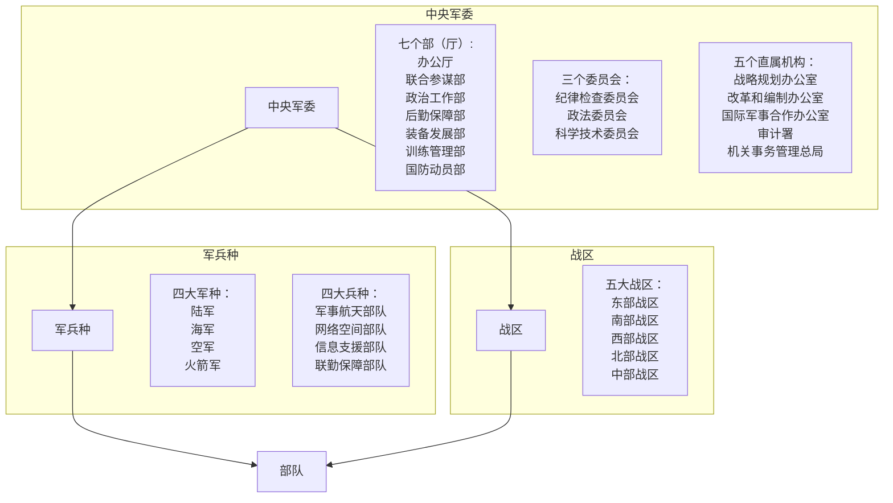
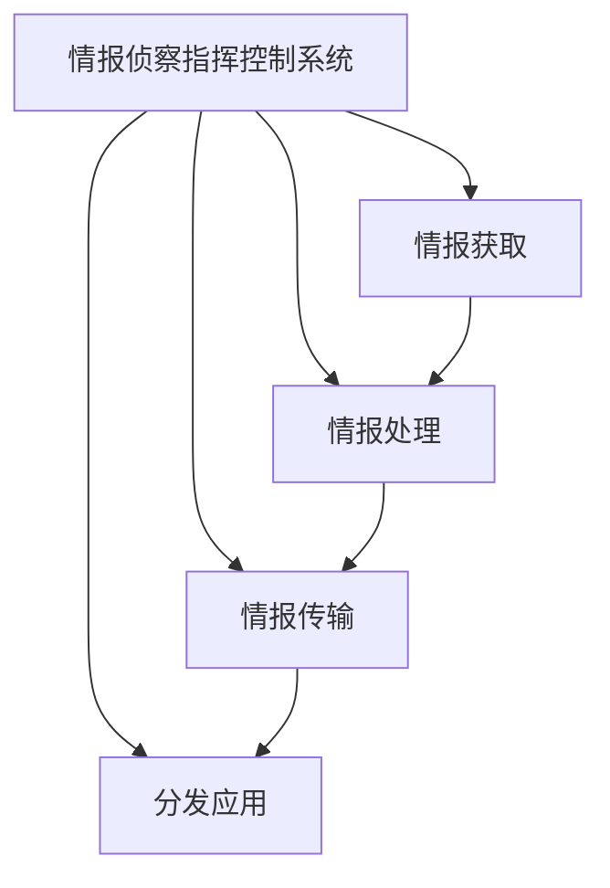

# 军事理论教程
ISBN 978-7-313-14992-3 CIP2016111657
本部编号2026-2-B
___
## 目录<a id = "目录"></a>
[第一章 中国国防](#第一章)<br>
[第二章 国家安全](#第二章)<br>
[第三章 军事思想](#第三章)<br>
[第四章 现代战争](#第四章)<br>
[第五章 信息化装备](#第五章)
___
## 第一章：中国国防<a id = "第一章"></a>
### 第一节：国防概述
1. 国防的含义：国防是国家为抵抗外来侵略与颠覆，捍卫国家主权、领土完整，维护国家安全、统一和发展而进行的军事及与军事有关的政治、经济、科技、文化、教育、外交等方面的活动
2. 现代国防的主要内容：武装力量建设、国防体制建设、国防经济、国防外交、国防科学技术研究、国防工业建设、国防工程建设、战场建设、军事交通、国防动员准备、对人民群众进行国防教育、建立国防法规等
3. 国防的目的：
   1. 捍卫国家的主权
   2. 保卫国家的统一、领土完整
   3. 维护国家的安全和稳定
4. 国家主权的概念：国家主权是一个国家按照自己的意愿，根据本国情况，选择适合自身发展的社会制度、国家制度、政府组织，独立自主的处理国内事务和国际事务而不受他国干预或限制的最高权力和尊严
5. 国家统一的概念：国家统一是指国家由一个中央政府对领土内的一切居民和事务行使完整的管辖权，不允许另立政府或分裂国家的管辖权
6. 领土的概念：领土是指位于国家主权支配下的地球表面的特定部分，包括领土疆界以内的陆地、水域及其上空和底土，即由领陆、领海和领空所组成
7. 国家主权和领土的关系：领土是国家主权行使的对象，没有领土，主权就失去了存在空间和行使对象
8. 领土完整的含义：凡属本国的领土，绝不能丢失，绝不允许分裂、肢解和侵占
9. 国防的四种类型：扩张型，自卫型，联盟型，中立型
10. 各种国防类型的代表：
```
扩张型：美国
自卫型：中国
联盟型：一元体联盟：美日军事同盟，多元体联盟：北约
中立型：瑞士
```
11. 现代国防的基本特征：
    1. 职能的双重性
    2. 对抗的整体性
    3. 目标的层次性
    4. 手段的灵活性
12. 现代国防的目标体系：自卫目标、区域目标、全球目标
13. 国防的地位和作用：
    1. 国防是国家安全的重要保障
    2. 国防是国家独立自主的前提
    3. 国防是国家繁荣发展的重要条件
14. 中国古代国防历经的时间：从公元前21世纪夏王朝的建立到公元1840年鸦片战争爆发
15. 中国古代国防思想：“以民为本”“居安思危”的国防指导思想，“富国强兵”“寓兵于农”的国防建设思想，“爱国教战”“崇尚武德”的国防教育思想，“不战而胜”“安国全军”的国防斗争策略，以及孙武的“知己知彼，百战不殆”“未战先算”“伐谋伐交，不战而胜”等指导原则
16. 军制的概念：军制是指国家或政治集团组织、管理、维护、储备和发展军事力量的制度
17. 我国古代军制建设的内容：军事领导体制、武装力量体制、兵役制度
18. 古代兵役制度
```
奴隶制社会时期：兵民合一的民军制度
秦汉时期：征兵制
三国两晋南北朝时期：世兵制
隋朝时期：府兵制
宋朝时期：募兵制
明朝时期：卫所兵役制
```
19. 古代国防工程的建设：城池、长城、京杭运河及海防要塞
20. 中国国防历史的启示：
    1. 政治的开明是国防巩固的根本
    2. 经济的繁荣是国防强大的基础
    3. 科技的进步是国防强大的保障
    4. 国家的统一和民族的团结，是国防强大的关键
21. 新时代防御性国防政策：
    1. 坚决捍卫国家主权、安全、发展利益
    2. 坚持永不称霸、永不扩张、永不谋求势力范围
    3. 贯彻落实新时代军事战略方针
    4. 坚持走中国特色强军之路
    5. 服务构建人类命运共同体
### 第二节：国防建设
1. 国防建设体制：国防建设体制是指国防领导的组织体系及相应制度，包括国防领导机构的设置、职权划分及相互关系
2. 全国人民代表大会在国防方面的职权：
   1. 决定战争与和平问题
   2. 制定有关国防方面的基本法律
   3. 选举中央军事委员会主席，根据中央军事委员会主席的提名，决定中央军事委员会的其他组成人员，并有权罢免以上人员
   4. 审查和批准包括国防计划在内的国民经济、社会发展计划和计划实行情况的报告
   5. 审查和批准包括国防经费预算在内的国家预算和预算执行情况的报告
   6. 改变或撤销全国人民代表大会常务委员会在国防方面的不适当决定
   7. 应当由全国人民代表大会行使的国防方面的其他职权
3. 全国人民代表大会常务委员会在国防方面的职权：
   1. 在全国人民代表大会闭会期间，如果遇到国家受武装侵略或者必须履行国际共同防止侵略条约的情况，决定战争状态的宣布
   2. 决定全国总动员或者局部总动员
   3. 制定有关国防方面的法律
   4. 在全国人民代表大会闭会期间，审查和批准包括国防建设计划在内的国民经济和社会发展规划计划，包括国防经费预算在内的国家预算在执行过程中所必须做出的部分调整方案
   5. 监督中央军事委员会的工作
   6. 在全国人民代表大会闭会期间，根据中央军事委员会主席的提名，决定中央军事委员会其他组成人员的人选
   7. 根据最高人民法院院长和最高人民检察院检察长的提请，任免军事法院院长和军事检察院检察长
   8. 决定同外国缔结的有关国防方面的条约和重要协定的批准和废除
   9. 规定军人的衔级制度
   10. 规定和决定授予在国防方面国家勋章和荣誉称号
   11. 全国人民代表大会授予的国防方面的其他职权
4. 国家主席在国防方面的职权
   1. 根据全国人民代表大会的决定和全国人民代表大会常务委员会的决定，宣布战争状态
   2. 根据全国人民代表大会的决定和全国人民代表大会常务委员会的决定，发布动员令
   3. 公布全国人民代表大会及其常务委员会制定的有关国防方面的法律
   4. 根据全国人民代表大会常务委员会的决定，对在国防方面具有突出贡献的人员授予国家的勋章和荣誉称号
   5. 根据全国人民代表大会常务委员会的决定，批准和废除同外国缔结的有关国防方面的条约和重要协定
5. 国务院在国防方面的职权：
   1. 编制国防建设发展规划和计划
   2. 制定国防建设方面的方针、政策和行政法规
   3. 领导和管理国防科研生产
   4. 管理国防经费和国防资产
   5. 领导和管理国民经济动员工作和人民武装动员、人民防空、国防交通等方面的有关工作
   6. 领导和管理拥军优属工作和退出现役军人的安置工作
   7. 领导国防教育工作
   8. 与中央军事委员会共同领导民兵的建设和征兵、预备役工作，以及边防、海防、空防的管理工作
   9. 法律规定的与国防事业相关的其他职权
6. 中央军事委员会在国防方面的职权
   1. 统一指挥全国武装力量
   2. 决定军事战略和武装力量的作战方针
   3. 领导和管理中国人民解放军的建设，制定规划、计划并组织实施
   4. 向全国人民代表大会或者全国人民代表大会常务委员会提出议案
   5. 根据宪法和法律制定军事法规，发布决定和命令
   6. 决定中国人民解放军的体制和编制，规定军委机关及战区、军种和其他战区级单位的任务和职责
   7. 依照法律、军事法规的规定，任免、培训、考核、奖惩武装力量成员
   8. 批准武装力量的武器装备体制和武器装备发展规划、计划，协调国务院领导和管理国防科研生产
   9. 会同国务院管理国防经费和国防资产
   10. 法律规定的其他职权
7. 中央军事委员会：实行主席负责制，中央军委主席为全国武装力量的统帅，组成人员为中央军委主席、副主席、委员
8. 中国国防领导体制的突出特点：国防领导权集中在中共中央，国防建设和国防斗争的重大决策由中共中央制定，武装力量的最高领导权属于中共中央
9. 军队领导管理格局：军委管总、战区主战、军种主建
10. 军队领导管理体系：军委——军种——部队
11. 作战指挥体系：在联合作战指挥体制上构建军委——战区——部队的作战指挥体系
12. “三位一体”的人才培养体系：军队院校教育、部队训练实践、军事职业教育
### 第三节：武装力量
1. 武装力量的概念：武装力量是国家或政治集团所拥有的各种武装组织的总称
2. 中国武装力量组织架构：

3. 中央军委各机构职能
```
军委办公厅：中央军委的重要办事机构和执行机关，承担着落实军委首长指示和组织协调军委各职能部门有序运行及相关组织管理工作，其制发的规范性文件具有军事规章的效力
军委联合参谋部：主要履行作战筹划、指挥控制和作战指挥保障，研究拟制军事战略和军事需求，组织作战能力评估，组织指导联合训练、战备建设和日常战备工作等职能
军委政治工作部：主要履行党的建设、组织工作、政治教育和军事人力资源管理等职能
军委后勤保障部：主要履行全军后勤保障规划计划、政策研究、标准制定、检查监督等职能
军委装备发展部：主要履行全军装备发展规划计划、研发试验鉴定、采购管理、信息系统建设等职能
军委训练管理部：主要负责全军军事的统一筹划和组织领导，加强部队和院校管理，使军事训练与部队管理紧密融合，更好推进实战化训练和依法治军、从严治军
军委国防动员部：其主要履行组织指导国防动员和后备力量建设职能，领导管理省军区，从战略层面加强对国防动员和后备力量建设的组织领导
军委纪律检查委员会：主要负责向军委机关部门和战区分别派驻纪检组，发挥纪检监督作用，推动纪委双重领导体制落到实处，强化纪检监督的独立性、权威性
军委政法委员会：主要负责推进依法治军、从严治军，更好的发挥政法部门职能作用，防范和查处违法犯罪活动，保持部队纯洁和巩固
军委科学技术委员会：主要负责加强国防科技战略管理，推动国防科技自主创新，协调推进科技领域军民融合发展
军委战略规划办公室：主要负责完善全军战略规划体制机制，强化军委战略管理功能，加强军队战略规划集中统管，提高国防和军队建设质量和效益
军委改革和编制办公室：主要履行国防和军队改革筹划协调职能，指导推动重大改革实施，负责全军组织编制管理等工作
军委国际军事合作办公室：主要负责对外军事交流合作，管理和协调全军外事工作等
军委审计署：主要履行军队审计监督职能，组织指导全军审计工作
军委机关事务管理总局：主要职能是统一负责军委机关及有关直附属单位管理保障工作，加强资源的统筹管理和使用，减少保障机构和人员，提高管理和保障效益
```
4. 战区的职权使命：战区是本战略方向的唯一最高联合作战指挥机构，按照“平战一体、常态运行、专司主营、精干高效”的要求，根据中央军委赋予的指挥权责，对所有担负战区作战任务的部队实施统一指挥和控制，担负应对本战略方向安全威胁、维护和平、遏制战争、打赢战争的使命
5. 军事科学研究机构和军事院校：
```
中国人民解放军军事科学院：中央军委直接领导下的全军最高军事科学研究机关，是全军军事科学研究中心，是全军军事科学研究的拳头力量
中国人民解放军国防大学：中央军委领导下的最高军事学府，是我军唯一一所综合性联合指挥大学，是培养作战人才和高中级领导干部的重要基地
中国人民解放军国防科学技术大学：中央军委领导下的军队综合性大学，是高素质新型军事人才培养和国防科技自主创新高地
```
6. 中国人民解放军现役部队：是国家的常备军，主要担负防卫作战任务，必要时可依照法律规定协助维护社会秩序，由四大军种和四大兵种组成
7. 陆军：
```
特点：具有较强的火力、突击力和高速机动能力等特点
编成：步兵（摩托化步兵、机械化步兵、山地步兵）、炮兵、装甲兵（坦克兵）、防空兵、陆军航空兵、电子对抗兵、防化兵、通信兵、工程兵等兵种及侦察兵、测绘兵、汽车兵等专业兵
编制序列：军委陆军——集团军——旅——营
使命：是人民解放军的核心力量，在防御外来入侵、保卫国家领土主权、维护国家和平统一与社会稳定与安全方面，起着重要作用
主要武器装备：主战坦克、装甲车辆、反坦克导弹、火炮火箭炮、地地战役战术导弹、高射炮、直升机武装直升机等
```
8. 海军
```
成立时间：1949年4月23日
编成：潜艇部队、水面舰艇部队、海军航空兵、海军岸防兵、海军陆战队和其他专业勤务保障部队，舰队下辖保障基地、舰艇支队等
第一艘航空母舰：2012年9月，“辽宁号”
编制序列：军委海军——海军舰队——基地——舰艇支队
使命：保卫国家海上方向安全、领海主权和维护海洋权益的使命
主要武器装备：潜艇、驱逐舰巡洋舰护卫舰、航空母舰、扫雷舰登陆舰、舰载飞机、冲锋舟气垫船
```
9. 空军
```
成立时间：1949年11月11日
编成：航空兵、地空导弹兵、高射炮兵、雷达兵、空降兵等兵种和通信、电子对抗、气象等专业兵部队
编制序列：军委空军——战区空军——空军基地——航空兵师——防空兵师（旅）——雷达旅（团）等
使命：空中作战和防御的主要力量，担负着保卫国家领空安全、保持全国空防稳定的使命
主要武器装备：各种战斗机、预警机、电子侦察机、空中加油机、防空导弹、高射炮、雷达等
```
10. 火箭军：
```
成立时间：2015年12月31日
编成：地地战略核导弹部队、战役战术常规导弹部队和作战保障部（分）队，下辖导弹基地、训练基地、专业保障部队、院校和科研机构等
编制序列：军委火箭军——基地——旅——营
使命：是我国核力量的主体，肩负着威慑和实战的双重使命
主要武器装备：地地战略导弹、地地战役战术常规导弹、巡航导弹等
```
11. 三位一体战略核力量：火箭军、海军潜地战略导弹部队、空军战略轰炸机部队
12. 预备役部队：
```
定义：以现役军人为骨干，以预备役军官、士兵为基础，按照中国人民解放军的统一编制组建起来的一支部队，是我军后备力量的重要组成部分
成立时间：1983年
主要任务：1. 依照法律规定，担负抢险救灾、协助维护社会秩序、应对突发事件和参加国家经济建设等 2. 战时根据国家需要，成建制快速动员转为现役部队，遂行作战、勤务保障等
```
13. 中国人民武装警察部队
```
编制体制：由党中央、中央军委统一领导，实行中央军委——武警部队——部队领导指挥体制
组成：内卫总队、机动总队、海警部队、院校
职能：
1. 海上维权执法，维护国家主权和尊严
2. 预防和镇压敌对势力的破坏，应对各种紧急情况，维护社会治安
3. 执行维稳和反恐任务，保障人民生命财产安全
4. 防卫作战
主要武器装备：以步兵轻型武器为主，配有特种武器和少量重型武器等
```
14. 民兵的概念：民兵是不脱离生产的群众武装组织，是中华人民共和国武装力量的组成部分，是中国人民解放军的助手和后备力量
15. 民兵的任务：
    1. 担负战备勤务
    2. 参加防卫作战
    3. 协助维护社会治安稳定
16. 民兵军事训练的主要对象：民兵干部和基干民兵，其中民兵干部和民兵应急分队、专业技术分队是训练的重点
### 第四节：国防动员
1. 国防动员的含义：指国家或政治集团由平时状态转入战时状态，统一调动人力、物力、财力为战争服务所采取的措施
2. 国防动员的内容：包括武装力量动员、国民经济动员、科学技术动员、防空动员、国防交通动员、政治动员
3. 国防动员的分类：总动员和局部动员
4. 总动员和局部动员的关系：实施总动员还是局部动员是由国家战略意图决定的，两者在一定条件下会相互转化
5. 武装力量动员的内容：
   1. 扩编现役部队
   2. 预备役部队转为现役部队
   3. 将地方部队升为野战部队
   4. 征召预备役人员
   5. 动员和组织民兵参军参战
6. 国民经济动员的目的：充分调动国家的经济能力，保障战争的需要
7. 国民经济动员的内容
   1. 改组国民经济各部门，集中管理和使用战争潜力
   2. 调整国民经济比例，重新分配人力物力财力，统筹安排军需和民用
   3. 调整经济建设布局，搬迁、疏散重要工厂和战备物资
   4. 改组工业结构和产品结构，实施工业转产，加速武器装备的研制和生产
   5. 调动交通运输、邮电通信、医疗卫生及财政等各行业的力量，为战争服务，保障战争的需要
8. 人民防空动员的内容：依据国家有关法律法规，动员社会力量进行防空设施建设；组建防空专业队伍，普及防控知识教育；组织隐蔽疏散，配合防空作战，消除空袭后果
9. 国防交通动员的内容：
   1. 根据战争规模和作战需要，有计划的将平时国防交通领导机构迅速按方案扩编为战时交通运输指挥机构，政府交通运输部门随即转入战时体制
   2. 根据作战保障需要，动员、征用社会运输力量，必要时对交通运输系统实行不同范围不同形式的军事化管理
   3. 动员、组织各交通保障队伍和交通保障物资器材迅速到位，担负运输、抢修、防护任务
   4. 根据统帅部的决定，做好对弃守地区的交通遮断准备，保障及时遮断
10. 国防动员的基本原则：
    1. 服从大局，统筹兼顾
    2. 全面规划，长期准备
    3. 平战结合，军民结合
    4. 严密组织，快速高效
    5. 因敌因势，协调灵活
11. 国防动员的意义：
    1. 国防动员是增强国防实力的有效手段
    2. 国防动员是增强国防威慑力的重要措施
    3. 国防动员是夺取战争主动权的有力保障
### 第五节：国防法规：
1. 国防法规的概念：国防法规调整国防和武装力量建设领域各种社会关系的法律规范的总和
2. 我国现行国防法规的等级：
   1. 全国人民代表大会及其常务委员会制定颁布的基本法律和基本法律以外的其他法律
   2. 国务院、中央军委制定颁布的行政法规
   3. 由国务院所属各部委和中央军委所属各机关制定颁布的法规和规章
   4. 由各战区和各军兵种制定颁布的法规细则
   5. 各省、自治区、直辖市人大和政府制定的地方性法规
3. 国防法规在国防建设中的地位和作用：
   1. 实现国防决策权威性和高效性
   2. 加强国防实力建设的重要保障
   3. 指导国家战争潜力积蓄的重要手段
   4. 国防法规是促进国防潜力向国防实力转化的重要机制
4. 我国现行的主要国防法规：《中华人民共和国宪法》《中华人民共和国兵役法》《中华人民共和国国防法》《中华人民共和国国防教育法》
5. 宪法对国防方面的规定：
   1. 规定了我国武装力量的性质
   2. 规定了我国武装力量的根本任务
   3. 规定了我国武装力量的建设目标
   4. 规定了公民保卫祖国的义务
   5. 规定了中央军事委员会的地位和作用
6. 《中华人民共和国兵役法》的内容：兵役制度、兵役登记、平时征集、士兵的现役和预备役、服役待遇和抚恤优待、法律责任
7. 《中华人民共和国国防法》的内容：
   1. 国家机构的国防职权
   2. 武装力量
   3. 国防教育
   4. 公民的国防义务和权力
___
[返回目录](#目录)
___
## 第二章：国家安全<a id = "第二章"></a>
### 第一节：国家安全概述
1. 国家安全的战略要素：利益定位、威胁判断、目标选择、手段的应用
2. 威胁判断的基本要素：
   1. 是否有重大利益抵触
   2. 是否具有实际能力抗衡
   3. 是否有针对性战略
   4. 是否展开综合力量部署
3. 国家战略力量：国家战略力量是国家硬实力、软实力之和。硬实力包括：国家资源力量、经济力量、武装力量等；软实力包括：一个国家经久不衰的历史文化传统和价值观，健康稳定的社会结构和富含生命力的政治制度，全民族共同一致的奋斗目标，领导人物的道德感召力和战略决策力，民族基本素质等
4. 总体国家安全观的内容：
   1. 政治安全：政治方面免于各种因素侵害和威胁的客观状态
   2. 国土安全：基本内涵是指领土与领土主权不受侵犯和威胁，领土不被侵占、不被分裂、不被分割或兼并；其外延包括国际法规定的专属经济区和大陆架的自然资源所有权和管辖权不受侵犯和威胁
   3. 军事安全：国家的主权和领土乃至网络、太空等新维空间不受敌对国家或国家集团的威胁和侵犯的状态
   4. 经济安全：一国的经济整体免受各种因素尤其是外部因素冲击，或即便遭遇冲击也能保持经济利益不受重大损害的状态
   5. 文化安全：保护本国优秀文化和价值观免遭异国有害文化的渗透和侵犯
   6. 社会安全：从广义上讲，是指社会秩序的运行状态，其强调协调的社会群体结构和有序的社会状态的统一；从狭义上讲，包括对违法犯罪、突发事件和灾害（人为灾害和自然灾害）的有效控制
   7. 科技安全
   8. 信息安全：广义的信息安全指一个国家或地区的信息化状态和信息技术体系不受威胁和侵害，狭义上的信息安全指信息系统（包括信息网络）的硬件、软件及其数据、内容等不被破坏和泄露、不被非法攻击，信息系统保持连续可靠运行，信息服务不中断的一种状态
   9. 生态安全：指生态系统完整性和健康的整体水平、尤其是指生存和发展的不良风险最小以及不受威胁的状态
   10. 资源安全：一个国家或地区可以持续、稳定、即时、足量和经济地获取所需自然资源的状态
   11. 核安全：广义上的核安全指涉及核材料及放射性核素相关的安全性问题，狭义上的核安全指在核设施的设计、建造、运行和退役期间，为保护人员、社会和环境免受可能的放射性危害所采取的技术上和组织上的措施的综合
   12. 生物安全：指由现代生物技术开发和应用对生态环境和人体健康造成的潜在威胁，及对其所采取的一系列有效预防和控制措施
5. 国土安全的意义：
   1. 国土安全是国家生存与发展的必要前提
   2. 国土安全是国家政治安全的一个重要标志
   3. 国土安全是国家经济发展的基本保障
6. 信息安全状态的主要表现：机密性、完整性、可认证性、不可否认性、可控性、可用性
7. 总体国家安全观的五大要素：以人民安全为宗旨，以政治安全为根本，以经济安全为基础，以军事、文化安全、社会安全为保障，以促进国际安全为依托
8. 总体国家安全观的五对关系：既重视外部安全、又重视内部安全，既重视国土安全、又重视国民安全，既重视传统安全、又重视非传统安全，既重视发展问题、又重视安全问题，既重视自身安全、又重视共同安全
### 第二节：国家安全形势
1. 国家的地缘环境的概念：指影响国家安全的地理位置、地理特征及与地理密切相关的国家关系等因素
2. 我国地缘环境的基本概况：
   1. 我国是一个陆海大国，拥有漫长的陆地边界和海岸线
   2. 我国邻国众多，外部安全环境复杂
   3. 我国为众多大国利益交汇点，战略地位重要
3. 我国的邻国：
   1. 陆上邻国：朝鲜、俄罗斯、蒙古、哈萨克斯坦、吉尔吉斯斯坦、塔吉克斯坦、阿富汗、巴基斯坦、印度、尼泊尔、不丹、缅甸、老挝、越南
   2. 海上邻国：朝鲜、韩国、日本、菲律宾、马来西亚、印度尼西亚、文莱、越南
   3. 既是陆上邻国，又是海上邻国：朝鲜、越南
4. 两大地缘战略区：海洋地缘和亚欧大陆地缘
5. 我国所处的地缘战略区：我国属于亚欧大陆地缘战略区，背靠亚欧大陆，面向太平洋，处于两大地缘战略区的交接处，现在是对两大地缘战略区关系起主要作用和影响的国家
6. 我国地缘安全面临的威胁和挑战：
   1. 美国对我国安全构成重大挑战
   2. 陆上安全威胁不容乐观
   3. 中亚安全形势堪忧
   4. 海上安全威胁日益突出
   5. 台海局势存在逆转风险
7. 美国对我国安全构成的挑战：
   1. 继续对我国进行战略遏制
   2. 增加在西太平洋的军事力量部署
   3. 经济上频繁对我国进行施压
8. 陆上安全威胁：
   1. 朝鲜半岛局势存在变数
   2. 边界领土争端依然存在，解决争端难度较大
   3. 印巴两国在传统安全领域和非传统安全领域存在较强的竞争和冲突，地区安全形势存在诸多不确定因素
9. 海上安全威胁：
   1. 东海军事冲突可能性存在
   2. 南海斗争形势复杂严峻
10. 台海局势风险：
    1. 美国出于自身利益，阻碍台湾与大陆实现统一是其一贯立场
    2. 台湾岛内政治生态日益复杂，总体呈现 “国”退“民”进的态势
11. 新型领域的国家安全：太空安全、深海安全、极地安全、海外利益安全
### 第三节：国际战略形势
1. 当前国际战略形势现状：
   1. 强权政治和冷战思维仍是威胁世界和平与稳定的重要根源
   2. 大国关系面临新的调整，竞争与博弈加剧
   3. 安全环境复杂多变
   4. 全球治理体系出现新变化
2. 国际战略形势发展趋势：
   1. 国际战略格局走向多极化
   2. 国际战略力量之间的斗争更加剧烈
   3. 中国在国际战略形势中的影响力将愈显突出
3. 国际战略中两极体制解体，并最终走向多极化的根本动因：世界政治经济发展不平衡所导致的均衡化趋势
4. 中国在国际战略形势中的影响力：
   1. 在反对霸权主义和强权政治上起制约作用
   2. 在经济发展上起示范作用
   3. 在维护第三世界权益的斗争中发挥重要作用
### 第四节：构建人类命运共同体
1. 构建人类命运共同体的内容：
   1. 坚持对话协商，建设一个持久和平的世界
   2. 坚持共建共享，建设一个普遍安全的世界
   3. 坚持合作共赢，建设一个共同繁荣的世界
   4. 坚持交流互鉴，建设一个开放包容的世界
   5. 坚持绿色低碳，建设一个清洁稳定的世界
___
[返回目录](#目录)
___
## 第三章：军事思想<a id = "第三章"></a>
### 第一节：军事思想概述
1. 军事思想的含义：军事思想是关于战争、军队和国防的基本问题的理性认识，它是人们长期从事军事实践的经验总结和理论概括
2. 军事思想的表现：军队和国防建设、战争准备与实施的指导理论和基本原则
3. 军事思想研究的内容：
   1. 军事哲学：主要内容有战争观、军事问题的认识论和方法论
   2. 军事实践的基本方针和原则：主要内容有战争指导的基本方针和原则、军队建设的基本方针和原则、国防建设的基本方针和原则
4. 军事思想的基本特征：
   1. 鲜明的阶级性
   2. 强烈的时代性
   3. 明显的继承性
   4. 显著的实践性
5. 军事思想的地位和作用：
   1. 军事思想是认识军事问题的理论基础
   2. 军事思想是进行军事预测的思想方法
   3. 军事思想是军事实践的行动指南
### 第二节：外国军事思想
1. 拿破仑军事思想的主要体现：
   1. 重视武力和思想的双重作用
   2. 十分重视军队的改革和建设
   3. 十分重视歼灭战的作战原则，把消灭敌人的有生力量作为战争的主要目的
2. 克劳塞维茨的军事思想
   1. 战争是社会集团为了达到一定目的的暴力行动
   2. 政治是战争的母体
   3. 战争的政治目的是消灭敌人，消灭敌人必然要通过武力决战，通过战斗才能达到，它是一种比其他一切手段更为优越、更为有效的手段
   4. 进攻和防御是两种基本作战形式，二者是相互联系、相互转化的
3. 克劳塞维茨的著名论断：“战争无非是政治通过另一种手段的延续”
4. 若米尼军事思想的主要观点：
   1. 高度重视战史在创立战争理论中的重要作用
   2. 提出了战略是进行战争的科学，战术是进行战斗的科学
   3. 肯定了进攻的重要性，认为进攻优于防御
   4. 强调了要集中兵力，并及时的将主力投到具有决定意义的地段
   5. 主张快速机动、果断突击，并毫不迟疑的追击敌人
5. 其他军事思想：
```
马汉：海军制胜论
杜黑：空军制胜论
富勒：坦克制胜论，机械化战争论
```
### 第三节：中国古代军事思想
1. 中国古代军事思想形成和发展经历的时期：
   1. 萌生时期：公元前21世纪至公元前8世纪
   2. 形成时期：公元前8世纪至公元前3世纪
   3. 充实提高时期：公元前3世纪到公元10世纪中期
   4. 系统完善时期：公元10世纪至公元19世纪中叶
2. 萌生时期军事思想的主要内容：
   1. 在战争的看法上，强调天命、伸张正义和保民
   2. 在治军上，强调齐众以律
   3. 在战争指导上，以重礼信仁义为主导思想等
3. 中国古代军事思想基本形成的标志：以《孙子兵法》为代表的一大批兵书的诞生
4. 形成时期军事思想的主要内容：对战争认识逐步深化，形成了比较系统的建军理论，提出了一系列战争指导和作战原则，奠定了古代军事哲学思想的基础
5. 充实提高时期军事思想的主要内容：
   1. 高度重视战略谋划
   2. 国防建设思想呈现新的特点
   3. 作战指导思想有新的发展
6. 系统完善时期军事思想的主要内容：
   1. 以兵权高度集中为统兵建军宗旨
   2. 练兵、练战思想日益深化、系统，对将领的培养教育制度化、系统化
   3. 战略思想更加丰富、系统
7. 中国古代军事思想的基本内容：
   1. 战争的起因、性质、作用
   2. 战争与政治、经济、主观指导的关系
   3. 将帅修养
   4. 治军
   5. 战略战术：全胜战略、常备不懈、力争主动、先发制人、集中兵力、出其不意、奇正互变、速战速决
   6. 战争其他保障
8. 《孙子兵法》的军事思想
```
战争观：重战、慎战、备战
治军理论：将帅选用（作用、标准、品德修养、使用原则）、军队管理（重视政治建军、军队管理、编制和指挥）
战略战术思想：
1. 知己知彼，全局筹划的战略思想
2. 充分准备，未战先胜的战略思想
3. 以“全”争胜，不战而屈人之兵的战略思想
4. 强调进攻速胜，反对持久作战的战略思想
5. 因粮于敌的战略后勤思想
6. 致人而不致于人，争取战争主动权
7. 因敌制胜，灵活用兵
8. 奇正结合，出奇制胜
9. 集中兵力，以众击寡
10. 扬长避短，避实击虚
```
### 第四节：中国当代军事思想
1. 毛泽东军事思想的含义：毛泽东军事思想是以毛泽东为主要代表的中国共产党人关于中国革命战争、人民军队和国防建设及军事领域一般规律性问题的科学理论体系
2. 毛泽东军事思想的重要特征：
   1. 毛泽东军事思想是马列主义基本原理与中国革命战争和新中国国防建设具体实践相结合的产物
   2. 毛泽东军事思想是中国革命战争和国防建设实践经验的科学总结
   3. 毛泽东军事思想是以毛泽东为代表的中国共产党人集体智慧的结晶
   4. 毛泽东军事思想是毛泽东思想的重要组成部分
3. 毛泽东军事思想的形成和发展：
   1. 毛泽东军事思想产生：从1921年中国共产党成立到1935年遵义会议召开前
   2. 毛泽东军事思想基本形成：从1935年遵义会议的召开到1945年抗日战争胜利
   3. 毛泽东思想全面成熟：解放战争时期
   4. 毛泽东军事思想不断发展：中华人民共和国成立以后
4. 毛泽东军事思想的历史地位：
   1. 毛泽东军事思想丰富发展了马列主义军事理论
   2. 毛泽东军事思想是中国革命取得胜利和国防建设的理论指南
   3. 毛泽东军事思想在世界上具有广泛而深刻的影响
5. 毛泽东军事思想的战争观：
   1. 战争的起源与根源：私有财产和阶级的存在是战争的起源，霸权主义是当今战争的主要根源
   2. 战争的本质和目的：战争具有政治目的、军事目的、经济目的。战争的政治目的是战争的本质；战争的军事目的“保存自己，消灭敌人”，这是战争的根本目的，也是一切战争行动的依据战争的经济目的则是追求一定的经济利益，战争最终是为了达到某个阶级、政党、民族、国家或国家集团的经济目的
   3. 拥护正义战争，反对非正义战争
   4. 战争的最终目的和消灭战争的途径：消灭战争，实现人类永久和平是无产阶级研究和进行战争的最终目的，只有消灭了私有制和阶级，才能最终消灭战争，消灭战争的途径只有用战争反对战争
6. 战争方法论的内涵：是解决如何认识和运用战争规律，确定战争指导规律，正确指导战争
7. 毛泽东军事思想的战争方法论：必须认识和把握战争规律，认识和把握战争规律的基本方法
8. 认识战争规律的科学方法：
   1. 主观指导必须符合客观实际
   2. 着眼特点，着眼发展
   3. 关照全局，把握关节
9. 如何解决战场上的主客观一致：
    1. 熟悉双方敌我客观情况
    2. 善于学习，勇于实践
    3. 在客观物质的基础上，充分发挥自觉能动性
10. 毛泽东人民军队建设思想：
    1. 人民军队的性质：我军必须是中国共产党绝对领导下的、代表人民群众利益、执行无产阶级革命政治任务的武装集团，坚持党对军队的绝对领导，是人民军队坚持的根本原则，党的领导是保证人民军队无产阶级性质的根本领导制度
    2. 人民军队的宗旨：全心全意为人民服务的宗旨，这是我党建军原则的核心，是我军区别于其他任何军队的本质特征，是我军团结战斗的思想基础，是战胜一切敌人的力量源泉，是我军一切工作的出发点和落脚点
    3. 人民军队的三大任务：战斗队、工作队、生产队
    4. 人民军队的三大民主：政治民主、经济民主、军事民主
    5. 人民军队政治工作的三大原则：官兵一致、军民一致、瓦解敌军
    6. 人民军队铁的纪律
    7. 人民军队的顽强作风和勇敢牺牲精神
11. 三大纪律八项注意：
    1. 三大纪律：一切行动听指挥，不拿群众一针一线，一切缴获要充公
    2. 八项注意：说话和气，买卖公平，借东西要还，损坏东西要赔，不打人骂人，不损坏庄稼，不调戏妇女，不虐待俘虏
12. 毛泽东人民战争思想：
```
人民战争含义：被压迫阶级和被压迫民族为谋求自身解放，发动和依靠广大人民群众所进行的战争
人民战争属性：群众性、正义性、组织性
毛泽东人民战争思想的基本含义：从广大人民的利益出发，在中国共产党的领导下，以人民军队为骨干，充分依靠和的动员人民群众，建立农村革命根据地，实行主力兵团和地方兵团的相结合，正规军与游击民兵相结合，武装斗争与非武装斗争相结合，并使武装斗争与各种武装斗争形式密切配合的全面彻底的人民战争
人民战争思想的理论基础：
1. 人是战争胜负的决定因素
2. 人民群众是战争胜利的决定力量
3. 战争的正义性是实行人民战争的前提
4. 马克思主义政党的正确领导是实行人民战争的必要条件
人民战争思想的主要内容：
1. 坚持中国共产党对革命战争的统一领导
2. 深入发动群众，结成最广泛的革命统一战线
3. 实行以人民军队为骨干的三结合武装力量体制
4. 以武装斗争为主与其他斗争形式相结合
5. 建立巩固的革命根据地
6. 创造一整套适应人民战争的战略战术
```
13. 毛泽东人民战争的战略战术：
    1. 实行积极防御的战略思想
    2. 战略上藐视敌人，战术上重视敌人
    3. 保存自己，消灭敌人
    4. 歼灭战是基本的作战方针
    5. 集中优势兵力，各个歼灭敌人
    6. 慎重初战，不打无准备无把握之仗
    7. 三种作战形式密切配合并适时转换
    8. 在决战问题上，执行有利的决战，避免不利的决战
    9. 作战指导的主动性、灵活性和计划性
    10. 重视后勤保障和军队的适时休整等
14. 邓小平新时期军队建设思想的内容：
    1. 对战争与和平问题的认识
    2. 军队和国防建设指导思想实行战略性转变
    3. 军队和国防建设要服从国家经济发展大局
    4. 建设一支现代化、正规化的革命军队
    5. 实行积极防御的军事战略方针
    6. 把军队教育训练提高到战略地位
15. 邓小平新时期军队建设思想对战争与和平的认识：
    1. 和平与发展是当今时代的主题
    2. 当前世界大战可以避免
    3. 霸权主义是当代战争的根源
16. 邓小平新时期军队建设思想军队和国防建设要服从国家经济发展大局的相关内容：
    1. 服从国家经济发展大局是新时期军队建设的根本原则
    2. 军队和国防建设要与国家经济建设协调发展
17. 邓小平新时期军队建设思想建设一支现代化、正规化的革命军队的相关内容：
    1. 坚持人民军队性质
    2. 以现代化建设为中心
    3. 重视正规化建设
18. 邓小平新时期军队建设思想实行积极防御的军事战略方针的相关内容：
    1. 我国新时期军事战略方针仍然是积极防御
    2. 新时期积极防御战略方针有新的历史内涵
    3. 坚持积极防御的战略方针，必须坚持现代条件下人民战争的战略思想
19. 江泽民国防和军队建设思想：
    1. 从国际战略全局和国家发展大局谋划国家安全
    2. 确立新时期积极防御的军事战略方针
    3. 积极推进中国特色军事变革
    4. 国防建设和经济建设协调发展
    5. 党对军队的绝对领导是我军永远不变的军魂
    6. 紧紧围绕“打得赢、不变质”两个历史性课题，全面推进军队建设
    7. 实施科技强军战略，走中国特色精兵之路
    8. 确立依法治军方针，不断提高部队管理水平
20. 胡锦涛国防和军队建设思想：
    1. 党对军队绝对领导是军队建设和发展的首要问题
    2. 在国防和军队建设中贯彻落实科学发展观
    3. 全面有效履行新世纪新阶段我军历史使命
    4. 永葆人民军队的性质本色和作风
    5. 积极推进机械化条件下军事训练向信息化条件下军事训练转变
    6. 不断提高部队科学管理水平
    7. 积极稳妥的推进中国特色军事变革
21. 习近平强军思想的科学含义：习近平军事思想是世界正处于百年未有之大变局、中国特色社会主义进入新时代的历史条件下，深刻回答了强军兴军的使命任务、目标方向、原则制度、根本指向、战略布局、重要路径等一系列根本性问题，是个逻辑严密、意蕴深远的科学军事理论体系。习近平强军思想是习近平新时代中国特色社会主义思想的重要组成部分，是对毛泽东军事思想、邓小平新时期军队建设思想、江泽民国防和军队建设思想、胡锦涛国防和军队建设思想的继承和发展，是党的军事指导理论的最新成果，是坚持走中国特色强军之路、全面加快推进新时代国防和军队现代化建设的科学指南
22. 习近平新时代军事思想的地位和作用：
    1. 开辟了马克思主义军事理论中国化时代化的新境界
    2. 擘画了全面建成世界一流军队的宏伟蓝图
    3. 塑造了新时代人民军队的新样子
    4. 立起了全军官兵奋斗强军的精神旗帜
23. 习近平强军思想的主要内容：
    1. 明确强国必须强军，巩固国防和强大人民军队是新时代坚持和发展中国特色社会主义、实现中华民族伟大复兴的的战略支撑
    2. 明确党在新时代的强军目标是建设一支听党指挥能打胜仗作风优良的人民军队，必须同国家现代化进程相一致，力争到2035年基本实现国防和军队现代化，到本世纪中叶把人民军队全面建成世界一流军队
    3. 明确党对军队的绝对领导是人民军队建军之本、强军之魂，必须全面贯彻党领导军队的一系列根本原则和制度，确保部队绝对忠诚、绝对纯洁、绝对可靠
    4. 明确军队是要准备打仗的，必须聚焦能打仗、打胜仗，创新发展军事战略指导，构建中国特色现代作战体系，全面提高新时代备战打仗能力，有效塑造态势、管控危机、遏制战争、打赢战争
    5. 明确作风优良是我军鲜明特色和政治优势，必须加强作风建设、纪律建设，坚定不移正风肃纪、反腐惩恶，大力弘扬我党我军光荣传统和优良作风，永葆人民军队性质、宗旨、本色
    6. 明确推进强军事业必须推进政治建军、改革强军、科技强军、人才强军、依法治军，更加聚焦实战、更加注重创新驱动、更加注重体系建设、更加注重集约高效、更加注重军民融合，全面提高革命化现代化正规化水平
    7. 明确创新是引领发展的第一动力，必须坚持向科技创新要战斗力，统筹推进军事理论、技术、组织、管理、文化等各个方面创新，建设创新型人民军队
    8. 明确现代化军队必须构建中国特色军事法治体系，推动治军方式根本性转变，提高国防和军队建设法治化水平
    9. 明确改革是强军的必由之路，必须推进军队组织形态现代化，构建中国特色现代化军事力量体系，完善和发展中国特色社会主义军事制度
    10. 明确军民融合发展是兴国之举、强军之策，必须坚持发展和安全兼顾，富国和强军统一，形成全要素、多领域、高效益的军民融合深度发展格局，构建一体化的国家战略体系和能力
___
[返回目录](#目录)
___
## 第四章：现代战争<a id = "第四章"></a>
### 第一节：战争概述
1. 战争的本质：战争是政治的延续
2. 战争的特点：社会性、暴力性、对抗性、破坏性
3. 战争的起源：引发战争的直接因素，如政权争夺、领土争端、经济冲突、民族矛盾、宗教纠纷、价值观推广等
4. 战争的根源：阶级社会战争的根源产生于私有制和剥削阶级
5. 人类脱离原始社会的标志：私有制的确立、阶级的形成、国家的产生
6. 战争的发展历程：
   1. 冷兵器军事革命催生冷兵器战争
   2. 热兵器军事革命催生热兵器战争
   3. 机械化军事革命催生机械化战争
   4. 信息化军事革命催生信息化战争
### 第二节：新军事革命
1. 军事革命含义的三个要点：
   1. 军事革命是科学技术进步和时代变革的产物
   2. 军事革命涉及军事领域的各个方面
   3. 军事革命引起的变革是质变
2. 新军事革命的含义：以工业社会向信息社会过渡为主要动因，以高科技特别是信息技术的发展为直接动力，以信息为“基因”，以信息化建设和“系统集成”为主要手段，为争夺下个世纪国际战略格局中的有利地位为根本目的，把适应打机械化战争的工业时代的机械化军队，建设成适应打信息化战争的信息时代的信息化军队的一场革命
3. 新军事革命包含的四大要素：新军事技术、新武器装备、新军事理论和新组织体制
4. 新军事革命的发展演变：
   1. 新军事革命的酝酿准备时期：大概是20世纪80年代末
   2. 新军事革命的开始启动时期：20世纪90年代初、中期
   3. 新军事革命的“全面展开”时期：20世纪90年代中后期
5. 新军事革命的主要内容：
   1. 新军事技术：新军事工程技术，新军事探测技术，新军事通信技术。新军事技术的核心是军事信息技术群，包括军事微电子技术、军事计算机技术、军事光电子技术、军事航天技术
   2. 新武器装备：信息化作战平台，智能化弹药，单兵数字化装备，C^4^ISR系统，军用智能机器人
   3. 新军事理论：国家安全概念的新变化，战争内涵的新发展（战争观的新内涵，作战思想的新发展，作战样式的新类型）
   4. 新军事组织体制：军队规模将进一步缩小，军事力量结构将不断优化，作战指挥体制将“扁平网络化”，部队编制将小型化、一体化、多能化
6. C^4^ISR系统的内涵：即指挥自动化系统，是指在军事指挥体系中采用电子计算机为核心的技术与指挥人员相结合、对部队和武器实施指挥与控制系统的人机系统
7. C^4^ISR系统的组成：指挥分系统（command），控制分系统（control），通信分系统（communication），电子计算机分系统（computer），情报（intelligence）、监视（surveillance）、侦察（reconnaissance）分系统
### 第三节：机械化战争
1. 机械化战争的内涵：机械化战争是大量使用坦克、装甲战车、飞机、潜艇、航空母舰等机械化武器装备进行的战争
2. 机械化战争的特点：
   1. 武器装备的性能优良
   2. 作战力量增多
   3. 战场范围扩大
   4. 出现了许多新的作战样式
   5. 立体作战、纵深作战成为重要作战方式
### 第四节：信息化战争
1. 信息含义包括的四个方面：
   1. 信息是一种消息，即是人们通信时要告诉对方的内容
   2. 信息是人们进行运算和处理的条件、内容和结果，常常以数字、数据、图像、曲线和控制指令等形式出现
   3. 信息是事物运动、发展和变化的情况和动态
   4. 信息是人类能够直接或间接感知的一切有意义的实质性东西，即是人类感性认知的来源和形成理性认识（经验、知识）的基础
2. 信息的定义：信息是通过一定载体反应出来的，表征客观事物和方式，互联系程度及规律的陈述
3. 信息技术的基本概念：指能够完成信息的获取、传递、处理、再生和应用等功能的各种技术的统称，主要包括三个层次：信息基础技术、信息主体技术、信息应用技术
4. 信息化战争的内涵：信息化战争是信息时代的产物，是交战双方在信息化战场上，以信息化军队为主要作战力量、以信息化武器为主要作战形式、以争夺信息权为主要对象的战争
5. 信息化战争的构成要素：
   1. 信息时代
   2. 信息化战场：包括了以人工构建的信息化网络设施为基础，以地空天一体的侦察、通信、指挥、控制、情报等系统为核心，以陆、海、空、天、电及心理和认知等多维一体的活动空间，主要分为有形战场和无形战场
   3. 信息化军队
   4. 信息化武器装备：指充分运用计算机技术、信息技术、微电子技术等现代高技术，具备探测、传输、处理、控制、制导、对抗等功能的武器装备，主要包括软杀伤型武器（信息战装备）、硬杀伤型武器（信息化弹药）、新概念武器等
   5. 信息战：也称为指挥控制站、决策控制站，旨在以信息为主要武器，打击敌方的认识系统和信息系统，影响、制止或改变敌方决策者的决心，以及由此引发的敌对行为
   6. 制信息权：是指在一定时间和空间范围内对战场信息的控制权，主要表现在三个基链环（信息获取、信息传递、信息处理和利用）和五种基本手段（侦察反侦察、干扰反干扰、破坏反破坏、摧毁反摧毁、控制反控制）上握有优势
6. 信息化战争的基本特征：
   1. 信息资源主导化
   2. 战场空间多维化
   3. 作战要素一体化
   4. 作战指挥扁平化
   5. 战争持续时间短促化
   6. 作战样式多样化
___
[返回目录](#目录)
___
## 第五章：信息化装备<a id = "第五章"></a>
### 第一节：信息化装备概述
1. 武器装备相关概念：
```
《中国人民解放军军语》：
武器：亦称兵器、即能够直接杀伤敌方有生力量和破坏敌方设施的器材与装置的统称
武器装备：用以实施和保障作战行动的武器、武器系统和军事技术器材的统称
装备：1. 武器装备的简称 2. 向部队或分队配发武器及其他制式军用物件的活动
《军事百科全书》：
装备：1. 武器装备的简称，即武装力量用于实施和保障军事行动的武器、武器系统和军事技术装备与器材 2. 向部队或分队配发武器及其他制式军用物件的活动
武器：亦称兵器，即直接杀伤有生力量和破坏军事设施的器材与装置的统称
武器装备：即武装力量用于实施和保障军事行动的武器、武器系统和与之配套的军事技术装备与器材
军事装备：用于军事目的的各种装备的统称。军事装备的主体是武器装备，此外，还包括后勤装备、训练装备、文化装备和科研装备等
```
2. 信息化装备的概念内涵：信息化装备是指信息技术在装备技术构成中占主导地位，信息要素在作战行动中支配物质、能量要素的效能发挥，具有较高信息获取、传输、处理、存储、共享、管理、分发、对抗能力及数字化、智能化、网络化和一体化水平的武器、武器装备系统和军事技术器材的统称
3. 信息化装备体系结构的核心：军事信息系统
4. 信息化装备的主战力量：各种信息化作战平台、精确制导弹药、信息战装备、一部分新概念武器等软、硬杀伤力量，用于保障作战行动的各种信息化军事技术器材
5. 信息化装备分类：信息化主战设备、军事信息系统、信息化保障装备
6. 信息化装备对现代战争的影响：
   1. 侦察立体化
   2. 反应快速化
   3. 打击精确化
   4. 防护综合化
   5. 控制智能化
7. 信息化作战平台的发展趋势：隐形化、多功能化、无人化
8. 信息化弹药主要发展趋势：灵巧型、智能型
9. 信息化单兵系统发展趋势：不断提高单兵装备的信息化程度
10. 空间战和信息战武器发展趋势：天战将是未来战争的主战场之一，天战武器包括：反导武器、反卫星武器、空天飞机、太空作战飞行器
11. 军事信息系统发展趋势：网络化，功能综合化，三军系统集成化，侦察、通信、导航卫星化
### 第二节：信息化作战平台
1. 信息化作战平台的概念：即信息化武器及其载体的总称，包括信息化的坦克与装甲车、火炮与导弹发射装置、飞机以及直升机、舰艇等作战平台
2. 信息化陆上作战平台主要包括：坦克、步兵战车、装甲运输车、自行火炮车、导弹运输和发射车及指挥控制车辆等，陆上作战平台大都以自行式车辆为主，且以履带式为主，少数采用轮式车辆
3. 信息化陆上作战平台对作战的影响：
   1. 军队机动作战能力增强
   2. 陆军纵深攻击能力增大
   3. 战斗指挥和协同复杂
   4. 战斗非线性特征明显
4. 信息化海上作战平台主要包括：水面舰艇和潜艇等各种作战舰艇，信息化水面舰艇包括航空母舰、驱逐舰、巡洋舰、护卫舰、高速攻击艇、水雷战舰艇、两栖舰艇和军辅船等，现代潜艇包括弹道导弹核潜艇、攻击型核潜艇和常规舰艇
5. 信息化海上作战平台对作战的影响：
   1. 海上作战方式发生改变
   2. 作战进程和节奏加快
   3. 战场空间和范围扩大
   4. 战争发起的突然性增大
6. 信息化空军作战平台主要包括：战斗机（又称歼击机）、轰炸机、歼击轰炸机、强击机、直升机、反潜巡逻机、侦察机、预警机、电子对抗机、空中加油机和军用运输机
7. 信息化空中作战平台对作战的影响：
   1. 空袭作战成为独立的作战阶段
   2. 空中战场的范围扩大
   3. 为陆军、海军纵深打击增添新手段
   4. 作战指挥的快速性和机动性提高
### 第三节：综合电子信息系统
1. 指挥控制系统的基本概念：指挥控制系统是军队各级各类指挥所内的自动化系统，既可指单一指挥所，也可指建制系列指挥所系统
2. 指挥控制系统的分类：
   1. 按指挥所级别分：战略级指挥控制系统、战役级指挥控制系统和战术级指挥控制系统
   2. 按指挥所类型分：单一军兵种指挥所系统、多兵种合成式指挥所系统和多军（兵）/多国联合作战所系统
   3. 按系统控制对象分：一类是以下级指挥机关和部队为主要控制对象，系统将战场态势信息转化为指挥员的方案、计划、决心、命令等作战指挥信息，另一类是以兵器兵力为主要控制对象，将战场态势信息和打击毁伤信息转化为兵器兵力控制信息
3. 指挥控制系统的主要功能：
   1. 情报接收和处理功能
   2. 辅助决策功能
   3. 作战业务计算功能
   4. 作战模拟功能
   5. 作战指挥功能
   6. 指挥控制战功能
   7. 模拟训练功能
   8. 防护功能
4. 情报侦察系统的组成：战略情报侦察系统，战役战术情报侦察系统，谍报人员和人民群众情报侦察系统，电子战情报侦察系统
5. 情报侦察系统的工作流程：

6. 情报侦察系统的类型：
   1. 航天侦察系统：成像侦察卫星，信号情报侦察卫星，海洋监视卫星，载人航天侦察系统
   2. 航空侦察系统：固定翼侦察飞机，侦察直升机，无人侦察机，动力三角翼飞行器侦察系统
   3. 海上及水下侦察系统：专用侦察船，舰载侦察系统，无人侦察舰艇
   4. 地面侦察系统：地面机动式侦察系统，固定侦察站
7. 预警探测系统探测的主要目标：外层空间目标，大气层目标，水面和水下目标，陆上目标
8. 预警探测系统的组成：
   1. 按作用：战略、战役和战术预警探测系统
   2. 按目标种类：防空、反导弹、防天、反舰（潜）和陆战等预警探测系统
   3. 按信息系统功能：传感器系统、指挥处理系统和通信系统
   4. 按传感器平台：陆基、海基、空基和天基预警探测系统
9. 预警探测系统的功能：
   1. 探测各种目标
   2. 按目标作用，能探测战略目标、战役目标和战术目标
   3. 按目标活动范围，能探测地面目标、水面（水下）目标、空中目标和外层空间目标
   4. 对运动有规律的目标，进行轨迹预测（报）或发落点位置的预测（报）等
   5. 对敌我部属的多个目标和对象进行态势评估（包括敌方态势去向和企图等）
10. 预警探测系统在现代战争中的任务：不论在和平时期还是战争时期，都保持常备不懈，全天候监视在尽可能远的警戒距离内，对目标的精确定位，测定有关参数，并识别目标的性质，为国家决策当局和军事指挥系统提供尽可能多的预警时间，以便有效应对敌方的突然袭击
11. 预警探测系统的分类：
    1. 战略预警系统：主要对象是防御战略弹道导弹、战略巡航导弹和战略轰炸机
    2. 战区内战术预警系统：对象是探测大气层内的空中、水面（水下）、陆上纵深和隐蔽等战役战术目标
12. 预警探测系统对现代战争的作用：战略决策的重要依据
13. 军事导航系统的种类：自主式导航系统，他备式导航系统，卫星导航系统
### 第四节：信息化杀伤武器
1. 信息化杀伤武器的概念：信息化杀伤武器是指以信息技术为依托的直接破坏甚至摧毁目标的武器，主要包括精确制导武器、核生化武器和新概念武器等
2. 精确制导武器的基本概念：是指在武器中采用精确制导技术，直接命中率在50%以上的武器，直接命中的含义是指武器的圆公算偏差（也叫圆概率误差），它是命中率很高的制导武器的总称
3. 精确制导武器的制导技术：自主式制导，寻的制导，遥控制导，复合制导
4. 自主制导的特点：隐蔽性好，抗干扰能力强，一经发射飞行弹道就不能再改变
5. 自主制导的概念：指完全依靠飞行器自身设备，能自主的按预定方案完成制导任务的制导方式，包括惯性制导，地形匹配制导，数字景象制导和卫星定位制导等
6. 惯性制导的概念：惯性制导是根据物体的惯性，以测量导弹运动的加速度来确定导弹飞行弹道的一种自主式制导方式
7. 惯性制导系统的组成：测量装置，陀螺装置，解算装置及程序装置等
8. 地形匹配制导：是利用导弹上计算机进行地形识别的一种自主式制导方式
9. 地形匹配制导的特点：
   1. 数字地图的方格越小，制导精度越高
   2. 地形越复杂，制导精度越高
   3. 导弹在整个飞行过程中并不需要连续使用地形匹配制导
10. 数字景象制导的特点：制导精度高，白天使用效果好，夜晚使用效果较差
11. 卫星定位制导的概念：是接收卫星信号、控制弹体飞向目标的一种自主式制导方式
12. 卫星制导的特点：不受气候条件的影响，可在恶劣气象条件与干扰环境下精确的进行制导，抗干扰能力较强，可保证武器在没有任何图像信息的情况下准确命中目标
13. 寻的制导的概念：通过导弹上的导引系统探测来自目标的辐射或反射信号后，自动跟踪目标并形成制导命令，控制弹体飞向目标的制导方式，按照有无照射目标的能源和这种能源所处的地点可分为主动寻的制导、半主动寻的制导和被动寻的制导
14. 寻的制导的特点：通过弹上的导引系统感受目标辐射或反射的能量，自动跟踪目标，制导精度高，但作用距离近，适合打击运动目标
15. 主动寻的制导：是利用导弹上装置向目标发射某种能量，并接收从目标反射回来的能量，形成导引信号，控制导弹飞向目标的制导方式
16. 半主动寻的制导：是由制导站向目标发射能量，导弹上设备接受从目标反射的能量，形成导引信号并控制导弹飞向目标的制导方式
17. 半主动寻的制导的特点：导弹上设备简单，但需要弹外设备连续不断的工作 
18. 被动寻的制导：是由导弹上导引装置直接接收来自目标辐射的能量，形成导引信号并控制导弹飞向目标的制导方式
19. 被动寻的制导的特点：导弹上设备简单，但需要依靠目标辐射能量才能工作
20. 遥控制导的概念：是由设在导弹以外的制导站控制导弹飞向目标的制导方式，按指令传输方式的不同，可分为指令制导和波束制导
21. 指令制导的分类及特点：
    1. 有线指令制导：设备简单，不易受干扰，作用距离近
    2. 无线指令制导：作用距离远，制导精度高，但易受干扰
    3. 电视指令制导：可对攻击目标进行选择，命中精度高，但易受干扰和天气影响，作用距离近，不能全天候工作
22. 波束制导的概念：又称驾束制导，是由制导站发射波束照射目标，导弹上导引装置形成制导指令，控制导弹沿波束中心飞向目标的一种制导方式，可分为雷达波束制导和激光波束制导
23. 复合制导的概念：是指在一种武器中同时采用两种或两种以上制导方式组合而成的制导方式
24. 常用的复合制导方式：
    1. 惯性+图像匹配制导
    2. 惯性+遥控+寻的制导
    3. 惯性+寻的制导
    4. 主动寻的+被动寻的制导
    5. 惯性+地形匹配+GPS
25. 精确制导武器的分类：导弹和精确制导弹药
26. 导弹的概念：是依靠自身动力装置推进，并能控制其飞行弹道，将战斗部导向并毁伤目标的武器
27. 导弹的组成：
    1. 战斗部：导弹用于摧毁和杀伤目标的有效载荷，主要包括弹头、引信和保险装置
       1. 弹头按照装药不同可分为常规弹头、核弹头和特种弹头
       2. 引信是利用目标和环境的信息，在预定条件下引爆战斗部装药的控制装置，通常分为触发引信，非触发引信和定时引信等
       3. 保险装置是导弹的保险执行机构，其作用是保障战斗部在不应起爆时的绝对安全
    2. 动力装置：指导弹推进系统利用反作用原理，由发动机直接向外喷射工作物质，为导弹飞行提供动力的装置，动力装置主要指发动机，导弹使用的发动机主要分为火箭喷气式发动机和空气喷气式发动机两类
    3. 制导系统：控制导弹的飞行姿态，使其能稳定的飞行直至命中目标的系统，其核心是制导方式
    4. 弹体：将战斗部、动力装置、制导系统、弹翼、舵面有机连成一体，构成一个结构紧凑，具有良好空气动力外形的整体
28. 精确制导弹药的概念：是指采用精确制导系统，具有很高命中精度的弹药的总称，可分为末制导弹药（制导炸弹，制导炮弹，制导雷等）和末敏弹药
29. 精确制导武器对作战的影响：
    1. 大大提高了作战效能
    2. 使作战样式发生深刻变化
    3. 成为改变军事力量对比的杠杆
30. 核武器的含义：也叫原子武器，是利用原子核反应瞬间放出的巨大能量，造成杀伤破坏作用的武器
31. 核武器的分类：
    1. 原子弹：亦称裂变核武器，是指利用重核链式裂变反应放出的巨大能量，产生杀伤破坏效应的武器
    2. 氢弹：亦称聚变核武器，是指利用轻核聚变反应瞬间放出的巨大能量，起杀伤破坏性作用的武器
    3. 中子弹：又称增强辐射弹，是利用聚变反应产生的大量高能中子作为主要杀伤因素，具有相对较弱的冲击波和光辐射效应的一种小型氢弹
32. 核武器威力：指核爆炸时释放的总能量，通常用TNT当量表示，TNT当量是指核爆炸时放出的能量相当于多少重量的TNT炸药爆炸时所放出的能量
33. 核武器的杀伤破坏因素：光辐射，冲击波，早期核辐射，核电磁脉冲，放射性污染
34. 高能激光武器的概念：是指一种利用高能激光束来摧毁飞机、弹药、导弹、卫星等目标或使之失效的定向能武器，又称强激光武器或激光炮
35. 高能激光武器的组成：高能激光器，精密瞄准跟踪系统和光束控制与发射系统组成，其核心是高能激光器
36. 高能激光武器的杀伤破坏效应：烧蚀效应，激波效应，辐射效应
37. 高能激光武器的特点：
    1. 优点：速度快、精度高，机动灵活，威力大、不受电磁干扰，无污染、效费比高
    2. 弱点：在大气层使用时，大气对激光能量有严重衰减作用，其射程和威力受到影响，而且受云、雾、雨、雪、硝烟、尘埃等影响较大，不能全天候作战。照射在目标上的光斑要有一定的稳定时间才能破坏目标，对瞄准、跟踪系统要求很高。热晕和气体击穿都造成光能严重损耗。激光直线传播，不能绕过障碍物，攻击目标时必须要求“通视”。武器系统设备庞大，消耗能量巨大，用作远程战略武器时显得功率不足
38. 粒子束武器的概念：指利用微观粒子（质子，电子或离子）构成的定向能束摧毁目标或使之失效的武器
39. 粒子束束武器对目标的破坏效应：
    1. 使金属靶材产生溶洞或热破坏
    2. 提前引爆目标中的引爆炸药或破坏目标中的热核材料
    3. 燃熔或破坏目标的电子设备或器件
40. 粒子束武器的特点：拦截速度快，发射率极高，杀伤力极强大，变换射向灵活，具备全天候作战能力
41. 微波武器的概念：指采用强微波发射机、高增益天线一起其他配套设备，使发射出来的强大微波束会聚集在窄波束内，以强大的能量杀伤、破坏目标的一种定向能武器
42. 微波武器的作战效能：
    1. 杀伤人员
    2. 破坏各种武器装备的电子设备
    3. 攻击隐身武器
43. 动能武器的概念：是指利用发射超高速，通常指5Ma以上速度的弹头，利用弹头的动能直接撞毁目标的一种新型武器
44. 动能武器的种类：电磁炮，动能拦截弹，群射火箭
45. 气象武器的概念：是指利用云和大气中微粒的微观不稳定性，人为的制造出暴雨、干旱、闪电、冰雹、大雾、飓风、龙卷风以及台风等自然灾害，来袭击敌方目标或妨碍敌方军事行动的一种新型武器
46. 气象武器的作战效能：洪水技术，严寒技术，水柱技术，毛毛雨技术，浓云掩体技术，热风暴技术
47. 非致命武器的概念：又称失能武器或非杀伤武器，是指为达到人员或装备失能，并使附带破坏最小化而专门设计的武器系统
48. 非致命武器的分类：
    1. 反装备非致命武器：强力黏结剂，特种润滑油，超级腐蚀剂，金属致脆剂，动力系统熄火弹
    2. 反人员非致命武器：声学武器，情绪控制武器，光弹
49. 基因武器的概念：是基因生物工程武器的简称，是一种按照军事需要而设计的具有杀伤、攻击、失能特殊功率的新型生物武器
50. 基因武器的分类：一类是利用基因工程技术，创造出具有新特性的致病微生物及其毒素战剂去破坏人的免疫系统。另一类是针对某一人群或动植物的基因密码特征，去杀伤特定种族（或培养出恐怖动物）
51. 基因武器的特点：
    1. 成本低，致病性强，持续时间长
    2. 容易释放
    3. 不易被发现，难防难治
    4. 具有很强的威慑作用
52. 纳米武器：指采用纳米技术的武器，主要分为两类：
    1. 纳米信息装备：指利用纳米技术制造的各种军用信息系统装备
    2. 纳米攻击武器：是指运用纳米技术制造的微型智能攻击武器
___
[返回目录](#目录)
___

