<div align="center">

# CSAPP 笔记
</div>

---

笔记为对《 Computer Systems: A Programming Perspective 》的学习笔记，若发现问题，欢迎指正，邮箱：[2312786648@qq.com](https://mail.qq.com/)
<div align="right"> 编者：DoroKnight</div>

---
## 目录

- [CSAPP 笔记](#csapp-笔记)
  - [目录](#目录)
  - [一、计算机基础知识](#一计算机基础知识)
    - [1.1 位和上下文](#11-位和上下文)
    - [1.2 程序编译](#12-程序编译)
    - [1.3 系统的硬件组成](#13-系统的硬件组成)
    - [1.4 程序运行过程](#14-程序运行过程)
    - [1.5 高速缓存和存储设备层次结构](#15-高速缓存和存储设备层次结构)
    - [1.6 操作系统](#16-操作系统)
      - [1.6.1 进程](#161-进程)
      - [1.6.2 线程](#162-线程)
      - [1.6.3 虚拟内存](#163-虚拟内存)
      - [1.6.4 文件](#164-文件)
    - [1.7 网络链接系统](#17-网络链接系统)
    - [1.8 阿姆达尔定律(Amdahl定律)](#18-阿姆达尔定律amdahl定律)
    - [1.9 并发和并行](#19-并发和并行)
      - [1.9.1 线程级并发](#191-线程级并发)
      - [1.9.2 指令级并行](#192-指令级并行)
      - [1.9.3 单指令、多数据并行](#193-单指令多数据并行)
    - [1.10 抽象](#110-抽象)
  - [二、信息的表示和处理](#二信息的表示和处理)
    - [2.1 信息存储](#21-信息存储)
      - [2.1.1 进制](#211-进制)
      - [2.1.2 字和字节](#212-字和字节)
      - [2.1.3 布尔代数和位向量运算](#213-布尔代数和位向量运算)
    - [2.2 整型数](#22-整型数)
      - [2.2.1 整型数编码](#221-整型数编码)
      - [2.2.2 整型转换](#222-整型转换)
      - [2.2.3 整型数运算](#223-整型数运算)
    - [2.3 浮点数](#23-浮点数)
      - [2.3.1 IEEE 浮点表示](#231-ieee-浮点表示)
      - [2.3.2 舍入](#232-舍入)
      - [2.3.3 浮点运算](#233-浮点运算)
  - [三、程序的机器表示](#三程序的机器表示)
    - [3.1 x86 和 Intel 处理器历史](#31-x86-和-intel-处理器历史)
    - [3.2 程序编译和编码](#32-程序编译和编码)
      - [3.2.1 GCC](#321-gcc)
      - [3.2.2 编译选项 `-Og`](#322-编译选项--og)
      - [3.2.3 参数](#323-参数)
      - [3.2.4 编译过程](#324-编译过程)
    - [3.3 机器代码](#33-机器代码)
      - [3.3.1 汇编代码](#331-汇编代码)
      - [3.3.2 汇编代码格式](#332-汇编代码格式)
      - [3.3.3 汇编文件](#333-汇编文件)

---

## 一、计算机基础知识
### 1.1 位和上下文
程序的周期是从一个**源程序**开始的，**源程序**是程序员通过编辑器创建并保存的**文本文件**，有自己的文件名（例如：`hello.c`）

源程序是由**位**组成的，是**位序列**。

**字节**：由 8 个位组成的位序列，即 1 byte = 8 bit。
每个字节表示程序中的某些文本字符，大多数机器采用的都是 ASCII 码：
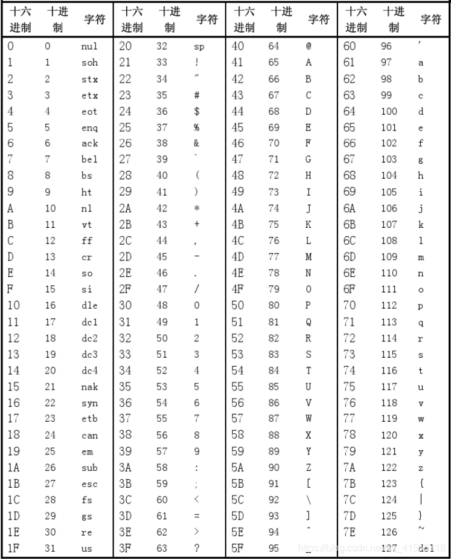

程序是以**字节序列**的方式存储在文件中的。每一个字节都有一个整数值，对应于某些字符
**注意**：程序中的每一个文本行后都以一个看不见的**换行符** `\n` 来结束的:
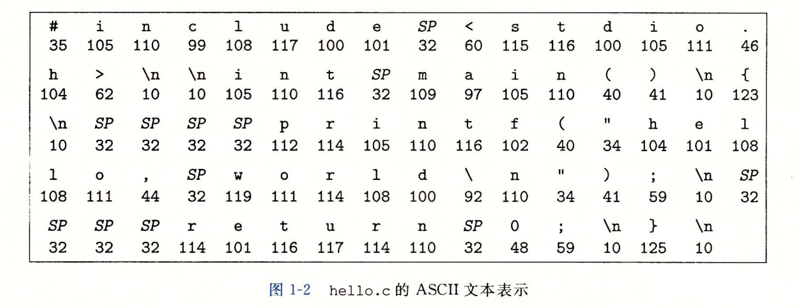

**文本文件**：只由ASCII字符构成的文件
**二进制文件**：除了文本文件其余所有的文件

这里的**基本思想**：**系统中的所有信息，都是由一串比特表示的**。（位序列是信息的组成部分）

系统中的**信息**包括：
- **磁盘文件**
- **内存中的程序**
- **内存中用户的数据**
- **网络上传输的数据**

**上下文**：进程运行所需的所有状态信息
**上下文切换**：保存当前进程的上下文，恢复新进程的上下文，然后将控制权传递给新进程

### 1.2 程序编译
对于**高级语言**（比如 C 语言），其每一条语句都要被其他程序转换成一系列的**低级机器语言指令**，然后按照**可执行目标程序**的格式打包，并以**二进制磁盘文件**的形式存放起来。**目标程序**又称**可执行目标文件**

在 Unix 系统上，源文件到目标文件的转化由**编译器驱动程序**来完成。
```
linux> gcc -o hello hello.c
```

GCC编译器先读取源程序文件，再翻译成一个可执行目标文件，这个过程分为**四个阶段**：
- **预处理阶段**：
  **预处理器（cpp）** 通过源文件中的 `#` 开头的**预处理指令**对源程序进行修改

- **编译阶段**：
  **编译器（ccl）** 将文本文件 `XXX.i` 翻译成文本文件 `XXX.s`，包含**汇编语言程序**。其中的汇编语言程序为不同的高级语言以及不同的编译器提供了通用的输出语言

- **汇编阶段**：
  **汇编器（as）** 将 `XXX.s` 文件翻译成机器语言指令，并将其打包成**可重定位目标程序**的格式，存储到 `XXX.o` 文件中，这里的 `XXX.o` 是一个**二进制文件**，包含源文件的指令编码。

- **链接阶段**：
  **链接器（ld）** 将所需要的**所有编译好的文件（包括预编译文件）** 进行合并，得到**可执行目标文件**或简称**可执行文件**。

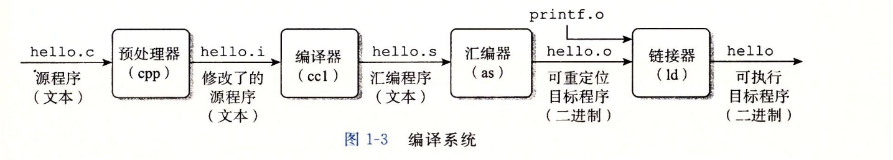

知道程序的编译过程有三点好处：
- **优化程序性能**
- **理解链接时出现的错误**
- **避免安全漏洞**

程序编译完成后，可以通过应用程序 shell 运行。
**shell 是一个命令行解释器**，他输出一个提示符，等待输入一个命令行，然后执行这个命令。如果该命令行的第一个单词不是内置的 shell 指令，那么 shell 会假设这是一个可执行的文件名。运行程序结束后，shell 会继续弹出提示符，等待下一个输入

下面是运行 `hello` 程序的例子：
```bash
linux> ./hello
hello, world
linux>
```

### 1.3 系统的硬件组成
系统硬件关系图如下所示：
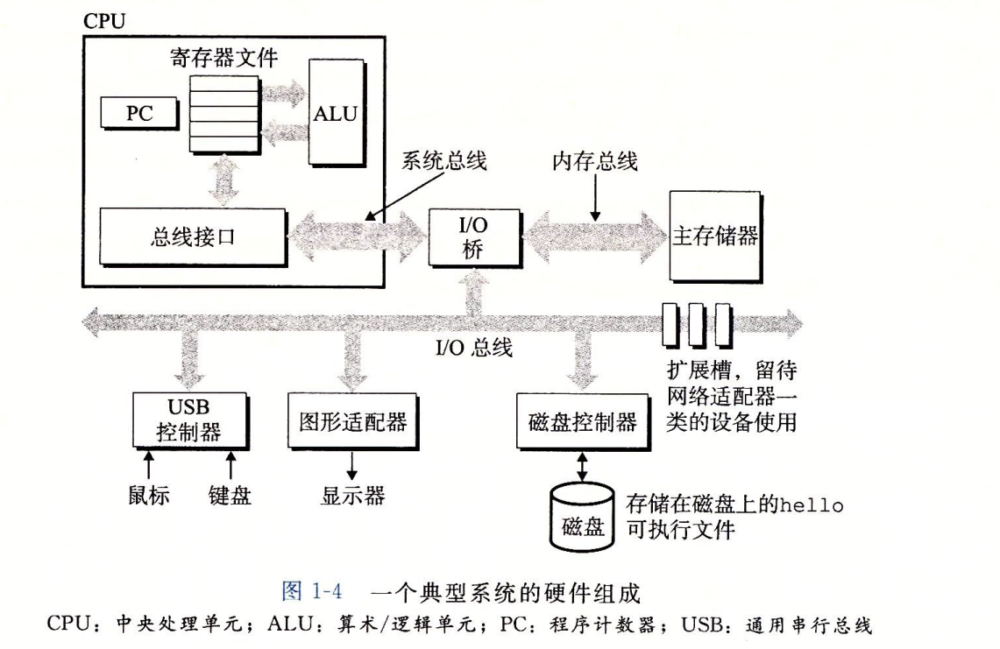

系统硬件有四大组成部分：
1. **总线**
   是**贯穿整个系统的一组电子管道**，携带信息字节并负责再各个部件之间传递。
   **字：定长的字节块**。通常总线被设计成传送定长的字节块
   **字长：字中的字节数**。大多数的机器要么是 4 个字节（32位），要么是 8 个字节 （64位）。
   32位：1 word = 4 byte = 32 bit
   64位：1 word = 8 byte = 64 bit

2. **I/O 设备**
   是**系统于外部世界的联系通道**。图中包含四个 I/O 设备：
   - **键盘和鼠标**（作为用户输入）
   - **显示器**（作为用户输出）
   - **磁盘驱动器**（用于长期存储数据和程序）
   
   每一个 I/O 设备都通过一个**控制器**或**适配器**与 I/O 总线相连。两者的区别在于**封装方式**
   控制器：I/O 设备本身或系统的主印刷电路板（又称**主板**）上的**芯片组**
   适配器：一块插在主板插槽上的**卡**。

   如图：鼠标、键盘和磁盘与**控制器**交互，显示器与**适配器**交互。

3. **主存**
   是**一个临时存储设备**，大多数情况下可以与**内存**划等号。用来存放程序和程序处理的数据。
   物理上，主存是由**动态随机存取存储器（DARM）** 芯片组成的。
   逻辑上，主存是一个**线性的字节数组**，每个字节都有自己的**地址**。

   一般来说，组成程序的每条机器指令都有不同数量的字节构成

4. **处理器**
   **中央处理单元（CPU）**，简称**处理器**，是解释或执行存储在主存中指令的引擎。
   处理器由三部分组成：**寄存器文件**、**程序计数器**以及**算数/逻辑单元**
   - **寄存器文件**
     存放主存中的指令，由单字长的寄存器组成，每一个寄存器都有自己的名字
   - **程序计数器**
     大小为**一个字长**的**寄存器**，是一个物理硬件，任何时刻都指向主存中的一个机器语言指令
   - **算数/逻辑单元**
     用来计算新的数据和地址值

   CPU 可能会执行以下操作：
   1. **加载**：从主存中复制一字节或一字到寄存器
   2. **存储**：从寄存器复制一个字节或一字到主存，对应位置的原有内容会被覆盖
   3. **操作**：将两个寄存器的内容复制到 ALU 进行算数运算，并将结果存放到一个寄存器中
   4. **跳转**：从指令中抽取一个字，复制到 PC 中，**覆盖**原有值、

   处理器架构分为两种：
   - **指令集架构**：记载每条机器代码指令的效果（效果对照表）
   - **微体系架构**：记载处理器的执行方案（执行指南）

### 1.4 程序运行过程
程序通过 shell 运行时，每一个指令都经历三个步骤：

第一步：先用 I/O 设备接受指令传给 shell，shell 传给 CPU，读入寄存器后将指令存入主存。
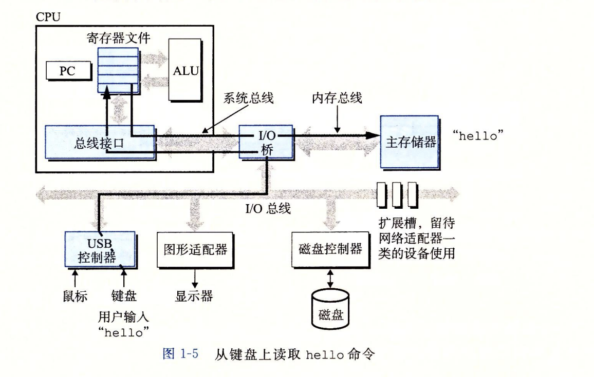

第二步：从磁盘中提取文件存入主存
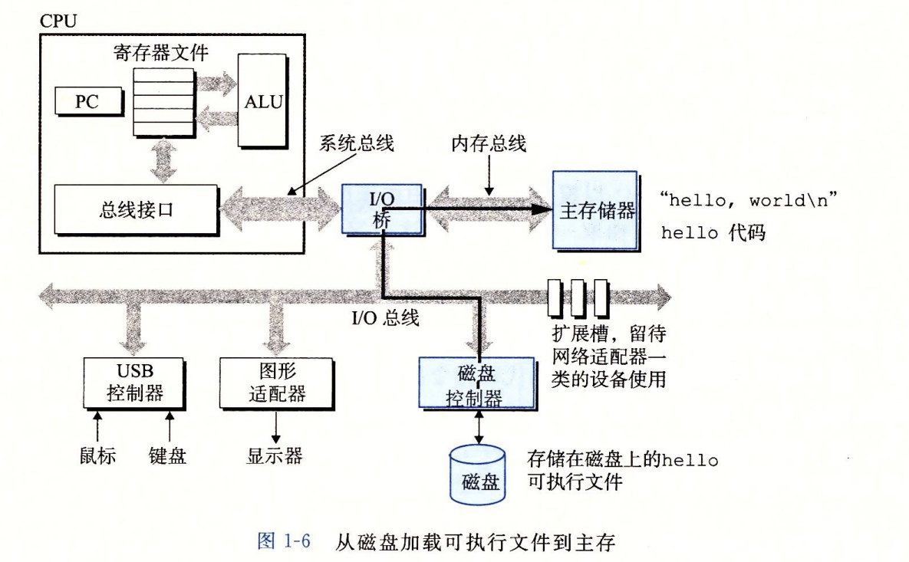

第三步：将文件的代码和数据传给 CPU 执行，执行结果进行输出
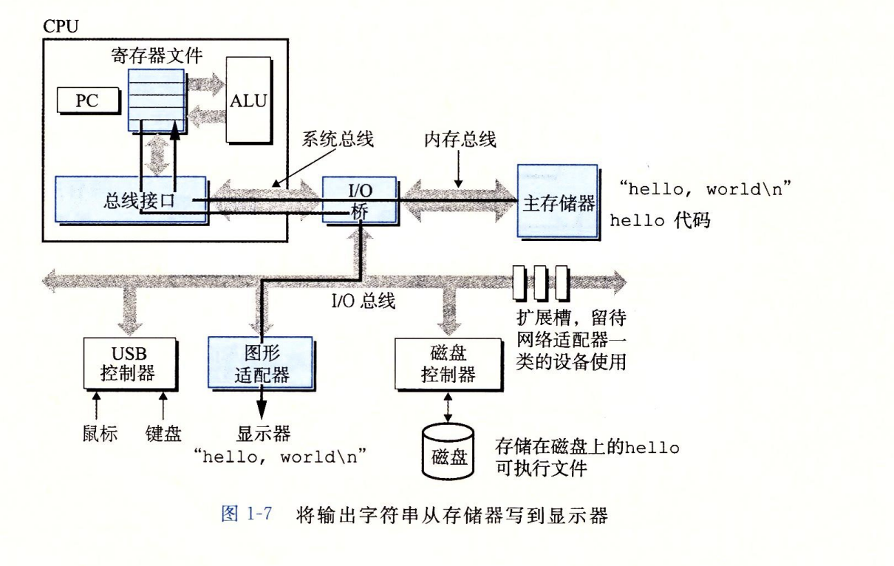

通过**直接存储器（DMA）**，数据可以不通过 CPU 直接到达主存

### 1.5 高速缓存和存储设备层次结构
较大的存储器要比较小的存储器运行的慢，为了缓解这个问题，可以采用**高速缓存存储器**，简称**cache或高速缓存**。
高速缓存使用**静态随机访问存储器（SRAM）**，具有**局部性**原理：程序具有访问局部区域里的数据和代码的趋势。

**RAM**：随机存取存储器，是主存的主要组成部分。
容量大小：**寄存器 > 主存 > 磁盘**
运行速度：**寄存器 > Cache > 主存 > 磁盘**

在处理器和较大设备之间插入高速缓存可以明显加速程序运行速度，基于这个想法，计算机的存储设备具有**存储器层次结构**：
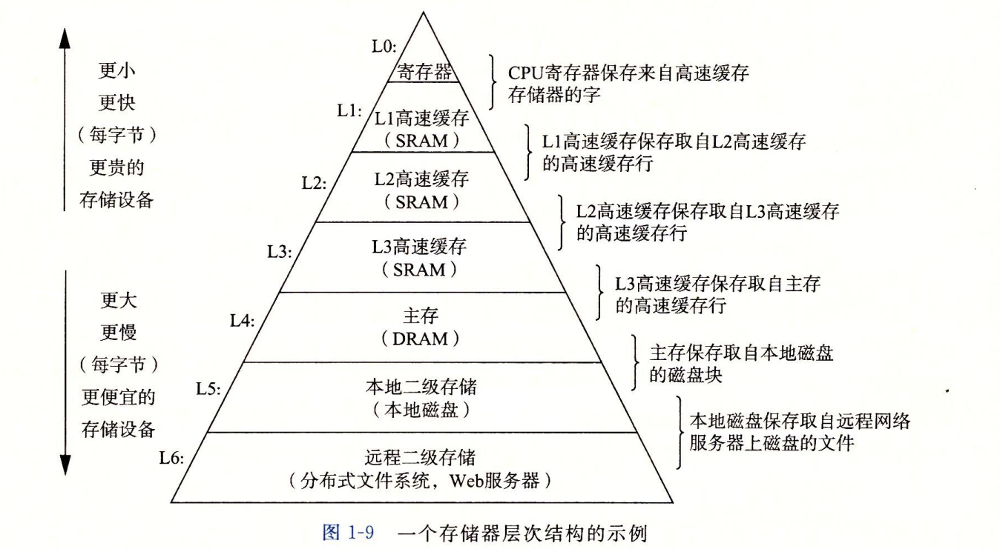

存储器层次结构的主要思想是**上一层存储器作为第一层存储器的高速缓存**。

### 1.6 操作系统
**软件**包含应用程序和操作系统
**硬件**包括 I/O 设备、主存还有处理器等
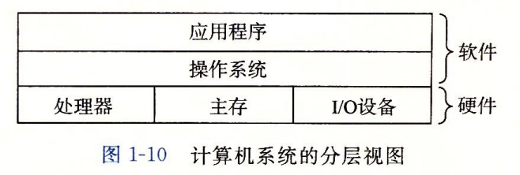

任何的应用程序都不能直接访问硬件，他们依靠**操作系统**来对硬件进行操作。

操作系统有两个功能：
1. **防止被失控的应用程序滥用**
2. **向应用程序提供一些简单一致的机制来控制复杂而又大不相同的低级硬件设备**

操作系统通过**进程、虚拟内存和文件**来控制系统硬件：
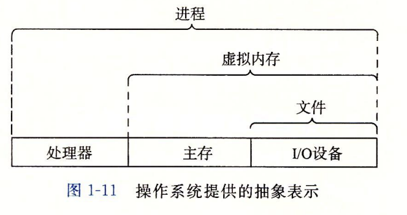

操作系统通过下面的概念来实现上述两个功能：
#### 1.6.1 进程
**进程**：一个正在运行的程序 + 运行时所拥有的资源
一个操作系统可以同时运行多个进程，每一个进程都是独立的，“看上去”每个进程独立占有硬件。
**并发运行**：一个进程的指令可以和另一个进程的指令交错运行
**并发**：一个同时有多个活动的系统

**上下文**：进程运行所需的所有状态信息
**上下文切换**：保存当前进程的上下文，恢复新进程的上下文，然后将控制权传递给新进程
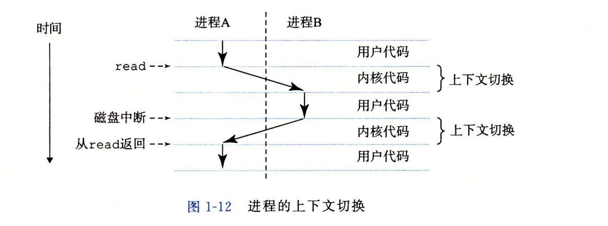

从一个进程切换到另一个进程的转换是由**操作系统内核**管理的。
**内核**：**操作系统代码常驻主存的部分**。
**注意**：内核不是一个独立的进程，**它是系统管理全部进程所用代码和数据结构的集合**
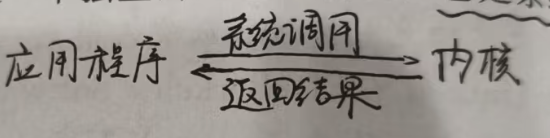

应用程序在正常情况下权限较低，处于**用户态**
操作系统内核的权限很高，处于**内核态**

#### 1.6.2 线程
一个进程可以由多个**线程**组成
**线程**：进程的执行单元，是进程内部的执行路线
**在相同进程下，每一个线程都共享上下文、同样的代码和全局数据**。

#### 1.6.3 虚拟内存
**虚拟内存**是一个抽象概念，为每一个进程提供一个抽象：**每一个进程都独占使用主存**
**虚拟地址空间**：每个进程看到的一致内存。

下面是虚拟地址空间的示意图：
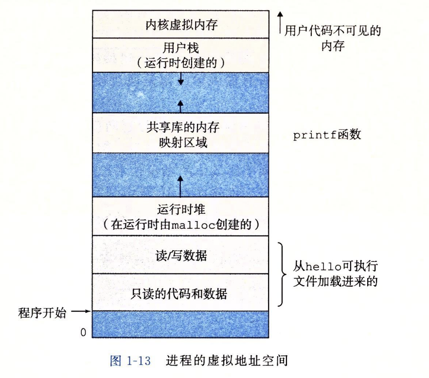

地址空间最上面的区域是六个**操作系统的代码和数据的**
**注意**：**每一个进程的虚拟地址空间都有内核区域，但是物理内存中的内核通常只有一份**，也就是说每一个进程都有一份映射，内核代码通常共享一份。

每个进程看到的虚拟地址空间是由**大量准确定义的区**构成，每个区都有专门的功能：
- **程序代码和数据**
  对所有的进程来说，**代码是从统一固定地址开始**，**代码和数据区**是直接按照可执行目标文件的内容进行初始化的
- **堆**
  代码和数据区紧接着就是运行时**堆**。堆可以在运行时动态的扩展和收缩
- **共享库**
  用来存放像 C 标准库和数学库这样的共享库的代码共和数据的区域
- **栈**
  位于**用户虚拟地址空间的顶部**，每次调用一个函数，栈就会增长，从一个函数返回时，栈就会收缩。
- **内核虚拟内存**
  不允许应用程序读写这部分的内容或者直接调用内核代码定义的函数，必须通过**调用内核**来操作。

虚拟内存的基本思想是：**一个进程中虚拟内存的内容存储在磁盘上，然后用主存作为磁盘的高速缓存**

#### 1.6.4 文件
**文件就是字节序列，仅此而已**。**一切皆文件**是 Unix 系统的著名思想，文件为应用程序提供了一个统一的视图，同一个程序可以在使用不同磁盘技术的不同系统上运行。

### 1.7 网络链接系统
现代系统通常是通过网络和其它系统链接到一起的。
从一台主机复制信息到另一台主机已经成为计算机系统最重要的用途之一。
从单一系统来看，网络可以视为一个 I/O 设备，通过**网络适配器**来连接总线。

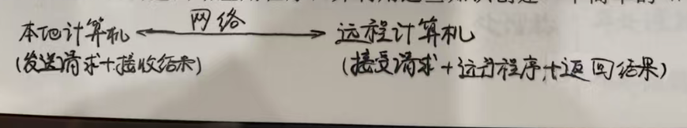

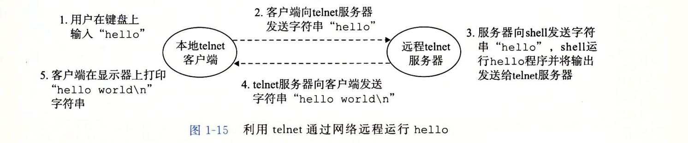

### 1.8 阿姆达尔定律(Amdahl定律)
Amdahl定律的主要思想是：**当我们对系统的某个部分进行加速时，其对系统整体性能的影响取决于该部分的重要性和重要程度**

Amdahl的主要观点是：**想要显著加速整个系统，必须提升全系统中相当大的部分的速度**

定义：系统加速前运行时间为 $T_{new}$，系统加速部分对应整体比例为 $\alpha$，加速比例为 $k$，则加速后总时间为：

$$
T_{new} = (1-\alpha)T_{old} + \frac{\alpha T_{old}}{k}
= T_{old}\left[(1-\alpha) + \frac{\alpha}{k}\right]
$$

加速时间比 $S$ 为：

$$
S = \frac{1}{(1-\alpha) + \alpha/k}
$$

当加速的倍率无限大，$k \to \infty$ 时，会有：

$$
S = \frac{1}{1-\alpha}
$$

### 1.9 并发和并行
**并发**：一个同时有多个活动的系统
**并行**：利用并发来加速系统的运行

并行对于时间的要求更严格，并行必须是**同一时间**，而并发只需要在同一时间有多个任务运行即可
这里的**活动**可以理解为：
> 一个独立的执行流

**并行一定是并发，但并发不一定并行**，两者关系如下：
```
                并发 concurrency
              /                 \
             /                   \
单核时间片切换                 多核真正同时执行
             \                   /
              \                 /
                并行 parallelism
```

#### 1.9.1 线程级并发
使用线程可以在一个进程供执行多个控制流。传统意义上，并行只是模拟出来的，通过一台计算机在正在执行的进程之间快速切换来实现的。
**单处理器系统**：由一个处理器来完成多个进程
**多处理器系统和超线程系统**：由单个操作系统内核控制的多个处理器组成的系统

处理器分为两种：**单处理器**和**多处理器**。
**多核处理器**是将多个CPU（称为**核**）集成到一个继承电路芯片上。
**超线程**：又称**同时多线程**，它涉及CPU的某些硬件由多个备份，其他的硬件只有一份

**注意**：多处理器系统和单处理器系统的区别重点在于处理器（CPU）的个数，两者的操作系统内核仅有一个。

#### 1.9.2 指令级并行
**指令级并行**：**处理器可以同时执行多条指令的属性**
**超标量处理器**：处理器可以达到一个比一个周期一条指令更快的执行速率

#### 1.9.3 单指令、多数据并行
又称**SIMD并行**，允许一条指令产生多条可以并行执行的操作

SIMD 指令多是为了**提高处理影像、声音和视频数据应用的执行速度

### 1.10 抽象
**抽象**是一个重要概念，可以让我们忽略底层的复杂实现，直接专注于每一层的抽象表示

- 指令集架构提供了对处理器硬件的抽象
- 文件是对 I/O 设备的抽象
- 虚拟内存是对 I/O 设备和主存的抽象
- 进程是对 I/O 设备、主存和处理器的抽象
- 虚拟机是对 I/O 设备、主存、处理器和操作系统的抽象

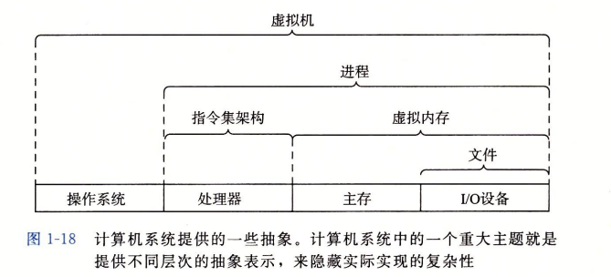

## 二、信息的表示和处理
**无符号编码**：表示非负整数
**补码编码**：表示有符号整数
**浮点数**：表示以 2 为基数的实数

无符号编码和补码编码会有**溢出**的问题
1) 整数的计算机运算满足正常的数学运算
2) 浮点数由于精度限制，不满足结合律（存在**大数吃小数**或**有效数字丢失**）

**GCC**：全称为**GNU 编译器套装（GNU Compiler Collection）**

### 2.1 信息存储
**字节是最小的可寻址的内存单位，而不是访问内存的位**
**虚拟内存可以视为一个巨大的字节数组**
**地址**：每一个字节都由唯一的数字来进行标识
**虚拟地址空间**：所有可能地址的集合

虚拟地址由五部分实现：
- 动态随机存取存储器（DRAM）
- 闪存
- 磁盘存储器
- 特殊硬件
- 操作系统软件

**程序对象**：程序数据 + 指令 + 控制信息
程序是**静态的代码文件**，是程序员编写的一组指令集合
程序对象是程序运行后的实例
每一个**程序对象**可以视为是**一个字节块**，而**程序**本身就是**一个字节序列**

#### 2.1.1 进制
**进制 = 基数 + 权重**，无论是二进制还是十六进制，都是这个关系
所有的数字都可以用下面的方式表示（记数为 $N$，基数为 $b$，权重为 $a_k$）：
$$
N = a_0b^0 + a_1b^1 + \cdots + a_nb^n
$$

**十六进制**就是以 16 为基数，在 C 语言中，以 0X 或 0x 开头的数字常量认为是十六进制的值。一般是 4 位 4 位一组，若数字不为 4 的倍数，**最左边的一组可以少于 4 位，前面用 0 补足**

当值 $x$ 为 2 的非负整数幂的时候，即 $x = 2^n$，转换成十六进制的方法为：
将 $n$ 转换成 $i + 4j$ 的形式，将 $x$ 写成对应开头的十六进制： $1(i=0)，2(i=1)，4(i=2)，8(i=3)$，后面跟着 $j$ 个十六进制的 0.

十进制转十六进制：反复除以16，最后将得到的数组从下向上排列得到最终的进制数
十六进制转十进制：利用上述的公式，算出对应的权重和对应的基数，求和

#### 2.1.2 字和字节
**字长用来指明指针数据的标称大小**，虚拟地址使用一个字来进行编码的。
**字长决定虚拟空间的最大大小**，对于一个字长为 $\omega$ 位的机器来说，虚拟地址的范围位 $0 \sim 2^{\omega} - 1$

只能在 32 位机器运行和只能在 64 位机器运行的程序分别称为 **32 位程序和 64 位程序**，两者的区别在于**怎么编译的**，而不是其运行的机器类型。

**机器的向后兼容**：32 位程序可以在 64 位机器上运行，64 位程序也可以在 64 位机器上运行，**但 64 位程序不能在 32 位机器上运行**

**计算机和编译器支持多种不同方式编码的数字格式**，C 语言支持整数和浮点数的多种数据格式：

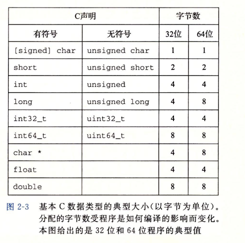

这里的 `char *` 是一个特例，其本身是**指针类型**，存储的是内存地址，所以其**大小是由计算机的字长决定的**，32 位机器为 32 bit = 4 byte，64 位机器为 64 bit = 8 byte。

**注意**：**C语言标准仅仅规定了类型大小的下限，没有规定上限，上限由不同的处理器制造厂商决定**

对于程序对象，需要两个规则：
1. **这个对象的地址是什么**
2. **在内存中怎么排列对应的字节**

**多字节的对象被存储在连续的字节序列，对象的地址为所使用的字节中最小的地址**
排列对象的字节有两种方法：
1. **小端法**：在内存中按照**从最低有效字节到最高有效字节**进行存储
2. **大端法**：在内存中按照**从最高有效字节到最低有效字节**进行存储

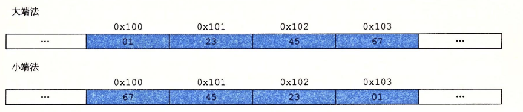

还有一种**双端法**：这种处理器既可以被配置成大端，也可以配置成小端。**由操作系统决定**配置成什么样子的（毕竟最终要服务于操作系统）

**字节序**：一个多字节的数据在内存中的排列顺序
**字节序仅影响多字节整数如何排列，不影响指令**

**Intel 处理器**：采用 x86 或 x86-64 指令集架构，使用小端序来处理端序问题
**ARM 处理器**：采用双端法，既支持大端法，也支持小端法，由操作系统决定

下面是一些典型的机器：

Linux 32: 运行 Linux 的 Intel IA32 处理器。**使用小端法**

Windows: 运行 Windows 的 Intel IA32 处理器。**使用小端法**

Sun: 运行 Solaris 的 Sun Microsystems SPARC 处理器。（这些机器现在由 Oracle 生产。）**使用大端法**

Linux 64: 运行 Linux 的 Intel x86-64 处理器。**使用小端法**

字节序有时会出现问题：
1. 不同类型的机器指向通过网络传送二进制数据时，不同端法产生的数据之间不流通，会有**字节反序**的问题
2. 不同端法产生的字节序列不同，造成了阅读的障碍
3. 在系统级变成来说，字节序很重要，但是对于涉及**强制类型转换和联合**的类型，字节序不同会产生问题

**反汇编器**：打开文件，读取机器代码，翻译成汇编语言
**汇编器**：打开文件，读取文本，翻译成机器语言
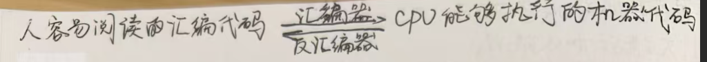

**不同的机器类型使用不同的且不兼容的指令和编码方式，二进制代码是不兼容的，二进制代码很少能在不同的机器和操作系统之间进行移植**

#### 2.1.3 布尔代数和位向量运算
在布尔代数中，二进制 1 和 0 表示 TRUE 和 FALSE
在 C 语言中，所有的非 0 值表示 TRUE，0 表示 FALSE

下面是布尔运算的四种符号：
- `~`：对应逻辑运算的 `NOT`，命题逻辑符号为 $\neg$
- `|`：对应逻辑运算的 `OR`，命题逻辑符号为 $\lor$
- `&`：对应逻辑符号的 `AND`，命题逻辑符号为 $\land$
- `^`：对应逻辑符号的 `XOR` 或 `EXCLUSIVE-OR`，命题逻辑符号为 $\oplus$

在 C 语言中，上述的符号为"按位XX"的意思，下面是 4 种运算及其对应的真值表：
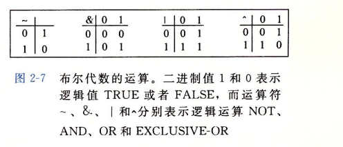

**位向量**：固定长度为 $w$ 、由 0 和 1 组成的串
**位向量的运算**：参数的**每个对应元素之间的运算**

布尔运算和普通的算数运算有所不同，普通的交换律、结合律和分配律不一定成立
| 规律         |  `&` | `\|` |  `^` |          `~` |
| ------------ | ---: | ---: | ---: | -----------: |
| 交换律       |   是 |   是 |   是 |       不适用 |
| 结合律       |   是 |   是 |   是 |       不适用 |
| 对 `&` 分配  |    — |   是 |   否 |     德摩根律 |
| 对 `\|` 分配 |   是 |    — |   否 |     德摩根律 |
| 对 `^` 分配  |   是 |   否 |    — | 无普通分配律 |

位向量还可以表示**有限集合**，可以用位向量 $[a_{w-1}, \ldots, a_1, a_0]$ 编码任何子集 $A \subseteq \{0, 1, \ldots, w-1\}$，使用这种编码集合的方法，布尔运算 `|` 和 `&` 分别对应着集合的**并**和**交**，而 `~` 对应着集合的**补**

**掩码**：一组用来选择、保留、清除或翻转特定位的二进制位
**全一掩码**：在给定位宽下所有位全为 1
对于 `^` 的结论：
1. `x ^ x = 0`
2. `x ^ 0 = x`
3. `x ^ 1 = ~x`
4. `^` 满足交换律和结合律

**位模式**：在固定长度下，由若干个 0 或 1 按一定顺序组成的序列

C 语言中提供了三种逻辑运算符：`||`、`&&` 和 `!` ，分别对应着命题逻辑中的 `OR`, `AND`，`NOT`。返回值为 1 或 0。1 表示 TRUE，0 表示 FALSE

按位运算和逻辑运算只有在特殊情况下才会和逻辑运算有相同的行为。同时逻辑运算有**短路效应**

C 语言还提供**移位运算**：
1. `<<` **左移**：
   对于位模式为 $[x_{w-1}, \ldots, x_1, x_0]$ 的操作数 $x$，左移意味着：x 向左移动 k 位，丢弃最高的 k 位，并在右端补 k 个 0。**移位运算是可从左至右结合的**，`x << j << k` 等价为 `(x << j) << k`。
2. `>>` 右移
   右移情况复杂，分为**逻辑右移**和**算数右移**：
   - **逻辑右移**：对于位模式为 $[x_{w-1}, \ldots, x_1, x_0]$ 的操作数 $x$，x 向右移动 k 位，丢弃最低的 k 位，并在右端补 k 个 0。
   - **算数右移**：对于位模式为 $[x_{w-1}, \ldots, x_1, x_0]$ 的操作数 $x$，x 向右移动 k 位，丢弃最低的 k 位，并在右端补 k 个最高有效位的值。
   C 语言标准并没有规定编译器对于右移的行为，但是绝大多数的处理器都会将情况分为有符号数和无符号数，**有符号数进行算数右移，无符号数进行逻辑右移**。Java 对此进行了严格的区分，`>>` 在 Java 中表示**算数右移**，`>>>` 在 Java 中表示**逻辑右移**。特别地，当 $k \geq w$ 的时候，C 语言会发生**未定义行为**，Java 则明确规定是 $k = k \mod w$

### 2.2 整型数
C 语言支持多种整型数据类型：
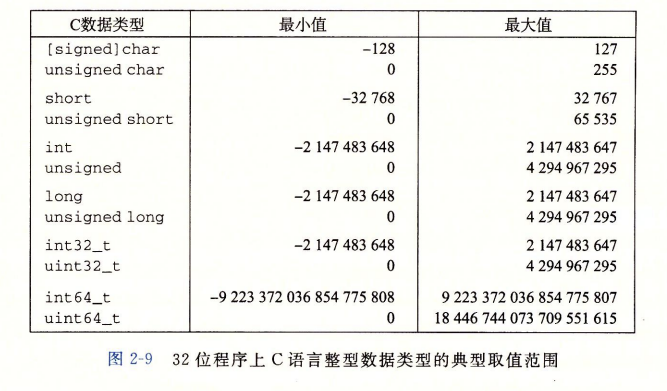
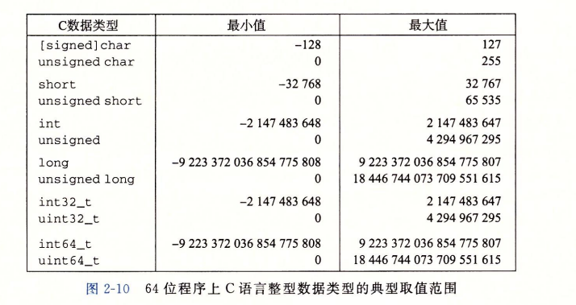

上述的整型数的范围并不是对称的，**这是因为补码数本身的表示缺陷**
但是，**固定大小的数据类型**是一个例外，它们只要求**正数和负数的取值范围是对称的**

C 语言标准定义了每一种数据类型必须能表示的最小的取值范围：
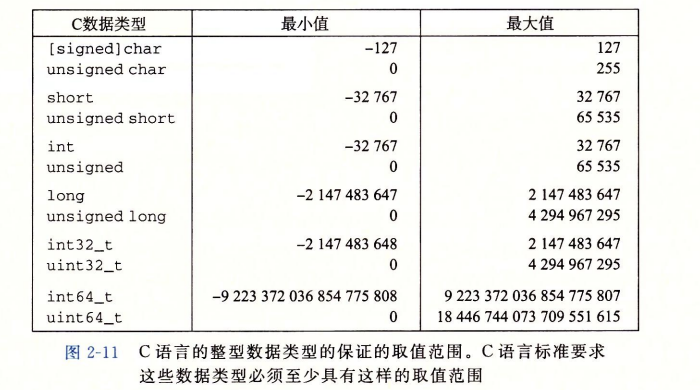

C 和 C++ 都支持有符号整数和无符号整数，其中有符号整数是默认情况，但是 Java 只支持有符号数。

#### 2.2.1 整型数编码
下面是需要了解的映射关系：
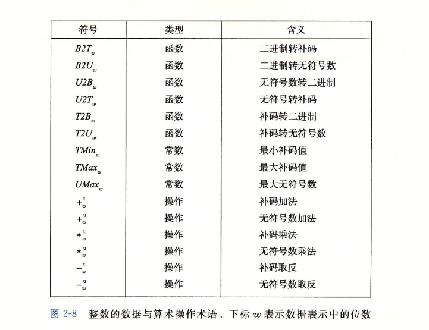

对于有符号整数和无符号整数，都有对应的位模式来进行编码：

1. 无符号数编码：

   对向量 $\vec{x}=[x_{w-1},x_{w-2},\cdots,x_0]$，其无符号二进制表示为：

   $$
   B2U_w(\vec{x})=\sum_{i=0}^{w-1}x_i2^i
   $$

   **无符号数的编码具有唯一性，且 $B2U_w$ 是一个双射**

2. 补码编码：

   对向量 $\vec{x}=[x_{w-1},x_{w-2},\cdots,x_0]$：

   $$
   B2T_w(\vec{x})=-x_{w-1}2^{w-1} + \sum_{i=0}^{w-2}x_i2^i
   $$

   其中的最高有效位称为**符号位**，对应权重为 $-2^{w-1}$
   **补码编码具有唯一性，且 $B2T_w$ 是一个双射**

整型数的 4 个关键数字：$UMax_w$、$TMax_w$、$TMin_w$ 和 $0$。
下面是其对应的编码：
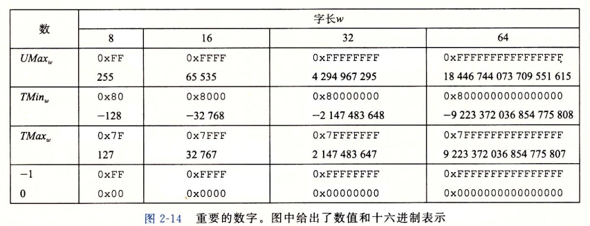

其中：
1. $TMin_w = -TMax_w - 1$
2. $UMax_w = 2TMax_w + 1$
3. -1 和 $UMax_w$ 有相同的位模式，都是**全一掩码**的形式

C 语言中对于上述临界值分别定义了**宏**：`INTN_MIN`、`INTN_MAX`、`UINTN_MAX`
```c
#define INT_MIN (-2147483647 - 1)
#define INT_MAX 2147483647
#
```
确定宽度类型的带格式打印需要使用宏，以与系统相关的方式扩展成为字符串，**使用宏能保证，不论代码是如何编译的，都能生成正确的格式字符串**

Java 的标准是非常明确的，对于整数要求采用**补码**进行表示，取值范围是上图中的 64 位机器的取值范围，**单字节的数据类型是 `byte`，而不是 `char`**。

#### 2.2.2 整型转换
C 语言支持**强制类型转换**，强制类型转换的结果是：**保持位值不变，只改变解释位模式的方式，底层的位表示保持不变**。

对于 C 语言来说，处理**同样长字长**的有符号整数和无符号整数之间互相转换的一般规则是：**数值可能改变，但是位模式不变**

结论：**在相同位模式下，对应的无符号数和补码数的两者绝对值之和等于 $2^w$（ $w$ 为位数）**

下面是转换的映射关系：
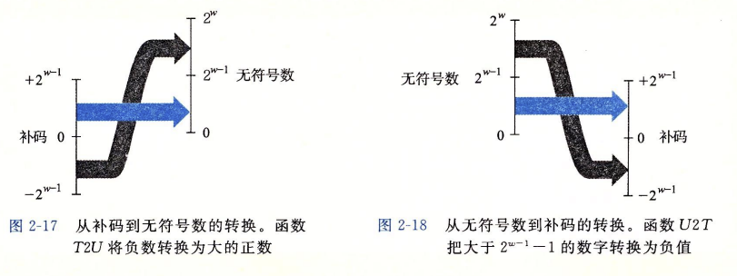

映射的核心公式：
位向量 $\vec{x}=[x_{w-1}, \ldots, x_1, x_0]$，记 $x'$ 为其无符号数表示，$x$ 为其补码数表示，有：

$$
x' = x + x_{w-1}2^w
$$

对于小的数（$\leq TMax_w$），无符号数转换成有符号数的时候将保留数字的原值。对于大的数（$>TMax_w$），无符号数转换成有符号数会变成负数（符号位的问题）

几乎所有的机器都是用**补码**来表示有符号数，大多数数字都是认为有符号的，C 语言中，要创建一个无符号常量，**必须**加上后缀 `U` 或者 `u`。
强制类型转换分为两种：**显式转换和隐式转换**
1. **显式转换**：
   ```c
   int tx, ty;
   unsigned ux, uy;

   tx = (int) ux;       // Cast to signed
   uy = (unsigned) ty;  // Cast to unsigned
   ```
   显式转换是用**函数式转换**，在源码中是可以看见的
2. **隐式转换**：
   当一种类型的表达式被赋值给另一种类型的变量时，就会发生隐式转换
   ```c
   int tx, ty;
   unsigned ux, uy;

   tx = ux;       // Cast to signed
   uy = ty;  // Cast to unsigned
   ```

**如果一个运算的一个运算数是有符号的而另一个是无符号的，那么 C 语言会将有符号数隐式地强制类型转换转换成无符号数，并假设两者都是非负的**

**扩展位表示**：当少字节类型转换成多字节类型时（在不同字长之间进行转换），转换方式在不影响精度的前提下会发生**位扩展**
其中：**无符号数**发生的是**零扩展**，补码数发生的是**符号扩展**
**零扩展**：在最高位上补 0
**符号扩展**：在最高位上补**符号位**

**截断数字**：当多字节类型转换成少字节类型时（在不同字长之间进行转换），会发生**截断**
截断时，会影响原数的数值（影响了原有精度），截断时，会直接忽略前 XX 位，数值改变分为了**无符号数**和**补码数**两种：
**截断无符号数**：
令 $\vec{x}$ 等于位向量 $[x_{w-1}, x_{w-2}, \cdots, x_0]$，而 $\vec{x}'$ 是将其截断为 $k$ 位的结果：$\vec{x}' = [x_{k-1}, x_{k-2}, \cdots, x_0]$。令 $x = \text{B2U}_w(\vec{x})$，$x' = \text{B2U}_k(\vec{x}')$。则 $x' = x \bmod 2^k$。
**截断补码数**：
令 $\vec{x}$ 等于位向量 $[x_{w-1}, x_{w-2}, \cdots, x_0]$，而 $\vec{x}'$ 是将其截断为 $k$ 位的结果：$\vec{x}' = [x_{k-1}, x_{k-2}, \cdots, x_0]$。令 $x = \text{B2U}_w(\vec{x})$，$x' = \text{B2T}_k(\vec{x}')$。则 $x' = \text{U2T}_k(x \bmod 2^k)$。

#### 2.2.3 整型数运算

1. **无符号数运算**

   - **加法**：

     对满足 $0 \leq x, y < 2^w$ 的 $x$ 和 $y$ 有：

     $$
     x +_w^u y =
     \begin{cases}
     x+y, & x+y < 2^w \\
     x+y-2^w, & 2^w \leq x+y < 2^{w+1}
     \end{cases}
     $$

     **溢出**：完整的整数结果不能放到数字类型的字长限制中去

     无符号数溢出条件：**对于在范围内 $0 \leq x, y \leq UMax_w$ 中的 $x, y$，令 $s = x+y$，当且仅当 $s < x$ 或 $s < y$ 时，发生了溢出**

   - **乘法**：

     C 语言定义无符号乘法被定义为产生 $w$ 位的值，将一个无符号数截断为 $w$ 位等价于计算该值模 $2^w$。

     对满足 $0 \leq x, y \leq \mathrm{UMax}_w$ 的 $x$ 和 $y$ 有：

     $$
     x *_w^u y = (x \cdot y) \bmod 2^w
     $$

   - **取反**：

     模数加法形成了一种数学结构：**阿贝尔群**，它是**可交换的、可结合的**。

     对于满足 $0 \leq x < 2^w$ 的任意 $x$，其 $w$ 位的无符号逆元 $-_w^u x$ 由下式给出：

     $$
     -_w^u x =
     \begin{cases}
     x, & x=0 \\
     2^w-x, & x>0
     \end{cases}
     $$

2. **补码运算**

   - **加法**

     对于满足 $-2^{w-1} \leq x, y \leq 2^{w-1}-1$ 的整数 $x$ 和 $y$，有：

     $$
     x +_w^{\mathrm{t}} y =
     \begin{cases}
     x+y-2^w, & 2^{w-1} \leq x+y \\
     x+y, & -2^{w-1} \leq x+y < 2^{w-1} \\
     x+y+2^w, & x+y < -2^{w-1}
     \end{cases}
     $$

     三种情况依次对应正溢出、正常和负溢出。

   - **乘法**：

     对于满足 $TMin_w \leq x, y \leq TMax_w$ 的 $x$ 和 $y$ 有：

     $$
     x *_w^t y = U2T_w((x \cdot y) \bmod 2^w)
     $$

   - **取反**：

     对满足 $TMin_w \leq x \leq TMax_w$ 的 $x$，其补码的非 $-_w^t x$ 由下式给出：

     $$
     -_w^t x =
     \begin{cases}
     TMin_w, & x=TMin_w \\
     -x, & x>TMin_w
     \end{cases}
     $$

3. **乘除常数**
   处理器会用**移位和加法运算的组合**来替代乘以常数因子的乘法，通过编译器的优化，将乘法转换成**移位与加法**的组合，有时可以优化成**移位和减法**，
   **注意**：在 C 语言中，对符号为负的有符号数进行左移在标准 C 中是**未定义行为**

4. **除法**
   除以非 2 的整数次幂的运算有单独的汇编指令，在第三章中进行介绍，这里只记录**除以 2 的整数幂**：
   整数除法的核心是**舍入到 0**：

    **向下取整**

    对于任意实数 $a$，定义 $\lfloor a \rfloor$ 为唯一的整数 $a'$，使得：

    ```math
    a' \leq a < a' + 1
    ```

    例如：

    ```math
    \lfloor 3.14 \rfloor = 3
    ```

    ```math
    \lfloor -3.14 \rfloor = -4
    ```

    ```math
    \lfloor 3 \rfloor = 3
    ```

    **向上取整**

    同样，定义 $\lceil a \rceil$ 为唯一的整数 $a'$，使得：

    ```math
    a' - 1 < a \leq a'
    ```

    例如：

    ```math
    \lceil 3.14 \rceil = 4
    ```

    ```math
    \lceil -3.14 \rceil = -3
    ```

    ```math
    \lceil 3 \rceil = 3
    ```

    **整数除法**

    对于 $x \geq 0$ 和 $y > 0$，整数除法的结果为：

    ```math
    \left\lfloor \frac{x}{y} \right\rfloor
    ```

    对于 $x < 0$ 和 $y > 0$，整数除法的结果为：

    ```math
    \left\lceil \frac{x}{y} \right\rceil
    ```

    无符号数与补码数的非负部分的值是相同的，位模式也相同，除以 2 的幂时直接采用**逻辑右移**
    对于负值的补码数采用的是**偏置 + 算数右移**：
    **偏置**：用来处理**右移在进行截断的时候发生的是：$\lfloor a \rfloor$ 的问题**
    C 变量 `x` 和 `k` 分别有补码值 $x$ 和无符号数值 $k$，且 $0 \leq k < w$。则当执行算术移位时，C 表达式 `(x + (1 << k) - 1) >> k` 产生数值 $\left\lceil \frac{x}{2^k} \right\rceil$。

    **偏置量**：$2^k - 1$ 或 $(1 << k - 1)$
    对于不需要舍入的情况（k = 1），加上偏置量只会影响那些被移动的位，对于需要舍入的情况，加上偏置量会导致较高的位加 1，总体结果会向 0 舍入。

    **偏置的核心技术属性**：
    对于整数 $x$ 和 $y$（ $y > 0$ ），$\lceil x/y \rceil = \lfloor (x + y - 1) / y \rfloor$

    **右移 + 截断字长** 只能做到向下取整

    所以 $x / 2^k$ 的 C 表达式是：
    ```c
    (x > 0 ? x : x + (1 << k - 1)) >> k  // 逻辑右移/算数右移（非负）：x >> k
                                         // 算数右移（负）：(x + (1 << k - 1)) >> k
    ```

**重点**：**无符号和补码乘法的位级等价性**：
对于两相同的位向量 $\vec{x}$ 和 $\vec{y}$，进行乘法运算后，无论是无符号乘法还是补码乘法，最终的位模式都是一样的：

$$
T2B_w(x *_w^t y) = U2B_w(x' *_w^u y')
$$

### 2.3 浮点数
浮点表示是对形如 $V = x \times 2^y$ 的有理数进行编码，浮点数的适用范围如下：
- **非常大的数字**：$|V| >> 0$
- **非常接近于 0 的数字**：$|V| << 1$
- **作为实数运算的近似值**

所有的计算机都支持**IEEE浮点**标准
**舍入**：当一个数字不能被准确的表示为 IEEE 浮点格式时，必须**向上调整**或者**向下调整**

#### 2.3.1 IEEE 浮点表示
IEEE 浮点标准使用 $V = (-1)^s \times M \times 2 ^ E$ 来表示一个数：
- **符号（sign）**：$s$ 决定数的正负（正数为 $s = 0$，负数为 $s = 1$）
- **尾数（significand）**：$M$ 是一个二进制小数，范围为 $1 \sim 2 - \varepsilon $，或者是 $0 \sim 1 - \varepsilon$
- **阶码（exponent）** $E$ 的作用是对浮点数加权

浮点数的表示分为 3 个字段：
1. 一个单独的符号位 $s$ 直接编码符号
2. $k$ 位的阶码字段编码阶码 $E$
3. $n$ 位小数字段编码尾数 $M$，但是编码出来的值也依赖解码字段的值是否等于 0

在 C/C++ 中，表示浮点有两种类型：`float` 和 `double` ，分别表示**单精度**和**双精度**
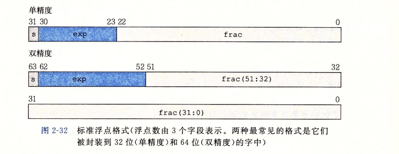

对于给定的位表示，根据 exp 的值，被编码的值可以分为下面的 3 中情况（最后一种有 2 个变种）：
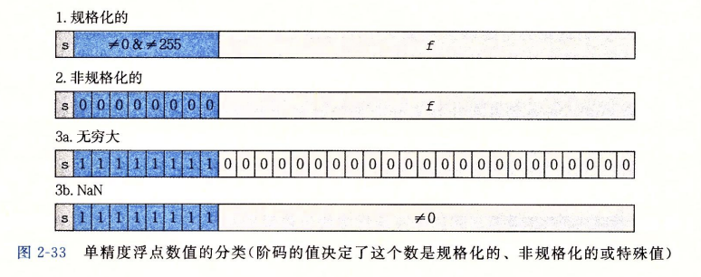

- **规格化**：
  这是最普遍的情况，阶码字段解释为**以偏置形式表示的有符号整数**，阶码的值是 $E = e - Bias$，其中的 $e$ 为无符号整数，$Bias$ 表示为一个等于 $2^{k-1} - 1$ 的偏置值（单精度是 127， 双精度是 1023）
  小数字段被解释为小数值 $f$，其中 $0 <= f < 1$，尾数定义为 $M = 1 + f$，这种方式也称为**隐含的以 1 开头的表示**，使得 $M$ 的取值范围是 $1 <= M < 2$

- **非规格化**：
  当**阶码域全为 0 时**，所表示的数是**非规格化**的表示，这种情况下，**阶码值为 $E = 1 - Bias$，尾数变成了 $M = f$。** 不再包含小数点前面的 1。

- **特殊值**：
  特殊值有两种：一种是**无穷大**，另一种是 **NaN**。
  **无穷大**：阶码全为 1，且小数部分全为 0.
  **NaN**：意为**不是一个数（Not a Number）**，阶码全为 1，但是小数部分不为 0.

值得注意的是：浮点数在数轴上并不是均匀分布的，而是**越靠近原点越稠密**

结论：
1. 值 +0.0 总有一个全为 0 的位表示
2. 最小的正非规格化的位模式是由**最低有效位为 1 而其他所有位为 0 构成的。
   尾数 $M = f = 2^{-n}$，阶码值为 $E = 1 - (2^{k - 1} - 1) = 2 - 2^{k - 1}$ ，数字值为 $V = 2^{-n + 2 - 2^{k - 1}}$
3. 最大的非规格化值的位模式是由全为 0 的阶码字段和全为 1 的小数字段组成
   尾数 $M = f = 1 - 2^{-n}$，阶码值为 $E = 1 - (2^{k - 1} - 1) = 2 - 2^{k - 1}$，数字值为 $V = (1 - 2^{-n}) \times 2^{2 - 2^{k-1}}$
4. 最小的正规格化值得位模式得阶码字段的最低有效位为 1，其他位为 0.
   尾数 $M = 1 + f = 1$，阶码值为 $E = 1 - (2^{k - 1} - 1) = 2 - 2^{k - 1}$
   数字值为 $V = 2^{2 - 2^{k-1}}$
5. 值 1.0 的位表示是阶码字段除了最高有效位等于 0 外，所有其他都等于 1.
   尾数值 $M = 1$，阶码数为 $E = 2^{k-1} - 1 - (2{k-1} - 1) = 0$
   数值为 $V = 1$
6. 最大的规格化数值得位表示得符号位为 0，阶码的最低有效位为 0，其他位均为 1.
   尾数为 $M = 1 + 1 - 2^{-n} = 2 - 2^{-n}$，阶码数为 $E = (2^k - 1) - 1 - (2^{k - 1} - 1)= 2^{k - 1} - 1$，数值为 $V = (2 - 2^{-n}) \times 2^{2^{k - 1} - 1} = (1 - 2^{-n - 1}) \times 2^{2^{k-1}}$

#### 2.3.2 舍入
IEEE 定义了 4 种**舍入方式**，默认的原则是找到最近的匹配。
1. **向偶数舍入**：也被称为**向最接近的值舍入**，是**默认**的方式。
   核心要求：**将数字向上或向下舍入，使得结果的最低有效数字是偶数**
   使用的**时机或规则**：
   - **先舍入到最近的值**
   - 如果最近的值只有一个，就直接选择它
   - **只有刚好位于两个候选值正中间时**，选择最低有效值为偶数的那一个
2. **向零舍入**：有点类似于截断字长的操作，把正数向下舍入，把负数向上舍入，得到值 $\hat{x}$，使得 $|\hat{x}| \le |x|$。
3. **向下舍入**：把正数和负数都向下舍入，得到值 $x^{-}$，使得 $x^{-} \le x$。
4. **向上舍入**：把正数和负数都向上舍入，得到值 $x^{+}$，满足 $x \le x^{+}$。

#### 2.3.3 浮点运算
**定义**：
- $1 / -0$ 产生 $-\infty$
- $1 / +0$ 产生 $+\infty$

浮点运算并不完全遵循正常的数学运算的运算律：
- 浮点运算遵循**交换律**：$x +^f y = y +^f x$
- 浮点运算不遵循**结合律**：因为**舍入**，精度会有丢失的问题
- 大多数浮点值在浮点加法下都有**逆元**，即 $x +^f -x = 0$
- 例外情况：$+\infty -\infty = NaN$，对于任意的 $x$，都有 $NaN +^f x = NaN$

浮点加法在运算时保持着单调性，浮点加法的本质是**先计算真实结果，再进行舍入到最近可表示浮点数**。由于**舍入函数本身就是单调**的，所以不会影响整体的单调性。而无符号数和补码加法的本质都有**模运算**，会影响单调性（溢出的问题），一旦发生溢出就会有颠倒大小的情况

浮点乘法有交换律，但是**没有结合律和分配律**，并且满足**同号性**：
$$
a \ge b 且 c \ge 0 \implies a *^f c \ge b *^f c
$$

$$
a \ge b 且 c \le 0 \implies a *^f c \le b *^f c
$$

IEEE 规定：对于 `float` 和 `double`，**溢出等价于 $\infty$**。发生溢出就直接变成对应符号的 $\infty$。

## 三、程序的机器表示
计算机执行的是**机器代码**，用**字节序列**编码低级操作：
1. 处理数据
2. 管理内存
3. 读写存储设备上的数据
4. 利用网络通信

**编译器**基于编程语言的规则、目标机器的指令集和操作系统遵循的惯例，经过一系列阶段生成机器代码

GCC 的 C 语言编译器以**汇编代码**的形式输出
**汇编代码**：机器代码的文本表示，给出程序中的每一条指令。

汇编语言是**高级语言和机器代码之间的一层表示形式**：高级语言 $\to$ 汇编代码 $\to$ 机器代码
汇编语言是**非必须的**，它作为**人类可读的机器指令表示**而存在
**编译器可以直接生成机器代码**，但是 GCC 现在还是**先生成汇编表示，再调用汇编器转化**。

汇编代码和高级语言的区别：
高级语言编写的程序可以再很多不同的机器上编译和执行（**泛用性很好**），但是**汇编代码与特定机器密切相关**

当前 64 位机器能够使用**256TB（$2^{48}$字节）**的**内存空间**，并且很容易扩展成 16EB（$2^{64}$字节）

### 3.1 x86 和 Intel 处理器历史
**Intel 处理器系列俗称 x86**，即 x86 是 Intel 处理器家族的一个别称
下面是一些关键时间结点：
- **8086**：**第一代单芯片**，16 位处理器之一
- **8088**：是 8086 的一个变种，在 8086 上增加了一个 8 位的外部总线
- **8087**：建立了**x86系列的浮点模型**，该模型系列通常被称为**x87**
- **i386**：Intel 系列中**第一台全面支持 Unix 操作系统的机器**，并新增了**平坦寻址模式**
  Linux和Windows操作系统都是使用的这种寻址模式
- **PentiumPro**：称为**P6微体系结构**，新增了**条件传送**指令
- **Pentium III**：引入了 SSE（一类处理整数或浮点数向量的指令）
  整数向量：由多个整数元素组成的数据向量
  浮点数向量：由多个浮点数元素组成的数据向量
  两者都属于 SIMD（单指令、多数据）
- **Pentium 4E**：增加了**超线程**
- **EM64T**：**x86-64架构**（EM64T称为x86-64）

总结：
**x86是一个ISA家族**，是 Intel 8086 衍生出来的 ISA 家族
x86包括了下面的几个大类：
1. 16-bit：x86
2. 32-bit：IA-32
3. 64-bit：x86-64 / AMD64

每个后继处理器的设计都是**向后兼容**的，即**较早版本上编译的代码可以在较新的处理器上运行**
比如：能在 IA-32 上运行的程序在 x86-64 上也能运行

### 3.2 程序编译和编码
示例命令：
```bash
linux> gcc -Og -o p p1.c p2.c
```
上述命令的效果是：**编译文件`p1.c`和`p2.c`，并将两者链接成可执行目标文件`p`**
各部分的解释如下：

#### 3.2.1 GCC
命令 `gcc` 指的就是 **GCC C 编译器**，**它是 Linux 上默认的编译器**，可以简单的用 `cc` 来启动它

#### 3.2.2 编译选项 `-Og`
编译选项 `-Og` 是 GCC 的一种**优化等级选项**，表示**在保留良好调试体验的同时，进行适度优化。**
**注意**：
使用较高的优化等级产生的代码会严重变形，以至于产生的机器代码和初始源代码之间的关系变得非常难以理解
GCC 中常见的优化等级有以下几种：
| 选项  | 含义                 | 典型用途            |
| ----- | -------------------- | ------------------- |
| `-O0` | 基本不优化           | 最直观调试          |
| `-Og` | 面向调试的适度优化   | **开发 + GDB 调试** |
| `-O1` | 基础优化             | 一般优化            |
| `-O2` | 更积极优化           | 常见 Release 构建   |
| `-O3` | 更激进优化           | 性能优先            |
| `-Os` | 优先减小代码体积     | 嵌入式等            |
| `-Oz` | 更激进地减小代码体积 | 极端代码大小优化    |

优化与调试结果之间的关系如下：
```txt
调试友好
↑
-O0
-Og
-O1
-O2
-O3
↓
性能优化更激进
```

一般情况下的默认结果是 `-O0`：
```bash
gcc main.c
```
等价于
```bash
gcc -O0 main.c
```

而 `-Og` 的功能是**开启那些 GCC 认为不会严重影响调试体验的优化，同时关闭容易让调试变得混乱的优化。**

实际中，从得到的程序性能考虑，较高级别的优化被认为是较好的选择。

#### 3.2.3 参数
对于 `-o`：
这是 gcc 程序的一个参数，用来**指定输出文件的名称或路径**，标准格式如下：
```bash
gcc -o <file>
```

GCC 所调用的工具都有对应的参数：
- `-E`：只执行预处理
- `-S`：预处理 + 编译
- `-c`：预处理 + 编译 + 汇编
- **什么也不加** ：预处理 + 编译 + 汇编 + 链接

#### 3.2.4 编译过程
gcc 命令调用了一整套的程序，将源代码转换成可执行的代码：
1. **预处理阶段**：
   **C 预处理器**扩展源代码，插入 `#include` 命令指定的文件，并扩展所有用 `#define` 声明指定的**宏**，得到文件 `XXX.i`。
2. **编译阶段**：
   编译器产生源文件的汇编代码，文件扩展名为 `XXX.s`
3. **汇编阶段**：
   汇编器将汇编代码转换成**二进制目标文件**，文件扩展名为 `XXX.o`
4. **链接阶段**：
   链接器将**目标代码文件和实现库函数**的代码合并，产生最终的**可执行代码文件**。

**目标代码**：包含所有指令的二进制表示，但是还没有填入全局值得地址
**可执行代码**：处理器真正执行的代码格式
两者都属于**机器代码**

### 3.3 机器代码
**ISA**：称为**指令集体系结构**或**指令集架构**，定义**机器级程序的格式和行为**
ISA 还定义了**处理器状态、指令格式和每条指令对状态的影响**

机器程序使用的**内存地址**是**虚拟地址**，**内存模型**看起来就像**一个巨大的字节数组**。

#### 3.3.1 汇编代码
汇编代码的主要特点：
> 可读性更好的文本格式表示，能够理解汇编代码以及它于原始 C 代码之间的联系

C 语言和汇编代码有很大的差别，因为 C 语言隐去了很多处理器的状态

执行一条机器指令，本质就是：
> 读取当前处理器状态 $\to$ 修改其中一部分状态 $\to$ 执行下一条指令

C 语言隐藏的状态一般有下面几个：
- **程序计数器**：在 x86 下用 `%rip` 表示，**给出将要执行的下一条指令在内存中的地址**。
- **整数寄存器文件**：包含 16 个命名位置，分别存储 64 位的值
- **条形码寄存器**：保存最近执行的算数或逻辑指令的状态信息
- **向量寄存器**：可以存放一个或多个整数或浮点数值

C 语言中的**聚合数据类型**（例如数组和结构）在机器代码中用一组连续的字节来表示
C 语言中的**标量数据类型**（`int`等基本类型）不区分有符号或无符号整数，也不区分各个类型的指针。

**标量数据类型**：一个对象在某一时刻表示单独的值
**聚合数据类型**：一个对象内包含多个子对象或多个元素

**程序内存**包含 4 个方面：
1. **程序的可执行机器代码**
2. **操作系统需要的一些信息**
3. **用来管理过程调用和返回的运行时栈**
4. **用户分配的内存块**

值得注意的是：**在任意给定的时刻，只有有限的一部分虚拟地址被认为是合法的**
**操作系统负责管理虚拟地址空间，将虚拟地址翻译成实际处理器内存中的物理地址**

注意：
- **一条机器指令只执行一个非常简单的操作**
- **机器执行的程序只是一个字节序列，它是对一系列指令的编码，机器对产生这些指令的源代码一无所知**

#### 3.3.2 汇编代码格式
**反汇编器**：根据机器代码产生一种类似于汇编代码的格式
在 Linux 系统中，可以使用**带 `-d` 命令行标志的程序 OBJDUMP**来进行反汇编

机器代码和对应的反汇编表示有以下几个特点：
- x86-64 的指令长度在 1 $\sim$ 15 个字节不等，**常用的或操作数较少的指令所需字节数较少，不常用的或操作数较多的所需字节数较多**
- 设计指令格式的方式是：**从某个给定位置开始，可以将字节唯一地解码为机器指令**
- 反汇编器只是基于**机器代码文件中的字节序列**来确定汇编代码，不需要访问源文件的源代码或汇编代码
- 反汇编器使用的指令命名规则和 GCC 生成的汇编代码使用的有差别，会省略**大小指示符**
  **大小指示符**：AT&T 汇编的一种语法，用来说明指令操作数据的宽度
  **AT&T**：一种汇编语法，和 Intel syntax 是同一条 x86 指令的两种写法
  **GCC 编译器，GNU 汇编器，GNU 反汇编器默认的输出都是 AT&T 语法**

在汇编文件 `.s` 中，所有以 `.` 开头的行都是指导汇编器和链接器工作的伪指令，通常可以忽略这些行，也没有关于指令的用途以及他们与源代码之间关系的解释说明

#### 3.3.3 汇编文件
汇编文件既可以在 C 语言文件中进行内嵌，也可以创建单独的汇编文件

C 语言源文件对于内嵌汇编代码有两种方式：
1. **用汇编代码编写整个函数，在链接阶段把他们和 C 函数组合起来**
   编写完整的函数放在一个独立的汇编代码文件中，利用汇编器和链接器将 C 语言书写的代码合并起来
2. **利用 GCC 的支持，直接在 C 程序中内嵌汇编代码（使用 `asm` 代码块）**
   利用 GCC 的**内联汇编**，用 asm 伪指令让 C 程序中包含简短的汇编代码

汇编文件可以独立创建：
- `.s`：普通的汇编源文件
- `.S`：需要预处理的汇编源文件
- `.asm`：使用 Intel syntax 的汇编源文件


